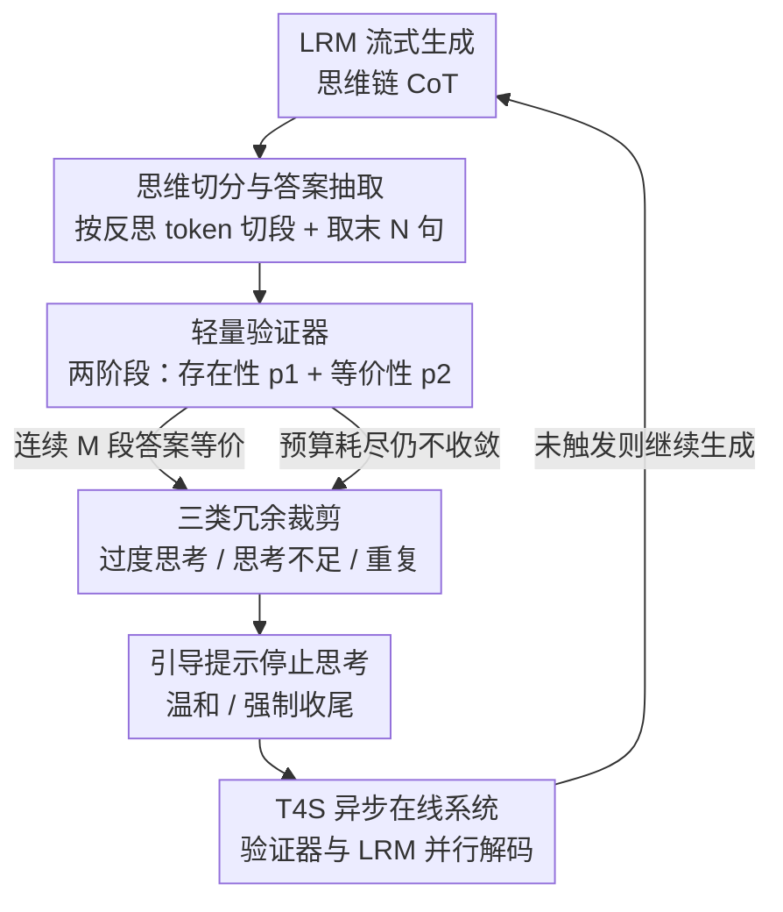

# TrimR：基于验证器、免训练的思维裁剪，用于高效测试时扩展

**会议**: ICLR 2026  
**OpenReview**: [https://openreview.net/forum?id=ofEkphaqg7](https://openreview.net/forum?id=ofEkphaqg7)  
**代码**: 无  
**领域**: LLM效率  
**关键词**: 大推理模型, 测试时扩展, 思维裁剪, 过度思考, 在线推理系统

## 一句话总结
TrimR 用一个免微调的 7B 小验证器，在大推理模型（LRM）生成思维链的过程中实时检测「过度思考 / 思考不足 / 重复」三类冗余，并用引导提示**温和或强制**地让 LRM 提前收尾，在 MATH500、AIME24/25、GPQA 上把 QwQ-32B、R1-Distill-Qwen-32B、Pangu-R-38B 的推理运行时间最高砍掉 70%，而准确率几乎不掉（最多降 1.7%）。

## 研究背景与动机

**领域现状**：OpenAI o1、DeepSeek-R1、QwQ 这类大推理模型（LRM）靠拉长思维链（CoT）做逐步分析、自我纠错、探索多解，从而在数学/科学推理上达到专家级水平。测试时扩展（test-time scaling）进一步在解码阶段做 token 级探索来逼近准确率上界，但代价是巨大的解码开销——运行时间随序列长度**超线性**增长，部署成本高。

**现有痛点**：作者在 AIME24 与 MATH500 上观测到 LRM 有两类结构化的低效。一是**过度思考（overthinking）**：模型其实只用 30~50% 的 token 就已经得到正确答案，却仍不断「Wait」「Alternatively」地反复验证、换着花样重证，长度暴涨但准确率不增。二是**思考不足（underthinking）**：在难题上模型在多条不完整推理链之间来回震荡、迟迟不收敛，吐出又长又错的答案（QwQ 在难题上能甩出多达 140 段冗长却错误的思维）。此外还有 token 层面的**重复循环**，靠调高温度也压不住。

**核心矛盾**：现有省 token 的方案各有硬伤。训练类方法（带长度奖励的 RL、SFT 压缩、latent 推理）要重训大模型，算力贵、易过拟合任务、还可能损伤通用能力；免训练类方法（TokenBudget 动态调预算、Chain of Draft 用简洁指令）虽然无缝接入，但需要**侵入式**地改推理时行为；依赖 PRM/ORM 奖励模型对整条长序列打分的方案，则因为奖励在相同序列上不稳定、且要喂 8K~128K token 而开销巨大。简言之：既要省、又不能重训、不能侵入、还要能上工业级大批量在线服务，是个没被同时满足的组合。

**本文目标**：设计一个**免训练、非侵入、可大批量在线部署**的思维裁剪框架，同时治过度思考和思考不足，让 LRM 在测试时扩展中既快又不掉精度。

**切入角度**：作者把 LRM 推理类比成「语言空间里的数值优化搜索」——人类解简单题找到答案就停、解难题多次失败就放弃；数值优化器则在收敛或边际收益低于阈值时早停。于是只要有一个「验证器」判断推理是否已收敛，就能给出一个安全的停止时刻 $t'$，在不降低性能 $\text{Perf}(X, y_{<t'}\mid\Pi)\ge\text{Perf}(X, y_{<t}\mid\Pi)$ 的约束下最小化推理成本 $\text{Infer\_Cost}(y_{<t'})$。

**核心 idea**：用一个**免微调的轻量指令模型当验证器**，把「检测冗余」这件难事化简成「答案是否存在 + 相邻两段答案是否等价」两个简单的二分类，一旦判定收敛/发散，就用提示让 LRM 提前停下——既不重训 LRM 也不重训验证器。

## 方法详解

### 整体框架
TrimR 在 LRM 在线生成思维链的过程中并行运行一个裁剪系统：每当 LRM 吐出新的反思 token，就把当前思维切成子思维并抽取其中的「中间答案」，交给一个 7B 小验证器判断；验证器只回答两件事——这段话有没有给出答案、相邻两段答案是否等价——据此触发三类裁剪决策（过度思考早停、思考不足强制收尾、重复截断），最后通过注入「引导提示」让 LRM 温和或强制地停止思考、直接给最终答案。整套检测与干预都跑在异步的在线系统 T4S 里，不阻塞 LRM 解码。

### 关键设计

**1. 思维切分与中间答案抽取：把长 CoT 拆成可逐段验证的小单元**

要让一个小模型频繁判断「该不该停」，前提是别让它读整条 8K~128K token 的长序列。作者利用 LRM 思维链本身的结构规律：思维之间几乎总以反思 token 分隔（`\n\nWait`、`\n\nBut`、`\n\nAlternatively` 等），而模型通常在每段思维末尾给出该段的答案再去验证。于是在生成途中按反思 token 把思维切成子思维 $\text{Think\_Seg}(y_{<t})=[r_1, r_2, \dots, r_k]$，再对每段只取**最后 $N_{\text{sent}}$ 句**作为中间答案 $s_l=\text{Last\_sentences}(r_l, N_{\text{sent}})$——末尾几句既短又最可能含答案，极短的无效思维直接跳过。关键在于这一步是**异步**做的：反思 token 只占全部输出的约 0.5%、思维段数又远少于 token 数，所以验证器被调用得很稀疏，可以同时服务多个 LRM 而几乎不拖慢吞吐。这一步把「检测冗余」从「给整条长序列打分」降维成「读几句话做二分类」，是后面所有轻量化的基础。

**2. 两阶段验证：用 7B 指令模型替代 PRM/ORM 做答案存在性 + 等价性二分类**

这是 TrimR 免训练的核心。作者不训练复杂的过程奖励/结果奖励模型（PRM/ORM），而是把检测拆成两个小模型也能胜任的二分类任务，由同一个验证器 $F_v$ 完成。第一阶段**答案存在性检查**：用提示 $p_1$ 判断某段中间答案 $s_i$ 是否真的解出了问题，只保留有结论的思维集合 $S^* = \{ s_i \mid F_v(p_1(s_i)) \}$，其中 $F_v(p_1(s_i)) = \mathbb{I}\big[p_{F_v}(y{=}\text{“Yes”}\mid p_1(s_i)) > p_{F_v}(y{=}\text{“No”}\mid p_1(s_i))\big]$。第二阶段**等价性检查**：用提示 $p_2$ 判断 $S^*$ 里相邻两段是否在数学/逻辑上等价，$r(s^*_i, s^*_{i+1}) = F_v\big(p_2(s^*_i, s^*_{i+1})\big)$。验证器只需对「Yes/No」两个 token 取概率、只做 prefill，不需要解码生成，再加上系统提示和问题的 KV cache 做前缀复用、把答案按三元组批处理，单次输入压到 200~400 token，相比 PRM/ORM 动辄读整条序列省下数量级的显存与算力。之所以有效，是因为「这段有没有答案」「两个答案等不等价」远比「给整条推理打一个连续分」稳定——后者在相同序列上常给出不一致的奖励，反而拖累检测可靠性。

**3. 过度思考 / 思考不足 / 重复三类冗余的裁剪规则：同一套验证信号、三种停止条件**

有了存在性与等价性信号，TrimR 用三条互补规则覆盖三类冗余。**过度思考裁剪**（Algorithm 1）模仿优化器的「多次探索收敛即停」：维护一个计数器，每当新出现的有结论思维与上一段结论等价就 +1、不等价就清零，连续等价达到阈值 $M$ 次（实验用 $M{=}2$，即出现 $M{+}1$ 段一致解）就判定收敛、注入停止提示。**思考不足裁剪**（Algorithm 2）针对难题的来回震荡：若已经用掉 $R_{\text{thres}}\%$ 的 token 预算、跑过 $N_{\text{thres}}$ 轮，模型仍没能产出至少三段一致的有结论链，就判定它陷在发散里、不太可能再突破，强制让它停下并总结现有洞见——这两个阈值要校准好，给模型足够探索空间又不至于无谓空转。**重复截断**则用滚动哈希实时检测重复的 token-ID 子序列，对每个新 token 增量更新哈希、不重算整条，默认开启，专治高温也压不住的死循环。三者共享同一个验证器输出，分别对应「该停不停」「越想越乱」「卡死循环」三种浪费。

**4. 非侵入式引导提示 + 异步在线系统 T4S：只在检测到冗余时温和/强制收尾，且不阻塞解码**

裁剪决策最终要落到「让 LRM 停下来」，作者用两类**引导提示**而非改模型权重或强行截断来实现非侵入。**温和提示**用于过度思考，把模型引导向 `**Final Answer**\n` 收束推理；**强制提示**用于思考不足和重复循环，在 `</think>` 之前就打断、保证不会无尽生成。由于干预只在检测到冗余时才激活，未触发时 LRM 保持原生行为，因此能保住模型原有的推理能力与知识。工程上，这一切由异步系统 **T4S（Test-Time Thinking Trimming System）** 承载：它构建在 vLLM 之上，由 Reasoning Verifier（去 token 化、切链、调用外部小验证器确认解的有效性）、Message Controller（每 $N_{\text{send}}$ 个 token 与验证器交换 prompt 和 token-ID）、Sampling Controller（自适应改 logits 以强制特定 token 生成）三部分组成，检测与干预与 LRM 解码**并行**进行，从而在 Ascend NPU 的大批量在线负载下把验证开销摊薄到可忽略。

### 损失函数 / 训练策略
TrimR 完全**免训练**：既不微调 LRM，也不微调验证器，验证器（默认 Pangu-7B，亦可换 Qwen2.5-7B-Instruct）直接用预训练指令模型 + few-shot 提示工作。整套方法是推理时的算法 + 系统，没有训练目标。关键超参：$M{=}2$（过度思考连续等价阈值）、$N_{\text{send}}{=}50$（验证器通信间隔）、输入/输出长度固定为 2K/30K token。

## 实验关键数据

### 主实验
在 8×Ascend 910B-64GB NPU + vLLM 上，把整个数据集的请求并发提交，记录运行时间与单请求延迟。指标：Runtime（处理全部请求的总墙钟时间）、TPR（平均单请求时间）、TPR-T90（最快 90% 请求的 TPR）、#Tokens（百万级生成 token 数）、Acc.（准确率）。

| 模型 / 数据集 | Runtime | TPR | Acc. | #Tokens |
|--------|------|------|------|------|
| R1Q-32B / MATH500 | 7602s → 2511s（**-67.0%**） | -56.9% | 92.4%（+2.0%） | -40.1% |
| R1Q-32B / GPQA Diamond | 11366s → 3411s（**-70.0%**） | -74.7% | 58.6%（**+13.2%**） | -46.1% |
| R1Q-32B / AIME25 | 13055s → 6169s（-52.7%） | -65.3% | 56.3%（+8.4%） | -38.1% |
| QwQ-32B / MATH500 | 4413s → 3118s（-29.3%） | -15.7% | 96.8%（+1.2%） | -14.3% |
| QwQ-32B / AIME24 | 6992s → 4255s（-39.1%） | -35.5% | 76.6%（±0%） | -23.3% |
| Pangu-R-38B / MATH500 | 3665s → 2426s（-33.8%） | -17.8% | 94.4%（-1.2%） | -18.9% |

三个模型、四个基准全线获得稳定的效率收益（运行时间最高 -70%），准确率几乎不动（最差降 1.7%，多数持平甚至提升）。R1Q-32B 收益最大，因为它本身自我验证最频繁、冗余最多。

与并发基线对比（相对各自 baseline 的准确率变化 / token 缩减）：

| 模型 / 方法 | MATH500 Acc. | MATH500 #Tok. | AIME24 Acc. | AIME24 #Tok. |
|------|------|------|------|------|
| R1Q-32B / Certaindex | -4.0% | -19.0% | -4.0% | -15.0% |
| R1Q-32B / CoThink | -2.0% | -36.6% | **-13.3%** | -12.5% |
| R1Q-32B / SpeedAdapt | +0.7% | -7.3% | +1.5% | -12.7% |
| R1Q-32B / **TrimR** | **+2.4%** | **-40.1%** | **+3.3%** | **-35.6%** |

CoThink 虽省 token 但 AIME24 上准确率暴跌 13.3%；SpeedAdapt 保精度却只省 4~9%；TrimR 在「省得多」和「不掉精度」之间取得最佳平衡。

### 消融实验

| 配置（R1Q-32B / MATH500） | TPR | #Tokens | Accuracy |
|------|---------|------|------|
| baseline | - | - | 90.4% |
| w/ 仅过度思考裁剪 | -43.5% | -28.1% | 91.6% |
| w/ 仅思考不足裁剪 | -41.4% | -25.0% | 92.8% |
| w/ both（完整） | **-56.9%** | **-40.1%** | 92.4% |

验证器消融（MATH500，Verifier Acc. 为相邻链对判定的人工标注准确率）：

| 验证器 | Verifier Acc. | Runtime | MATH500 Acc. | #Tokens |
|------|------|---------|------|------|
| Pangu-7B（默认） | 87.87% | 3665s | 95.6% | 1.912M |
| Pangu-7B w/o 上下文样例 | 85.67% | 3894s | 95.6% | 2.032M |
| Qwen2.5-7B-Instruct | 86.70% | 3722s | 95.0% | 1.982M |

### 关键发现
- **两类裁剪互补、合起来最强**：过度思考裁剪和思考不足裁剪单用各有约 -41~-44% TPR，合用能叠到 -56.9% 且准确率仍保在 92.4%，说明两类冗余确实是不同问题，需要双管齐下。
- **冗余越多的模型收益越大**：R1Q-32B 因频繁自我验证而 token 用量高，裁剪收益（GPQA -70% 运行时间）远超本就简洁的 QwQ-32B。
- **裁剪还能反向提精度**：在 GPQA 上 R1Q-32B 准确率从 45.4% 涨到 58.6%（+13.2%），说明砍掉发散的思考不足链不仅省钱，还避免了模型「越想越错」。
- **验证器选择不敏感**：Pangu-7B 略优于 Qwen2.5-7B，但下游准确率几乎一致（95.6% vs 95.0%）；去掉验证器提示里的 in-context 样例只让运行时间和 token 略增，说明方法对验证器的具体选型相当鲁棒。
- **分布左移**：QwQ-32B 上 0~5K token 的样本占比从约 64% 升到近 70%，≥10K 的长样本减少超 25%，20~32K 的最重尾从约 6% 降到不足 2%。

## 亮点与洞察
- **把「检测冗余」化简为两个二分类**是最巧的一步：用「答案存在性 + 等价性」两个 Yes/No 判断替代 PRM/ORM 对整条长序列打连续分，既能用免微调的 7B 小模型胜任，又避开了奖励模型在相同序列上打分不稳的老毛病。
- **只做 prefill、不解码 + 前缀缓存 + 三元组批处理**：验证器只对 Yes/No 取概率，单次输入压到 200~400 token，把检测开销摊到几乎为零，这是它能上工业级大批量在线服务的关键工程细节。
- **过度思考与思考不足用同一套验证信号、两个相反的停止条件**（连续等价→收敛即停 vs 久不收敛→强制收尾），把「该停不停」和「越想越乱」统一在一个优化早停的视角下，思路可迁移到任何带迭代探索的生成场景。
- **非侵入**：干预只在检测到冗余时激活、靠注入提示而非改权重/硬截断实现，保住了 LRM 原生能力，这让它能直接插进现有推理框架。

## 局限与展望
- 方法强依赖 LRM 思维链以反思 token 规律分段、且「末尾几句含答案」的结构假设；对不遵循这种结构、或反思 token 稀少的模型，切分与抽取可能失效。
- 评测集中在数学/科学推理（MATH500、AIME、GPQA），代码任务（LiveCodeBench）仅作附录补充；在开放域、多轮对话等答案难以做「等价性」判定的任务上效果未知。
- 阈值 $M$、$R_{\text{thres}}$、$N_{\text{thres}}$ 需要按模型/任务校准，过松会过早截断、损失难题精度；论文把阈值消融放在附录，正文未充分展开其敏感性。
- 引入外部验证器虽轻量，但仍是一套需要与 LRM 并行调度的额外服务，部署复杂度高于纯 prompt 类方法；其收益也部分取决于底层硬件/框架（Ascend NPU + vLLM）的异步能力。

## 相关工作与启发
- **vs 训练类高效推理（长度奖励 RL / SFT 压缩 / latent 推理）**：它们改模型权重来生成简洁推理，算力贵、易过拟合、可能伤通用能力；TrimR 完全免训练、非侵入，保住原模型行为，代价是推理时多挂一个验证器。
- **vs PRM/ORM 奖励模型早停（Speculative Rejection、Dynasor）**：它们靠对整条/部分输出打分来终止搜索，重度依赖奖励模型质量、且要喂长序列；TrimR 把打分换成两个轻量二分类，省算力又更稳定。
- **vs 自评估类方法（SelfThink、ST-BoN、NoThink、AlphaOne）**：它们让 LRM 自己评估置信度并决定何时停，无需外部模型但会插入额外推理步、带来延迟；TrimR 用外置小验证器异步判断，不在 LRM 主链上加步骤，更易无缝接入现有推理框架。
- **vs TokenBudget / Chain of Draft 等免训练 prompt 方法**：它们也免训练，但需要侵入式地改推理时的 prompt/预算；TrimR 仅在检测到冗余时才注入停止提示，未触发时不干预，侵入性更低。

## 评分
- 新颖性: ⭐⭐⭐⭐ 把冗余检测化简为「存在性+等价性」二分类、用免微调小验证器替代 PRM/ORM，角度清晰实用。
- 实验充分度: ⭐⭐⭐⭐ 三模型四基准 + baseline 对比 + 双裁剪/验证器消融，但代码等非数学任务仅附录补充。
- 写作质量: ⭐⭐⭐⭐ 把算法、系统、优化类比讲得清楚，图 1 流程信息密但稍杂。
- 价值: ⭐⭐⭐⭐⭐ 免训练、非侵入、可大批量在线部署，最高省 70% 运行时间且不掉精度，工业落地价值高。

<!-- RELATED:START -->

## 相关论文

- [\[ICLR 2026\] Scaling Up, Speeding Up: A Benchmark of Speculative Decoding for Efficient LLM Test-Time Scaling](scaling_up_speeding_up_a_benchmark_of_speculative_decoding_for_efficient_llm_tes.md)
- [\[ICLR 2026\] Understanding and Improving Length Generalization in Hierarchical Sparse Attention Models](understanding_and_improving_length_generalization_in_hierarchical_sparse_attenti.md)
- [\[ICLR 2026\] FlashDLM: Accelerating Diffusion Language Model Inference via Efficient KV Caching and Guided Diffusion](flashdlm_accelerating_diffusion_language_model_inference_via_efficient_kv_cachin.md)
- [\[ICLR 2026\] On-the-Fly Adaptation to Quantization: Configuration-Aware LoRA for Efficient Fine-Tuning of Quantized LLMs](on-the-fly_adaptation_to_quantization_configuration-aware_lora_for_efficient_fin.md)
- [\[ICLR 2026\] Semantic Parallelism: Redefining Efficient MoE Inference via Model-Data Co-Scheduling](semantic_parallelism_redefining_efficient_moe_inference_via_model-data_co-schedu.md)

<!-- RELATED:END -->
