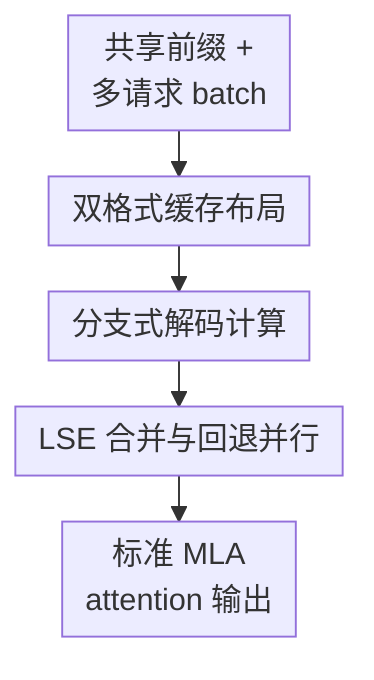

# TyphoonMLA: A Mixed Naive-Absorb MLA Kernel For Shared Prefix

**会议**: ICLR2026  
**OpenReview**: [https://openreview.net/forum?id=ZfCCwJ4Wcs](https://openreview.net/forum?id=ZfCCwJ4Wcs)  
**代码**: https://github.com/huawei-csl/TyphoonMLA-community  
**领域**: LLM效率  
**关键词**: MLA推理, shared prefix, attention kernel, KV-cache, 解码加速  

## 一句话总结
TyphoonMLA 发现 shared prefix 场景下 MLA 解码的共享段更适合用 naive 计算、非共享段仍适合用 absorb 计算，于是把同一次 attention 拆成两路 kernel 并用 LSE 合并，在不改模型精度和不训练的前提下，把 MLA attention 吞吐最高提升到约 $3.24\times$，端到端 token 生成率最高提升 $1.48\times$。

## 研究背景与动机
**领域现状**：DeepSeek-v2/v3、Kimi K2 这类模型使用 Multi-Head Latent Attention（MLA）来降低 KV-cache 的存储和带宽压力。MLA 的特殊之处在于 K/V 先被压到低秩 latent space，再通过 up-projection 恢复；由于矩阵乘法可重排，同一个 MLA attention 可以写成两种等价实现：prefill 和训练常用 naive 形式，decode 常用 absorb 形式。

**现有痛点**：naive 会把 KV-cache 展开成多头的 K/V，因此 self-attention 的算子形式接近普通 MHA，计算量低、容易复用 FlashAttention 一类优化，但 HBM 读写重；absorb 把 up-projection 吸收到 query/output 侧，KV-cache 保持压缩，HBM 压力小，却让 query 侧维度变大，attention 计算更重。现有 MLA decode kernel 主要选择 absorb，因为普通单请求或短共享上下文下 decode 更容易被 HBM 带宽卡住。

**核心矛盾**：shared prefix 改变了瓶颈。系统 prompt、Tree-of-Thought、多候选 speculative decoding 等场景会让很多请求同时 attend 到同一段 KV-cache。对这段共享 KV 来说，HBM 读取可以被多条 query 分摊，naive 原本最吃亏的带宽成本不再随 batch 线性增长；相反，absorb 在共享段上仍要为每条 query 做更重的 MAC，进入 compute-bound 后无法从数据复用中获益。

**本文目标**：论文要解决的不是“MLA 是否比 MHA 省 cache”，而是更细的 kernel 选择问题：同一层 MLA decode 里，共享前缀和非共享用户上下文的硬件瓶颈不同，能不能分别选更合适的实现，既吃到 shared prefix 的复用，又不牺牲 MLA 在非共享段上的低带宽优势。

**切入角度**：作者把 attention 按 shared prefix 和 non-shared context 拆开做 roofline / 复杂度分析。结论很直接：共享段在 batch 足够大时 naive 的 MAC 更少，非共享段则 absorb 的 HBM 读写小得多。因此“只选 naive”或“只选 absorb”都不是最优，应该在同一个 MLA kernel 中混合两者。

**核心 idea**：TyphoonMLA 用双格式 KV-cache 表示同一段上下文：共享前缀展开成 uncompressed K/V 走 naive 分支，非共享上下文保留 latent PE/noPE cache 走 absorb 分支，再把两段 attention 的 softmax 结果用 log-sum-exp 对齐后合并。

## 方法详解
### 整体框架
TyphoonMLA 面向有共享前缀的 MLA 推理服务。输入是一批带共同 system prompt 或共享推理树前缀的请求；输出仍是标准 MLA attention 的结果，数学上等价于纯 naive 或纯 absorb，不需要重新训练模型，也不会改变 logits。

整体流程分成 prefill 和 decode 两段。prefill 时，系统先用 prefix-aware naive kernel 处理共享前缀和用户 prompt，并顺手把共享前缀对应的 latent cache up-project 成 uncompressed K/V；decode 时，同一个 query 会被送入两条 attention 路径：共享前缀走 naive，非共享上下文走 absorb，最后用 LSE 合并两个 partial output。

**双格式缓存布局** 指 prefill 之后不再只保留一种 KV-cache：shared prefix 存成展开后的 $C_K, C_V$，non-shared 部分仍存成 latent 形式 $C_N, C_R$。这一步让后续 decode 可以按上下文区域选择 kernel，而不是被一个全局实现绑死。

**分支式解码计算** 是核心 kernel：query 先经过 MLA decode 共有的投影、RMSNorm、RoPE 等步骤，然后在共享段用 naive attention，在非共享段用 absorb attention。两条分支算的是同一个 query 对不同上下文切片的注意力贡献。

**LSE 合并与回退并行** 负责把两段 softmax 放回同一个归一化空间，并在 batch 太小时退回 absorb-only。这样 TyphoonMLA 不会为了共享段的 naive 分支，在数据复用不足时反而付出额外 HBM 成本。

### 关键设计
**1. 双格式缓存布局：把共享前缀展开，把非共享上下文压缩**

传统 MLA decode 的 absorb 路径把所有 KV-cache 都放在 latent space 中，读取量低，但共享前缀的计算仍然按每条 query 重复发生。TyphoonMLA 的第一步是改变缓存布局：prefill 时仍然会执行 up-projection，所以作者把 shared prefix 对应的缓存顺势保存为 uncompressed $C_K, C_V$；而每个请求自己的后续 token 仍保存为 compressed 的 noPE / RoPE latent cache $C_N, C_R$。

这个设计的关键是“只展开值得复用的那一段”。如果把全部 KV-cache 都展开，TyphoonMLA 会退化成 naive MLA，非共享部分的 HBM 读写会很高；如果全部保持压缩，又无法让共享段从 naive 的低 MAC 中获益。双格式缓存带来约 $3\%$ HBM 额外开销，因为共享前缀在大 batch、大上下文部署里只占 KV-cache 的一小部分，却换来了对共享段选择更低计算量 kernel 的自由。

**2. 分支式解码计算：共享段用 naive 减 MAC，非共享段用 absorb 省带宽**

TyphoonMLA 的 decode kernel 输入包括 query $Q$、共享段展开缓存 $C_K, C_V$、非共享段 latent cache $C_N, C_R$，以及 MLA 的两个 KV up-projection 矩阵 $W_{KVb1}, W_{KVb2}$。它先把 $Q$ 拆成 noPE 和 RoPE 两部分，RoPE 后拼回 $Q_K$，共享分支直接算 $\mathrm{softmax}(Q_K C_K^\top) C_V$；非共享分支则沿用 absorb 形式，先用 $W_{KVb1}$ 把 query 投到适合 latent cache 的空间，再算 $\mathrm{softmax}(Q_A C_N^\top + Q_R C_R^\top) C_N$，最后通过 $W_{KVb2}$ 把输出投回 value 维度。

论文的复杂度分析解释了为什么这种拆法有效。以 DeepSeek-v3 参数代入，naive 在共享和非共享两段都需要约 $(40\times B L_s + 40\times B L_n)\times1024$ 的 MAC，但 HBM 读取也高；absorb 的 HBM 读取低到约 $(0.56\times L_s + 0.56\times B L_n)\times1024$，但 MAC 是 $(136\times B L_s + 136\times B L_n)\times1024$。TyphoonMLA 组合后变成共享段 naive、非共享段 absorb，即 MAC 约为 $(40\times B L_s + 136\times B L_n)\times1024$，HBM 读取约为 $(40\times L_s + 0.56\times B L_n)\times1024$。换句话说，它在 compute-bound 的共享段少做 $3.4\times$ 级别的计算，在 memory-bound 的非共享段保留 absorb 的低带宽特性。

**3. LSE 合并与回退并行：保证等价性，也避免小 batch 反噬**

attention 不能简单把两段输出相加，因为 softmax 的分母应该覆盖完整上下文。TyphoonMLA 因此让 naive 分支和 absorb 分支各自产出 partial output，同时返回对应的 log-sum-exp 统计量 $l_N$ 和 $l_A$；最后用类似 FlashAttention epilogue 的 CombineLSE，把两段 softmax denominator 对齐到同一个归一化尺度后再合并输出。这个合并只依赖 query/output 维度，不随 KV 序列长度增长，因此在长上下文下开销很小。

作者还给出 batch-size threshold $B_\theta$ 来决定什么时候值得启用 mixed kernel。共享段 naive 的优势成立条件是“读取共享 K/V 的时间小于 absorb 计算共享段的时间”，由此得到 $B_\theta = \frac{D_{qk}+D_v}{S_q(2D_l+D_r)}\frac{T}{M}$，其中 $T$ 是硬件算力、$M$ 是 HBM 带宽。代入 DeepSeek-v3 和 Ascend NPU 后阈值约为 $61$，所以小于阈值时 TyphoonMLA 直接回退到 absorb-only；大于阈值时才启用 mixed naive-absorb。并行化上，它仍能对展开 K/V 做 head 维度 tensor parallel，对两种 cache 做 sequence parallel，因此可以接入 vLLM、SGLang、PagedAttention、RadixAttention 一类服务框架。

### 一个完整示例
假设一个推理服务有长度 $4096$ 的系统 prompt，当前 batch 里有 $128$ 个请求，每个请求已经生成或携带 $512$ 个非共享 token。普通 absorb-only MLA 会把 $4096+512$ 的上下文都放在 latent cache 上算；shared prefix 虽然只读一次的潜力很大，但 absorb 分支仍要为 $128$ 个 query 在共享段上做较重的 MAC。

TyphoonMLA 的 prefill 会把 $4096$ 个共享 token 的 cache 展开成 $C_K, C_V$，同时保留每个请求自己的 $512$ token latent cache。decode 一个 step 时，query 先走共同投影；面对 $4096$ 个共享 token，它用 naive 分支读展开 K/V，因为这段读取可以在 batch 内复用，计算量也小；面对 $512$ 个非共享 token，它用 absorb 分支读 latent cache，因为这段没有跨请求复用，低 HBM 读取更重要。两段分数各自 softmax 后，通过 LSE 合并成完整上下文上的 attention 输出。

这个例子也解释了为什么 TyphoonMLA 的收益依赖共享前缀长度和 batch size。系统 prompt 越长，shared prefix 在总 attention 中占比越高；batch 越大，naive 共享段的内存读取越容易被摊薄。反过来，若 batch 很小或共享段很短，回退到 absorb-only 更稳。

### 损失函数 / 训练策略
TyphoonMLA 不涉及新的损失函数，也不需要重新训练或微调模型。它是一个推理 kernel / 执行策略改动，目标是在保持 MLA 数学等价性的前提下重排缓存格式和 attention 计算路径。

如果把它看作部署策略，唯一需要调的不是训练超参，而是 batch 阈值 $B_\theta$。这个阈值由模型维度和硬件的算力/带宽比决定：硬件算力越高、带宽越相对紧张，阈值可能越高；共享段越长、query batch 越大，mixed kernel 越容易胜过 absorb-only。

## 实验关键数据
### 主实验
论文在 Ascend NPU 和 GPU 上分别实现 TyphoonMLA，并用 DeepSeek-v3、Kimi K2、三种真实泄露/公开系统 prompt 长度，以及 MMLU、GSM8K、SimpleQA 做 decode benchmark。结果的核心不是某一个数据集的准确率，而是每层 attention 或端到端解码吞吐。

| 平台 / 设置 | Baseline | 模型与数据 | 主要指标 | TyphoonMLA 结果 | 提升 |
|--------|------|------|------|------|------|
| Ascend NPU, batch 64-1024 | TorchNPU PagedAttentionMLA / CATLASS Absorb | DeepSeek-v3、Kimi K2 + MMLU/GSM8K/SimpleQA | 每层生成 token 吞吐 | 所有 prompt、数据集、batch 下均高于 baseline | 约 $1.2\times$ 到 $3.0\times$ |
| GPU, batch 64-1024 | FlashMLA / FlashInfer absorb | DeepSeek-v3、Kimi K2 + 三类 prompt | 每层 kToken/s | Prompt A 和 Kimi K2 上收益最大 | 最高 $3.24\times$ |
| 128 GPU 估算端到端, DeepSeek-v3, MMLU, batch 128/GPU | FlashMLA | Prompt A, B, C | Token generation rate | Prompt A: 1.48 kToken/s；Prompt B: 2.37 kToken/s；Prompt C: 2.56 kToken/s | 最高 $1.48\times$ |

端到端表格更能说明“attention kernel 加速是否真的能传到整机吞吐”。在 DeepSeek-v3 + MMLU + batch 128/GPU 下，Prompt A 的 FlashMLA attention time 是 $99.1$ ms，总迭代时间 $127.2$ ms，TGR 为 $1.01$ kToken/s；TyphoonMLA 把 attention time 降到 $58.1$ ms，总时间降到 $86.3$ ms，TGR 升到 $1.48$ kToken/s。Prompt B 和 C 的 attention 占比更低，端到端提升也相应较小，但仍从 $2.04$ / $2.33$ kToken/s 提升到 $2.37$ / $2.56$ kToken/s。

### 消融实验
论文没有用模型精度式 ablation，而是通过 latency breakdown、batch sensitivity 和 HBM footprint 分析验证每个设计的作用。下面把这些分析按“去掉某个机制会发生什么”整理成消融视角。

| 配置 / 分析对象 | 关键指标 | 说明 |
|------|---------|------|
| CATLASS absorb-only, Kimi K2, shared 4096 + non-shared 512, batch 1024 | attention 计算 $6.43$ ms | 共享段仍按 absorb 做重计算，compute-bound 成为主要瓶颈 |
| TyphoonMLA naive 共享分支 | $1.63$ ms | 对 shared prefix 使用 naive 后，估算共享段相对 absorb 约 $5.37/1.63=3.3\times$ 更快 |
| TyphoonMLA absorb 非共享分支 | $1.06$ ms | 非共享段沿用 absorb，避免 naive 在没有复用时的高 HBM 读取 |
| CombineLSE | 序列长度无关的小向量开销 | 只读写 $2BS_qHD_v$ 量级数据，不随 KV 长度增长，长上下文下不是瓶颈 |
| HBM footprint, DeepSeek-v3 FP8, 384 NPU 部署估算 | 额外约 $0.25$ GB / device，约 $3\%$ | shared prefix 展开带来少量额外缓存，但相对模型权重和非共享 KV-cache 很小 |

### 关键发现
- Prompt 越长，TyphoonMLA 越有优势。Prompt A 有 $26472$ tokens，显著长于 Prompt B 的 $7069$ 和 Prompt C 的 $4759$，因此共享段占比更高，NPU/GPU 上都更容易打出最大 speedup。
- Kimi K2 的收益通常高于 DeepSeek-v3。论文解释为 Kimi K2 的 attention heads 数量是 $64$，约为 DeepSeek-v3 的一半，使其性能更受 shared prefix 数据复用影响。
- batch size 是开关条件，而不是越小越好。附录中 shared prefix 长度 $4096$、query length $128$ 的 NPU profiling 显示，在 batch 约 $64$ 之后 naive 共享段才开始明显快过 absorb；batch 不足时 TyphoonMLA 回退 absorb-only，避免负收益。
- 端到端收益小于 attention 层收益是合理的。MoE、通信和其他线性层没有被 TyphoonMLA 改动，因此 attention 层 $3\times$ 级别提升传到完整解码时变成最高 $1.48\times$，这反而说明论文对系统瓶颈的估计比较诚实。

## 亮点与洞察
- TyphoonMLA 最巧的地方是没有把 naive 和 absorb 当成二选一，而是按上下文区域拆开。shared prefix 不是普通的“缓存命中”，它会改变 roofline 上的 operational intensity，使原本带宽吃亏的 naive 在共享段反而变成更优选择。
- 论文把 kernel 设计和服务场景连得很紧。系统 prompt、tree/graph reasoning、speculative decoding 都会自然产生共享前缀；这意味着 TyphoonMLA 不是只为 synthetic benchmark 优化，而是瞄准真实 LLM serving 中越来越常见的长系统提示和并行候选生成。
- 数学等价性降低了部署门槛。它不改模型参数、不改训练数据、不引入近似 attention，因此不会带来重新评测模型能力或安全性的成本，主要风险集中在 kernel 工程正确性和调度策略上。
- “双格式 cache”是可迁移的系统设计思路。对其他有多种等价 kernel 形态的架构，也可以按上下文片段或 batch 复用程度选择表示格式，而不是为整个序列固定一种缓存布局。

## 局限与展望
- TyphoonMLA 的收益依赖 shared prefix。若服务场景主要是短 prompt、低 batch、请求之间几乎没有共享上下文，它会频繁回退到 absorb-only，优势有限。
- 论文虽然说明兼容 PagedAttention、RadixAttention、tensor/sequence parallelism，但实验主要展示 kernel 和估算端到端吞吐，真正接入 vLLM/SGLang 后的调度开销、cache 生命周期管理、混部场景稳定性还需要更完整的系统评测。
- 双格式缓存要求 prefill 阶段识别共享前缀并保留展开 K/V。对动态 prompt、局部共享、树形共享较复杂的任务，如何选择哪些节点展开、何时释放展开 cache，会影响实际内存收益。
- batch 阈值 $B_\theta$ 来自模型维度和硬件规格，但真实服务中 batch shape、sequence length、page fragmentation 会不断变化。后续可以做自适应 runtime profiling，而不是只用静态阈值。
- 论文只评估 DeepSeek-v3 和 Kimi K2 两类 MLA 模型。未来如果 MLA 变体改变 latent rank、RoPE/noPE 维度或 head 组织方式，TyphoonMLA 的 break-even 点可能需要重新推导。

## 相关工作与启发
- **vs FlashMLA / ThunderMLA**: 这些工作主要把 absorb-only MLA decode kernel 做得更快，优势是低 HBM 读取和针对 MLA 的专门实现；TyphoonMLA 的区别是显式利用 shared prefix，在共享段不用 absorb，而用 naive 降低 compute-bound 区域的 MAC。
- **vs FlashAttention / FlashInfer**: FlashAttention 系列解决的是普通 attention 的 IO-aware tiling 和高效模板化实现，naive MLA 可以复用它们的思想；TyphoonMLA 更像是在 MLA 特有的 naive/absorb 等价性上做调度，把 FlashAttention 类能力只放到共享段。
- **vs Hydragen / SGLang / RadixAttention**: 这些系统强调共享前缀的 KV-cache 管理和批处理复用，主要服务 MHA/GQA 或通用 LLM serving；TyphoonMLA 可以和它们互补，因为它解决的是 MLA attention kernel 在 shared prefix 下的计算形式选择。
- **vs FastTree / FlashForge / prefix-aware MHA/GQA kernels**: 这些方法通过树形 KV-cache 或 prefix-aware attention 减少 HBM 访问，而 TyphoonMLA 指出 MLA decode 的瓶颈经常不是 HBM 而是计算量，所以优化目标从“少读”转成“共享段少算”。

## 评分
- 新颖性: ⭐⭐⭐⭐⭐ 把 MLA 的 naive/absorb 等价性和 shared prefix 的数据复用结合起来，是一个很干净的 kernel 选择观察。
- 实验充分度: ⭐⭐⭐⭐ 覆盖 NPU、GPU、两种 MLA 模型、三类 prompt 和端到端估算，但真实 serving 框架集成实验还可以更完整。
- 写作质量: ⭐⭐⭐⭐ 动机、复杂度分析和 profiling 对得上，读者能清楚看到为什么 shared prefix 会翻转 naive/absorb 的优劣。
- 价值: ⭐⭐⭐⭐⭐ 对长系统 prompt、多分支推理和 speculative decoding 的 MLA 服务很实用，且不需要训练或牺牲精度，部署吸引力高。

<!-- RELATED:START -->

## 相关论文

- [\[ICLR 2026\] PrefixMemory-Tuning: Modernizing Prefix-Tuning by Decoupling the Prefix from Attention](prefixmemory-tuning_modernizing_prefix-tuning_by_decoupling_the_prefix_from_atte.md)
- [\[ICLR 2026\] Sequential Parallel Duality in Prefix Scannable Models](sequential_parallel_duality_in_prefix_scannable_models.md)
- [\[ICLR 2026\] FSA: An Alternative Efficient Implementation of Native Sparse Attention Kernel](fsa_an_alternative_efficient_implementation_of_native_sparse_attention_kernel.md)
- [\[ICLR 2026\] Understanding the Mixture-of-Experts with Nadaraya-Watson Kernel](understanding_the_mixture-of-experts_with_nadaraya-watson_kernel.md)
- [\[ICLR 2026\] Long-Context Attention Benchmark: From Kernel Efficiency to Distributed Context Parallelism](long-context_attention_benchmark_from_kernel_efficiency_to_distributed_context_p.md)

<!-- RELATED:END -->
