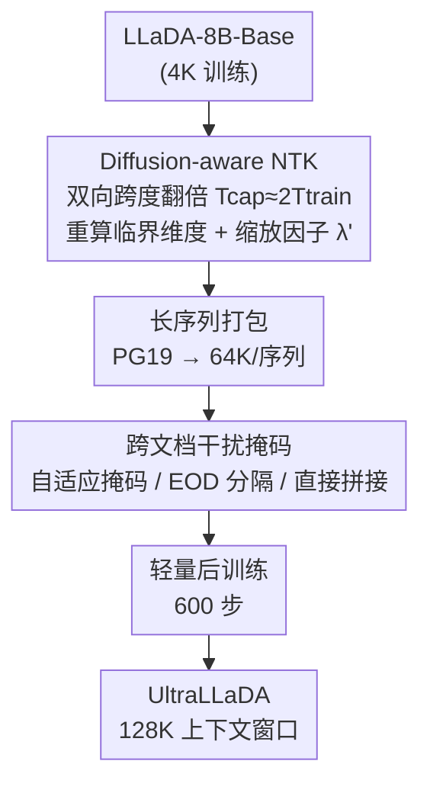

# UltraLLaDA: Scaling the Context Length to 128K for Diffusion Large Language Models

**会议**: ICLR 2026  
**OpenReview**: [https://openreview.net/forum?id=68DGlhlvD9](https://openreview.net/forum?id=68DGlhlvD9)  
**代码**: 无  
**领域**: LLM效率 / 扩散语言模型 / 长上下文  
**关键词**: 扩散语言模型, 长上下文扩展, RoPE, NTK, 后训练

## 一句话总结
本文针对扩散语言模型（diffusion LLM）的长上下文扩展问题，提出一个考虑扩散双向注意力特性的 Diffusion-aware NTK 位置编码缩放方法，再配合抑制跨文档干扰的掩码后训练，把 LLaDA-8B 的上下文窗口从 4K 轻量扩展到 128K（仅 600 步训练），在 NIAH/PPL/LongBench/RULER 上大幅超过免训练基线 LongLLaDA。

## 研究背景与动机

**领域现状**：扩散语言模型用「整段序列迭代去噪」替代自回归的逐 token 生成，具备双向全局上下文感知、灵活条件控制等潜在优势，LLaDA、Dream 等开源模型已能和 LLaMA3-8B、Qwen2.5-7B 掰手腕。但一个关键问题几乎没人碰：**怎么把扩散 LLM 的上下文窗口扩到远超训练长度（如 128K）？**

**现有痛点**：自回归 LLM 的长上下文扩展已有 PI、NTK-aware、YaRN 等成熟方法，但它们都是为单向因果注意力设计的。扩散方向上唯一的尝试是 LongLLaDA，它直接把自回归用的 NTK RoPE 外推**原封不动搬到扩散 LLM 上、且免训练**。结果是：扩散 LLM 虽然不像自回归那样在超长时 PPL 直接爆炸，却表现出「局部感知」偏置——给它一个超过训练长度的上下文，它只用最近一段（如最后 4K）的信息，把前面的内容全忽略。实验里 LongLLaDA 过了 32K 就直接失效。

**核心矛盾**：LongLLaDA 沿用了自回归的关键假设——用同一个训练长度 $T_\text{train}$ 去估计 NTK 缩放的「临界维度」和缩放因子。但扩散 LLM 是**双向注意力**：每个 token 在训练时既看左又看右，等效学到的相对位置范围是 $[-(T_\text{train}-1),\, T_\text{train}-1]$，覆盖跨度约为自回归的两倍。直接套自回归公式，等于**同时低估了临界维度和缩放因子**，扩散模型本该有的长上下文潜力没被释放。

**本文目标**：(Q1) 怎么从自回归现成方法出发、改造出真正适配扩散 LLM 的上下文扩展方法；(Q2) 相比免训练的 LongLLaDA，基于后训练的方法能带来多大性能提升。

**核心 idea**：把 NTK 缩放里的「有效相对跨度」按扩散双向注意力翻倍（$T_\text{cap}\approx 2T_\text{train}$），得到一个更保守、更长波长的 RoPE 缩放因子；再用抑制跨文档干扰的掩码做轻量后训练，让模型真正适配长序列。

## 方法详解

### 整体框架
UltraLLaDA 的目标是：拿一个只在 4K 上下文训练过的扩散 LLM（LLaDA-8B-Base），通过**轻量后训练**把它的有效上下文窗口推到 128K，而不重新从头训练。整条流水线分两个互补的支柱：第一支柱是**位置编码层面**的 Diffusion-aware NTK，先把 RoPE 重新缩放到能覆盖目标长度；第二支柱是**数据/注意力层面**的掩码策略，解决长序列打包时不同文档相互串扰的问题。两者叠加后，只用 600 步在 PG19 长文上后训练，就得到 UltraLLaDA。

### 关键设计

**1. Diffusion-aware NTK：让 RoPE 缩放认账「双向注意力把相对跨度翻倍」**

这是全文的核心杠杆，针对的正是 LongLLaDA 「直接套自回归 NTK」的错误假设。标准 NTK-aware 缩放把 RoPE base 乘一个全局因子，临界维度 $d_\text{crit}$ 由训练长度决定：$d_\text{crit}=2\lceil \frac{d}{2}\log_b \frac{T_\text{train}}{2\pi}\rceil$，缩放因子 $\lambda_\text{baseline}=b^{-1}\cdot(\frac{T_\text{target}}{2\pi})^{d/d_\text{crit}}$。问题在于这里的 $T_\text{train}$ 隐含「单向注意力」假设。

本文的洞察是：扩散 LLM 双向注意力让每个 token 在训练时同时看左右两侧，学到的相对位置实际覆盖约 $2T_\text{train}$。于是作者引入两个新量——$T_\text{cap}$（预训练中学到的最大相对跨度）和 $T_\text{Ecap}$（扩展后所需的相对跨度），并令 $T_\text{cap}\approx 2T_\text{train}$、$T_\text{Ecap}\approx 2T_\text{target}$（自回归则是 $T_\text{cap}\approx T_\text{train}$）。据此重新定义临界维度与缩放因子：

$$\lambda' = b^{-1}\cdot\left(\frac{T_\text{Ecap}}{2\pi}\right)^{d/d'_\text{crit}},\qquad d'_\text{crit}=2\left\lceil \frac{d}{2}\log_b \frac{T_\text{cap}}{2\pi}\right\rceil$$

直观效果是：降低角频率、拉长所有维度上的 RoPE 周期，让原本「训练充分」的临界维度也能覆盖扩展后的相对跨度。和基线相比，扩散感知版给出**更大的临界维度、更保守（更小）的 $\lambda'$**——例如 8B LLaDA（$T_\text{train}=4$K）下基线 $d_\text{crit}\approx 64$（周期约 4K），本文 $d'_\text{crit}\approx 70$（周期约 8K）。免训练消融已证明仅这一改动就能降 PPL、提升 NIAH/LongBench 分数，说明把双向覆盖纳入位置外推是关键。

**2. 跨文档干扰掩码：把长序列打包后「文档间的乱串」堵住**

扩展位置编码后，还要在长上下文数据上后训练。作者按 NTK 打包策略从 PG19 构造序列——短文档拼到 64K，长文档切成连续 64K 段。但这里有个扩散 LLM 特有的麻烦：自回归的严格因果注意力天然限制了不相关段落之间的交互，而扩散是**全局双向注意力**，任意 token 能和任意 token 互动，拼在一条序列里的多个无关文档会越过边界相互污染，导致生成内容把不相干的语料糅在一起、变得不连贯。

为此作者系统比较了三种打包/注意力策略：(i) **自适应注意力掩码**——为每条打包序列构造文档感知掩码，只允许同一原始文档内部做完整注意力，跨文档注意力一律置 0，既挡住串扰又保留文档内双向性；(ii) **EOD 拼接**——在文档之间插入特殊的文档结束 token，注意力仍是完整双向、不加硬掩码，靠这个可学习的边界符让模型自己学会「别跨过 EOD 混信息」；(iii) **直接拼接**（基线）——文档背靠背拼接、无边界 token、完整双向注意力，最易受最大化的跨文档干扰。实验上自适应掩码和 EOD 都能显著抑制串扰、生成更连贯，其中自适应掩码略优；直接拼接常产出语无伦次的结果。最终 UltraLLaDA 采用 Diffusion-aware NTK + 自适应掩码（或 EOD）的组合。

### 损失函数 / 训练策略
模型沿用掩码扩散语言模型的标准目标：对噪声水平 $t\in[0,1]$，前向过程以概率 $t$ 把每个 token 替换为掩码 token，训练时最小化被掩码位置的负对数似然上界 $-\mathbb{E}_{t,x_0,x_t}\big[\sum_{\{i\mid x_t^i=m\}}\log p_\theta(x_0^i\mid x_t)\big]$。后训练极其轻量：仅 **600 步**长上下文数据，打包长度 64K，初始化全部来自同一个 LLaDA-8B base，评测时用确定性解码以消除采样方差。

## 实验关键数据

四个压测长上下文能力的基准（最长 128K）：PPL-128K（PG19 上的去噪似然困惑度）、NIAH-128K（大海捞针检索）、LongBench-16K、RULER-32K。所有方法同用 8B LLaDA 初始化；UltraLLaDA 后训练 600 步，LongLLaDA 为免训练 RoPE 外推。

### 主实验

| 基准 | 指标 | LLaDA-8B-Base | LongLLaDA | UltraLLaDA |
|------|------|------|------|------|
| PPL @128K | 困惑度↓ | 343.88 | N/A（>32K 失效） | **10.45** |
| PPL @4K | 困惑度↓ | 12.00 | 13.39 | **11.27** |
| NIAH 4K–128K | 检索准确率↑ | — | 8K/16K >80%，32K≈20%，>32K 失效 | **全长度 100%** |
| LongBench-16K | AVG↑ | 31.56 | 36.07 | **39.98** |
| RULER @32K | AVG↑ | 失败（–） | 5.69（崩溃） | **73.63** |
| RULER @8K | AVG↑ | 41.69 | 65.20 | **86.22** |

NIAH 上 UltraLLaDA 在 8–32× 于基线可处理的长度范围内仍 100% 命中；PPL 从 4K 到 128K 稳定在 10–12，而基线 LLaDA 在 128K 飙到 344。RULER 上随长度增长差距拉大：32K 时基线 VT（变量追踪）跌到 2.6、整体崩到 5.69，UltraLLaDA 仍保持 VT 98.4、整体 73.63。

### 消融实验

Diffusion-aware NTK vs 基线 NTK（其余设置相同，均用 EOD 拼接），以及三种跨文档掩码策略（均用 Diffu-NTK）：

| 配置 | LongBench AVG↑ | RULER@32K AVG↑ | 说明 |
|------|------|------|------|
| Base-NTK + EOD | 39.44 | 65.85 | 自回归式 NTK |
| Diffu-NTK + EOD | 39.80 | 70.78 | 换成扩散感知 NTK |
| Diffu-NTK + 自适应掩码 | **39.98** | 73.63 | 完整模型 |
| Diffu-NTK + 直接拼接 | 38.77 | — | 无边界处理，最差 |

RULER 上扩散感知 NTK 的优势随长度递增：4K 时基线略高（90.00 vs 87.86），但 8K（86.30 vs 85.30）、16K（82.99 vs 79.54）、32K（70.78 vs 65.85）逐步反超并拉开。说明 UltraLLaDA 的收益不只来自额外训练数据，**位置编码适配本身贡献显著**。

### 关键发现
- **位置编码适配是主要杠杆**：仅免训练地换成 Diffusion-aware NTK 就能提升 NIAH/PPL/LongBench，证明「双向注意力翻倍相对跨度」这一假设修正确实有效。
- **扩散 LLM 擅长检索与追踪，弱于聚合推理**：扩到极长后，NIAH（检索）和 VT（变量追踪）都能保持 90–100%，但 AGG（聚合）和复杂 QA 提升有限——精准定位强、跨多片段组合推理仍难。
- **跨文档掩码必要**：直接拼接因双向注意力跨边界串扰而产出不连贯文本，自适应掩码 > EOD > 直接拼接。
- **存在长短上下文权衡**：与自回归类似，扩上下文窗口可能带来短上下文性能回退（附录 I 有分析）。

## 亮点与洞察
- **一个被忽视的假设修正撬动整条扩展管线**：核心创新不是堆新模块，而是认出「双向注意力让有效相对跨度翻倍」，把 NTK 公式里的 $T_\text{train}$ 换成 $2T_\text{train}$。这种「先理解模型本质、再改一行假设」的思路很优雅，且可迁移到其它为扩散 LLM 适配自回归技术的场景。
- **把自回归长上下文工具箱系统迁移到扩散范式**：位置外推（NTK）+ 数据打包 + 跨文档掩码这套自回归成熟流程，被逐项重新检验「在双向注意力下还成不成立」，这种系统性「移植 + 适配」本身是有价值的工程范式。
- **极致轻量**：600 步后训练把 4K→128K，对实践者很友好，证明扩散 LLM 的长上下文潜力可低成本释放。

## 局限与展望
- 聚合（AGG）和复杂多跳 QA 提升有限，扩散 LLM 在「跨多片段组合推理」上仍是短板，长上下文不等于长推理。
- 扩上下文窗口引入短上下文回退（作者自承，附录 I），实际部署需权衡。
- $T_\text{cap}\approx 2T_\text{train}$ 是近似设定，理论分析放在附录 C；不同模型/不同注意力稀疏度下「翻倍」是否仍准确有待验证。
- PPL 用蒙特卡洛去噪似然估计，和自回归的 next-token PPL 并不严格等价，跨范式比较 PPL 数值需谨慎。
- 仅在 LLaDA-8B 上验证，是否能推广到 Dream 这类「自回归后训练得到」的扩散 LLM 未知。

## 相关工作与启发
- **vs LongLLaDA**：两者都基于 NTK RoPE 外推，但 LongLLaDA 免训练、且直接沿用自回归的 $T_\text{train}$ 假设，>32K 即失效；本文用扩散感知的 $2T_\text{train}$ 缩放 + 轻量后训练，稳定到 128K，是 apple-to-apple 的「免训练 vs 后训练」对照。
- **vs 自回归长上下文方法（PI / NTK-aware / YaRN）**：这些为单向因果注意力设计，本文指出直接套用会同时错估临界维度和缩放因子，必须为双向注意力修正有效跨度。
- **vs 自回归长上下文打包（边界 token / 注意力掩码）**：自回归靠因果性天然限制跨段交互，扩散的全局双向注意力使跨文档串扰更严重，因此跨文档掩码在扩散范式里从「可选」变成「必需」。

## 评分
- 新颖性: ⭐⭐⭐⭐ 首次系统研究扩散 LLM 长上下文后训练，「双向翻倍」的假设修正切中要害
- 实验充分度: ⭐⭐⭐⭐ 四基准 + 位置编码/掩码双消融，但仅单模型、缺置信区间
- 写作质量: ⭐⭐⭐⭐ 问题动机清晰，公式与图表支撑到位
- 价值: ⭐⭐⭐⭐ 600 步把 4K→128K，为扩散 LLM 长上下文提供了实用且可复现的范式

<!-- RELATED:START -->

## 相关论文

- [\[ICLR 2026\] Beyond Fixed: Training-Free Variable-Length Denoising for Diffusion Large Language Models](beyond_fixed_training-free_variable-length_denoising_for_diffusion_large_languag.md)
- [\[ICLR 2026\] Diffusion Language Models Know the Answer Before Decoding](diffusion_language_model_knows_the_answer_before_it_decodes.md)
- [\[ICLR 2026\] Learning to Parallel: Accelerating Diffusion Large Language Models via Learnable Parallel Decoding](learning_to_parallel_accelerating_diffusion_large_language_models_via_learnable_.md)
- [\[ICLR 2026\] Hierarchy Decoding: A Training-free Parallel Decoding Strategy for Diffusion Large Language Models](hierarchy_decoding_a_training-free_parallel_decoding_strategy_for_diffusion_larg.md)
- [\[ICLR 2026\] DPad: Efficient Diffusion Language Models with Suffix Dropout](dpad_efficient_diffusion_language_models_with_suffix_dropout.md)

<!-- RELATED:END -->
