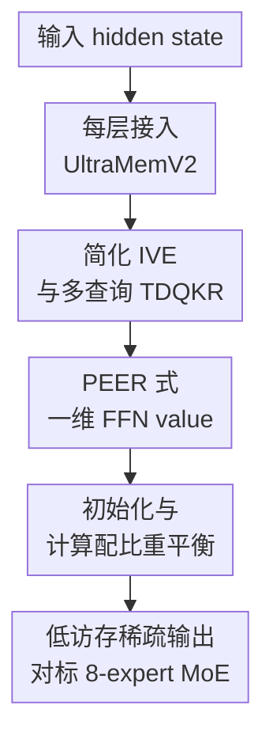

# UltraMemV2: Memory Networks Scaling to 120B Parameters with Superior Long-Context Learning

**会议**: ICLR2026  
**OpenReview**: [https://openreview.net/forum?id=QWuXU0qNX0](https://openreview.net/forum?id=QWuXU0qNX0)  
**代码**: 待确认  
**领域**: LLM效率  
**关键词**: 稀疏模型, 记忆层, 长上下文学习, MoE替代架构, 推理效率  

## 一句话总结
UltraMemV2 重新设计了 memory-layer 稀疏架构，把记忆层放进每个 Transformer block，并用更高效的检索、value 处理、初始化和计算配比，让 memory network 在相同激活计算下接近 8-expert MoE，同时在长上下文记忆与 in-context learning 上更强、推理访存更低。

## 研究背景与动机
**领域现状**：大模型扩参时最常见的高效路线是 Mixture of Experts，核心思路是让每个 token 只激活少量 expert，从而用有限 FLOPs 撬动很大的参数规模。近年的细粒度 MoE 和 OLMoE 一类结果说明，8 个 activated experts 往往比 1-2 个 expert 更接近性能和效率的甜点，因此工业界的大模型也越来越倾向于采用多 expert 激活的稀疏 FFN。

**现有痛点**：MoE 的问题不只在 FLOPs，而在推理时的访存和路由。每个 token 要访问多个 expert 的 FFN 参数，batch 较小或序列较长时，稀疏激活带来的计算节省会被参数读取、expert dispatch 和 memory bandwidth 消耗抵消。尤其在长上下文场景里，模型要反复处理大量 token，memory access 成本会变成很硬的瓶颈。

**核心矛盾**：memory layer 其实提供了另一条稀疏扩参路径：不激活完整 FFN expert，而是从大规模 key-value 表里检索少量 embedding / value。它天然访存少，参数规模增长对每个 token 的访问成本更温和；但此前 PKM、Memory+、UltraMem 等方法通常只能追平 1-expert 或 2-expert MoE，离 8-expert MoE 还有明显性能差距。换句话说，memory layer 的推理形态很香，但模型能力没有跟上。

**本文目标**：作者想回答一个更工程化的问题：能不能把 memory-layer 架构设计到足够强，使它在相同 activated parameters 和计算预算下达到 8-expert MoE 的水平，同时保留低访存、低推理延迟的优势？围绕这个目标，论文同时处理四个子问题：memory layer 应该插在多少层、检索和值展开如何简化、value 从普通 embedding 变成什么形式更有效、以及大规模训练时怎样初始化和分配计算才不发散。

**切入角度**：论文的观察是，旧 UltraMem 的弱点不是单一模块坏掉，而是多个设计一起限制了 sparse parameters 的参与度和激活效率。比如只在少数层放 memory layer 会让大参数表虽然存在，却没有持续参与每层表征更新；IVE 里每个虚拟 head 配独立 linear projector 会带来额外非计算开销且参数效率不高；普通 value embedding 又不像 MoE expert 那样能对输入做一次动态变换。

**核心 idea**：UltraMemV2 用“每层都有一个轻量 memory layer + 更像 FFN 的 value 处理 + 更稳的初始化和计算配比”替代传统 MoE expert 激活，让稀疏记忆从低访存组件变成可以正面对标 8-expert MoE 的主力扩参模块。

## 方法详解

### 整体框架
UltraMemV2 的基本单元仍然接在 Transformer block 内，但它不再把 memory layer 当成偶尔出现的外置容量模块，而是让每个 block 都同时包含普通 FFN 和 UltraMemV2 layer。输入 hidden state 先经过 query projection 与 Tucker-decomposed query-key retrieval 找到少量高分 memory entries，再用 PEER 式 pre-value / value 结构生成输出，最后通过单个 value projector 回到 hidden 维度，与 block 内的 FFN 一起提供稠密计算和稀疏记忆。

从读者视角看，这篇论文的 pipeline 可以理解成四步：第一步提高 memory layer 在深层网络中的参与频率；第二步用 TDQKR 和简化 IVE 做大规模稀疏检索；第三步把被检索的 value 从静态 embedding 升级为一维内层 FFN；第四步用初始化方差和计算占比把训练稳定性、FFN 能力和 memory 检索能力重新配平。

### 关键设计
**1. 每层接入 UltraMemV2：让稀疏记忆真正参与每个 block**

旧 memory-layer 方法常把记忆层稀疏地插在少数 Transformer 层里，这会让大参数表虽然存在，却没有持续参与每层表征更新。UltraMemV2 直接改成每个 Transformer block 都有一个 FFN layer 和一个 UltraMemV2 layer，类似 MoE 每层都放 expert 的使用方式。这样做的关键不是“多放几个模块”这么简单，而是让 sparse memory 在网络深度方向上有足够多的作用点，后续 continued training 时也能像 MoE 一样吃到高质量数据带来的增益。

消融结果支持这个判断。论文在 430M/5B 规模上固定总计算量与 $TopM \times L_m$，比较 2、5、10、20 个 UltraMemV2 层。验证集 loss 到后期差异不大，但 Open-Benchmark 随着层数增加仍有持续收益；更关键的是，4 层旧结构 continued training 平均只涨 5.7 分，而每层都有 UltraMemV2 后，1.25B/12.5B 和 2.5B/25B 上的 CT 增益分别达到 8.3 和 8.0，已经和 Seed-MoE 的 7.5、7.1 同量级。这说明每层接入解决的是“稀疏记忆参与度不足”的问题。

**2. 简化 IVE 与多查询 TDQKR：把大 memory 检索做强，同时减少无效 projector 开销**

UltraMemV2 继承 UltraMem 的 Tucker Decomposed Query-Key Retrieval。给定输入 $x$，模型先通过 $q_{row}(x)$ 和 $q_{col}(x)$ 生成 query，再与 row / column keys 计算分数，并用 Tucker core 组合成 grid score。简化写法是 $S_{grid}=\sigma_{TopM}(S_{row}^{\top} C S_{col})$，其中 $\sigma_{TopM}$ 只保留最高的 $m$ 个 value 地址。这个结构的意义是用 row-column factorization 和 Tucker core 近似巨大的 value 表，而不需要显式维护一个不可承受的全量 key 矩阵。

论文对 IVE 的重新解释很重要：原来的 Implicit Value Expansion 实际上已经通过共享 row / column key pair 产生了类似 $h^2$ heads 的多头效果，因此没必要再像 PKM 那样显式堆多头。旧 IVE 为每个 virtual memory block 配一个 linear projector，推理时会带来额外的索引映射和非计算操作；UltraMemV2 改成先对激活 value 做加权池化，再用一个共享投影 $W$ 输出，即 $o=W^{\top}(V^{\top}\hat{s})$。附录消融显示，single projector 加 separate queries per Tucker rank 在 1.5T tokens 后带来 0.0026 loss 降低和 0.7 分 Open-Benchmark 提升，说明这里不是只为了省实现复杂度，而是在参数效率和检索精度上都更好。

**3. PEER 式一维 FFN value：让被检索的记忆不再只是静态 embedding**

普通 memory layer 检索出来的是 value embedding，本质上像从表里取向量再加权求和；而 MoE expert 更强的一点是它对当前输入 $x$ 做了一次 FFN 变换。UltraMemV2 借鉴 PEER，把每个 value 看成一个 inner dimension 为 1 的微型 FFN：先取 pre-value 矩阵 $P$ 与输入交互，再与检索分数 $\hat{s}$ 和 value 矩阵 $V$ 组合。论文最后采用的形式可写成 $o=W^{\top}(V^{\top}((Px) \otimes \hat{s}))$。

这个设计让 memory entry 从“静态知识槽位”变成“被输入调制的稀疏 value 计算”。作者还指出，PEER 原式里同时对两个并行结果加 activation 会损失信息，因此 UltraMemV2 去掉了 FFN 分支中的额外激活，只保留 TopM 检索本身带来的选择性。430M/5B 的 PEER 消融里，在 memory 计算和访存一致的条件下，PEER 相比 baseline value embedding 训练 loss 低约 0.02，Open-Benchmark 高约 0.03 accuracy，说明性能差距主要来自 value 处理形态，而不是参数量偷换。

**4. 初始化与计算配比重平衡：避免大规模 memory layer 训练发散**

UltraMemV2 把 memory layer 放进每个 block 后，初始化不能再沿用随手的正态分布。论文的标准是两条：memory layer 初始化后的输出方差不能随层数增长而爆炸，同时输出幅度要和 FFN 接近。作者把 memory layer 看成 FFN 的增强项，推导 memory 输出方差 $\sigma^2_{mem}$，再令它对齐 FFN 输出方差 $\sigma^2_{ffn}$，得到 value / pre-value 初始化方差。最终公式中，初始化会随 hidden size $h$、TopM $k$、head 数 $n_{head}$、pre-value / value 维度、层数 $L$ 和 top-k score 方差 $\sigma_s^2$ 调整。

计算配比也被重新调过。memory 的 key dimension $D_k$ 越大，检索越准，但会挤压 FFN 的计算预算；$D_k$ 太小，TDQKR 的 query-key 匹配又不准。论文在 500M/6B 上做了 memory computational proportion 消融，发现约 17% 是较优点；扩展模型时则采用 $D_k=h/2$ 作为更可扩展的规则。这个设计点让 UltraMemV2 不只是“多激活 top-m values”，而是在 FFN 的通用变换能力和 memory 的稀疏容量之间找到了可训练、可放大的工程平衡。

### 一个完整示例
假设某个 token 在长文档里需要记住前文出现过的一组人物关系。进入某个 Transformer block 后，它的 hidden state 先走普通 FFN，保留局部非线性变换；同时进入 UltraMemV2 layer。TDQKR 会用 row query 和 column query 分别检索候选 key，再通过 Tucker core 组合出 grid score，最后只保留 top-$m$ 个 memory addresses。这里的候选空间可以非常大，但每个 token 真正访问的 value 很少，因此访存比 MoE 同时拉多个完整 expert 更低。

接着，这些被选中的 memory entries 不只是被当成向量表查出。每个 entry 还带有 pre-value，和当前 hidden state 做 $Px$ 交互，再与检索分数 $\hat{s}$ 相乘，形成“这个输入在这个记忆槽位上应该激活多少”的动态 value。多个 value 聚合后经过单个 projector 回到 hidden size，和这一层其他分支一起进入后续 Transformer block。因为每层都有这样的 UltraMemV2，长上下文里的线索可以在深度方向反复被检索、调制和写入表征，而不是只在少数层被偶尔补充。

这个例子也解释了为什么论文的长上下文结果会比较突出。MoE 更像从若干专家里选计算函数，适合通用能力扩展；UltraMemV2 更像在每层提供一个大规模可寻址记忆表，尤其适合需要在长输入中反复定位、保留和复用信息的任务。

### 损失函数 / 训练策略
UltraMemV2 没有引入新的主任务 loss，训练仍是语言模型预训练和 continued training 的标准 next-token prediction 目标。真正变化在训练配置和参数调度上：私有模型先用 1.6T tokens 预训练，再用 250B 高质量 tokens 做 continued training；部分模型进一步扩展到 3.9T PT 加 500B 32K context CT。开源对比则使用 OLMoE 的 1T token 数据，保证与 MoE、Memory+、UltraMem 在计算和参数预算上尽量公平。

论文明确做了辅助 loss 的负结果验证。UltraMem 里使用过 Tucker core penalty 来约束非主奇异值，UltraMemV2 发现 Tucker core 的第一大特征值自然会和后续特征值拉开，显式 penalty 没必要；balance loss 在 TopM 较小时可能有正则收益，但 TopM 较大时会伤害训练 loss 和 downstream accuracy，因此最终不使用这些辅助项。value 参数学习率也被简化：旧 UltraMem 使用从 4x 衰减到 1x 的 value learning rate，UltraMemV2 的长训练消融显示 constant 1x 最终反而高 0.4 分，减少了额外超参数。

## 实验关键数据

### 主实验
私有模型实验的核心结论是：UltraMemV2 在相同 activated parameters 和相近总参数下追平 8-expert MoE，并且在长上下文任务上明显更强。尤其 2.5B/60B-top768 版本在 3.9T PT + 500B CT 后，OpenBench All 与 SeedMoE-2.5B/30B 都是 70.7，但 HardBench All 从 30.3 提到 31.7；在 250B CT 阶段，它也超过同规模 SeedMoE-2.5B/60B 的 OpenBench All 68.1，达到 69.1。

| 模型 | 训练阶段 | OpenBench All | HardBench All | 关键结论 |
|------|----------|---------------|---------------|----------|
| SeedMoE-2.5B/30B | 3.9T PT + 500B CT | 70.7 | 30.3 | 强 MoE 基线 |
| UltraMemV2-2.5B/60B-top768 | 3.9T PT + 500B CT | 70.7 | 31.7 | OpenBench 持平，HardBench 更高 |
| SeedMoE-2.5B/60B | 1.6T PT + 250B CT | 68.1 | 29.2 | 同总参数 MoE |
| UltraMemV2-2.5B/60B-top768 | 1.6T PT + 250B CT | 69.1 | 30.0 | CT 后超过同规模 MoE |
| UltraMemV2-2.5B/120B-top256 | 1.6T PT + 250B CT | 68.3 | 27.9 | 总稀疏参数更大，但激活密度较低 |

长上下文实验更能体现 memory layer 的优势。UltraMemV2-2.5B/60B-top768 在 long-context memorizing、multi-round memorizing、in-context learning 和 key-value retrieval 上都明显好于 SeedMoE-2.5B/30B，但 multi-hop reasoning 反而更差，说明它不是所有长上下文能力都无条件胜出。

| 模型 | 长上下文记忆 | 多轮记忆 | In-context learning | Find needle | Key-val retrieval | Multi-hop reasoning | All |
|------|--------------|----------|---------------------|-------------|-------------------|---------------------|-----|
| SeedMoE-2.5B/30B | 21.9 | 25.0 | 21.6 | 96.5 | 41.3 | 34.8 | 35.4 |
| UltraMemV2-2.5B/60B-top768 | 23.5 | 31.2 | 29.5 | 97.0 | 57.1 | 17.7 | 37.7 |
| 提升 | +1.6 | +6.2 | +7.9 | +0.5 | +15.8 | -17.1 | +2.3 |

开源对比也说明 UltraMemV2 不是只在私有系统里有效。在 227M/1.2B 规模下，它的 All 为 54.4，接近 OLMoE 的 54.6，并明显超过 Memory+ 的 52.8 和 UltraMem 的 53.8；在 1B/7B 规模下，它的 All 为 61.8，几乎追平 OLMoE 的 62.1。

### 消融实验
消融部分覆盖了结构、层数、维度配比、辅助 loss、共享 memory 和学习率调度。最重要的不是某一个小 trick，而是这些消融共同支持了 UltraMemV2 的设计逻辑：提高 memory 参与度、增强 value 处理、减少无效 projector、避免过度正则，并把 activation density 放在比总稀疏参数更高的优先级。

| 配置 / 消融 | 关键指标 | 说明 |
|-------------|----------|------|
| PEER vs baseline value embedding | loss 低约 0.02，Open-Benchmark 高约 0.03 accuracy | 一维 FFN value 比静态 embedding 更有效 |
| Single projector + multi queries | 1.5T 后 loss -0.0026，Open-Benchmark +0.7 | 简化 IVE 不是削弱，反而提升参数效率 |
| 1 head vs 2 heads | 1T 后 loss -8e-4，Open-Benchmark +0.2 | 单头配更大 $D_k$ 和 TopM 略优 |
| Memory computational proportion | 17% 左右最好 | memory 检索和 FFN 计算需要配平 |
| 4 层旧 UltraMemV2 CT | 平均 +5.7 | 稀疏记忆层数太少时 CT 收益不足 |
| 每层 UltraMemV2 CT | 1.25B/12.5B +8.3，2.5B/25B +8.0 | 每层接入后 CT 收益接近或超过 MoE |
| Balance loss | TopM=47 有益，TopM=94 有害 | 大 TopM 下不需要强行均衡 value 激活 |
| Constant 1x value LR | 最终 Open-Benchmark 比 decay baseline +0.4 | 长训练下可去掉复杂 value LR 衰减 |

### 关键发现
- 激活密度比总稀疏参数更关键。2.5B/60B-top768 通常优于 2.5B/120B-top256，说明多激活一些 value 比单纯堆更大的 memory table 更直接地提升能力。
- UltraMemV2 对 continued training 和高质量长上下文数据更敏感。1.6T PT 结束时它在数学、代码、推理上常落后 MoE，但 250B CT 后会追上甚至超过，这提示 memory layer 的能力释放依赖训练阶段。
- 长上下文优势集中在记忆、复用和 key-value retrieval，而不是所有推理任务。Multi-hop reasoning 明显低于 SeedMoE，说明“记忆可寻址”不等价于“跨片段逻辑组合更强”。
- 推理效率是论文的另一条主线。10B/200B 规模对比中，UltraMemV2 在常用 batch size 下访存明显低于 MoE，延迟最高约 2 倍加速；训练吞吐则与 MoE 接近，分别为 265B tokens/day 和 262B tokens/day。

## 亮点与洞察
- UltraMemV2 最有价值的地方，是把 memory layer 从“低访存但性能一般”的辅助扩参方法，推进到可以正面对标 8-expert MoE 的架构位置。它不是只靠扩大参数表，而是系统性解决层数、value 动态性、检索简化和初始化问题。
- “activation density 大于 total sparse parameters”是很实用的扩展结论。对稀疏架构来说，总参数越大不一定越好，如果每个 token 激活的信息太少，模型无法有效利用这些参数；这对 MoE、memory layer、检索增强网络都有启发。
- PEER 式 value 处理给 memory network 提供了一个很清晰的升级方向：不要只把 memory 当 embedding table，而要让被检索出来的 value 与当前输入发生轻量交互。这个思路可以迁移到参数高效微调、持续学习记忆、甚至外部向量库增强模型中。
- 论文很诚实地保留了一些负结果，如 auxiliary losses 和 value learning rate decay 的收益并不稳定。这些结果对复现者很有用，因为它们减少了“是不是还缺某个神秘训练 trick”的不确定性。

## 局限与展望
- UltraMemV2 早期训练不如 MoE 稳健。论文多次显示它在 PT 阶段的数学、代码、推理表现会落后，需要 CT 和高质量数据才追上，这意味着训练预算较小或缺少后训练数据时，MoE 仍可能更稳。
- 推理优势依赖硬件访存特性。作者指出 UltraMemV2 训练时更 memory-bound，受 atomic memory operations 影响；未来硬件如果更适合 MoE dispatch 或者不擅长 memory table 随机访问，实际收益可能变化。
- 长上下文结果不是全面胜利。Key-value retrieval 和 in-context learning 很强，但 multi-hop reasoning 显著下降，说明 UltraMemV2 更擅长“取回并保持信息”，未必更擅长复杂组合推理。
- 论文主要验证从头训练，对 mid-training 插入和 MoE 混合架构只是讨论。实际工业系统往往已有预训练 MoE 或 dense 模型，如何平滑加入 UltraMemV2、如何设置 zero initialization 或 gating scalar，还需要更系统实验。
- 120B total parameters 的叙述很吸引人，但最强结论仍来自 2.5B activated 级别的对比。更大 activated scale、更多公开数据和端到端服务部署指标会让结论更扎实。

## 相关工作与启发
- **vs MoE / OLMoE**: MoE 激活的是 FFN expert，优势是通用能力强、训练路径成熟；UltraMemV2 激活的是 memory values，访存更低，长上下文记忆类任务更强。本文的劣势是早期训练和部分推理任务不如 MoE 稳。
- **vs PKM**: PKM 用 product key factorization 扩展 memory 容量，但 value 主要是静态 embedding。UltraMemV2 继承可寻址大表的思想，同时用 TDQKR 和 PEER 式 value 处理提升检索与动态表达能力。
- **vs UltraMem**: UltraMem 已经用 TDQKR 和 IVE 改进 PKM，但只达到 2-expert MoE 水平。UltraMemV2 的关键进步是每层接入、简化 IVE、PEER value、初始化和计算配比一起重做，最终逼近 8-expert MoE。
- **vs Memory+**: Memory+ 也研究 memory layer at scale，并探索共享 value table。本文在附录中进一步讨论 S9-Ring、S6-Block 等共享策略，说明 memory sharing 能提升性能，但要兼顾 pipeline parallelism 的通信成本。
- **启发**: 对未来长上下文模型，memory layer 可能不只是 attention 的补充，而是一类低访存的参数容量载体。尤其在服务端推理受 bandwidth 限制时，用 memory entries 替代完整 expert 可能比继续堆 MoE 更划算。

## 评分
- 新颖性: ⭐⭐⭐⭐☆ 从 memory-layer 角度挑战 8-expert MoE 很有价值，核心是多项架构修正的组合创新。
- 实验充分度: ⭐⭐⭐⭐☆ 私有、开源、长上下文、效率和大量消融都覆盖了，但更大公开规模和真实部署细节仍不足。
- 写作质量: ⭐⭐⭐⭐☆ 方法主线清楚，消融信息丰富；部分图表和公式排版略粗糙，早期训练劣势的机理解释还可以更深入。
- 价值: ⭐⭐⭐⭐⭐ 对长上下文与高效稀疏推理很有启发，尤其适合关注 MoE 访存瓶颈和 sparse memory scaling 的读者。

<!-- RELATED:START -->

## 相关论文

- [\[ACL 2025\] Scaling Context, Not Parameters: Training a Compact 7B Language Model for Efficient Long-Context Processing](../../ACL2025/llm_efficiency/scaling_context_not_parameters_training_a_compact_7b_language_model_for_efficien.md)
- [\[ICLR 2026\] Deep Hierarchical Learning with Nested Subspace Networks for Large Language Models](deep_hierarchical_learning_with_nested_subspace_networks_for_large_language_mode.md)
- [\[ICLR 2026\] xLSTM Scaling Laws: Competitive Performance with Linear Time-Complexity](xlstm_scaling_laws_competitive_performance_with_linear_time-complexity.md)
- [\[ICLR 2026\] RMAAT: Astrocyte-Inspired Memory Compression and Replay for Efficient Long-Context Transformers](rmaat_astrocyte-inspired_memory_compression_and_replay_for_efficient_long-contex.md)
- [\[ICLR 2026\] MemAgent: Reshaping Long-Context LLM with Multi-Conv RL-based Memory Agent](memagent_reshaping_long-context_llm_with_multi-conv_rl-based_memory_agent.md)

<!-- RELATED:END -->
