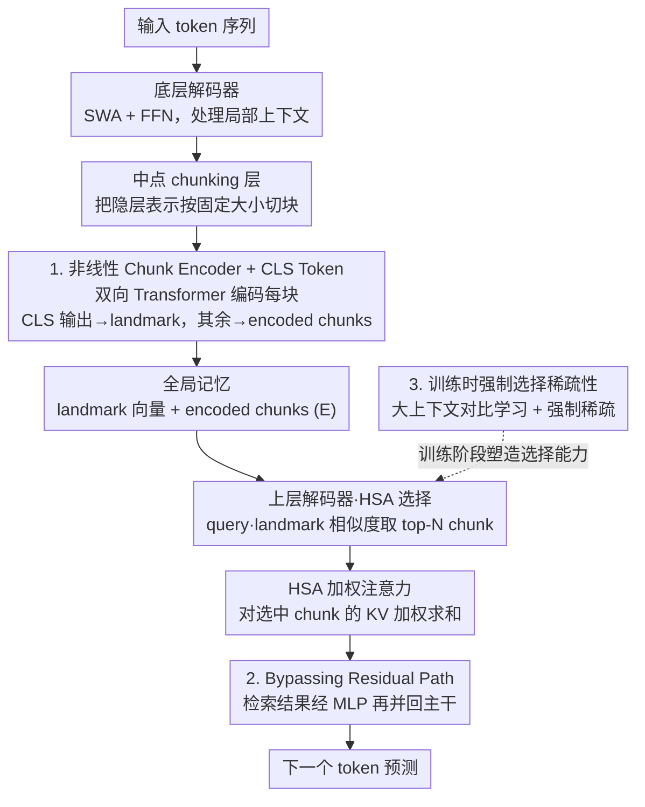

# Understanding and Improving Length Generalization in Hierarchical Sparse Attention Models

**会议**: ICLR 2026  
**arXiv**: [2510.17196](https://arxiv.org/abs/2510.17196)  
**代码**: [https://github.com/jacky-leng/length-generalizable-sparse-attention](https://github.com/jacky-leng/length-generalizable-sparse-attention)  
**领域**: LLM效率  
**关键词**: 长上下文, 稀疏注意力, 长度泛化, Chunk-based Attention, Hierarchical Sparse Attention

## 一句话总结
系统解剖基于 chunk 的稀疏注意力架构，识别出三个关键设计原则（非线性 Chunk Encoder + CLS token、Bypassing Residual Path、训练时强制选择稀疏性），将 4K 上下文训练的模型成功外推到 3200 万 token。

## 研究背景与动机

**领域现状**：LLM 处理长上下文的需求日益增长，标准 Transformer 的 $O(n^2)$ 复杂度和长度外推失败是核心瓶颈。滑动窗口注意力和 SSM 通过固定大小记忆解决效率但牺牲了全局信息访问能力。

**现有痛点**：(a) 滑动窗口只能访问局部上下文；(b) SSM 将历史压缩到固定状态形成信息瓶颈；(c) 现有 chunk-based 稀疏注意力（Landmark Attention、NSA）虽然有外推能力，但在复杂检索任务上随长度增长精度仍显著下降，且**缺乏系统分析阐明哪些设计因素是成功的关键**。

**核心矛盾**：理想的长度外推需要两个属性：(1) 在更长序列上保持稳定困惑度，(2) 能有效利用整个上下文——现有方法很难同时满足。

**本文目标** 系统识别 chunk-based 稀疏注意力中哪些架构组件驱动极端长度泛化，并基于发现建立 SOTA。

**切入角度**：将现有方法统一到一个框架中，通过大规模消融实验逐一拆解各组件的贡献。

**核心 idea**：非线性编码器学到好的 chunk 表示用于检索，旁路残差路径避免全局信息被局部残差流覆盖，训练时强制稀疏弥合训练-测试分布差距——三者缺一不可。

## 方法详解

### 整体框架
论文要解决的问题是：为什么有些 chunk-based 稀疏注意力能把短上下文训练的模型外推到极长序列、而有些不能？它把现有方法统一到一个 SWA+HSA（Sliding Window Attention + Hierarchical Sparse Attention）框架里，再逐一拆掉组件看谁在起作用。

整条数据流分三段。底层是若干个滑动窗口注意力（SWA）解码层，每层做 SWA + FFN，只处理局部上下文、保证近距离信息精确。到网络中点插入一个 chunking 层，把底层隐层表示 $\mathbf{H}^{L/2}$ 按固定大小切块，每块送进一个**非线性 Chunk Encoder + CLS Token** 编码，产出一个全局记忆单元：一个 landmark 向量 $\mathbf{lmk}_{[i]}$（供检索）和一组 encoded chunks $\mathbf{E}$（供读取内容）。顶层是若干个上层解码器，每层在局部自注意力之外多挂一个 HSA：先拿当前 query $\mathbf{q}_t$ 和所有 landmark 算相似度 $s_{t,i}=\mathbf{q}_t\cdot\mathbf{lmk}_{[i]}$、挑出 top-N 最相关的 chunk，再对这些 chunk 的 KV 做加权注意力，最后通过 **Bypassing Residual Path** 把检索结果干净地并回主干。论文的三个核心发现正好落在这条流水线上：怎么把 chunk 编码得可检索（设计 1）、检索结果怎么并回主干不出乱（设计 2），以及训练时怎么逼模型在海量 chunk 里学会挑（设计 3，**训练时强制选择稀疏性**，作用在选择那一步上）。

### 关键设计

**1. 非线性 Chunk Encoder + CLS Token：让 landmark 真正反映 chunk 的可检索价值**

痛点在于，决定一个 chunk 该不该被选中的理想权重，应当正比于该 chunk 内部注意力质量的总和——而这是关于 chunk 内各个 key 的高度非线性函数。简单的 MeanPool 把一块 key 平均成一个向量，表达力不足以拟合这种关系，于是检索信号失真。论文改用一个双向 Transformer 编码器处理每个 chunk，靠多层非线性变换学出这种复杂映射，并额外引入一个可学习的 CLS token 来产出 landmark 向量。这一步还顺手解决了另一个矛盾：中间层的隐层状态 $h_t^{L/2}$ 本来要同时服务"预测下一个 token"和"将来被检索"两个目的，二者诉求并不一致；CLS token 把检索表示从内容表示里单独拎出来，让两个功能解耦，landmark 只为"好检索"服务。

**2. Bypassing Residual Path：别让低层检索信息污染高层残差流**

HSA 检索回来的是相对较低层的表示，偏字面、偏局部；而它要注入的顶层主干已经是更抽象的表示。标准残差写法

$$x_{\text{out}} = x_{\text{in}} + \mathcal{M}(x') + \mathcal{H}(x_{\text{in}})$$

把这份低层检索信息 $\mathcal{H}(x_{\text{in}})$ 直接加进高层残差流，抽象与字面两种粒度混在一起会互相干扰。论文改成旁路写法

$$x_{\text{out}} = x_{\text{in}} + \mathcal{M}(x')$$

让检索结果先经过 MLP $\mathcal{M}$ 再并入主干，由 MLP 去学习如何调和这种跨层粒度差异，而不是粗暴相加。这个改动在短序列上几乎看不出区别，但在极端外推时成为成败关键——说明跨层信息融合恰恰是长度泛化的隐藏瓶颈。

**3. 训练时强制选择稀疏性：把"跳过无关 chunk"的场景喂进训练分布**

根因是训练-测试的分布差距：测试时序列远长于训练长度，chunk 数量爆炸，模型必须懂得筛掉绝大多数无关 chunk；但如果训练时上下文太短、所有 chunk 都会被 top-N 选中，模型根本没机会学到"选择性"这件事，到了长序列就不会挑。论文在预训练时使用足够大的上下文做对比学习，并强制 chunk 选择保持稀疏，确保训练分布里就包含大量"需要跳过不相关 chunk"的样本，让选择能力在训练阶段就被真正激发出来。

这三者缺一不可：编码器负责把 chunk 编码得可检索，旁路残差负责把检索结果干净地并回主干，强制稀疏负责让模型在训练时就学会挑——任何一环缺失都会让极端长度外推崩掉。

### 损失函数 / 训练策略
标准语言模型自回归损失，在 4K 上下文长度上预训练。关键超参数：chunk 大小、top-N 选择数量、编码器层数。

## 实验关键数据

### 主实验

**RULER benchmark（训练 4K → 测试各长度）**:

| 模型 | 4K | 32K | 128K | 1M | 32M |
|------|-----|------|------|----|----|
| Full Attention | 高 | 低 | ~0 | - | - |
| Mamba2 | 65.4 | 1.1 | - | - | - |
| Landmark Attention | 中 | 中 | 低 | - | - |
| **SWA+HSA (Ours)** | **高** | **高** | **高** | **高** | **高** |

**BABILong**: 模型在 8M token 上仍保持高精度，Full Attention 在训练长度后迅速崩溃。

### 消融实验

| 配置 | RULER 128K Avg |
|------|---------------|
| Full model (Enc+CLS+Bypass) | 最高 |
| w/o Encoder (MeanPool) | 大幅下降 |
| w/o CLS token | 下降 |
| w/o Bypassing Residual | 下降 |
| w/o 训练稀疏性 | 长序列外推失败 |

### 关键发现
- 三个组件**缺一不可**：去掉任何一个都导致长度泛化能力显著下降
- 4K 训练 → 32M 外推 = **8000× 外推倍数**，大幅超越此前 SOTA（~1000×）
- CLS token 的效果不仅是更好的 landmark 质量，还在于将检索和内容解耦，避免信息串扰
- Bypassing Residual Path 在短序列上差异不大，但在长序列外推时差异巨大——说明跨层信息融合在极端外推中成为瓶颈
- 训练时上下文需要足够大以包含"干扰 chunk"，否则模型无法学会选择性检索

## 亮点与洞察
- **理论+实证双驱动**：不只是做消融实验，还提供了"为什么需要非线性编码器"的理论动机（chunk 权重是 key 的非线性函数），使设计选择有坚实基础。
- **极端外推能力**：4K→32M (8000×) 的外推倍数非常惊人，远超同类工作，说明正确的架构设计可以极大释放稀疏注意力的潜力。
- **Bypassing Residual Path 的洞察**：跨层信息融合中直接残差加法的失败模式是非显而易见的，这个发现对所有涉及跨层注意力的架构设计都有指导意义。

## 局限与展望
- 仅在 1.3B 规模验证，更大模型是否有相同表现待确认
- Chunk 大小固定，自适应 chunk 切分可能进一步提升检索精度
- 复杂推理任务（需要多跳检索）的外推能力未充分验证
- 编码器增加了参数量和计算，在极低延迟场景可能不可接受

## 相关工作与启发
- **vs Landmark Attention**: 本文延伸了 Landmark 的 chunk-based 思路但加入了非线性编码器和更好的融合策略，外推能力从~64× 提升到 8000×
- **vs NSA (Native Sparse Attention)**: NSA 用简单 MeanPool 生成 landmark 且外推有限，本文证明非线性编码器是必须的
- **vs DRT/RAMba**: 同属 chunk-based 稀疏注意力家族，本文通过统一框架验证了关键设计原则的普适性

## 评分
- 新颖性: ⭐⭐⭐⭐ 系统性分析本身就是重要贡献，三个设计原则的发现具有指导意义
- 实验充分度: ⭐⭐⭐⭐⭐ RULER + BABILong + 大量消融 + 诊断分析，非常全面
- 写作质量: ⭐⭐⭐⭐⭐ 统一框架 + 理论动机 + 系统消融，研究方法论堪称典范
- 价值: ⭐⭐⭐⭐⭐ 为长上下文模型设计提供了清晰的原则指南，8000× 外推是突破性结果

<!-- RELATED:START -->

## 相关论文

- [\[ICLR 2026\] Tactic: Adaptive Sparse Attention with Clustering and Distribution Fitting for Long-Context LLMs](tactic_adaptive_sparse_attention_with_clustering_and_distribution_fitting_for_lo.md)
- [\[ICLR 2026\] FSA: An Alternative Efficient Implementation of Native Sparse Attention Kernel](fsa_an_alternative_efficient_implementation_of_native_sparse_attention_kernel.md)
- [\[ICLR 2026\] Sparse Attention Adaptation for Long Reasoning](sparse_attention_adaptation_for_long_reasoning.md)
- [\[ICLR 2026\] vAttention: Verified Sparse Attention via Sampling](vattention_verified_sparse_attention_via_sampling.md)
- [\[ICLR 2026\] InfLLM-V2: Dense-Sparse Switchable Attention for Seamless Short-to-Long Adaptation](infllm-v2_dense-sparse_switchable_attention_for_seamless_short-to-long_adaptatio.md)

<!-- RELATED:END -->
