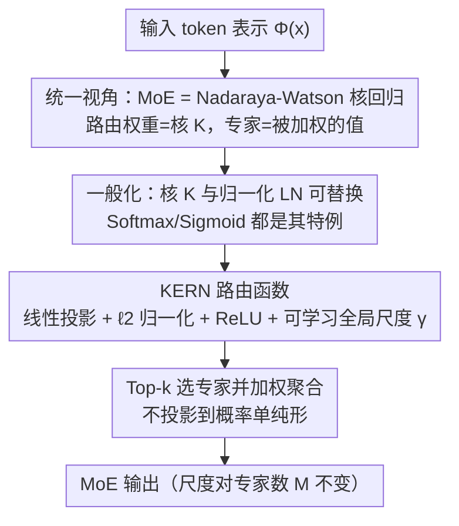

# Understanding the Mixture-of-Experts with Nadaraya-Watson Kernel

**会议**: ICLR 2026  
**OpenReview**: [https://openreview.net/forum?id=NdDlqHV1md](https://openreview.net/forum?id=NdDlqHV1md)  
**领域**: LLM效率  
**关键词**: 混合专家, 路由函数, Nadaraya-Watson回归, 核方法, Softmax替代

## 一句话总结
本文用经典的 Nadaraya-Watson 核回归重新解释 MoE 路由（路由权重 = 核函数、专家输出 = 被加权的"标签"），并据此把 MoE 看成一个"大 FFN"，进而提出零额外开销的 FFN 风格路由函数 KERN（ReLU 激活 + $\ell_2$ 归一化），在多种规模、序列长度和稀疏度下都稳定优于 Softmax / Sigmoid 路由。

## 研究背景与动机

**领域现状**：MoE 已经成为现代大模型（Mixtral、DeepSeek、Switch Transformer 等）的标配，它用稀疏激活在不显著增加计算量的前提下扩大参数规模。而从最早的 MoE 到今天的 LLM，路由器几乎清一色用 **Softmax** 来给每个 token 计算专家权重——Softmax 把路由打分投影到概率单纯形上（权重非负、求和为 1），被普遍当成天经地义的设计。

**现有痛点**：把路由权重约束成一个概率分布，这件事看似自然，却从来没有被严格论证为"必须"。Softmax 属于指数型激活，存在两个实际问题：一是**梯度饱和 / 消失**——某个专家的路由权重一旦被压到接近 0，它得到的梯度也几乎为 0，于是被"困死"在低激活状态，长期得不到更新，造成专家利用率失衡；二是指数函数对输入数值非常敏感，容易数值爆炸。近期有工作（DeepSeek 等）发现把 Softmax 换成 **Sigmoid** 反而更好，这本身就暗示 Softmax 的统治地位并不牢固。

**核心矛盾**：Softmax 的"概率单纯形约束"既不是 MoE 有效的必要条件，又会带来梯度饱和和尺度问题；但缺乏一个统一的理论框架来说明"路由器到底该长什么样"，于是替代方案（Sigmoid、Tanh）都停留在经验试错。

**本文目标**：(1) 给 MoE 路由找一个有原则的统计学解释；(2) 在这个解释下设计一个比 Softmax 更符合深度学习常识、且零额外开销的路由函数。

**切入角度**：作者注意到 MoE 的聚合公式 $\text{MoE}(x)=\sum_m g_m(x)E_m(x)$ 与经典 **Nadaraya-Watson 核回归**几乎逐项对应——路由权重 $g_m(x)$ 就是核函数 $K(x, w_m)$，专家输出 $E_m(x)$ 就是被加权聚合的"观测值 $y_m$"。更进一步，FFN 输出层也能写成同样的"自适应核权重 × 值向量"形式，于是 MoE、FFN、Nadaraya-Watson 三者在数学上是同构的。

**核心 idea**：既然 MoE 路由就是一个"核函数 + 归一化"，那就**用 FFN 里早已被验证好用的那套（ReLU 激活 + $\ell_2$ 归一化）来当核函数**，取代 Softmax 的"指数激活 + $\ell_1$ 归一化"，得到路由函数 KERN。

## 方法详解

### 整体框架

本文的方法是一条"先解释、后设计"的链条。第一步从统计视角把 MoE 路由**还原**成 Nadaraya-Watson 核回归，并指出 FFN 输出层也是同一个模板；第二步把这个模板**一般化**——核函数 $K$ 和归一化 LN 都可以自由替换；第三步在一般化的模板里**实例化**出一个新路由函数 KERN，故意选用深度学习里最主流的 ReLU + $\ell_2$ 归一化，而不是 Softmax 的指数 + $\ell_1$；第四步用尺度分析说明 KERN 为什么训练更稳。

### 关键设计

**1. 把 MoE / FFN 统一成参数化 Nadaraya-Watson 核回归：给路由器一个统计学解释**

这一步要解决的是"为什么是 Softmax、能不能换"这个一直没人回答的问题。Nadaraya-Watson 估计器对输入 $x$ 的预测是按相似度给训练样本加权：$f_{NW}(x)=\sum_{i=1}^N \frac{K(x,x_i)}{\sum_j K(x,x_j)} y_i$，其中 $K$ 是核函数，分母做归一化。作者把带宽 $\sigma$ 改成可学习参数，得到参数化核 $K(u,v;w)=\exp(-w\|u-v\|^2/2)$。

关键观察是：**FFN 输出层**可以写成 $\text{FFN}(x)=\sum_{i=1}^h \phi(\text{LN}(\langle w_i,\Phi(x)\rangle))\cdot v_i$——前半截"激活后的归一化打分"就是自适应核权重，$v_i$ 就是充当"标签 $y_i$"的值向量。于是 FFN 隐式定义了一个 FFN 风格核 $K(x,\{w_i\})=\phi(\langle w_i,\Phi(x)\rangle)$，而 Nadaraya-Watson 里的归一化恰好对应 $\ell_1$ 归一化 $\text{LN}(x)=x/\|x\|_1$。**MoE 路由完全是同一个模板**：$\text{MoE}(x)=\sum_m g_m(x)E_m(x)$ 里，路由权重 $g_m(x)=K(x,w_m)$ 是核，专家输出 $E_m(x)$ 是被聚合的观测值。把这三者打通后，路由器就不再是"必须用 Softmax 的概率分配器"，而是"一个可以自由设计核与归一化的回归权重"——这就是后面换掉 Softmax 的理论许可证。

**2. KERN 路由函数：用 FFN 那套 ReLU + $\ell_2$ 归一化当核，去掉概率单纯形约束**

有了统一视角，作者指出在这个框架下 Softmax 路由其实是个"怪胎"：它用**指数激活 + $\ell_1$ 归一化**，而现代 FFN 几乎不用指数激活（数值敏感、易爆炸/梯度消失），归一化也以 $\ell_2$ 为主。于是 KERN 干脆照搬 FFN 的主流配置。设 $\Phi(x)\in\mathbb{R}^d$ 是喂给路由器的表示，KERN 依次做：线性投影 $s(x)=W_s\Phi(x)+b_s$，再 $\ell_2$ 归一化 $\bar s(x)=\frac{s(x)}{\|s(x)\|_2+\varepsilon}$，再 ReLU $r(x)=\text{ReLU}(\bar s(x))$，最后乘一个**可学习的全局标量** $\gamma$（初始化为 1）得到 $\hat g(x)=\gamma\cdot r(x)$。推理和训练都只保留 top-$k$ 专家：$g_m(x)=\hat g_m(x)\,\mathbb{1}[m\in T_k(x)]$，再做 $\text{MoE}_{\text{KERN}}(x)=\sum_m g_m(x)E_m(x)$。

它和旧路由的区别在于：**不把路由输出投影到概率单纯形**，因此不再额外做 $\ell_1$ 重缩放，权重大小由 $\gamma$ 和 $\ell_2$ 约束共同控制。这样既保留了 ReLU 带来的稀疏性（天然有很多 0），又避免了指数路由的梯度饱和。同时它是**真正的一般化**：Softmax 路由对应"$\ell_1$ 归一化 + 指数激活"，Sigmoid 路由对应"无 LN + Sigmoid 激活"，都被这个 FFN 风格框架涵盖；而且 KERN **不引入任何额外参数或显著开销**（$\gamma$ 只是一个标量），是 zero-additional-cost 的即插即用替换。

**3. $\ell_2$ 归一化保证 MoE 输出尺度对专家数 $M$ 不变：训练更稳**

为什么偏偏选 $\ell_2$ 归一化，而不是随便哪个等价范数？作者给了一个尺度分析。专家独立且合理初始化时，可假设各专家输出独立、范数有界（$\|E_m(x)\|_2=O(1)$）。在初始化阶段，KERN 的 MoE 输出二阶矩为

$$\mathbb{E}\big[\|\text{MoE}_{\text{KERN}}(x)\|_2^2\big]=\sum_{m=1}^M (g_m(x))^2\,\mathbb{E}\big[\|E_m(x)\|_2^2\big]=O(1)\cdot\sum_{m=1}^M (g_m(x))^2=O(1).$$

对 ReLU、LeakyReLU、Tanh、GeLU 等常见激活配上 FFN 风格核，最后一步都成立。也就是说，无论专家总数 $M$ 是 32 还是 256，输出方差都被钉在常数尺度上，**专家越多也不会让信号忽大忽小**，这与 Kaiming 初始化等深度网络的尺度一致性原则吻合，从而带来更稳定的训练和更均衡的专家参与。这正是 Softmax/Sigmoid 做不到的：它们的指数性质会让小权重专家梯度趋于 0、陷入"近乎不激活"的死状态。

### 损失函数 / 训练策略
KERN 不改变 MoE 的训练目标，仍是标准的语言建模（next-token 预测）损失，作为路由函数即插即用；唯一新增的可学习量是全局标量 $\gamma$（初值 1）。实验全部采用 decoder-only Transformer，MoE 总参数与激活参数之比为 8（如 64 专家激活 8 个），与 Dense 基线对齐激活参数后比较。

## 实验关键数据

实验覆盖语言建模验证损失（Arxiv / Books3，长度 512/1024/2048）、模型规模（125M→1.3B 激活参数）、专家粒度、稀疏度，以及在 FineWeb-Edu 上预训练后的下游零样本评测。

### 主实验

FineWeb-Edu 预训练 + 下游零样本平均准确率（越高越好）：

| 模型规模（激活） | Dense | Softmax | Tanh | Sigmoid | KERN |
|--------|------|------|------|------|------|
| 520M（125M） | 48.51 | 49.88 | 51.53 | 51.80 | **52.14** |
| 1.7B（350M） | 51.05 | 52.46 | 54.18 | 54.72 | **55.13** |
| 6.9B（1.3B） | 56.11 | 56.49 | 58.04 | 58.55 | **58.88** |

语言建模验证损失（越低越好，step 50K）：

| 设置 | Dense | Softmax | Sigmoid | Tanh | KERN |
|------|------|------|------|------|------|
| Arxiv 512 | 1.0925* | 1.8781 | — | — | **1.8291** |
| Books3 1024 | 3.2454 | 3.1714 | 3.1031 | 3.1224 | **3.0914** |
| Books3 2048 | 3.1249 | 3.0442 | 2.9635 | 2.9868 | **2.9535** |

（*Dense 在 Arxiv 512 的低值来自原文一处数字，与曲线整体趋势不一致，⚠️ 以原文为准；其余数据中 KERN 在所有设置下均取得最低损失 / 最高准确率。）

### 消融实验

| 维度 | 配置范围 | 结论 |
|------|---------|------|
| 专家粒度 | 4–32 激活专家，固定激活参数 | KERN 在每个粒度都优于 Softmax |
| 稀疏度（总专家数） | 32 / 64 / 128 / 256（激活 8） | Books3 上 KERN 损失 3.3487→3.2672，逐档低于 Softmax 3.3981→3.3761 |
| 极端稀疏 | 256 专家、激活 8、专家中间维 384 | KERN 50K 步损失 3.2672，优于 Softmax 3.3761 / Sigmoid 3.2760 / Tanh 3.2972 |
| 模型规模 | 125M→350M→1.3B 激活 | 每个规模 KERN 都是最优，且大模型上领先扩大 |

### 关键发现
- **KERN 对稀疏度与粒度都鲁棒**：无论总专家数从 32 到 256、激活专家从 4 到 32，KERN 都稳定压过 Softmax，说明增益不是某个特定配置下的偶然。
- **领先幅度与"上 MoE"的收益同量级**：在 520M 规模，KERN 与 Softmax 的下游平均差距是 2.26，而 Softmax 与 Dense 的差距只有 1.37；1.7B 规模二者差距分别为 2.67 与 0.61。也就是说"把 Softmax 换成 KERN"带来的提升，可与"从 Dense 升级到 MoE"相当，而 KERN 是零额外成本的。
- **规模越大优势越明显**：从 125M 到 1.3B 激活，KERN 的领先不缩反扩，提示它对大规模 MoE 训练尤其有价值。

## 亮点与洞察
- **一个老工具串起三件事**：用 1964 年的 Nadaraya-Watson 核回归把 MoE 路由、FFN 输出层、核回归三者统一，既解释了"Softmax 只是众多核之一"，又顺手给出了替换 Softmax 的设计空间——这种"先解释再设计"的路线很值得借鉴。
- **零成本即插即用**：KERN 不加任何参数（只一个标量 $\gamma$）、不改训练目标，却能稳定提升，工程上几乎没有迁移门槛，很可能成为 MoE 路由的新强 baseline。
- **尺度不变性是可迁移的洞察**：用 $\ell_2$ 归一化让输出二阶矩对专家数 $M$ 不变这一招，本质上是把 Kaiming/方差保持的初始化思想搬进了路由器，思路可推广到其他需要"对组件数鲁棒"的聚合模块。

## 局限与展望
- 实验主要在 decoder-only 语言模型上，未覆盖视觉 MoE、多模态等场景，KERN 的普适性还需更多验证。
- 评测以验证损失和零样本下游准确率为主，缺少对**专家负载均衡指标**、专家利用率的直接定量分析——虽然理论上论证了缓解梯度饱和，但实测的均衡改善程度没有专门的表格支撑。
- 去掉概率单纯形约束后，路由权重不再可直接解释为"概率"，对依赖路由权重做可解释性或路由审计的下游分析可能带来不便。
- 一些实验数字（如 Dense 在 Arxiv 512 的极低损失）与整体趋势不完全自洽，复现时需以原文与曲线为准。

## 相关工作与启发
- **vs Softmax 路由**：Softmax 用指数激活 + $\ell_1$ 归一化把权重压成概率分布，易梯度饱和、专家易死；KERN 用 ReLU + $\ell_2$ 归一化、不上单纯形，缓解饱和、输出尺度对 $M$ 不变，零额外开销。
- **vs Sigmoid 路由（DeepSeek 等）**：Sigmoid 路由是本文框架下"无 LN + Sigmoid 激活"的特例，已被证明优于 Softmax；KERN 把它进一步一般化为 FFN 风格核，实验上在多数设置下又略胜 Sigmoid。
- **vs "FFN 是键值记忆"（Geva et al.）**：该工作把 FFN 看成静态记忆；本文沿用"FFN 输出层 = 自适应核权重 × 值"的视角，把它和 MoE、Nadaraya-Watson 打通，给 MoE 路由设计提供了统一模板。

## 评分
- 新颖性: ⭐⭐⭐⭐⭐ 用 Nadaraya-Watson 核回归统一 MoE/FFN/核回归并据此设计路由，视角新且有解释力。
- 实验充分度: ⭐⭐⭐⭐ 覆盖规模、长度、粒度、稀疏度、下游评测，但缺专家均衡的直接定量分析，个别数字欠自洽。
- 写作质量: ⭐⭐⭐⭐ 理论推导与动机清晰，从解释到设计逻辑顺畅。
- 价值: ⭐⭐⭐⭐⭐ 零成本即插即用、规模越大越有效，很可能成为 MoE 路由的新标准 baseline。

<!-- RELATED:START -->

## 相关论文

- [\[ICLR 2026\] DirMoE: Dirichlet-Routed Mixture of Experts](dirmoe_dirichlet-routed_mixture_of_experts.md)
- [\[ICML 2026\] RepetitionCurse: Measuring and Understanding Router Imbalance in Mixture-of-Experts LLMs under DoS Stress](../../ICML2026/llm_efficiency/repetitioncurse_measuring_and_understanding_router_imbalance_in_mixture-of-exper.md)
- [\[ICLR 2026\] Expert Merging in Sparse Mixture of Experts with Nash Bargaining](expert_merging_in_sparse_mixture_of_experts_with_nash_bargaining.md)
- [\[ICLR 2026\] Routing Manifold Alignment Improves Generalization of Mixture-of-Experts LLMs](routing_manifold_alignment_improves_generalization_of_mixture-of-experts_llms.md)
- [\[ICLR 2026\] Towards Greater Leverage: Scaling Laws for Efficient Mixture-of-Experts Language Models](towards_greater_leverage_scaling_laws_for_efficient_mixture-of-experts_language_.md)

<!-- RELATED:END -->
