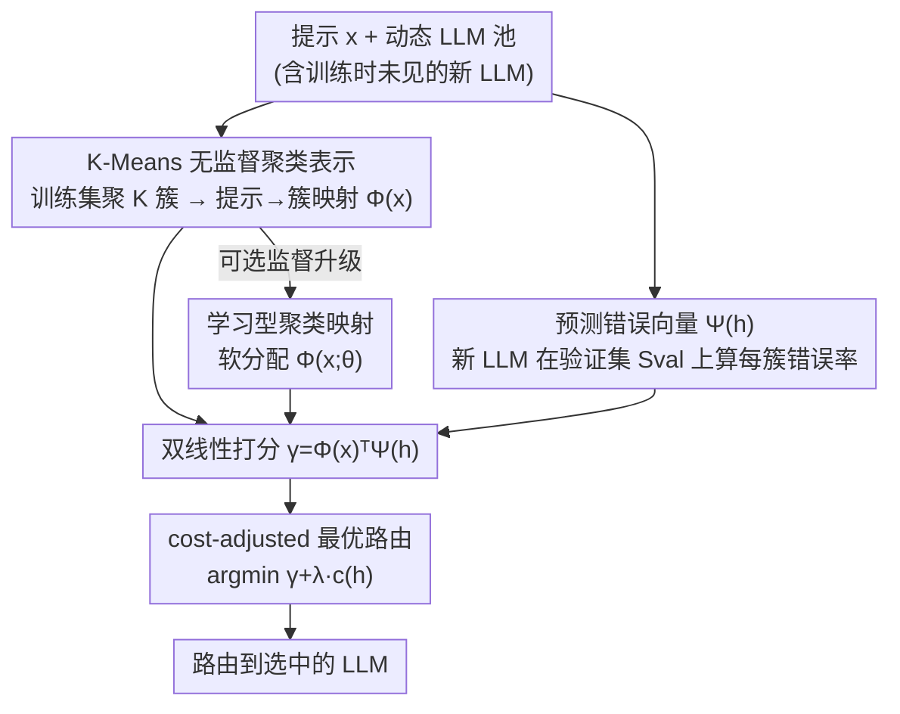

# Universal Model Routing for Efficient LLM Inference

**会议**: ICLR 2026  
**OpenReview**: [https://openreview.net/forum?id=ka82fvJ5f1](https://openreview.net/forum?id=ka82fvJ5f1)  
**代码**: 无  
**领域**: LLM效率  
**关键词**: 模型路由, 动态 LLM 池, 推理成本, 零样本泛化, 聚类表示

## 一句话总结
本文提出 UniRoute，把每个 LLM 编码成"在一小批代表性提示上的预测错误向量"，配合双线性打分器，让训练好的路由器**不重训**就能路由到测试时才出现的新 LLM，在 30+ 个未见模型上取得更好的成本-质量权衡。

## 研究背景与动机
**领域现状**：模型路由（model routing）是降低 LLM 推理成本的简单有效手段——维护一个不同规模/能力的候选 LLM 池，给每个提示预测"能搞定它的最小代价模型"，从而把昂贵的大模型只留给少数"难"输入。现有路由器几乎都是在**固定**的 LLM 池上学一个打分函数 $\gamma^{(m)}(x)$，再按 $r(x)=\arg\min_m[\gamma^{(m)}(x)+\lambda\cdot c^{(m)}]$ 路由。

**现有痛点**：实际部署中 LLM 池是**动态**的——新模型频繁发布、旧模型被弃用，甚至同一组模型因 GPU 供给、授权、任务适配等原因在测试时可用集都会变。固定池路由器的结构（线性层 $w_m^\top\phi(x)+b_m$、矩阵分解、BERT 头）每个输出对应一个具体模型，新模型一来就**对不上**。

**核心矛盾**：处理动态池只有两条朴素路——复用旧路由器，或每次变动就重训。复用会浪费新模型（小模型尤其多、对低成本区间至关重要）；重训则要为每个新模型在标注样本上重新打标签、再训练再部署，开销大且**小样本上容易过拟合**。

**本文目标**：设计一个路由器，使其能在**测试时**接纳任意新 LLM（含训练时完全没见过的）而无需任何梯度重训，同时仍保持接近最优的成本-质量权衡。

**切入角度**：作者观察到，路由的本质是预测"某模型在某提示上会不会错"。如果能给每个 LLM 一个**与池无关、可廉价计算**的特征表示，路由就能像零样本分类那样泛化到新模型。两个 LLM "相似"应当意味着它们在同一批验证提示上"对错模式相近"。

**核心 idea**：把模型身份的 one-hot 表示，换成 LLM 在一组代表性提示上的**预测错误向量**——用"它在哪些提示上错"来刻画一个模型，从而把路由器写成提示特征与模型特征的双线性内积，天然支持任意新模型。

## 方法详解

### 整体框架
UniRoute 要解决的是"动态池路由"：训练时见到模型集 $H_{tr}$，测试时却要在另一组模型 $H_{te}$（可能与 $H_{tr}$ 完全不交）里挑最优。它的关键转变是把打分器参数化为**提示特征 $\Phi(x)\in\mathbb{R}^K$ 与模型特征 $\Psi(h)\in\mathbb{R}^K$ 的内积**：

$$\gamma_{uni}(x,h)=\Phi(x)^\top\Psi(h).$$

只要 $\Psi(\cdot)$ 对任意模型都能廉价算出，路由就能无缝接纳新模型。整条流水线分三步：①在训练集 $S_{tr}$ 上拟合 $\Phi,\Psi$ 的参数（训练基础路由器）；②对每个测试 LLM $h_{te}$，在一小批验证集 $S_{val}$ 上计算其特征向量 $\Psi(h_{te})$（"嵌入"新模型）；③来一个新提示 $x$，按 $r(x,H_{te})=\arg\min_n[\gamma(x,h_{te}^{(n)})+\lambda\cdot c(h_{te}^{(n)})]$ 路由。第二步是一次性的、不含梯度更新，因此模型池后续怎么变都不影响已算好的向量。

### 关键设计

**1. 把每个 LLM 编码成"预测错误向量"，路由器变成双线性打分**

固定池路由器的根本局限是模型表示绑死在池上：线性路由 $(3)$ 等价于给模型一个 one-hot 表示 $\Psi_{oh}(h)=[\mathbf{1}(h=h_{tr}^{(m)})]_m$，新模型没有对应维度。UniRoute 用一个**与池无关**的表示替代它——给定带标注的小验证集 $S_{val}=\{(x^{(j)},y^{(j)})\}_{j=1}^{N_{val}}$，把任意模型 $h$（包括训练时没见过的）表示成它在这些提示上的 0/1 错误向量经投影 $F$ 后的结果：

$$\Psi(h)=F\big([\mathbf{1}(y^{(j)}\neq h(x^{(j)}))]_{j\in[N_{val}]}\big)\in\mathbb{R}^K.$$

配合 $\gamma_{uni}(x,h)=\Phi(x)^\top\Psi(h)$，只要新模型能在 $S_{val}$ 上跑一遍（仅需黑盒 API 访问、不需要模型权重），就能即时得到它的特征并参与路由。这正像零样本分类里的"语义输出编码"：内积越大说明两模型对错模式越像。Hu et al. (2024b) 的 K-NN 路由恰是本式的一个特例（取 $F$ 为恒等、$\Phi$ 为验证样本的近邻指示向量时 $\gamma_{uni}$ 精确退化为 K-NN 的 $\gamma$），但 K-NN 只用到 $S_{val}$、用不上更大的训练集信息，故泛化常较差。

**2. 基于每簇错误的无监督实例化（K-Means）**

直接在小验证集上聚类或建表都易过拟合。本文改为在**大训练集** $S_{tr}$ 上聚类，再把这套簇结构迁到验证集上算每簇错误。具体地，给定文本嵌入 $\phi$：先对训练集嵌入做 K-Means 得到 $K$ 个非重叠簇，由此定义硬分配映射 $\Phi_{clust}(x)\in\{0,1\}^K$（$x$ 属于哪个簇该位为 1）；再把验证样本按簇划分为 $C_k$；最后任意模型 $h$ 的特征取其每簇平均错误：

$$\Psi_{clust,k}(h)=\frac{1}{|C_k|}\sum_{(x,y)\in C_k}\mathbf{1}(y\neq h(x)).$$

于是 $\gamma_{clust}(x,h)=\Phi_{clust}(x)^\top\Psi_{clust}(h)$ 的含义非常直观：用"提示所在簇上该模型的平均错误"来估计它在这条提示上会不会错。接纳新模型只需在验证集上算一遍每簇错误——无梯度、一次性。$K=1$ 时退化为 ZeroRouter；实验显示对 $K$ 的取值相当鲁棒。

**3. 学习型聚类映射：用训练标签把硬分配升级为软分配**

无监督版的 $\Phi_{clust}$ 只看嵌入距离、没用上 $S_{tr}$ 里训练模型的对错标签。本文进一步在同一套簇上学一个**软分配**映射 $\Phi_{clust,k}(x;\theta)\propto\exp(\theta_k^\top\phi(x))$，把提示映成簇上的分布而非硬归一簇，从而更精细地刻画"这条提示更像哪几个簇"。参数 $\theta\in\mathbb{R}^{K\times D_P}$ 通过在 $S_{tr}$ 上对训练模型 $H_{tr}$ 的正误标签最小化 log 损失得到：

$$-\sum_{(x,y)\in S_{tr}}\sum_{h\in H_{tr}}\Big[\mathbf{1}(y\neq h(x))\log\gamma_{clust}(x,h;\theta)+\mathbf{1}(y=h(x))\log(1-\gamma_{clust}(x,h;\theta))\Big].$$

模型特征 $\Psi_{clust}(h)$ 仍由验证集每簇错误给出、与池无关，所以学到的 $\theta$ 照样能作用于新模型。这一版（LearnedMap）在多数数据集上把质量再推高一截。

**4. cost-adjusted Bayes 最优路由与超额风险界**

为什么"按错误打分 + 成本调整"这套式子是对的？作者证明（命题 1）：在动态池设定 $(5)$ 下，最优路由器会**逐模型分解**为

$$r^*(x,H)=\arg\min_{m}\Big[\,\mathbb{E}_{y|x}[\ell(x,y,h^{(m)})]+\lambda_H\cdot c(h^{(m)})\,\Big],$$

即路由到"加上成本惩罚 $\lambda_H c$ 后期望损失最小"的模型，$\lambda_H$ 调节质量与成本的权衡。UniRoute 的 $(8)$ 正是用 $\gamma$ 作为 $\gamma^*(x,h)=P[y\neq h(x)\mid x]$ 的 plug-in 估计。针对聚类近似带来的偏差，命题 2 给出超额风险界：把数据看作 $K$ 个隐成分的混合，则聚类路由 $(13)$ 与最优规则 $(7)$ 的 0-1 风险差，被**"逐提示错误 vs 所在簇平均错误"的最大偏差**所上界。这把"用簇均错误近似单点错误"的代价量化清楚了——簇内越同质，界越紧。

### 一个完整示例
设测试时来了一个训练时没见过的小模型 $h_{new}$，外加一条新提示 $x$。流程是：①离线已在训练集上聚出 $K$ 个簇并固定 $\Phi$（或学好的 $\Phi(\cdot;\theta)$）；②把 $h_{new}$ 在 ~400 条验证提示上跑一遍，按式 $(12)$ 算出它在每个簇上的平均错误率，得到 $K$ 维向量 $\Psi(h_{new})$（比如它在"数学簇"错 0.6、在"常识簇"错 0.1）；③对新提示 $x$，先用 $\Phi(x)$ 判断它落在哪个簇（设为常识簇），于是 $\gamma(x,h_{new})=\Phi(x)^\top\Psi(h_{new})\approx 0.1$，预测它大概率答对；④对池中每个模型都算 $\gamma+\lambda c$，挑最小者——若 $h_{new}$ 又便宜又在该簇上够准，它就会被选中。全程没有任何重训，新模型只贡献了一次验证集前向。

## 实验关键数据

### 主实验
在 EmbedLLM（112 个 LLM）、SPROUT o3-mini（15 个）、Headlines（12 个）、RouterBench（11 个）上做动态池路由：模型集按 2/3 训练、1/3 测试切分（即测试模型对路由器全新）。提示嵌入统一用冻结的 Gecko 1B（768 维）。指标：**QNC**（Quality-Neutral Cost，达到最准测试模型同等质量所需的最小相对成本，越低越好）与 **Area**（deferral 曲线下面积，越高越好）。

| 方法 | EmbedLLM QNC↓ | EmbedLLM Area↑ | SPROUT QNC↓ | SPROUT Area↑ | Headlines QNC↓ | Headlines Area↑ |
|------|------|------|------|------|------|------|
| ZeroRouter | 87.5% | .607 | 100.0% | .820 | 88.0% | .819 |
| K-NN | 45.9% | .636 | 29.6% | .844 | 43.7% | .830 |
| Retrained MLP | 35.9% | .641 | 80.9% | .829 | 74.2% | .823 |
| Retrained MatFac | 36.6% | .640 | 84.2% | .825 | 80.9% | .821 |
| **UniRoute (K-Means)** | 33.7% | .649 | **19.6%** | **.850** | 56.9% | .828 |
| **UniRoute (LearnedMap)** | **33.1%** | **.652** | 23.4% | .846 | **34.9%** | **.832** |

UniRoute 两个版本在 EmbedLLM、SPROUT、Headlines 上均优于全部基线，且相对 LearnedMap 的差距在 $\alpha=0.01$ 上统计显著（原表中 $*$ 标记的项）。在只有 11 个模型的 RouterBench 上，各法 QNC 都贴近 99%（模型间差异小、难拉开），UniRoute(K-Means) 仍以 Area .712 微弱领先。

### 消融实验

| 配置 / 变量 | 现象 | 说明 |
|------|------|------|
| 验证样本数 100→500 | UniRoute(K-Means) 的 Area 普遍高于基线且更平稳 | 大训练集聚类 + 池无关表示，小验证集也稳 |
| Retrained MLP（小验证集） | 在 EmbedLLM/SPROUT 等上明显掉点 | 为新模型重训时**过拟合**到几百条验证样本 |
| K-NN | 全面弱于 UniRoute | 只用验证集、用不上大训练集信息，非线性但不够强 |
| 簇数 $K$ | 结果对 $K$ 鲁棒（附录 G.2） | $K{=}1$ 退化为 ZeroRouter |
| LearnedMap vs K-Means | Headlines QNC 56.9%→34.9% | 用训练标签学软分配在该集收益最大 |

### 关键发现
- **"重训新路由器"反而更差**：Retrained MLP/MatFac 看似直接，但在 $O(10^3)$ 量级的小验证集上过拟合，多数数据集被 UniRoute 反超——这印证了"用池无关特征零样本接纳新模型"比"逐模型重训"更稳。
- **ZeroRouter 是出了名的强基线**（Hu et al. 2024b 也指出），但 UniRoute 在所有数据集上一致地超过它。
- **两个实例化各有所长**：K-Means 在 SPROUT 上 QNC 最低（19.6%），LearnedMap 在 Headlines 上把 QNC 从 56.9% 砍到 34.9%——是否值得引入监督学习，取决于训练标签能否提供额外区分度。

## 亮点与洞察
- **用"错误向量"当模型指纹**：把"模型在哪些提示上会错"作为特征，是个很轻但很对的表示——它只需黑盒 API 一次前向、与池规模无关，天然解耦"模型身份"与"路由器结构"，这正是零样本接纳新模型的关键。
- **K-NN 是特例这一观察很漂亮**：把已有强基线收编为自家框架的退化情形，既给方法找了落脚点，又顺手解释了为何能做得更好（K-NN 浪费了训练集）。
- **理论与工程闭环**：命题 1 说明 cost-adjusted argmin 是 Bayes 最优 plug-in，命题 2 把"簇均近似单点"的误差量化成可解释的偏差上界——这套"先证最优规则、再估计、再控误差"的范式可迁移到其他需要泛化到新动作/新臂的路由/选择问题。
- **可迁移 trick**：在大集合上聚类、再把簇结构迁到小集合算统计量，能有效规避小样本过拟合，适用于任何"标注样本贵但无标注样本多"的表示学习场景。

## 局限与展望
- **强依赖验证集分布**：$\Psi(h)$ 的质量取决于 $S_{val}$ 是否真实反映部署分布；若验证提示与线上分布偏离，错误向量就会失真。作者主要取训练集随机子集，实际部署需谨慎构造或领域定制。
- **仍需对每个新模型跑一遍验证集**：虽是一次性、无梯度，但当验证集较大或新模型上线极频繁时，这笔前向推理成本仍存在；论文靠"验证集规模适中（$O(10^3)$）"来控制。
- **只用 0-1 损失/二元正确性**：所有数据集都用二元准确率，连续质量分、生成质量、多目标（延迟+成本+质量）等更复杂场景未充分验证，式 $(6)$ 虽声称可适配其他损失但实证有限。
- **与 LLMBandit (Li, 2025) 缺直接复现对比**：因对方无公开实现，只能与其论文报告值比较，强基线下的相对优势仍有不确定性。

## 相关工作与启发
- **vs K-NN 路由 (Hu et al., 2024b)**：K-NN 也能无重训接新模型，且是 UniRoute 的特例；但 K-NN 只查验证集近邻、用不上大训练集，且小样本下泛化弱。UniRoute 用聚类 + 可学投影把训练集信息压进表示里，更稳更强。
- **vs Retrained MLP / MatFac (Ong et al., 2025; Zhuang et al., 2024)**：它们输出维度绑死模型数，新模型必须加输出头重训，在小验证集上过拟合且工程开销大；UniRoute 结构与池无关，零重训。
- **vs LLMBandit (Li, 2025)**：同样引入 LLM 嵌入，但 Li 用 RL 策略梯度 + 回放缓冲，训练不稳且依赖提示难度估计，且其嵌入依赖池内其他模型及加入顺序；UniRoute 用标准统计学习 + 普通梯度下降，嵌入是池无关、可直接解释的"每簇错误"。

## 评分
- 新颖性: ⭐⭐⭐⭐ 把模型路由从"固定池"推广到"动态池"，并用预测错误向量给出池无关表示，角度新且自洽。
- 实验充分度: ⭐⭐⭐⭐ 四个公开基准、30+ 未见模型、400 次独立试验 + 统计显著性，较扎实；但仅二元正确性、缺 LLMBandit 直接复现。
- 写作质量: ⭐⭐⭐⭐ 问题设定、方法、理论层层递进，图 1 直观；记号偏密。
- 价值: ⭐⭐⭐⭐ 直击"LLM 池频繁变动"这一真实痛点，方法轻、可黑盒部署，实用性强。

<!-- RELATED:START -->

## 相关论文

- [\[ICLR 2026\] Scaling Laws Meet Model Architecture: Toward Inference-Efficient LLMs](scaling_laws_meet_model_architecture_toward_inference-efficient_llms.md)
- [\[ICLR 2026\] PARD: Accelerating LLM Inference with Low-Cost Parallel Draft Model Adaptation](pard_accelerating_llm_inference_with_lowcost_parallel_draft_model_adaptation.md)
- [\[ICLR 2026\] Semantic Parallelism: Redefining Efficient MoE Inference via Model-Data Co-Scheduling](semantic_parallelism_redefining_efficient_moe_inference_via_model-data_co-schedu.md)
- [\[ICLR 2026\] FlashDLM: Accelerating Diffusion Language Model Inference via Efficient KV Caching and Guided Diffusion](flashdlm_accelerating_diffusion_language_model_inference_via_efficient_kv_cachin.md)
- [\[ICLR 2026\] DiSRouter: Distributed Self-Routing for LLM Selections](disrouter_distributed_self-routing_for_llm_selections.md)

<!-- RELATED:END -->
