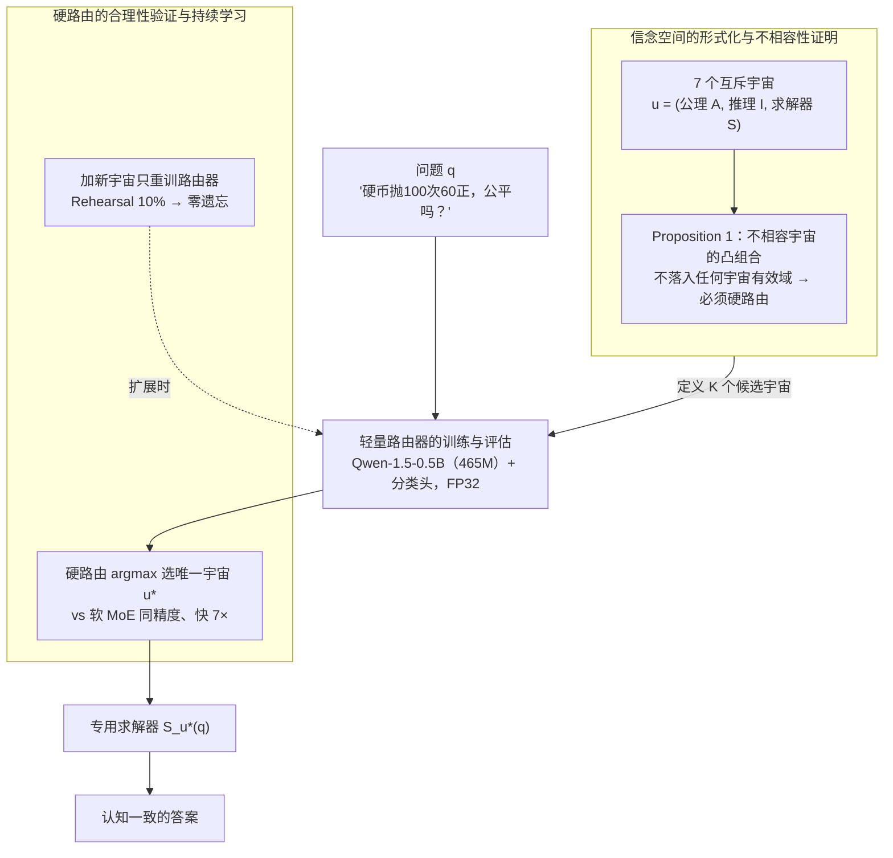

# Universe Routing: Why Self-Evolving Agents Need Epistemic Control

**会议**: ICLR 2026  
**arXiv**: [2603.14799](https://arxiv.org/abs/2603.14799)  
**代码**: 无  
**领域**: LLM效率 / 推理框架选择  
**关键词**: 认知路由, 信念空间, 硬路由, 持续学习, MoE

## 一句话总结

将自主Agent在链式推理中容易混淆认识论框架（如频率主义vs贝叶斯）的问题形式化为"宇宙路由"，训练一个465M参数的轻量路由器将问题分类到7个互斥信念空间后分发给专用求解器，证明硬路由比软MoE快7倍且精度相同，模块化架构配合rehearsal可实现零遗忘的持续学习。

## 研究背景与动机

**领域现状** 当前自主Agent（如ReAct、Reflexion等）在长期部署中能自主链接多步推理和行动，但面临一个被忽视的结构性失败模式：不是缺乏知识，而是无法判断该用哪种推理框架。例如面对"一枚硬币抛100次出现60次正面，它公平吗？"时，如果α=0.05则应使用频率主义假设检验，但如果问的是"给定均匀先验，P(θ>0.6|60次正面)是多少？"则必须使用贝叶斯推断。

**现有痛点** 频率主义和贝叶斯统计不是同一问题的不同解法，而是对"概率"本质持不同公理立场的认识论框架——混合使用产生的不是程度上的错误，而是类别上的逻辑矛盾（如"p值是假设为真的概率"在两个框架中都是错误的）。更糟糕的是，这种错误会沿决策链传播：下游推理步骤继承了上游的认知污染。

**核心矛盾** 扩大模型规模（更大的LLM）可以产生更流畅的输出，但流畅性不等于认知一致性。问题的本质是架构性的——当前Agent缺乏一个显式的机制来在推理之前判断该调用哪个推理框架。传统MoE的软路由假设不同专家共享同一底层现实，只是擅长不同技能——但认知不相容的框架不能做加权平均。

**切入角度** 作者将这个问题类比为"宇宙"——每个信念空间有自己的一套公理和推理规则，跨越宇宙边界不加声明就会产生逻辑矛盾。本文用一个小型路由器做硬分类，而不是让大模型自行判断。

**核心idea** 可靠的自演化Agent需要一个显式的认知控制层来管理推理框架的选择，而"宇宙路由"是这一原则的首个实例化。

## 方法详解

### 整体框架

这篇论文要解决的是一个看似细枝末节、实则致命的失败模式：Agent 在推理前没人告诉它"该用哪套认识论"，于是把频率主义和贝叶斯混着用，产出在任何一个框架里都站不住脚的结论。Universe Routing 的做法是把"选框架"这一步从大模型手里拿出来，交给一个独立的轻量路由器先做硬分类。整条链路只有三步：先把问题域形式化成 7 个互斥的信念空间（论文称之为"宇宙"），再训一个小路由器把输入问题判到唯一一个宇宙，最后把问题转给那个宇宙的专用求解器。关键在于路由是**硬**的——用 argmax 选一个宇宙，而不是像传统 MoE 那样对多个专家做加权平均；而且整个认知控制层是可扩展的，加新宇宙时只重训路由器、现有求解器一行不改。

### 关键设计

**1. 信念空间的形式化与不相容性证明：给"硬路由"一个理论上的非做不可**

路由可以软可以硬，凭什么这里非硬不可？论文先把每个信念空间定义成一个三元组 $u=(A_u, I_u, S_u)$——公理集 $A_u$、推理流程 $I_u$、求解器 $S_u$，覆盖 7 个宇宙：STAT_FREQ（频率主义）、STAT_BAYES（贝叶斯）、PHYS_CLASSICAL / QUANTUM / RELATIVITY（物理三框架）、STAT_MIXED（显式做框架比较）和 STAT_ILL_POSED（病态问题）。在此之上 Proposition 1 给出硬路由的理论依据：对两个认知不相容的宇宙 $u_i$、$u_j$，它们求解器输出的任何凸组合 $\alpha\cdot S_{u_i}(q)+(1-\alpha)\cdot S_{u_j}(q)$ 都不落在任何一个宇宙的有效域里——因为这个输出同时依赖互相矛盾的公理 $a$ 与 $\lnot a$。换句话说，软路由在这里不是"次优一点"，而是直接生成无意义的东西。论文用三个数值 Demo 把这一点坐实（硬币公不公平、参数估计、氢原子稳定性），每个 Demo 里混合输出放进任一框架都是错的。

**2. 轻量路由器的训练与评估：证明这是语义理解，不是关键词匹配**

有了理论，接下来要回答这个分类到底学不学得会、是真懂语义还是在背关键词。作者在 685 个样本（GPT-4 生成、再经专家约束）上微调路由器，主力是 Qwen-1.5-0.5B（465M）外接一个分类头，同时拿 BERT-base（110M）、DistilBERT（67M）、RoBERTa-base（125M）做对照。数据集刻意保证三件事：标签无歧义、同一框架有多样化的表面措辞、增广后各类别平衡。这里有一个很容易踩的实现坑——训练**必须用 FP32**，因为 FP16 下分类头的梯度会溢出，精度直接坍塌到 18.99%（约等于 7 类瞎猜）。判断"是语义还是关键词"的办法是看 OOD：4 种架构（67M–465M）在测试集上都拿到 97–98%，但换一批新措辞的 OOD 样本后，TF-IDF 这类关键词方法准确率骤降约 26pp，而语义路由器只掉约 11–14pp——说明它学到的是框架语义而非表面词。

**3. 硬路由的合理性验证与持续学习：把"认知控制层"做成可热插拔的一等组件**

最后要支撑论文真正的架构主张——认知控制应该是 Agent 的独立模块，而且能不断扩展。两个实验各管一头。一是硬路由 vs 软 MoE：两者精度**完全一样**（97.25% = 97.25%），但硬路由推理快 7 倍（5.5ms vs 38.2ms）。原因是信念空间在表示空间里几何可分，路由器给出的概率分布几乎是确定性的，加权平均退化成了选择，软路由白白多花算力却没收益。二是持续学习，把宇宙从 5 个扩到 7 个：Rehearsal 只回放 10%（29 个样本）就做到零遗忘，而 EWC 的对角 Fisher 近似抓不住这种模块化结构，仍有 75% 遗忘。模块化的好处也由此体现——加一个新宇宙只需训练路由器，现有求解器一行都不用改。

### 训练策略

路由器用 AdamW，学习率 $5\times10^{-5}$，batch size = 8，训练 3 个 epoch，单次训练在 RTX 3090 上约 4 分钟。685 个样本按 70/15/15% 划分为训练/验证/测试，另备 56 个 OOD 样本测泛化。标注由两位标注者独立完成，一致性 Cohen's $\kappa=0.91$。

## 实验关键数据

### 主实验

| 方法 | 参数量 | 测试准确率 | OOD准确率 | 泛化差距 |
|------|-------|-----------|----------|---------|
| Random | - | 21.1% | 14.3% | +6.8% |
| SVM + TF-IDF | - | 98.2% | 71.4% | +26.7% |
| DistilBERT | 67M | 98.2% | 83.9% | +14.2% |
| RoBERTa-base | 125M | 97.3% | 85.7% | +11.5% |
| Qwen-1.5-0.5B | 465M | 97.3% | 83.9% | +13.3% |
| **Qwen集成(×5)** | 465M | **98.2%** | **89.3%** | **+8.9%** |

### 消融实验

| 配置 | 关键指标 | 说明 |
|------|---------|------|
| 硬路由 vs 软路由 | 97.25% = 97.25%，7×加速 | 信念空间几何可分，加权平均无增益 |
| 对抗鲁棒性（总ASR） | TF-IDF 65.75% vs 本文1.53% | 语义理解比关键词匹配鲁棒43倍 |
| 持续学习(5→7宇宙) | Rehearsal 0%遗忘 vs EWC 75%遗忘 | 模块化比正则化更适合知识扩展 |
| 扩展顺序鲁棒性 | <3%变化 | 先统计后物理或反过来结果稳定 |
| vs云模型(80B-1T) | 88-775×更快，5/6无统计显著差异 | 465M路由器可媲美千亿参数模型 |

### 关键发现

- TF-IDF的关键词注入攻击成功率89.91%（加"consider the prior"就能骗过频率主义分类），语义路由器仅为4.59%
- 在MMLU外部验证中，合成数据训练的路由器比TF-IDF高10.6pp，且准确率随置信度单调提升
- 3个分类错误全部发生在真正的认知边界上（如双缝实验可用经典波动光学解释），且错误样本的置信度明显低于正确样本（67-81% vs 均值94%），表明路由器有校准的不确定性

## 亮点与洞察

- "认知不相容"的形式化非常精辟：Proposition 1不是说混合不好，而是证明混合产生的输出在任何单一框架中都不成立——这是一种更强的不可行性论证
- 小模型(465M)打败大模型(80B-1T)的场景值得关注：关键不在规模而在显式的边界监督，说明某些能力可以通过精准的任务定义+小体量模型高效获取
- 持续学习中EWC的彻底失败揭示了一个深层问题：正则化方法假设知识是连续分布的，但认知宇宙是离散模块化的——不同的知识组织方式需要不同的持续学习策略
- "先分框架再推理"的架构原则可推广：不仅适用于统计/物理，在法律（大陆法vs海洋法）、医学（循证vs经验）等领域同样存在框架不相容的问题

## 局限与展望

- 数据集规模极小（685样本、7个宇宙），仅覆盖数学和物理领域——是否能扩展到法律、伦理、因果等更模糊的认知边界是关键问题
- 硬路由的单标签假设无法处理真正需要跨框架的多步任务（如先用贝叶斯估计参数再用频率主义做检验）
- 测试集仅109样本，统计效力有限——云模型对比中仅DeepSeek-v3.1达到统计显著差异
- 仅评估路由精度而非端到端任务性能——正确路由后求解器输出质量未被验证
- Proposition 1的证明本质上是逻辑层面的，实际应用中认知边界往往不如统计vs贝叶斯那样清晰

## 相关工作与启发

- **vs Adaptive-RAG**：后者根据查询复杂度路由到不同检索策略，属于同一认识论框架内的策略选择；本文是跨越互斥认识论的框架路由——质的不同
- **vs MoE (Mixtral等)**：传统MoE的不同专家擅长不同技能但共享底层假设，软路由的加权平均是合理的；本文的异质求解器持有互斥公理，软路由在语义上无意义
- **vs ReAct/Reflexion**：这些方法处理"如何推理"（步骤规划、自我反思），本文处理"用哪个框架推理"——两者是互补的不同层次

## 评分

- 新颖性: ⭐⭐⭐⭐⭐ 将认知框架选择形式化为路由问题的视角非常新颖，Proposition 1的形式化论证严谨
- 实验充分度: ⭐⭐⭐ 思路清晰但数据量极小（685样本+109测试），外部验证有限
- 写作质量: ⭐⭐⭐⭐ 论证逻辑严密，核心主张-理论-实验的结构完整，但部分claim偏强
- 价值: ⭐⭐⭐⭐ 提出了Agent架构的一个重要缺失组件——认知控制层，即使当前验证规模有限，方向很有前景

<!-- RELATED:START -->

## 相关论文

- [\[ICLR 2026\] Did You Check the Right Pocket? Cost-Sensitive Store Routing for Memory-Augmented Agents](did_you_check_the_right_pocket_cost-sensitive_store_routing_for_memory-augmented.md)
- [\[ICLR 2026\] IterResearch: Rethinking Long-Horizon Agents with Interaction Scaling](iterresearch_rethinking_long-horizon_agents_with_interaction_scaling.md)
- [\[ICML 2026\] Do Transformers Need Three Projections？三选一/二的 QKV 共享系统研究](../../ICML2026/llm_efficiency/do_transformers_need_three_projections_systematic_study_of_qkv_variants.md)
- [\[ICML 2026\] Scout: Active Information Foraging for Long-Text Understanding with Decoupled Epistemic States](../../ICML2026/llm_efficiency/scout_active_information_foraging_for_long-text_understanding_with_decoupled_epi.md)
- [\[NeurIPS 2025\] Tensor Product Attention Is All You Need](../../NeurIPS2025/llm_efficiency/tensor_product_attention_is_all_you_need.md)

<!-- RELATED:END -->
