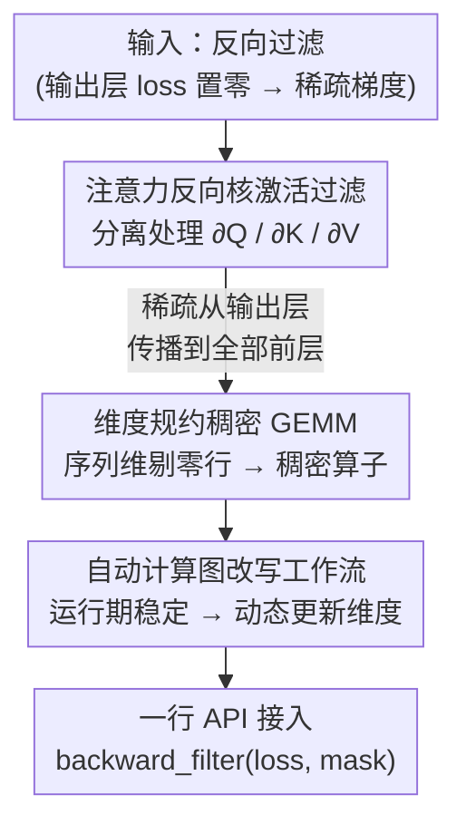

# Unlocking Full Efficiency of Token Filtering in Large Language Model Training

**会议**: ICLR 2026  
**OpenReview**: [https://openreview.net/forum?id=eshXwEnENV](https://openreview.net/forum?id=eshXwEnENV)  
**代码**: 待确认（论文称已封装为 `centrifuge.ops.backward_filter` 一行 API）  
**领域**: LLM效率 / 训练系统 / 算法系统协同设计  
**关键词**: Token Filtering, 反向稀疏, FlashAttention, 维度规约 GEMM, 计算图改写

## 一句话总结
针对「token filtering 能提升模型效果却几乎没省训练时间」这个怪现象，本文提出 CENTRIFUGE：在注意力反向核里进一步过滤被丢弃 token 的激活，把稀疏从输出层一路传播到所有前层；再用「维度规约的稠密 GEMM」替代低效的稀疏 GEMM，让 30%~50% 这种「不上不下」的稀疏度也能真正提速——过滤 50% token 时反向加速最高 49.9%、端到端最高 34.7%，且完整保留了 token filtering 带来的精度收益（最高 +26.6%）。

## 研究背景与动机
**领域现状**：token filtering（token 过滤）是近年提出的训练范式，核心是用一个参考模型评估每个 token 的重要性，把噪声大、对训练贡献小的 token 丢掉。其中 **backward filtering**（反向过滤）效果最好——前向计算照常进行，只在输出层算 loss 时把 top-k% 重要 token 留下、其余 token 的 loss 置零，从而隐式提升训练数据质量，在多项任务上能带来最高 30% 的绝对精度提升。

**现有痛点**：人们自然期待「少算一些 token = 少算一些计算 = 训练更快」，但作者实测发现，把 token filtering 接进现有训练系统后，即使丢掉 40% 的 token，端到端训练时间也只快了可怜的 **1.2%**。说好的省算力，几乎没兑现。

**核心矛盾**：问题出在两处。第一是**稀疏度传不下去**：现有方法只在输出层把 loss 置零，得到的是稀疏的梯度，但前层的激活（activation）一个没动——稀疏梯度一旦乘上稠密激活，过了第一个注意力块就重新变稠密了。于是只有最后一层的反向能省，前面所有层照算不误，TinyLlama 上算下来反向最多省 1.8%、端到端 1.2%。第二是**稀疏度区间不对路**：token filtering 带来的稀疏度只有 30%~50%，而现有 ML 库里的稀疏 GEMM（如 `torch.sparse`）要 >95% 稀疏才划算，在 40% 这个区间用稀疏 GEMM 甚至比稠密 GEMM 慢 10×。

**朴素解法为何失败**：一个直觉的补救是「连激活也一起过滤」——把 softmax 激活里被丢 token 对应的部分置零来保住稀疏。但主流训练系统普遍用 memory-efficient attention（如 FlashAttention），它**不显式存储 softmax 输出**，没法直接过滤；若退而过滤 Q/K/V 激活，反向重算 softmax 时不同梯度输出之间会**互相干扰**，尤其会误伤 $\partial Q$，导致训练 loss 不收敛。

**本文目标**：在**不损失** token filtering 精度收益的前提下，把它的训练效率真正释放出来。

**核心 idea**：算法层把稀疏「做真」——只过滤该过滤的 $\partial K/\partial V$ 激活、放过 $\partial Q$，让稀疏从输出层传播到全部前层且兼容 FlashAttention；系统层把「稀疏 GEMM」换成「维度规约后的稠密 GEMM」，全程沿用已被高度优化的稠密算子。

## 方法详解

### 整体框架
CENTRIFUGE 解决的是「token filtering 名义稀疏、实际不省」的落地难题，做法是**算法 + 系统协同设计**两件事串起来：先在算法层把反向过程拆成 token 间（注意力块）和 token 内（FFN、Q/K/V 投影、多头合并）两类计算，认识到所需的序列维稀疏只由注意力块产生，于是只改注意力反向核——分别处理三个梯度输出，过滤 $\partial K/\partial V$ 的激活、保留 $\partial Q$ 的完整激活，既放大稀疏又不干扰梯度；稀疏一旦在序列维「做真」，系统层就接手：分析反向计算图后发现「传给下游的梯度天然继承稀疏、参数梯度里序列维本就消失」，于是直接在序列维**剔除零行**，把稀疏 GEMM 整体降维成稠密 GEMM；由于 PyTorch 动态图无法用静态规则改写，再用一个**自动工作流**借助「训练期计算图稳定」的特性，在反向前动态识别并更新需要改维度的节点。最终对已用 token filtering 的系统，只需加一行代码即可获得全部加速。

### 关键设计

**1. 注意力反向核里分离处理三个梯度，只过滤 ∂K/∂V 保住稀疏**

这一步针对「稀疏传不下去」+「朴素过滤会误伤 $\partial Q$」两个痛点。作者先把 decoder 反向拆成 token 间（注意力）与 token 内（FFN、投影、多头合并）两类计算，指出所需的序列维稀疏**只由注意力块产生**，所以只需改注意力反向核。接着逐个分析 FlashAttention 反向核的三个输出：$\partial Q$ 的行稀疏跟随注意力前向输出 $\mathrm{Attn}=\mathrm{softmax}(QK^T/\sqrt{d})V$，**只要输入梯度稀疏，$\partial Q$ 在被丢 token 位置天然为零**，不是稀疏丢失的元凶；而 $\partial K$、$\partial V$ 的行稀疏跟随的是稠密矩阵 $Q$，在被丢 token 位置仍为非零，**必须过滤**才能保住稀疏。

关键冲突在于：算 $\partial K/\partial V$ 只需过滤后剩下的那部分 K/V 激活，算 $\partial Q$ 却需要**完整**的 K/V 激活——朴素方法提前把 K/V 激活过滤掉，就满足不了 $\partial Q$，于是误伤。CENTRIFUGE 的解法是重排 FlashAttention 反向流程，把计算分成两路、用不同激活分别算：一路用**非过滤** token 的激活算 $\partial K,\partial V$，另一路用**全部** token（含被丢的）的激活算 $\partial Q$。形式上记保留/被丢 token 的激活为 $\hat A\in\mathbb{R}^{b\times s_1\times h}$、$\check A\in\mathbb{R}^{b\times s_2\times h}$（$s=s_1+s_2$）：

$$\partial K=\partial\hat S^{T}\hat Q,\quad \partial V=\hat P^{T}\partial\hat O,\quad \partial Q=\partial\hat S\,\hat K+\partial\check S\,\check K$$

其中 $\hat P=\exp(\hat S-\widehat{LSE})$、$\partial\hat S=\hat P\circ(\partial\hat P-\hat D)$，沿用 FlashAttention 反向记号（$D$ 为 $\partial O$ 行和、$LSE$ 为 logsumexp）。三个输出形状统一为 $\mathbb{R}^{b\times s_1\times h}$，即只保留 $s_1$ 个 token。这样既兼容 memory-efficient attention，又让稀疏从输出层一路传到所有前层，且不破坏任何梯度的正确性——实现上对 $\partial Q$ 额外用了一个支持 attention bias 的 cuDNN memory-efficient 注意力核。

**2. 把稀疏 GEMM 转成维度规约的稠密 GEMM**

算法层把稀疏「做真」之后，系统层还卡在「30%~50% 稀疏度用稀疏 GEMM 反而更慢」上。作者没有去优化稀疏算子，而是分析了反向计算图里的通用结构：节点输入是稀疏梯度 $G\in\mathbb{R}^{b\times s\times h_1}$（被丢 token 的行为零），输出分两类——① 传给下游的梯度 $G_X=G\cdot W$ 或 $G\circ g$，**继承输入的行稀疏**；② 参数梯度 $G_W=X^T\cdot G$，由于参数与序列长度无关，**序列维本就在结果里消失**。两点结论一致指向同一个手段：**直接在序列维把零行剔掉**——下游梯度会自动跟着变小，参数梯度本来也不需要那一维。

于是稀疏 GEMM 被整体重写为「先收缩序列维、再做稠密 GEMM」。这比硬优化稀疏算子更划算，因为稠密 GEMM 在现有 ML 库里已被打磨到极致。维度规约还顺带降低了通信量——这也是为什么在张量并行（TP）下 CENTRIFUGE 加速最明显：激活过滤后通信量随之线性下降。

**3. 用「运行期稳定」自动改写动态计算图**

维度规约听上去简单，落到 PyTorch 上却很棘手：动态图的结构和节点用法随实现与输入而变，没法写一套静态规则去全局改维度。作者抓住的关键观察是「图虽动态、但确定」——同一份模型实现 + 同样的输入，整个训练过程里计算图**保持稳定**（runtime stability）。因此可以先用一份模拟输入遍历一遍图、把每个节点信息确定下来。自动工作流分两步：① 为每类节点生成处理其属性的骨架代码；② 用质数等**特殊标记**追踪哪些维度需要被更新，据此动态生成每个节点的详细处理规则。这样在每次反向前动态识别并更新需要降维的节点与变量，离线准备成本只是一次前向传播，相比整个训练几乎可忽略。

### 损失函数 / 训练策略
训练目标沿用 Lin et al. (2024) 的反向 token filtering：只在保留的 k% token 上回传 loss，

$$\mathcal{L}_{\text{filter}}=-\frac{1}{N\times k\%}\sum_{i=1}^{N} I_{k\%}(x_i)\log P_\theta(x_i\mid x_{<i};\theta)$$

其中 $I_{k\%}(x_i)=1$ 当且仅当 $x_i$ 落在 $(L_\theta(x_i)-L_{\text{ref}}(x_i))$ 的 top-k%（$L_\theta$、$L_{\text{ref}}$ 分别为目标模型与参考模型的 loss）。CENTRIFUGE 不改这个目标，只改它的反向计算方式，所以**精度收益与原 token filtering 完全一致**，差别只在效率。

## 实验关键数据

### 主实验
测试床为 8×RTX 3090（24GB）/ 部分用 8×H20-96GB，PyTorch 2.8.0、CUDA 12.8、BF16 混合精度；任务以数学推理为主，目标模型在 open-web-math（OWM）上微调，参考模型在高质量数学数据上训练。模型规模覆盖 1.1B~40B。

精度（TinyLlama-1.1B 为基座，9 任务平均）：

| 方法 | 训练数据 | GSM8K | MAWPS | 平均 |
|------|----------|-------|-------|------|
| No Finetuning | — | 2.3 | 20.2 | 13.7 |
| Regular Finetuning | OWM (全量) | 3.6 | 36.2 | 17.8 |
| CENTRIFUGE | OWM (过滤 50%) | 11.8 | 62.8 | 27.3 |

相比常规训练，单任务最高 +26.6%（MAWPS），平均 +9.5%——验证「只算一半 token 反而更好」。

效率（过滤 50% token，处理 100 万 token 的耗时，节选）：

| 模型 | 训练方式 | 反向 | 端到端 |
|------|----------|------|--------|
| TinyLlama-1.1B (4K) | DP=4 | ↓40.0% | ↓24.2% |
| Llama3.2-3B (2K) | LoRA 单卡 | ↓43.1% | ↓17.9% |
| Llama3.1-8B (2K) | TP=8 | ↓49.0% | ↓31.7% |
| Qwen3-14B (2K) | TP=8 | ↓49.9% | ↓34.7% |
| ALIA-40B (4K) | TP=8 | ↓43.4% | ↓24.7% |

反向加速 40.0%~49.9%、端到端 17.9%~34.7%；TP 下加速最猛，因为通信量也随激活过滤线性下降。

### 消融实验

| 配置 | 现象 | 说明 |
|------|------|------|
| 只过滤 loss（Lin et al. 2024） | 收敛正常但端到端仅 +1.2% | 稀疏传不到前层，几乎不省时间 |
| Strawman（直接过滤 softmax 激活） | 训练 loss **不收敛** | 误伤 $\partial Q$，与 FlashAttention 冲突 |
| CENTRIFUGE | 收敛曲线与「只过滤 loss」重合 | 既保精度又真正提速 |

### 关键发现
- **稀疏「做真」是核心贡献**：朴素只过滤 loss 端到端仅 1.2%，CENTRIFUGE 把同样的稀疏度兑现成最高 34.7% 的端到端加速，差距全在「稀疏有没有传到前层」。
- **越重计算/越多通信，收益越大**：上下文从 1K 到 4K，吞吐优势从 1.12× 涨到 1.40×；端到端加速随过滤比例线性增长——长上下文、大模型、TP 场景最受益。
- **图改写开销可控且可被掩盖**：filter operator 随模型变大而增大（逐层更新），但远小于省下的时间；还能用双 micro-batch 把改图与前向重叠进一步摊薄。

## 亮点与洞察
- **「稀疏不是没有，而是传不下去」这个诊断很关键**：把反向拆成 token 间/token 内，定位到稀疏只由注意力块产生，于是只动注意力反向核就够，避免了对整个反向的大改。
- **不优化稀疏算子，而是把问题转回稠密算子**：30%~50% 稀疏度下稀疏 GEMM 注定打不过稠密 GEMM，索性「剔零行 + 稠密 GEMM」，直接吃现有库的优化红利——这种「绕开难点而非硬攻」的工程取舍很值得借鉴。
- **分离 ∂Q 与 ∂K/∂V 的洞察**：看清三个梯度输出对稀疏的不同依赖（$\partial Q$ 跟 Attn 输出、$\partial K/\partial V$ 跟稠密的 $Q$），才能既保住稀疏又不误伤 $\partial Q$，这是 strawman 失败而本文成功的分水岭。
- **一行代码接入**：把全部复杂度藏进 `backward_filter(loss, mask)`，对已用 token filtering 的系统几乎零迁移成本。

## 局限与展望
- **图改写依赖「运行期稳定」假设**：一旦训练过程中计算图会变（如动态控制流、变长 batch 结构频繁变化），自动工作流的确定性前提可能不成立。
- **filter operator 开销随模型线性增大**：逐层更新图的设计在超大模型上开销不小，虽可被计算掩盖，但实现复杂度和 corner case 风险上升。
- **与 MoE 的负载均衡是开放问题**：各专家被过滤的 token 数可能不同，token filtering 对 MoE 负载均衡的影响作者自己也说「尚不清楚」，需专门处理才能拿满效率。
- **聚焦反向过滤 + 微调场景**：实验以数学推理微调为主，前向过滤、长序列（128K）压缩与之结合的效果仅作为未来方向讨论。

## 相关工作与启发
- **vs 只过滤 loss 的 token filtering（Lin et al. 2024）**：他们在输出层置零 loss、精度收益相同，但稀疏传不到前层，端到端只快 1.2%；CENTRIFUGE 保留其精度、把稀疏做真，端到端最高快 34.7%——是其「效率补全版」。
- **vs Strawman（过滤 softmax/Q,K,V 激活）**：朴素过滤虽保住稀疏却与 memory-efficient attention 冲突、误伤 $\partial Q$ 致不收敛；CENTRIFUGE 用分离处理三个梯度输出绕开干扰，是「能在 FlashAttention 上跑通」的关键区别。
- **vs 数据选择（data selection）**：数据选择在训练前按样本粒度筛，可能引入偏差；CENTRIFUGE 是 token 粒度、模型自适应的细粒度选择。
- **vs 参数高效训练（LoRA 等）**：二者分别在数据维和参数维做稀疏，互补；CENTRIFUGE 叠加 LoRA 仍能把反向加速 43.1%。

## 评分
- 新颖性: ⭐⭐⭐⭐⭐ 把「token filtering 不省时间」的根因诊断到稀疏传播 + 稀疏度区间错配，算法/系统两层都给出非显然解法
- 实验充分度: ⭐⭐⭐⭐ 覆盖 1.1B~40B、DP/TP/LoRA 多场景，精度与效率双验证；但任务集中在数学微调，预训练场景未充分覆盖
- 写作质量: ⭐⭐⭐⭐⭐ observation 驱动、strawman 对照清晰，公式与图配合到位
- 价值: ⭐⭐⭐⭐⭐ 一行代码接入、即插即用，对已采用 token filtering 的训练系统有直接落地价值

<!-- RELATED:START -->

## 相关论文

- [\[ICLR 2026\] ParaRNN: Unlocking Parallel Training of Nonlinear RNNs for Large Language Models](pararnn_unlocking_parallel_training_of_nonlinear_rnns_for_large_language_models.md)
- [\[ICLR 2026\] Demystifying and Enhancing the Efficiency of Large Language Model Based Search Agents](demystifying_and_enhancing_the_efficiency_of_large_language_model_based_search_a.md)
- [\[ICLR 2026\] Scaling Large Vision-Language Model RL Training via Efficient Load Balancing](scaling_large_vision-language_model_rl_training_via_efficient_load_balancing.md)
- [\[ICLR 2026\] Explainable Token-level Noise Filtering for LLM Fine-tuning Datasets](explainable_token-level_noise_filtering_for_llm_fine-tuning_datasets.md)
- [\[ICLR 2026\] AutoSP: Unlocking Long-Context LLM Training Via Compiler-Based Sequence Parallelism](autosp_unlocking_long-context_llm_training_via_compiler-based_sequence_paralleli.md)

<!-- RELATED:END -->
