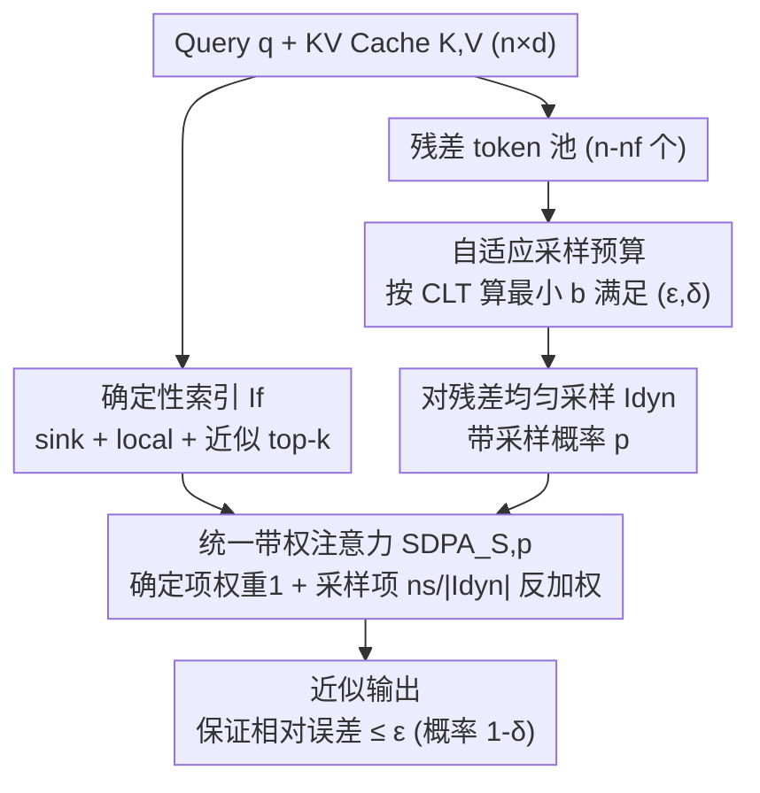

# vAttention: Verified Sparse Attention via Sampling

**会议**: ICLR 2026  
**OpenReview**: [https://openreview.net/forum?id=zzTDulLys0](https://openreview.net/forum?id=zzTDulLys0)  
**代码**: 待确认  
**领域**: LLM效率 / 稀疏注意力  
**关键词**: 稀疏注意力, KV Cache, 采样估计, 近似保证, 长上下文解码

## 一句话总结
vAttention 把"确定性 top-k 选关键 token"和"对长尾随机采样"统一进同一套注意力计算，并用中心极限定理自适应决定采样预算，让稀疏注意力第一次能对每个 head 给出用户指定的 $(\epsilon, \delta)$ 近似误差保证，在 RULER-HARD 上 10% 稀疏度下比 HashAttention 高出约 4.5 个百分点。

## 研究背景与动机
**领域现状**：LLM 解码阶段要为每个新 token 反复读取整段 KV Cache，上下文一长就变成显存带宽瓶颈，甚至 KV Cache 装不下要卸载到 CPU 内存、来回搬运更慢。主流的提速手段是稀疏注意力：只对 KV Cache 里的一部分 token 算注意力。目前两大流派是近似 top-k（以及它的扩展 top-p）和最近出现的基于采样的估计（如 MagicPig）。

**现有痛点**：top-k 类方法假设"当前 token 的语义只由上下文里少数几个 token 决定"，把信息当成离散单元来选。但注意力分数并不总是尖锐分布——尤其在浅层、或语义弥散在大量 token 上的情况下，分数接近均匀，此时选 top-k 会严重失真。top-p 试图按累积分数自适应选数量，但当分数接近均匀时它会被迫选进大量 token，效率很差。更关键的是，无论 top-k、top-p 还是 MagicPig，都**没有任何近似质量的保证**，用户无法控制"我愿意牺牲多少精度换多少速度"。

**核心矛盾**：注意力输出本质是 $n$ 个量求和（分母是标量和、分子是向量和）。当和被少数大项主导时，选出这几个大项就是最好的近似；当各项数值相近时，随机采样反而能用很小的样本逼近这个和。top-k 只擅长前一种情形、采样只擅长后一种，而真实的注意力分布在不同 head、不同 query 上在这两种情形间来回切换，没有任何单一策略普适。论文用 GSM-Infinite 的 ablation 验证了这一点：oracle-top、random-sample、MagicPig 三者的优劣次序**在同一 query 跨 head、同一 head 跨 query 都不一致**。

**本文目标**：(1) 把 top-k 与采样融成一个机制，让它在两种分布下都不掉链子；(2) 给出可由用户指定、且每个 head 都能满足的近似误差保证。

**切入角度**：作者发现 top-k 和随机采样天然互补——用确定性索引抓住 heavy-hitter，再用均匀采样去估计扣掉 heavy-hitter 后"长尾残差"那部分和。残差一旦不含离群大项，采样收敛得很快，而采样的统计收敛性恰好能反过来给出误差保证。

**核心 idea**：用"确定性选大头 + 对长尾均匀采样，并按中心极限定理算出满足 $(\epsilon, \delta)$ 所需的最小采样量"来替代纯 top-k，从而得到第一个"带保证"（verified）的稀疏注意力。

## 方法详解

### 整体框架
vAttention 在每个 head、每一层都做同一件事：把要参与注意力的 token 索引拆成**确定性部分**和**随机部分**两块，再用一个统一的（带概率权重的）公式算注意力。确定性部分包括三类"重点 token"——attention sink（开头若干 token）、local window（最近若干 token）、以及由任意现成近似 top-k 方法（如 HashAttention）预测出的高分 token；这三类合起来记作 $I_f$，约占总 token 的 $n_f$ 个。剩下 $n_s = n - n_f$ 个就是"长尾残差"，vAttention 从中**均匀随机采样** $b$ 个索引 $I_{dyn}$ 去估计残差对分子分母的贡献。

关键在于 $b$ 不是拍脑袋定的：vAttention 先用一小撮基础样本估计残差的统计量（方差/迹），再据此算出"要让分子和分母都达到 $(\epsilon, \delta)$ 精度所需的最小采样预算"。整个索引计算和预算计算都在 GPU 上完成，最终的注意力计算可以从 GPU 或 CPU 上取对应 KV，因此即使 KV Cache 卸载到 CPU 也能用。

### 关键设计

**1. top-k 与采样统一：确定性抓大头 + 长尾无偏采样估计**

这一步直接针对"top-k 在均匀分布下失真、采样在尖锐分布下浪费"的矛盾。vAttention 把索引集合写成 $S = I_f \cup I_{dyn}$，每个索引带一个采样概率 $P_i$：确定性索引 $i \in I_f$ 取 $P_i = 1$，残差采样索引 $i \in I_{dyn}$ 取 $P_i = |I_{dyn}|/n_s$。分子分母都按这套概率做**重要性反加权**求和：

$$N = \underbrace{\sum_{i \in I_f} \exp\langle K[i],q\rangle V[i]}_{\text{确定性大头 } N_f} + \underbrace{\frac{n_s}{|I_{dyn}|}\sum_{j \in I_{dyn}} \exp\langle K[j],q\rangle V[j]}_{\text{采样估计残差 } N_{dyn}}$$

分母 $D$ 同理。其中 $\frac{n_s}{|I_{dyn}|}$ 这个系数是关键：它把"从 $n_s$ 个残差里只采了 $|I_{dyn}|$ 个"重新放大回去，使采样和成为残差真实和的**无偏估计**。这套带概率的公式（论文式 3）天然涵盖纯确定性选择（概率全为 1）和确定+随机混合，比起 top-k 只丢掉长尾，它把长尾的贡献以无偏方式保留了下来——这正是当分布接近均匀时 top-k 会崩、而 vAttention 不崩的根本原因。

**2. 自适应采样预算：用中心极限定理把误差容忍度翻译成最小样本量**

光会采样还不够，要"保证"就必须知道采多少才够。vAttention 的理论核心是一条估计向量和的引理：要估计 $n_s$ 个向量 $r_i$ 之和 $s$，用大小为 $b$ 的样本做估计 $\hat{s}_b = \frac{n_s}{b}\sum_{i \in I_b} r_i$，那么当

$$b \ge \left(\Phi^{-1}\!\left(1-\tfrac{\delta}{2}\right)\frac{n_s\sqrt{\mathrm{Tr}(\Sigma)}}{\tau}\right)^2 \quad\Rightarrow\quad \Pr(\|\hat{s}-s\|_2 > \tau) \le \delta$$

其中 $\Sigma$ 是残差总体的协方差矩阵、$\Phi$ 是正态分布 CDF。把 $\tau$ 分别取成 $\epsilon\|N\|_2$（分子）和 $\epsilon D$（分母），就能分别算出分子预算 $b_N$ 和分母预算 $b_D$。直觉上：残差越分散（$\mathrm{Tr}(\Sigma)$ 越大）、要求越严（$\epsilon$ 越小、$\delta$ 越小），需要的样本就越多——这恰好实现了"按 head 按 query 动态调整预算"。由于真实的 $\Sigma$、$\|N\|_2$、$D$ 事先不知道，算法先用比例为 $f_b$ 的一小撮基础样本把它们估出来，再代入公式定 $b$（论文 Algorithm 2 的 `budgetX`）。这里用的是较乐观的 CLT 近似，附录里也讨论了用更保守的 Hoeffding 界的版本。

**3. verified-SDPA：把分子分母的保证合成整条注意力的保证**

分子分母分别有保证还不等于注意力输出（二者之商）有保证。论文用 Lemma 4.2 把两者缝起来：若分子达到 $(\epsilon_1, \delta_1)$、分母达到 $(\epsilon_2, \delta_2)$ 近似且 $\epsilon_2 < 0.5$，则取 $b = \max(b_D, b_N)$ 能保证

$$\Pr\!\left(\left\|\tfrac{N}{D}-\tfrac{\hat{N}}{\hat{D}}\right\|_2 > 2(\epsilon_1+\epsilon_2)\left\|\tfrac{N}{D}\right\|_2\right) < \delta_1+\delta_2$$

再进一步（Theorem 4.3），通过在 $(\epsilon', \delta')$ 上做最小化搜索分配总预算，就得到一个能让整条注意力输出满足用户给定 $(\epsilon, \delta)$ 的 budget 计算式。这一层是"verified"名号的来源：它把抽象的"我要 head 输出相对误差不超过 $\epsilon$、置信度 $1-\delta$"一路落实成可执行的采样预算，且实验证明用户设定的 $\epsilon$ 与实际观测到的层注意力误差近乎完美线性相关——也就是说这个旋钮是真的能拧动质量-效率权衡的。

### 损失函数 / 训练策略
vAttention 是纯推理期方法，不需要任何训练或微调，直接套在现成模型上即可。可调参数为各类确定性 token 的比例 $f_s, f_l, f_t$（sink / local / top-k）、基础采样率 $f_b$，以及用户给定的 $(\epsilon, \delta)$。沿用既有工作的设定：context 处理阶段用全注意力、question 与 generation 阶段才用稀疏注意力。

## 实验关键数据

### 主实验
RULER32K-HARD（从 RULER 中挑出 7 个 top-k 方法已知吃力的子任务），10% 稀疏度下的平均表现：

| 模型 | SDPA(全注意力) | oracle-top-k | vAttention(oracle-top-k) | HAT | vAttention(HAT) |
|------|------|------|------|------|------|
| Llama-3.1-8B-Inst | 88.74 | 87.18 | **88.61** | 81.94 | **86.56** |
| Dpsk-R1-Distill-Llama-8B | 65.41 | 64.87 | **65.15** | 60.70 | **65.06** |
| Mistral-7B-Inst-v0.3 | 64.05 | 64.37 | 64.12 | 54.66 | **56.90** |

vAttention(HAT) 相对裸 HashAttention 在 Llama-3.1-8B 上提升约 4.6 个点、在 Deepseek-R1 上约 4.3 个点；vAttention(oracle-top-k) 几乎追平全注意力。论文同时给出 Pareto 曲线，显示 vAttention 在质量-密度、误差-密度两个权衡上都优于含 oracle top-p 在内的所有 baseline，跨数据集可在最高约 20× 稀疏度下匹配全模型质量。

### 长生成 / 推理场景
AIME2024（DeepSeek-R1-Distill-Llama-8B，生成上限 32K token，$\epsilon=\delta=0.05$，未调参）：

| 配置 | avg@4 |
|------|------|
| dense（全注意力） | 36.66 |
| vAttention(oracle-top-k) | 36.67 |
| vAttention(HashAttention) | 35.00 |

在约 10–15% 密度、32K token 长生成下，vAttention 仍能基本匹配全模型推理准确率，说明低近似误差让它扛得住长链式推理的误差累积。

### 关键发现
- **更准的 top-k 仍然重要**：vAttention(oracle-top-k) 始终优于 vAttention(HAT)，说明 vAttention 不是替代 top-k，而是给 top-k 补上长尾——确定性部分越准、整体越好。
- **$\epsilon$ 旋钮是真有效的**：用户设定的容忍度 $\epsilon$ 与实际层注意力误差近乎完美线性相关，这是其它稀疏注意力给不出的"可控性"。
- **效率随密度近线性**：KV Cache 放在 CPU 时，因解码是带宽瓶颈、延迟主要取决于读取的 KV 量，vAttention 取得近线性加速；论文用的还只是朴素 PyTorch 索引实现，留了 CUDA kernel 的优化空间。
- **MagicPig 在该评测设定下表现不佳**：在"context 全注意力 + 问答/生成稀疏"的设定下，纯 LSH 采样反而不稳。

## 亮点与洞察
- **把"误差保证"做成用户旋钮**：以往稀疏注意力是"给个稀疏度，质量听天由命"，vAttention 反过来"给个误差容忍度 $\epsilon$，自动算需要多少 token"，这把不可控的近似变成了可标定的工程组件，对生产部署意义很大。
- **top-k 与采样互补这一观察很本质**：和值被大项主导就选大项、各项相近就采样——这是个超越注意力的通用求和估计直觉，作者把它干净地落到了 SDPA 上。
- **可组合性强**：确定性 top-k 那一块可以插任意现成近似 top-k 方法（HashAttention、DoubleSparsity 等），辅助结构（如 HashAttention 每 token 每 head 仅 32 bit）小到能常驻 GPU，工程上很友好。
- **无偏反加权技巧**可迁移到任何"选大头 + 估长尾"的稀疏计算场景。

## 局限与展望
- **理论保证只针对分子/分母/单 head 输出**，并不直接控制最终模型输出或下游任务质量；作者论证它们强相关，但这是经验相关而非端到端保证。
- **预算依赖统计量估计**：$\Sigma$、$\|N\|_2$、$D$ 都用基础样本估出来，估计本身有噪声，CLT 近似在样本很小时未必准（故附录提供 Hoeffding 保守版做权衡）。
- **效率仅在 CPU-hosted KV 上充分展示**，GPU-hosted 场景和专用 CUDA kernel 留给未来；当前 PyTorch 索引实现并非性能上限。
- **额外开销**：相比纯 top-k，要维护残差采样缓存、做统计量估计与预算计算，在尖锐分布下这部分相对收益较小却仍要付出。

## 相关工作与启发
- **vs top-k / top-p（Quest、InfLLM、HashAttention、Tactic）**：它们只在 top-k 框架内做近似与自适应，无近似保证；vAttention 指出即便拿到精确 top-k 也不足以逼近全注意力，必须把长尾以采样无偏地补回来，并给出保证。
- **vs MagicPig（LSH 采样）**：vAttention 受其启发但更进一步——MagicPig 用数据无关的 LSH 投影做采样、且在"上下文全注意力"设定下表现不稳；vAttention 用确定性 heavy-hitter + 均匀采样的混合，并把采样量与 $(\epsilon, \delta)$ 保证显式挂钩。
- **vs KNN-Attention / Performer / Linformer 等次二次注意力**：那些方法面向从头训练、改架构；vAttention 是纯推理期、即插即用于现成模型，理论简单且直接产出可实现算法。

## 评分
- 新颖性: ⭐⭐⭐⭐⭐ 首个带用户可控 $(\epsilon, \delta)$ 保证的实用稀疏注意力，统一 top-k 与采样的视角干净有力。
- 实验充分度: ⭐⭐⭐⭐ 覆盖 3 模型 4 benchmark 含长生成，但效率实验偏弱（仅 CPU-hosted、朴素实现）。
- 写作质量: ⭐⭐⭐⭐ 动机-观察-理论-算法链条清晰，理论与算法对应明确。
- 价值: ⭐⭐⭐⭐⭐ "把误差变成旋钮"对稀疏注意力的可靠部署很有现实意义。

<!-- RELATED:START -->

## 相关论文

- [\[ICLR 2026\] Sparse Attention Adaptation for Long Reasoning](sparse_attention_adaptation_for_long_reasoning.md)
- [\[ICLR 2026\] RESA: Bringing Back What Sparse Attention Ignores with Residual Estimation](resa_bringing_back_what_sparse_attention_ignores_with_residual_estimation.md)
- [\[ICLR 2026\] Tactic: Adaptive Sparse Attention with Clustering and Distribution Fitting for Long-Context LLMs](tactic_adaptive_sparse_attention_with_clustering_and_distribution_fitting_for_lo.md)
- [\[ICLR 2026\] Understanding and Improving Length Generalization in Hierarchical Sparse Attention Models](understanding_and_improving_length_generalization_in_hierarchical_sparse_attenti.md)
- [\[ICLR 2026\] Retrospective Sparse Attention for Efficient Long-Context Generation](retrospective_sparse_attention_for_efficient_long-context_generation.md)

<!-- RELATED:END -->
