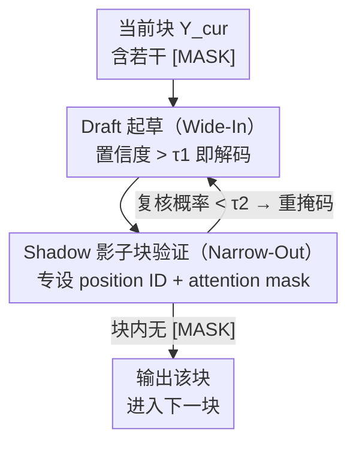

# Wide-In, Narrow-Out: Revokable Decoding for Efficient and Effective DLLMs

**会议**: ICLR 2026  
**论文**: [OpenReview / ICLR 2026 会议版](https://github.com/Feng-Hong/WINO-DLLM)  
**代码**: https://github.com/Feng-Hong/WINO-DLLM (有)  
**领域**: 扩散语言模型 / LLM效率  
**关键词**: 扩散大语言模型, 并行解码, 可撤销解码, draft-and-verify, 推理加速

## 一句话总结
针对扩散大语言模型（DLLM）"并行解码必掉点"的质量-速度困境，本文提出训练无关的 WINO 解码算法：用一个低阈值"激进起草（Wide-In）"+ 一个高阈值"严格验证、把可疑 token 重新打回 mask（Narrow-Out）"的并行 draft-and-verify 机制，让早期错误可被后续更丰富的上下文撤销重写，在 LLaDA / MMaDA 上做到 6×～10× 加速的同时精度还涨。

## 研究背景与动机
**领域现状**：自回归（AR）LLM 逐 token 生成，天然串行、延迟高、错误会沿生成方向传播。扩散大语言模型（DLLM，如 LLaDA、MMaDA）是非自回归的替代路线：从一串全 `[MASK]` 出发，靠双向注意力一次性预测多个位置，理论上能大规模并行加速，闭源系统（Mercury Coder、Gemini Diffusion）已展示出每秒上千 token 的速度。

**现有痛点**：开源 DLLM 却陷在一个严重的"质量-速度 trade-off"里。要拿到高质量输出，模型往往被迫退化成每步只解码 1 个 token（K=L），等于放弃了并行这一最大卖点；一旦改成每步并行解出多个 token（naive parallel sampling），精度就显著崩——例如 GSM8K 每步解 4 个 token，准确率从 73.24% 掉到 64.67%。

**核心矛盾**：作者把根因归结为标准 DLLM 解码的**不可逆性（irreversibility）**。标准流程对每个 `[MASK]` 一旦贪心填入一个 token，这个决定就是终局，即便后续步骤涌入更多上下文也无法修改。可并行解码时，最早被解出的 token 恰恰是在上下文最稀疏、信息最少时拍板的，错误概率最高；而这些早期错误被永久锁死后会不断累积、传播，污染整段输出。于是 DLLM 反而用不上它最大的优势——双向注意力本可以在上下文变丰富后回头修正早期错误。

**本文目标**：在不重新训练、即插即用的前提下，打破"早解早错、错了不能改"的死循环，让 DLLM 既能激进并行又能保证质量。

**切入角度**：既然问题出在"决定不可撤销"，那就给解码加上**撤销（revoke）**能力——允许模型边解码边回看，把当前看来不靠谱的已解 token 重新打回 `[MASK]`，留到上下文更充分的后续步骤再重写。

**核心 idea**：用"激进起草 + 严格验证、可疑即重掩码"的并行 draft-and-verify 取代一锤定音的贪心解码，即 Wide-In（宽进，低阈值多解）+ Narrow-Out（窄出，高阈值严验）。

## 方法详解

### 整体框架
WINO 在标准的半自回归（semi-autoregressive，把序列切块从左到右逐块解码）范式上工作，把序列记作 $Y=[Y_{left}, Y_{cur}, Y_{right}]$：$Y_{left}$ 是 prompt 加已解码块，$Y_{cur}$ 是当前正在解的块，$Y_{right}$ 是尚未解的块（当块长=生成长度时退化为全扩散解码）。核心改动是把"每步解码"从单纯地填 mask，改成在**同一次前向**里并行跑两件事：Draft（起草）把当前块里置信度超过低阈值 $\tau_1$ 的 `[MASK]` 一口气全解出来；Verify（验证）用此刻更丰富的全局上下文重新评估**所有**已解 token，凡是过不了高阈值 $\tau_2$ 的就打回 `[MASK]`。两步合一，迭代刷新 $Y_{cur}$ 直到块内不再有 `[MASK]`，再进入下一块。

验证之所以能"用同一次前向"实现，靠的是一个辅助的**影子块（shadow block）** $Y_{shad}$：把一整块全 `[MASK]` 接到序列尾部得到 $\tilde Y=[Y_{left},Y_{cur},Y_{right},Y_{shad}]$，再精心设计它的 position ID 和 attention mask，让影子位置在"看不到自己对应位已解 token"的条件下给出预测，从而充当对该位的无偏复核。

### 关键设计

**1. 可撤销解码：把 DLLM 的"一锤定音"改成"可回收重写"**

这一点直击不可逆性这个根因。标准 DLLM 解码里，一个位置被解出就永久固定（见预备式 (1) 的贪心 unmask），早期在稀疏上下文下的错误注定被锁死、传播。WINO 的原则是放弃这个不可逆假设：允许已解 token 在后续步骤被"召回"为 `[MASK]`，等上下文变丰富后由模型重新决定。这样既保留了并行生成的效率，又把"上下文驱动的纠错"重新接了回来。整个并行 draft-and-verify 框架就是为落实这一原则而设计的——Draft 负责"激进地多解"，Verify 负责"把不靠谱的撤回"，二者缺一不可（消融里只 Draft 不 Verify 会掉点，见下文）。

**2. Draft 起草（Wide-In）：用低阈值激进多解，把加速空间打开**

针对"每步只解 1 个 token 太慢"的痛点，Draft 模块在第 $k$ 步对当前块里所有 `[MASK]` 位并行判断：只要模型对该位最大概率超过一个**相对较低**的阈值 $\tau_1$，就立刻把它解码出来：

$$y^{(k)}_{cur,l}=\arg\max_{v\in V}p_\theta(\hat y_{cur,l}=v\mid Y),\quad \text{if } \max_{v\in V}p_\theta(\hat y_{cur,l}=v\mid Y)>\tau_1 \text{ 且 } y^{(k-1)}_{cur,l}=\texttt{[MASK]}.$$

阈值取低（论文从 $\{0.5,0.6,0.7\}$ 调）是有意为之：宽进意味着每步能放出更多候选 token，加速主要就来自这里；至于其中混进的少量错误 token，交给后面的验证模块去撤销。值得一提的是 Draft 默认用 argmax 贪心，但只要在 logits 上加 Gumbel 噪声（Gumbel-Max）再过阈值就能无缝支持随机采样，不影响验证逻辑。

**3. 影子块验证（Narrow-Out）：用更严的阈值复核已解 token，可疑即重掩码**

这是"撤销"能力的具体载体，针对"早期错误无法纠正"。验证模块要在每一步用当前更丰富的语义重新审视所有已解 token，但难点在于：若直接问模型"这个位该填什么"，它能看到自己已经填的那个 token，会自我印证、形成信息泄漏。WINO 的巧解是引入全 `[MASK]` 的影子块 $Y_{shad}=[\texttt{[MASK]}]\times L_b$ 接到序列末尾，并做两处关键设计：

- **Position ID**：影子块虽然物理上在序列右端，却被赋予和 $Y_{cur}$ **完全相同**的 position ID，使影子位 $l$ 的输出正好对齐 $Y_{cur}$ 的第 $l$ 位，实现逐位验证。
- **Attention Mask**：$Y_{left},Y_{cur},Y_{right}$ 之间可自由互相注意，但都**不能**注意到 $Y_{shad}$（保证加影子块不改变原序列的输出，即 $p_\theta(\hat y_{cur,l}\mid Y)=p_\theta(\hat y_{cur,l}\mid \tilde Y)$）；而每个影子 token 可以注意到除"自己对应位 $Y_{cur}$ 那个 token"之外的所有 token——刻意屏蔽这条直连路径，避免被验证目标"剧透"。

在此设计下，验证就是用影子位对原已解 token 取值的复核概率与高阈值 $\tau_2$ 比较，低于则打回 mask：

$$y^{(k)}_{cur,l}=\texttt{[MASK]},\quad \text{if } p_\theta(\hat y_{shad,l}=y^{(k-1)}_{cur,l}\mid \tilde Y)<\tau_2 \text{ 且 } y^{(k-1)}_{cur,l}\neq\texttt{[MASK]}.$$

消融显示，尽管 $Y_{cur}$ 内部理论上还存在间接注意力路径，但只屏蔽直连路径就足以在实践中防止泄漏（对比"Full Leakage"变体）。

**4. 非对称双阈值 τ1 < τ2：Wide-In 与 Narrow-Out 的张力来源**

前两个模块只有配上 $\tau_1<\tau_2$ 的非对称阈值才成立，这也是"Wide-In, Narrow-Out"命名的本质。把三类情况合进一个统一更新式（Eq. 4）：超过 $\tau_1$ 的 mask 位被起草解出；已解但复核概率低于 $\tau_2$ 的被撤回为 mask；其余保持不变。低 $\tau_1$ 让"进"的门槛宽、加速；高 $\tau_2$ 让"出"（被最终留下）的门槛严、保质。一宽一严形成了"大胆假设、严格检验"的回路，正是它打破了"快就掉质、慢才保质"的二元对立。

### 损失函数 / 训练策略
WINO 是**训练无关（training-free）、即插即用**的纯解码算法，不引入任何新参数、不微调模型，直接套在现成开源 DLLM（LLaDA-8B-Instruct、MMaDA-8B-MixCoT）上。唯一需要设定的是两个阈值：验证阈值 $\tau_2=0.9$ 固定，起草阈值 $\tau_1$ 在 $\{0.5,0.6,0.7\}$ 中按任务调。额外开销主要来自影子块的计算，但论文统计 TPS 时已把这部分 overhead 计入。

## 实验关键数据

### 主实验
语言任务上把 WINO 套到 LLaDA（生成长 256、块长 128、单卡 A100），对比标准解码（每步 1 token）：

| 基准 | 任务类型 | 指标 | LLaDA | WINO | 步数降幅 | TPS 加速 |
|------|----------|------|-------|------|----------|----------|
| GSM8K | 数学推理 | Acc | 73.24 | 75.82 (+2.58) | 6.10× | 5.66× |
| ARC-E | 常识推理 | Acc | 59.13 | 81.19 (+22.06) | 6.37× | 5.89× |
| ARC-C | 常识推理 | Acc | 51.87 | 73.89 (+22.02) | 5.40× | 5.00× |
| Countdown | 逻辑推理 | Acc | 24.21 | 33.20 (+8.99) | 2.41× | 2.26× |
| HumanEval | 代码生成 | Acc | 37.80 | 42.07 (+4.27) | 2.74× | 2.56× |
| MBPP | 代码生成 | Acc | 36.40 | 36.40 (+0.00) | 2.65× | 2.45× |

多模态任务上套到 MMaDA（Flickr30k 用 CIDEr，其余用 Acc）：

| 基准 | 任务类型 | 指标 | MMaDA | WINO | 步数降幅 | TPS 加速 |
|------|----------|------|-------|------|----------|----------|
| Flickr30k | 看图说话 | CIDEr | 53.67 | 53.83 (+0.16) | 10.05× | 8.60× |
| AI2D | 图表理解 | Acc | 54.86 | 57.19 (+2.33) | 8.30× | 7.30× |
| MMMU-val | 多学科推理 | Acc | 18.56 | 24.00 (+5.44) | 6.65× | 6.00× |
| ScienceQA | 多学科推理 | Acc | 30.89 | 42.24 (+11.35) | 9.10× | 8.15× |
| MathVista-mini | 数学推理 | Acc | 31.10 | 31.40 (+0.30) | 7.65× | 6.76× |

多模态侧加速比普遍比语言侧更猛（最高 10.05× 步数缩减），且精度在多数任务上还涨。

### 消融实验
验证模块与 attention mask 的必要性（GSM8K / MMMU-val）：

| 配置 | GSM8K Acc | GSM8K 步数降幅 | MMMU Acc | 说明 |
|------|-----------|----------------|----------|------|
| WINO（完整） | 75.82 | 6.10× | 24.00 | 起草+验证+正确 mask |
| Only Draft (τ1=0.6) | 70.28 | 7.36× | 19.89 | 只起草不验证，掉点明显 |
| Only Draft (τ1=0.9) | 72.33 | 3.15× | 18.56 | 拉高单阈值只能换速度，仍不如 WINO |
| WINO (w/ Full Leakage) | 72.25 | 5.71× | 18.22 | 不屏蔽影子直连路径，验证失效 |

### 关键发现
- **撤销机制是破局关键**：只 Draft 不 Verify（去掉撤销）速度更快但精度下滑（GSM8K 70.28 vs 75.82）；只靠单阈值拉满（Only Draft τ1=0.9）也追不上 WINO。和不带撤销的动态采样器（Fast-dLLM-parallel 在 GSM8K 仅 72.33%、EB 采样器约 3× 加速但掉点）相比，WINO 5.66× 加速还能把精度推到 75.82%，印证"可撤销"才是打破 trade-off 的核心。
- **attention mask 的防泄漏设计不可少**：Full Leakage 变体（不屏蔽影子位对原 token 的直连注意）精度退回 72.25，说明严格的逐位"盲检"是验证有效的前提。
- **加速幅度与任务难度负相关**：越简单/模型越擅长的任务，每步能确信解出的有效 token 越多，加速越大（Flickr30k 10.05× vs MATH-Vision 5.73×）；MATH-500 按难度分档也观察到难度越低步数越省，体现自适应特性。
- **全扩散设置下增益更夸张**：当块长=生成长（full diffusion）、LLaDA 在 GSM8K 大幅掉到 34.34% 时，WINO 反而能维持 58.22%（+23.88）且步数大降，说明 WINO 在最激进的并行场景里释放的潜力最大。

## 亮点与洞察
- **训练无关 + 即插即用**：不动模型权重、不加参数，直接换一个解码器就能给现成 DLLM 同时提速增质，落地成本极低，这是它最实用的地方。
- **影子块 + position ID 复用 + 定向 attention mask 三件套**：把"无偏复核已解 token"这件难事压进**同一次前向**，既避免了额外前向开销，又用"屏蔽自我注意"巧妙堵住信息泄漏，是很可复用的工程 trick——本质是构造一个"看得到全局、唯独看不到自己答案"的旁路评审。
- **非对称双阈值的哲学**：低门槛进、高门槛留，把"激进探索"和"保守确认"解耦到两个阈值上，这个"宽进严出"的思路可迁移到任何 draft-and-verify 类加速（如推测解码的接受准则设计）。
- **加速与难度负相关**意味着 WINO 天然是自适应算力分配：简单样本自动跑得更快，难样本自动多花步数，无需人工设难度档。

## 局限与展望
- 论文聚焦采样压缩方向，明确把 KV cache 加速（DLLM 双向全注意力下的缓存）划在范围之外；影子块带来的额外计算虽计入 TPS，但在长序列/大块长下其相对开销如何随规模变化未充分展开。
- 后续工作 COVER（Xiang et al., 2026）指出 WINO 验证阶段存在"反复 flip-flop 震荡"导致冗余计算，并用 in-place KV cache override 去优化——说明 WINO 的撤销在某些位上可能来回打回又解出，存在效率浪费空间。
- 阈值 $\tau_1$ 需按任务在 $\{0.5,0.6,0.7\}$ 间手调，缺少自适应阈值机制；$\tau_2$ 虽固定为 0.9 但其敏感性（图 4 的阈值扫描）在不同模型/任务上的普适性仍需更多验证。⚠️ 阈值扫描细节以原文图 4 为准。
- 实验集中在 LLaDA / MMaDA 两族 8B 模型，是否在更大规模或其他 DLLM 架构上同样有效有待检验。

## 相关工作与启发
- **vs naive parallel sampling**：朴素并行每步多解 $M$ 个 token 但不可撤销，GSM8K 上 $M=4$ 直接掉到 64.67%；WINO 同样激进多解，但靠验证撤回错误，所以能"既快又不掉点"。
- **vs Fast-dLLM-parallel / EB（Entropy-Bounded）采样器**：这两者也做动态多 token 解码（按置信度或熵控制并行度），但**只起草、不撤销**，因此仍受 trade-off 制约（GSM8K 约 72.33%、约 3× 加速）；WINO 的差异化在于把"撤销"显式做成验证模块，这是它精度反超的根本原因。
- **vs KV-cache 类加速（Block Diffusion / Fast-dLLM-cache / dLLM-cache）**：那条线优化的是双向注意力下的缓存复用，与 WINO 优化采样过程本身正交，理论上可叠加。
- **vs COVER（后续工作）**：COVER 在 WINO 的可撤销框架之上，用 in-place KV cache override 缓解验证时的冗余震荡，可视为对 WINO 效率短板的针对性改进。

## 评分
- 新颖性: ⭐⭐⭐⭐⭐ 把"不可逆"识别为 DLLM trade-off 根因，并用 draft-and-verify + 影子块做出训练无关的可撤销解码，角度新且干净。
- 实验充分度: ⭐⭐⭐⭐ 覆盖 8 语言 + 6 多模态任务、含全扩散/不同生成长/阈值扫描/泄漏消融，较全面；但仅限两族 8B 模型。
- 写作质量: ⭐⭐⭐⭐⭐ "Wide-In, Narrow-Out"命名点题，机制图（含 attention mask 图示）讲得清楚。
- 价值: ⭐⭐⭐⭐⭐ 即插即用、显著改善质量-速度 trade-off，对 DLLM 落地有直接实用价值。

<!-- RELATED:START -->

## 相关论文

- [\[ICLR 2026\] dParallel: Learnable Parallel Decoding for dLLMs](dparallel_learnable_parallel_decoding_for_dllms.md)
- [\[ICLR 2026\] Libra: Effective yet Efficient Load Balancing for Large-scale MoE Inference](libra_effective_yet_efficient_load_balancing_for_large-scale_moe_inference.md)
- [\[ICLR 2026\] Learning to Parallel: Accelerating Diffusion Large Language Models via Learnable Parallel Decoding](learning_to_parallel_accelerating_diffusion_large_language_models_via_learnable_.md)
- [\[ICLR 2026\] EntropyLong: Effective Long-Context Training via Predictive Uncertainty](entropylong_effective_long-context_training_via_predictive_uncertainty.md)
- [\[ICML 2026\] FOCUS: DLLMs Know How to Tame Their Compute Bound](../../ICML2026/llm_efficiency/focus_dllms_know_how_to_tame_their_compute_bound.md)

<!-- RELATED:END -->
