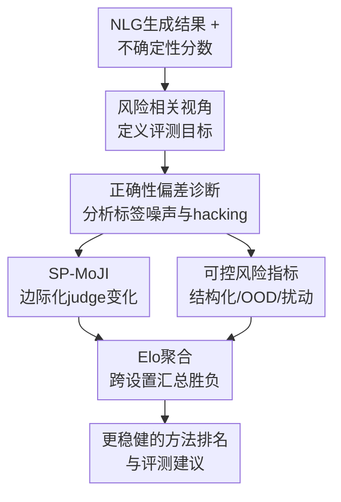

# Addressing Pitfalls in the Evaluation of Uncertainty Estimation Methods for Natural Language Generation

**会议**: ICLR 2026  
**OpenReview**: [https://openreview.net/forum?id=OxWnOV5q8w](https://openreview.net/forum?id=OxWnOV5q8w)  
**代码**: 随 OpenReview 补充材料提供  
**领域**: LLM评估 / 不确定性估计 / 自然语言生成  
**关键词**: [不确定性估计, NLG评估, LLM-as-a-judge, 风险相关, Elo聚合]

## 一句话总结
本文指出自然语言生成不确定性估计的主流 QA 选择性预测评测会被近似正确性函数严重左右，并提出用 SP-MoJI、结构化任务、OOD/扰动检测和 Elo 聚合来让评测结论更稳健。

## 研究背景与动机
**领域现状**：大语言模型的幻觉问题已经成为实际部署中的核心风险，其中一类 confabulation 被认为和模型的预测不确定性紧密相关。为了检测这类风险，很多工作会给模型生成的回答分配一个不确定性分数，例如预测熵、语义熵、perplexity、G-NLL、P(True) 或基于语义相似度的 SAR 系列指标，再看这些分数能否把错误回答排在正确回答前面。

**现有痛点**：问题在于，不确定性方法本身通常不是直接和真实风险比较，而是和某个“近似正确性函数”给出的标签比较。QA 数据集里的参考答案常常很短，自动指标如 ROUGE、BLEU 会受到 n-gram 长度、阈值和实现细节影响；LLM-as-a-judge 又会受到模型家族、prompt、采样和 judge 偏差影响。于是同一批生成结果，只要换一个正确性函数，不确定性方法的 AUROC 和排名都可能明显变化。

**核心矛盾**：不确定性评估真正想问的是“这个预测有多大风险”，但当前协议常把“某个带偏差的正确性函数是否判错”当成风险本身。若正确性标签有随机噪声，AUROC 会被整体压缩；若标签有样本相关偏差，不同不确定性方法会被不均匀地影响。这样一来，论文可能不是在比较谁更会估计不确定性，而是在比较谁更适配某个评测函数的偏差。

**本文目标**：作者希望拆开这个问题：先形式化不确定性评估中的风险相关视角，再诊断 QA 选择性预测协议中的标签噪声、偏差和 correctness hacking，随后给出更可靠的风险指标，最后用一种能跨数据集、模型和任务汇总的方式总结大量实验结果。

**切入角度**：本文没有提出新的不确定性估计算法，而是把注意力放到“如何评价这些算法”。这个角度很重要，因为如果评测协议本身不稳，后续方法改进会被错误信号牵引，尤其是在不同 correctness metric 能把同一方法推成 Top-3 的情况下。

**核心 idea**：用风险相关实验重新组织 NLG 不确定性评测，把脆弱的单一 QA 正确性标签替换为可边际化、可精确验证或可控构造的风险指标，并用 Elo rating 汇总跨设置的相对表现。

## 方法详解
本文的方法更像一套评测诊断与改造框架，而不是一个训练模型。它先把不确定性估计的效用写成不确定性分数和风险指标之间的秩相关，然后证明并实证展示近似正确性函数会扭曲这个相关性；在此基础上，作者设计了几类更稳健的风险指标，并用 Elo 把多任务、多模型、多采样设置下的相对胜负压缩成可解释的总体排名。

### 整体框架
整体流程可以理解为一条“评测协议审计 pipeline”。输入是一组 NLG 不确定性估计方法、若干 LLM 在 QA/结构化/OOD/扰动任务上的生成结果，以及候选的 correctness 或风险标签；框架先从风险相关角度定义要评价的量，再检查当前 QA 选择性预测协议的脆弱点，最后用更稳健的风险指标和 Elo 聚合给出更可信的横向比较。

这张图里，风险相关视角是全篇的坐标系；正确性偏差诊断解释为什么原协议会失真；SP-MoJI 和可控风险指标是两条互补修复路径；Elo 聚合负责把分散实验转成一个更少受展示方式影响的总结。

### 关键设计
**1. 风险相关视角：把“不确定性好不好”改写成“能否排序真实风险”**

作者把 NLG 不确定性估计形式化为一个函数 $\hat{u}(x,w;\theta_u)$，它给输入 $x$ 和模型参数 $w$ 下的生成风险分配分数。评估时不要求不确定性和风险线性相关，而是只要求高风险样本在排序上更靠前，因此使用 AUROC 这类秩相关指标。统一写法是 $\xi=Cor[(\hat{u}(x_i,w;\theta_u))_{i=1}^N,(r(x_i,y'_i))_{i=1}^N]$，其中 $r$ 是风险指标。

这个视角的好处是把不同实验协议统一到同一个问题下：选择性预测检查错误回答是否更不确定，OOD 检测检查分布外输入是否更不确定，扰动检测检查被扰动得更强的输入是否更不确定。这样一来，QA correctness 不再是唯一入口，而只是众多风险指标中的一种；评测也从“在某个 QA 数据集上 AUROC 高”变成“在多种可解释风险上排序是否稳定”。

**2. 正确性偏差诊断：证明 correctness function 本身会改变方法排名**

当前 QA 选择性预测通常把生成答案是否正确作为二值风险标签，即用 $\neg c(y'_i,y_i,x_i;\theta_c)$ 表示风险，再计算不确定性分数与它的 AUROC。本文指出 $c$ 不是一个无害的辅助函数：ROUGE/BLEU 有阈值和 n-gram 参数，BERTScore/BLEURT 依赖嵌入相似度，LLM-as-a-judge 依赖模型、prompt 和采样。不同 $\theta_c$ 会制造不同的“错误集合”，于是改变不确定性方法的表观表现。

作者进一步用两个小推导说明这种扭曲为什么不是小噪声。若标签受到样本无关的 Bernoulli 噪声扰动，AUROC 近似变成 $AUROC_{noisy}=AUROC_{orig}\cdot(1-2p)+p$，表现会向 0.5 收缩；若标签存在样本相关偏差，AUROC 的变化取决于被扭曲样本比例以及方法在这些样本上的排序质量，因此不同方法会被不同程度地奖励或惩罚。实验中，ROUGE、BLEU、judge 之间的 agreement 明显不足，且 Spearman 方法排名相关性在 judge 与 n-gram 指标之间出现断裂；更直接的是，作者展示了“adversarially selecting correctness function”可以显著抬高某些方法进入 Top-3 的频率。

**3. SP-MoJI：在必须使用近似正确性时边际化 judge 的随机性与偏差**

对于 QA 这类难以精确验证的任务，作者没有简单地说“换成 LLM-as-a-judge 就好”，因为 judge 本身也有偏差。本文提出 Selective Prediction using Mixture of Judges and Instructions，简称 SP-MoJI：对同一批生成结果，用多个 judge 模型、多个 prompt 或采样设置分别得到 correctness 标签，分别计算一次选择性预测相关性，再对这些 $\xi$ 取平均。形式上，$\xi_{SP-MoJI}=\mathbb{E}_{\theta_c}[\xi_{SP-J}]\approx \frac{1}{K}\sum_{k=1}^{K}Cor[(\hat{u}_i),(\neg J_k(y'_i,y_i,x_i;\theta_k))]$。

这里的关键细节是“外层平均相关性”，而不是先把多个 judge 标签平均成一个软 correctness 再算一次 AUROC。作者强调这两者代数上不等价：SP-MoJI是在评测结果层面对 correctness 参数做边际化，更直接地减少 judge 模型、prompt 和采样造成的评估方差。bootstrap 结果显示，单个 judge 的性能估计标准差可到 0.04，换算成 95% 区间已经和很多方法之间的差距同量级；使用 4 个左右多样 judge 就能显著降低方差，而超过约 10 次调用后收益递减。

**4. 可控风险指标与 Elo 聚合：让评测脱离单一 QA 表格的展示偏差**

SP-MoJI修的是“QA 必须近似判对错”的场景，但作者还引入了更可控的风险指标。结构化任务提供 exact correctness，例如代码补全可以用单元测试验证，受限文本生成可以用符号化约束检查；OOD 检测把“来自不同数据生成机制或不可回答问题”的标签当作风险；扰动检测则把输入扰动强度 $s_p$ 当作连续风险，目标是让 $\hat{u}(p(x_i,s_p),w;\theta_u)$ 随扰动增强而上升。这些任务共同减少了对单一 QA 参考答案相似度的依赖。

实验设置一多，另一个问题会出现：不同数据集、模型和任务的表格可能给出互相矛盾的局部结论。本文借鉴棋类评分和 Chatbot Arena，用 Elo rating 聚合不确定性估计方法之间的成对胜负。每个“数据集-模型-风险指标”组合被视作一场比赛，两种 UE 方法谁的相关性更高谁获胜，然后迭代更新评分。相比平均 rank，Elo 分数有概率解释：约 400 分差距可粗略理解为一方在随机设置中胜率约为 10:1；它还能处理部分方法只在部分任务上可比的间接比较。

### 一个完整示例
假设我们要比较 Semantic Entropy、G-NLL、Perplexity 和答案长度这几种方法。旧协议可能只在 TriviaQA 或 CoQA 上生成回答，然后用 ROUGE-L@0.5 判 correctness，最后报告各方法 AUROC。本文指出这一步会非常脆弱：如果参考答案是一个短别名，ROUGE-2 或 BLEU 的实现可能因为答案长度不足直接给 0；如果换成 Llama-70B judge，错误集合又会变化；如果研究者挑选对某方法最有利的 correctness function，就能让它的 Top-3 频率看起来更高。

在本文框架下，同一批生成结果会先用多种 judge/prompt 形成 SP-MoJI 的 QA 评价；同时在 BigCodeBench 上用单元测试得到 exact correctness，在 COLLIE 上用约束检查得到 exact correctness，在 SQuADv2 或 Known-Unknowns 上检查 OOD 标签，在 CoQA/SQuADv2 上打乱上下文词序做扰动检测。每个设置都产生一组“方法 A 是否胜过方法 B”的结果，最后进入 Elo 聚合。这样得到的结论不再依赖某一张 QA 表的高亮方式，也更容易看出某些方法只在特定任务上有效。

### 损失函数 / 训练策略
本文不训练新模型，也没有传统意义上的损失函数。需要记住的“目标函数”是评测目标本身：对每个实验设置计算不确定性分数与风险指标之间的秩相关 $\xi$，再用 SP-MoJI 对 correctness 参数做外层边际化，或用 exact/OOD/perturbation 指标替代近似 correctness。

Elo 聚合的更新也可视为本文的后处理策略。所有方法初始评分为 1000，每次抽取一个实验设置和两种方法，相关性更高者记为胜方，再按标准 Elo 规则更新分数。作者使用较小的更新步长并迭代到收敛，最终报告不同任务分区、模型分区和总任务下的 Elo 分数。

## 实验关键数据

### 主实验
本文的实验覆盖两类问题：一类是证明旧 QA 协议确实不稳，另一类是验证新风险指标和聚合方式能提供更清晰的结论。作者评估了多种不确定性方法，包括 Predictive Entropy、Semantic Entropy、SentenceSAR、TokenSAR、SAR、EigenScore、Perplexity、G-NLL、Min Token Log-Probability、P(True) 以及序列长度等启发式基线；模型包括 Llama-3、Phi-3.5、Qwen2.5、Falcon Mamba 等预训练和指令微调版本。

| 实验对象 | 数据/设置 | 指标 | 关键结果 | 含义 |
|--------|----------|------|----------|------|
| correctness 函数一致性 | CoQA / TriviaQA / SQuAD，Llama-3 8B IT | mutual AUROC / Spearman | ROUGE/BLEU 与 judge 之间明显不一致，方法排名相关性也会断裂 | 同一 UE 方法的排名会被 correctness 函数左右 |
| correctness hacking | QA benchmark 上选择有利 correctness 函数 | Top-3 频率 | Min Token Log-Probability 从 0.125 提到 0.500，Perplexity 从 0.125 提到 0.444，G-NLL 从 0.375 提到 0.688 | 只要挑指标，就能放大某些方法的表观优势 |
| SP-MoJI 方差分析 | 多 judge bootstrap | AUROC 标准差 | 单 judge 标准差最高约 0.04，约 4 个 judge 能明显降低估计方差 | 多 judge/prompt 边际化不是装饰，而是必要的稳定化步骤 |
| 结构化任务 | BigCodeBench / COLLIE | exact correctness agreement | 近似 correctness 在 COLLIE 上难以匹配 exact ranking，prompt 影响很大 | 可精确验证任务能暴露 judge/相似度指标的局限 |

| 聚合视角 | 主要观察 | 对 UE 方法的启发 | 对评测协议的启发 |
|---------|----------|----------------|----------------|
| ALL TASKS Elo | 不同任务偏好的方法不同，没有单一方法统治所有设置 | 不应只凭一个 QA 数据集宣称通用最优 | 需要跨任务汇总，而不是挑局部表格 |
| QA 分区 | Semantic Entropy LN 等方法在部分 QA 设置里更强 | QA 表现仍有意义，但依赖 correctness 选择 | QA 应使用 SP-MoJI 或多 correctness 报告 |
| CODE / constrained text | G-NLL、EigenScore 等在更长生成或结构化任务中更有竞争力 | 长序列任务和短答案 QA 的不确定性规律不同 | exact correctness 值得作为核心评测补充 |
| PERT 分区 | 长度归一化在扰动检测中反而可能有帮助，答案长度基线很强 | 某些“坏习惯”在特定风险下可能有用 | 风险类型必须明确，不能混在一个平均数里解释 |
| PT vs IT 模型 | 预训练模型上所有方法都较弱，random baseline Elo 也高 | base model 输出结构差会改变 UE 难度 | base 与 instruct 模型应分开分析 |

### 消融实验
| 配置 | 关键指标 | 说明 |
|------|---------|------|
| 单一 ROUGE/BLEU correctness | 方法排名与 judge 路线差异明显 | n-gram 指标会被短答案、阈值和实现 artifact 影响 |
| 单一 LLM-as-a-judge | AUROC 估计标准差可接近 0.04 | 单 judge 的随机性和偏差足以覆盖很多方法差距 |
| SP-MoJI，4 个 judge 左右 | 性能估计方差显著下降 | 多样 judge 的边际化能更稳地评价 QA 选择性预测 |
| 只用 QA 选择性预测 | 结论容易被 correctness choice 与 answer length bias 影响 | 需要结构化任务、OOD 和扰动检测补充 |
| 平均 rank 聚合 | 低重叠实验套件下排序保持较差 | 当方法覆盖任务不完全时，平均 rank 不如 Elo 稳定 |
| Elo 聚合 | 在完整与低重叠套件中相关性更稳 | 可处理间接比较，并给出可解释的相对强弱 |

### 关键发现
- QA 上的 correctness function 不是中立裁判。ROUGE、BLEU、LLM-as-a-judge 会给出不同的正确性标签，进而让不确定性估计方法的 AUROC 和排名变化。
- LLM-as-a-judge 比很多 n-gram 指标更可靠，但单个 judge 仍不够稳；SP-MoJI 通过对 judge 模型、prompt 和采样设置边际化来降低评测方差。
- 结构化任务提供了很重要的参照系，因为它们可以用 exact correctness 验证生成是否满足要求；在这类任务上，近似 correctness 与真实排序的偏差会更容易暴露。
- OOD 与扰动检测把不确定性评估从“答案是否等于参考答案”扩展到“输入是否更危险/更异常”，更接近分类不确定性评估中的传统协议。
- Elo 聚合显示 NLG 不确定性估计没有一招通吃的方法：任务类型、生成长度、模型是否指令微调都会改变方法优劣。

## 亮点与洞察
- 本文最重要的亮点是把“评测正确性函数”本身纳入不确定性评估问题，而不是默认它是可靠标签来源。这让很多以往看似方法差异的现象变成了评测偏差问题。
- SP-MoJI 的设计很克制：它不试图发明一个完美 judge，而是承认 judge 有随机性和模型偏差，然后在评测结果层面对这些参数做边际化。这比单纯换一个更大的 judge 更稳，也更容易解释。
- 结构化任务的引入很有启发。NLG 不确定性方法如果只在短答案 QA 上比较，很容易学到 answer length、n-gram artifact 或 reference alias 的偏差；代码和受限生成能把“生成是否正确”从语义相似度问题变成可验证问题。
- Elo 聚合解决了论文写作中的一个常见问题：大表格太多时，作者可以通过高亮和叙述选择引导读者得出不同结论。成对胜负聚合虽然仍有假设，但比手工挑表格更透明。
- 一个有意思的实证洞察是，简单启发式并不总是弱基线。答案长度、G-NLL、Perplexity 在某些任务或模型分区里很有竞争力，这提醒后续工作必须认真报告简单 baseline。

## 局限与展望
- 本文提出的是评测框架而不是新的 UE 方法，因此它不能直接降低模型幻觉，只能让方法比较更可信。真正部署时还需要把这些不确定性分数接入拒答、检索或人工复核策略。
- SP-MoJI 仍依赖 judge 模型，虽然边际化能降低方差，但不能保证消除所有系统偏差。尤其在复杂推理、长链式思考或多代理生成场景中，judge prompt 与答案抽取会更难。
- exact correctness 任务虽然稳健，但覆盖面有限。代码补全和受限文本生成不能完全代表开放式问答、摘要、对话和创意写作中的风险。
- OOD 文本数据集的构造仍然困难。Known-Unknowns、SQuADv2 unanswerable 等集合只是部分近似，未来需要更系统地定义“自然语言中的分布外”。
- Elo 聚合给了一个总体分数，但总体分数也可能掩盖任务分区差异。更好的报告方式应同时给出 ALL TASKS、任务分区、模型分区和生成长度相关分析。
- 未来很值得把这套评测原则迁移到 CoT、多轮对话、多 agent 和工具调用场景，因为这些场景的生成长度、状态依赖和风险函数都比单轮 QA 更复杂。

## 相关工作与启发
- **vs Semantic Entropy / confabulation detection**: Farquhar 等工作关注如何用语义聚类的不确定性检测 hallucination，本文则追问这些方法到底该如何被公平评价。它的价值在于给后续 UE 方法提供更稳的实验地基。
- **vs LM-Polygraph / UE benchmark**: LM-Polygraph 类工作提供了大量 UE 方法和任务的基准实现，本文更聚焦评测协议的失败模式，尤其是 correctness function 对排名的影响。
- **vs Santilli et al. 的 QA 指标偏差分析**: 两者都指出生成式 QA 中 uncertainty score 与 answer evaluation metric 有伪相关问题；本文进一步提出 SP-MoJI、结构化任务、OOD/扰动检测和 Elo 聚合作为修复路径。
- **vs LLM-as-a-judge 研究**: MT-Bench、Chatbot Arena 和后续 judge bias 工作主要研究 judge 能否评价模型回答，本文把 judge 放进不确定性估计评测里，强调即使 judge 和人类高度一致，偏差仍可能足以影响方法排名。
- **对后续研究的启发**: 做 NLG 不确定性估计时，不能只报告一个 QA 数据集上的 ROUGE 或单 judge AUROC；至少应报告多 correctness 稳定性、简单启发式 baseline、结构化 exact correctness，以及跨任务聚合结果。

## 评分
- 新颖性: ⭐⭐⭐⭐☆ 不是提出新 UE 算法，而是系统重构评测协议；在评估论文里新意很强。
- 实验充分度: ⭐⭐⭐⭐⭐ 覆盖多种 UE 方法、模型家族、QA/结构化/OOD/扰动任务，并有理论推导和 bootstrap 分析支撑。
- 写作质量: ⭐⭐⭐⭐☆ 主线清楚，公式和实验证据扎实；附录信息量很大，读者需要一定不确定性评估背景。
- 价值: ⭐⭐⭐⭐⭐ 对整个 NLG 不确定性估计方向很有校准作用，能防止后续方法被脆弱评测指标误导。

<!-- RELATED:START -->

## 相关论文

- [\[ICLR 2026\] Pitfalls in Evaluating Language Model Forecasters](pitfalls_in_evaluating_language_model_forecasters.md)
- [\[ICLR 2026\] Reliable Fine-Grained Evaluation of Natural Language Math Proofs](reliable_fine-grained_evaluation_of_natural_language_math_proofs.md)
- [\[ICLR 2026\] TokUR: Token-Level Uncertainty Estimation for Large Language Model Reasoning](tokur_token-level_uncertainty_estimation_for_large_language_model_reasoning.md)
- [\[ACL 2025\] Benchmarking Uncertainty Quantification Methods for Large Language Models with LM-Polygraph](../../ACL2025/llm_evaluation/benchmarking_uncertainty_quantification_methods_for_large_language_models_with_l.md)
- [\[ICLR 2026\] ExpertLongBench: Benchmarking Language Models on Expert-Level Long-Form Generation Tasks with Structured Checklists](expertlongbench_benchmarking_language_models_on_expert-level_long-form_generatio.md)

<!-- RELATED:END -->
