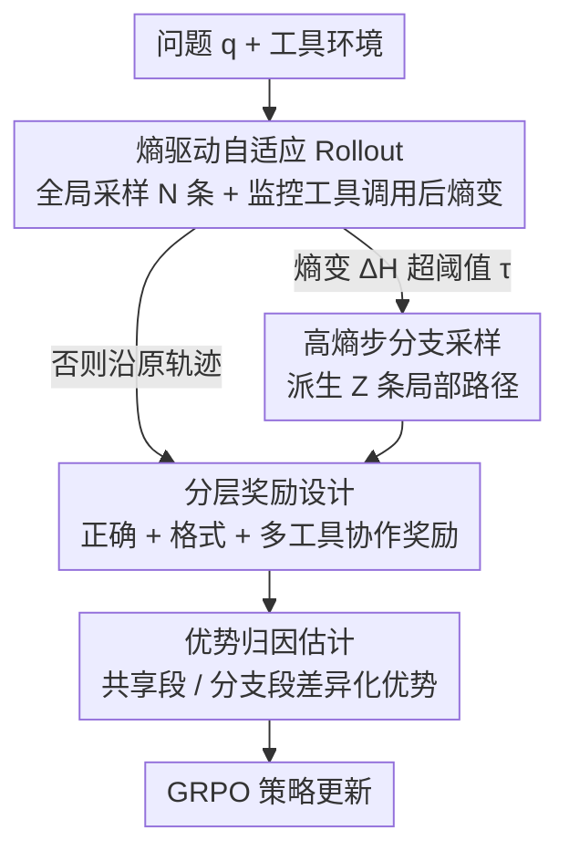

# Agentic Reinforced Policy Optimization

**会议**: ICLR2026  
**OpenReview**: [https://openreview.net/forum?id=TX4k7BF6aO](https://openreview.net/forum?id=TX4k7BF6aO)  
**代码**: https://github.com/RUC-NLPIR/ARPO  
**领域**: 强化学习 / Agentic RL  
**关键词**: Agentic RL、工具调用、token 熵、自适应 rollout、优势归因

## 一句话总结
ARPO 是一种为多轮工具调用智能体量身定制的强化学习算法：它发现 LLM 在每次工具返回结果后 token 熵会骤升，于是在这些高熵步上自适应地"分叉"采样、再用优势归因把分叉路径的好坏差异传回去学习，结果在 13 个推理/深搜基准上全面超过轨迹级 RL，且只用一半的工具调用预算。

## 研究背景与动机
**领域现状**：带可验证奖励的大规模强化学习（RLVR）在单轮推理任务上已经被证明很有效，能显著释放前沿 LLM 的能力。当把它扩展到 Agentic RL——让 LLM 在训练中自主调用搜索引擎、浏览器、代码解释器等外部工具——时，训练范式从"静态解题"变成了"动态的 agent-环境交互"。

**现有痛点**：当前主流的 agentic RL 算法（GRPO、DAPO、REINFORCE++ 等）在 rollout 阶段做的是**轨迹级采样**：一次性采样完整的工具使用轨迹，奖励只根据最终答案给。后续工作大多在奖励函数上做文章（缓解工具滥用、稀疏奖励），但都忽略了一个关键点——**LLM 与工具环境之间的多轮交互回路本身**。多轮工具调用会实时给模型注入信息反馈，可单纯比较完整轨迹的方法对这种逐步的工具使用行为几乎没有细粒度探索。

**核心矛盾**：作者通过一个先导实验把矛盾量化了出来。他们测量 deep search 任务中 token 的生成熵，发现：**每次工具调用返回结果后的头 10–50 个 token 熵会急剧升高**；早期推理阶段熵也会涨但远低于工具反馈后；搜索引擎返回的文本反馈比 Python 数值反馈带来更大的不确定性。换句话说，外部反馈和模型内部推理之间存在分布偏移，工具调用后正是模型"最纠结、最有探索价值"的时刻——而轨迹级 RL 恰恰把采样预算平摊在整条轨迹上，错过了这些高熵步。

**本文目标**：设计一个与"agent-环境交互"特性对齐的 RL 算法，把采样预算花在刀刃上——即工具调用后的高熵步上。

**切入角度**：既然高熵 = 高不确定性 = 潜在工具使用行为未被充分探索，那就**用熵的变化作为信号，动态决定在哪里分叉采样**。

**核心 idea**：用"熵驱动的自适应 rollout"代替"均匀的轨迹级 rollout"——在工具调用后熵升高的步上触发额外的局部分支采样，再配一套优势归因机制让模型把分叉路径之间的优劣差异内化进策略。

## 方法详解

### 整体框架
ARPO 要解决的是"采样预算往哪儿花"的问题。它把传统 rollout 拆成两半：先做少量**全局轨迹采样**铺底，再把剩余预算留给**局部分支采样**；分支与否由工具调用后的实时熵变决定。整条流水线是：给定问题 $q$，策略模型在工具环境里边推理边调工具，系统持续监控每次工具返回后的 token 熵；一旦熵变超过阈值就在当前节点派生若干条局部路径去探索不同的工具使用方式；所有路径产出答案后，奖励模型按"分层奖励"打分，再由"优势归因估计"区分共享 token 段与各自分支段、赋予不同优势值，最后用 GRPO 目标更新策略。

### 关键设计

**1. 熵驱动自适应 Rollout：把采样预算从均摊到整条轨迹改成砸向高熵工具步**

这个设计直接针对"轨迹级采样错过高熵工具步"的痛点。给定全局 rollout 规模 $M$，模型先用问题 $q$ 生成 $N$ 条完整轨迹（全局采样），剩下 $M-N$ 的预算留给局部采样。token 级生成熵定义为 $H_t = -\sum_{j=1}^{V} p_{t,j}\log p_{t,j}$，其中 $p_t = \mathrm{Softmax}(z_t/\tau)$ 是 softmax 后的分布、$V$ 是词表大小。系统先记录每条轨迹前 $k$ 个 token 的初始熵矩阵 $H_{initial}$；之后模型边推理边调工具，每次工具返回后再生成 $k$ 个 token，算出该步熵矩阵 $H_t$，并量化归一化熵变 $\Delta H_t = \mathrm{Normalize}(H_t - H_{initial})$（归一化即把 $\Delta H$ 各值求和再除以词表大小 $V$）。$\Delta H_t > 0$ 表示工具调用后不确定性上升。

分叉与否由一个采样概率决定：$P_t = \alpha + \beta\cdot\Delta H_t$，其中 $\alpha$ 是基础采样概率、$\beta$ 是稳定性系数；若 $P_t > \tau$ 就触发 $\mathrm{Branch}(Z)$ 从当前节点派生 $Z$ 条局部推理路径，否则沿原轨迹继续。迭代直到：分叉总数 $\hat Z$ 达到局部预算 $M-N$ 就停止分叉、各路径跑完产出答案；若所有路径提前结束，则补 $M-N-\hat Z$ 条全局轨迹凑满预算。这样做的妙处在于把探索集中在"熵升高=信息更丰富"的区域，同时把每次 rollout 的计算复杂度从轨迹级 RL 的 $O(n^2)$ 降到 $O(n\log n)$ 到 $O(n^2)$ 之间。

**2. 优势归因估计：让共享前缀和分叉路径拿到该拿的信用**

自适应 rollout 天然产生"前半段共享、后半段分叉"的轨迹结构，于是怎么把优势（advantage）分配到 token 上就成了新问题。作者给了两种方案。**硬优势估计（Hard）**显式区分共享段与各自段：对各自分叉的 token，用组内归一化奖励算优势 $\hat A_{i,t} = \frac{r_i - \mathrm{mean}(\{R_i\})}{\mathrm{std}(\{R_i\})}$；对共享 token，则赋予包含该共享段的 $d$ 条轨迹的平均优势 $\hat A^{shared}_{i,t} = \frac{1}{d}\sum_{i=1}^{d}\hat A_{i,t}$。

**软优势估计（Soft）**更优雅：不显式改优势，而是在 GRPO 策略更新里通过重要性采样比 $r_{i,t}(\theta) = \frac{\pi_\theta(y_{i,t}\mid x,y_{i,<t})}{\pi_{old}(y_{i,t}\mid x,y_{i,<t})}$ 隐式区分。关键观察是：当两条轨迹 $y_i, y_j$ 在 token $t$ 之前共享前缀（$y_{i,<t}=y_{j,<t}$）时，它们的重要性权重相等 $r_{i,t}(\theta)=r_{j,t}(\theta)$，于是共享 token 的优势贡献被自动对齐、近似等于硬估计里的 $\hat A^{shared}$。也就是说，保留原始 GRPO 损失公式不变，靠分叉 rollout 的结构本身就实现了共享/分叉 token 的区别更新。实验里软设置在训练中奖励更稳定，因此 ARPO 默认采用软优势估计。

**3. 分层奖励设计：在正确与格式之外，专门奖励多工具协作**

奖励函数是优化目标。ARPO 沿用 Tool-Star 的设计，同时考虑正确性、格式，并加入一个**多工具协作奖励**：当模型答对、工具调用格式正确、且推理中同时用了多种工具（如 `<search>` 与 `<python>`）时，额外给奖励 $r_M$。整体奖励为

$$
R=\begin{cases}\max(\text{Acc.}+r_M,\ \text{Acc.}) & \text{格式正确且 Acc.}>0\\ 0 & \text{格式正确且 Acc.}=0\\ -1 & \text{否则}\end{cases},\qquad r_M=\begin{cases}0.1 & \exists(\texttt{<search>}\ \&\ \texttt{<python>})\\ 0 & \text{否则}\end{cases}
$$

这条小小的 $0.1$ 奖励配合自适应 rollout，鼓励模型在高熵步真的去尝试不同工具组合，而不是只盯着单一工具或干脆少用工具。

### 损失函数 / 训练策略
ARPO 复用 GRPO 目标

$$
J_{GRPO}(\theta)=\mathbb{E}\Big[\tfrac{1}{G}\sum_{i=1}^{G}\tfrac{1}{|y_i|}\sum_{t=1}^{|y_i|}\min\big(r_{i,t}(\theta)\hat A_{i,t},\ \mathrm{clip}(r_{i,t}(\theta),1-\epsilon,1+\epsilon)\hat A_{i,t}\big)-\beta D_{KL}(\pi_\theta\|\pi_{ref})\Big]
$$

唯一改动是 rollout 结构带来的共享/分叉 token 区分。理论上作者还证明了一个**广义策略梯度（GPG）定理**：把 Transformer 输出 token 序列切成若干段"宏动作" $MA_i$、对应"宏状态" $MS_i$，则 $\nabla_\theta J(\theta)=\mathbb{E}_{\tau\sim\pi_\theta}\{\sum_{T=1}^{K}[\nabla_\theta\log\pi_\theta(MA_T\mid MS_T)A_T(\tau)]\}$ 对任意可微 Transformer 策略成立，传统单 token 策略梯度只是它的特例——这为"用局部 rollout 段（宏动作）做优化"提供了理论依据。

## 实验关键数据

### 主实验
在数学与知识密集推理 10 个基准上（Llama3.1-8B / Qwen2.5-7B 为骨干），ARPO 全面超过轨迹级 RL：

| 骨干 | 方法 | 平均分 |
|------|------|------|
| Llama3.1-8B-Instruct | 直接推理 | 28.8 |
| Llama3.1-8B-Instruct | + GRPO | 51.1 |
| Llama3.1-8B-Instruct | + DAPO | 50.4 |
| Llama3.1-8B-Instruct | **+ ARPO** | **55.3** |
| Qwen2.5-7B-Instruct | + GRPO | 56.5 |
| Qwen2.5-7B-Instruct | + REINFORCE++ | 54.9 |
| Qwen2.5-7B-Instruct | **+ ARPO** | **58.3** |

在更难的 deep search 任务上（Qwen3 骨干，仅 1k RL 样本），ARPO 用 Qwen3-14B 在 HLE 拿到 10.0、GAIA 拿到 43.2 的 pass@1，而 GPT-4o、DeepSeek-R1-671B 在 HLE 上只有 2.6 / 8.6：

| 数据集/指标 | GPT-4o | DeepSeek-R1-671B | ARPO (Qwen3-14B) |
|--------|------|------|------|
| HLE Avg. | 2.6 | 8.6 | 10.0 |
| GAIA Avg. | 17.5 | 25.2 | 43.2 |

### 消融实验

| 配置 | 关键现象 | 说明 |
|------|---------|------|
| Full ARPO（软优势） | 训练奖励最稳 | 默认设置 |
| 硬优势估计 | 奖励波动更大 | 显式区分共享/分叉段不如隐式 |
| 退化为轨迹级 rollout（≈GRPO） | 10 任务平均掉约 4% | 去掉熵驱动分支即失去 step-level 探索 |

### 关键发现
- **效率是最大卖点**：ARPO 在多个基准上达到或超过轨迹级 RL，却只用了一半的工具调用预算——把采样砸在高熵步上比平摊更省。
- **step-level 探索贡献最大**：deep search 上 ARPO 比 GRPO 在 GAIA / WebWalkerQA 高约 6%，说明全局+局部平衡采样带来的细粒度工具行为探索是关键。
- **软优势 > 硬优势**：软设置训练全程奖励更稳，因此被设为默认；硬设置虽直观但更新更抖。
- **prompt 工程不顶用**：纯工具集成 prompting（TIR）在 Qwen / Llama 上收益微弱甚至低于直接推理，说明必须靠 RL 训练而非提示词。
- **样本效率惊人**：deep search 仅用 1k 开源网搜样本训练就能泛化到 GAIA/HLE。

## 亮点与洞察
- **把"token 熵骤升"做成训练信号**：先导实验量化出"工具反馈后头 10–50 个 token 熵急升"这一现象，再据此设计自适应分叉——观察驱动设计、动机非常具体，不是空泛的"探索更充分"。
- **共享前缀的优势对齐是个巧思**：软优势估计不改 GRPO 损失，仅靠"共享前缀重要性权重相等"这一性质就自动让共享 token 拿到平均优势，几乎零额外实现成本，可直接迁移到任何带 beam/分叉结构的 RL 训练。
- **GPG 定理给"宏动作优化"兜底**：把分叉段当宏动作、证明传统策略梯度是其特例，为"在轨迹中段而非逐 token 做信用分配"提供了理论合法性。
- **效率-精度权衡的工程价值**：一半工具预算达到同等或更好效果，对真实付费 API 工具环境是实打实的省钱。

## 局限与展望
- 熵阈值 $\tau$、基础概率 $\alpha$、稳定性系数 $\beta$、分支数 $Z$ 等超参较多，论文未充分披露其敏感性，迁移到新工具/新任务可能需要重新调。
- 熵作为"值得探索"的代理信号是启发式的——高熵也可能只是噪声（如搜索返回的无关长文本），把预算分到纯噪声步上是潜在浪费。
- 评测用 Qwen2.5-72B 做 LLM-as-Judge，deep search 这类开放任务的打分会受裁判模型偏好影响。
- 实验集中在搜索/浏览器/代码三类工具，更长程、工具种类更杂（如多模态工具、有状态环境）的场景下熵信号是否依旧有效未验证。
- 改进方向：把熵信号与价值估计/不确定性校准结合，区分"有价值的高熵"与"噪声高熵"；或让阈值随训练动态自适应。

## 相关工作与启发
- **vs GRPO / DAPO / REINFORCE++（轨迹级 RL）**：它们在 rollout 阶段均匀采样完整轨迹、只按最终奖励学习；ARPO 在工具调用后的高熵步插入局部分支采样并区分共享/分叉 token 的优势，本质是把探索预算从"轨迹粒度"细化到"step 粒度"，因此在多轮工具任务上更强、更省预算。
- **vs Tool-Star（奖励侧改进）**：ARPO 复用其分层/多工具协作奖励，但 Tool-Star 等工作聚焦奖励函数设计，ARPO 的创新在 rollout 与优势归因机制——两者正交可叠加。
- **vs Search-o1 / WebThinker / ReAct（workflow 式搜索 agent）**：这些是流程编排/提示驱动、不更新模型权重；ARPO 通过 RL 直接训练策略，在 GAIA/HLE 上大幅领先，印证"训练 > 编排"。
- **启发**：熵变作为"在哪里加大探索"的廉价信号，可推广到任何多轮交互式 RL（如工具学习、对话、代码 agent）；共享前缀优势对齐的思路也适用于树搜索式生成的信用分配。

## 评分
- 新颖性: ⭐⭐⭐⭐⭐ 把 token 熵骤升观察转化为 step-level 自适应 rollout，角度新且有理论兜底
- 实验充分度: ⭐⭐⭐⭐⭐ 13 基准、数学/知识/深搜三域、多骨干、半预算对比齐全
- 写作质量: ⭐⭐⭐⭐ 动机推导清晰，但超参与图表细节略密、部分符号需对照原文
- 价值: ⭐⭐⭐⭐⭐ 一半工具预算达到更优效果，对真实工具 agent 训练有直接工程价值

<!-- RELATED:START -->

## 相关论文

- [\[ICLR 2026\] ResiliBench: Evaluating Agentic Workflow Adaptation in Stochastic Environments](resilibench_evaluating_agentic_workflow_adaptation_in_stochastic_environments.md)
- [\[ICML 2026\] On Effectiveness and Efficiency of Agentic Tool-calling and RL Training](../../ICML2026/llm_evaluation/on_effectiveness_and_efficiency_of_agentic_tool-calling_and_rl_training.md)
- [\[ACL 2026\] Inverting the Shield: Systematically Generating Safety Tests from Policy Specifications](../../ACL2026/llm_evaluation/inverting_the_shield_systematically_generating_safety_tests_from_policy_specific.md)
- [\[ACL 2026\] PolicyLLM: Towards Excellent Comprehension of Public Policy for Large Language Models](../../ACL2026/llm_evaluation/policyllm_towards_excellent_comprehension_of_public_policy_for_large_language_mo.md)
- [\[ICLR 2026\] Prompt and Parameter Co-Optimization for Large Language Models](prompt_and_parameter_co-optimization_for_large_language_models.md)

<!-- RELATED:END -->
