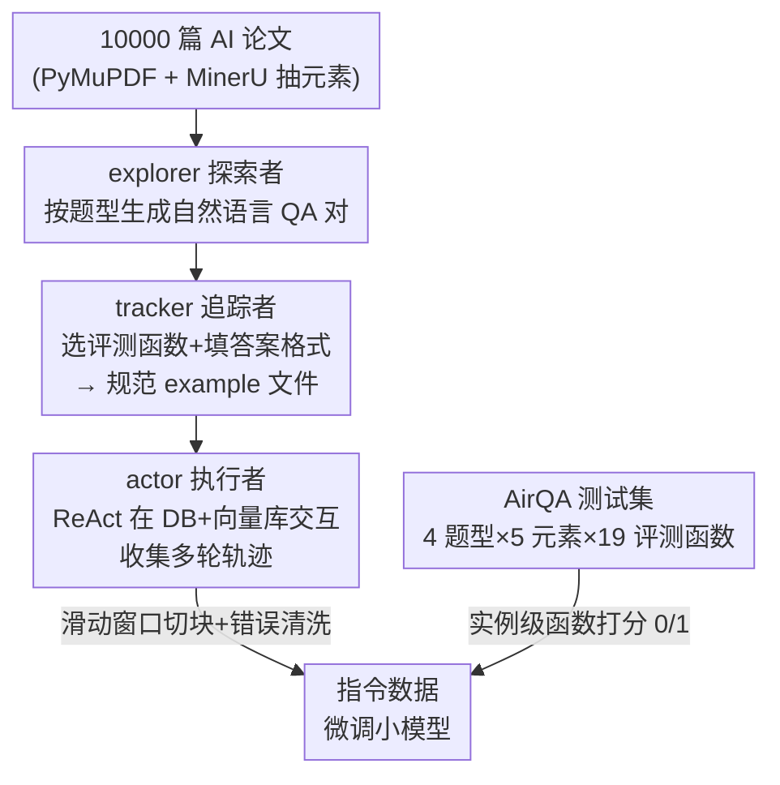

# AirQA: A Comprehensive QA Dataset for AI Research with Instance-Level Evaluation

**会议**: ICLR2026  
**OpenReview**: [https://openreview.net/forum?id=RuUXnRyqcy](https://openreview.net/forum?id=RuUXnRyqcy)  
**代码**: https://github.com/OpenDFM/AirQA  
**领域**: LLM 评测 / 科研问答 Benchmark / Agent / 指令数据合成  
**关键词**: 科研问答, 实例级评测, 多模态, 多任务, 工具调用 Agent, 轨迹合成

## 一句话总结
AirQA 是一个人工标注的 AI 科研问答数据集（13,956 篇论文、1,246 道题），覆盖单文/多文/检索/综合四类问题与文本/表格/图像/公式/元数据五类元素，并首次用 19 个「逐题定制」的 Python 函数做实例级客观评测；同时提出三智能体框架 EXTRACTOR 自动合成问答对与交互轨迹，让 7B 小模型微调后达到 14B 模型的工具调用水平。

## 研究背景与动机
**领域现状**：AI 论文爆炸式增长，研究者常常要读完整篇长文才能定位一条很具体的信息，效率极低。LLM 强大的推理与规划能力让「论文精确检索 + 问答」的自动化成为可能，催生了一批基于 RAG 或工具调用 Agent 的科研问答系统。

**现有痛点**：作者指出此前的科研 QA 数据集有三个结构性缺陷。其一，**任务面窄**——大多只盯着一种问题类型，比如只问单篇论文的技术细节（QASPER、SciDQA）、只做规则构造的两跳跨文问题（M3SciQA）、或只做论文检索（LitSearch、AutoScholarQuery），评测函数也只为这一种类型量身定制，换个题型就失效。其二，**输入被过度清洗**——多数 benchmark 把原始 PDF 预处理成纯文本统一喂给模型，丢掉了表格、图像、公式、元数据这些真实用户真会去查的「超文本元素」，偏离了真实场景。其三，**评测不可靠**——普遍依赖 BLEU/ROUGE/F1 这类语言学指标或一个固定 prompt 的 LLM 打分，偏向语义连贯而非事实正确，在当下意义不大。

**核心矛盾**：科研问答的本质是「在海量文档里多跳推理、查多模态元素、要事实精确」，而现有数据集在**任务覆盖、元素覆盖、评测精度**三个维度都跟不上；与此同时，要训练一个会多轮工具调用的交互式 QA Agent，又卡在「高质量交互轨迹极度稀缺」——人工标注 (action, observation) 序列既贵又要领域专家，纯 LLM 生成又无法保证轨迹内部的因果依赖与连贯性。

**本文目标**：(1) 造一个能系统覆盖真实科研场景、可客观评测的多模态多任务 QA 数据集；(2) 造一套不需要人工干预、能自动合成问答样本与交互轨迹的框架，把小模型的多轮工具调用能力训上去。

**切入角度**：评测端的关键观察是——不同问题答案形态各异，但都有一个「评分点」（scoring point），即真正决定对错的那个核心信息（比如做定量比较时只关心那个数字本身，而非是否成句）。于是可以借助 LLM 的指令遵循能力，**给每道题附一个答案格式**（如"答案应为一个含两个 float 的 Python 列表，各保留两位小数"），把模型输出逼成结构化的评分点，再用对应的 Python 函数精确判分。数据合成端的观察是——可以把「标注 + 交互」这个真实流程拆成探索、追踪、执行三个独立阶段，分别交给三个 Agent。

**核心 idea**：用「逐题定制的函数级评测」替代「固定 prompt 的 LLM 打分」来保证科研 QA 的客观性，用「三智能体流水线」替代「人工标注」来批量合成带轨迹的指令数据。

## 方法详解

### 整体框架
AirQA 工作有两条独立产出：一个**数据集**和一个**数据合成框架**。

数据集 AirQA 本身是人工标注的：26 名 AI 专业学生各自读论文、按四种题型出一道可回答的题、再把「问题 + 评测函数 + 必要信息」打包成一个 example 文件，经自动化检查流水线审核（不合格的打回重写）。每道题最终落成「问题 + 答案格式 + 一个带参数的 Python 评测函数」三件套，判分结果只有 0/1。数据集覆盖 13,956 篇 AI 论文（含 ACL2023、ICLR2024、NeurIPS2024 三个会议全量 + 另外 707 篇），平均每题涉及 1.63 篇论文。

合成框架 EXTRACTOR 则是为了「喂饱」需要训练的 Agent：它把真实标注流程拆成三段串行流水线——**explorer**（探索者）从论文上下文生成自然语言问答对，**tracker**（追踪者）把问答对改写成带评测函数的规范 example 文件，**actor**（执行者）在含数据库 + 向量库的环境里实际跑 ReAct，收集多轮交互轨迹。轨迹再经清洗后切成指令数据，用来微调目标小模型。

### 关键设计

**1. 四题型 × 五元素的多任务多模态题目设计：把真实科研检索场景拆全**

作者分析真实科研场景后，系统设计了四类问题来覆盖：**单文细节（single）** 查某篇论文里的具体信息，且刻意覆盖文本之外的表格、图像、公式、元数据；**多文分析（multiple）** 跨多篇论文提问，且不是简单拼接单文题，而是要么「比较不同论文的同一方面」、要么「在一篇论文里找到没讲透的点、再去它引用的论文里挖细节」，逼出研究者真正关心的论文间关系；**论文检索（retrieval）** 根据描述从某个会议某一年里检索论文（检索范围限定在 ACL2023/ICLR2024/NeurIPS2024 之一，以保证答案唯一、评测客观），其中 240 题由 LitSearch 的作者原创问题规则转换而来；**综合 QA（comprehensive）** 是前三者的组合，模拟用户记不清具体是哪篇论文、只记得几个要点的场景，先按描述检索论文再回答细节问题。一道题可同时属于多个元素类别——约一半样本涉及文本以外的元素，整体四类题型数量较均衡（28%/26%/23%/23%）。

**2. 实例级函数评测：用 19 个带参 Python 函数替代固定 prompt 打分**

这是 AirQA 最核心的卖点，也是它声称「首个把 function-based 评测引入 QA 领域」的依据。做法是给每道题配答案格式约束，把模型输出逼成可机器解析的评分点，再用 19 个参数化 Python 函数判分，每个函数带可选关键字参数（如列表比较时的 `ignore_order`）以支持逐题定制。这 19 个函数按「是否调用 LLM 做语义判断」分成**客观（objective，不用 LLM）** 与**主观（subjective，用 LLM）** 两大类、六个子类；逻辑函数（把多个函数组合判分，如 `evaluate_conjunction`）只要含一个主观函数就整体算主观。主观函数用 GPT-4o-mini 当判分骨干以求稳定，且为不同情形写专门 prompt（例如专门写一个比较 LaTeX 公式的 prompt），而非像旧数据集那样一个 prompt 走天下。作者给了三点可靠性论证：① 定制 prompt 比固定 prompt 更细粒度；② 已有研究表明 QA 任务上 LLM 评测比 accuracy/F1 更贴近人类判断；③ 66 个样本上 LLM 与人工评测一致率约 83%。统计上大多数题都是客观评测，说明数据集判分成本低。对 Qwen2.5-3B 的抽查显示，即便小模型也能在 90%（28/30）的情况下遵守答案格式，说明这套「输出重格式化」机制实用。

**3. EXTRACTOR 三智能体流水线：把人工标注流程自动化**

explorer 按题型分三种模式生成问答对：single 模式先随机选论文和元素、按元素类别抽对应上下文、输出长答案问答对；retrieval 模式只给标题摘要、要求生成「答案是论文标题、问题指向该论文」的问答对；comprehensive 模式在 single 基础上额外给标题摘要、要求问题里点出元素所属论文。生成时用思维链 + 手写的分类别提示来提质。tracker 把问答对包装成规范 example：对 single/comprehensive，给它评测函数的描述/参数/用例，让它选函数、填参数与答案格式并精修问答对；对 retrieval，答案固定是论文标题，直接用固定函数填模板；对 multiple，因为人工标注常涉及采样集外的新论文（需实时下载处理，与 explorer 不兼容），改用规则把多个 single 样本组合——用模板拼问题和答案格式，用逻辑函数 `evaluate_conjunction` 拼评测函数。

**4. 轨迹收集与清洗：滑动窗口切块 + 错误动作过滤**

actor 在含数据库 + 向量库的环境里，按 Zeng et al. 的设定用 ReAct 框架 + 三个动作（RETRIEVE/QUERY/ANSWER）交互，对每个合成样本产出一条消息列表轨迹 $(u_0, a_0, \dots, u_i, a_i, \dots, u_n, a_n)$，其中 $u_i$ 是用户指令或环境观测、$a_i$ 是 actor 的「思考 + 动作」。为避免超长上下文，用窗口大小 5 的**滑动窗口**把消息列表切块，一条轨迹可切出多条指令数据；训练时对每个切块只算最后一轮的 loss、mask 掉之前历史。同时观察到轨迹里常出现高频错误（如调用未定义参数），于是做**错误清洗**：删掉以错误动作结尾的指令数据；而对其它数据，则**保留**之前的错误动作及报错信息，让模型学会纠错、保持思路连贯。消融显示滑动窗口主要拉高整体分、错误清洗主要把错误动作率从 38.69% 砍到 6.85%。

## 实验关键数据

### 主实验

**八种 baseline 对比（GPT-4o，整体分）**：作者实现了从平凡到 Agentic 的 8 个 baseline，验证「交互越多、信息源越足，分越高」，同时也证明数据集很难。

| Baseline | 类型 | GPT-4o 整体 AVG | Qwen2.5-72B 整体 AVG |
|----------|------|------|------|
| Question Only | 平凡 | 4.41 | 4.65 |
| Title-Abstract | 平凡 | 5.78 | 8.43 |
| Full-Text w/ Cutoff | 平凡 | 13.16 | 14.13 |
| RAG | 检索 | 18.30 | 20.22 |
| Text2SQL | 检索 | 13.40 | 12.92 |
| Agentic RAG | Agent | 22.15 | 22.23 |
| Agentic Text2SQL | Agent | 27.77 | 34.27 |
| **Agentic Hybrid** | Agent | **35.96** | 35.07 |

关键结论：① 平凡 baseline 极差，Question Only 只能答对约 5%，反证数据集质量；② 给一点数据库/向量库的信息，检索 baseline 就比 Question Only 高至少 8 个点；③ Agentic 一律强于对应检索 baseline，其中 Agentic Text2SQL 提升尤其大，说明结构化检索靠多次搜索能逐步解题，而向量库的非结构化检索单次查询往往就够。

**不同骨干模型（Agentic Hybrid baseline）**：最强的 Gemini-2.5-Pro 整体也只有 **44.14%**，闭源整体强于开源，但部分开源已接近闭源；值得注意的是推理模型（o1-mini、DeepSeek-R1）表现不佳，作者猜测是其固定推理格式与该框架不兼容。

| 模型 | 整体 AVG |
|------|------|
| Gemini-2.5-Pro | 44.14 |
| GPT-4o | 35.96 |
| Claude-3.7-Sonnet | 36.52 |
| Qwen2.5-72B-Instruct | 35.07 |
| DeepSeek-R1 | 29.29 |
| o1-mini | 29.61 |
| Llama-3.3-70B-Instruct | 26.00 |

### 微调与消融

**EXTRACTOR 微调效果（4,000 条轨迹抽取的指令数据）**：3B/7B/14B 微调后均提升，且 7B 微调后（24.07）接近 14B 未微调（25.52）。14B 增益变小被认为合理——teacher 模型 Qwen2.5-32B 在 AirQA 上只有 31.94%，这是蒸馏能达到的性能上界。

| Size | 未微调 AVG | 微调后 AVG | 错误动作率 |
|------|------|------|------|
| 3B | 7.38 | 20.22 | — |
| 7B | 15.24 | 24.07 | 38.69% → 6.85% |
| 14B | 25.52 | 26.81 | 31.63% → 6.64% |

**组件消融（7B）**：

| 配置 | 整体 (%) | 错误动作率 (%) |
|------|---------|---------|
| base model | 15.24 | 38.69 |
| w/o 滑动窗口 + w/o 错误清洗 | 20.47 | 26.25 |
| w/o 错误清洗（仅滑动窗口） | 24.08 | 20.32 |
| EXTRACTOR 完整 | 24.07 | 6.85 |

### 关键发现
- **数据集确实难**：最强 Gemini-2.5-Pro 仅 44.14%，Question Only 仅约 5%，说明现有科研 QA 工作流远未成熟。
- **错误清洗主攻「动作合法性」**：它对整体分提升有限（24.08→24.07 几乎不变），但把错误动作率从 20.32% 暴砍到 6.85%——说明它教会模型「别犯非法动作」，而提分主力是滑动窗口。
- **数据可扩展**：从 1K→2K→4K→10K 条轨迹，各题型分数持续上升，框架有可扩展性。
- **小模型受益最大**：3B 微调后整体分从 7.38 涨到 20.22（近 3 倍），远超 14B 的边际增益，印证了合成数据对小模型工具调用能力的价值。

## 亮点与洞察
- **「评分点 + 函数评测」是可迁移的评测范式**：把开放式答案逼成结构化评分点、再用确定性函数判分，这套思路不限于科研 QA——任何「答案有明确客观核心、但表述自由」的任务（数值比较、列表抽取、结构化输出）都能复用，比 ROUGE/固定 prompt 既便宜又可靠。
- **「拆三阶段」对应真实标注流程很自然**：explorer/tracker/actor 恰好对应人类标注员「出题 → 规范化封装 → 实际去环境里验证」三步，这种「按真实工作流拆 Agent」的设计比硬塞一个端到端 Agent 更可控、也更易调试。
- **错误清洗的「留错纠错」很巧**：删掉以错误结尾的数据但保留中间错误 + 报错信息，等于既不让模型学会「以错收尾」，又保留了「犯错后纠正」的能力，这种对轨迹的精细化处理是工具调用训练里值得借鉴的 trick。
- **多文题的「找引用论文挖细节」范式**：不满足于简单拼接单文题，而是逼模型去顺着引用关系跨文挖掘，更贴近真实科研中「这篇没讲透、去看它引的那篇」的行为。

## 局限与展望
- **作者承认的方向**：未来想探索基于 RL 的方法做进一步提升，并把 PDF 任务从 AI 域扩展到法律、医学等其它知识密集领域。
- **蒸馏天花板被 teacher 锁死**：EXTRACTOR 的 actor 本质是 teacher（Qwen2.5-32B 仅 31.94%），微调小模型的上界就被这个 teacher 卡住，14B 增益变小正是这个原因——要突破得换更强 teacher 或上 RL。
- **检索范围人为受限**：为保证答案唯一与评测客观，retrieval/comprehensive 题被限制在 ACL2023/ICLR2024/NeurIPS2024 三个固定会议里，这与真实科研里「在无限论文海里检索」的开放场景仍有差距（作者也承认数据集不可能含无限论文）。
- **主观评测仍有约 17% 不一致**：LLM 与人工评测一致率约 83%，意味着主观函数判分仍有相当噪声，且依赖 GPT-4o-mini 这一外部模型的稳定性。
- **推理模型适配差**：o1-mini、DeepSeek-R1 在该框架下反而不如普通模型，说明这套 ReAct + 固定动作的框架对推理模型的固定推理格式不友好，框架本身的普适性有待打磨。

## 相关工作与启发
- **vs QASPER / SciDQA / SPIQA（单文细节类）**：它们只做单篇论文的细节问答、靠 F1/ROUGE/BERTScore 评测；AirQA 在覆盖单文题的同时加入多文、检索、综合三类题，并把评测换成实例级函数，覆盖面和评测精度都更高。
- **vs M3SciQA（多文类）**：M3SciQA 用规则构造两跳跨文问题、靠 MRR + 一个固定 LLM prompt 评测；AirQA 的多文题强调「比较同一方面」或「顺引用挖细节」的真实关系，且评测函数逐题定制而非一个 prompt 通吃。
- **vs LitSearch / AutoScholarQuery / LitQA2（检索类）**：它们只做论文检索、用 Recall/Precision 评测；AirQA 把检索作为四题型之一并入综合题，且复用了 LitSearch 的 240 道作者原创问题做规则转换。
- **vs 指令数据合成工作（Self-Instruct 等 / Zeng et al.）**：从零造合成指令数据的方法难保证多轮交互的内部依赖，Zeng et al. 从已有轨迹抽数据；EXTRACTOR 则用三智能体把「出题 + 轨迹收集」全自动化，专门面向多轮工具调用能力的提升。

## 评分
- 新颖性: ⭐⭐⭐⭐ 「实例级函数评测」与「四题型五元素」组合是科研 QA 领域的实打实增量，function-based 评测引入 QA 域是其最硬的创新点。
- 实验充分度: ⭐⭐⭐⭐ 8 个 baseline × 多骨干模型 + 三尺寸微调 + 组件/规模消融，证据链完整；唯检索范围受限略减真实性。
- 写作质量: ⭐⭐⭐⭐ 动机—数据集—框架—实验逻辑清晰，表格信息密度高；个别评测函数细节需翻附录。
- 价值: ⭐⭐⭐⭐ 既给社区一个高质量难 benchmark，又给出可复用的评测范式与小模型工具调用训练方案，数据与代码开源，落地价值高。

<!-- RELATED:START -->

## 相关论文

- [\[ICLR 2026\] AnesSuite: A Comprehensive Benchmark and Dataset Suite for Anesthesiology Reasoning](anessuite_a_comprehensive_benchmark_and_dataset_suite_for_anesthesiology_reasoni.md)
- [\[ICML 2026\] From Human-Level AI Tales to AI Leveling Human Scales](../../ICML2026/llm_evaluation/from_human-level_ai_tales_to_ai_leveling_human_scales.md)
- [\[ICLR 2026\] DeepResearch Bench: A Comprehensive Benchmark for Deep Research Agents](deepresearch_bench_a_comprehensive_benchmark_for_deep_research_agents.md)
- [\[ICLR 2026\] LFQA-E: Carefully Benchmarking Long-form QA Evaluation](lfqa-e_carefully_benchmarking_long-form_qa_evaluation.md)
- [\[ICLR 2026\] DeepTRACE: Auditing Deep Research AI Systems for Tracking Reliability Across Citations and Evidence](deeptrace_auditing_deep_research_ai_systems_for_tracking_reliability_across_cita.md)

<!-- RELATED:END -->
