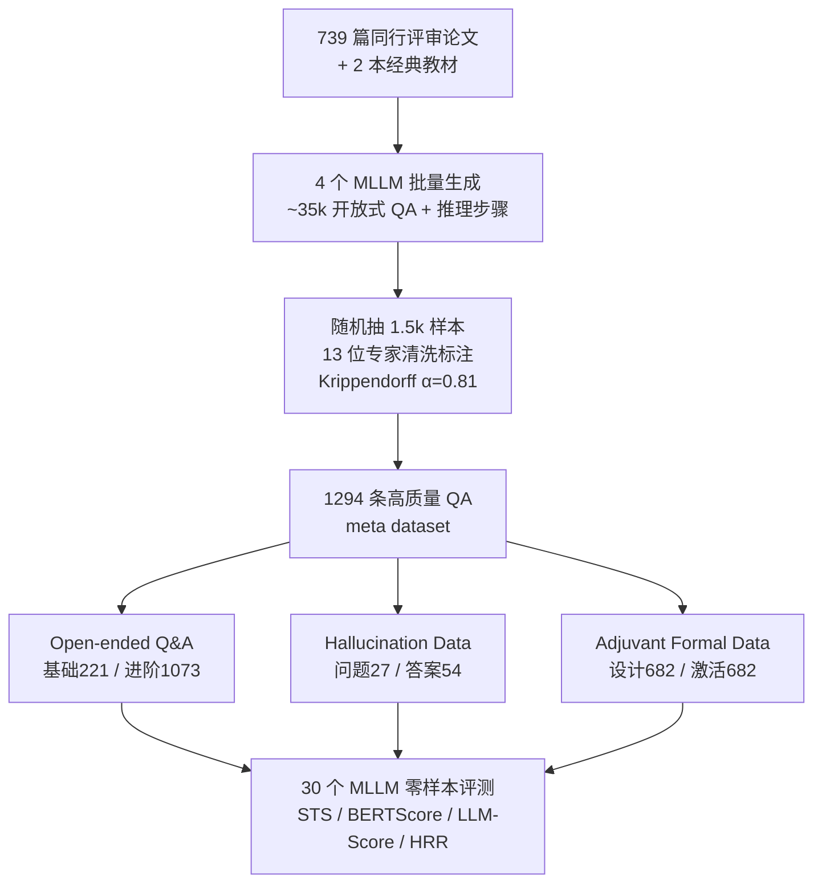

# An Open-Ended Benchmark and Formal Framework for Adjuvant Research with MLLM

**会议**: ICLR 2026  
**OpenReview**: [https://openreview.net/forum?id=moeOrHkDg2](https://openreview.net/forum?id=moeOrHkDg2)  
**代码**: [https://github.com/banjiuyufen/Adjuvant-Benchmark](https://github.com/banjiuyufen/Adjuvant-Benchmark)  
**领域**: LLM 评测 / 科学 MLLM / 生物医药 Benchmark  
**关键词**: 佐剂研究, 开放式问答, 幻觉拒识, 形式化描述, MLLM 评测  

## 一句话总结
针对长期被 AI 忽视的"疫苗佐剂(adjuvant)"领域，构建了首个由领域专家标注的开放式问答 benchmark（1294 条 QA + 1364 条形式化描述），系统评测 11 个闭源 + 19 个开源 MLLM，并提出一套把佐剂设计原理和免疫机制编码成结构化变量/函数的形式化框架。

## 研究背景与动机

**领域现状**：AI 已经深度改造了药物发现、蛋白结构预测、基因组学、催化剂与电池材料这些科学方向——它们都有大规模数据集、标准化 benchmark 和成熟的方法论。但佐剂(adjuvant)——这个决定疫苗能否激发足够免疫应答、关乎新发传染病和肿瘤免疫治疗成败的核心组分——却是一片空白。作者用一张跨领域对照表(Table 1)直观呈现：在 Datasets / Methods / Principles 三列上，佐剂全是 ✗，是唯一三项皆缺的领域。

**现有痛点**：佐剂研究被三道壁垒卡住——(i) 缺乏系统整理的数据；(ii) 缺乏针对佐剂知识量身定做的 AI 方法；(iii) 佐剂定义与机制高度异质（从合成小分子、天然提取物到颗粒材料都算佐剂），多尺度免疫机制让系统建模困难。已有生物医学 benchmark（PubMedQA、ChemBench 等）评的是分子性质、文献摘要或通用生物医学知识，无法直接迁移到佐剂这种"机制推理 + 安全评估 + 设计导向"的场景。

**核心矛盾**：佐剂领域的知识本质上是**开放式、机制性、多模态**的——一道关于"某佐剂如何调控固有免疫继而影响适应性免疫"的问题，根本无法塞进选择题(multiple-choice)的框架里；而当前没有任何 benchmark 能在这种开放语境下衡量 MLLM 到底懂多少、会不会一本正经地编造(hallucinate)。

**本文目标**：搭出佐剂领域的第一套评测基础设施——既能横向比较现有通用 MLLM 在佐剂知识上的能力与短板，又能为未来训练领域专用模型提供数据与符号化基础。

**核心 idea**：**(1) 开放式问答而非选择题**——用专家标注的自由问答捕捉机制推理、设计考量与安全问题；**(2) 把幻觉数据当资源而非垃圾**——保留被专家判定为错误的问答，专门用来测模型"能不能识别并拒绝错误内容"；**(3) 形式化框架**——把复杂生物机制翻译成结构化变量与函数（如 `Form(Struc, Ag)`、`Load(A, B, Surface)`），作为统计学习与符号推理结合的可计算抽象。

## 方法详解

### 整体框架
整个工作分两条线：一条是 **benchmark 构建管线**（从文献 → MLLM 批量生成候选 QA → 专家清洗标注 → 拆成三类数据），另一条是 **评测协议**（30 个 MLLM 在零样本下跑开放问答、幻觉拒识、生成质量三类任务，用自动指标 + LLM 评分 + 专家主观打分三层度量）。benchmark 最终由 Open-ended Q&A、Hallucination Data、Adjuvant Formal Data 三个互补组件构成。

### 关键设计

**1. 多模型生成 + 专家审核的"去自评偏置"标注管线：** 为避免"同一个模型既出题又答题"导致的自评偏置，作者用 GPT-4o、Claude3.5-Sonnet、Ernie4.0-Turbo、DeepSeek-R1 四个长上下文多模态模型从 739 篇论文 + 2 本教材里生成约 35k 条带显式推理步骤的开放问答，再随机抽 1.5k 条交给 13 位横跨传染病、肿瘤、细菌疫苗的专家逐条审核。每个"问题–推理–答案"三元组被严格对照原文，标为 valid 或 hallucinated（后者必须给出理由），最终保留 1294 条高质量 QA。标注者间一致性 Krippendorff's $\alpha = 0.8119$，说明标注信度很高。开放问答进一步分为基础知识(221)与进阶知识(1073)，进阶又拆成生物学原理(846)和设计与安全(227)；其中 12.3% 的条目带图像输入，支撑多模态推理评测。

**2. 把幻觉当评测资源的拒识任务：** 与多数 benchmark 直接丢弃错误样本不同，本文把被专家判错的问答单独留下来构成 Hallucination Data（问题幻觉 27、答案幻觉 54、重叠 12，共 69 条），格式与正常问答完全一致。这样就构造了一个受控环境，用 **幻觉拒识率(HRR, Hallucination Rejection Ratio)** 衡量模型能否识别并拒绝错误内容——这正是科学场景里最要命的能力：一个会编造免疫机制的模型在佐剂设计上是危险的。

**3. 佐剂形式化描述框架：** 这是论文区别于普通"刷榜 benchmark"的核心。作者与佐剂专家一起定义一套形式化变量和函数，把佐剂设计原理与免疫激活过程写成结构化抽象，例如 `Form(Struc, Ag)` 表示某种结构与抗原的成形关系、`Load(A, B, Surface)` 表示 A 在 B 表面的载荷关系。这些模板被嵌进 GPT-4o 的 prompt，生成 1364 条形式化条目，均分为"佐剂设计"和"佐剂激活与免疫过程"两类各 682 条。其意义在于把原本散落在文献里、隐式且碎片化的机制，变成可计算、可作为训练/推理积木的符号表示，为未来"统计学习 + 符号推理"的领域专用 MLLM 打基础（本文尚未将其用于下游训练）。

**4. 三层度量评测协议：** 评测同时用三类指标避免单一视角偏差——(a) 自动指标：语义文本相似度 STS 和 BERTScore；(b) LLM 评分：用 GPT-4o 和 DeepSeek-R1 双评委按 Similarity Score(SS)、Scientific Rationality Score(RS)、Inclusiveness Score(IS) 三轴 0–10 打分；(c) 专家主观评分：在生成质量上从提问能力、回答能力、推理能力、知识储备、图表分析、上下文利用、指令遵循等维度打分。为保证可比性，无论模型是否支持多模态，统一用同一个 OCR 引擎把图像转文本后与原文拼接，所有模型在相同 prompt、零样本下评测。

## 实验关键数据

### 主实验：开放式问答评测（部分）

| 模型 | 类别 | STS | BERTScore | LLM Score Avg |
|------|------|-----|-----------|---------------|
| OpenAI-o1 | 闭源·Think | **0.7495** | **0.6195** | 7.7 |
| GPT-4.1 | 闭源·Inference | 0.7178 | 0.5420 | **7.8** |
| Claude3.7 | 闭源·Inference | 0.7396 | 0.5650 | 7.4 |
| Gemini2.5-Pro | 闭源·Inference | 0.7316 | 0.5664 | 7.5 |
| DeepSeek-V3 | 开源·Inference | 0.7289 | 0.5276 | **7.8** |
| DeepSeek-R1 | 开源·Think | 0.7415 | — | 7.7 |
| Qwen3-235B-A22B | 开源·Think | 0.7331 | — | 7.6 |
| Qwen3-32B | 开源·Think | 0.7259 | — | 7.6 |
| LLaVA1.5-7B | 开源·Inference | 0.7134 | 0.5823 | 5.7 |
| InstructBlip-13B | 开源·Inference | 0.5960 | 0.5551 | ~4.x |

- 闭源平均：LLM Score 7.3 / STS 0.7263 / BERTScore 0.5656；开源平均：6.4 / 0.6922 / 0.5504。
- 闭源最佳 **OpenAI-o1**（STS 0.7495，LLM Score 7.7）；开源最佳 **DeepSeek-R1**（STS 0.7415，LLM Score 7.7）。

### 关键发现
- **闭源整体领先但差距来自领域知识而非开闭源属性**：DeepSeek-R1/V3、Qwen3-235B/32B 等开源强模型在科学合理性与全面性上已可比肩最强闭源；但在术语一致性(BERTScore)上开源平均仍落后，说明对齐领域专有词汇仍是短板。
- **Think 模型 > Inference 模型**：带显式推理链的 Think 模型在 RS、IS、STS 上普遍更高，多步因果分解与逻辑校验带来更连贯全面的答案，但代价是解码复杂度上升、资源受限场景下效率受限。
- **生成质量**：专家主观评分中 GPT-4o 与 DeepSeek-R1 综合最强（GPT-4o 提问能力与指令遵循最佳、知识覆盖广；DeepSeek-R1 提问与回答能力均衡），Ernie4.0、Claude3.5 在处理复杂佐剂文献时多项偏低。

## 亮点与洞察
- **填补真实空白**：不是又一个换皮 benchmark，而是把一个被 AI 长期忽视、却临床极重要的领域（佐剂）第一次搬上 MLLM 评测台，动机扎实。
- **幻觉数据再利用**：把"错误样本"从垃圾变成测拒识能力的金矿，是评测设计上很聪明的一招，契合科学场景对可靠性的苛求。
- **形式化框架的前瞻性**：`Form(·)`、`Load(·)` 这类符号抽象试图给免疫机制建一套"可计算语言"，指向统计学习 + 符号推理融合的方向，是论文最有想象空间的部分。
- **评测严谨**：30 个模型、零样本、统一 OCR、三层度量、双 LLM 评委 + 13 位专家标注（α=0.81），可信度高。

## 局限与展望
- **形式化框架尚未落地训练**：1364 条形式化数据目前只是"积木"，论文坦承尚未用于任何下游模型训练或推理，其真实价值仍待验证。
- **规模偏小**：1294 条 QA 相对通用 benchmark 量级有限，且 87.7% 为纯文本、仅 12.3% 带图像，多模态评测覆盖较薄。
- **数据由 MLLM 生成**：候选问答出自 4 个商业 MLLM，尽管经专家清洗，仍可能继承生成模型的知识盲区与风格偏置。
- **闭源不可归因**：对闭源模型表现差异只能观察不能解释（训练数据/流程不透明），评测结论偏描述性。
- **展望**：把形式化框架真正喂进领域专用 MLLM 的训练、扩大多模态与机制覆盖、引入更透明协作的评测实践。

## 相关工作与启发
- **科学 Benchmark**：ChemBench（化学选择题）、DataSciBench（数据科学）、SciMT-Safety（科学安全红队）、PubMedQA（生物医学问答）——本文指出它们都不触及佐剂的异质性与机制推理特性。
- **生物医学 MLLM**：LLaVA-Med、BiomedGPT、BioGPT 等通用生物医学基座，可作为未来佐剂专用模型的起点。
- **启发**：对任何"AI 尚未进入的科学细分领域"，本文给出一条可复制的路径——专家定义形式化语言 → 多模型生成 + 专家标注建 benchmark → 把幻觉留作拒识资源 → 三层度量横评，再以形式化数据为桥走向领域专用模型。

## 评分
- **新颖性**: ⭐⭐⭐⭐ 首个佐剂领域 MLLM benchmark，形式化框架与幻觉拒识设计有原创性，但 benchmark 构建范式本身较成熟。
- **实验充分度**: ⭐⭐⭐⭐ 30 个模型、三层度量、专家高一致性标注，横评扎实；但形式化框架未做下游验证、多模态样本偏少。
- **写作质量**: ⭐⭐⭐⭐ 动机用跨领域对照表点明空白，三类数据与评测协议叙述清晰，结构完整。
- **价值**: ⭐⭐⭐⭐ 为冷门但临床关键的佐剂领域奠定评测与符号化基础，对科学 MLLM 方向有实际推动作用。

<!-- RELATED:START -->

## 相关论文

- [\[ICLR 2026\] Characterizing Deep Research: A Benchmark and Formal Definition](characterizing_deep_research_a_benchmark_and_formal_definition.md)
- [\[ICLR 2026\] AutoLibra: Agent Metric Induction from Open-Ended Human Feedback](autolibra_agent_metric_induction_from_open-ended_human_feedback.md)
- [\[ICLR 2026\] FormalML: A Benchmark for Evaluating Formal Subgoal Completion in Machine Learning Theory](formalml_a_benchmark_for_evaluating_formal_subgoal_completion_in_machine_learnin.md)
- [\[ACL 2026\] Automated Creativity Evaluation of Language Models Across Open-Ended Tasks](../../ACL2026/llm_evaluation/automated_creativity_evaluation_of_language_models_across_open-ended_tasks.md)
- [\[ICLR 2026\] DRBench: A Realistic Benchmark for Enterprise Deep Research](drbench_a_realistic_benchmark_for_enterprise_deep_research.md)

<!-- RELATED:END -->
