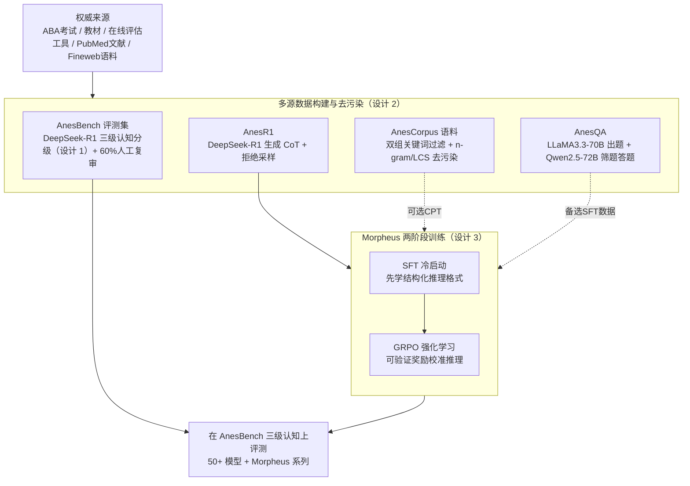

# AnesSuite: A Comprehensive Benchmark and Dataset Suite for Anesthesiology Reasoning

**会议**: ICLR 2026  
**arXiv**: [2504.02404](https://arxiv.org/abs/2504.02404)  
**代码**: [MiliLab/AnesSuite](https://github.com/MiliLab/AnesSuite)  
**领域**: LLM评测  
**关键词**: 麻醉学推理, 医疗基准, 双语评测, 认知需求分级, GRPO强化学习

## 一句话总结

构建首个面向麻醉学推理的综合数据集套件AnesSuite，包含评测基准AnesBench（7972道三级认知难度双语选择题）和三组训练数据集（AnesCorpus/AnesQA/AnesR1），基于此训练的Morpheus模型通过SFT+GRPO让7B模型追平14B基线，同时揭示了当前最强LLM在复杂临床推理（System 2）上的显著瓶颈。

## 研究背景与动机

**领域现状**：LLM在医疗AI领域取得了长足进展，但在麻醉学这类高度专业化的学科中的推理能力仍然严重不足。麻醉学涉及气道和呼吸功能、心血管稳定性、电解质平衡、镇静水平等多系统的同时管理，需要从快速事实回忆（System 1）到复杂的多因素临床决策（System 2）的全谱推理能力。

**现有痛点**：现有医疗基准如MedQA、PubMedQA虽然覆盖面广，但存在三个关键问题：（1）麻醉学经常被隐性归入外科或牙科类别，缺乏独立的专项评测；（2）仅有的麻醉学评测如CAB主要关注事实记忆型题目，对临床推理和决策能力的考察不足；（3）语言覆盖单一，无法评估模型在中英双语临床场景下的表现差异。

**核心矛盾**：LLM在麻醉学上的主要挑战不是知识层面的缺失，而是将知识应用于复杂推理问题的能力不足。现有基准未能有效区分"知道什么"和"能推理什么"，导致无法精确定位模型瓶颈。同时，SFT、CPT、RLVR等训练策略在医学专科领域的效果差异缺乏系统性对比。

**本文目标** （1）构建首个涵盖评测+训练全链路的麻醉学数据集套件；（2）建立认知需求三级分类体系以精确诊断模型能力边界；（3）探索高效的领域适配训练策略。

**切入角度**：作者借鉴认知心理学中Kahneman的System 1/2理论，在医疗基准中首次引入System 1（事实回忆）→ System 1.x（混合推理）→ System 2（复杂决策）的三级认知分级，使得评测能够精细化地揭示模型在不同推理层次上的表现差异。

**核心 idea**：通过构建认知分级的专科评测基准+配套训练数据集，系统化地推动LLM在麻醉学复杂推理上的能力提升及瓶颈分析。

## 方法详解

### 整体框架

AnesSuite是一个"评测+训练"一体化的数据集套件，由四个互补组件构成，覆盖从持续预训练到强化学习的完整模型开发链路。输入端是来自权威医学来源（ABA考试、教材、PubMed文献、大规模网络文本）的原始数据，输出端是结构化的评测基准和可直接用于各训练阶段的对齐数据。

| 组件 | 数据类型 | 英文规模 | 中文规模 | 用途 |
|------|----------|----------|----------|------|
| AnesBench | 选择题 | 4,418题 | 3,554题 | 评测基准（三级认知分级） |
| AnesCorpus | 纯文本文档 | 180万篇 | 60万篇 | 持续预训练（CPT） |
| AnesQA | QA对 | 20,713条 | — | 监督微调（SFT） |
| AnesR1 | 选择题+CoT | 3,200条 | 7,000条 | SFT冷启动 + RLVR（GRPO） |

基于这套数据，作者训练了Morpheus系列模型——以Qwen2.5-7B/14B/32B为基座，经过AnesR1上的SFT+GRPO两阶段训练，得到首个麻醉学推理基线模型集合。整条链路可以概括为：原始权威来源 → 构建四个数据组件（评测集 + 三组训练数据，全程去污染）→ 用训练数据做两阶段适配 → 回到AnesBench上按三级认知分级评测。

### 关键设计

**1. 三级认知需求分类体系（System 1 / 1.x / 2）：把"考记忆"和"考推理"拆开评**

传统医疗基准把所有题目混在一起报整体准确率，大量简单记忆题会把成绩拉高，掩盖模型在真正需要推理时的短板。AnesBench借认知科学的双系统理论，把7972道题按推理复杂度分成三档：System 1是纯事实回忆（如"丙泊酚的作用机制是什么"），System 1.x是混合推理（需要整合2-3个知识点），System 2是复杂临床决策（多步推理、条件判断、跨知识域综合）。分级靠DeepSeek-R1配合详细标注指南和少样本示例自动标注，再随机抽60%交由医学专家人工复审把关。最终System 1.x和System 2合计占两到三成，保证高阶推理被充分考察。分级之后，模型从System 1到System 2的准确率断崖式下滑才暴露出来——这正是整体准确率掩盖掉的瓶颈。

**2. 多源数据构建与去污染流水线：四个数据集各取所需，且严防泄露**

医疗领域的数据泄露格外棘手，常见考试题很可能早被LLM预训练数据吃进去，污染会让评测虚高。四个组件因此各走一条来源可控的构建路径：AnesBench取自ABA考试、标准化教材和验证过的在线评估工具；AnesCorpus用两级关键词过滤从Fineweb和Chinese Fineweb里筛麻醉学相关文档；AnesQA走双模型流水线，由LLaMA3.3-70B从PubMed论文出题、Qwen2.5-72B筛题并生成答案；AnesR1的CoT轨迹由DeepSeek-R1生成，并经拒绝采样（同一题3次都答不对就剔除）保证推理链可靠。去污染上对AnesCorpus做两阶段比对——先用n-gram快速粗筛，再用最长公共子串（LCS > 64字符）细粒度核对，配合专门的数据泄露分析算法，把评测集和训练语料的重叠压到最低。

**3. Morpheus两阶段训练流程（SFT → GRPO）：先教格式，再用可验证奖励逼出推理**

只做SFT会有个尴尬副作用：英文准确率小涨，中文却大跌（Morpheus-14B仅SFT时中文从0.72掉到0.55），原因很可能是AnesR1的中英文配比不均，SFT把模型往目标语言带偏、造成语言维度的灾难性遗忘。Morpheus因此把SFT只当冷启动：第一阶段用AnesR1的CoT数据做有限步数SFT，让模型先学会输出结构化推理过程的格式；第二阶段在AnesR1的可验证选择题上做GRPO（Group Relative Policy Optimization）强化学习，直接拿"答案是否正确"当verifiable reward，对同一题采样多个回答、按组内相对排名算优势函数来更新策略，无需额外的reward model。GRPO在保住英文增益的同时把中文表现重新校准回来甚至反超基线。更值得注意的是，全程只用了约1万条麻醉学数据，推理增益却能泛化到通用医学乃至通用领域基准（如MMLU、MedQA），三种规模（7B/14B/32B）的Morpheus都因此追平了上一级别的Qwen2.5基线。

### 损失函数 / 训练策略

SFT阶段使用标准的next-token prediction损失。GRPO阶段采用group relative policy optimization——对同一问题采样多个候选回答，以正确答案匹配作为reward信号，用组内相对排名计算优势函数进行策略优化。与传统RL不同，GRPO不需要额外的reward model，直接利用选择题的可验证性作为奖励信号。训练在Qwen2.5-7B/14B/32B三种规模上分别进行，SFT步数有限，GRPO阶段使用标准超参设置。

## 实验关键数据

### 主实验：50+模型在AnesBench上的评测

论文评测了超过50个LLM，涵盖闭源模型（GPT-4o, Gemini-2.5-Pro/Flash, Claude-3.7-Sonnet）、通用开源模型（Qwen3系列、Llama-4、DeepSeek-R1/V3）和医疗特化模型（HuatuoGPT-o1、BioMistral）。

| 模型 | EN-Sys1 | EN-Sys1.x | EN-Sys2 | EN-Total | CH-Sys1 | CH-Sys1.x | CH-Sys2 | CH-Total | Avg. |
|------|---------|-----------|---------|----------|---------|-----------|---------|----------|------|
| Gemini-2.5-Pro | 0.89 | 0.82 | **0.77** | **0.86** | 0.88 | 0.75 | **0.60** | **0.85** | **0.85** |
| DeepSeek-R1 | 0.85 | 0.78 | 0.70 | 0.82 | 0.86 | 0.77 | 0.61 | 0.83 | 0.82 |
| Llama-4-Maverick | 0.83 | 0.73 | 0.64 | 0.79 | 0.86 | 0.72 | 0.59 | 0.83 | 0.81 |
| Gemini-2.5-Flash | 0.84 | 0.76 | 0.68 | 0.81 | 0.84 | 0.72 | 0.59 | 0.81 | 0.81 |
| GPT-4o | 0.81 | 0.72 | 0.59 | 0.77 | 0.79 | 0.64 | 0.52 | 0.76 | 0.76 |
| Claude-3.7-Sonnet | 0.80 | 0.73 | 0.63 | 0.77 | 0.82 | 0.65 | 0.55 | 0.78 | 0.77 |
| Qwen3-32B | 0.72 | 0.64 | 0.48 | 0.68 | 0.81 | 0.64 | 0.57 | 0.78 | 0.70 |
| HuatuoGPT-o1-72B | 0.71 | 0.61 | 0.48 | 0.67 | 0.79 | 0.67 | 0.61 | 0.76 | 0.71 |
| Qwen2.5-7B-Instruct | 0.56 | 0.44 | 0.36 | 0.51 | 0.69 | 0.55 | 0.55 | 0.66 | 0.59 |
| BioMistral-7B | 0.43 | 0.30 | 0.32 | 0.39 | 0.24 | 0.25 | 0.16 | 0.24 | 0.31 |

### Morpheus模型结果

| 模型 | SFT | GRPO | EN-Total | CH-Total | Avg. |
|------|-----|------|----------|----------|------|
| Qwen2.5-7B-Instruct | — | — | 0.51 | 0.66 | 0.59 |
| Morpheus-7B (SFT only) | ✓ | ✗ | 0.54 | 0.56 | 0.54 |
| **Morpheus-7B** | **✓** | **✓** | **0.56** | **0.70** | **0.63** |
| Qwen2.5-14B-Instruct | — | — | 0.57 | 0.72 | 0.64 |
| Morpheus-14B (SFT only) | ✓ | ✗ | 0.60 | 0.55 | 0.57 |
| **Morpheus-14B** | **✓** | **✓** | **0.63** | **0.75** | **0.69** |
| Qwen2.5-32B-Instruct | — | — | 0.61 | 0.76 | 0.68 |
| Morpheus-32B (SFT only) | ✓ | ✗ | 0.67 | 0.64 | 0.65 |
| **Morpheus-32B** | **✓** | **✓** | **0.68** | **0.77** | **0.72** |

核心结论：**Morpheus-7B追平Qwen2.5-14B-Instruct，Morpheus-14B追平Qwen2.5-32B-Instruct，Morpheus-32B追平Qwen2.5-72B-Instruct**——每级模型通过SFT+GRPO都能达到上一级别的基线性能。

### 消融实验：训练策略与数据对比

| 模型 | SFT数据 | EN准确率 | CH准确率 |
|------|---------|----------|----------|
| Qwen2.5-7B-Base + AnesQA | 麻醉学 | 49.3 | 64.9 |
| Qwen2.5-7B-Base + Medical-o1 | 通用医学 | 49.1 | 63.0 |
| Qwen2.5-7B-Base + 两者混合 | 混合 | **49.7** | **65.9** |
| Qwen2.5-7B-Base-CPT + AnesQA | 麻醉学 | 49.7 | 50.7 |
| Qwen2.5-7B-Base-CPT + Medical-o1 | 通用医学 | 50.7 | 59.4 |
| Qwen2.5-7B-Base-CPT + 两者混合 | 混合 | **51.2** | **60.0** |

### 关键发现

- **System 2是所有模型的瓶颈**：从System 1到System 2的性能衰减幅度惊人——即使Gemini-2.5-Pro在英文System 2上也仅0.77（vs System 1的0.89），大多数开源模型的System 2成绩低于0.5。这说明LLM在麻醉学的核心挑战不是知识缺失，而是将知识应用于复杂推理的能力不足
- **GRPO是推理增益的关键**：单独SFT在英文端有小幅提升但会严重损害中文表现（Morpheus-14B SFT only的中文从0.72降到0.55），GRPO能在此基础上全面恢复并超越基线。这暗示SFT可能造成了语言维度的灾难性遗忘，而GRPO通过reward信号重新校准了语言平衡
- **CPT的双面性**：AnesCorpus的持续预训练能提升英文表现（49.7→51.2），但严重损害中文表现（64.9→50.7），降幅高达14.2个百分点。作者推测是因为AnesCorpus中英文文档比例3:1，造成了中文知识系统的灾难性遗忘
- **CoT长度与推理质量正相关**：在System 2任务上，生成更长CoT推理链的模型表现明显更好；但在System 1和System 1.x任务上，CoT长度的影响微乎其微，性能主要由模型规模决定
- **通用医学数据具有互补价值**：AnesQA（专科）和Medical-o1（通用医学）混合使用的效果优于单独使用任一数据集，说明即使在高度专业化的麻醉学领域，通用医学知识仍然是有益的补充
- **医疗特化模型无显著优势**：HuatuoGPT-o1等医疗LLM在AnesBench上的表现并未显著优于同规模的通用推理模型（如DeepSeek-R1），说明麻醉学推理与通用医学有本质差异

## 亮点与洞察

- **认知分级思路可迁移**：System 1/1.x/2的三级框架不依赖于麻醉学的具体内容，可以直接应用于其他需要区分记忆/简单推理/复杂推理的专科基准（如ICU重症决策、急诊分诊等）。这比简单的难/中/易分级更具理论基础，因为它对应了认知科学中已被充分验证的思维双系统理论
- **SFT作为GRPO的冷启动而非最终方案**：这一发现非常实用——论文清晰展示了SFT的"副作用"（提升目标语言同时损害其他语言），以及GRPO如何通过可验证奖励信号修复这一问题。对于任何多语言模型的专科适配都有指导意义
- **小数据高回报**：仅用约1万条AnesR1数据就实现了跨规模级别的推理增益，并且增益还能泛化到通用医学和通用领域基准（如MMLU、MedQA），说明推理密集型专科数据的迁移价值被低估了
- **数据集水平评测**：超过50个模型的横评提供了一幅完整的LLM麻醉学推理能力图谱，对于选择部署方案具有直接参考价值

## 局限与展望

- **System 2题目来源于抽象场景而非真实病例**：论文自己承认，System 2问题是从考试和教材中构建的结构化场景，而非来自真实电子病历（EMR）的临床决策案例，可能无法完全反映实际临床中更模糊、信息不完整的决策环境
- **缺失多模态临床数据**：真实麻醉工作涉及监护仪波形、影像学、视频喉镜画面等多模态信息，仅靠文本选择题无法评估模型在真实multi-modal临床环境中的决策能力
- **CPT策略探索不充分**：AnesCorpus导致中文灾难性遗忘的问题只给出了猜测性解释，未深入探索中英文语料配比、学习率调度、progressive training等可能的修复策略
- **评测形式受限**：选择题天然受限于预设选项，无法评估模型生成自由形式临床建议的能力（虽然附录中有补充的开放式评测，但规模很小）
- **GRPO的可验证奖励依赖选择题格式**：RLVR方法需要可自动验证的reward信号，这在选择题上很自然，但扩展到开放式临床推理时如何设计reward函数仍是开放问题

## 相关工作与启发

- **vs HuatuoGPT-o1**：HuatuoGPT-o1是通用医疗推理模型，在麻醉学上72B版本达0.71 avg，但未专门针对麻醉学做数据和评测设计。AnesSuite的价值在于证明了通用医疗模型在专科推理上仍有明显盲区
- **vs CAB**：CAB是此前唯一聚焦麻醉学的基准，但仅覆盖中文且以事实回忆题为主。AnesSuite在语言覆盖（双语）、认知分级（三级）和训练资源（评测+训练一体化）三个维度全面超越
- **vs DeepSeek-R1**：DeepSeek-R1在AnesBench上达0.82 avg是所有开源模型最高，说明通用的强化学习推理训练对医学专科也有显著溢出效应，但与Gemini-2.5-Pro（0.85）仍有差距
- **认知科学启发**：Kahneman双系统理论在NLP社区此前主要被用于分析人类标注行为，AnesSuite首次将其系统化地应用于LLM基准设计，提供了一种跨领域迁移理论框架的范例

## 评分

- 新颖性: ⭐⭐⭐⭐ 首个麻醉学完整数据集套件，认知三级分类有创新，但数据集构建方法本身较常规
- 实验充分度: ⭐⭐⭐⭐⭐ 50+模型横评、多训练策略消融、跨语言分析、CoT长度分析等维度全面
- 写作质量: ⭐⭐⭐⭐ 结构清晰、数据呈现充分，但CPT分析深度不足
- 价值: ⭐⭐⭐⭐ 对医疗AI领域的专科适配和推理增强研究有重要参考价值，数据集和模型均开源

<!-- RELATED:START -->

## 相关论文

- [\[ICLR 2026\] AirQA: A Comprehensive QA Dataset for AI Research with Instance-Level Evaluation](airqa_a_comprehensive_qa_dataset_for_ai_research_with_instance-level_evaluation.md)
- [\[ICLR 2026\] DeepResearch Bench: A Comprehensive Benchmark for Deep Research Agents](deepresearch_bench_a_comprehensive_benchmark_for_deep_research_agents.md)
- [\[ACL 2025\] PhysReason: A Comprehensive Benchmark towards Physics-Based Reasoning](../../ACL2025/llm_evaluation/physreason_a_comprehensive_benchmark_towards_physics-based_reasoning.md)
- [\[ICCV 2025\] 3DSRBench: A Comprehensive 3D Spatial Reasoning Benchmark](../../ICCV2025/llm_evaluation/3dsrbench_a_comprehensive_3d_spatial_reasoning_benchmark.md)
- [\[ICLR 2026\] AstaBench: Rigorous Benchmarking of AI Agents with a Scientific Research Suite](astabench_benchmarking_ai_agents.md)

<!-- RELATED:END -->
