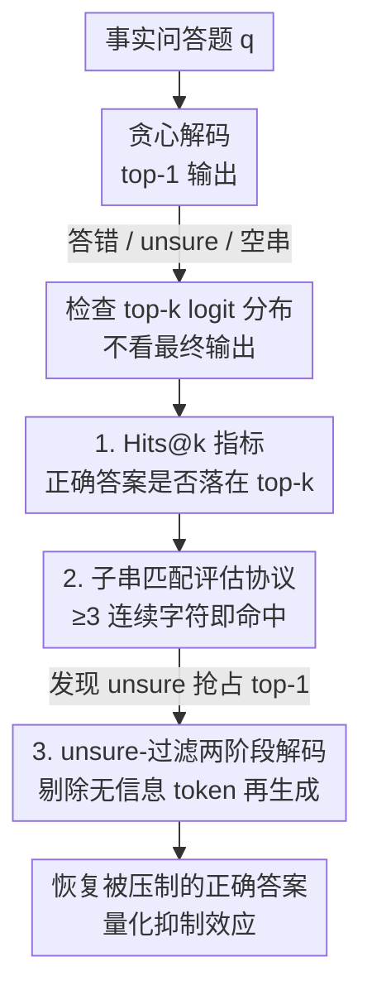

# Are LLMs Really Not Knowledgeable? Mining the Submerged Knowledge in LLMs' Memory

**会议**: ICLR 2026  
**OpenReview**: [https://openreview.net/forum?id=gvUufgeJvV](https://openreview.net/forum?id=gvUufgeJvV)  
**代码**: https://github.com/taoxj2001/Hits_at_k  
**领域**: LLM评估 / 知识探测 / 事实问答  
**关键词**: 参数化知识, 知识存储-表达鸿沟, Hits@k, 解码抑制, 幻觉

## 一句话总结
这篇论文指出 LLM 在问答任务上答错或回答"不确定"，往往不是因为参数里没存相关知识，而是知识"沉在水面下没被表达出来"——它提出 Hits@k 指标证明：正确答案常常就排在 top-k logits 里只是没被选中（LLaMA3-8B 在 DBpedia 上 Hits@1 仅 17.2%，Hits@5 却到 57.9%），并进一步揭示主流"允许回答 unsure"的提示范式会主动压制低置信度的正确答案。

## 研究背景与动机

**领域现状**：人们越来越把 LLM 当成"参数化知识库"——预训练把海量事实压进权重，问答时再调取出来。围绕它在知识密集任务上的失败（幻觉、答错、回答不一致），主流补救手段集中在三类：领域微调、提示工程、改架构。

**现有痛点**：这三类手段背后都隐含同一个假设——答错是因为**参数里压根没存这条知识**（knowledge gap），所以解法都指向"扩容量、加数据"。但作者系统检查模型输出后发现一个被忽略的现象：即使模型最终吐出了错误答案，正确答案常常仍以**高概率**躺在它的 token 概率分布里。比如问"华盛顿州首府"，模型贪心解码输出"Seattle"，但给正确答案"Olympia"也分配了很高的概率分。

**核心矛盾**：问题的根源不是"知识缺失"（storage）而是"知识表达"（expression）——存储和表达之间存在系统性鸿沟。传统只看 top-1 最终输出的评测，会**严重低估**模型参数里实际编码的知识量，从而把"表达问题"误诊成"知识问题"，导致整条补救路线南辕北辙。

**本文目标**：(1) 用一个指标量化"模型到底存了多少知识"，把它和"模型表达出了多少知识"分开；(2) 搞清楚哪些因素（模型规模、新旧、领域、流行度）影响存储-表达对齐；(3) 检查当前问答范式（允许 unsure）是不是在主动加剧这个鸿沟。

**切入角度**：与其看最终被选中的那个 token，不如直接看**解码时整条 token logit 分布**——它反映的是模型在最终选择前的"内部知识状态"。如果正确答案稳定地出现在 top-k 里，就说明知识其实"在"，只是没被表达。

**核心 idea**：用"正确答案是否落在 top-k logits 中"（Hits@k）代替"top-1 是否正确"（accuracy）来度量知识，从而把沉在水下的知识挖出来；并据此反推主流 unsure 提示范式对正确答案的抑制效应。

## 方法详解

### 整体框架

这篇论文不是提一个新模型或新训练方法，而是一套**诊断性的分析框架**：先把"模型存了什么"和"模型说了什么"解耦，再定位是什么在两者之间挡路。整条分析流是：拿一道事实问答题，让模型贪心解码——它可能答错、可能回答"unsure"、也可能给出空串等无信息回答；这时不看最终输出，而是回头检查这一步的 top-k logit 分布，用 **Hits@k** 量化正确答案到底在不在里面；进而发现一大类失败来自"unsure 等无信息 token 抢了 top-1"，于是设计一个**两阶段 unsure-过滤解码**作为探针，把被压制的正确答案重新捞回来，并用恢复率（recovery rate）量化这种抑制到底有多大。

### 关键设计

**1. Hits@k 指标：把"存了多少知识"从"答对率"里解放出来**

直接痛点是 top-1 accuracy 无法区分"模型不知道"和"模型知道但没说出来"。作者定义

$$\text{Hits@}k = \frac{N^{k}_{\text{correct}}}{N}$$

其中 $N^{k}_{\text{correct}}$ 是"正确答案出现在 top-$k$ logits 中"的样本数，$N$ 为总样本数。$k=1$ 时它就退化成普通 accuracy；放大 $k$ 就等于问"如果允许模型多给几个候选，它的参数里到底藏没藏着正确答案"。关键发现是这个差距巨大：LLaMA3-8B 在 DBpedia 上 Hits@1 只有 17.2%，Hits@5 直接跳到 57.9%，$k=50$ 时 head/torso/tail 三个子集都超过 80%。这说明对一个约 12.8 万 token 词表的模型，正确答案绝大多数情况下就挤在分布**最前面的极少数 token** 里——知识是"在"的，只是没被贪心解码选中。Hits@k 由此成为一把把"水下知识"显形的尺子，证明传统评测系统性低估了 LLM 的参数化知识。

**2. 子串匹配评估协议：绕开子词分词带来的"假阴性"**

很多模型用子词分词，正确答案"Antibiotic"在 logits 里可能只露出一个子词"Antib"，逐字符精确匹配会把它当成没命中，从而再次低估知识。作者的评估协议改成：只要 top-k 中**任一 token 与标准答案共享至少 3 个连续字符**，就判为命中。这个看似工程化的小决定，是 Hits@k 能成立的前提——它让指标度量的是"模型是否激活了正确答案对应的 token 表示"，而非"是否完整拼出整个词"，避免把分词副作用误读成知识缺失。作者也据此论证 Hits@k 捕捉的是真实的潜在知识而非表层 token 共现：它在不同领域上呈现系统性的存储-表达鸿沟，且给出的模型排名与 accuracy 排名显著不同（说明它测的是一种和答对率正交的内部属性，而非 accuracy 的噪声变体）。

**3. unsure-过滤两阶段解码：把被"谨慎"压住的正确答案捞回来**

前面发现一类突出的失败：模型最终输出"unsure"或空串，但正确答案（或其子词）就排在第二、第三高的 logit 上（图 6 的三个案例）。根因是主流问答提示为了压幻觉允许回答 unsure，结果"unsure"这种无信息 token 反而抢占了 top-1，把低置信度的正确答案挤掉——这就是"记忆掩蔽（memory-masking）"效应。作者设计一个**纯分析性探针**（Algorithm 1）来量化它：给定问题 $q$ 与词表分布 $P(t\mid q)$，把满足启发式规则的 token 标为无信息集合 $U$（以"uns"开头、空串、少于 3 个字符、或纯停用词），然后选出 top-k 中概率最高的**有信息** token 作为候选答案

$$a^{*}=\arg\max_{t\in T_k\setminus U} P(t\mid q)$$

把 $a^{*}$ 拼回原 prompt 再让模型解码一轮，看能否产出正确答案。作者强调这只是衡量抑制效应的探针、不是即用方法。实验上它确实把相当一部分原本被判为 unsure 的样本恢复成了正确答案（如 LLaMA3-70B 在 DBpedia-Head 上从 11.2% 拉到 23.0%，+11.8 个点），坐实了"很多 unsure 其实是模型知道、却被解码动态压住没说"。

### 一个完整示例

以图 6 的 Question 1 为例走一遍这套诊断：问"结核病的常见疗法是什么"，标准答案是 "Antibiotic"。模型贪心解码的 top-1 是 "unsure"——按传统 accuracy 直接判错，结论是"模型不懂医学"。但回看 logit 分布，rank-2 就是子词 "Antib"：按子串匹配协议（与 "Antibiotic" 共享 ≥3 连续字符）这算命中，Hits@2 把它记为"知识在"。再走 unsure-过滤两阶段解码：把 rank-1 的 "unsure"（以"uns"开头，落入无信息集合 $U$）剔除，选出最高有信息 token "Antib" 作为 $a^{*}$，拼回 prompt 重新解码，模型这次顺利产出 "Antibiotic"。同一道题，三个视角给出三种结论：accuracy 说"不会"，Hits@k 说"其实存了"，过滤解码说"还能捞回来"——这正是论文要讲的存储-表达鸿沟。

## 实验关键数据

测试覆盖 9 个模型（LLaMA2-13B/70B、LLaMA3-8B/70B、LLaMA3.1-8B、Qwen2-1.5B/7B/72B、Mistral-7B），3 个数据集：开放域 DBpedia + 领域专用 IMDB（电影）/ GoodReads（图书），每个数据集按实体频次切成 head/torso/tail。全程贪心解码、温度 0。

### 主实验：存储-表达鸿沟普遍存在

| 设置 (LLaMA3-8B, DBpedia) | Hits@1 (≈Accuracy) | Hits@5 | Hits@50 |
|---|---|---|---|
| Head | 18.9% | 48.3% | 83.4% |
| Torso | 14.5% | 42.4% | 79.6% |
| Tail | 11.6% | 36.9% | 76.6% |

从 Hits@1 到 Hits@50 的暴涨说明：传统 accuracy 看到的"模型不会"，绝大部分其实是"知识就在 top-50 里没被表达"。

| Hits@100, Head | DBpedia(开放域) | IMDB(专用域) | GoodReads(专用域) |
|---|---|---|---|
| LLaMA3-8B | 90.5 | 69.7 | 67.8 |
| LLaMA3-70B | 92.1 | 56.9 | 44.2 |
| Qwen2-72B | 90.1 | 55.7 | 43.8 |
| LLaMA2-70B | 70.5 | 49.4 | 36.1 |

### unsure-过滤解码的答案恢复（Table 2, DBpedia）

| 模型 | 贪心 Head | 过滤后 Head | 提升 |
|---|---|---|---|
| LLaMA3-70B | 11.2 | 23.0 | ↑11.8 |
| LLaMA3.1-8B | 8.1 | 15.6 | ↑7.5 |
| QWEN2-7B | 3.9 | 9.3 | ↑5.4 |
| LLaMA3-8B | 9.8 | 13.6 | ↑3.8 |
| MISTRAL-7B | 16.5 | 16.7 | ↑0.2 |

仅靠剔除 unsure 类 token 再解码一轮，多数模型就能把一批被压制的正确答案捞回来，最高 +11.8 个点。

### 关键发现
- **模型越大 ≠ 记忆越全**：accuracy 随规模稳步上升，但 Hits@k 不然——LLaMA2-13B 与 70B、LLaMA3-8B 与 70B 的 Hits@k 接近，且按 accuracy 和按 Hits@k 给模型排名差异显著（图 3），说明二者度量的是不同属性。
- **越新的模型记忆越全**：LLaMA3 的 Hits@k 全面超过 LLaMA2（不分规模），head 上 LLaMA3-70B 达 92.1% vs LLaMA2-70B 70.5%，归因于更新、更广的训练数据。
- **专用域更易"失忆"**：IMDB/GoodReads 的 Hits@k 显著低于 DBpedia，因为部分专用知识本就不在训练数据里。
- **流行度有影响但较弱**：同域内越流行 Hits@k 越高，但其差距小于 accuracy 上的差距——意味着冷门样本"知识其实存着、只是更难表达出来"；流行度在专用域影响更大。
- **无信息回答是性能杀手**：DBpedia 三个子集超过一半的回答是 unsure/空串/复读等无信息回答（图 7），且越冷门占比越高；而这类回答恰恰最容易识别和过滤——这正是恢复策略可行的切口。

## 亮点与洞察
- **重新定义了"LLM 知不知道"这个问题**：把"答对率低"从"知识缺失"重新归因为"知识表达受阻"，一句话颠覆了"答错就该加数据/扩容量"的默认补救逻辑——很多时候该改的是解码与提示，不是模型本身。
- **Hits@k 极简却信息量大**：只需读 top-k logits、零额外训练，就能给出与 accuracy 正交的"知识存量"视图；用它做的模型排名和 accuracy 排名打架，本身就是个有说服力的证据。
- **指出主流评测范式的副作用**："允许 unsure 以防幻觉"被视为安全设计，本文却量化证明它会**主动压制正确答案**，揭示了"谨慎生成 ↔ 知识表达"之间一个此前没被认真对待的 trade-off，对未来 prompt/解码设计是直接的实操指导。
- **可迁移的思路**：子串匹配 + top-k 探查这套"绕过表层输出看内部分布"的诊断方法，可迁移到任何想区分"模型不会"与"模型没说"的评测场景（如多步推理、代码生成的中间状态）。

## 局限与展望
- **Hits@k 有"碰运气"风险**：3 连续字符的子串匹配在大词表里可能把无关 token 误判为命中（尤其短答案），论文用"跨域系统性 + 排名差异"间接论证其有效性，但缺乏对假阳性率的直接量化。
- **恢复策略只是探针、非可部署方法**：作者明确说 unsure-过滤解码仅用于度量抑制效应；它每题多解码一轮、且依赖启发式的无信息 token 规则，鲁棒性和泛化性未充分验证（Mistral 上几乎没提升）。
- **"知识存在"的判定偏宽松**：正确答案出现在 top-100 里就算"存了"，但 top-100 与"可靠可用"之间仍有距离——Hits@100 高不代表实际可安全调用。
- **改进方向**：把 Hits@k 与置信度校准结合，设计真正可部署的、在不增幻觉前提下释放潜在知识的解码/提示方案。

## 相关工作与启发
- **vs 传统"知识库"视角（Petroni et al. 2019 等）**: 他们用 LLM 当知识库、把失败归因于参数里没存知识；本文反过来证明知识常常存着只是没表达，区别在于**把存储与表达解耦**，本文优势是给出了可量化的鸿沟证据。
- **vs 基于流行度划分的评测（Sun et al. 2023）**: 沿用其 head/torso/tail 切分，但论点不同——他们关注流行度对 accuracy 的影响，本文指出流行度对 Hits@k 的影响**更小**，说明冷门样本的问题更多在表达而非存储。
- **vs 幻觉缓解工作（Tonmoy et al. 2024、Zhang et al. 2023b 等）**: 他们设法压制错误/不可靠输出（含引入 unsure 选项）；本文揭示这种"谨慎"会反噬正确答案，提示幻觉缓解需要同时考虑对知识表达的副作用。

## 评分
- 新颖性: ⭐⭐⭐⭐⭐ 把"LLM 不知道"重新诊断为"知道但没说"，并提出 Hits@k 与 memory-masking 效应，视角新颖且有反直觉冲击力。
- 实验充分度: ⭐⭐⭐⭐ 覆盖 9 个模型 × 3 数据集 × head/torso/tail，结论一致；但缺子串匹配假阳性率的直接量化。
- 写作质量: ⭐⭐⭐⭐ 故事线清晰、案例直观（图 1/6），术语统一。
- 价值: ⭐⭐⭐⭐⭐ Hits@k 零成本可复用，且对评测/解码/提示设计有直接的实操启示。

<!-- RELATED:START -->

## 相关论文

- [\[ICLR 2026\] Can LLMs Refuse Questions They Do Not Know? Measuring Knowledge-Aware Refusal in Factual Tasks](can_llms_refuse_questions_they_do_not_know_measuring_knowledge-aware_refusal_in_.md)
- [\[ICLR 2026\] Beyond a Million Tokens: Benchmarking and Enhancing Long-Term Memory in LLMs](beyond_a_million_tokens_benchmarking_and_enhancing_long-term_memory_in_llms.md)
- [\[ACL 2025\] EvoWiki: Evaluating LLMs on Evolving Knowledge](../../ACL2025/llm_evaluation/evowiki_evaluating_llms_on_evolving_knowledge.md)
- [\[ACL 2026\] BizCompass: Benchmarking the Reasoning Capabilities of LLMs in Business Knowledge and Applications](../../ACL2026/llm_evaluation/bizcompass_benchmarking_the_reasoning_capabilities_of_llms_in_business_knowledge.md)
- [\[ICLR 2026\] Benchmarking Overton Pluralism in LLMs](benchmarking_overton_pluralism_in_llms.md)

<!-- RELATED:END -->
