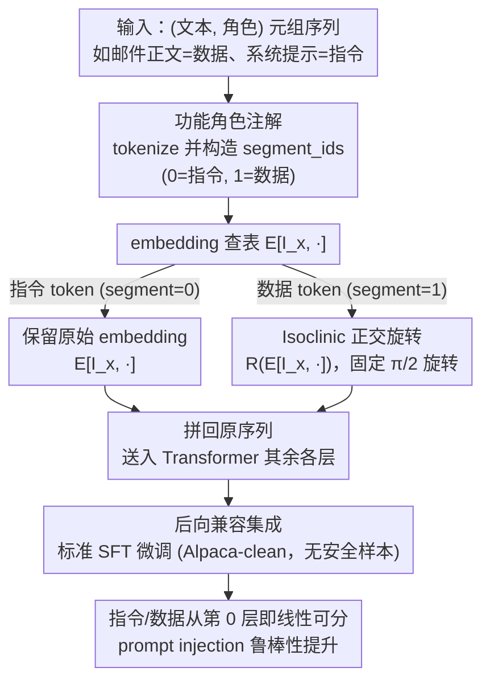

# ASIDE: Architectural Separation of Instructions and Data in Language Models

**会议**: ICLR 2026  
**arXiv**: [2503.10566](https://arxiv.org/abs/2503.10566)  
**代码**: 无  
**领域**: LLM评测  
**关键词**: instruction-data separation, prompt injection, orthogonal rotation, token embedding, architectural safety  

## 一句话总结
提出 ASIDE，一种在 token embedding 层面通过正交旋转区分指令和数据的架构级改造，仅需修改前向传播并在标准指令微调数据上训练，即可显著提升指令-数据分离度和 prompt injection 鲁棒性，无需任何安全专项训练。

## 研究背景与动机
**领域现状**：LLM 广泛集成在邮件客户端、Agent 流水线等软件系统中，这些场景天然存在指令（应执行）和数据（应处理、不执行）两类输入，但当前 LLM 架构对两者使用完全相同的 embedding，无法在模型内部区分。

**现有痛点**：缺少指令-数据分离是 prompt injection（间接注入、直接注入）攻击成功的根本原因。现有防御要么依赖 prompt engineering/特殊分隔符（易被绕过），要么依赖对抗训练（仅针对特定攻击模式），都不能从根本上解决问题。

**核心矛盾**：在传统 LLM 中，同一个 token 无论出现在指令还是数据中，其 embedding 完全相同——模型必须从上下文推断 token 的功能角色，这在深层网络中极难可靠实现。

**本文目标** 如何在不增加参数、不重新预训练的前提下，让模型从第一层就能区分指令和数据 token？

**切入角度**：token embedding 通常具有低秩结构，指令和数据可以共享同一个高维空间但驻留在不同的线性子空间中。正交旋转可以在不改变 embedding 范数和内积结构的情况下创建这种分离。

**核心 idea**：对数据 token 的 embedding 施加固定的 $\frac{\pi}{2}$ 正交旋转，让模型从第一层起就能通过 embedding 区分指令和数据。

## 方法详解

### 整体框架
ASIDE 想解决的是：传统 LLM 给指令 token 和数据 token 分配的 embedding 完全相同，模型只能靠上下文推断一个 token 该"执行"还是该"处理"，这正是 prompt injection 能得逞的根源。它的做法极轻——只动 embedding 层的前向传播，不增加任何参数。部署方先把输入拆成 $(\text{文本}, \text{角色})$ 的元组序列（如邮件服务把邮件正文标成"数据"、系统提示标成"指令"），tokenize 后得到与 `input_ids` 同形的 `segment_ids`（0=指令、1=数据）。前向传播按这个角色标注分流：一个 token $x$ 若是指令就用原始 embedding $E[I_x, \cdot]$，若是数据就改用旋转后的 $R(E[I_x, \cdot])$，其中 $R \in \mathbb{R}^{d \times d}$ 是一个固定的正交旋转矩阵。旋转过的数据 embedding 与未旋转的指令 embedding 拼回原序列、照常送进 Transformer 其余各层；最后只需在标准 SFT 数据（Alpaca-clean，不含任何安全样本）上微调，模型就学会从第一层起把两类 token 放进不同的子空间。

### 关键设计

**1. 功能角色注解：让区分指令/数据这件事不依赖模型自己猜**

ASIDE 要旋转哪些 token，靠的是部署时已知的角色标注，而不是模型推断。很多真实系统的角色信息本就是设计层面给定的——邮件正文永远是数据、系统提示永远是指令。具体实现上，输入被拆成 $(\text{文本}, \text{角色})$ 的元组序列，tokenize 后构造一个与 `input_ids` 同形的 `segment_ids` 张量（指令位置填 0、数据位置填 1），前向传播据此决定每个 token 走哪条路径。因为外部输入（被攻击者操控的部分）总是被标成"数据"，攻击者无法通过文本内容阻止旋转。代价是它要求应用场景能提供 token 级的角色标签，因此不适用于角色边界模糊、无法明确划分指令与数据的通用聊天场景。

**2. Isoclinic 正交旋转：用一个固定旋转把数据 token 推进正交子空间**

对被标为数据的 token，直接给它的 embedding 做几何旋转，而不是学一个偏移。具体是把 $d$ 维 embedding 按二维一组拆开，每组施加同一个 $\frac{\pi}{2}$ 旋转矩阵 $\begin{pmatrix} 0 & -1 \\ 1 & 0 \end{pmatrix}$（即 isoclinic 等角旋转），这是一个不可学习、不引入任何可训练参数的固定变换。$\theta=\frac{\pi}{2}$ 时还能免去构造完整旋转矩阵——因为 $\cos\frac{\pi}{2}=0$、$\sin\frac{\pi}{2}=1$，变换退化成对坐标对的交换取负 $(x_1, x_2, x_3, x_4, \ldots) \mapsto (-x_2, x_1, -x_4, x_3, \ldots)$，直接操作坐标即可。之所以选正交旋转，是因为它保持向量的范数和两两夹角不变（不丢信息），却把数据 embedding 整体搬到一个与指令完全正交的子空间里。这正是它强于 ISE（Wu et al., 2024）可学习偏移的地方：偏移只是在同一子空间里挪了个位置，随着层数加深会被模型逐渐"消化"掉、失去区分度；而正交旋转在几何上创造了永久的可分性，不会被网络抹平。

**3. 后向兼容的集成流程：在已预训练模型上零改造参数地接入**

整套方法可以挂到任何现成的预训练模型上，不需要从头预训练。流程只有两步：先在前向传播里加入"按 `segment_ids` 对数据 token 旋转 embedding"的逻辑，再在标准 SFT 数据（不含任何安全/对抗样本）上微调 3 个 epoch。因为旋转矩阵固定、不增加参数，这一步本质就是一次普通的指令微调——安全收益完全来自架构改动而非训练目标。

### 训练策略
全程标准 SFT，没有对抗训练、也没有安全专项目标函数。训练集为 Alpaca-clean-gpt4-turbo（51.8k 样本），学习率取 $[1 \times 10^{-6}, 2 \times 10^{-5}]$，batch size 64-256，warm-up ratio [0, 0.1]。

## 实验关键数据

### 主实验：指令-数据分离度 (SEP Score)

| 模型 | Vanilla | ISE | ASIDE | 提升 (vs Vanilla) |
|------|---------|-----|-------|-------------------|
| Llama 2 7B | ~55% | ~52% | ~67% | +12.3 pp |
| Llama 3.1 8B | ~50% | ~53% | ~70% | +20 pp |
| Qwen 2.5 7B | ~57% | ~57% | ~75% | +18 pp |
| Qwen 3 8B | ~31% | ~20% | ~65% | +34 pp |
| Mistral 7B | ~28% | ~50% | ~72% | +44.1 pp |

ASIDE 的 utility（AlpacaEval、SEP Utility）与 Vanilla 基本持平。

### Prompt Injection 鲁棒性 (ASR↓)

| 模型 | 攻击类型 | Vanilla | ASIDE | 降低 |
|------|---------|---------|-------|------|
| Llama 3.1 8B | BIPIA-text | 13.6% | 4.1% | -9.5 pp |
| Llama 3.1 8B | BIPIA-code | 22.8% | 9.2% | -13.6 pp |
| Llama 3.1 8B | StruQ-ID | 43.3% | 41.3% | -2.0 pp |
| Qwen 2.5 7B | BIPIA-text | 18.3% | 14.5% | -3.8 pp |
| Qwen 3 8B | BIPIA-text | 10.2% | 2.8% | -7.4 pp |
| Qwen 3 8B | StruQ-ID | 47.0% | 8.1% | -38.9 pp |
| Mistral 7B | BIPIA-text | 11.1% | 0.5% | -10.6 pp |
| Mistral 7B | StruQ-ID | 33.4% | 9.6% | -23.8 pp |

### 关键发现
- ASIDE 在所有模型上一致提升 SEP score（12-44 pp），同时保持 utility 基本不变。
- 间接 prompt injection 的 ASR 平均降低约 10-40 pp，效果在 Mistral 和 Qwen3 上尤为显著。
- ISE 方法在多数模型上与 Vanilla 无统计显著差异甚至更差，说明可学习偏移向量不足以维持深层的分离。
- 线性探测分析显示 ASIDE 从第 0 层（embedding 后）就达到 100% 线性可分性，而 Vanilla 需到 5-10 层才逐渐可分。
- 概念激活分析显示 ASIDE 有效抑制了数据区域中"指令概念"的虚假激活。

## 亮点与洞察
- **用架构解决安全问题**：类比计算机安全中数据执行保护（DEP），从架构层面区分可执行和不可执行内存。ASIDE 是首个将这一思想成功引入 LLM 的工作。
- **零成本安全收益**：不需要对抗训练、不需要安全数据集、不增加参数，仅靠一个固定旋转 + 标准 SFT 就获得显著的安全提升，这一结论非常有力。
- **旋转 vs 偏移的设计洞察**：ISE 用可学习偏移在 embedding 空间创建区分，但偏移随层加深会被模型"消化"；正交旋转在几何上更持久，因为它创造了正交子空间而非仅有偏移的同一子空间。

## 局限与展望
- 需要部署时知道每个 token 的功能角色（指令 vs 数据），限制了适用场景——通用聊天助手中用户输入既是"指令"也可能包含"数据"，角色边界模糊。
- 未在安全微调的 Instruct 模型上实验（有意为之，但实际部署会用 Instruct 模型），ASIDE + safety tuning 的叠加效果未知。
- StruQ-OOD 攻击上改善有限，说明 OOD 注入仍是挑战。
- 固定的 $\frac{\pi}{2}$ 旋转是否最优？论文未探索其他旋转角度或可学习旋转的效果。

## 相关工作与启发
- **vs ISE (Wu et al., 2024)**：ISE 用可学习偏移向量区分角色，但在深层失去分离效果，在安全指标上基本等同 Vanilla 甚至更差。ASIDE 用正交旋转实现更持久的分离。
- **vs Prompt Engineering**：分隔符/特殊 token 本质上是在输入层面做分离，容易被攻击者伪造；ASIDE 在 embedding 层面做分离，攻击者无法通过文本操控旋转。
- **vs 对抗训练**：对抗训练是"看过什么攻击就防什么"，ASIDE 提供一种攻击无关的结构性防御。
- 该方法可以直接迁移到多层级指令体系（如 system > user > tool），只需定义更多正交变换。

## 评分
- 新颖性: ⭐⭐⭐⭐⭐ 首次从架构层面实现指令-数据分离，理念清晰优雅
- 实验充分度: ⭐⭐⭐⭐ 6 个模型 × 8 个安全基准 + 分离度评估 + 可解释性分析，但未测试 Instruct 模型
- 写作质量: ⭐⭐⭐⭐⭐ 动机来自计算机安全的经典原则，行文流畅，逻辑严密
- 价值: ⭐⭐⭐⭐⭐ 提供了一条全新的安全增强路径，实用且理论基础扎实

<!-- RELATED:START -->

## 相关论文

- [\[AAAI 2026\] ConInstruct: Evaluating Large Language Models on Conflict Detection and Resolution in Instructions](../../AAAI2026/llm_evaluation/coninstruct_evaluating_large_language_models_on_conflict_detection_and_resolutio.md)
- [\[ICLR 2026\] Prompt and Parameter Co-Optimization for Large Language Models](prompt_and_parameter_co-optimization_for_large_language_models.md)
- [\[ICLR 2026\] Inverse IFEval: Can LLMs Unlearn Stubborn Training Conventions to Follow Real Instructions?](inverse_ifeval_can_llms_unlearn_stubborn_training_conventions_to_follow_real_ins.md)
- [\[ICLR 2026\] DAComp: Benchmarking Data Agents across the Full Data Intelligence Lifecycle](dacomp_benchmarking_data_agents_across_the_full_data_intelligence_lifecycle.md)
- [\[ICLR 2026\] Evaluating Language Models' Evaluations of Games](evaluating_language_models_evaluations_of_games.md)

<!-- RELATED:END -->
