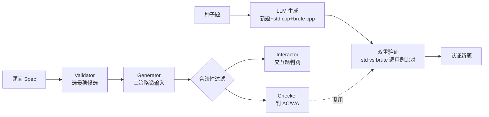

# AutoCode: LLMs as Problem Setters for Competitive Programming

**会议**: ICLR 2026  
**OpenReview**: [https://openreview.net/forum?id=F96nsbbhXC](https://openreview.net/forum?id=F96nsbbhXC)  
**代码**: 待确认  
**领域**: LLM 评估 / 代码智能  
**关键词**: 竞赛编程, 测试用例生成, 问题生成, RLVR 验证器, 一致性评估  

## 一句话总结
AutoCode 用「Validator-Generator-Checker(-Interactor)」闭环多角色框架，让 LLM 既能为已有竞赛题生成接近官方判罚 99% 一致性的测试数据，又能从种子题出发、通过「参考解 vs 暴力解」双重验证自动生成被 Grandmaster 认可为比赛级别的新题。

## 研究背景与动机
- **领域现状**：LLM 代码能力突飞猛进，但「解题」评测越来越不可靠——顶级平台(Codeforces/AtCoder)的官方测试数据不公开，研究者只能依赖 CodeContests+、TACO、HardTests 等合成数据集来判定一份提交是否正确。
- **现有痛点**：这些合成测试集同时存在高假阳性率(FPR，错误/超时的解被误判为通过)和高假阴性率(FNR，正确解因非法输入崩溃而被误拒)。论文测得现有方法一致性只有 72–81%，且 FNR 往往比 FPR 更高——一个正确而有创意的解会因为测试输入本身非法而被冤枉。
- **核心矛盾**：「出题」其实比「解题」更难——出题要设定约束、输入分布、边界用例来堵死捷径，要针对特定算法卡复杂度,要覆盖整个解空间。而当前评测把劣质测试数据当成 ground truth，既奖励了走捷径的模型(高 FPR),又惩罚了合法推理(高 FNR)，污染了 RLVR 的奖励信号。
- **本文目标**：构造一套无需人工、端到端的竞赛题创作与评测流水线，既要做高保真验证器(降 FPR/FNR)，又要能自动产出新颖且正确的比赛级题目。
- **核心 idea**：**把「LLM 出题能力」当作衡量通用智能的试金石**——并用多角色闭环 + 双重交叉验证，把出题的每一个环节(造数据、验合法性、判对错、防 hack)都拆给专门的 LLM 程序去做并互相校验。

## 方法详解

### 整体框架
AutoCode 分两层：底层是**测试数据生成**(为已有题目造高质量测试集)，上层是**新题生成**(复用底层验证能力 + 双重验证产出原创题)。底层由四个角色程序串成闭环——Validator 守住输入合法性、Generator 造对抗性输入、Checker 判最终对错、Interactor 处理交互题；每个角色都让 LLM 生成多个候选再用针对性测试选出最稳的一个。

### 关键设计

**1. Validator：靠「近似非法」样本选出最严格的合法性守门员。** 整个系统的基石是 Validator，它负责拒绝一切违反题目约束的输入，从而把 FNR 压到最低(正确程序不会再因为脏数据崩溃)。构造时先让 LLM 生成 40 个评测样本——其中 10 个合法、30 个「near-valid」(几乎合法但有微妙违规，如范围差一、漏判排列性质)；再让 LLM 产出 3 个候选 Validator 程序，每个在这 40 个样本上打分 $\text{score}(V)=\sum_{(x,\text{label})\in E}[V(x)=\text{label}]$，取分类最准的那个 $V^\star$。用「近似非法」样本而非随机非法样本，是为了逼出真正能抠住边界条件的 Validator。

**2. Generator：三路对抗策略专打不同失败模式以压低 FPR。** 有了可靠 Validator 兜底，Generator 的目标转为最大化覆盖、揪出错误或低效的解。它并行跑三类策略：**Exhaustive** 对小约束题穷举所有小规模排列组合，覆盖边界;**Random/Extreme** 造大规模随机与极端输入,专打整数溢出、浮点精度、数组越界,并按比赛经验设计专门 hack 贪心或制造哈希碰撞的对抗用例;**TLE-Inducing** 构造特定结构的最坏输入逼出超时,确保只有满足目标复杂度的解才能通过。三路产物经 $V^\star$ 过滤非法输入、按签名去重、做难度/规模分桶平衡后采样成最终测试集 $T$。

**3. Interactor：用「变异体」做交互题的自动判别器。** 交互题(程序与判题机多轮对话)此前无人能自动出数据(连 CodeContests+ 都没解决)。AutoCode 让 LLM 对参考解做一批小而关键的逻辑改动(如 `<`/`≤` 互换、off-by-one、漏掉检查、错误的 tie-break)生成一组**变异体** $M$，作为难缠的"假解";再让 LLM 产 3 个候选 Interactor，按字典序打分 $\text{score}(I)=(p, f)$——先保证放行真参考解($p$)、再最大化拒绝变异体的数量($f=\sum_{m\in M}[\text{SIMULATE}(I,m)=\text{Rejected}]$)。能放过正解又卡死最多变异体的 Interactor 胜出，证明它真的在考查题目要求的逻辑。

**4. 双重验证的新题生成：std.cpp 与 brute.cpp 互证一致才认证。** 上层出题受 8 位人类出题专家启发——他们都承认是在某道既有题上「加/删/改条件」造新题。AutoCode 随机选一道难度 <2200 的 Codeforces 题作种子，让 LLM 加删改条件生成新题面、一份高效参考解 `std.cpp` 和一份慢但几乎不会错的暴力解 `brute.cpp`。用底层框架造出全覆盖小数据的测试集，让两份解都跑一遍：只有当每个测试用例上(暴力解可合法超时)两者输出都被 Checker 判为一致，题目才被认证。这套「brute.cpp 当初始 ground truth + 参考解再过一轮完整测试生成」的协议筛掉了 27% 易错题，把 LLM 参考解的正确率从 86% 提到 94%。

## 实验关键数据

### 主实验表格(7538 题大规模基准，195,988 份人类提交，o3 驱动)

| 方法 | 一致性(%)↑ | FPR(%)↓ | FNR(%)↓ |
|---|---|---|---|
| CodeContests | 72.9 | 7.7 | 46.3 |
| CodeContests+ | 79.9 | 8.6 | 31.6 |
| TACO | 80.7 | 11.5 | 26.9 |
| HardTests | 81.0 | 12.1 | 25.8 |
| **AutoCode (Ours)** | **91.1** | **3.7** | **14.1** |

一致性较最强基线提升约 10 个点，FPR 与 FNR 双双约降 50%。在更难的 720 题未过滤 Codeforces 基准(含交互题)上一致性达 **98.7%**，而旧方法因代码不公开根本无法评测。

### 消融实验表格(720 题基准，GPT-5-High，每题 33 份提交)

| 配置 | 一致性(%)↑ | FPR(%)↓ | FNR(%)↓ |
|---|---|---|---|
| w/o Generator 策略1(穷举) | 98.4 | 1.7 | 1.3 |
| w/o Generator 策略2(随机/极端) | 98.4 | 1.6 | 1.3 |
| w/o Generator 策略3(TLE) | 98.6 | 1.4 | 1.3 |
| w/o Prompt 优化 | 98.0 | 1.8 | 2.9 |
| **完整框架** | **98.7** | **1.3** | **1.2** |

Prompt 优化最关键(去掉后 FNR 翻倍到 2.9%);三路 Generator 策略互补,去任一路都会抬高 FPR;Validator/Checker 的候选选择测试对压低 FNR 也不可或缺。

### 关键发现
- **Finding 1**：约 4.2% 的题目 LLM 能出却自己解不出——这类「可解但作者解不了」的题是模型自我提升的潜在素材。
- **Finding 2**：LLM 倾向于把已有算法知识/技巧拼接、嵌入到既有题框架里(重组式创新),而非提出需要原创解法的全新问题模型;它对"新颖"的定义偏向知识重组,人类则偏向推理范式的原创。
- **Finding 3**：改编后题目平均难 334 Elo,被判"新颖"的平均增 498、非新颖仅增 108;种子题中等偏难时产出质量最高;约 5% 落在 pass@1 ∈ [0.1, 0.5] 的临界区,是构造自博弈数据集的金矿。
- 人工分级:91.6% 通过可解性检查,76.3% 解正确,61.6% 达模型训练可用级,17.4% 含新颖设计,3.2% 达 ICPC/IOI 比赛级别。

## 亮点与洞察
- **视角创新**：把「出题」而非「解题」作为衡量 LLM 通用智能的指标,理由扎实——出题要求覆盖整个解空间和捷径,涵盖了解题的全部挑战且更多。
- **直击 RLVR 痛点**：明确把目标对准做 RLVR 的高保真验证器,指出脏测试数据会同时奖励捷径(高 FPR)和惩罚合法推理(高 FNR),污染强化学习信号——这对正在用代码任务做 RL 的研究者极有现实意义。
- **首次自动化交互题数据生成**：变异体判别思路优雅,把"判题器够不够严"转化为"能否区分正解与微调变异体"的可度量目标。
- **双重验证用暴力解兜底**:用慢而可靠的 brute.cpp 充当 ground truth,巧妙绕过了"没有官方答案就无法验证"的死结。

## 局限与展望
- **依赖强模型**:主结果用 o3、消融用 GPT-5-High,弱模型下框架收益(尤其候选选择)能补多少差距还需更系统地考察。
- **新颖性偏重组**:Finding 2 自承 LLM 出题以知识重组为主,难产出需要全新解法范式的题,离人类顶尖出题人仍有"创造性"鸿沟。
- **种子题依赖**:出题强依赖随机种子题且需难度适中,过易/过难种子都难产出高质量题,自动选种子的策略还有优化空间。
- **评测仍需人工分级**:Level 3–6 的精细质量判定依赖 8 位专家打分,大规模可扩展的自动质量评估尚未解决。
- 展望:把"可解但作者解不出"的题与临界 pass@1 题用于自博弈/自我提升训练,是很有前景的下一步。

## 相关工作与启发
- **测试增强/生成**:相比仅增广已有单测(EvalPlus 思路)或规则/LLM 驱动造对抗用例(HardTests、CodeContests+ 等),AutoCode 提供的是端到端、含交互题的完整测试流水线。
- **解题/数据中心方法**:AlphaCode、AceReason、Absolute Zero、rStar-Coder 等靠 RL/自博弈扩大解搜索或自建语料,但聚焦"解"与"数据策展";AutoCode 反过来统一了"出题+验证"三条线,同时治理静态基准污染与欠约束测试两大顽疾。
- **启发**:对任何做代码 RLVR 的工作,本文是一个强提醒——奖励信号的质量上限由测试数据的 FPR/FNR 决定,与其堆解题数据,不如先把验证器做对;"出题难于解题"的论断也为后续以生成式任务评估通用智能提供了范式。

## 评分
- **新颖性**: ⭐⭐⭐⭐⭐ 把出题作为智能试金石的视角 + 多角色闭环 + 变异体交互判别 + 双重验证出题,组合新颖且立意高。
- **实验充分度**: ⭐⭐⭐⭐ 7538 题大规模基准 + 720 题难基准 + 完整消融 + 人类专家分级,覆盖全面;弱模型与更大规模新题人工评估略欠。
- **写作质量**: ⭐⭐⭐⭐ 动机层层递进、算法伪代码清晰、图表到位;部分发现的统计细节可更系统。
- **价值**: ⭐⭐⭐⭐⭐ 直接修复竞赛编程评测的可靠性根基,对 RLVR、基准建设、模型自我提升都有立竿见影的实用价值。

<!-- RELATED:START -->

## 相关论文

- [\[ACL 2025\] ELABORATION: A Comprehensive Benchmark on Human-LLM Competitive Programming](../../ACL2025/llm_evaluation/elaboration_competitive_programming.md)
- [\[ICLR 2026\] How Many Code and Test Cases Are Enough? Evaluating Test Cases Generation from a Binary-Matrix Perspective](how_many_code_and_test_cases_are_enough_evaluating_test_cases_generation_from_a_.md)
- [\[ICLR 2026\] Preference Leakage: A Contamination Problem in LLM-as-a-judge](preference_leakage_a_contamination_problem_in_llm-as-a-judge.md)
- [\[ICLR 2026\] Benchmarking Overton Pluralism in LLMs](benchmarking_overton_pluralism_in_llms.md)
- [\[ICLR 2026\] LLMs Get Lost In Multi-Turn Conversation](llms_get_lost_in_multi-turn_conversation.md)

<!-- RELATED:END -->
