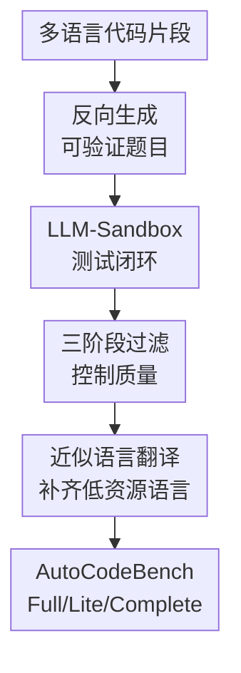

# AutoCodeBench: Large Language Models are Automatic Code Benchmark Generators

**会议**: ICLR2026  
**OpenReview**: [https://openreview.net/forum?id=fN0MED2Idq](https://openreview.net/forum?id=fN0MED2Idq)  
**论文**: [https://autocodebench.github.io/](https://autocodebench.github.io/)  
**代码**: 项目页待公开  
**领域**: LLM评测 / 代码生成基准 / 多语言代码评测  
**关键词**: 自动基准生成, 代码生成评测, 多语言代码, LLM-Sandbox交互, AutoCodeBench  

## 一句话总结
AutoCodeBench 用 AutoCodeGen 自动合成高难度、多语言、可执行验证的代码生成题目，把 LLM 生成测试输入、沙箱执行得到测试输出、反向生成题面和多阶段过滤串成一条流水线，并由此构建出覆盖 20 种编程语言、3,920 道题的代码生成评测集，实验显示当前最强模型平均 Pass@1 仍不超过 55.4%。

## 研究背景与动机
**领域现状**：代码生成已经成为衡量大模型实用能力的核心任务之一。HumanEval、MBPP 这类早期基准证明了“用单元测试评价代码”的范式很有效，LiveCodeBench、FullStackBench、McEval 等后续工作进一步把评测推向竞赛题、真实工程片段和多语言场景。

**现有痛点**：问题在于，高质量代码基准很难靠人工持续扩张。人工标注者通常更熟悉 Python 和常见算法题，对 Elixir、Racket、Shell、Kotlin 等低资源或小众语言的覆盖不足；同时，人工写题和写测试很慢，题目难度也容易跟不上模型迭代速度。论文里的对比表显示，AutoCodeBench 之前的多语言基准要么语言覆盖不均衡，要么任务类别和难度不足。

**核心矛盾**：代码基准既要可执行、可验证、测试正确，又要覆盖足够多语言、足够多场景和足够高难度。人工流程更容易保证局部质量，却难以规模化和均衡覆盖；纯 LLM 生成虽然可规模化，但如果直接让模型同时生成题面、答案和测试输出，又容易出现测试答案错误、题面漏掉入口函数、样例和私测不一致等问题。

**本文目标**：作者想解决三个具体子问题：第一，如何在无人工标注的前提下生成可执行且测试正确的代码题；第二，如何让生成题目覆盖 20 种语言，并在语言分布和任务类别上尽量均衡；第三，如何证明这些自动生成题确实能区分当前大模型，尤其是多逻辑任务和低资源语言上的短板。

**切入角度**：论文的关键观察是，LLM 直接“编造测试输出”不可靠，但让 LLM 先写测试输入，再交给沙箱执行得到真实输出，就能把最容易出错的输出计算交给确定性执行环境。再反过来用“代码解法 + 测试函数”生成题面，比先写题面再补测试更容易保证入口名、参数格式、样例和私测一致。

**核心 idea**：用 LLM-Sandbox 交互替代人工写题，把“生成解法和测试输入 → 沙箱求输出 → 合成测试函数 → 反向生成题面 → 难度/质量/多样性过滤”做成自动流水线，从而扩展出一个高难度、多语言、可验证的代码生成基准。

## 方法详解

### 整体框架
AutoCodeGen 的输入不是人工题目，而是来自 Stack-Edu 的多语言代码片段；输出则是完整的代码生成样本，即题面、参考解法、公开测试函数和私有测试函数。它先把真实代码片段改造成自包含解法和测试输入函数，再用多语言沙箱执行得到测试输出，随后让 LLM 把输入输出整合成断言式测试函数，并根据解法和测试函数反向生成题面，最后通过难度、质量和多样性三层过滤形成 AutoCodeBench。

这张图里前四个贡献节点对应论文的方法核心：反向生成解决“先有题却难配测试”的一致性问题；LLM-Sandbox 测试闭环解决测试输出可靠性；三阶段过滤控制难度、质量和分布；近似语言翻译用于低资源语言扩展。最终基于同一流水线，作者还生成 AutoCodeInstruct，用来做多语言代码训练和强化学习验证。

### 关键设计
**1. 反向生成可验证题目：先让测试和解法站稳，再写题面**

传统写代码题通常是“先有题面，再写解法和测试”。AutoCodeGen 反过来做：先从 Stack-Edu 里的教育代码片段出发，让 DeepSeek-V3-0324 用语言相关 few-shot prompt 把片段改写成自包含、可执行、可验证的代码解法，同时去掉绘图、文件 I/O、外部系统依赖等非核心逻辑。这样得到的不是抽象题意，而是一段能被沙箱运行的确定性程序。

这个顺序的好处是，题面不再凭空生成，而是由“解法 + 测试函数”约束出来。论文特别提到，LLM 生成题面时容易漏掉入口函数、类名、输入输出格式等关键信息，所以作者在题面生成阶段明确要求写出函数/类名、输入输出格式、约束和公开示例。换句话说，题面是对已经可执行的测试协议的自然语言包装，而不是测试再去追随一个含糊的自然语言描述。

**2. LLM-Sandbox测试闭环：让模型生成输入，让执行环境生成输出**

AutoCodeGen 没有让 LLM 直接写完整测试断言，而是拆成三步：先让 LLM 生成公开测试输入和私有测试输入；然后把代码解法和测试输入函数拼接起来，在多语言沙箱里执行，拿到真实输出；最后再把测试输入和沙箱输出交给 LLM，合成为完整测试函数。公开测试通常不超过 3 个基础样例，用来嵌入题面；私有测试至少 7 个样例，包含边界和异常情况，用来真正判分。

这个闭环抓住了代码评测里最脆弱的一环：高难度任务的输出经常不是人或 LLM 一眼能算对的。把输出计算交给 sandbox，相当于把正确性锚定到可执行参考解法上。最终每条样本可以表示为 `<programming problem, code solution, public test function, private test function>`，并且解法和测试函数还会再被沙箱联合执行验证一遍，减少“题面说 A、测试测 B”的错配。

**3. 三阶段过滤控制质量：难度、对齐和多样性各自负责一层**

自动生成的问题会有两个相反风险：太简单没有评测价值，太乱又变成噪声。论文用三阶段过滤来拆开处理。难度过滤阶段用 DeepSeek-Coder-V2-Lite 对每道题采样 10 次并执行验证，如果 10 次全过，就认为题太容易而丢弃；以 Python 为例，这一步过滤掉了 25.1% 的问题。质量过滤阶段用 DeepSeek-R1-0528 作为 critic，检查题面和测试函数是否完全对齐，尤其是函数名、类名、变量、返回类型、随机性、精度、异常吞掉和无关需求等问题。多样性过滤阶段先让 DeepSeek-V3-0324 给题目打任务类别标签，再按类别池循环采样，避免最后的数据集被少数常见算法题占满。

这个设计的关键不是“多用几个模型投票”这么简单，而是让每一层过滤承担不同职责。难度层只关心当前中等模型是否已经轻松解决；质量层关心测试是否真的在测题面要求；多样性层关心任务分布是否覆盖字符串处理、数据结构、面向对象、系统编程、网络、Web、并发、数据库等实际场景。这样生成流程才不会只产出一堆形式正确但分布单一的题。

**4. 近似语言翻译补齐低资源语言：用可验证翻译换语言均衡**

对于 Python、C++、Shell、Java、JavaScript 和 Go，作者直接运行完整 AutoCodeGen 流水线；但对另外 14 种低资源或数据较少的语言，直接从原生片段生成会受限于数据稀缺和多样性不足。论文因此采用 approximate language translation：从已生成但未使用的数据里抽取样本，再按预设语言对翻译到目标语言，例如 Python 到 R/Ruby/Elixir/Julia/Racket/Swift，Java 到 Scala/C#/Kotlin/Dart，JavaScript 到 PHP/TypeScript，C++ 到 Rust，Shell 到 Perl。

这一步不是简单机器翻译题面，而是要同时翻译题面、参考解法和测试函数，并继续经过数据过滤。它的作用是让 AutoCodeBench 在 20 种语言上保持相对均衡：ACB-Full 共 3,920 道题，20 种语言每种大约 184 到 200 道；ACB-Complete 进一步固定为每种语言 50 道。对一个多语言代码评测来说，这比“热门语言很多、小众语言零星几道”的基准更能暴露模型在语言生态上的偏差。

### 一个完整示例
可以把 Figure 1 里的 `two_sum` 看成最小版流程。第一步，LLM 根据代码片段生成一个自包含函数 `two_sum(a, b)`，同时生成公开测试输入函数，例如输入 `[1, 2]`，以及更全面的私有测试输入函数。第二步，系统把 `two_sum` 和输入函数拼到一起，在沙箱里执行，得到公开输出 `3` 和私有测试输出。第三步，LLM 不再凭空猜答案，而是把“输入 `[1, 2]`”和“沙箱输出 `3`”组合成断言 `two_sum(a=1, b=2) == 3`。

接着，题面生成器看到解法、测试入口和公开样例后，写出“给定两个整数，返回它们的和”这样的题目，并明确函数签名、输入范围和输出格式。真实 AutoCodeBench 里的题当然比 `two_sum` 复杂得多，很多还包含多个函数、多个类或跨模块逻辑，但这个例子说明了论文的核心顺序：测试输入先落地，输出由执行产生，题面再围绕已经验证过的协议生成。

### 损失函数 / 训练策略
AutoCodeBench 本身是评测集，不涉及传统监督损失函数；但论文用同一流水线构建了 AutoCodeInstruct，并用它验证训练价值。AutoCodeInstruct 包含约 37K 道可验证多语言训练题，作者先用 MinHash 和 LLM-as-Judge 做两阶段去重，再按模型采样通过率过滤掉过易和过难样本。

训练上，作者对 Qwen2.5-Coder-7B/32B-Instruct 做两阶段 GRPO。第一阶段只用 `0 < pass rate < 0.6` 的 solve-partial 样本，rollout size 为 8，让模型先巩固已有可解能力；第二阶段加入 pass rate 为 0 的 solve-none 样本，并把 rollout size 提到 16，推动模型探索更难题。附录给出的配置包括学习率 $1\times10^{-6}$、最大输入/输出长度 8192/8192；SFT 阶段则用 DeepSeek-V3-0324 蒸馏出的正确解法，学习率为 $1\times10^{-5}$，训练 2 个 epoch。

## 实验关键数据

### 主实验
AutoCodeBench 的主实验覆盖 40 多个闭源和开源模型，默认指标是 Pass@1。ACB-Full 一共 3,920 道题、37,777 个测试用例、20 种语言，平均题面长度 498.2，参考解法长度 487.5，难度分布为 646 easy / 846 medium / 2,428 hard。作者还构建了 1,586 道题的 ACB-Lite 和 1,000 道题的 ACB-Complete，分别用于更快评测和 base model completion 评测。

| 基准版本 | 题目数 | 测试用例数 | 语言数 | 平均题长 | 平均解法长 | 难度分布 E/M/H |
|----------|--------|------------|--------|----------|------------|----------------|
| ACB-Full | 3,920 | 37,777 | 20 | 498.2 | 487.5 | 646 / 846 / 2,428 |
| ACB-Lite | 1,586 | 15,341 | 20 | 517.2 | 469.3 | 263 / 421 / 902 |
| ACB-Complete | 1,000 | 9,608 | 20 | 505.2 | 461.2 | 169 / 265 / 566 |

在 ACB-Full 上，没有任何单模型超过 55.5 的平均分。Claude Opus 4.1 reasoning 模式最高，为 55.4；GPT-5 为 53.5；Claude Opus 4.1 非 reasoning 约 52.6；Claude Sonnet 4 reasoning 为 51.1；DeepSeek-V3.1 reasoning 为 48.2；Qwen3-235B-A22B-Thinking 为 47.7。所有模型正确题目的并集形成的 current upper bound 达到 75.3，说明不同模型之间有明显互补，但单个模型仍远未覆盖这些多语言复杂题。

| 模型 / 上界 | ACB-Full Pass@1 | 典型含义 |
|-------------|-----------------|----------|
| Current Upper Bound | 75.3 | 所有模型正确题并集，显示仍有可解空间 |
| Claude Opus 4.1 (Reasoning) | 55.4 | 单模型最高，但离上界差距大 |
| GPT-5 | 53.5 | 闭源强模型仍不到 55 |
| Claude Opus 4.1 | 52.6 | 非 reasoning 模式略低 |
| DeepSeek-V3.1 (Thinking) | 48.2 | 生成流程使用 DeepSeek 系模型但未明显垄断榜首 |
| Qwen3-235B-A22B-Thinking | 47.7 | 大开源模型仍有明显差距 |

### 消融实验
论文没有做传统“去掉某模块重训”的消融，但有几组非常像方法诊断的分析：人工验证、生成阶段偏差分析、多逻辑题分析、沙箱反馈、多语言训练效果。人工验证抽查 Python、C++、Java、JavaScript、Go、Shell 六种语言，平均 problem accuracy 为 87.6%；即便考虑噪声，Claude Opus 4 reasoning 在这六种语言上的得分也只有 44.6，与人工准确率差距为 43.0，说明低分不能简单归因于数据坏。

| 分析项 | 关键数字 | 说明 |
|--------|----------|------|
| 人工验证准确率 | 87.6% | 六种语言抽查后，测试函数与题面整体对齐率较高 |
| Claude Opus 4 在人工验证语言上的表现 | 44.6% | 与准确率差 43.0，剩余提升空间很大 |
| 多逻辑题数量 | 1,622 / 3,920 | 约 41.4% 题目要求多个逻辑单元协作 |
| MLPP 平均逻辑单元 | 3.37 | 多逻辑题不是简单单函数变体 |
| 低质量失败任务占比 | 13.7% | Opus 4.1 失败样本中，问题/测试设计错误占 538 道 |
| 去除低质量后 Opus 4.1 | 64.3% | 噪声剔除后仍不容易 |

AutoCodeInstruct 的训练实验也能反映数据质量。Qwen2.5-Coder-7B-Instruct 在 ACB-Full 上从 22.5 提升到 25.0、27.4，SFT 后到 28.9；Qwen2.5-Coder-32B-Instruct 从 35.8 提升到 38.3、41.6，SFT 后到 41.9。更重要的是，FullStackBench 和 McEval 也同步提升，说明这批自动生成数据不只是过拟合自家评测。

| 模型与训练 | ACB-Full | ACB-Lite | LiveCodeBench-V6 | FullStackBench | McEval |
|------------|----------|----------|------------------|----------------|--------|
| Qwen2.5-Coder-7B-Instruct | 22.5 | 21.5 | 18.3 | 41.1 | 57.2 |
| + first-stage GRPO | 25.0 | 24.8 | 18.3 | 46.9 | 58.6 |
| + second-stage GRPO | 27.4 | 27.6 | 17.1 | 47.7 | 58.4 |
| + SFT | 28.9 | 29.0 | 17.7 | 47.7 | 63.1 |
| Qwen2.5-Coder-32B-Instruct | 35.8 | 37.4 | 24.0 | 57.1 | 64.5 |
| + first-stage GRPO | 38.3 | 39.5 | 25.1 | 58.3 | 65.4 |
| + second-stage GRPO | 41.6 | 45.3 | 28.0 | 59.7 | 66.1 |
| + SFT | 41.9 | 46.2 | 30.3 | 58.7 | 69.5 |

### 关键发现
- AutoCodeBench 的难度确实高：ACB-Full 上最强单模型只有 55.4，current upper bound 却有 75.3，说明任务不是整体不可解，而是不同模型各有盲区。
- 低资源语言的表现差异更大。论文选取 5 个水平接近的模型比较热门语言和低资源语言，热门语言平均差距约 $\Delta=3.1$，低资源语言扩大到 $\Delta=6.3$，说明多语言能力不是简单由平均代码能力决定。
- 多逻辑问题明显更难。1,622 道 MLPP 平均题长 576.4、解法长 610.0，hard 题 1,069 道；多个强模型在 multi-logic 子集上都有 3 到 6 个点左右的掉分，例如 Qwen3-235B-A22B-Thinking 下降 6.3。
- 沙箱反馈有实际价值。Qwen2.5-Coder-32B-Instruct 经过三轮 refinement 从 35.8 提升到 47.4，Qwen3-8B 从 23.3 提升到 30.2，而且最大收益出现在第一轮，符合“执行错误能修正常见 bug，但越往后越难”的直觉。
- 自动生成仍有噪声。人工验证和错误分析都承认问题描述不完整、测试不合理等错误存在，但这些噪声不足以解释模型整体低分；去掉低质量失败样本后 Opus 4.1 仍只有 64.3。

## 亮点与洞察
- **把输出正确性交给沙箱，而不是交给 LLM**。这看似是工程细节，实际上是自动代码基准生成的核心可靠性来源；LLM 擅长构造输入和自然语言包装，但复杂输出最好由程序执行产生。
- **反向生成题面很聪明**。很多代码题的问题不是测试本身错，而是题面漏掉测试隐含的函数名、返回格式或边界约定；先固定测试协议再生成题面，能把自然语言描述限制在可执行事实周围。
- **多语言均衡比语言数量更重要**。McEval 有 40 种语言，但类别覆盖不够均衡；FullStackBench 更真实，但语言分布不平衡。AutoCodeBench 的价值在于同时追求 20 种语言、14 类任务和大致均衡的题量。
- **多逻辑题是代码 agent 的前置压力测试**。真实工程任务很少只写一个孤立函数，往往要多个类、函数、解析器和状态转换一起工作；AutoCodeBench 用 MLPP 把这一点拉进 atomic-level code generation 评测。
- **同一流水线能服务评测和训练**。AutoCodeBench 是评测集，AutoCodeInstruct 是训练集，二者共享生成逻辑但通过去重和过滤隔离；这说明自动基准生成不只是出 leaderboard，也可以反哺模型训练。

## 局限与展望
- 自动流程仍无法完全保证题面内在质量。沙箱能保证参考解法和测试输出一致，但不能保证题面没有遗漏、测试覆盖完整、自然语言约束没有歧义；论文自己的人工验证和错误分析也显示，问题描述不完整是常见噪声来源。
- 生成流程可能带有 DeepSeek 系模型偏差。作者用 DeepSeek-V3-0324 生成、DeepSeek-R1-0528 做 critic，同时用 DeepSeek-Coder-V2-Lite 做简单题过滤来形成一定“推拉”，但模型家族偏置很难彻底消除。
- 近似语言翻译可能引入“伪低资源”问题。低资源语言题目如果大量从 Python/Java/JS 翻译而来，可能覆盖语法和库生态，却未必完全代表这些语言原生开发者常写的任务风格。
- 当前仍主要是函数级或原子级代码生成。论文也承认，repo-level 评测和 SWE-Bench / Terminal-Bench 式状态环境更接近真实软件工程；AutoCodeGen 未来需要扩展到多文件、依赖管理、命令行状态和长期交互环境。
- 评测集公开后仍会面临污染。自动生成可以降低人工成本，但一旦基准广泛使用，模型训练数据污染仍会出现，需要持续生成新版本或引入时间切分、私有测试池等机制。

## 相关工作与启发
- **vs HumanEval / MBPP**: 这些早期基准开创了单元测试式代码评测，但规模小、语言集中在 Python、题目偏短且容易被污染；AutoCodeBench 更强调多语言、难度和自动生成。
- **vs LiveCodeBench**: LiveCodeBench 更关注时间切分和竞赛式新题，能缓解污染问题；AutoCodeBench 则把重点放在自动合成、语言均衡和多逻辑任务，两者可以互补。
- **vs FullStackBench**: FullStackBench 更贴近真实 full-stack 场景，但语言分布不均衡；AutoCodeBench 的原子级任务更轻量，同时在 20 种语言上刻意保持均衡覆盖。
- **vs McEval**: McEval 覆盖 40 种语言和多种任务形式，但论文认为其类别多样性和难度不足；AutoCodeBench 语言数较少，却通过过滤和采样提高难度、类别覆盖和分布均衡。
- **vs OSS-Instruct / Magicoder / KodCode**: 这些工作主要把自动合成用于训练数据扩增；AutoCodeBench 的启发是，同样的自动化思想也能用于基准构建，并通过沙箱闭环把可验证性放在中心。
- **对后续研究的启发**: 如果要构建某个垂直领域的代码基准，不一定要先组织大量人工出题，可以先收集真实代码片段，反向生成题面和测试，再用领域 sandbox 或模拟环境做闭环验证。

## 评分
- 新颖性: ⭐⭐⭐⭐⭐ 用 LLM-Sandbox 交互和反向题面生成来规模化构建代码基准，抓住了自动评测生成中“输出可靠性”和“题测一致性”的关键矛盾。
- 实验充分度: ⭐⭐⭐⭐⭐ 覆盖 40 多个模型、20 种语言、Full/Lite/Complete 三个版本，并补充人工验证、低资源语言、多逻辑、沙箱反馈、训练数据效果和错误分析。
- 写作质量: ⭐⭐⭐⭐☆ 主线清楚，图表和附录信息很全；但模型表格极大，读者需要花时间从大量数字中提炼最关键结论。
- 价值: ⭐⭐⭐⭐⭐ 对代码 LLM 评测和训练都很实用，尤其适合推动社区从 Python 单点基准转向可验证、多语言、可自动扩展的评测体系。

<!-- RELATED:START -->

## 相关论文

- [\[ACL 2026\] Zero-shot Large Language Models for Automatic Readability Assessment](../../ACL2026/llm_evaluation/zero-shot_large_language_models_for_automatic_readability_assessment.md)
- [\[ACL 2025\] CodeMEnv: Benchmarking Large Language Models on Code Migration](../../ACL2025/llm_evaluation/codemenv_benchmarking_large_language_models_on_code_migration.md)
- [\[ACL 2026\] ScaleBox: Enabling High-Fidelity and Scalable Code Verification for Large Language Models](../../ACL2026/llm_evaluation/scalebox_enabling_high-fidelity_and_scalable_code_verification_for_large_languag.md)
- [\[ICLR 2026\] CMPhysBench: A Benchmark for Evaluating Large Language Models in Condensed Matter Physics](cmphysbench_a_benchmark_for_evaluating_large_language_models_in_condensed_matter.md)
- [\[ICLR 2026\] AlphaBench: Benchmarking Large Language Models in Formulaic Alpha Factor Mining](alphabench_benchmarking_large_language_models_in_formulaic_alpha_factor_mining.md)

<!-- RELATED:END -->
