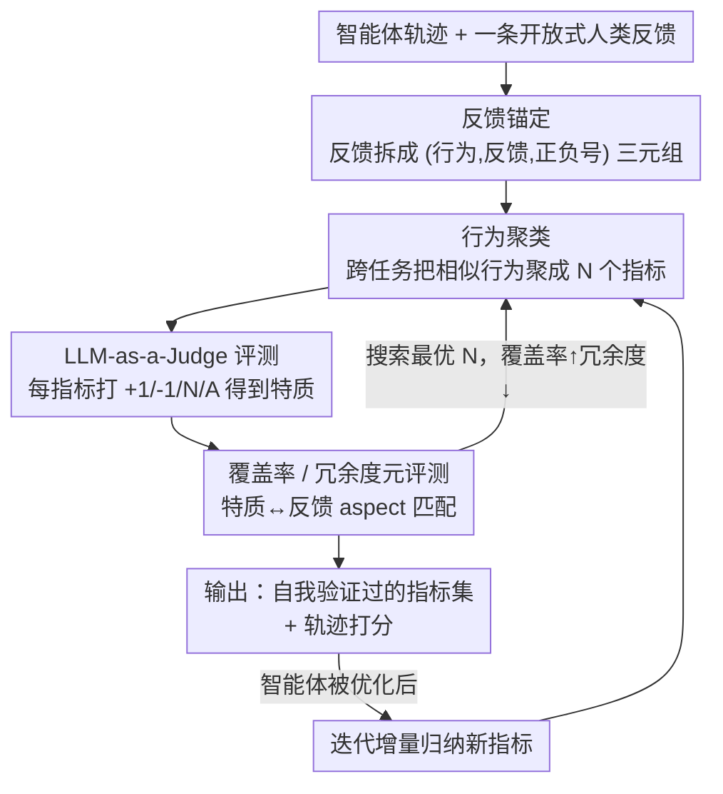

# AutoLibra: Agent Metric Induction from Open-Ended Human Feedback

**会议**: ICLR2026  
**OpenReview**: [https://openreview.net/forum?id=4BjGVZ7Bxn](https://openreview.net/forum?id=4BjGVZ7Bxn)  
**代码**: https://autolibra.org （有）  
**领域**: Agent 评测 / LLM-as-a-Judge  
**关键词**: 智能体评测, 指标归纳, 开放式人类反馈, 主题分析, 自我调节优化

## 一句话总结
AutoLibra 把人类对智能体轨迹的开放式自然语言反馈（如"按钮已禁用就别再点了"）自动归纳成一组带定义和正反例的细粒度评测指标，再用 LLM-as-a-Judge 打分，并用"覆盖率/冗余度"两个元指标反过来优化这组指标，最终既能比专家手设指标更细地刻画智能体行为，又能当作优化目标让前沿模型在 2D 文字游戏上自我调节提升 20%+ 成功率。

## 研究背景与动机
**领域现状**：当前评测和优化语言智能体（web agent、社交 agent、文字游戏 agent 等）几乎都依赖**任务成功率**这类终局指标——任务做没做成、最终状态对不对。

**现有痛点**：成功率指标有三个硬伤。一是**粗粒度**：一条轨迹几十步，成功率只给一个 0/1，无法告诉你智能体是在哪一步、因为什么行为失败的。二是**依赖专家手设**：每个新环境都要专家坐下来设计评测维度和失败类目，成本高且主观。三是**奖励不到中间涌现行为**：智能体在优化过程中会冒出新的好行为或新的失败模式（如"过度自主决策""撞到地图边界"），固定的成功率指标完全无感。

**核心矛盾**：人类其实很容易对一条具体轨迹给出**具体反馈**（"它没去下拉菜单选 iPhone 14/15"），但很难凭空**设计出一套通用指标**。也就是说，廉价的监督信号（开放式反馈）和昂贵的产物（评测指标）之间存在错配——现有做法把人逼到了昂贵的那一端。

**本文目标**：(1) 把零散、口语化的人类反馈自动转成结构化、可复用、跨任务的评测指标；(2) 让这些指标自带"质量检验"，能搜出最优的一组；(3) 让指标既能当"透镜"分析智能体，也能当"阶梯"优化智能体。

**切入角度**：作者借鉴社会科学里的**主题分析（thematic analysis）**——质性研究者把访谈文本先"编码（coding）"成一个个标注片段，再把相似片段"归纳（theme induction）"成主题。智能体反馈归纳几乎是同构的问题：把反馈锚定到行为（编码）→ 把相似行为聚类成指标（归纳）。

**核心 idea**：用"反馈锚定 + 行为聚类"两步从开放式反馈归纳指标，并用 LLM-as-a-Judge 评测闭环出"覆盖率/冗余度"两个元指标，反向优化指标集——让评测体系从"人来设计"变成"从反馈自动长出来且自我验证"。

## 方法详解

### 整体框架
AutoLibra 是一条**闭环流水线**：输入是「智能体轨迹 + 对应的一条开放式人类反馈」，输出是「一组带定义和正反例的评测指标」以及「每条轨迹在这些指标上的打分」。整体分两大过程：**归纳过程（Induction）**把反馈变成指标，**评测过程（Evaluation）**用指标给新轨迹打分，并通过元评测算出指标质量，再把质量信号回灌去搜索更优的指标集。

具体地，归纳过程内部是"反馈锚定 → 行为聚类"两步：先用 LLM 把一条反馈拆成若干 (行为, 反馈, 正负号) 三元组（aspect），再用 LLM 把所有轨迹的 aspect 跨任务聚成 $N$ 个指标。评测过程里，LLM-as-a-Judge 用这组指标给每条轨迹的每个指标打 $\{+1, -1, \text{N/A}\}$，得到正/负特质（trait）；元评测再把这些 trait 和人类原始反馈拆出的 aspect 做匹配，算出**覆盖率（coverage）**和**冗余度（redundancy）**。最后用这两个元指标当目标，搜索"覆盖率最高、冗余度最低"的指标数量 $N$ 和具体指标集，形成闭环。这套闭环还能**迭代**：智能体被优化后冒出新行为，就在已有指标上增量归纳新指标。

### 关键设计

**1. 反馈锚定：把一句口语反馈拆成可定位到行为的三元组**

痛点是人类反馈往往一句话里混了好几层意思，且抽象、不指向具体步骤——比如 CoGym 里"AI 给的行程挺一致的，不过最后几分钟卡住了"，既有正面（行程一致）又有负面（卡住）。AutoLibra 定义一个 **aspect 为三元组 $(\text{behavior}, \text{feedback}, \text{sign})$**：behavior 是轨迹里被指涉的那段具体动作（如"生成 20 天马尔代夫行程"），feedback 是评价内容（"行程一致"），sign 是正负号。做法是把整条轨迹和反馈喂给 GPT-4o，指令它（1）把反馈拆成 bullet 点，（2）为每个 bullet 找到轨迹里对应的片段，最后用**受限解码（constrained decoding）**强制按三元组格式输出。实测每条轨迹平均能拆出 1-2 个 aspect（最多 5 个）。这一步等价于主题分析的"编码"，关键在于它把"评价"硬绑到"行为"上，后面聚类才聚的是行为维度而非任务话题。

**2. 行为聚类：用 LLM 而非 K-means 把 aspect 聚成跨任务指标**

痛点是要把成百上千个 aspect 归并成 $N$ 个指标，但统计聚类做不了——作者试过用 `text-embedding-3-large` 嵌入再跑 K-means，结果簇大多按"任务"分而不是按"行为"分（即把"网购任务"聚一块、"订餐任务"聚一块，毫无评测意义）。所以改用 LLM（o3-mini high）做语义聚类：把 $M$ 条轨迹的所有 aspect 汇总，聚成 $N$ 个指标，每个指标 = 一段定义 + 一组正例行为 + 一组负例行为。指令的精髓是控制粒度——"只把非常相似的行为聚在一起，但别局限于某个具体网站或某个角色"，这样既让指标足够具体（不是"它很棒"这种废话），又能跨任务复用。这一步对应主题分析的"主题归纳"。

**3. 覆盖率/冗余度元评测：让指标集自我验证、可被搜索优化**

痛点是归纳出的指标好不好、是不是漏了人类在意的行为、是不是有一堆没人提的冗余指标，需要一个**客观可优化**的判据。AutoLibra 设计两个元指标：先用 LLM-as-a-Judge（o3-mini medium）拿指标给每条轨迹打 $\{+1,-1,\text{N/A}\}$ 得到 trait，再用 GPT-4o 把这些 trait 和人类反馈拆出的 aspect 做最优匹配。**覆盖率 = 有匹配到 trait 的 aspect 占全部 aspect 的比例**（指标覆盖了多少人类真正在意的行为），**冗余度 = 没匹配到任何 aspect 的 trait 占全部 trait 的比例**（多少检出特质是人类压根没提的）。注意算指标分数时只在 $+1$ 与 $-1$ 间取比例、忽略 N/A，因为很多指标（如"搜索词是否有效"）只在特定任务下适用。这两个元指标把"指标质量"变成了可计算、可优化的数，是整条闭环能成立的支点。

**4. 指标优化与迭代归纳：搜最优 N，并随智能体进步增量加指标**

痛点是指标数量 $N$ 是个超参——太少覆盖不全，太多冗余暴涨。优化目标是**优先最大化覆盖率、其次最小化冗余度**。具体策略很朴素却有效：生成 20 组指标集、$N$ 从 4 到 13 变动，选出"覆盖率不低于最高覆盖率 $-1\%$ 且冗余度最低"的那组；然后把 $N$ 的搜索范围重置到上轮选中数量 $\pm 2$，迭代到收敛（通常 3 轮内）。作者试过遗传算法、迭代聚类等更复杂的搜法，**都没比这个简单策略更好**。此外这套优化能**迭代复用于智能体改进**：智能体被优化后会冒出新行为/新失败模式，于是修改聚类步——把已有指标和定义喂给 LLM，要求它"不改旧指标定义、只往旧指标加新行为、必要时加新指标"，从而像软件开发里"保留旧单元测试再加新测试"那样持续追踪智能体的成长。

### 一个完整示例
以 WebVoyager 的一条网购轨迹为例走一遍闭环：任务是"比较 iPhone 14 Pro 和 15 Pro 的价格与芯片"，智能体却点了"iPhone 16 Pro Max"。人类反馈："智能体没去下拉菜单选 iPhone 14/15 pro"。**反馈锚定**把它拆成 aspect：(行为=从下拉菜单选了 iPhone 16 Pro Max, 反馈=没选对型号, sign=负)。**行为聚类**发现这和其他轨迹里"没用对价格排序下拉框""点错商品类目"等行为属于同一维度，归纳成指标 **Element Interaction Accuracy（元素交互准确性）**，定义为"评估智能体是否与正确的 UI 元素交互"，附正例（正确用搜索栏搜 Brexit 新闻）和负例。**LLM-as-a-Judge** 拿这个指标给该轨迹打 $-1$（负特质）。**元评测**把这个负特质和人类那条负 aspect 匹配上 → 该 aspect 被覆盖。整个数据集上聚合，比如得到覆盖率 82%、冗余度 75%，再回去调 $N$ 搜更优指标集。这个例子里关键是：人类只说了一句很具体的吐槽，系统却长出了一个能跨"搜新闻/查数据集/网购"复用的通用指标。

## 实验关键数据

实验覆盖多类智能体环境：协作智能体 CoGym、社交智能体 Sotopia、web 智能体 WebArena/WebVoyager、文字游戏 Baba-is-AI/MiniHack。每个数据集约 80-100 条轨迹、每条一条反馈；改进实验每阶段仅标 18 条。

### 主实验：各步骤与人类判断的一致性
作者随机抽 40 个实例让人类专家逐步审核（行为聚类因要处理 400+ aspect 太耗时而略过，由覆盖率/冗余度间接验证），打 1/0 看是否同意。

| 步骤 | CoGym | Sotopia | WebArena | WebVoyager | Baba-is-AI | 平均 |
|------|-------|---------|----------|------------|------------|------|
| 反馈锚定 (Grounding) | 0.95 | 0.95 | 0.98 | 0.93 | 0.93 | 0.95 (±0.03) |
| LLM-as-a-Judge | 0.90 | 0.85 | 0.95 | 1.00 | 0.90 | 0.92 (±0.04) |
| 元评测 (Meta-Eval) | 0.98 | 0.90 | 0.85 | 0.83 | 0.95 | 0.90 (±0.04) |

每一步的人类一致率都显著高于 85%，说明 AutoLibra 各 LLM 环节的输出是可靠的。

### 指标优化与"透镜"分析
覆盖率随 $N$ 增大而升、约在 $N=6\sim10$ 收敛（视数据集而定）：WebArena/WebVoyager 最高达 88%，Sotopia 最低仅 60%（因任务多样性大）。留出集覆盖率只比训练集低 $<5\%$。作为"透镜"，AutoLibra 在三个数据集上都归纳出比专家手设更细、甚至专家**遗漏**的指标：

| 数据集 | AutoLibra 相对专家指标的发现 |
|--------|------------------------------|
| CoGym | 归纳 9 个指标对应专家 5 个失败类目，失败率数值大致吻合 |
| Sotopia | 复原出专家维度 Goal Completion，并把过于高层的 Believability 拆成 3 个子维度，另发现 4 个被忽略的指标 |
| WebVoyager | 把笼统的"导航卡住"细分为 Error Recovery、Step Efficiency、Navigation Accuracy 等；额外发现 Query/Search 策略效率（7%）、最终输出质量（18%）两个高频问题 |

### 关键发现
- **正反例行为示例至关重要**：从指标里去掉 good/bad behaviors，CoGym 覆盖率掉最多达 30%——可见指标不能只有定义，具体正反例才让 LLM-as-a-Judge 评得准。
- **简单搜索胜过复杂优化**：遗传算法、迭代聚类都没赢过"生成 20 组选最优、范围 $\pm2$ 迭代"的朴素策略。
- **AutoLibra 看不到的盲区**：它只观察行为、读不了神经表征，因此无法捕捉 WebVoyager 论文里提到的"视觉锚定问题（25%）"——这是纯行为驱动方法的固有边界。
- **当阶梯优化智能体（§5）**：在 Baba-is-AI 上用 Gemini-2.5-Flash，分 3 阶段、每阶段仅对 40 个任务里的 6 个收集人类反馈、增量归纳指标（Stage1/2 各 5 个、Stage3 再加 1 个），再用指标分数当目标优化 agent 提示词。**在完全不直接优化成功率的情况下，成功率提升超 20%**（直到 Stage 3 智能体开始"过度思考"才出现性能回落）。

## 亮点与洞察
- **把"评测体系设计"从人移到了反馈数据上**：传统是专家拍脑袋定指标，AutoLibra 让指标从廉价的开放式反馈里自动"长"出来，且自带覆盖率/冗余度做质检——这把评测从手工艺变成了可优化的数据过程。
- **主题分析→智能体评测的跨学科映射很漂亮**：把社会科学质性研究的"编码-归纳"两步直接对应到"反馈锚定-行为聚类"，是一个干净且可复用的方法论迁移，迁到别的"从非结构化人类信号造结构化标准"的任务（如代码 review 规范归纳、客服话术评分）都说得通。
- **"指标即单元测试"的类比有实操价值**：迭代归纳新指标 = 软件开发里持续补单元测试，既能追踪智能体能力成长、又防止旧能力被新优化破坏；这给"持续评测"提供了一个具体范式。
- **覆盖率/冗余度这对元指标可独立复用**：任何"用一组 LLM 生成的标准去对齐人类意图"的场景，都能借这对指标量化"对齐得全不全、有没有自说自话的冗余项"。
- **不优化成功率却涨成功率**：说明 AutoLibra 归纳的细粒度行为指标抓到了导致成败的真实中间因素，是好的稠密代理奖励。

## 局限与展望
- **每条轨迹只标一条反馈、且为事后整条反馈**：作者承认理论上可对单步/多步给反馈来改善锚定，但本文留作 future work；事后反馈也不如交互中实时反馈来得高质量和用户友好。
- **纯行为驱动的盲区**：读不了模型内部表征，捕捉不到视觉锚定等需要看神经表征的问题（WebVoyager 上漏掉 25% 的视觉锚定失败）。
- **依赖多个不同 LLM 且各步分工固定**：锚定用 GPT-4o、聚类用 o3-mini high、打分用 o3-mini medium、匹配用 GPT-4o——这套组合的稳健性、换模型后的可迁移性、以及多次 LLM 调用的成本，文中讨论有限。
- **过度优化会反噬**：Baba-is-AI 上 Stage 3 出现"过度思考"导致性能回落，说明把 LLM 归纳指标当优化目标存在 reward hacking 风险，需要 early-stop 或额外约束。
- **聚类步缺直接人工验证**：因 400+ aspect 太多而只能靠覆盖率/冗余度间接验证，最核心的归纳质量没有逐实例人工背书。

## 相关工作与启发
- **vs 传统智能体 benchmark（SWE-Bench / τ-Bench / Embodied Agent Interface）**: 它们用人写单元测试、数据库状态比对等**预定义**的评测；AutoLibra 是纯数据驱动、无预设失败类目、从反馈现场归纳可解释指标，且同一套指标既能评也能用来优化。
- **vs 强化学习里的内在奖励（curiosity / skill discovery）**: 那些为鼓励探索而造稠密奖励；AutoLibra 造的是**可解释、对齐人类在意行为**的指标，目的是评测与对齐人类意图，而非单纯探索信号。
- **vs 从语言/人类反馈学习（Text2Reward / 偏好反馈 / 示范反馈）**: 多数是把反馈直接转成某条轨迹的奖励或策略改进信号；AutoLibra 不直接产奖励，而是从**所有标注实例**归纳出跨任务可泛化、既可评测又可微调用的指标。
- **vs 概念归纳 LLooM (Lam et al., 2024)**: AutoLibra 直接受其启发，但补上了"元评测优化归纳结果"的闭环，并落地到智能体评测这一具体场景。

## 评分
- 新颖性: ⭐⭐⭐⭐⭐ 把主题分析搬进智能体评测、并用覆盖率/冗余度闭环自验证，范式层面的新意。
- 实验充分度: ⭐⭐⭐⭐ 跨 6 个环境验证一致性+透镜分析+一个端到端改进案例，但改进实验只在单个游戏单个模型上做。
- 写作质量: ⭐⭐⭐⭐ "透镜/阶梯/单元测试"等类比清晰，图示丰富；个别句子有笔误。
- 价值: ⭐⭐⭐⭐⭐ 给智能体评测提供了低成本、可解释、可优化的新工具，且评测-优化双用，实用性强。

<!-- RELATED:START -->

## 相关论文

- [\[ICLR 2026\] An Open-Ended Benchmark and Formal Framework for Adjuvant Research with MLLM](an_open-ended_benchmark_and_formal_framework_for_adjuvant_research_with_mllm.md)
- [\[ACL 2026\] Automated Creativity Evaluation of Language Models Across Open-Ended Tasks](../../ACL2026/llm_evaluation/automated_creativity_evaluation_of_language_models_across_open-ended_tasks.md)
- [\[ICLR 2026\] Towards Self-Evolving Agent Benchmarks: Validatable Agent Trajectory via Test-Time Exploration](towards_self-evolving_agent_benchmarks_validatable_agent_trajectory_via_test-tim.md)
- [\[ICLR 2026\] Computer Agent Arena: Toward Human-Centric Evaluation and Analysis of Computer-Use Agents](computer_agent_arena_toward_human-centric_evaluation_and_analysis_of_computer-us.md)
- [\[ACL 2025\] ONEBench to Test Them All: Sample-Level Benchmarking Over Open-Ended Capabilities](../../ACL2025/llm_evaluation/onebench_to_test_them_all_sample-level_benchmarking_over_open-ended_capabilities.md)

<!-- RELATED:END -->
