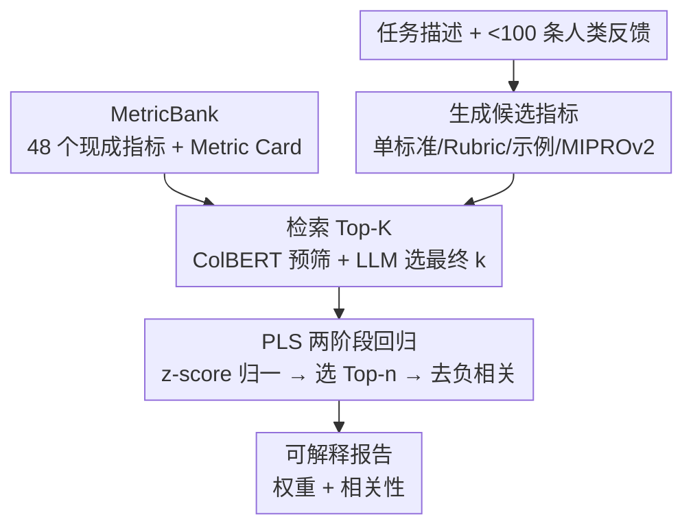

# AutoMetrics: Approximate Human Judgments with Automatically Generated Evaluators

**会议**: ICLR 2026  
**OpenReview**: [https://openreview.net/forum?id=ymJuBifPUy](https://openreview.net/forum?id=ymJuBifPUy)  
**代码**: https://github.com/SALT-NLP/autometrics  
**领域**: LLM 评测 / LLM-as-a-Judge / 自动指标  
**关键词**: 自动指标合成、LLM 评估器、PLS 回归、低数据评测、代理奖励

## 一句话总结
AutoMetrics 把不到 100 条稀疏的人类反馈（点赞/点踩、Likert、行为信号）自动转成一组可解释的评估指标：先生成候选 LLM-as-a-Judge 标准并从 48 个现成指标的 MetricBank 中检索，再用偏最小二乘（PLS）回归把它们组合成最贴合人类判断的复合指标，在 5 个任务上把与人类评分的 Kendall 相关性最多提升 33.4%，还能当代理奖励去优化下游 agent，效果不输可验证奖励。

## 研究背景与动机
**领域现状**：评测面向用户的开放式 AI 应用（旅行规划、临床笔记、对话）一直是难题。黄金标准是人类反馈或行为信号（点赞、留存），但这些信号在原型期非常稀缺，或者太慢、没法用来在线优化系统。退而求其次的主流做法是基于 rubric 的 LLM-as-a-Judge。

**现有痛点**：可验证奖励（数学、代码）和主观开放任务之间的鸿沟越来越大——后者很难量化。奖励模型通常要上千条标注；而 LLM-as-a-Judge 假设系统行为已被清晰定义、且不保证严格遵守给定 rubric。更现实的困境是：实践者手上往往只有非描述性的信号（用户给的点赞/点踩），既不知道该写什么 rubric，也不知道哪些底层标准才是真正重要的。

**核心矛盾**：评估这件事本身应当是**自适应**的，但现有工作大多在「让 LLM 当更好的评估器」或「用 rubric 去优化 LLM」上发力，很少有人去**自动生成**那些要与人类判断对齐的 rubric 和标准。当任务是全新的、数据又极少时，问题不只是「制定 rubric」，而是「发现哪些标准真正 matter」。

**本文目标**：在低数据约束下（少于 100 条人类信号），从一句任务描述出发，自动归纳出一组既能预测人类判断、又可解释的指标。

**切入角度**：与其在「全靠人类判断」和「固定 rubric」之间二选一，不如把指标学习做成动态的——生成大量候选标准来保证覆盖面，再用统计回归把它们筛选、加权、压缩成真正预测人类信号的少数几个指标。

**核心 idea**：用「生成候选 + 检索现成 + 回归组合」的四步流水线，把稀疏人类反馈蒸馏成可解释的自动评估器，让指标既能打分又能告诉你「用户到底在乎什么」。

## 方法详解

### 整体框架
AutoMetrics 的目标是：给定一个主观/新颖任务的描述和不到 100 条人类标签，产出一组与人类判断强相关的指标。整条流水线分四步——**生成（Generate）→ 检索（Retrieve）→ 回归（Regress）→ 报告（Report）**。前两步广撒网造出大量候选评估器（既有 LLM 现造的，也有从 MetricBank 里捞的现成的），第三步用 PLS 回归在少量人类标注上把这些候选压缩、加权成最终复合指标，最后一步输出带权重和相关性的可解释报告。所有候选指标都配一张 Metric Card（描述、用途、实现、局限），既给检索当文档，也给最终报告当解释依据。

### 关键设计

**1. MetricBank + Metric Card：把 NLP 文献里的指标做成可检索的「文档库」**

新任务很可能没有现成指标，但很多经典指标（INFORM/LDL 奖励模型、SummaQA、Toxicity、各种文本生成指标等）仍然有用。作者把 48 个来自 NLP 文献的指标统一实现、统一封装成 MetricBank，每个指标都附一张 **Metric Card**：记录它的描述、适用场景、实现细节和局限。这一步的关键在于「把指标当文档」——Metric Card 不只是文档，更是后续检索时的检索单元（query 是任务描述，document 是 Metric Card）。消融显示带 Metric Card 的检索（k=20）在全部 5 个任务上都优于只用单句描述的检索，说明丰富的文档化对召回正确指标很关键。

**2. 生成（Generate）：多形态广撒网造候选评估器**

对足够新颖的任务，必须现场生成 LLM-as-a-Judge 标准；广覆盖才能在后面筛出真正重要的那几个。默认每次运行生成 10 个**单标准（Single Criterion）** LLM Judge、5 个 **Rubric** LLM Judge、1 个**基于示例（few-shot）**优化的 Judge、1 个 **Prompt 优化（MIPROv2）**的 Judge。前两类便宜，后两类要更多 LLM token 但更精。这种「多种粒度混合」的配方在近 30 个设置上验证过能跨域泛化——单标准提供细粒度切面，rubric 提供结构化打分，示例/prompt 优化提供贴合任务的强信号。每个生成的指标同样配 Metric Card。

**3. 检索（Retrieve）：ColBERT + LLM 混合过滤，把候选池收到可承受的规模**

把生成的候选和 MetricBank 全跑一遍代价太大，所以检索被当成**过滤步**而非召回步。做法是混合检索：先用 **ColBERT** 把候选（生成的 + MetricBank 的）按与任务描述的相关性预筛到 $k'$ 个 Metric Card，再让一个 LLM 从中挑出最终 $k$ 个。消融发现 $k$ 越大相关性大致线性增长，最优默认值 $k=30$；有意思的是小数据集（CoGym）上前 5 个被检索到的常常是生成指标，反而避免了现成指标在小样本上的虚假相关。

**4. 回归（Regress）：PLS 两阶段压缩 + 去负相关，把一堆指标拧成一个预测信号**

过滤后的候选还要组合成一个预测人类判断的信号。作者先把所有指标分数归一到 z-score，再拟合**偏最小二乘（PLS）回归**。选 PLS 是因为这个场景天然「高维低样本」：预测变量（指标）数量可能 ≥ 观测数（数据点），且预测变量之间高度相关——普通最小二乘会崩，PLS 则把指标空间投影到对人类标签最有预测力的方向上。单隐变量时 PLS 找一个单位权重向量
$$w^\star = \arg\max_{\lVert w \rVert_2 = 1} \operatorname{cov}(Xw, y)^2,$$
其中 $X$ 是归一化指标分数矩阵、$y$ 是人类标签；隐分数 $t = Xw^\star$，再用 $\hat{y} = t\beta$ 回归，系数 $\beta = \frac{t^\top y}{t^\top t}$。

这一步分两阶段：第一阶段用全部候选拟合 PLS，按 $w^\star$ 中权重大小排序，选出 Top-$n$（默认 $n=5$）；第二阶段在这 $n$ 个指标上重新拟合得到新投影。最后还有一步**去负相关**：移除与人类标签负相关的 LLM 生成指标（它们本就该正相关，负相关说明是噪声），但保留现成指标里合理的负相关（如长度与简洁度天然负相关）。权重本身就是「相对重要性」，直接构成可解释报告。

### 损失函数 / 训练策略
没有传统意义的训练损失——PLS 的目标就是上面的协方差最大化目标 $\operatorname{cov}(Xw,y)^2$。整套流水线只在每个任务的训练集（人类标注）上拟合一次回归，无梯度训练；唯一的「训练」类比是 4.5 节里对 $k$（检索数）、$n$（回归保留数）、MetricBank 组成的超参扫描，全部在 dev 集上做、绝不在 test 集上调。

## 实验关键数据

### 主实验（Criterion Validity：与人类判断的相关性）
在 5 个任务（2 个 in-distribution + 3 个 out-of-distribution）上报告 Kendall's $\tau$，下表为 Qwen-3-32B（Reasoning）骨干、5 次独立运行：

| 方法 | SimpEval | HelpSteer2 | EvalGen | RealHumanEval | CoGym |
|------|----------|-----------|---------|---------------|-------|
| Best Existing Metric | 0.246 | 0.327 | 0.193 | 0.138 | 0.074 |
| MetaMetrics | 0.127 | 0.204 | -0.214 | 0.025 | -0.119 |
| Finetuned LLM (ModernBERT-large) | 0.076 | 0.039 | 0.054 | 0.049 | 0.223 |
| LLM-Judge | 0.294 | 0.334 | 0.272 | 0.025 | 0.276 |
| DnA-Eval | 0.042 | 0.260 | 0.232 | 0.071 | 0.353 |
| **AutoMetrics (Ours)** | **0.316** | **0.342** | **0.382** | 0.145 | **0.365** |

用 Qwen3-32B 时 AutoMetrics 在全部 5 个任务上都胜过所有 baseline；用 GPT-4o-mini 时 4/5 任务落在最优的 95% 置信区间内。在 EvalGen 上相对最接近的 baseline（LLM-Judge）提升 **33.4%**。关键观察是：baseline 的「最优者」既随数据集变（不同任务里 LLM-Judge / DnA-Eval 各擅胜场）也随骨干模型变（现成指标在 GPT-4o-mini 上赢、在 Qwen3-32B 上输），而 AutoMetrics 是**唯一无论数据集还是骨干都稳居最优**的选择。

### 消融实验（Qwen3-32B，dev 集）

| 配置 | EvalGen | CoGym | 说明 |
|------|---------|-------|------|
| Existing Metrics Only | 0.389 | 0.258 | 只用 MetricBank 现成指标 |
| Generated Metrics Only | 0.503 | 0.433 | 只用 LLM 生成指标 |
| Full MetricBank | 0.474 | 0.329 | 两者都用（默认） |
| Retrieve k=5 / k=30 | 0.414 / 0.474 | 0.385 / 0.329 | k 越大相关性大致线性升，默认 k=30 |
| No Regression (n=1) | 0.353 | 0.356 | 不回归、只取单个最优指标 |
| Regress n=5 | 0.474 | 0.329 | 默认；成本/性能折中点 |

### Construct Validity（鲁棒性：Sensitivity / Stability）
作者自定义两个指标量化「收敛—判别效度」。**Sensitivity** 衡量指标是否给被劣化的输出更低分：
$$\text{Sensitivity} = \frac{1}{N}\sum_{i=1}^{N}\mathbb{1}\!\left[s^{(i)}_{\text{worse}} < s^{(i)}_{\text{orig}}\right];$$
**Stability** 衡量在无关扰动（改写、换序、同义替换）下分数是否稳定：
$$\text{Stability} = 1 - \frac{1}{N}\sum_{i=1}^{N}\left|s^{(i)}_{\text{orig}} - s^{(i)}_{\text{same}}\right|.$$
AutoMetrics 在 81.0%–97.8% 的情况下能识别质量退化（远高于 50% 基线），稳定性也以 >95% 置信区间稳超正态分布基线。

### 代理奖励案例（τ-Bench agent 优化）
在 τ-airline（工具调用 agent）上，用 25 条训练任务跑 AutoMetrics 学出 3 个指标，再用 DSPy GEPA 优化 agent。2000 次 rollout 后：可验证奖励得 0.680±0.11，**AutoMetrics 得 0.720±0.06**，均显著超过未优化基线 0.60（$p<0.05$）——说明自动指标能当代理奖励、效果不输甚至略超可验证奖励。

### 关键发现
- **数据量天花板约 80 条**：SimpEval / HelpSteer2 / RealHumanEval 上性能在约 80 个样本后饱和；80 以下主要受小样本回归高方差拖累。
- **小样本/OOD 时「只用生成指标」反而更好**：CoGym、EvalGen（最小训练集，37、57 条）上 Generated Only 超过 Full MetricBank，因为现成指标在小样本上是噪声预测器、易产生虚假相关；故作者默认 <80 条时只用生成指标。
- **回归保留数 $n$ 因任务而异**，$n=5$ 是「成本-性能-方差」的折中默认值，$n$ 越大下游要跑的昂贵指标越多。

## 亮点与洞察
- **把「评估指标」做成可检索 + 可回归的对象**：Metric Card 既是解释文档又是检索单元，回归权重既是组合系数又是「用户在乎什么」的相对重要性——一个设计同时解决了准确、可解释、可复用三件事。
- **PLS 是这个场景的精准选型**：高维低样本 + 预测变量强相关，正是普通回归的死穴，而 PLS 的协方差最大化投影天然对症，比直接 XGBoost（MetaMetrics）稳得多。
- **去负相关的小步很巧**：对生成指标删负相关、却保留现成指标的合理负相关（长度 vs 简洁度），体现了对「指标语义」的细致区分，而非一刀切。
- **可迁移到任何低数据评测场景**：只要你有一句任务描述 + 几十条点赞/点踩，就能换出一组可解释指标；尤其适合产品原型期快速搭评测，也能无缝转成 RL/prompt 优化的奖励信号。

## 局限与展望
- **指标与生成它的 LLM 绑定**：用一个模型造的指标换另一个模型跑会掉点，意味着换更强模型时要用 AutoMetrics 重新优化而非直接替换骨干。
- **泛化受限于输入数据的代表性**：指标只能泛化到训练反馈覆盖的人群/口味，收集真实、多样的人类数据仍是评估不可省的一环。
- **高 P 低 N 的虚假相关风险仍在**：尽管 PLS + 去负相关有所缓解，作者只能在报告里加「相关性显著性低（$p>0.05$）」的警告，靠人工 oversight 兜底。
- **没有正式用户研究**：只有与 AI 开发者的非正式测试反馈，缺少对实际采纳率的严格评估。

## 相关工作与启发
- **vs LLM-as-a-Judge（Zheng et al., 2023）**：它们固定一套 rubric/prompt 直接打分，假设标准已知；AutoMetrics 把「发现标准」也自动化，并用回归筛掉无效标准，在标准未知的新任务上更稳。
- **vs MetaMetrics（Winata et al., 2025）**：同样对多指标做回归组合，但 MetaMetrics 只用现成指标 + XGBoost，在低数据新任务上甚至出现负相关（EvalGen -0.214）；AutoMetrics 的核心论点是「自适应**生成**指标」对低数据 OOD 至关重要，且 PLS 比 XGBoost 更抗高维低样本。
- **vs EvalGen / DnA-Eval（Shankar et al., 2024b；Li et al., 2025）**：EvalGen 用人在环迭代精化标准、DnA-Eval 把评估分解成几个维度再加权聚合；AutoMetrics 借鉴了「从反馈提标准」与「分维度」的思路，但把检索现成指标、PLS 统计加权、去负相关串成一条更自动、更可解释的流水线。

## 评分
- 新颖性: ⭐⭐⭐⭐ 「自动生成 + 检索现成 + PLS 回归」组合成可解释评估器的框架很完整，单个组件多为已有技术的精当组合
- 实验充分度: ⭐⭐⭐⭐⭐ 5 任务 × 2 骨干 × 5 seed、三类效度、数据量扫描、代理奖励案例，覆盖很全
- 写作质量: ⭐⭐⭐⭐ 把测量学的内容/准则/构念效度引入 LLM 评测，论证清晰；公式与消融充分
- 价值: ⭐⭐⭐⭐⭐ 低数据下「点赞/点踩 → 可解释指标 → 代理奖励」一条龙，工具已开源，实用价值高

<!-- RELATED:START -->

## 相关论文

- [\[ICLR 2026\] Foundational Automatic Evaluators: Scaling Multi-Task Generative Evaluator Training for Reasoning-Centric Domains](foundational_automatic_evaluators_scaling_multi-task_generative_evaluator_traini.md)
- [\[ICLR 2026\] Human-LLM Collaborative Feature Engineering for Tabular Learning](human-llm_collaborative_feature_engineering_for_tabular_data.md)
- [\[ACL 2025\] HPSS: Heuristic Prompting Strategy Search for LLM Evaluators](../../ACL2025/llm_evaluation/hpss_heuristic_prompting_strategy_search_for_llm_evaluators.md)
- [\[ICLR 2026\] SimBench: Benchmarking the Ability of Large Language Models to Simulate Human Behaviors](simbench_benchmarking_the_ability_of_large_language_models_to_simulate_human_beh.md)
- [\[ICML 2026\] From Human-Level AI Tales to AI Leveling Human Scales](../../ICML2026/llm_evaluation/from_human-level_ai_tales_to_ai_leveling_human_scales.md)

<!-- RELATED:END -->
