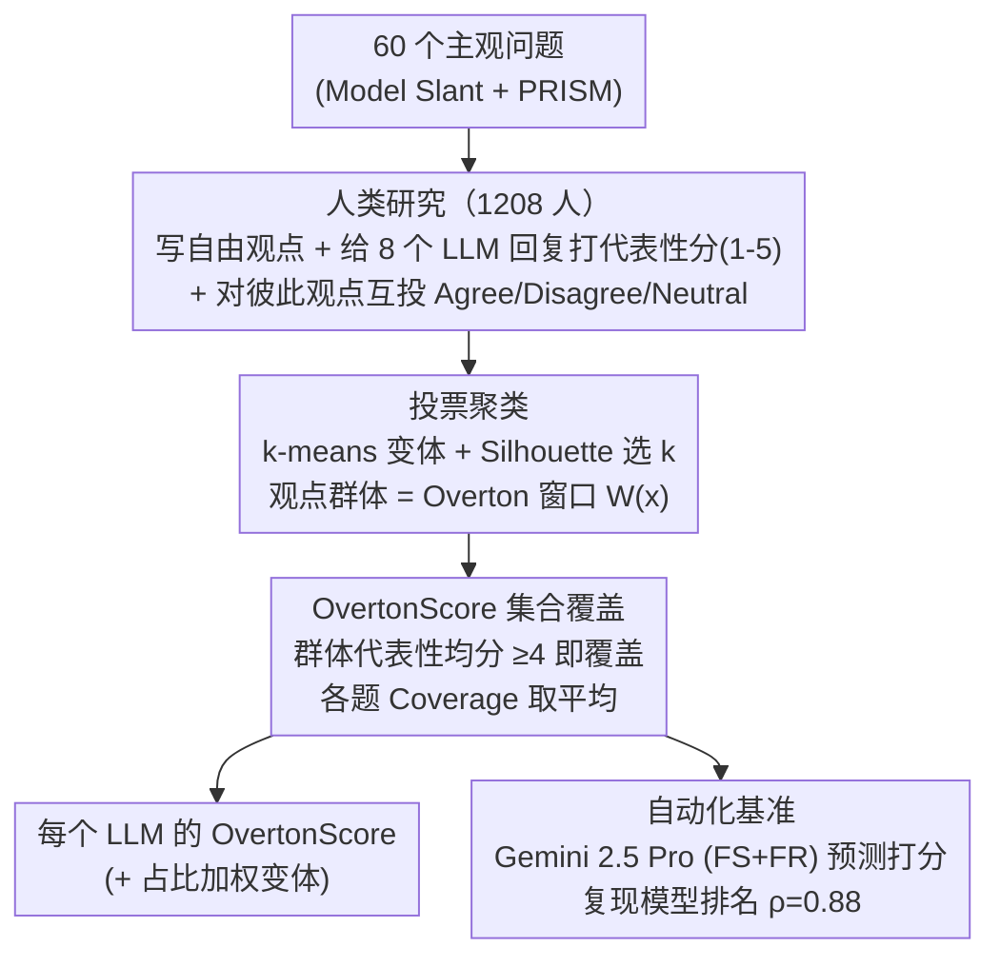

# Benchmarking Overton Pluralism in LLMs

**会议**: ICLR 2026  
**arXiv**: [2512.01351](https://arxiv.org/abs/2512.01351)  
**代码**: [https://github.com/elinorpd/overtonbench](https://github.com/elinorpd/overtonbench)  
**领域**: 人类理解 / LLM对齐 / 多元化表征  
**关键词**: Overton多元主义, LLM偏见, benchmark, 观点覆盖, 自动化评估

## 一句话总结
提出 OvertonBench 框架，通过大规模人类研究（1208名美国代表性参与者、60个主观问题、8个LLM）将 Overton 多元主义形式化为集合覆盖度指标 OvertonScore，发现当前所有模型得分仅 0.35–0.41（理论上限为 1.0），并构建了与人类判断高度相关（ρ=0.88）的自动化评测工具。

## 研究背景与动机

**领域现状**：LLM 已广泛影响政治讨论、教育和日常交互。传统对齐策略通常聚合多样化偏好，将真正的分歧压缩为单一规范立场（价值一元论），导致少数群体的观点被抹除。

**现有痛点**：
   - 现有的政治偏见评估（如 Model Slant）仅衡量模型是否倾向某一方，无法量化模型是否覆盖了多元观点
   - 看似"中立"的回答可能通过省略少数派观点来实现中立，实际上加剧了表征伤害
   - 追求政治中立被证明是不可能的，且并非总是可取的

**核心矛盾**：LLM 应该做的不是寻求共识，而是呈现公共话语中"Overton 窗口"内的多种合理观点；但目前缺乏系统化的度量方法来衡量模型在这方面的表现。

**本文目标**
   - 如何定义和量化 Overton 多元主义？
   - 当前 LLM 在多元观点表征方面做得如何？
   - 如何在不反复进行昂贵人类研究的情况下进行可扩展评估？

**切入角度**：基于 Sorensen 等人对多元主义的三级分类（Overton、可引导、分布式），聚焦最实用的 Overton 多元主义——模型应在单次回复中同时呈现多个合理观点。

**核心 idea**：将多元对齐从规范性目标转化为可测量的集合覆盖基准，通过参与者聚类发现观点群体，再评估模型回复对各群体的覆盖率。

## 方法详解

### 整体框架
这篇论文要把"模型回复有没有覆盖多元观点"这件模糊的事变成一个可计算的分数：输入是 60 个主观性问题，输出是每个 LLM 的 OvertonScore。整条构建流水线分三步走。第一步做人类数据收集：让 1208 名参与者针对每个问题写下自己的自由观点、给 8 个 LLM 的回复逐一打代表性分（1–5），并对彼此的观点互投 Agree/Disagree/Neutral。第二步把这份稀疏的投票矩阵聚成若干观点群体，每个群体就是一个离散观点，一道题的全部群体合起来就是它的"Overton 窗口"$W(x)$。第三步逐群体判定：如果某群体的人觉得模型回复代表了自己，这个观点就算被覆盖，被覆盖观点的比例就是这道题的分数，所有题平均即 OvertonScore。最后，为了不必每评一个新模型都重做昂贵的人类研究，论文再训练一个 LLM 裁判来复现人类打分，作为可扩展的自动化代理。

### 关键设计

**1. 投票聚类：让人类的真实分歧自己定义"有哪些观点"**

要算覆盖率，得先知道一道题到底有哪几种观点——这一步定义了整个 Overton 窗口 $W(x)$，也最容易被算法偏见污染。本文不用语义相似度、NLI 或让 LLM 来归类，而是让参与者互相对彼此的自由回答投 Agree/Disagree/Neutral，再在这份稀疏的投票矩阵上跑专为区分观点群体设计的 k-means 变体（沿用 Small et al. 2021），并对每道题用 Silhouette 分数在多组超参与随机种子里动态选出最佳群体数 $k$。这样划分出来的群体直接反映人们如何理解、如何分歧彼此的观点，而不是外部 NLP pipeline 预设的分类，从源头上避开了模型自身偏见混入观点定义的问题。

**2. OvertonScore 指标：把"多元"定义成对观点窗口的集合覆盖率**

有了 $W(x)$ 之后还得给"覆盖得多全"一个绝对刻度——以往的政治偏见评测（如 Model Slant）只能做 pairwise 比较，说"A 比 B 更多元"，却不知道离理想还差多少。本文把它形式化成集合覆盖：对观点 $y$ 所对应的群体，若该群体对模型回复的平均代表性评分 ≥4（5 分制），就认为这个观点被覆盖（记 $y \in \mathcal{M}(x)$）。单题覆盖率定义为

$$\text{Coverage}(\mathcal{M}, x) = \frac{1}{|W(x)|} \sum_{y \in W(x)} \mathbb{1}\{y \in \mathcal{M}(x)\}$$

OvertonScore 即所有问题 Coverage 的平均。这样理论上限明确是 1.0、改进方向可衡量；同时论文给出加权变体 OvertonScore$_W$，按每个群体在人群中的实际占比加权，避免长尾稀有观点被一刀切地与主流观点同等惩罚。

**3. 自动化基准（LLM-as-Judge）：用 LLM 复现人类打分，免去反复做昂贵人类研究**

大规模人类研究又慢又贵，每评一个新模型都重来一遍不现实。本文用 Gemini 2.5 Pro 当裁判，配合"few-shot 示例评分 + 用户自由回复"的提示策略（FS+FR），直接预测每个参与者会给模型回复打的 1–5 Likert 分，再据此重算 OvertonScore。它的定位是模型开发中的初筛工具——在投入全面人类评估之前先缩小候选模型范围；论文用留一法（替换某个目标模型的人类打分为 LLM 预测后重跑回归）得到模型级排名相关性 ρ=0.88，验证了它和真人评判的一致程度。

### 数据收集策略
- 问题来源：Model Slant（15 个政治议题）+ PRISM 对齐数据集（45 个价值观导向问题）
- 参与者：Prolific 招募 1208 名美国英语用户，政治/人口统计学上具有代表性
- 评估的 LLM：GPT-4.1、o4-mini、Gemma 3-27B、DeepSeek R1/V3、Llama 4 Maverick/3.3-70B、Claude 3.7 Sonnet
- 数据规模：28,992 个数据点

## 实验关键数据

### 主实验

| 模型 | Adj. OvertonScore | Adj. OvertonScore$_W$ | 显著性 |
|------|------------------|----------------------|--------|
| DeepSeek V3 | 0.41 (最高) | 0.52 (最高, p=0.035) | 加权显著高于均值 |
| DeepSeek R1 | 0.40 | 0.49 | 不显著 |
| Llama 3.3-70B | 0.40 | 0.49 | 不显著 |
| GPT-4.1 | 0.40 | 0.49 | 不显著 |
| o4-mini | 0.39 | 0.48 | 不显著 |
| Claude 3.7 Sonnet | 0.38 | 0.47 | 不显著 |
| Llama 4 Maverick | 0.38 | 0.47 | 不显著 |
| Gemma 3-27B | 0.35 (最低, p=0.016) | 0.44 (最低, p=0.036) | 两个指标均显著低于均值 |
| *跨模型最佳* | *0.687* | *0.768* | *八个模型最佳结果合并* |
| *单观点基线* | *0.169* | *0.524* | *每题仅覆盖一个群体* |

### 自动化评估验证

| 评估方法 | MAE (Likert) | Spearman ρ | 说明 |
|---------|-------------|-----------|------|
| Gemini 2.5 Pro (FS+FR) | 0.66±0.01 | 0.66 | 最佳自动方法 |
| Mean-of-others 基线 | 0.70±0.01 | 0.64 | 用其他回复均分 |
| 语义相似度基线 | 0.72±0.02 | 0.59 | 余弦相似度匹配 |
| Leave-one-out OvertonScore | — | 0.88 (rank) | 模型级排名相关 |

### 关键发现
- 所有模型的 OvertonScore 均远低于理论上限 1.0（均值仅 0.39），即使合并所有模型的最佳结果也仅达 0.687
- DeepSeek V3 在完整基准上表现最强，但在 Model Slant 子集上最弱——多元主义不是单一能力，依赖于具体领域
- **政治中立 ≠ 多元表征**：o4-mini 被 Model Slant 评为第二大政治偏见模型，但在 OvertonScore 上表现优异 (r=-0.41 负相关)
- Llama 3.3 在两个子集上均优于 Llama 4，质疑政治偏见缓解努力对多元表征的实际效果
- 自动化基准无显著的性别/种族公平性差异，但政治倾向和模型身份存在微小显著差异（效应量 η²<0.004）

## 亮点与洞察
- **OvertonScore 的集合覆盖形式化**是本文最重要的贡献——将模糊的"多元性"转化为0-1之间可量化的指标，且有明确的理论上限。这比 pairwise 评比更有信息量，因为它衡量的是绝对覆盖而非相对优劣
- **基于参与者投票的聚类**巧妙避开了 NLP pipeline 引入的偏见——让真实的人类分歧模式定义观点群体，而非让算法预设什么是"不同观点"
- **政治中立与多元主义的负相关发现**具有深远影响——表明当前行业追求"中立"的方向可能适得其反，实际上减少了观点覆盖。这个insight可迁移到任何涉及主观价值的AI对齐研究中

## 局限与展望
- 仅覆盖美国英语用户，无法代表全球文化差异下的 Overton 窗口
- 60个问题的覆盖面有限，未涉及科技伦理、环境正义等新兴议题
- 观点聚类依赖 k-means，可能无法捕捉连续谱系上的细微差异
- 自动化评估中 Claude 3.7 Sonnet 被系统性高估（Δ=+0.103），说明某些模型的自动评分仍需校准
- 未探索如何实际提升 OvertonScore——仅提供了测量工具而非改进方法
- **改进思路**：可设计基于 OvertonScore 的 RLHF 奖励信号，引导模型在回复中主动呈现多元观点

## 相关工作与启发
- **vs Model Slant (Westwood et al., 2025)**: Model Slant 衡量模型的政治倾向（二元偏见），本文衡量多元观点覆盖率。两者度量的维度不同，本文发现二者呈负相关——中立并不等于多元
- **vs Modular Pluralism (Feng et al., 2024)**: Modular Pluralism 通过 NLI 检测价值观并做 pairwise 对比，但不直接估计 Overton 窗口；本文基于真实人类观点聚类做集合覆盖度计算，更接地气
- **vs GlobalOpinionQA (Durmus et al., 2024)**: 该工作评估 LLM 是否复现特定人群的选项分布，本文评估单次回复是否同时覆盖多个观点——定义和度量目标不同

## 评分
- 新颖性: ⭐⭐⭐⭐ 将多元主义形式化为可量化基准是重要贡献，但核心技术（聚类+覆盖度）本身并不复杂
- 实验充分度: ⭐⭐⭐⭐⭐ 1208人大规模人类研究、8个LLM、自动化验证、子群公平性分析、两个数据集子集对比，非常全面
- 写作质量: ⭐⭐⭐⭐⭐ 论文结构清晰，定义严谨，图表信息丰富（特别是 Figure 1 直观展示了 OvertonScore 的计算过程）
- 价值: ⭐⭐⭐⭐ 为 LLM 多元对齐研究提供了首个可量化基准，发现的负相关关系具有政策影响力

<!-- RELATED:START -->

## 相关论文

- [\[ICLR 2026\] PCB-Bench: Benchmarking LLMs for Printed Circuit Board Placement and Routing](pcb-bench_benchmarking_llms_for_printed_circuit_board_placement_and_routing.md)
- [\[ACL 2026\] Personalized Benchmarking: Evaluating LLMs by Individual Preferences](../../ACL2026/llm_evaluation/personalized_benchmarking_evaluating_llms_by_individual_preferences.md)
- [\[ICLR 2026\] Beyond a Million Tokens: Benchmarking and Enhancing Long-Term Memory in LLMs](beyond_a_million_tokens_benchmarking_and_enhancing_long-term_memory_in_llms.md)
- [\[AAAI 2026\] Benchmarking LLMs for Political Science: A United Nations Perspective](../../AAAI2026/llm_evaluation/benchmarking_llms_for_political_science_a_united_nations_perspective.md)
- [\[ACL 2025\] WebWalker: Benchmarking LLMs in Web Traversal](../../ACL2025/llm_evaluation/webwalker_benchmarking_llms_in_web_traversal.md)

<!-- RELATED:END -->
