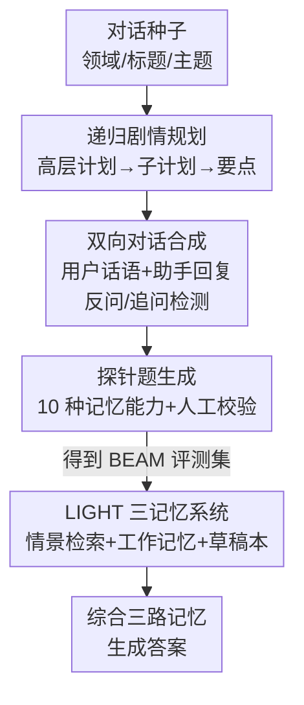

# Beyond a Million Tokens: Benchmarking and Enhancing Long-Term Memory in LLMs

**会议**: ICLR2026  
**OpenReview**: [https://openreview.net/forum?id=y59hf5lrMn](https://openreview.net/forum?id=y59hf5lrMn)  
**代码**: https://github.com/mohammadtavakoli78/BEAM  
**领域**: LLM 评测 / 长期记忆 / 长上下文  
**关键词**: 长期记忆, 对话评测, 合成数据, 记忆增强, RAG

## 一句话总结
针对现有长对话记忆评测「话题割裂、领域狭窄、只考简单召回」三大毛病，本文先用一套递归剧情规划的合成流水线造出 BEAM（100 段最长 10M token 的连贯对话 + 2000 道覆盖 10 种记忆能力的探针题），再提出受人类认知启发、把「情景记忆 + 工作记忆 + 草稿本」三套记忆系统拼在一起的 LIGHT 框架，在 BEAM 上相比最强 baseline 平均提升 3.5%–12.69%。

## 研究背景与动机
**领域现状**：LLM 被大量部署到多轮对话、RAG 问答、长文档/代码分析等需要「记住很久以前说过什么」的场景，催生了 Gemini 这类 1M token 上下文窗口的模型。要衡量这些模型到底能不能用好长对话历史，就得有合适的长期记忆 benchmark。

**现有痛点**：当下的长对话记忆评测有三个根本缺陷。第一，多数 benchmark 是把不同用户的若干段短对话**人工拼接**成长对话，导致话题之间硬切、叙事不连贯——而这种拼接其实把任务做简单了，因为各段彼此孤立、很容易被切开定位，根本不需要真正的长程推理。第二，数据领域**狭窄**，大多只覆盖个人生活场景，大量真实应用领域没有被覆盖。第三，考法**单一**，几乎只考简单的上下文召回，忽略了矛盾消解、识别信息演化、指令遵循这些同样关键的记忆能力。

**核心矛盾**：要造出又长（百万乃至千万 token）、又连贯、又话题多样、还能细分考十种记忆能力的对话数据，靠人工标注根本不现实；而靠拼接短对话又会破坏连贯性、让评测失真。长度、连贯性、能力覆盖三者之间存在张力。

**本文目标**：拆成两个子问题——(1) 如何**自动**生成长且连贯、领域多样、带细粒度探针题的对话数据，作为评测基准；(2) 在普遍只有 1M 上下文（甚至更短）的现实约束下，如何让模型在超长对话里**更好地记住并调用**历史信息。

**切入角度**：作者把「写一段超长连贯对话」当成一个**递归剧情规划**问题——先定高层剧情，再逐层分解成子剧情/要点，最后展开成按时间顺序的用户-助手轮次；并借鉴人类认知科学里「情景记忆 / 工作记忆 / 草稿本」的分工，把记忆增强拆成三套互补的子系统。

**核心 idea**：用「自顶向下递归生成剧情 + 人工校验探针题」造出 BEAM 评测集，再用「情景检索 + 工作记忆 + 可过滤草稿本」三记忆系统的 LIGHT 框架，把长对话记忆从「塞进上下文窗口硬读」升级成「分层检索与累积」。

## 方法详解

### 整体框架
本文有两个并列的产物：一个评测基准 **BEAM** 和一个记忆增强方法 **LIGHT**。BEAM 解决「拿什么考」，LIGHT 解决「怎么让模型考得更好」。

BEAM 的数据生成是一条五阶段流水线：从一个对话种子（领域、标题、主题、子话题）出发，先生成高层**对话规划**并递归分解成子规划；再据此按时间顺序生成**用户话语**；接着在角色扮演设定下生成**助手回复**（中间穿插反问检测与追问检测两个交互控制模块，让对话双向自然）；然后针对十种记忆能力自动生成**探针题**；最后由人工**校验过滤**掉无效题并为有效题构造评分 nugget。对于 10M token 这种单个规划装不下的超长对话，作者改用十个互锁的子规划拼成一条更长的连贯故事线。

LIGHT 则是推理时的记忆架构：给定关于对话 $T=\{t_i\}_{i=1}^{|T|}$ 的问题 $x$，框架并行地从三个记忆里取料——情景记忆里检索 $k$ 段相关片段 $E=R(x,k,T)$、工作记忆取最近 $z$ 对话轮 $W=\{t_{|T|-i}\}_{i=0}^{z}$、预先构造好的草稿本 $S_{|T|}$ 经过过滤函数得到与问题相关的子集 $S_x=f(S_{|T|},x)$，最后让模型 $\pi$ 综合三者生成答案 $y=\pi(x,E,W,S_x)$。

### 关键设计

**1. 递归剧情规划：把「写超长连贯对话」拆成可控的自顶向下生成**

针对拼接式数据「话题硬切、不连贯」的痛点，BEAM 不拼短对话，而是先用 LLM 从种子生成一份**对话规划**作为脚手架：种子包含领域、标题与主题、子话题、一组刻画演化方向的叙事（如职业发展、目标变化）、一个采样自 MBTI 性格的用户画像、一张约束过的人物关系图、以及一条明确时间线。规划由 $N$ 个子规划组成，每个子规划含 $M$ 个要点，每个要点 = 一条叙事 + 它在故事里的角色描述 + 一个时间锚点。128K/500K/1M 的对话用单份规划即可；10M 则要造十份互锁规划，作者给了两种拼法：**Sequential Expansion**（全局种子定开头，后续种子代表依次发生的事件，每份规划以前一份为条件保持连续）和 **Hierarchical Decomposition**（把主种子分解成十个分别覆盖某话题/时段的子种子，如一次国际旅行：前三份准备、中五份行程、后两份回顾）。两种拼法都让用户核心关系（如父母）保持不变、只逐渐引入新熟人来反映情境演化。这样每份规划带显式话题与时间边界，生成新规划时还以「先前规划的摘要 + 未来种子」为条件，从而能提前埋伏笔（如为出行日期预订车票），保证整条故事线连贯而不冗余。

**2. 双向对话合成：用反问与追问让合成对话像真人交互**

光按规划展开「用户问一句、助手答一句」会显得机械。作者先从子规划生成用户话语：每个子规划的 $M$ 个要点被切成 $K$ 个等长连续 batch，逐 batch 让 LLaMA-3.3 70B 生成 $I$ 个用户问题——分 batch 是为了收窄模型注意力、减少重复和低质输出，$K$、$I$ 按领域和目标长度手工设定以卡住 token 预算。助手回复则在角色扮演里迭代生成：助手模型以种子、先前子规划、最近 $M$ 轮摘要和更早轮的压缩摘要为条件作答，随后两个控制模块介入——**反问检测**判断助手回复里是否含需要用户回应的问题，若有则交给用户模型生成回应，循环到不再出现反问或达到阈值 $\delta_1=2$；**追问检测**则根据话题复杂度、歧义、回答不完整等判断用户是否会自然追问，若需要就生成一个追问（同样受阈值 $\delta_2=2$ 限制）。这两个模块让对话呈现双向、带上下文指代和澄清的真实人机互动质感。

**3. 十种记忆能力 + nugget 评分：把「记得住」拆成可细测的维度**

针对旧 benchmark「只考简单召回」的痛点，BEAM 评测十种互补能力——其中七种沿用前人、三种为本文新增：**指令遵循**（长上下文里持续遵守用户约束）、**事件排序**（识别并重建信息演化的先后顺序）、**矛盾消解**（检测并调和相隔很远的不一致陈述）。另外还有弃权（证据缺失时拒答）、信息抽取、知识更新、多跳推理、偏好遵循、摘要、时序推理。探针题由 GPT-4.1-mini 先选要点、再生成「问题 + 候选答案 + 来源消息 id」，10M 对话用滑动窗口跨十份互锁规划处理，最后由人工校验保留有效题、每能力每对话选两题（共 20 题/对话）。评分用 **nugget** 机制：把理想答案拆成原子、自包含的最小语义判据，由 LLM 裁判对每个 nugget 打 0/0.5/1 再平均得到能力级分数；唯一例外是事件排序，因为它同时取决于召回与顺序，改用 **Kendall tau-b** 系数，并先用 LLM 等价检测器把系统回答里的事件和 nugget 对齐，再在对齐序列上计算，同时刻画召回与排序保真度。

**4. LIGHT 三记忆系统：情景检索 + 工作记忆 + 可过滤草稿本**

LIGHT 模仿人类认知里的三种机制。**情景记忆**：每过一个用户-助手轮，就用 Qwen2.5-32B-AWQ 抽取键值对（key 是实体、value 是属性/描述）与轮摘要，用 BAAI/bge-small-en-v1.5 嵌入后存进向量库当 key、原始对话片段当 value；检索时把问题嵌入后取 top-$k$ 最近邻返回对应原文片段，相当于「事件级」的海马式记忆痕迹。**工作记忆**：直接取最近 $z$ 对话轮，提供短期上下文。**草稿本**：对每对话轮用 Qwen2.5-32B-AWQ 推理出语义知识、自传细节、未来意图、上下文元数据等显要内容，迭代合并历史草稿；一旦草稿超过 30K token 阈值（已远短于原始对话），就由 GPT-4.1-nano 压缩成 15K token 摘要，从而保持效率与长期连贯。和情景索引不同，草稿本不进检索库、而是直接作为上下文喂给模型。推理时草稿本还要经**过滤函数 $f$**：先用语义分块切成连贯 chunk，再让 Qwen2.5-32B-AWQ 对每个 chunk 打二元相关性标签，只留相关 chunk，得到一份针对当前问题的浓缩草稿。三路记忆各司其职：情景检索保证能精确回到原文、工作记忆保住近期细节、草稿本保住跨事件的高层抽象。

## 实验关键数据

### 主实验
在 BEAM 上对比四个 backbone（Qwen2.5-32B-AWQ、Llama-4-Maverick-fp8、Gemini-2.0-flash、GPT-4.1-nano）的三种用法：Vanilla（整段历史塞进长上下文）、RAG（每轮当文档、检索 top-5）、Ours（LIGHT）。下表为 100K token 长度下的平均 nugget 分数（满分 1）：

| 长度 | 方法 | Qwen2.5 | Llama Maverick | Gemini 2 Flash | GPT-4.1-nano |
|------|------|---------|----------------|----------------|--------------|
| 100K | Vanilla | 0.280 | 0.240 | 0.242 | 0.239 |
| 100K | RAG | 0.269 | 0.323 | 0.280 | 0.309 |
| 100K | Ours (LIGHT) | **0.311** | **0.358** | **0.294** | **0.345** |

LIGHT 在四个模型上都是最高的，相比各自最强 baseline 平均提升 3.5%–12.69%（视 backbone 和对话长度而定）。一个关键观察是：即便是 1M 上下文窗口的模型，随对话变长性能也**明显下滑**——说明「窗口够大」并不等于「记得住」，长上下文模型在真正连贯的超长对话上仍然吃力。

### 消融实验
作者做了消融以确认每个记忆组件的贡献（情景检索 / 工作记忆 / 草稿本三者缺一不可）：

| 配置 | 说明 |
|------|------|
| Full LIGHT | 情景 + 工作 + 草稿本三路完整 |
| w/o 草稿本 | 失去跨事件高层抽象，多跳/摘要类能力下降 |
| w/o 情景检索 | 失去精确回原文能力，信息抽取类下降 |
| w/o 工作记忆 | 失去近期上下文，时序/偏好类受影响 |

### 关键发现
- 不同能力上各方法强弱分化明显：RAG 在「弃权」上往往最高（检索不到证据更容易拒答），而 LIGHT 在信息抽取、多跳推理、摘要、偏好遵循等需要整合分散证据的能力上提升最大（如 100K 下 Summarization 从 Vanilla 的 0.018–0.128 提到 0.139–0.238）。
- 长上下文模型「越长越差」是普遍现象，即使支持 1M token；10M 长度下四个模型都不支持，只能在最近片段上评测，凸显真实超长记忆仍是开放难题。
- 矛盾消解、事件排序这类新增能力分数普遍偏低（矛盾消解多在 0.0x 量级），说明当前模型在「跨远距离调和不一致」上几乎还没学会，是 benchmark 暴露出的硬骨头。

## 亮点与洞察
- **把数据生成当成递归剧情规划**：用「高层计划→子计划→要点→展开」的自顶向下分解，配合时间锚点和先前摘要条件化，真正造出连贯而非拼接的超长对话——这套思路可迁移到任何需要长连贯合成语料的场景（长文档、长任务轨迹）。
- **三记忆分工对应三类失败**：情景检索治「回不到原文」、工作记忆治「忘了刚说的」、草稿本治「跨事件抽象丢失」，把模糊的「记忆」问题拆成可单独优化、可单独消融的三块，工程上很干净。
- **草稿本「先攒后压」的预算控制**：30K 攒、超了压成 15K，用一个固定阈值把上下文成本卡死，而不是无限增长——这种「带压缩阈值的累积记忆」很适合搬到长程 agent 的记忆模块。
- **暴露了「大窗口≠强记忆」**：1M 上下文模型随长度退化、10M 根本跑不动，提醒大家长上下文不是长期记忆的银弹，分层检索与外部记忆仍不可或缺。

## 局限与展望
- **数据是 LLM 合成的**：对话、探针题、候选答案都由 LLM 生成（虽有人工校验探针题），合成数据可能带有生成模型自身的偏好与分布偏差，与真实人类长对话仍有 gap。
- **10M 评测受算力限制**：唯一支持 10M 的 Llama-4-Scout 因算力没能纳入实验，四个被测模型都只能在最近片段上评，真正的千万 token 端到端记忆其实没被完整测到。
- **LIGHT 依赖多个外部模型协同**：键值抽取、嵌入、草稿压缩、相关性过滤分别用不同模型（Qwen2.5-32B、bge-small、GPT-4.1-nano），系统较重，延迟与成本未充分讨论，部署成本是现实门槛。
- **新增能力分数极低**：矛盾消解等能力当前模型几乎做不动，benchmark 把问题摆出来了，但方法侧并未针对这些硬能力专门设计，留作后续。

## 相关工作与启发
- **vs 拼接式长对话 benchmark（如 LoCoMo 等）**: 它们把不同用户的短对话拼成长对话，话题硬切、各段易分离，本文用递归剧情规划生成单一连贯长故事，迫使模型做真正的长程推理，连贯性和难度都更高。
- **vs 朴素 RAG**: RAG 把每轮当文档检索 top-k，只有「情景召回」一条路；LIGHT 在此之上加了工作记忆和可过滤草稿本两路，覆盖近期细节与跨事件抽象，因此在多跳、摘要、偏好等整合型能力上显著超过 RAG。
- **vs 长上下文直读（Vanilla）**: 直接塞满 1M 窗口在长对话上随长度退化，且 10M 直接装不下；LIGHT 用 32K 上下文 + 分层检索就超过了塞满窗口的做法，说明「检索+累积」比「硬读全文」更可扩展。

## 评分
- 新颖性: ⭐⭐⭐⭐⭐ 递归剧情规划造连贯 10M 对话 + 三记忆系统，benchmark 和方法都有原创性
- 实验充分度: ⭐⭐⭐⭐ 四 backbone × 三方法 × 多长度 × 十能力的矩阵评测加消融，但 10M 未能完整测
- 写作质量: ⭐⭐⭐⭐ 流水线和记忆系统讲得清晰，公式与图配套，细节多在附录
- 价值: ⭐⭐⭐⭐⭐ 提供了高质量长期记忆评测基准 + 可复用的记忆增强框架，且全部开源

<!-- RELATED:START -->

## 相关论文

- [\[NeurIPS 2025\] MEMTRACK: Evaluating Long-Term Memory and State Tracking in Multi-Platform Dynamic Agent Environments](../../NeurIPS2025/llm_evaluation/memtrack_evaluating_long-term_memory_and_state_tracking_in_multi-platform_dynami.md)
- [\[ICLR 2026\] LFQA-E: Carefully Benchmarking Long-form QA Evaluation](lfqa-e_carefully_benchmarking_long-form_qa_evaluation.md)
- [\[ICLR 2026\] Can You Hear Me Now? A Benchmark for Long-Range Graph Propagation and Beyond](can_you_hear_me_now_a_benchmark_for_long-range_graph_propagation_and_beyond.md)
- [\[ICLR 2026\] Benchmarking Overton Pluralism in LLMs](benchmarking_overton_pluralism_in_llms.md)
- [\[AAAI 2026\] BCWildfire: A Long-term Multi-factor Dataset and Deep Learning Benchmark for Boreal Wildfire Risk Prediction](../../AAAI2026/llm_evaluation/bcwildfire_a_long-term_multi-factor_dataset_and_deep_learning_benchmark_for_bore.md)

<!-- RELATED:END -->
