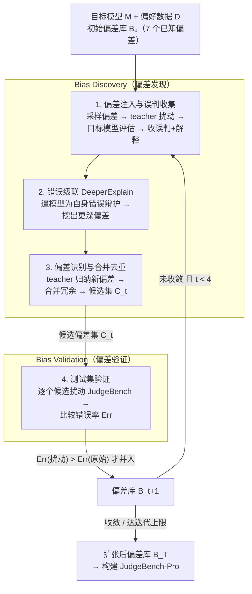

# BiasScope: Towards Automated Detection of Bias in LLM-as-a-Judge Evaluation

**会议**: ICLR 2026  
**arXiv**: [2602.09383](https://arxiv.org/abs/2602.09383)  
**代码**: [https://github.com](https://github.com) (有，含代码和JudgeBench-Pro数据)  
**领域**: LLM评测  
**关键词**: LLM-as-a-Judge, 偏差发现, 评估鲁棒性, 自动化偏差挖掘, JudgeBench-Pro

## 一句话总结
提出 BiasScope，一个完全由 LLM 驱动的迭代式框架，能自动、大规模地发现 LLM-as-a-Judge 中的潜在未知偏差，并基于此构建了更具挑战性的 JudgeBench-Pro 基准，在其上即使强大的 LLM 评估器错误率也超过 50%。

## 研究背景与动机

**领域现状**：LLM-as-a-Judge 已被广泛应用于基准构建、数据筛选和模型性能评估等场景，利用 LLM 作为"裁判"来大规模自动评估模型输出。

**现有痛点**：现有偏差研究主要局限于已知类型——聚焦验证位置偏差、长度偏差、自我偏好偏差等对评估结果的影响，缺乏对未知潜在偏差的系统性探索；而人工识别新偏差类型成本高、覆盖面窄，难以规模化；更根本的是传统方法停留在"被动发现"模式，依赖研究者预定义偏差列表再逐一验证，无法主动挖掘。

**核心矛盾**：LLM-as-a-Judge 被广泛使用，但评估的可靠性和鲁棒性无法保证——未知偏差可能比已知偏差影响更大，而目前缺少自动化、系统化发现这些偏差的手段。

**本文目标**：如何自动化、大规模地发现 LLM 评估过程中可能出现的未知偏差？

**切入角度**：利用一个 teacher model 对数据注入已知偏差来"刺激"目标模型暴露新的偏差倾向，再通过错误级联策略（DeeperExplain）进一步挖掘深层偏差，形成迭代式的偏差空间自扩展机制。

**核心 idea**：通过"偏差注入→误判收集→错误级联→偏差识别→验证入库"的迭代流程，将偏差发现从被动人工探索转变为主动自动化挖掘。

## 方法详解

### 整体框架
BiasScope 想解决的问题是：自动、大规模地把 LLM 评估器里那些"还没人命名"的未知偏差挖出来。它把偏差发现做成一个自我扩张的两阶段循环——给定目标模型 $M$、带正确偏好标签的数据集 $\mathcal{D}$ 和一个只装了 7 个已知偏差的初始偏差库 $\mathcal{B}_0$，框架在每一轮里先做 **Bias Discovery（偏差发现）**：用已知偏差扰动数据、逼目标模型犯错，再用错误级联策略把更深的偏差逼出来，最后由 teacher model 从错误里识别出新的偏差候选并合并去重；再做 **Bias Validation（偏差验证）**：在独立测试集上确认候选偏差是否真能让错误率上升，验证通过的偏差并入偏差库后进入下一轮。如此循环直到没有新的有效偏差出现、偏差库稳定，或达到最大迭代次数（默认 4），最终产出扩张后的偏差库 $\mathcal{B}_T$。整个过程不需要人工预定义偏差列表，偏差空间靠"已知偏差撬动未知偏差"自己长大。

### 关键设计

**1. 偏差注入与误判收集：用已知偏差去"撬"模型暴露新倾向**

针对"被动发现"这个痛点——传统方法只能验证研究者预先列好的偏差——BiasScope 反过来主动制造偏差场景。每轮从偏差库中随机采样一个偏差 $b_k$，让 teacher model 按这个偏差对被拒绝回答 $y_i^r$ 做扰动生成 $\tilde{y}_i^r$（正确答案 $y_i^c$ 保持不变），拼成扰动数据集 $\tilde{\mathcal{D}}_t$。目标模型在上面做 pair-wise 评估，凡是被诱导选了被拒绝回答的样本都被收下来，连同模型给出的解释 $E_i$ 一起留作后续分析。背后的赌注是：一个已知偏差能把模型推到容易出错的状态，而模型在这个状态下的错误解释里，往往夹带着别的、还没被命名的偏差倾向。

**2. 错误级联策略 (DeeperExplain)：让模型"解释自己的错误"以逼出更深的偏差**

光看模型第一轮的错误解释，常常不足以把潜在偏差完全暴露出来。DeeperExplain 的做法是对着这个已经错了的判断继续追问，让模型进一步为自己的错误推理辩护：

$$E_i' = \text{DeeperExplain}(x_i, y_i^c, \tilde{y}_i^r, E_i; M)$$

模型越是顺着错误往下解释，越会把更多隐藏的判断偏好讲出来，从而把单次扰动能挖到的偏差深度往下推一层。消融实验印证了这一点：开启该策略后，Qwen2.5-7B 发现的偏差从 25 个升到 27 个，Qwen2.5-1.5B 从 43 个升到 48 个，约多挖出 10%。

**3. 偏差识别与合并去重：保证偏差库里每一条都是独立的**

收集到的误判数据交给 teacher model 来归纳，从中识别出本轮的新偏差候选集 $\tilde{\mathcal{B}}_t$。但新候选很可能只是把库里已有的偏差换了个说法、实则重复，所以要做去重：把候选和现有库拼成 $\mathcal{B}_t^{\text{temp}} = \tilde{\mathcal{B}}_t \cup \mathcal{B}_t$，再逐对做相似性比较、把冗余的合并掉。这一步保证最终偏差集互相独立、不重叠，避免同一种偏差被反复计数、虚高了"发现数"。

**4. 测试集验证：用客观标注的数据筛掉"假偏差"**

候选偏差不一定真有破坏力，得拿独立测试集（JudgeBench，带客观正确答案）来检验。对每个候选偏差 $b_j$，让 teacher model 按它扰动整个测试集，比较目标模型在扰动数据和原始数据上的错误率：只有当 $\text{Err}(\tilde{\mathcal{D}}_j^{\text{test}}) > \text{Err}(\mathcal{D}^{\text{test}})$，即这个偏差确实把错误率推高了，才算有效、并入偏差库。用客观标注的测试集而非主观偏好数据来把这道关卡，是为了把"模型只是口味不同"和"模型真被偏差带偏了"区分开，排除主观噪声。

### 实现与运行设置
- 采用 pair-wise 评估方式识别偏差
- 评估时随机交换选项位置以排除位置偏差干扰
- 使用贪心解码 + 固定随机种子确保可复现
- 初始偏差库包含 7 个已知偏差
- 最大迭代次数设为 4（多数模型可近收敛）

## 实验关键数据

### 主实验
在 7 个不同规模和家族的目标模型上运行 BiasScope，以 JudgeBench 为测试集：

| 目标模型 | 验证偏差数 | 原始Err(%) | BiasScope Err(%) | 提升 |
|----------|-----------|-----------|-----------------|------|
| Qwen2.5-1.5B-Instruct | 48 | 48.6 | 53.1 | +4.5 |
| InternLM3-8B-Instruct | 19 | 45.3 | 50.7 | +5.4 |
| Mistral-7B-Instruct-v0.3 | 41 | 43.9 | 51.2 | +7.3 |
| Qwen2.5-7B-Instruct | 27 | 43.4 | 48.1 | +4.7 |
| LLaMA-3.1-8B-Instruct | 29 | 41.7 | 52.5 | +10.8 |
| Qwen2.5-14B-Instruct | 19 | 37.7 | 47.8 | +10.1 |
| Qwen3-8B (Non-Thinking) | 14 | 36.9 | 42.7 | +5.8 |
| **平均** | - | - | - | **+6.9** |

### 消融实验

| 配置 | 关键指标 | 说明 |
|------|---------|------|
| Early-Validate (默认) | LLaMA: 29偏差, Err 52.5% | 每轮验证，发现更多偏差 |
| Late-Validate | LLaMA: 27偏差, Err 52.2% | 延迟验证，偏差数略少 |
| 有 DeeperExplain | Qwen2.5-7B: 27, 1.5B: 48 | 错误级联帮助挖掘更多偏差 |
| 无 DeeperExplain | Qwen2.5-7B: 25, 1.5B: 43 | 少发现约 10% 偏差 |
| GPT-OSS-120B 为 Teacher | LLaMA: 19偏差, Err 53.8% | 更强 teacher 发现更多有效偏差 |
| GPT-OSS-20B 为 Teacher | LLaMA: 9偏差, Err 47.7% | 弱 teacher 偏差数减半 |

### 关键发现
- **简单领域更易被偏差影响**：数学域原始错误率最低，但偏差注入后提升最大（+11.1%），说明任务简单时偏差更容易干扰判断
- **更强模型发现更少偏差**：Qwen2.5 系列随参数增大，可发现偏差数递减，强模型评估过程更稳定
- **长度不是错误率提升的根本原因**：截断实验表明多偏差扰动在控制长度后仍保持更高错误率（+2.2%），而纯长度偏差截断后降到基线以下（-2.5%）
- **偏差挖掘可迁移**：在 Qwen2.5-1.5B 上发现的偏差用于构建 JudgeBench-Pro 后，闭源模型（GPT-4o 等）也大幅降低表现

## JudgeBench-Pro 基准
- 基于 JudgeBench 620 个样本，每个生成 10 个偏差变体（6200个），经强模型对抗过滤+人工审核，最终得到 1178 个高质量样本
- 五个主流强模型中四个在 JudgeBench-Pro 上表现不优于随机猜测
- GPT-4o 错误率高达 74.7%，仅 Doubao-Seed-1-6 表现较好（20.4%）
- 被拒绝回答仅比原始长 8.4%，排除纯长度效应
- 人工标注 IAA (Fleiss' Kappa) = 0.92

## 偏差缓解验证
利用发现的偏差构建增强偏好数据进行 DPO 训练：
- 原始 UltraFeedback DPO 训练反而提升错误率（Mistral: 14.3→20.6%）
- 偏差增强版 DPO 训练降低错误率（Mistral: 14.3→13.3%, LLaMA: 21.5→20.3%）

## 亮点与洞察
- **错误级联策略**：利用模型"对自身错误的解释"来诱导更多错误暴露——这个"以错引错"的思路很巧妙，可以迁移到其他 red-teaming 场景
- **小模型挖掘偏差可迁移到大/闭源模型**：在成本友好的小开源模型上运行框架，发现的偏差同样能暴露 GPT-4o 等闭源模型的弱点，大幅降低实际使用门槛
- **从偏差发现到偏差缓解的闭环**：不只是发现问题，还用偏差增强数据做 DPO 来解决问题

## 局限与展望
- 偏差发现运行成本仍然较高，需要强大的 teacher model 和多轮迭代
- 偏差验证依赖于测试集有客观正确答案，对主观评估场景适用性有限
- 最大迭代次数仅为 4，可能遗漏更深层偏差
- 目前仅聚焦 pair-wise 评估范式，未覆盖 point-wise 或 reference-based 评估

## 相关工作与启发
- **vs CALM (Ye et al., 2024)**: CALM 用已知偏差构建基准量化偏差程度，属于"被动验证"；BiasScope 是"主动发现"，能挖掘未知偏差
- **vs JudgeBench (Tan et al., 2025)**: JudgeBench 提供客观标注的评估基准；BiasScope 在此基础上构建了更困难的 JudgeBench-Pro

## 评分
- 新颖性: ⭐⭐⭐⭐ 从被动验证已知偏差到主动挖掘未知偏差，框架设计有创新
- 实验充分度: ⭐⭐⭐⭐⭐ 7个模型、多个消融、可靠性验证、长度控制实验、DPO缓解验证、JudgeBench-Pro构建与评估，非常全面
- 写作质量: ⭐⭐⭐⭐ 结构清晰，公式形式化规范，图表配合良好
- 价值: ⭐⭐⭐⭐ 为 LLM-as-a-Judge 的鲁棒性评估提供了实用工具和新基准

<!-- RELATED:START -->

## 相关论文

- [\[ACL 2026\] Contrastive Decoding Mitigates Score Range Bias in LLM-as-a-Judge](../../ACL2026/llm_evaluation/contrastive_decoding_mitigates_score_range_bias_in_llm-as-a-judge.md)
- [\[ICLR 2026\] Talk, Evaluate, Diagnose: User-aware Agent Evaluation with Automated Error Analysis](talk_evaluate_diagnose_user-aware_agent_evaluation_with_automated_error_analysis.md)
- [\[ICLR 2026\] Preference Leakage: A Contamination Problem in LLM-as-a-judge](preference_leakage_a_contamination_problem_in_llm-as-a-judge.md)
- [\[ACL 2026\] Fin-Bias: Comprehensive Evaluation for LLM Decision-Making under human bias in Finance Domain](../../ACL2026/llm_evaluation/fin-bias_comprehensive_evaluation_for_llm_decision-making_under_human_bias_in_fi.md)
- [\[ICLR 2026\] Rethinking LLM-as-a-Judge: Representation-as-a-Judge with Small Language Models via Semantic Capacity Asymmetry](rethinking_llm-as-a-judge_representation-as-a-judge_with_small_language_models_v.md)

<!-- RELATED:END -->
