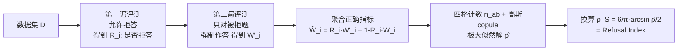

# Can LLMs Refuse Questions They Do Not Know? Measuring Knowledge-Aware Refusal in Factual Tasks

**会议**: ICLR 2026  
**OpenReview**: [https://openreview.net/forum?id=9gJBhkLRat](https://openreview.net/forum?id=9gJBhkLRat)  
**代码**: 待确认  
**领域**: LLM 评测 / 事实可靠性 / 拒答校准  
**关键词**: Refusal Index、知识感知拒答、校准、幻觉评测、SimpleQA  

## 一句话总结
本文提出 **Refusal Index (RI)**——把"拒答概率"与"出错概率"之间的 Spearman 秩相关作为度量，用一个只需两遍标准评测的轻量流程，量化 LLM "对不会的问题主动拒答"这一被现有指标忽视的能力。

## 研究背景与动机
- **领域现状**：LLM 在事实型任务上越用越多，但普遍校准很差——经常以高置信度给出错误答案。一个直观的修复是让模型对超出知识边界的问题"拒答"（输出"我没有足够信息……"），近期工作用 prompting 或微调来增强这种拒答。
- **现有痛点**：现有指标抓不住"拒答是否拒对了"。① **基于拒答率的启发式指标**（Refusal Rate、Correct given Attempted、SimpleQA 的 F-score、Weighted Score）只是用拒答率惩罚过度拒答的拼凑公式，并不刻画"拒答 ↔ 错误"的内在相关性——把模型 prompt 得更谨慎就能拉高 F-score（最高波动达 70%），但能力没变。② **基于校准的指标**（ECE、AUROC 配 verbalized confidence / 辅助校准器）依赖额外的置信度估计或辅助模型，得到的不确定度并不直接等于模型的拒答概率，换个估计器结论就翻盘。
- **核心矛盾**：拒答行为是黑盒、单次只观测到一个文本输出，**拒答概率本身不可见**；而我们真正想衡量的是"难题更该被拒"这一排序关系，绝对差异型指标又会被整体拒答率牵着走。
- **本文目标**：定义一个 **忠实（faithful）、稳定（consistent）、直接（direct）** 的指标，仅凭黑盒拒答决策就能衡量知识感知拒答能力，且不随拒答率漂移。
- **核心 idea（RI）**：**用秩相关而非绝对误差** 衡量拒答质量——好的模型应当随题目变难而单调增加拒答概率，于是把"拒答概率 vs 出错概率"的 Spearman 相关定义为 RI，并用**两遍评测 + 高斯 copula** 从只能观测到的二值指标里反推出这个隐变量相关。

## 方法详解

### 整体框架
RI 的定义层面是一句话：拒答概率 $r_i$ 与出错概率 $w_i$ 之间的 Spearman 秩相关 $\rho_S = \mathrm{Corr}(\mathrm{Rank}(r_i),\mathrm{Rank}(w_i))$。但 $r_i$、$w_i$ 都是隐变量、单次评测只能看到二值的"是否拒答 $R_i$"和"是否答错 $W_i$"。于是方法的核心是一条估计管线：先把 $(R,W)$ 建模成一对相关高斯隐变量过阈值的结果（四分相关 / tetrachoric 设定），用高斯 copula 把它们的联合分布只用一个相关参数 $\rho$ 表示；再设计**两遍评测**采集到估计 $\rho$ 所需的统计量；最后极大似然解出 $\rho$ 并换算成可解释的 $\rho_S$。

### 关键设计

**1. 把拒答质量定义成秩相关而非绝对差：RI 的本体。** 作者刻意区别于 ECE 这类"衡量 $r_i$ 与 $w_i$ 绝对差异"的校准指标，转而只看二者的**排序一致性**：理想模型满足 $w_i \le w_j \iff P(f_{LM}(x_i)=\bot) \le P(f_{LM}(x_j)=\bot)$，即越容易错的题越容易被拒。这样定义带来一个关键好处——绝对差异型指标对整体拒答率的变化极其敏感（模型很容易整体调高/调低拒答率，但这不代表它更会判断难题），而判别型的秩相关只比较样本间相对次序，因此天然对拒答率漂移鲁棒。RI 因此被定位成一个"判别性"度量，抓住的是知识感知拒答的本质。

**2. 高斯 copula + 四分相关把隐变量相关变成可估参数。** 直接算 $\rho_S$ 需要每题的连续拒答概率，但评测里观测不到。作者用高斯 copula $C(u,v)=\Phi_\rho(\Phi^{-1}(u),\Phi^{-1}(v))$ 建模 $(r_i,w_i)$ 的联合分布，其中 copula 只携带依赖结构 $\rho$、对两个边缘分布不作任何假设。于是不必去估边缘 CDF $F_r,F_e$，而是把 $(R,\hat W)$ 视为一对相关系数为 $\rho$ 的标准二元正态 $(Z_R,Z_W)$ 在阈值 $\tau_R=\Phi^{-1}(1-r),\ \tau_W=\Phi^{-1}(1-\mu)$ 处取阈值的结果（$r$ 为经验拒答率、$\mu$ 为错误率）。四格联合概率由 $p_{11}(\rho)=\bar\Phi_2(\tau_R,\tau_W;\rho)$ 给出，其余三格由边缘约束推得。最后极大化多项式对数似然 $\ell(\rho)=\sum_{a,b}n_{ab}\log p_{ab}(\rho)$ 解出 $\hat\rho$，再用 $\rho_S=\frac{6}{\pi}\arcsin\frac{\hat\rho}{2}$ 换算成 Spearman 相关。整套推断只依赖四格计数 $n_{ab}$，完全黑盒。

**3. 两遍评测：从单次文本输出里"造出"两个二值观测。** 估计 $\rho$ 需要同时观测每题的拒答指标 $R_i$ 和正确指标 $W_i$，但允许拒答时被拒的题没有正确性标签。作者设计两遍流程：**第一遍**用标准设定（系统提示"不确定就拒答"）跑出 $R_i$，把回答分成 correct / incorrect / refused；**第二遍**换成"必须作答、禁止拒答"的系统提示，**只对第一遍被拒的题**重跑，拿到这些题的正确性 $W'_i$。随后用聚合正确指标 $\hat W_i = R_i\cdot W'_i + (1-R_i)\cdot W_i$（即"若模型作答时它对不对"）拼出完整的 $(R,\hat W)$ 计数。这样无需多次采样、无需训练辅助校准器，只用两遍常规评测就把不可观测的相关估计了出来——这正是 RI"直接、轻量"的来源。

## 实验关键数据
覆盖 **16 个模型**（Claude / GPT-4.1 / Gemini / Qwen3 / Llama / Mistral / GLM / DeepSeek 等）× **5 个数据集**（SimpleQA、PreciseWikiQA、FaithEval 三个子集）。

### 主实验：RI 跨拒答率的稳定性（SimpleQA）
用 4 个不同拒答倾向的系统提示，对比"最高拒答"与"最低拒答"两次跑分的归一化差异 $\Delta$ 和变异系数 CV（越低越稳）：

| 指标 | 平均 $\Delta$ | 平均 CV |
|---|---|---|
| Accuracy | −0.80 | 0.31 |
| Refusal Rate | +0.98 | 0.39 |
| C/A | +0.49 | 0.19 |
| F-score | −0.54 | 0.22 |
| Weighted | −0.48 | 0.47 |
| **RI** | **+0.07** | **0.09** |

RI 的波动比启发式指标低约 **70%**——拒答率被 prompt 改变只是平移了拒答概率分布，没有改变拒答与错误的内在相关。

### 校准一致性 / 排序稳定性
- **与 AUROC（P(Answering)，100 次采样）的相关**：RI 达 **85.8%**，远超 C/A（37.6%）、F-score（−24.6%）、Weighted（−73.3%），且计算成本低得多。
- **排序稳定性**（Kendall's W↑ / Winner Entropy↓，去除正确率与拒答率单调效应后）：F-score、Weighted 的 W 在去效应后从 ~0.90 暴跌到 ~0.10；**RI 仍保持 ~0.47–0.50 的 W**，说明它捕捉的是不被准确率/拒答率解释的内在能力。

### 关键发现
- **能力鸿沟持续存在**：LLM 事实准确率很高，但拒答行为不可靠且脆弱；提示模型更谨慎只提高了 C/A，RI 仍远低于满分（拒答率 = 错误率即消除系统偏差后，离"完美拒答"仍有显著差距）。
- **模型家族是最强预测因子**：RI 与参数规模、准确率、拒答率都无强相关（RI vs 正确率 $R^2=0.242$）。Claude 与 Qwen（除 Qwen-235B）稳定高于回归线，Gemini / GPT-4.1 / GLM 全在线下——训练数据与流水线比模型规模更决定拒答质量。
- **对噪声上下文敏感**：当上下文里没有 ground truth 时（FaithEval 的 Inconsistency=0.24、Unanswerable=0.32）拒答能力明显退化，远低于 PreciseWiki（0.48）/ Counterfactual（0.56），说明拒答过度依赖训练数据或上下文里的部分线索。

## 亮点与洞察
- **指标设计的范式切换**：从"绝对差异/准确率奖励"切到"秩相关"，一举解决了校准指标对拒答率敏感、启发式指标可被 prompt 刷分这两大顽疾，理论上也证明了 iso-RI 曲线两端固定、只刻画凸性。
- **统计建模优雅**：用四分相关 + 高斯 copula 把"不可观测的连续概率相关"约化成"四格计数的极大似然"，把昂贵的多次采样/辅助校准器替换成两遍标准评测，可落地性强。
- **揭示被忽视的可靠性维度**：高准确率 ≠ 会拒答，且这道鸿沟无法靠调准确率或拒答率填平，为"全面事实性评测"补上了一块。

## 局限与展望
- RI 把"知道"等价为"能答对"，对部分正确 / 长文本生成不适用，沿用 SimpleQA 式的原子短答案设定，迁移到开放生成需重新定义正确性。
- 两遍评测假设第二遍强制作答能忠实暴露模型"本会不会"，但强制作答下的行为分布可能与自然作答不同；高斯 copula 的正态性假设虽做了拟合优度检验，仍是模型化简。
- Inconsistency / Unanswerable 子集缺 ground truth，需用 PreciseWikiQA 与 FaithEval 1:1 混合才能算 RI，覆盖范围受限。
- 论文给出 RI 这把"尺子"，但如何**训练**模型提高 RI（而非仅评测）留作后续。

## 相关工作与启发
- **事实性评测**：SimpleQA、FActScore、TruthfulQA 等比对外部源衡量正确性；本文不直接测幻觉率，而是测拒答行为的校准。
- **黑盒校准**：verbalized confidence、APRICOT/辅助校准器、P(True)、P(Answering) 多次采样——本文证明这些估计器彼此不一致，只有采样法能暴露 RI 抓到的过度自信。
- **启发**：对任何需要"会就答、不会就停"的系统（RAG、Agent、专家域问答），RI 提供了一个不被拒答率作弊、可黑盒计算的可靠性指标；其"两遍评测 + copula 反推隐相关"的思路也可迁移到其他"只观测二值、想估连续相关"的评测场景。

## 评分
- **新颖性**: ⭐⭐⭐⭐⭐ 把知识感知拒答形式化为拒答概率与出错概率的秩相关，并用 copula + 两遍评测落地，是一个干净且原创的指标定义。
- **实验充分度**: ⭐⭐⭐⭐ 16 模型 × 5 数据集，系统验证了稳定性、校准一致性、排序稳定性与三类幻觉场景，覆盖全面；偏评测分析、缺"如何提升 RI"的训练侧实验。
- **写作质量**: ⭐⭐⭐⭐ 动机—定义—估计—验证逻辑清晰，三大性质（忠实/稳定/直接）贯穿全文；copula 推断部分对非统计读者略有门槛。
- **价值**: ⭐⭐⭐⭐⭐ 补上事实性评测长期忽视的"拒答可靠性"维度，指标轻量可复用，对 LLM 可信部署有直接实用价值。

<!-- RELATED:START -->

## 相关论文

- [\[ICLR 2026\] Do LLM Agents Know How to Ground, Recover, and Assess? Evaluating Epistemic Competence in Information-Seeking Agents](do_llm_agents_know_how_to_ground_recover_and_assess_evaluating_epistemic_compete.md)
- [\[ICLR 2026\] Choices Speak Louder than Questions](choices_speak_louder_than_questions.md)
- [\[ICLR 2026\] Harnessing Temporal Databases for Systematic Evaluation of Factual Time-Sensitive Question-Answering in LLMs](harnessing_temporal_databases_for_systematic_evaluation_of_factual_time-sensitiv.md)
- [\[ICLR 2026\] Measuring LLM Novelty as the Frontier of Original and High-Quality Output](measuring_llm_novelty_as_the_frontier_of_original_and_high-quality_output.md)
- [\[ICLR 2026\] Rethinking LLM Evaluation: Can We Evaluate LLMs with 200× Less Data?](rethinking_llm_evaluation_can_we_evaluate_llms_with_200_less_data.md)

<!-- RELATED:END -->
