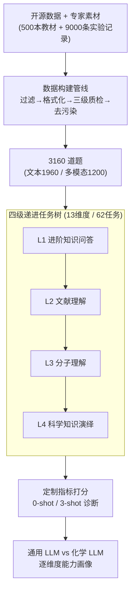

# ChemEval: A Multi-level and Fine-grained Chemical Capability Evaluation for Large Language Models

**会议**: ICLR 2026  
**OpenReview**: [https://openreview.net/forum?id=JrqjSkEPrX](https://openreview.net/forum?id=JrqjSkEPrX)  
**代码**: https://github.com/USTC-StarTeam/ChemEval  
**领域**: LLM 评测 / 化学 AI / 多模态  
**关键词**: 化学评测、分层 benchmark、领域 LLM、多模态化学、细粒度诊断

## 一句话总结
ChemEval 把 LLM 的化学能力拆成「概念 → 文献 → 分子 → 推理」四级递进、13 个维度、62 个任务（含文本与多模态），用化学专家手工构建的 3160 道题做细粒度诊断，发现通用大模型擅长读文献、做不了深层化学推理，而化学专用模型懂术语却几乎丧失指令跟随能力。

## 研究背景与动机

**领域现状**：LLM 进入化学领域后，既有通用大模型（GPT-4o、Qwen、DeepSeek）被直接拿来做化学任务，也有专门微调的化学模型（ChemDFM、ChemLLM、LlaSMol、ChemSpark）。要判断它们到底行不行，得有靠谱的评测基准。

**现有痛点**：通用 benchmark（MMLU、XieZhi）几乎不碰化学的深层知识；科学类的 SciEval 里化学任务过于简单；化学专用的 ChemLLMbench 只有 8 类任务、且数据未经审校，ChemBench 七千道题却全是选择题、缺开放式任务、对合成路径这类实验设计任务没有合适指标，MaCBench 引入了多模态但任务多样性同样受限。更关键的是，几乎没有 benchmark 去考核 LLM「从正文和表格里抽取化学信息」这种化学研究者真正关心的能力。

**核心矛盾**：现有评测要么覆盖面广但化学深度浅，要么化学专门但任务形式单一（选择题为主）、数据来源单一（套用公开数据集）。两边都没法回答「一个模型在化学科研全流程里到底强在哪、弱在哪」。

**本文目标**：构建一个分层、细粒度、能覆盖化学科研真实需求的评测框架，既要有从基础概念到研究生级推理的难度梯度，又要把文本与多模态（分子结构图、谱图）都纳入，还要有专家定制、防泄漏的高质量数据。

**切入角度**：从化学研究者的视角而非 NLP 视角设计任务——按化学认知的自然层级（先懂概念、再读文献、再认分子、最后做反应推理）组织能力维度，并刻意引入信息抽取、归纳生成等过去被忽略的任务。

**核心 idea**：用「四级递进 × 13 维度 × 62 任务」的分层任务树，配合专家手工撰写、严格去污染的数据管线，把 LLM 的化学能力做成可逐项诊断的体检表。

## 方法详解

### 整体框架
ChemEval 不是一个模型，而是一套评测体系，核心是两件事：一棵**分层任务树**和一条**数据构建管线**。任务树把化学能力按认知难度切成四个递进层级，每层下挂若干维度、每个维度再细分成具体任务，共 13 个维度、62 个任务；数据管线则负责把网络爬取的开源数据和专家手编的素材，经过过滤、格式化、三级质检和去污染，沉淀成 3160 道高质量题目，再为每道题配上零样本和 3-shot 指令，最后用一组按任务定制的指标（F1、Accuracy、BLEU、Tanimoto、NRMSE、LLM Score 等）打分。

四级任务树自下而上是：① **进阶知识问答**（懂不懂基础化学概念，含客观题与主观题，15 任务）→ ② **文献理解**（能不能从化学文献的文字和图表里抽信息、做归纳，含归纳生成 / 信息抽取 / 分子名识别，19 任务）→ ③ **分子理解**（认不认得分子，含分子式生成 / 翻译 / 性质预测 / 描述，15 任务）→ ④ **科学知识演绎**（会不会做反应推理，含逆合成分析 / 反应条件推荐 / 反应结果预测 / 反应机理分析，13 任务）。层级是递进的：后一层依赖前一层的能力，比如文献理解为归纳生成打底，分子理解为反应演绎打底。

### 关键设计

**1. 四级递进的分层任务树：把模糊的「化学能力」拆成可逐项体检的认知阶梯**

过去的化学 benchmark 要么是一堆平铺的选择题、要么只覆盖少数任务类型，结果是「模型化学能力强不强」只能给一个笼统结论，无法定位短板。ChemEval 的做法是按化学研究者真实的认知顺序，把能力切成四个**有依赖关系**的层级：进阶知识问答（L1，考概念与计算）、文献理解（L2，考从文字/图表抽取与归纳）、分子理解（L3，考分子式互转、性质预测、结构图解读）、科学知识演绎（L4，考逆合成、反应条件/结果/机理）。每一层下面再展开成 13 个维度、62 个任务，每个任务对应一个能力切片。这种「先概念、再文献、再分子、最后反应」的阶梯不是随便排的——L2 的文献理解为 L1 之上的归纳生成打底，L3 的分子认知是 L4 反应推理的前提，于是当某个模型在 L1/L2 表现好却在 L3/L4 崩盘时，就能直接读出它「会读不会推」的画像，而不是只看一个平均分。值得注意的是 62 个任务里 37 个是专家全新设计、25 个改编自社区开源任务，刻意补上了信息抽取、归纳生成这些过去 benchmark 缺失的维度。

**2. 文本 + 多模态双轨任务：用同一道题的两种形态显式考核跨模态对齐**

化学信息天然是多模态的——分子结构图、波谱图、表格里的反应条件都不是纯文本能表达的。ChemEval 在 3160 道题中划出 1960 道纯文本（18 开源 + 24 自建任务）和 1200 道多模态（12 开源 + 30 自建任务），覆盖分子式识别、谱图数据分析等需要看图的任务。关键设计在于：若干核心任务**同时**以文本和多模态两种形式出现，这样就能把同一个模型在「给文字描述」和「给结构图」下的表现直接对照，显式量化视觉-语言模型的跨模态对齐能力，而不是把文本能力和看图能力混在一个分数里。这让评测能回答「模型是真懂这个分子，还是只会背它的文字描述」这类此前难以分离的问题。

**3. 专家主导、严格去污染的数据构建管线：保证题目既贴近科研又不被训练集泄漏**

光靠开源数据覆盖不够、还容易和模型训练语料重叠，导致虚高分数。ChemEval 的数据管线分三步且重度依赖化学专家：**采集**阶段，一路从学术网站爬开源任务数据集（优先带官方测试集的），另一路由专家从约 500 本大学级教材/习题/试卷和约 9000 条合作实验室的真实实验记录里手工汇集；**过滤格式化**阶段，专家按任务不匹配、歧义、答案多值、信息过时、冗余五类标准剔除约 200 条（约占初始池 2%），并按七大化学学科（有机/无机/材料/分析/生化/物化/高分子）组织问答对；**质检与去污染**阶段，用「本科生标注 → 研究生交叉核验 → 教师终审」三级流水线确保答案严格基于事实，并把下游测试集与现有开源化学模型的训练语料逐条比对、清除重叠样本。尤其为防泄漏，教材习题不直接照搬，而是由专家以其为参照**重新撰写**对齐目标知识维度的新题，从源头上压住记忆刷分的空间。

### 损失函数 / 训练策略
ChemEval 是评测基准，不训练模型。评测侧的关键约定：所有 LLM 推理用贪心解码；通用模型走官方 API，化学专用模型在两张 A40 48GB 上本地跑；每个任务配零样本和 3-shot 两套指令（部分如化学论文摘要生成因上下文长度限制不纳入 3-shot）；指标按任务类型定制——多数任务用 F1 / Accuracy，分子相关用 Tanimoto 相似度、L2 距离、Exact Match，回归类用归一化均方根误差 NRMSE，开放生成类用 BLEU、Overlap 及由 GPT-4o 充当裁判的 LLM Score。

## 实验关键数据

### 主实验
在 13 个代表性文本任务上的 0-shot 表现（节选，指标随任务不同；↑ 越高越好，NRMSE 越低越好）：

| 层级·任务 | 指标 | Gemini-2.5-Pro | DeepSeek-R1 | OpenAI-o1 | GPT-4o | ChemSpark | ChemDFM | ChemLLM |
|-----------|------|------|------|------|------|------|------|------|
| L1 客观选择题 MCTask | Accuracy | 87.6 | 82.4 | 74.0 | 66.8 | 43.6 | 41.2 | 24.4 |
| L1 主观计算 CalcTask | LLM Score | 82.4 | 76.1 | 78.0 | 61.8 | 18.5 | 14.7 | 15.9 |
| L2 信息抽取 ProdE | Accuracy | 92.8 | 91.2 | 90.3 | 86.1 | 94.4 | 34.7 | 0.0 |
| L3 分子式生成 MolNG | Tanimoto | 71.1 | 56.1 | 49.8 | 39.3 | 74.8 | 47.1 | 0.0 |
| L4 反应机理分析 IMDer | LLM Score | 82.3 | 79.5 | 80.0 | 81.5 | 92.8 | 76.0 | 4.8 |
| L4 反应条件推荐 RRec | F1 | 0.7 | 21.9 | 25.6 | 15.8 | 63.7 | 13.1 | 0.0 |

总体两条主线非常清晰：**通用强推理模型**（Gemini-2.5-Pro、DeepSeek-R1、OpenAI-o1）在概念问答、文献理解上全面领先，但一到分子翻译、反应条件推荐这类硬化学任务就大幅掉分；**化学专用模型 ChemSpark**（iFLYTEK 的 Spark-Chemistry-X1-13B）在分子生成、反应机理、反应条件这些专业任务上反超所有通用大模型，但 ChemLLM、LlaSMol 这类化学模型在通用任务上几乎归零（ChemLLM 多个 F1 直接 0.0），暴露出微调带来的灾难性遗忘。

### 消融实验
3-shot 相对 0-shot 的变化（部分模型，末列括号为「显著上升 / 不变 / 显著下降」的任务数）：

| 模型 | 净效果 (↑, ˜, ↓) | 典型代表 |
|------|------|------|
| OpenAI-o1 | (9, 0, 1) | few-shot 几乎全面提升 |
| GPT-4o / Qwen2.5-72B | (7, 0, 3) | 多数任务受益 |
| Gemini-2.5-Pro | (6, 1, 3) | 受益但部分主观题略降 |
| Llama3.3-8B | (5, 0, 5) | 收益与损失各半 |
| ChemDFM | (4, 0, 6) | few-shot 反而更差 |
| ChemLLM | (1, 6, 3) | 大多没反应 |

### 关键发现
- **通用 vs 专用是两套互补画像**：通用 LLM 的强项来自优秀的文档理解与推理（读文献、做主观题），化学专用模型的强项来自术语和分子属性的专门训练；二者几乎在对方的弱区互补，说明现有训练范式还没有同时兼顾「会语言」和「懂化学」。
- **指令跟随是化学专用模型的命门**：ChemLLM、LlaSMol 在缺乏输出格式约束时会退回微调数据的固有模式，F1 常直接归零；这种指令跟随缺陷会严重削弱专业模型的实用价值，即便它们确有领域知识。
- **few-shot 收益与模型能力强相关**：强推理模型（o1 达 9 升 1 降）能稳定从示例获益，而化学专用模型（ChemDFM 6 降、ChemLLM 6 个不变）几乎吃不到 few-shot 红利，进一步印证其上下文学习与指令适应能力薄弱。
- **复杂定量任务上的「过度谨慎」**：面对需要量化计算的分子任务，模型常回避作答（如「需要 Gaussian/ORCA 等量化软件」「2D 结构无法确定」），虽然表述合理却大幅降低答案的实用性。

## 亮点与洞察
- **把「化学能力」做成有依赖关系的认知阶梯**，而非平铺任务集——四级递进让评测结果能直接定位模型「卡在哪一层」，这种分层诊断思路可迁移到医学、法律等任何需要分层专业能力的领域评测。
- **同一核心任务同时出文本与多模态两版**，是分离「语言记忆」与「真实跨模态理解」的巧妙设计，比单独建一个多模态子集更能量化对齐能力。
- **专家「以教材为参照重写新题」而非照抄**，配合与开源模型训练语料逐条去重，把数据泄漏这个 benchmark 顽疾从源头掐断，值得所有领域 benchmark 借鉴。
- 最让人「啊哈」的是结论的对称性：通用模型「会读不会做」、专用模型「会做不会听话」，清晰指出下一代化学模型的目标是把两者合一。

## 局限与展望
- **裁判依赖 LLM Score**：大量开放生成任务用 GPT-4o 当裁判打分，裁判模型自身的偏好和化学知识盲区可能引入系统性偏差，作者也承认指令需根据 GPT-4o 返回结果反复调整。
- **多模态评测覆盖的视觉模型有限**：多模态部分只测了 GPT-4o、Claude-3.7、Qwen-VL Max、Phi-Vision-3.5 等少数 MLLM，结论的普适性受限。
- **任务难度与真实科研的差距**：题目源自教材、考试和实验记录，虽贴近科研但仍是离散问答形式，距离「端到端完成一项化学研究」还有距离；3-shot 因上下文长度限制对部分长任务不可用，长上下文化学能力未被充分考核。
- **改进方向**：引入多裁判或人工复核降低 LLM Score 偏差、扩充多模态模型与谱图任务、加入交互式/多轮的真实科研工作流评测。

## 相关工作与启发
- **vs ChemLLMbench**: 它只有 8 类任务、数据未经审校；ChemEval 用 62 任务 / 13 维度 / 四级递进，并对数据做三级质检与去污染，覆盖面和数据质量都更高。
- **vs ChemBench**: 它七千样本却以选择题为主、缺开放式任务、对合成路径等实验设计任务缺指标；ChemEval 补上信息抽取、归纳生成、逆合成等开放任务并为每类定制指标。
- **vs MaCBench**: 同样引入多模态，但任务多样性和指标受限；ChemEval 让核心任务同时出文本与多模态两版，显式考核跨模态对齐。
- **vs SciEval**: 作为科学通用 benchmark，其化学任务过于简单；ChemEval 专注化学、深入到研究生级反应推理。

## 评分
- 新颖性: ⭐⭐⭐⭐ 四级递进任务树 + 文本/多模态双轨 + 专家去污染管线，组合出此前缺失的化学全景评测。
- 实验充分度: ⭐⭐⭐⭐⭐ 覆盖十余个通用与化学专用模型、0-shot/3-shot、文本与多模态，诊断粒度细到单任务。
- 写作质量: ⭐⭐⭐⭐ 结构清晰、动机充分，部分表格指标繁杂需对照附录。
- 价值: ⭐⭐⭐⭐⭐ 为化学 LLM 的训练与评测指明短板（指令跟随、跨模态、深层推理），是领域基础设施级工作。

<!-- RELATED:START -->

## 相关论文

- [\[ICLR 2026\] Reliable Fine-Grained Evaluation of Natural Language Math Proofs](reliable_fine-grained_evaluation_of_natural_language_math_proofs.md)
- [\[ICLR 2026\] Multi-turn Evaluation of Anthropomorphic Behaviours in Large Language Models](multi-turn_evaluation_of_anthropomorphic_behaviours_in_large_language_models.md)
- [\[ICLR 2026\] FRABench and UFEval: Unified Fine-grained Evaluation with Task and Aspect Generalization](frabench_and_ufeval_unified_fine-grained_evaluation_with_task_and_aspect_general.md)
- [\[ICLR 2026\] RefineBench: Evaluating Refinement Capability of Language Models via Checklists](refinebench_evaluating_refinement_capability_of_language_models_via_checklists.md)
- [\[ICLR 2026\] SparseEval: Efficient Evaluation of Large Language Models by Sparse Optimization](sparseeval_efficient_evaluation_of_large_language_models_by_sparse_optimization.md)

<!-- RELATED:END -->
