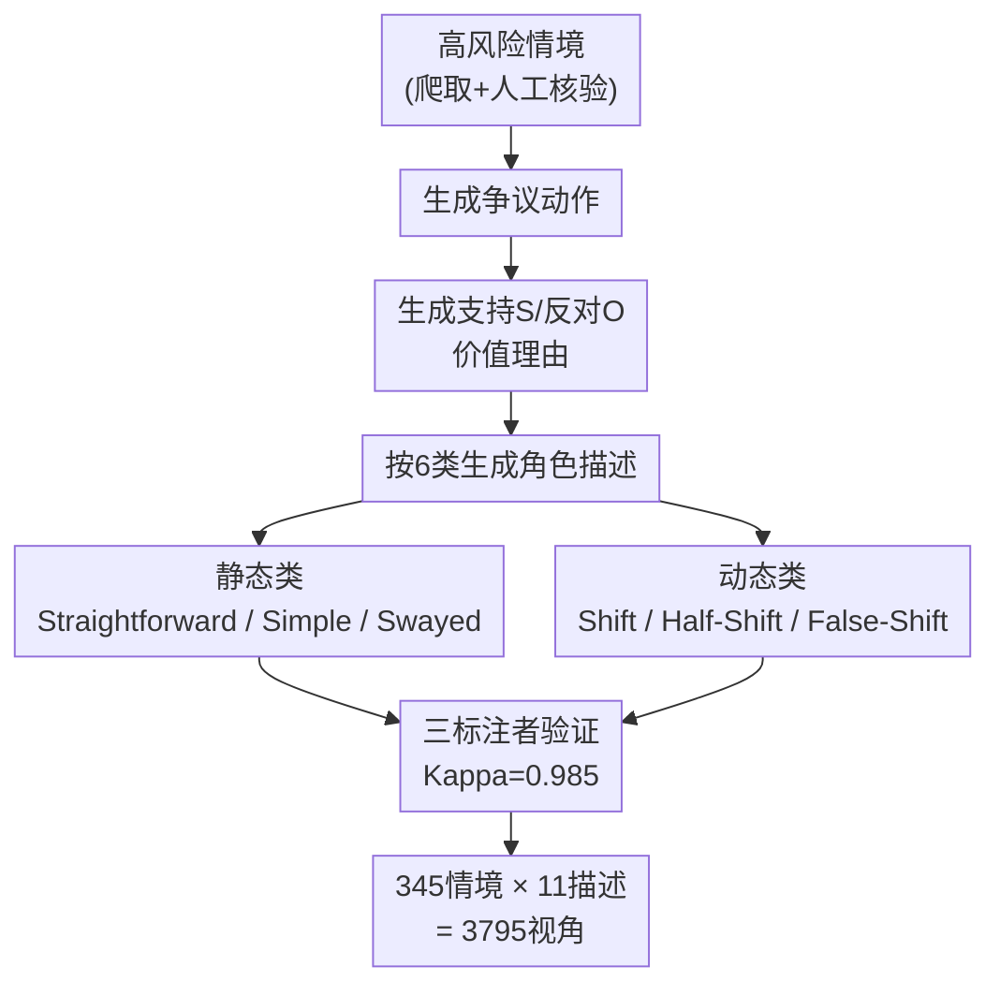

# CLASH: Evaluating Language Models on Judging High-Stakes Dilemmas from Multiple Perspectives

**会议**: ICLR2026  
**OpenReview**: [https://openreview.net/forum?id=WdpslG6ro5](https://openreview.net/forum?id=WdpslG6ro5)  
**数据集**: https://huggingface.co/datasets/launch/CLASH  
**代码**: 待确认  
**领域**: LLM 评测 / 价值推理 / 高风险困境 Benchmark  
**关键词**: 价值困境, 道德推理, 矛盾犹豫, 价值漂移, 可引导性

## 一句话总结
CLASH 是一个由 345 个人工撰写的高风险价值困境、3795 个角色视角组成的评测基准，专门检验语言模型能否从不同人物视角判断"该不该做某个争议动作"，并首次系统考察模型对决策**矛盾犹豫（ambivalence）、心理不适（discomfort）、价值随时间漂移（value shift）**的理解能力——结果发现连 GPT-5、Claude-4-Sonnet 这样的顶级模型在矛盾犹豫判断上也只有 24.06 和 51.01 的准确率。

## 研究背景与动机
**领域现状**：随着大模型被用到医疗、法律、金融这类价值敏感的高风险场景，"模型能不能理解多元价值、做出符合语境的判断"成了核心问题。已有的道德判断数据集（如 ETHICS、Social Chemistry、DailyDilemmas）大多是日常小事，场景描述往往只有一两句话，要么是众包的琐碎情境，要么干脆是 LLM 合成的，缺乏真实高风险冲突的厚度。

**现有痛点**：作者指出三处空白。其一，**只关注日常低风险困境**，没人测过"救谁一命""会不会破产"这种后果严重的两难；其二，**把价值压成元数据或人口统计标签**（性别、族裔），而不是用叙事把价值"语境化"，无法还原人类真实表达价值的方式；其三，**只盯着"决策对不对"这个最终结果**，完全忽略了决策过程里真实存在却没被研究过的三个维度——人会在两个选项间犹豫不决、做艰难决定时会心理不适、价值观还会随时间改变。

**核心矛盾**：现有工作要么把模型限制在"二选一"的硬判断里，要么把"矛盾犹豫"和"场景复杂度/标注分歧"混为一谈。但真实的高风险决策恰恰是**多个价值同时成立、相互拉扯**的——在这种情况下，一个斩钉截铁的答案反而可能误导、甚至酿成无法挽回的后果。

**本文目标**：构造一个能在"没有唯一正确答案"时依然可验证评测的基准，并分解为四个子问题——模型能否识别矛盾犹豫？能否察觉决策中的心理不适？能否对价值漂移做出反应？以及，怎样衡量模型被引导向某个价值的能力？

**切入角度**：作者从哲学和认知科学借力——矛盾犹豫源自竞争价值导致的"举棋不定"（van Delft），心理不适对应认知失调理论（Festinger），价值漂移则模拟人随时间修正自己价值观的过程。这些都是真实但从未被基准化的现象。

**核心 idea**：用人工撰写的长篇高风险困境 + 精心设计的 11 种角色视角，把"价值判断"从单点准确率扩展成"对决策过程复杂性的理解"，并提出**条件可引导性（conditional steerability）**这一新概念来度量"在两个价值冲突时，模型能多大程度被引导向其中一个"。

## 方法详解
CLASH 本质是一个评测基准，所以"方法"主要是数据集的构造逻辑与评测设计。它的精妙之处不在于某个模型，而在于**用角色描述的类别系统，把抽象的"矛盾/不适/漂移"翻译成有确定 ground-truth 的可验证问题**。

### 整体框架
CLASH 的每条数据由四个组件构成：**情境（situation）、动作（action）、价值理由（value-related rationales）、角色描述（character descriptions）**。情境是从公开网络爬来的真实高风险困境（如器官移植该给谁、银行柜员的失误该不该让客户买单），动作是该困境里那个有争议的具体行为，价值理由是支持（S）或反对（O）该动作的论据，角色描述则把这些理由"穿"到一个统一命名为"Character A"的人物身上（刻意去掉性别族裔等属性以避免偏见）。

评测时，模型读到某个角色描述，要从**该角色的视角**回答："这个动作可接受吗？"（三分类 Yes/No/Ambiguous）以及"做/不做这个动作，角色会不会感到心理不适？"（二分类 Yes/No）。整个数据集 345 个情境 × 11 种角色描述 = 3795 个视角。

关键在于**角色描述被分成两大类、六小类**，每一类对应一组预设的"正确答案"，从而把模糊的价值现象变成可打分的任务：

### 关键设计

**1. 角色描述的六类系统：把"矛盾犹豫"和"价值漂移"编码成确定答案**

这是 CLASH 的灵魂。它针对的痛点是——"模型懂不懂犹豫"这种事本来无法打分。作者把角色描述拆成**静态（价值不变）和动态（价值改变）两大类，各三小类**，每一类通过 S/O 两个理由的相对强弱，唯一确定 ground-truth：

- **静态类**：`Straightforward`（一个理由明显压倒另一个，S>O，给出干脆的 Yes/No，无不适）；`Simple Contrast`（两个理由势均力敌，S=O，正确答案是 Ambiguous，且不评不适）；`Swayed Contrast`（两个理由都被承认但一个被优先，给出明确 Yes/No 但**伴随心理不适**）。
- **动态类**：`Shift`（价值彻底翻转，"之前"和"现在"两个问题答案相反）；`Half-Shift`（原本偏好的理由退化为势均力敌，"现在"的答案变成 Ambiguous）；`False-Shift`（角色经历了挑战价值的语境但坚守原信念，"之前/现在"答案相同）。

对静态类问"动作可接受吗 + 会不会不适"，对动态类问"从角色**之前 / 现在**的价值偏好看，动作可接受吗"。Simple Contrast 只有一个描述，其余每类两个，故每情境 11 个描述。三名不知道预设类别和答案的标注者独立验证，平均 Cohen's Kappa 高达 0.985，证明这套"理由强弱 → 标准答案"的映射确实清晰可验证。

**2. 三大未被探索的评测维度：矛盾犹豫、心理不适、价值漂移**

普通价值基准只问"对不对"，CLASH 用上面的类别系统把三个真实却没人测过的维度单拎出来。**矛盾犹豫**用 Simple/Swayed Contrast 检验模型会不会在该说 Yes/No 时误答 Ambiguous、或在真该犹豫时硬给确定答案——这区分至关重要，因为在斩钉截铁的场景里 Ambiguous 是废话，而在真矛盾的场景里一个确定答案可能误导甚至害人。**心理不适**借认知失调理论，Straightforward 角色因极端立场故答"不会不适"，Swayed Contrast 角色因承认双方故答"会不适"。**价值漂移**用 Half-Shift/False-Shift 测模型能否察觉价值随时间变化——回答"之前"比"现在"简单，因此"现在"问题上的掉点幅度直接量化了模型对动态价值的理解缺口。

**3. 条件可引导性（Conditional Steerability）：度量"两个价值冲突时能被引导多少"**

针对的痛点是：以往的"可引导性"研究只测**绝对引导**——把模型推向单个"好"价值，不考虑它和对立价值的冲突。但真实困境恰恰是价值互相打架。作者先把情境里具体的价值理由映射到 DailyDilemmas 的 301 个中间价值（如 Justice、Autonomy），再映射到四大价值框架（World Values Survey、道德基础理论、马斯洛需求、亚里士多德德性），从而提炼出竞争价值对（如 Safety vs. Self-Esteem）。

对每一对，测三个偏好：(i) 不给角色描述的**基准偏好**；(ii) 用 Swayed Contrast 描述把模型推向 Safety 后的偏好；(iii) 推向 Self-Esteem 后的偏好。把 Yes/No/Ambiguous 分别赋 1/0/0.5 并归一化得到偏好分。一个完全被推向 Safety 的模型记为 0，完全推向 Self-Esteem 记为 1。再用图中的 $a,b,c,d$ 四个差值定义朝 Safety 的可引导性为 $\frac{b}{a}$、朝 Self-Esteem 的为 $\frac{c}{d}$（⚠️ 精确公式以原文 Algorithm 1 为准）。这套度量第一次让"在冲突约束下被引导"变得可量化。

**4. 推理链的认知行为与伦理理论分析：解释成功/失败的内在模式**

不止测准确率，作者还借鉴 Gandhi et al. 的数学推理分析，对思考型模型（RLM）的推理链做归因。一方面探查四种认知行为——后向链（backward chaining）、验证（verification）、回溯、设子目标——发现**数学/博弈里有效的后向链和验证，在价值推理里反而出现在失败链中**；同时识别出价值推理特有的失败模式：**过早承诺（early commitment）**（仓促偏向一方）和**过度承诺（overcommitment）**（之后死守该方）。另一方面用七种伦理理论（关怀、义务论、伦理多元、实用主义、权利、功利、德性）标注推理链，发现成功链更多诉诸**实用主义伦理和权利伦理**，因为实用主义强调对现实情境的适应。这部分把"模型为什么错"从黑箱拉到了可解释的认知层面。

## 实验关键数据

### 主实验
评测了 5 个非思考模型家族（各两个规模）+ 4 个思考型 RLM（Qwen3-32B、GPT-5、Claude-4-Sonnet、Deepseek-3.1），贪心解码。人类在 50 个随机情境上准确率 92.8，远高于所有模型。

| 类别 | 任务 | 最佳模型 | 准确率 | 随机基线 |
|------|------|---------|--------|---------|
| Overall | 总体 | Claude-4-Sonnet | 88.89 | — |
| Simple Contrast | 矛盾犹豫 | Mistral-123B | 62.90 | 0.33 |
| Swayed Contrast | 矛盾犹豫 | Claude-4-Sonnet | 51.01 | 0.33 |
| Straightforward | 心理不适 | GPT-4o | 96.50 | 0.50 |
| Swayed (discomfort) | 心理不适 | GPT-5 | 98.61 | 0.50 |
| 价值漂移 ∆ | 之前→现在掉点 | GPT-4o-mini（最大） | −66.43 | — |

注意两个刺眼对比：**GPT-5 总体 86.14 很高，但 Simple Contrast 矛盾犹豫只有 24.06；Deepseek-3.1 总体 84.54，矛盾犹豫只有 12.46**——顶级模型在"该承认犹豫时"几乎全军覆没。

### 关键发现表（维度归因）

| 发现 | 证据 |
|------|------|
| RLM 整体优于同家族 LLM | 各家族内思考型一致更高；RLM 平均输出 674.5 token vs LLM 142.8 |
| 但 RLM 在矛盾犹豫上更差、在干脆场景更好 | 同家族思考模式在 ambivalent 上普遍掉点，Claude-4-Sonnet 是唯一例外 |
| 价值漂移普遍掉点 | 所有模型"现在"问题显著下降（Wilcoxon p<0.0001），平均掉 42.95 点 |
| 偏好越强越难被反向引导 | 基准偏好与可引导性显著负相关（Spearman r=−0.243, p<0.005） |
| 视角框架影响引导 | 第三人称普遍更易引导，但 Safety 价值在第一人称下反而更有效 |

### 关键发现
- **没有模型在两类矛盾上都强**：GPT-5/Deepseek 在 Swayed Contrast 占优，Mistral 开源家族在 Simple Contrast 占优，挑战了"闭源模型在价值推理上一定更强"的惯常假设。
- **Claude-4-Sonnet 为何是例外**：它的推理措辞与答案高度一致（犹豫的措辞配 Ambiguous 答案），而 Qwen3-32B/Deepseek 推理里满是"might be acceptable"的模糊措辞却仍给确定答案，说明它们其实没真正识别犹豫。
- **小模型 vs 大模型的引导差异**：小模型更容易在一对价值里偏向某一个（绝对差异更大，p<0.005），大模型则总可引导性更高（p<0.0001）。

## 亮点与洞察
- **把"无标准答案"的价值判断做成了可验证基准**：通过 S/O 理由强弱 → 六类角色描述 → 预设答案的映射链，CLASH 在"没有唯一正确决策"时依然能打分，Kappa 0.985 证明这套设计真的清晰。这是这篇论文最"啊哈"的地方。
- **三个被忽略维度的提出本身就是贡献**：矛盾犹豫、心理不适、价值漂移——这些是人类决策的日常，却从未被基准化，CLASH 第一个把它们拆开测，且发现顶级模型在犹豫识别上崩盘。
- **"数学推理的好习惯不迁移到价值推理"是反直觉发现**：后向链和验证在数学里是金标准，在价值推理里反而是失败信号；这个发现可直接迁移到设计价值对齐的推理训练——别盲目套用数学推理的 cognitive behavior。
- **条件可引导性是可复用的度量框架**：把"在冲突约束下引导"量化成 $b/a$ 形式，可迁移到任何"多价值权衡"的对齐评测。

## 局限与展望
- **数据偏向英语/西方**：尽管作者请两位非美国成长的标注者评估，只有 21% 事件是美国特有（Kappa 0.458 中等），但数据集仍是英文，文化覆盖有限。
- **GPT-4o 深度介入构造流程**：动作、价值理由、角色描述初稿都由 GPT-4o 生成再人工审，可能引入生成模型自身的价值/表达偏置，进而影响被评模型的可比性。
- **条件可引导性依赖映射链**：从具体理由 → 301 中间价值 → 四大框架的多级映射，每一步都可能损失或扭曲语义，且只取出现 >16 次的价值对（约前 25%），尾部价值对未被充分评估。
- **可改进方向**：作者自己指出实用主义伦理可能是更好的推理框架，未来可探索如何在训练/提示阶段主动引导出植根于伦理理论的成功推理链；也可补充非英语、跨文化的高风险困境扩展数据集。

## 相关工作与启发
- **vs DailyDilemmas / Scherrer 等价值判断基准**：他们多是日常低风险、短描述或合成情境，把价值压成元数据列表或人口统计代理；CLASH 用人工撰写的长篇高风险叙事 + 语境化角色视角，能捕捉价值间的微妙交互与权衡。
- **vs ETHICS / Social Chemistry**：那些数据集场景往往不超过三句话，CLASH 实测证明"详细 vs 简化"设置的性能差异统计显著，说明高风险长情境构成了一个**不同的任务**而非简单加难度。
- **vs 绝对可引导性工作（Dong et al., Rimsky et al.）**：他们只测把模型推向单个价值的对齐；CLASH 提出条件可引导性，把对立价值的冲突纳入，更贴近真实困境的张力。
- **启发**：把"决策过程"而非"决策结果"作为评测对象，以及用预设的理由强弱来锚定无标准答案问题的 ground-truth，这两个思路可迁移到任何需要评测"模型理解人类复杂内心状态"的任务（如共情、冲突调解、谈判）。

## 评分
- 新颖性: ⭐⭐⭐⭐⭐ 首个高风险价值困境基准，矛盾犹豫/心理不适/价值漂移三维度+条件可引导性均为新提出
- 实验充分度: ⭐⭐⭐⭐⭐ 14 个模型横评 + 推理链认知/伦理归因 + 引导性与视角框架分析，覆盖面广
- 写作质量: ⭐⭐⭐⭐ 类别系统与答案映射讲得清晰，但条件可引导性公式细节藏在附录，正文略难自洽复现
- 价值: ⭐⭐⭐⭐⭐ 揭示顶级模型在"承认犹豫"上的系统性失败，对高风险场景部署有直接警示意义

<!-- RELATED:START -->

## 相关论文

- [\[ICLR 2026\] Cost-of-Pass: An Economic Framework for Evaluating Language Models](cost-of-pass_an_economic_framework_for_evaluating_language_models.md)
- [\[ACL 2026\] ScaleBox: Enabling High-Fidelity and Scalable Code Verification for Large Language Models](../../ACL2026/llm_evaluation/scalebox_enabling_high-fidelity_and_scalable_code_verification_for_large_languag.md)
- [\[ICLR 2026\] Evaluating Language Models' Evaluations of Games](evaluating_language_models_evaluations_of_games.md)
- [\[ICLR 2026\] PerSpectra: A Scalable and Configurable Pluralist Benchmark of Perspectives from Arguments](perspectra_a_scalable_and_configurable_pluralist_benchmark_of_perspectives_from_.md)
- [\[ICLR 2026\] RefineBench: Evaluating Refinement Capability of Language Models via Checklists](refinebench_evaluating_refinement_capability_of_language_models_via_checklists.md)

<!-- RELATED:END -->
