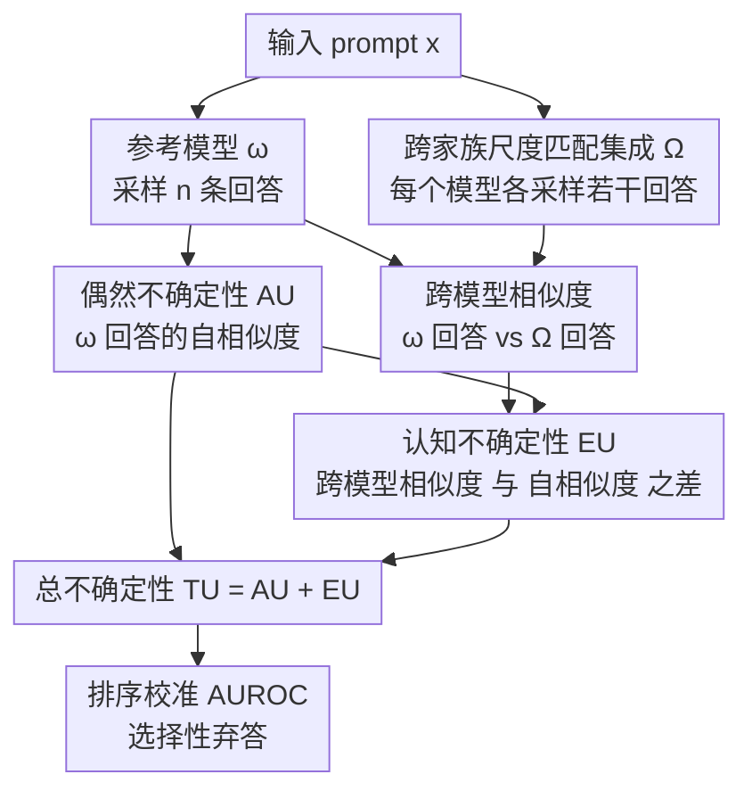

# Complementing Self-Consistency with Cross-Model Disagreement for Uncertainty Quantification

**会议**: ICLR2026  
**OpenReview**: [https://openreview.net/forum?id=lOoRJo8xWy](https://openreview.net/forum?id=lOoRJo8xWy)  
**代码**: 待确认  
**领域**: LLM评估 / 不确定性量化  
**关键词**: 不确定性量化, 认知不确定性, 自一致性, 跨模型分歧, 选择性预测

## 一句话总结
针对自一致性（self-consistency）在「模型自信地答错」时失效的问题，本文用一组同量级、跨家族的开源 LLM 之间的**语义分歧**来估计认知不确定性（EU），把它加到原有的偶然不确定性（AU）上得到总不确定性（TU），在 5 个 7–9B 模型 × 10 个长文本生成任务上，TU 的校准（AUROC）和选择性弃答都稳定优于单用 AU，且只用纯文本输出、无需训练或访问 logits。

## 研究背景与动机

**领域现状**：给 LLM 的输出配一个可信的不确定性分数，是把它部署到高风险场景的前提。当前主流做法几乎都建立在「模型自信度」上——最典型的是**自一致性**：对同一个 prompt 采样多条回答，看它们语义上有多一致。回答越发散，不确定性越高。这类指标度量的是**偶然不确定性（aleatoric uncertainty, AU）**，即模型自己对这条输入回答的内在随机性。

**现有痛点**：AU 只回答了「模型对自己的回答有多确定」，却没回答更关键的一问——「我们该对这个模型有多确定」。一个模型完全可能**自信但错误**：对同一道事实题，每次采样都吐出**同一个错误答案**。此时 AU 趋近于 0（回答高度一致），自一致性会把它判为「高置信、可信」，但答案其实是错的。这正是自一致性作为可靠性代理时最危险的坍缩区。

**核心矛盾**：要补上这个缺口，需要的是**认知不确定性（epistemic uncertainty, EU）**——对「我们选的这个模型 ω 是否是回答该输入的正确参数化」的不确定性。但 EU 的经典估计要求评估一个「合理模型的分布」，对 LLM 而言训练哪怕一个额外模型都代价高昂；近年的捷径（logit 空间近似、解码时注入贝叶斯噪声、依赖一个 verifier 模型）又都带有强烈的任务或架构假设，且大多只在特殊 QA 数据上验证。

**切入角度**：作者的关键观察是——在 AU 很低（模型很自信）的区间里，**错误回答的跨模型语义分歧反而更高**。也就是说，单个模型自信地答错时，另一批同量级模型往往会给出不同的（也各有错法的）答案。开源 LLM 生态恰好提供了一群现成的、同量级、跨家族训练的模型，可以直接拿它们之间的语义分歧来估计 EU，不需要再训练任何东西。

**核心 idea**：用一小组「尺度匹配、跨家族」的开源 LLM 集成，把 EU 估计成「跨模型相似度」与「模型自相似度」之差，再与自一致性给出的 AU 相加得到总不确定性 TU，专门去抓 AU 漏掉的「自信但错」的失败。

## 方法详解

### 整体框架

方法只在**黑盒**设置下工作：对每条输入，唯一需要的是参考模型 ω 和一组辅助模型 Ω 各自生成的**文本回答**，不碰 logits、不碰隐状态、不做任何训练。整条流水线是：先对 ω 自身采样若干回答，算它们两两的语义相似度——回答越互相不一致，AU 越高；同时把 ω 的回答和辅助集 Ω 中每个模型的回答做跨模型相似度比较；EU 定义为「ω 与其他模型回答的相似度」相对「ω 自相似度」的**落差**；最后 TU = AU + EU。直观上 AU 抓「模型自己内部的摇摆」，EU 抓「模型相对其他合理模型的偏离」，两者互补。

下面这张图给出从一条输入到三个不确定性分数的数据流：

### 关键设计

**1. 把自一致性的失效定位成「低 AU 区的自信错误」**

很多工作默认「AU 低 = 可信」，只在 AU 较高时才去做跨模型比较（如 Xue et al. 2025 的规则是只在中等 AU 触发跨一致性检查）。本文先用一个诊断实验把这个假设打掉：把所有数据汇成一个池子，按 AU 分成低/中/高三档，比较正确与错误回答的 EU 分布。结果是——**在低 AU 档，错误回答的 EU 显著高于正确回答**，而这种区分度随 AU 升高反而减弱。进一步只取 AU 最低的 5% 样本（模型最自信的那批），错误回答的 EU 依旧明显更高。这说明：模型最自信的区域恰恰是幻觉高发区，也正是 EU 最该补位的地方。这个诊断不是工程改进，而是整篇方法的立论基础——它解释了「为什么要加一个跨模型的项」以及「该在哪个区间加」。

**2. 用相似度统一定义 AU、EU、TU 三个量**

AU 沿用 Lin et al. (2023) 的语义离散度：从 ω 独立采两条回答，取其语义相似度的期望，$U_\text{aleatoric}(x;\omega)=\mathbb{E}_{r_1,r_2\sim p(\cdot|x,\omega)}\big[1-s(r_1,r_2)\big]$，其中 $s(\cdot,\cdot)$ 是嵌入空间的余弦相似度。回答语义越一致，AU 越接近 0。

EU 则建模成 ω 与一个理想模型 ω\* 的散度。作者定义 $D(\omega\|\omega^*)$ 为「跨模型相似度」减去「ω 的自相似度」：当 ω 与 ω\* 的回答相似度，恰好等于 ω 内部的自相似度时，散度为 0；当 ω 的回答即便扣除掉自身偶然多样性后仍与理想模型分歧很大时，散度大。由于拿不到 ω\*，作者借用 Schweighofer et al. (2023) 的信息论技巧，把 ω\* 边缘化成一个模型分布 $P_\Omega$（满足 $\mathbb{E}_{\tilde\omega\sim P_\Omega}[p(\cdot|x;\tilde\omega)]=p(\cdot|x)$），得到可计算的

$$U_\text{epistemic}(x,\omega)=-\,\mathbb{E}_{\tilde\omega\sim P_\Omega}\,\mathbb{E}_{r_1\sim p(\cdot|x,\omega),\,r_2\sim p(\cdot|x,\tilde\omega)}\big[s(r_1,r_2)\big]+\mathbb{E}_{r_1,r_2\sim p(\cdot|x,\omega)}\big[s(r_1,r_2)\big].$$

最后用标准的加性假设定义总不确定性 $U_\text{total}=U_\text{aleatoric}+U_\text{epistemic}$，可整理成一个干净的形式：$U_\text{total}(x;\omega)=\mathbb{E}_{\tilde\omega\sim P_\Omega}\,\mathbb{E}_{r_1\sim p(\cdot|x,\omega),\,r_2\sim p(\cdot|x,\tilde\omega)}\big[1-s(r_1,r_2)\big]$。三个量共用同一套「回答两两相似度」的算子，只是配对来源不同（自己×自己 = AU，自己×别人 = TU 的核心，差值 = EU），概念上非常自洽。

**3. 纯文本经验估计 + 采样预算与自一致性对齐**

落到实操，对每条 prompt：参考模型 ω 采 $n$ 条回答 $R'$，辅助集中每个模型 $\omega_i$ 各采 $n$ 条 $R_i$（$|\Omega|=m$）。三个量的经验估计为

$$\text{AU}=1-\frac{1}{n^2}\sum_{k,j}s(r'_k,r'_j),\qquad \text{TU}=1-\frac{1}{m}\sum_{i=1}^{m}\frac{1}{n^2}\sum_{k,j}s(r'_k,r^{(i)}_j),\qquad \text{EU}=\text{TU}-\text{AU}.$$

关键是这套估计**只用生成的文本**（Eq. 中只出现回答 $r$ 和相似度 $s$），因此能直接套到 GPT-4o、Claude 这类只给输出的黑盒 API 上，这是相对「需要 logits / 隐状态」的方法的核心优势。更重要的是公平性细节：作者刻意让 TU 与 AU **共享同一采样预算**——比较时取 $n=n'/m$，即用 5 个模型各采 2 条共 10 条来算 TU，对照 AU 用同一个模型采 10 条，避免「TU 赢只是因为采样更多」的混淆。

**4. 用跨家族尺度匹配集成满足代理分布 Ω 的三条性质**

EU 的可信度完全取决于辅助集 Ω 能多好地逼近那个拿不到的理想模型分布。作者从 Eq. 3 推出 Ω 必须满足三条：**(i) 支撑丰富**——Ω 要覆盖多种合理解释，否则跨相似度会被人为抬高、EU 被低估；**(ii) 多样性不坍缩**——若成员彼此几乎相同（如同一模型的噪声扰动版），集成均值会贴近 ω，跨模型相似度退化成自相似度，EU 失效；**(iii) 加权校准**——各模型应按其后验可信度加权，只有当验证风险相当时才适合均匀权重。作者的工程实现是：用**同架构类、同量级（7–9B）、但由不同厂商训练**的 Transformer 模型组成 Ω。不同的数据管线/初始化/对齐协议带来支撑丰富与非坍缩多样性，而它们验证性能相近，于是可安全采用**均匀权重**——三条性质一次性满足。这一步把抽象的「理想模型分布」落地成「随手能下载的一把开源模型」，是方法能零训练、可复现的关键。

### 损失函数 / 训练策略
本方法**无任何训练**：不微调、不优化，纯推理时采样 + 相似度计算。正确性判定用 Meta-Llama-3-70B-Instruct 作为 LM-as-judge，对每个「输入-回答」对打标，再以此评估不确定性分数的区分能力。

## 实验关键数据

### 主实验

设置：5 个 7–9B 指令模型（Gemma-2-9B-It、Granite-3.0-8B、Llama-3.1-8B、Mistral-7B-v0.3、Qwen2.5-7B）互为参考/辅助；10 个长文本任务覆盖 QA、数学、翻译、摘要；评估用 AUROC（不确定性区分对错的能力）与选择性预测（Risk–Coverage、C@90/C@80、AURC↓）。

| 设置 | 指标 | AU | TU (AU+EU) | 提升 |
|------|------|----|-----------|------|
| HotpotQA（5 模型均值） | AUROC | 0.65 | 0.80 | +0.15 |
| CoQA | AUROC | 0.66 | 0.80（约） | +0.14 |
| WMT16-de-en | AUROC | 0.74 | 0.87 | +0.13 |
| GPT-4o / SimpleQA | AUROC | 0.59 | 0.70 | +0.11 |
| Claude 3.7 Sonnet / SimpleQA | AUROC | 0.53 | 0.58 | +0.05 |
| 全数据聚合（选择性预测） | AURC ↓ | 0.256 | 0.217 | −15% |

TU 在**所有** benchmark 上平均都不低于 AU；最大增益出现在「模型互相分歧的复杂多跳推理」（HotpotQA）或「整体准确率高、EU 专抓残余错误」（CoQA、WMT16）的任务上。在 TruthfulQA、GSM8K(CoT)、QASPER 这类「存在多个有效/风格各异答案」的任务上增益较小。

### 消融实验

| 配置 | 关键发现 | 说明 |
|------|---------|------|
| 与 12 个不确定性基线对比（Mistral-7B 参考） | TU 0.72，最强基线 closeness centrality 仅 0.64 | TU 在几乎所有任务上居首，远超 SemanticEntropy/PTrue/Perplexity 等 |
| 辅助模型规模扫描（固定 Mistral-7B 参考） | 辅助模型即便比参考更小（×0.43）或同量级（×1），TU 仍 > AU | 辅助模型越大越强，TriviaQA 上增益越显著 |
| 噪声扰动集成 vs 跨家族集成 | 噪声扰动版多样性坍缩，EU 退化 | 验证设计 4 的「非坍缩多样性」是必要的 |
| 采样数 | AUROC 随采样数增加而提升 | 但已在与 AU 等预算（共 10 条）下取胜 |

### 关键发现
- **EU 在低 AU 区最有用**：取 AU 最低 5% 的「最自信」样本，错误回答的 EU 仍显著高于正确回答——这正是自一致性会漏判的「自信错误」，是 TU 增益的主要来源。
- **「分歧越大越有用」是错觉**：EU 的 AUROC 与数据集冗余度（Jaccard 一致性）正相关（$r=+0.72$），与互补度（Oracle Coverage Gain）负相关（$r=-0.72$）。当各模型分工互补、对同一正确题也给出不同（但合法）表述时，EU 被「回答噪声」抬高却与对错脱钩，AUROC 反而下降。
- **EU 适用边界很清楚**：在「正确答案唯一且各模型措辞相近、但在难题上发散」的任务（事实 QA、翻译）上 EU 最强；在「答案天然多样」的开放摘要（XSum）上 EU 失效。

## 亮点与洞察
- **把「自信但错」这个老大难问题转成一个可计算的信号**：自一致性最危险的地方就是模型一致地错，本文用「换一群模型来问」把这个盲区照亮，思路朴素却切中要害。
- **EU 估计完全黑盒、零训练**：只吃文本输出、用一把现成开源模型，因此能无缝套到 GPT-4o/Claude 这类只给输出的 API 上——这条对实际部署极有价值。
- **等采样预算的公平对照**（$n=n'/m$）是被很多集成类工作忽略的细节，本文主动堵住「赢在采样更多」的质疑，结论更可信。
- **对自身适用边界的诚实刻画**：用 Jaccard 一致性与 Oracle Coverage Gain 两个诊断量，明确说出「答案唯一型任务 EU 强、答案多样型任务 EU 弱」，这种 caveat 比单纯报增益更有迁移价值——任何想复用「跨模型分歧做 UQ」的人都该先看任务属于哪一类。

## 局限与展望
- **依赖「跨家族、尺度匹配」的开源集成**：方法吃 5 个 7–9B 模型，采样与推理成本随集成规模线性增长；若某领域没有合适的同量级开源模型，构造 Ω 会受限。
- **EU 在答案多样型任务上会被噪声污染**：开放摘要、多有效答案的任务上 EU 与对错脱钩，作者已坦承这是当前估计器的固有局限，未来需要区分「真分歧」与「多种正确表述」。
- **均匀权重的前提是各模型能力相当**：一旦辅助集成员强弱悬殊，三条性质里的「加权校准」就不再被满足，是否需要按可信度重新加权值得进一步研究。
- **正确性依赖 LM-as-judge**：用 Llama-3-70B 判对错本身带噪，可能影响 AUROC 的绝对数值（尽管相对比较应较稳健）。

## 相关工作与启发
- **vs 自一致性 / 语义熵（Lin et al. 2023, Kuhn et al. 2023）**：它们只度量单模型内部一致性（AU），在模型一致地答错时坍缩；本文把它当作 AU 基线并在其上叠加跨模型 EU，专补这个盲区。
- **vs Verifier-disagreement EU（Xue et al. 2025）**：对方只在**中等 AU** 时才触发跨模型比较，默认低 AU 可信；本文的诊断恰恰证明低 AU 才是幻觉高发区，主张在该区间用 EU 补位，触发逻辑相反。
- **vs 贝叶斯/logit 类 EU（Liu et al. 2025, Ma et al. 2025）**：它们要注入解码噪声或把 logits 当 Dirichlet 参数，需要白盒访问；本文只用生成文本，可直接上黑盒 API。
- **vs 显式训练集成（LoRA ensembles, Wang et al. 2023）**：训练多个模型校准更好但代价高；本文复用现成开源模型，零训练拿到 EU。

## 评分
- 新颖性: ⭐⭐⭐⭐ 「跨模型分歧补自一致性」的角度直觉清晰，且把适用边界刻画清楚，但单项技术多为已有组件的重组。
- 实验充分度: ⭐⭐⭐⭐⭐ 5 模型 × 10 任务 + API 模型 + 12 基线 + 等预算对照 + 适用性诊断，覆盖全面且诚实。
- 写作质量: ⭐⭐⭐⭐ 推导与诊断逻辑清楚，三量统一定义优雅；部分公式符号偏密。
- 价值: ⭐⭐⭐⭐ 黑盒、零训练、可直接上线 API，对 LLM 可靠部署有实用价值。

<!-- RELATED:START -->

## 相关论文

- [\[ICML 2026\] Who Flips? Self- and Cross-Model Counterarguments Reveal Answer Instability in LLMs](../../ICML2026/llm_evaluation/who_flips_self-_and_cross-model_counterarguments_reveal_answer_instability_in_ll.md)
- [\[ACL 2025\] Benchmarking Uncertainty Quantification Methods for Large Language Models with LM-Polygraph](../../ACL2025/llm_evaluation/benchmarking_uncertainty_quantification_methods_for_large_language_models_with_l.md)
- [\[NeurIPS 2025\] Efficient Semantic Uncertainty Quantification in Language Models via Diversity-Steered Sampling](../../NeurIPS2025/llm_evaluation/efficient_semantic_uncertainty_quantification_in_language_models_via_diversity-s.md)
- [\[ICLR 2026\] Textual Bayes: Quantifying Prompt Uncertainty in LLM-based Systems](textual_bayes_quantifying_prompt_uncertainty_in_llm-based_systems.md)
- [\[ICLR 2026\] How Reliable is Language Model Micro-Benchmarking?](how_reliable_is_language_model_micro-benchmarking.md)

<!-- RELATED:END -->
