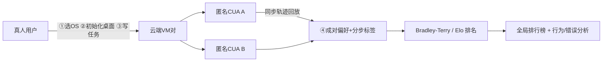

# Computer Agent Arena: Toward Human-Centric Evaluation and Analysis of Computer-Use Agents

**会议**: ICLR 2026  
**OpenReview**: [https://openreview.net/forum?id=3x4SDbXbgl](https://openreview.net/forum?id=3x4SDbXbgl)  
**代码**: [https://github.com/xlang-ai/computer-agent-arena](https://github.com/xlang-ai/computer-agent-arena)  
**领域**: LLM 评测 / Computer-Use Agent  
**关键词**: 计算机使用智能体, 人类偏好评测, Elo 排行榜, Bradley-Terry, 错误分析, OSWorld  

## 一句话总结
把 Chatbot Arena 的"真人盲投 + Elo 排名"范式搬到计算机使用智能体（CUA）上：让两个匿名 CUA 在云端真实桌面环境里并行执行真人提的任务，用户对轨迹做成对偏好投票，从而暴露静态基准（如 OSWorld）测不出来的排名翻转和行为级错误。

## 研究背景与动机
**领域现状**：随着 Claude、Operator、UI-TARS 等计算机使用智能体（CUA）越来越能干，业界主要靠 OSWorld、WebArena、WebVoyager、Online-Mind2Web 这类**静态基准**来评测——它们由人工编写计算机任务 + 手动设计 reward function 构成。

**现有痛点**：静态基准存在系统性缺陷——(1) 任务域窄、环境固定，容易被污染/过拟合；(2) 完全忽视个性化（不同用户在意不同结果与交互风格）；(3) 低估安全/隐私风险；(4) 对环境漂移（软件更新、网络波动、未见过的应用）不鲁棒；(5) 为了可复现而牺牲真实性，对"如何公平地两两对比"几乎没有指导。最关键的是，它们只看**最终状态**对不对，完全脱离了真实用户驱动的使用场景。

**核心矛盾**：CUA 正走向真实部署，"以人为中心、基于用户偏好/安全/可靠性"的评测本应是前提，但现有评测范式只衡量"做没做成"，无法回答"用户到底偏好哪种智能体、为什么偏好"。

**本文目标**：构建一个开源、可扩展、公平的在线平台，把真实任务与真人偏好转化为结构化信号与稳定排名，并据此分析 CUA 的真实失败模式与用户偏好驱动因素。

**核心 idea**：**人类偏好即评测信号** —— 用云端虚拟机给两个匿名 CUA 提供**完全一致**的真实桌面环境并行执行同一个真人任务，用户对同步回放的执行轨迹做成对偏好投票，再用 Bradley-Terry/Elo 聚合成排行榜；在偏好之外额外采集分步的正确性、安全、自我纠错等标签，把评测从"成对偏好 + 正确与否"扩展到能力级与行为级信号。

## 方法详解

### 整体框架
COMPUTER AGENT ARENA 是一套云端在线评测系统，工作流分六步：用户①选操作系统（Windows/Ubuntu）→②用预设或自定义脚本初始化桌面环境（上传文件 / 打开网页 / clone 仓库等）→③写自己的任务指令→两个**匿名** CUA 在两台**配置完全一致**的并行虚拟机里同时执行→④用户观看同步回放轨迹并打分（成对偏好 + 分步👍/👎 + 正确/安全等标签）→⑤评估→⑥评估完成后才揭示智能体身份。系统由三块支撑：可扩展的云基础设施、统一的智能体执行接口、以及把成对投票转成全局排行榜的 Elo 排名系统。

### 关键设计

**1. 可扩展且真实的云端环境基础设施：用"完全一致的环境指纹"换公平对比。** 平台在 OSWorld 之上打包标准化 AMI 部署到 AWS EC2，通过托管池做低延迟按需开机与并行分配，每个会话在浏览器里以 VNC 流式呈现原生桌面，无需本地安装。为逼近真实使用，作者精选了 600+ 种环境初始化（采样 SimilarWeb 热门站点及子域、从 Microsoft Store/Snapcraft 装主流应用、预载 100+ 异构文件如 `.docx`/`.py`），并周期性刷新文件系统内容以减少对固定上下文的过拟合，同时提供一键自定义工具（上传文件、预开网页、clone GitHub、应用初始化配方）。公平性靠**环境指纹**保证：两个匿名 CUA 在同一 AMI、同版本软件、同初始化配方、同 seed 配置下并行执行（避免时间漂移），后端记录每次试验的 AMI ID、包哈希与初始化规格，轨迹经 OBS 录制成同步回放，用户在匹配条件下提交可比的偏好与结构化标签。

**2. 统一动作空间 + 逐字复现的智能体接口：让差异只反映模型本身。** 所有 CUA 通过统一动作空间与 API 服务交互以保证跨模型兼容：每步接收 1280×720 桌面截图，输出结构化函数调用（鼠标移动/点击、键盘输入、滚动，以及 `DONE`/`FAIL`/`CALL_USER` 等特殊信号），从自然语言指令开始，按状态-动作对推进直至终止。有官方框架的（Operator、Claude 3.7 Sonnet）直接采用官方实现，否则用标准化 baseline agent 处理截图摄入、prompt、函数调用格式化与环境交互。所有开源 CUA 都从公开仓库**逐字实例化**——用发布的 checkpoint、默认系统 prompt 与工具、推理参数（temperature、max-tokens）、tool schema，并固定步数上限、响应窗口与对历史 CoT 的访问，从而隔离模型行为、让结果差异来自模型而非集成差异。

**3. Bradley-Terry/Elo 排名 + bootstrap 置信区间：把成对投票聚合成稳定排行榜。** 每次评测产出一个成对偏好投票：设比较 $i$ 的智能体对为 $x_i=(m_i^L,m_i^R)\in[M]^2$，用户偏好 $y_i\in\{1,0,\tfrac12\}$，每个智能体 $m$ 有强度参数 $\beta_m$，左方获胜概率建模为

$$\Pr(m^L\succ m^R)=\frac{\exp(\beta_{m^L})}{\exp(\beta_{m^L})+\exp(\beta_{m^R})}.$$

优化所有投票的对数似然估计 $\beta$，再换算到标准 Elo 尺度 $E_m=400\log_{10}(e^{\beta_m})+1000$。为保证排行榜稳定，用 bootstrap 计算 95% 置信区间，并按区间**下界**排序。该范式沿用 Chatbot Arena，但落到了完整桌面执行轨迹的评测上。

**4. 行为级与错误级标签的扩展信号：从"对不对"走向"怎么做的"。** 除成对偏好外，平台还可选采集分步评测：grounding 错误、隐私违规、自我纠错行为，以及正确性、安全、效率等标签。这让评测能够支撑后续的用户偏好分析（哪些行为真正赢得偏好）、工具型 vs 纯 GUI 智能体对比、以及系统性的错误发现（长程记忆失效、信息感知不足、细粒度动作失败等），把 Arena 变成一条"错误发现流水线"，而非只产出一个分数。

## 实验关键数据

### 主实验：排行榜（2,201 高质量投票 / 1,058 用户 / 12 个 CUA）
共收集 3,418 票（公开用户 1,773 + Prolific 付费标注 1,645），过滤无效提交与低性能模型后保留 2,201 票。标注一致性 Krippendorff's α：偏好 0.72、正确性 0.78、安全 0.68、效率 0.70（中到强一致）。

| 排名 | 模型 | Elo | 票数 | 正确率 |
|---|---|---|---|---|
| 1 | Claude Sonnet 4 | 1167 | 416 | 52.0% |
| 2 | Claude 3.7 Sonnet | 1140 | 507 | 52.3% |
| 3 | UI-TARS-1.5 | 1092 | 533 | 49.9% |
| 4 | Operator | 1064 | 511 | 37.4% |
| 5 | CoAct-1* | 1043 | 110 | 41.8% |
| 6 | OpenCUA* | 1023 | 109 | 38.5% |
| 7 | Claude 3.5 Sonnet | 1023 | 425 | 35.8% |
| 8 | GPT-5* | 1002 | 108 | 34.3% |
| 9 | o4-mini | 895 | 266 | 15.4% |
| 10 | Qwen 2.5 VL 72B | 895 | 504 | 15.9% |
| 11 | GPT-4.1 | 837 | 432 | 8.6% |
| 12 | Gemini 2.5 Pro | 829 | 377 | 11.8% |

关键现象：专用 CUA（Claude 系、UI-TARS、Operator）显著领先，**通用强多模态模型（GPT-5、Gemini 2.5 Pro）反而垫底**——强多模态能力不必然转化为稳健的计算机使用能力。

### 消融实验：任务分布对排名的影响

| 设置 | 现象 |
|---|---|
| 跨基准排名对比（CAA vs OSWorld/WebVoyager/Online-Mind2Web） | 顶部 CUA 出现**明显排名翻转**，OSWorld 的多个 top 在 Arena 里被倒置 |
| OSWorld In-domain vs OOD（1,000 任务用 GPT-4o 语义分类后人工校验，分子集重算 Elo） | 排序明显移动：Claude 3.7 仍居首，但 UI-TARS-1.5 在 in-domain 任务上上升 → 静态基准因过拟合窄任务分布而**高估**性能 |
| CALL_USER 查询次数 vs 胜率 | 倒 U 形：**适度查询（1-2 次）胜率最高**，0 次或过度查询都更低 |

统计显著性：bootstrap 置信区间窄；permutation test 显示成对胜率差异高度显著（$p<0.01$，Cohen's $d>0.5$）；power analysis 表明每对模型 >200 票时检测中等效应（$\Delta\text{Elo}\approx50$）的概率 >0.9。

### 关键发现
- **正确性是用户偏好的主导预测因子**，但执行步数与延迟在两者都"正确"时对偏好几乎无影响。
- 用户偏好更看**逐回合完整性**而非最终状态：哪怕没完成任务，只要展现清晰意图理解、有意义的局部进展、错误恢复/自我纠错，也可能被偏好（开放式任务尤其明显）。
- **工具增强 ≠ 真实表现更好**：CoAct-1 在 OSWorld-Verified 拿 60.1% SOTA，却在 Arena 非技术任务上大幅落后——成因是工具选择偏差（在该用 GUI 的任务上滥用代码工具）与错误放大（工具调用产生不可见的隐蔽失败），其成功轨迹平均仅 ≈3 步，泛化差。
- 错误分析暴露三类静态基准测不出的隐蔽错误：**长程记忆失效**（多步后忘记中间目标，连 Claude 4 Sonnet 也会漂移）、**信息感知不足**（面对欠规约任务发投机指令而不澄清）、**细粒度动作失败**（误滚动、点非交互元素、文本追加而非替换）。

## 亮点与洞察
- **范式迁移的完整工程化**：把 Chatbot Arena 的真人盲投搬到 CUA，难点不在排名公式（Bradley-Terry 是现成的），而在"如何保证两个智能体真在完全一致的真实桌面环境里并行执行"——环境指纹 + 逐字复现 + 同步回放这套基础设施才是真正的贡献。
- **排名翻转是最有说服力的论据**：OSWorld 上的强者在真实用户任务里被倒置，直接证明静态基准与真实部署之间存在系统性 gap，而不只是"再加一个 benchmark"。
- **从"测对错"到"测过程"**：发现用户偏好由逐回合完整性、适度澄清（倒 U 形 CALL_USER）、错误恢复驱动，给出了 outcome correctness 之外的对齐信号，对 CUA 训练目标有直接指导意义。
- **错误发现流水线**：把人类偏好标注当作探针，系统性挖出长程记忆、信息感知、细粒度动作三类难以脚本化暴露的失败，比单一 Elo 分数更可操作。

## 局限与展望
- **投票规模仍偏小且不均衡**：部分模型（CoAct-1、OpenCUA、GPT-5）票数仅 ~110，置信区间宽，作者标注"后续版本更新"，当前排名对这些模型仅供参考。
- **众包偏好的主观性与人群偏置**：偏好受标注者背景（技术 vs 非技术）影响，CoAct-1 在技术任务上更受 tech-savvy 用户青睐，说明排行榜对人群构成敏感。
- **安全/隐私维度尚浅**：虽采集了安全标签（α=0.68 一致性偏低），但分析主要围绕偏好与正确性，安全/隐私风险的系统评估仍是未来工作。
- **成本与可扩展性**：云端 VM + 真人投票的边际成本远高于静态基准，难以做到 OSWorld 那种一键复跑；作者也强调本工作是对基准评测的**补充**而非替代。
- **展望**：用 Arena 暴露的失败模式反哺训练（长程记忆、不确定性澄清、低级动作精度的新训练信号）；研究自适应工具选择策略（何时/用什么/怎么调工具，含 abstain 与回退 GUI）。

## 相关工作与启发
- **CUA 基准**：OSWorld-Verified、WebArena、WebVoyager、Online-Mind2Web、Windows Agent Arena、AgentCompany、AndroidWorld、AgentNetBench——多数仍是脚本化、静态、基于最终状态的 rule-based 评测；本文以众包真人任务 + 人类偏好为其补充。
- **人类偏好评测**：Chatbot Arena 开创大规模成对真人对比 + Bradley-Terry/Elo，随后扩展到 Copilot Arena（编程）、音频大模型、TextArena（文字游戏）；本文是该范式在"完整桌面执行轨迹"上的首次系统落地。
- **启发**：(1) 对任何走向真实部署的 agent，"最终状态正确率"都不足以刻画用户价值，过程质量/交互/恢复能力需要单列评测维度；(2) 工具增强要警惕"基准-真实 gap"，更多工具可能损害开放任务的可用性与用户信任；(3) "环境指纹 + 逐字复现 + 并行匿名"是做公平 agent 对比的可复用工程范式。

## 评分
- **新颖性**: ⭐⭐⭐⭐ 排名公式是现成的 Bradley-Terry，但把真人盲投 Arena 完整落到真实桌面 CUA 评测、并用排名翻转 + 行为级错误分析揭示静态基准盲区，组合创新与工程贡献都很扎实。
- **实验充分度**: ⭐⭐⭐⭐ 2,201 高质量票 / 1,058 用户 / 12 模型，配 bootstrap + permutation + power analysis 三重统计验证、跨基准 + in/out-of-domain 消融、100 例案例研究；扣分在部分模型票数偏少、安全维度分析较浅。
- **写作质量**: ⭐⭐⭐⭐ 动机-系统-实验-分析层次清晰，错误分类与 implication 提炼到位；个别句子有重复表述（如"unified pipeline isolates the model"出现两次）。
- **价值**: ⭐⭐⭐⭐⭐ 开源完整平台 + 多模态人类偏好数据集 + 参考实现，为 CUA 评测提供了静态基准之外不可忽视的人本视角，对社区评测方法论有长期价值。

<!-- RELATED:START -->

## 相关论文

- [\[ICLR 2026\] HackWorld: Evaluating Computer-Use Agents on Exploiting Web Application Vulnerabilities](hackworld_evaluating_computer-use_agents_on_exploiting_web_application_vulnerabi.md)
- [\[ICLR 2026\] Talk, Evaluate, Diagnose: User-aware Agent Evaluation with Automated Error Analysis](talk_evaluate_diagnose_user-aware_agent_evaluation_with_automated_error_analysis.md)
- [\[ICLR 2026\] Holistic Agent Leaderboard: The Missing Infrastructure for AI Agent Evaluation](holistic_agent_leaderboard_the_missing_infrastructure_for_ai_agent_evaluation.md)
- [\[ICLR 2026\] Fewer Battles, More Gain: An Information-Efficient Framework for Arena-based LLM Evaluation](fewer_battles_more_gain_an_information-efficient_framework_for_arena-based_llm_e.md)
- [\[ICLR 2026\] LLM-as-a-Prophet: Understanding Predictive Intelligence with Prophet Arena](llm-as-a-prophet_understanding_predictive_intelligence_with_prophet_arena.md)

<!-- RELATED:END -->
