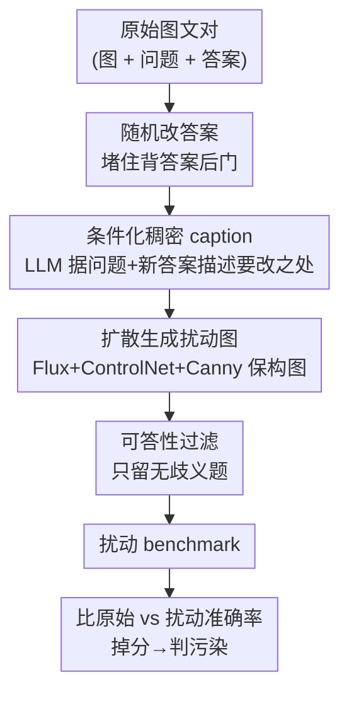

# Contamination Detection for VLMs Using Multi-Modal Semantic Perturbations

**会议**: ICLR 2026  
**OpenReview**: [https://openreview.net/forum?id=gk6OC3XIZW](https://openreview.net/forum?id=gk6OC3XIZW)  
**代码**: https://github.com/jadenpark0/mm-perturb （有）  
**领域**: 多模态VLM / 评测与基准 / 数据污染检测  
**关键词**: 数据污染, 测试集泄漏, 视觉语言模型, 语义扰动, 泛化检测

## 一句话总结
针对"VLM 在公开 benchmark 上的高分可能源于训练集泄漏而非真实推理"这一隐患，本文提出**多模态语义扰动**检测法：用 LLM + 扩散模型微改图片语义、同时把正确答案换掉，再比较模型在原始 vs 扰动 benchmark 上的准确率落差——干净模型两边都答对，被污染（记忆题库）的模型在扰动版上崩盘，从而在无需访问任何"干净参照模型"的情况下可靠地标记污染。

## 研究背景与动机

**领域现状**：现代 VLM（LLaVA、Qwen2-VL 等）在 MMMU、MMStar、RealWorldQA 等基准上刷出 SOTA。但它们的预训练语料是互联网规模、且常常闭源，组成不透明。

**现有痛点**：公开 benchmark 的测试题很可能已经混进了训练语料（test-set leakage），导致分数虚高。对用户来说，分不清模型是"真会推理"还是"背过原题"；对开发者来说，在海量语料里逐条核查测试样本是否泄漏成本高到不现实。已有的去污染（n-gram 去重）和 benchmark 重设计大多是针对 LLM 的"缓解"手段，而"反过来检测一个 VLM 是否被污染"这条互补方向几乎没人做。

**核心矛盾**：现有污染检测方法几乎全是为纯文本 LLM 设计的——要么靠"模型能否逐字背出原题"（verbatim memorization），要么靠"在文本改写后是否泛化失败"。可 VLM 是多模态的：你只扰动文本，模型完全可以靠**没动过的视觉特征**蒙对答案，文本扰动因此失效。作者把这点形式化为三条要求，并发现现有方法基本都不满足（见下文表 1 复述）：
- **Practicality（实用性）**：检测时不能假设能拿到"干净参照模型"或其训练语料，只能黑盒交互；
- **Reliability（可靠性）**：要能在不同微调方式（标准微调 vs LoRA vs 全参解冻）下都检得出；
- **Consistency（一致性）**：检测信号要和污染程度 $n=\deg_D(M)$ 正相关。

**本文目标**：给 VLM 找一个同时满足"实用 / 可靠 / 一致"的污染检测器。

**切入角度**：既然 VLM 的命门在视觉通道，那就**从图像本身下手扰动**。作者的核心假设（Assumption 1）是：污染程度越高的样本越容易被记忆，越容易过拟合、越难泛化——于是被污染模型在"难度相当甚至更低"的图像变体上反而会掉分。

**核心 idea**：用"多模态语义扰动"造一批**难度相当或更低**、但答案被改掉的图文变体；干净模型靠真推理两边都对，污染模型靠记忆只会原题、在变体上失败——**用准确率落差**而非任何泄漏先验来判污染。

## 方法详解

### 整体框架
方法要解决的是：给定一个 VLM 和一个 benchmark，在**不知道哪些题泄漏、也没有干净参照模型**的前提下，判断这个模型是否在该 benchmark 上被污染。整体思路是造一个"配对的扰动 benchmark"，然后比两条准确率曲线。

流程分三步。**第一步**，对每道原题，先把正确答案**随机改成另一个选项**——这一步是为了堵死"污染模型直接背答案"的后门：如果答案没变，背过原题的模型照样能蒙对。**第二步**，用 LLM（主实验用 GPT-4o）针对"原图 + 原问题 + 新选中的答案"生成一段**稠密 caption**，再把这段 caption 连同原图的 **Canny 边缘图**一起喂给 Flux+ControlNet，扩散生成一张**保持整体构图、只微调局部语义**的新图，使其与"被改后的正确答案"自洽。**第三步**，在数据集层面比较模型在原始 benchmark 与扰动 benchmark 上的**聚合准确率**：若模型原题对、扰动版掉分（整体准确率下降），就标记为污染。逻辑依据是——既然扰动版难度相当或更低，真会推理的干净模型应该两边都对甚至更好，只有靠记忆的污染模型才会在变体上崩。

由于扩散模型在低分辨率下渲染文字/复杂几何不可靠，部分生成图与新答案对不上，作者加了一道**过滤**：只保留"能被无歧义回答"的扰动题（主实验用人工过滤拿上界，附录证明可用强推理模型 o3 自动化）。

### 关键设计

**1. 三条形式化要求：把"什么叫好的污染检测"先定义清楚**

本文没有上来就提方法，而是先把"一个能用的检测器该满足什么"形式化，这恰好对准前面的核心矛盾。先定义单样本污染度 $\deg_D(x)=\left(\sum_{d\in D}\mathbf{1}\{x=d\}\right)\times n$，在"对整个 benchmark $D$ 微调 $n$ 个 epoch"的设定下简化为 $\deg_D(M)=n$；再立 Assumption 1：污染度越高越易被记忆、越易过拟合、泛化越差。由此推出三条要求——Practicality（黑盒、不依赖干净模型）、Reliability（跨微调策略都成立）、Consistency（信号随 $n$ 单调）。这三条不是装饰：作者用它逐一拷问已有方法（N-gram、Shared Likelihood、Guided Prompting、Multi-modal Leakage、CircularEval、Choice Confusion、BGR Shuffling、Image Masking…），发现没有一个全满足，而本文方法三条全过——动机因此落到实处而非空谈。

**2. 多模态语义扰动：扰动图像而非文本，并强制改答案**

这是全文命门所在。纯文本扰动对 VLM 失效，是因为视觉特征没动、模型能靠视觉蒙对；本文反其道**只动视觉语义**。具体地，对每道题**随机抽一个新的正确答案**，再用扩散模型把图像改到与新答案自洽。"换答案"这一步至关重要：它把"靠记忆背原答案"和"靠推理读新图"彻底区分开——污染模型记的是旧图文对，面对新答案对应的新图必然出错。而 ControlNet 用 Canny 边缘图约束，保证**全局构图不变、只微调局部元素**，使扰动题难度与原题相当或更低（实验中干净模型在扰动版上准确率反而更高，反证了这点）。最终判据极简：聚合准确率落差 $\Delta = \text{Acc}_{\text{perturb}} - \text{Acc}_{\text{orig}}$，干净模型 $\Delta\ge 0$、污染模型 $\Delta\ll 0$，**完全不需要泄漏数据的 ground truth，也不需要干净参照模型**，因而独占 Practicality。

**3. 答案条件化的稠密 caption：让"改哪里"被精确表达出来**

为什么不直接"图+新答案"生成，而要先生成 caption？作者发现：若只用"问题+新答案"条件化生成图像，干净模型在生成图上的表现会大幅低于原始数据集，且无效扰动（关键视觉成分被漏掉、问题变得无解/有歧义）频繁出现。关键在于 caption 这一中间层起了"显式推理"的作用——LLM 先想清楚"图里**哪些部分要改**才能让新答案成立"，再产出一段强调这些改动的稠密描述；Flux+ControlNet 随后只需照着 caption **精确渲染这些局部**。把"该改哪、改成什么"先用语言写出来，再交给扩散模型执行，扰动质量和难度可控性都明显变好——这是从"图直接到图"升级到"图→语言计划→图"的一步。

**4. 单一可答性过滤：把生成模型的缺陷和检测原理解耦**

因为当前扩散模型在低分辨率下会渲染失败（文字糊、几何错），作者只用**一个判据**过滤：扰动题必须能被无歧义回答（不看生成画质好坏）。这条设计的意图很明确——评测集只关心"能不能考推理"，不关心"图好不好看"；过滤是被生成模型现阶段的局限**逼**出来的，而非检测原理本身需要。作者据此论证：随生成模型变强，这道人工/自动过滤终将不再必要。附录也证明这步可由 o3 自动完成（自动保留 294 题，与人工保留集 253 题重合，一致性高）。

### 一个完整示例
以 RealWorldQA 一道题为例（图 2）："最左侧车辆离相机多远？A. 20m / B. 60m / C. 100m"，原答案是 A. 20m。① 随机把正确答案改成 B. 60m；② GPT-4o 据"原图+原问题+新答案 60m"生成稠密 caption，描述需要把最左车辆挪远的视觉细节；③ Flux+ControlNet 用 Canny 边缘保住道路/其他车的整体构图，只把最左车辆渲染到"约 60m"的位置，得到新图；④ 过滤确认这题无歧义可答。最终：干净模型读新图照样答对 B；而背过原图文对的污染模型仍倾向答旧答案 A，错。把全数据集这样跑一遍，污染模型的聚合准确率就会明显低于原始 benchmark，落差即污染信号。

## 实验关键数据

设置：模型用 LLaVA-v1.5-7B、Qwen2-VL-7B（附录含 13B）；benchmark 用强视觉依赖的 MMStar、RealWorldQA。通过在评测集上继续微调（标准微调 / 仅 LLM / 全参解冻 / LoRA，各 1–3 epoch）人为制造污染。过滤后 RealWorldQA 留 440 题、MMStar 留 ~478–495 题。

### 主实验（MMStar，∆ = 扰动版 − 原版准确率）

| 模型 / 设置 | 原版 Acc | 扰动版 Acc(_P) | ∆ | 检出污染? |
|------|------|------|------|------|
| LLaVA-v1.5-7B（干净） | 37.78 | 69.29 | **+31.51** | —（应为正） |
| LLaVA-7B LoRA 3ep（污染） | 54.34 | 38.18 | −16.16 | ✓ |
| LLaVA-7B LLM+MLP 3ep（污染） | 50.71 | 36.97 | −13.74 | ✓ |
| Qwen2-VL-7B（干净） | 62.02 | 78.18 | **+16.16** | —（应为正） |
| Qwen2-VL-7B LoRA 3ep（污染） | 95.96 | 63.64 | −32.32 | ✓ |
| Qwen2-VL-7B LLM only 3ep（污染） | 98.99 | 55.96 | −43.03 | ✓ |

干净模型在扰动版上**反而涨分**（验证扰动题确实"难度相当或更低"），所有污染模型一律掉分且**落差随 epoch 单调拉大**（满足 Consistency）。

### 对比基线（同表 MMStar）

| 方法 | 是否需干净模型 | 典型失败 |
|------|------|------|
| Multi-modal Leakage | 需要 ✗ | 漏检 LLaVA 标准微调 3ep；信号跨 benchmark 不稳 |
| CircularEval | 需要 ✗ | 漏检 LLaVA-LoRA 2/3ep、Qwen 标准微调 2ep |
| Choice Confusion | 不需要 ✓ | 对 LLaVA 全策略全 epoch 漏检；LoRA 越训越"涨" |
| **本文（语义扰动）** | **不需要 ✓** | 三条要求全满足 |

### 消融 / 鲁棒性

| 配置 | 关键结果 | 说明 |
|------|---------|------|
| NaturalBench 真实反事实 | 污染模型掉至 −45.58%，干净模型稳定 | 不依赖合成编辑，自然语义变化也成立 |
| 改写（paraphrase）污染 | 原版虚高、扰动版掉分（最高 −21.41） | 对低 n-gram 重叠的改写污染仍鲁棒 |
| LLaVA-13B 放大规模 | 检测依旧有效（∆ 最高 −42.28） | 更大模型更易记忆，方法照样适用 |
| 预训练阶段泄漏 | 混入 665K 语料训 1ep，仍检出（∆ −1.82） | 不局限于微调阶段 |
| 混合 benchmark 稀释 | RQA/MMStar 仅占 6.7%/13.3%，仍稳定检出 | 弱污染信号下依然可靠 |
| o3 自动过滤 | 自动留 294 题，与人工集重合 253 | 人工过滤可自动化 |
| Molmo-7B-D 替代 GPT-4o | 398 有效题，检测趋势不变 | 框架与具体生成模型解耦 |

### 关键发现
- **"换答案 + 改图像"缺一不可**：不换答案，污染模型背原答案就能蒙混；不改图像（只改文本），VLM 靠视觉蒙对。两者合一才把记忆和推理切开。
- **答案条件化 caption 是质量关键**：去掉"基于原问题+原答案+新答案"的条件化，干净模型在生成图上的表现大幅下降、无效扰动激增。
- **过滤是生成模型局限所迫、非原理需要**：人工核查显示仅 ~1.8%（RQA）/ ~3.4%（MMStar）扰动图偏离原视觉细节。

## 亮点与洞察
- **把"检测污染"翻译成"检测泛化失败"**：不去猜哪些题泄漏（不可行），而是构造难度更低的等价题，让记忆型模型自己暴露——这是最巧的视角转换，也是它能摆脱"干净参照模型"依赖的根源。
- **"图→语言计划→图"的可控编辑范式**：用 LLM 先写出"该改哪"，再让 ControlNet 照着改，比"图直接到图"更可控、无效率更低；这套思路可迁移到任何需要"语义可控、构图保持"的反事实数据生成（如鲁棒性评测、增广）。
- **先立要求、再造方法**：把"好检测器"形式化为三条可证伪的要求，使方法对比不再各说各话，也让"动机具体到本文"落到实处。

## 局限与展望
- **强依赖视觉决定答案**：若问题不看图也能答，扰动图像就失去意义、改答案反而把题搞坏；因此只能用在 RealWorldQA、MMStar 这类强视觉依赖的 VQA 上，泛化到弱视觉依赖任务受限。
- **当前需人工过滤**：受扩散模型低分辨率渲染能力限制，部分扰动图与新答案对不上需过滤；虽证明可用 o3 自动化，但仍是流水线的额外环节。
- **失败模式**：当扰动改得太多、新图与原图差异过大时，污染模型可能"原题、扰动题都对"，从而**藏住**污染（RQA 约 1.8%、MMStar 约 3.4% 的图偏离原视觉细节）。
- **主要在多选 VQA 验证**：作者称框架不绑定多选，自由生成题可用字符串匹配 / 似然 / LLM-as-judge 评估（附录 F.7），但正文证据集中在多选。

## 相关工作与启发
- **vs LLM 逐字记忆类（N-gram Accuracy / Shared Likelihood / Guided Prompting）**：它们靠"模型能否重建原题/原选项顺序"判污染，本质是文本侧 verbatim memorization 检测；对 VLM 失效，因为模型能靠未动的视觉特征绕过，且本文实验显示它们不满足三条要求。
- **vs Multi-modal Leakage（Chen et al., 2024a）**：用"纯文本作答 benchmark 时的涨分"判泄漏，但**设计上就需要干净模型**，不满足 Practicality，且跨策略信号不稳。
- **vs CircularEval（Liu et al., 2024b）/ Choice Confusion（Yao et al., 2024）**：前者靠轮换选项要求全对、缺乏阈值无关的判据；后者靠"换成更易选项后是否涨分"，对 LLaVA 全线漏检。本文以"视觉语义扰动 + 换答案 + 准确率落差"同时拿下三条要求，是首个系统研究 VLM 在多种污染/检测策略下行为的工作。

## 评分
- 新颖性: ⭐⭐⭐⭐⭐ 首个面向 VLM 的污染检测方法，"扰动视觉语义 + 换答案 + 测泛化落差"的视角新颖且自洽。
- 实验充分度: ⭐⭐⭐⭐⭐ 跨两模型族、两 benchmark、多微调策略、规模放大、预训练泄漏、混合稀释、自动过滤、换 captioner 等消融齐全。
- 写作质量: ⭐⭐⭐⭐⭐ 先立形式化要求再造方法，逻辑链清晰，图示直观。
- 价值: ⭐⭐⭐⭐⭐ 直击 VLM benchmark 可信度这一现实痛点，方法简单、黑盒可用、代码与数据开源。

<!-- RELATED:START -->

## 相关论文

- [\[ICLR 2026\] Preference Leakage: A Contamination Problem in LLM-as-a-judge](preference_leakage_a_contamination_problem_in_llm-as-a-judge.md)
- [\[ICLR 2026\] Detecting Data Contamination in LLMs via In-Context Learning](detecting_data_contamination_in_llms_via_in-context_learning.md)
- [\[ACL 2025\] MMLU-CF: A Contamination-free Multi-task Language Understanding Benchmark](../../ACL2025/llm_evaluation/mmlu-cf_a_contamination-free_multi-task_language_understanding_benchmark.md)
- [\[ICLR 2026\] BiasScope: Towards Automated Detection of Bias in LLM-as-a-Judge Evaluation](biasscope_towards_automated_detection_of_bias_in_llm-as-a-judge_evaluation.md)
- [\[ICLR 2026\] vCache: Verified Semantic Prompt Caching](vcache_verified_semantic_prompt_caching.md)

<!-- RELATED:END -->
