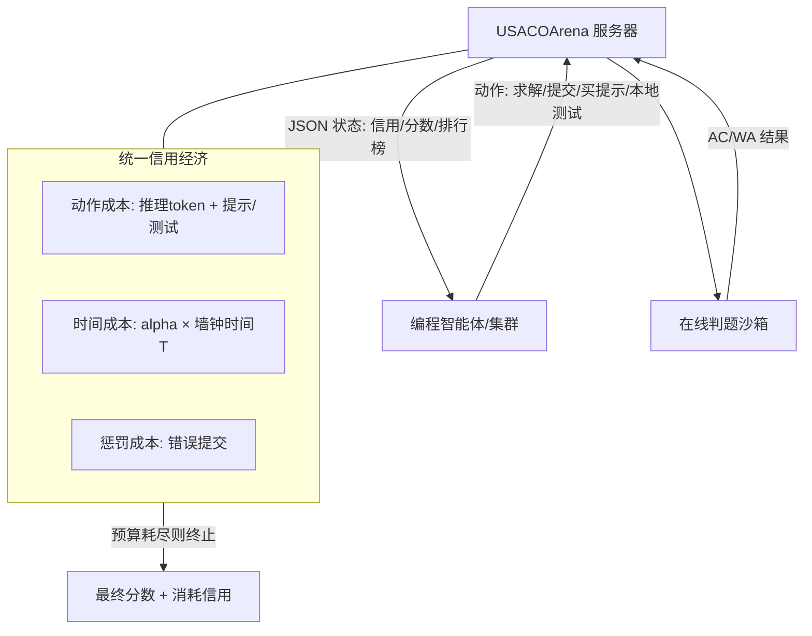

# Credit-Budgeted ICPC-Style Coding: When Agents Must Pay for Every Decision

**会议**: ICLR 2026  
**OpenReview**: [https://openreview.net/forum?id=WC2g3zDF2o](https://openreview.net/forum?id=WC2g3zDF2o)  
**代码**: [https://github.com/maple-zhou/USACOArena](https://github.com/maple-zhou/USACOArena)  
**领域**: LLM 评测 / 编程智能体 / 资源感知决策  
**关键词**: 编程智能体, 成本感知评测, ACM-ICPC, 信用预算, 智能体集群, POMDP  

## 一句话总结
本文提出 **USACOArena**——一个用统一"信用"经济驱动的 ACM-ICPC 风格在线竞技场，让编程智能体为生成的每个 token、每次本地测试和每一秒墙钟时间付费，把对编程智能体的评测从"孤立的代码正确率"转向"预算约束下的成本感知决策"。

## 研究背景与动机
**领域现状**：以 Claude Code、Codex 为代表的自主编程智能体已能稳定解决复杂编程任务，社区也快速转向用多智能体集群（swarm）压缩交付时间。但几乎所有评测（HumanEval、SWE-bench、LiveCodeBench 等）都只盯着最终代码的静态正确率。

**现有痛点**：这些基准默认了一个"无限资源"的理想环境——在一个**时间真空**里评判模型，完全不计 token 成本、墙钟时间和本地测试开销。一个集群可能"解出了题"，却烧掉海量算力、被沉重的协调开销拖垮，而这些战略浪费没有任何指标能反映出来。当部署规模扩大到大型智能体集群时，忽视机会成本会直接导致灾难性的预算耗尽。

**核心矛盾**：真实软件工程是一场**资源受限的竞赛**，快速交付和正确代码同等重要；可现有评测把它简化成了一道只看答案对错的静态谜题。智能体缺少一个能量化"每个动作的真实代价"的动态反馈信号。

**本文目标**：构造一个无摩擦、信息完全的测试环境，把交付时间、推理 token、测试开销统一折算成一种可量化的"信用"反馈，逼迫智能体在速度、算力、可靠性之间做战略权衡，从而测量并培养智能体真正的**成本感知自主性**。

**核心 idea（信用经济 + ICPC 竞技场）**：选择 ACM-ICPC 竞赛格式是因为它天然是一个**完全信息、规则与预算前置披露**的自包含博弈，能剥离真实仓库里"文档缺失、需求模糊、环境复杂"等混淆变量，纯净地观察决策成本；再叠加一个让"每个决策都要花钱"的信用预算，把静态测试变成动态的资源管理生存挑战。

## 方法详解

### 整体框架
USACOArena 把对编程智能体的评测建模成一个**预算约束的部分可观测马尔可夫决策过程（POMDP）**。智能体在一个回合制循环里与服务器交互：每回合服务器把游戏状态（剩余信用、当前分数、排行榜）以 JSON 推给智能体，智能体回复一个动作（如 `SUBMIT_SOLUTION`），所有提交的代码在安全的在线判题沙箱里运行。整个系统由三块拼成——ICPC 化的赛制与题库、统一信用模型、基于 MCP 的通信架构。

### 关键设计

**1. ICPC 赛制 × USACO 题库：可分层、防污染的竞技场**　选用 ACM-ICPC 的"全有或全无"计分（不给部分分、奖励快速且无 bug 的代码），因为它比侧重理论极限的 IOI 格式更贴近真实软件工程。但官方 ICPC 题对当前模型太难，于是改用 USACO 题库——难度从 Bronze 到 Platinum 分层，每场比赛用 12 道题模拟一次 ICPC 世界总决赛，从而清晰区分不同能力的智能体。为防训练-测试重叠，采用"活基准（Living Benchmark）"策略：USACO 每年发布四场新赛，数据集持续更新到最新赛季，保证题目对模型是未见的。智能体的策略 $\pi$ 输出二元组 $(\text{Score}, \text{Consumed Credit})$，目标是在不超预算的前提下最大化分数：

$$\max_{\pi} \ \text{Score}(\pi) \quad \text{s.t.} \quad C_{\text{action}}(\pi) + C_{\text{time}}(\pi) \le C_{\text{limit}}$$

**2. 统一信用模型：把 token、时间、测试折算成同一种货币**　信用经济由三部分构成。*动作成本* $C_{\text{action}}$ 包含 LLM 推理成本（按各模型 API 价格归一化，越贵的模型同样推理消耗越多信用，逼智能体在思考质量与成本间权衡）以及提示/本地测试成本（折算读文档、本地调试的开销）。*交付时间成本* $C_{\text{time}}=\alpha T$ 是本文的关键新增——追踪从开始到结束的绝对墙钟时间 $T$，乘以可调时间系数 $\alpha$ 折算成信用：调大 $\alpha$ 模拟"看重快速交付"的场景，调小则模拟"看重算力效率"的场景。*惩罚成本* $C_{\text{penalty}}$ 在错误提交（如 Wrong Answer）时触发，阻止智能体瞎猜。终止规则与计分故意错开：智能体只在 $C_{\text{action}}+\alpha T \le C_{\text{limit}}$ 被打破时才停止，但最终排名的决胜项用包含惩罚的总消耗 $C_{\text{consumed}}=C_{\text{action}}+\alpha T + C_{\text{penalty}}$——总分是首要排名指标、消耗信用作 tie-breaker，这样既奖励多解题又惩罚乱提交，逼智能体又快又准又省。

**3. 基于 MCP 的回合制协议：可复现、语言无关、易扩展到集群**　通信层搭在 Model Context Protocol 上，解决智能体研究的可复现性危机：MCP 与编程语言无关，任何智能体都能轻松接入同一套动作空间和观测，保证所有参赛者看到相同数据、用相同动作；它原生支持多轮对话，因此能自然地把单智能体竞技场扩展成未来的多智能体 ICPC 团队赛。配合在线判题沙箱，平台兼具安全性与可复现性。

## 实验关键数据

在 2024–2025 USACO 赛季的 48 道题上评测，每场跑 5 次取平均；入场需先解出该场最简单的 Bronze 题作为资格赛。

### 主实验：顶级模型的两层稳定梯队
跨四场难度各异的比赛，出现稳定的两层性能梯队：**Gemini-2.5-pro 与 GPT-5-Codex 始终稳居第一、第二**，与其余波动剧烈的模型拉开明显差距。基准远未饱和——每场理论满分 54 分（Bronze→Platinum 加权），而顶级智能体平均只拿约 15 分，对应官方 USACO 的 **Advanced/Gold 档**（相当于通过中级、但在复杂算法推理上吃力的高中竞赛选手）。

| 智能体 | 平均排名 | 胜率 | 最高分 | 最低分 |
|---|---|---|---|---|
| Gemini-2.5-pro | 1.3 ± 0.47 | 70.0% | 19 | 4 |
| GPT-5-Codex | 1.7 ± 0.47 | 30.0% | 29 | 3 |

一个鲜明的悖论：GPT-5-Codex **峰值能力更强**（最高 29 分，证明它有解 Platinum 题的潜力），但 **Gemini-2.5-pro 胜率翻倍**。原因是策略差异——Gemini 走"广度优先"的激进探索（多尝试题目、换更广覆盖），GPT-5-Codex 走"完美主义"的保守利用（只攻高把握题、首次提交准确率极高但放弃大量可解题）。结论：在竞争环境里，**广度探索能打赢更强但过度保守的利用策略**，瓶颈是战略而非纯解题能力。

### 消融实验：能力受限而非预算受限
在 2025 February Contest 上跨 8 个模型、7 个环境维度做消融：

| 消融维度 | 设置 | Gemini-2.5-pro 得分 | 结论 |
|---|---|---|---|
| 信用预算 | 10M（紧） | 13.2 → 8.3 | 缩预算显著掉分（约束生效） |
| 信用预算 | 40M（翻倍） | ≈ 13.0 | 加预算**无改善** |
| Prompt | 强制 CoT (P1.1) | 13.2 → 微升 | 提示工程难修战略缺陷 |
| Prompt | 激进/机会主义 (P2.1) | 13.2 → 14.7 | 仅边际提升；冗长 Few-Shot 反而掉分 |

核心发现：当前 SOTA 智能体是**能力受限（Capability-Limited）而非预算受限**——它们在撞到信用上限之前早就撞上了"推理墙"，富余预算转化不成更高分。弱模型则表现出明显的地板效应（无论资源多寡都在 1.0 附近）。"保守 vs 激进"的画像是模型对齐与架构先验的**内在属性**，不是提示能改的。

### 关键发现
- **First-Move Effect（首步效应）**：自博弈（两个相同 gemini-2.5-pro 对战）中，结果与首道尝试题的成败强相关——早期撞上可解题进入"成功循环"（有信心冒险攻难题），随机选到数学上不可解的题则陷入"恐慌循环"（快速耗尽预算、退化为过度保守、性能崩塌）。同一策略能产生宽广的路径依赖结果谱，证明环境有足够的奖励梯度供 RL 优化。
- **集群的协调税**：用 Codex 集群测三种策略，"Speedy Spendthrift"（最大化并行、不计 token）虽压缩了交付时间却因爆炸式的**通信开销**过早烧光预算，分数仅 3；"Cost-Aware Strategist"（按剩余预算动态平衡并行探索与串行执行）以远少的时间拿到最优分 8，凸显多智能体系统亟需动态成本感知的资源管理。

## 亮点与洞察
- **范式转移**：把编程智能体评测的核心问题从"代码对不对"重定义为"在竞争与预算约束下如何成本感知地解决问题"，并用 POMDP 形式化，区分了考"晶体智力"（套用已知模式）的旧基准与考"流体智力"（不确定下优化算法推理、管理风险、抑制协调税）的本框架。
- **时间也要付费**：把绝对墙钟时间通过 $\alpha T$ 折进信用，是少见地把"交付速度"也变成可调约束的设计，让同一题库能模拟"重速度"和"重算力"两种竞赛情景。
- **能力 vs 策略解耦**：用"峰值能力更强者反而胜率更低"的悖论，干净地证明了战略决策（风险评估、预算分配）和原始解题能力一样重要——这是单看静态准确率永远看不到的。
- **既是评测也是训练场**：自博弈展示的路径依赖、非确定性行为分化，使 USACOArena 不只是静态基准，而是能提供经济奖励梯度的动态 RL 训练环境。

## 局限与展望
- **题库局限于 USACO 竞赛题**：完全信息、自包含的竞赛格式虽便于剥离混淆变量，但与真实仓库级软件工程（含文档缺失、需求模糊）之间仍有 gap，结论能否迁移到真实 SWE 任务需进一步验证。
- **信用折算的归一化主观性**：把 token、时间、测试统一成信用依赖 API 价格归一化和时间系数 $\alpha$ 的设定，不同 $\alpha$/定价会改变排名，存在一定人为调参空间（作者用大规模消融部分缓解）。
- **网络延迟混淆**：跨商业 API 评测引入了不公平的网络延迟，主实验不得不把 $\alpha=0$ 才能纯净比较纯策略推理，绝对时间维度只在单模型 Codex 集群上单独评估。
- **多智能体仍是雏形**：集群实验只用 Codex 的三种手工策略画像，真正"自学会"成本感知协调的多智能体方法留待未来用本环境做 RL 训练去探索。

## 相关工作与启发
- **编程基准谱系**：从 HumanEval/MBPP 的功能正确性，到 CodeContests 的算法竞赛、SWE-bench 的真实工程，再到 LiveCodeBench 的活题集——本文指出它们共同的盲区是"时间真空"，只测最终代码静态准确率，不测经济现实。
- **编程集群框架**：coder-tester 共演化、generator-verifier、policy-critic、retriever-generator，以及 AutoGPT/MetaGPT/AgentVerse/OpenHands 等多智能体平台——架构日趋复杂，但有效性仍用静态基准评判，造成"解出题却浪费算力"的严重脱节。
- **可执行训练环境**：SWE-rebench、R2E-Gym 提供可执行训练场，ColBench、TheAgentCompany 测多步任务，但本质都是只奖励最终产物的执行沙箱；USACOArena 的差异是用直接经济反馈灌输"过程智慧"，为每个决策付费。
- **启发**：成本感知 RL 训练编程智能体、把 $\alpha T$ 时间预算思想迁移到真实 SWE-agent、用 First-Move Effect 设计更鲁棒的早期决策探索策略、为多智能体集群引入显式的"通信预算"以抑制协调税，都是值得延伸的方向。

## 评分
- **新颖性**: ⭐⭐⭐⭐⭐ 把交付时间/token/测试统一成"信用经济"、用 ICPC 博弈剥离混淆变量、并将编程智能体评测形式化为预算约束 POMDP，是一个清晰且少见的范式转移。
- **实验充分度**: ⭐⭐⭐⭐ 跨 8 模型 7 维度的系统消融、四场比赛 5 次重复、自博弈轨迹分析与集群画像都很扎实；扣分在于题库限于竞赛题、绝对时间维度只在 Codex 上评估。
- **写作质量**: ⭐⭐⭐⭐ 动机与叙事清晰、图表（信用经济、策略雷达图、时间-算力权衡）有力；少量段落（3.2 节）存在明显重复。
- **价值**: ⭐⭐⭐⭐⭐ 直指智能体集群规模化部署的预算耗尽痛点，既是诊断 SOTA"能力受限非预算受限"的评测工具，又是可做 RL 的训练场，对成本感知智能体研究有实质推动。

<!-- RELATED:START -->

## 相关论文

- [\[ICML 2026\] HiPER: Hierarchical Reinforcement Learning with Explicit Credit Assignment for Large Language Model Agents](../../ICML2026/llm_evaluation/hiper_hierarchical_reinforcement_learning_with_explicit_credit_assignment_for_la.md)
- [\[ICML 2026\] Multi$^2$: Hierarchical Multi-Agent Decision-Making with LLM-Based Agents in Interactive Environments](../../ICML2026/llm_evaluation/multi2_hierarchical_multi-agent_decision-making_with_llm-based_agents_in_interac.md)
- [\[ICLR 2026\] When LLMs Get Significantly Worse: A Statistical Approach to Detect Model Degradations](when_llms_get_significantly_worse_a_statistical_approach_to_detect_model_degrada.md)
- [\[ICLR 2026\] When to Ensemble: Identifying Token-Level Points for Stable and Fast LLM Ensembling](when_to_ensemble_identifying_token-level_points_for_stable_and_fast_llm_ensembli.md)
- [\[ICLR 2026\] Do LLM Agents Know How to Ground, Recover, and Assess? Evaluating Epistemic Competence in Information-Seeking Agents](do_llm_agents_know_how_to_ground_recover_and_assess_evaluating_epistemic_compete.md)

<!-- RELATED:END -->
