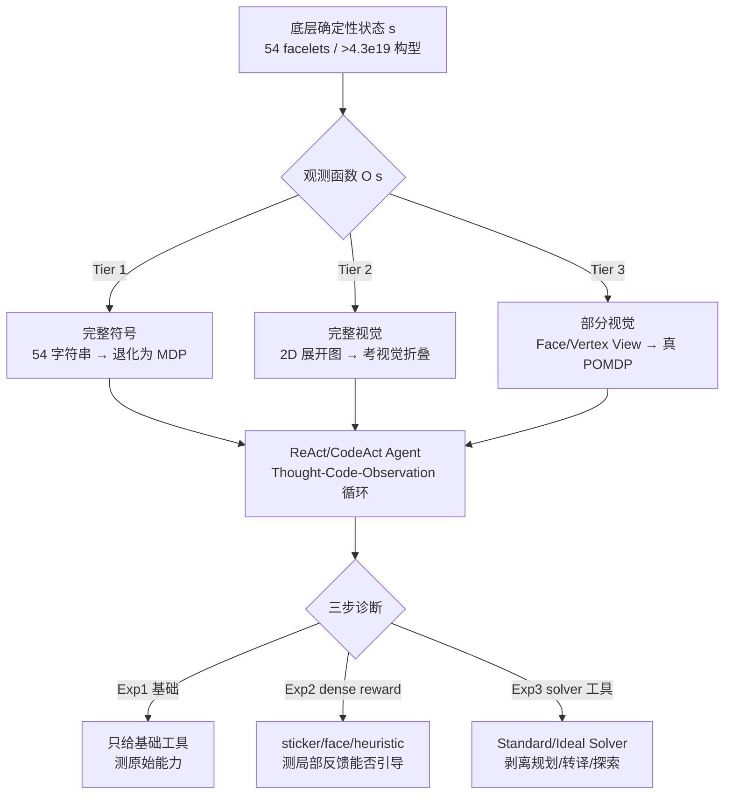

# CubeBench: Diagnosing Interactive, Long-Horizon Spatial Reasoning under Partial Observations

**会议**: ICLR 2026  
**OpenReview**: [https://openreview.net/forum?id=MCmQyZ9Gxa](https://openreview.net/forum?id=MCmQyZ9Gxa)  
**代码**: [https://cubebench.c7w.tech/](https://cubebench.c7w.tech/)  
**领域**: LLM 评测 / Agent 基准 / 空间推理  
**关键词**: 空间智能, 长程规划, 部分可观测, POMDP, 魔方, LLM Agent  

## 一句话总结
用魔方搭了一个三层难度的生成式基准 CubeBench，把「空间推理 / 长程心智模拟 / 部分观测下的主动探索」三种物理世界核心认知能力从感知里剥离出来单独测，结果发现包括 GPT-5 在内的所有主流 LLM 在长程任务上 pass rate 一律 0.00。

## 研究背景与动机
**领域现状**：LLM Agent 在数字世界（写代码、操作网页、调用工具）已经很能打，下一个宏大目标是把它们部署进真实物理世界。但物理世界要求的不只是语言理解，而是要在脑中构建并持续维护一个稳健的「空间心智模型」（spatial mental model）。

**现有痛点**：现有 agent 基准没法干净地诊断这件事。Search/GUI 类基准基本是 2D、状态显式可见，碰不到 3D 空间推理；Code/Gym 类有长程状态追踪但没有 3D 几何理解；Embodied Simulator（具身仿真）三种能力都涉及，却把它们和复杂视觉感知耦在一起，一旦失败你分不清是认知出问题还是感知出问题。最接近的 MindCube 只测静态 3D 场景的推理，不涉及「通过长程、改变状态的交互去更新空间模型」。

**核心矛盾**：要评估的是纯认知能力（推理/规划/探索），但现实任务总把认知和感知噪声搅在一起，导致失败归因不清。

**本文目标**：造一个把感知和推理解耦、失败可精确归因、还能无限生成不同难度任务的诊断基准。

**核心 idea**：**[确定性微缩世界]** 选魔方作为理想实验台——它规则完全确定、状态空间巨大（>4.3×10¹⁹ 种构型）、群论结构清晰，既大到无法靠随机搜索蛮干、又完全可预测，可以在零物理不确定性的前提下隔离三种认知能力；再配一个**三层递进观测**框架，从「完整符号状态」逐级退化到「部分视觉观测」，让难度沿认知轴而非感知噪声轴增长。

## 方法详解

### 整体框架
CubeBench 把魔方求解形式化为一个 POMDP $(S, A, T, R, \Omega, O)$：状态 $S$ 是 3×3×3 魔方所有构型（54 个贴纸的颜色，确定性表示），动作 $A$ 是 12 个 Singmaster 标准转动（F/B/L/R/U/D 及其逆）加上 Tier 3 专属的视角变换动作，转移 $T$ 完全确定。同一个底层状态，通过不同观测函数 $O(s)$ 暴露给 agent，构成三层递进诊断难度；评测则用一个三步诊断框架（基础 agent → 加 dense reward → 加 solver 工具）逐层剥离失败原因。

### 关键设计

**1. 三层观测：让难度沿认知轴递增，而非感知噪声轴。** Tier 1（Full Symbolic）把状态给成一个 54 字符的字符串，每个字符是一个贴纸的颜色，信息完整，问题退化成完全可观测的 MDP——这一层纯测基础状态追踪和规划。Tier 2（Full Visual）把同样完整的状态画成一张 2D 展开图，agent 必须在脑中把这张平面图「折」回 3D 立方体，才能理解那些在平面上不相邻、实际却相邻的面，专门考视觉空间推理。Tier 3（Partial Visual）只给一张局部视图——要么单面视图（Face View），要么从某个顶点看过去能见三个相邻面的顶点视图（Vertex View）——信息不完整，构成真正的 POMDP，agent 必须靠视角变换动作主动探索、把碎片拼成完整世界模型。三层共享同一个底层引擎，唯一变的是 $O(s)$，因此性能落差能干净地归因到某一种认知能力。

**2. 可选 dense reward：四档梯度反馈探针。** 默认是稀疏二值奖励——只有进入完全复原的终止态才给 $R=1$，其余全 0。为探究「局部反馈能否引导搜索」，论文额外实现了三种基于度量差分的稠密奖励，定义为转移前后某度量函数 $\phi$ 的变化量 $R_t = \phi(s_{t+1}) - \phi(s_t)$：$\phi_{\text{sticker}}$ 数有多少贴纸归位（9→54，最细粒度的低层信号）、$\phi_{\text{face}}$ 数有多少个面整面复原（更粗、更接近概念）、$\phi_{\text{heuristic}}$ 用经典解法的启发式估计离目标的距离（最抽象但最 informed）。加上 no-reward，一共四档，用来诊断不同粒度的过程反馈对 agent 推理的实际作用。

**3. 三层 solver 诊断：把失败拆成规划 / 转译 / 探索三段。** 这是诊断框架的核心。Basic Agent 只有 `make_move`、`get_observation`（和 Tier 3 的 `apply_view_transformation`），从零规划。Standard-Solver Agent 给一个要求严格符号输入格式的最优 solver——agent 想用它必须先准确感知状态、再把感知**转译**成 solver 要的格式（比如调和环境的面序和 solver 期望的顶点编号方案），最后执行 solver 给的解。Ideal-Solver Agent 则把转译这步也自动化，agent 直接把感知到的状态丢给 solver。三者两两对比就能精确定位失败源头：Basic vs Standard-Solver 的差距 = 内在长程规划能力；Standard vs Ideal 的差距 = 空间转译/程序化工具使用能力；Ideal-Solver 在部分观测下还失败 = 主动探索能力的缺陷。

**4. 深度可控的生成式课程：用最优解长度定义难度。** 任务难度定义为最优解所需的转动步数，即状态的「深度」$d$。生成测试用例时用一个可证明最优的 solver（Kociemba 类），对目标深度 $d$ 反复打乱并验证「存在长度 $d$ 的解、但不存在长度 $d-1$ 的解」，从而保证真实深度精确为 $d$。论文把深度 1/2/3/4 归为短程任务、8/12/16/20 归为长程任务。这种生成式特性允许造出几乎无限、难度细粒度可调的课程，是评估 agent 能否随经验「自进化」的关键。

## 实验关键数据

### 主实验（Experiment 1：无辅助 Basic Agent，Pass rate）

| 模型 | 符号-短 | 符号-长 | 视觉-短 | Face-短 | Vertex-短 | 所有长程 |
|------|---------|---------|---------|---------|-----------|----------|
| **GPT-5** | **0.75** | 0.00 | 0.20 | 0.40 | 0.05 | **0.00** |
| MLP (Policy Gradient) | 0.75 | 0.00 | – | – | – | 0.00 |
| Grok-4 | 0.20 | 0.00 | 0.05 | 0.00 | 0.00 | 0.00 |
| Gemini 2.5 Pro | 0.10 | 0.00 | 0.05 | 0.05 | 0.00 | 0.00 |
| Claude Sonnet 4 | 0.05 | 0.00 | 0.00 | 0.00 | 0.00 | 0.00 |
| GPT-4o | 0.00 | 0.00 | 0.00 | 0.10 | 0.00 | 0.00 |

最刺眼的结论：**所有模型、所有模态，长程任务 pass rate 一律 0.00**；即便最强的 GPT-5，短程符号任务也只有 0.75，仅与一个传统策略梯度 MLP 持平。从符号到视觉输入性能断崖式下跌，说明「视觉思维」是主要瓶颈。部分模型（如 InternVL-3、Kimi K2）的平均 `make_move` 调用次数高达数万乃至 40 万次，是在做暴力搜索却仍解不开。

### Dense Reward 消融（Experiment 2，GPT-5 Pass rate）

| Reward | 符号-短 | 视觉-短 | Face-短 | Vertex-短 | 长程 |
|--------|---------|---------|---------|-----------|------|
| no reward | 0.75 | 0.20 | 0.40 | 0.05 | 0.00 |
| face | 0.85 | 0.55 | 0.50 | 0.40 | 0.00 |
| sticker | 0.65 | 0.55 | 0.55 | 0.50 | 0.00 |
| heuristic | 0.50 | 0.45 | 0.65 | 0.30 | 0.00 |

稠密奖励在短程任务上普遍涨点（尤其把视觉/Vertex 从近 0 拉到 0.4~0.5），但**长程任务依旧全 0**；而且对 GPT-5 的符号任务，heuristic/sticker 反而比 no-reward 更低——外部奖励会和强模型已涌现的内部策略冲突。对弱模型（Claude Sonnet 4）则几乎任何奖励都有帮助。

### Solver 诊断（Experiment 3，Pass rate）

| 模型 | Agent | 符号-短 | 符号-长 | 视觉-短 | Face-短 | Vertex-短 | Vertex-长 |
|------|-------|---------|---------|---------|---------|-----------|-----------|
| GPT-5 | Basic | 0.75 | 0.00 | 0.20 | 0.40 | 0.05 | 0.00 |
| GPT-5 | Standard-Solver | 0.95 | 0.95 | 0.65 | 1.00 | 0.00 | 0.00 |
| GPT-5 | Ideal-Solver | 1.00 | 1.00 | 0.95 | 0.85 | 0.00 | 0.00 |
| Claude Sonnet 4 | Ideal-Solver | 1.00 | 1.00 | 0.00 | 0.00 | 0.00 | 0.00 |

### 关键发现
- **长程规划是可外包的首要缺陷**：给了最优 solver 后，符号长程任务从 0.00 直接拉到 0.95~1.00，证明 LLM 的根本短板是长程状态追踪/规划，而非缺乏求解算法。
- **空间转译并非小事**：Standard-Solver 和 Ideal-Solver 之间仍有差距，说明「把感知到的状态转成工具要的格式」这一步本身就需要真正的空间理解，是下一个待攻克的难点。
- **主动探索是更根本的墙**：即便用 Ideal-Solver 抹掉规划和转译，**所有模型在 Vertex View 上全军覆没（0.00）**。Face View 因为网格规整，模型能把任务偷换成「算法式解析」绕过空间推理；Vertex View 复杂到无法偷换，模型就彻底崩了——暴露出真正的 3D 空间推理与主动探索能力的缺失。

## 亮点与洞察
- **「确定性微缩世界」做诊断基准的范式很漂亮**：魔方的群论结构 + 零物理噪声，让「失败可精确归因」从口号变成可操作的实验设计，这是 embodied simulator 给不了的。
- **三层 solver 减法实验**设计精巧：通过逐步「替 agent 卸掉一种认知负担」，把一个混合失败干净地拆成规划/转译/探索三段，是这篇方法论上最值得借鉴的部分。
- **「模型会想方设法绕过空间推理」**这个观察很有价值：Face View 上模型靠把 3D 问题降维成字符串解析来作弊，一旦 Vertex View 堵死这条路就原形毕露——提醒我们很多「空间推理」benchmark 的高分可能是 parsing 而非真推理。
- **长程任务统一 0.00** 是个干脆利落、足够 alarming 的负面结论，对「LLM 即将走进物理世界」的乐观叙事是一记冷水。

## 局限与展望
- **域特异性**：魔方虽是理想隔离实验台，但它的确定性、离散动作、群论结构离真实物理世界（连续、随机、含摩擦/碰撞）仍有距离，「解耦感知」的代价是牺牲了生态效度——在 CubeBench 上的结论能否外推到真实操控任务需谨慎。
- **只诊断不开方**：论文很彻底地定位了瓶颈，但没有提出改进 agent 的方法，停在「指出问题」层面。
- **评测预算约束**：20 步上限 + 30 分钟超时下长程任务全 0，是否给足探索预算（或换更适合长程的 agent scaffold）会有非零解，论文未充分探讨。
- **未来方向**：把生成式课程用于训练而非只评测（self-evolving agent）、研究如何让模型显式维护可更新的空间世界模型、以及如何让主动探索策略可学习。

## 相关工作与启发
- **vs Embodied Simulator（AI2-THOR/Habitat 等）**：后者三种认知能力齐全但与视觉感知强耦合，失败归因困难；CubeBench 主动解耦感知换取诊断清晰度。
- **vs MindCube**：MindCube 测静态 3D 场景推理；本文加入了「通过长程、改变状态的交互去更新空间模型」这一维度。
- **vs ARC-AGI-3 / Gym**：抽象推理和长程追踪有了，但缺 3D 几何理解。
- **方法论启发**：「用一个规则确定、可生成、可证明最优的玩具域来隔离单一认知能力 + 用减法式工具实验逐层归因失败」这套思路，可迁移到其它想诊断 LLM 单项能力（如组合泛化、长程一致性）的基准设计上。

## 评分
- **新颖性**: ⭐⭐⭐⭐ 用魔方+三层观测+三层 solver 做认知能力诊断的组合很巧，把「感知-推理解耦」和「失败可归因」落到了可操作的设计上。
- **实验充分度**: ⭐⭐⭐⭐ 覆盖 ~17 个开源/闭源模型、四种模态、双 horizon、三组诊断实验和稠密奖励消融，证据链完整；扣分在缺少对探索预算敏感性的更深挖。
- **写作质量**: ⭐⭐⭐⭐ 三个研究问题 → 三组实验 → 三段归因的结构清晰，图表（尤其 Table 4 的减法对比）信息密度高。
- **价值**: ⭐⭐⭐⭐ 一个干净、可生成、可归因的空间智能诊断套件，对「LLM Agent 走向物理世界」这条线有明确的标尺意义；长程全 0 的结论也有警示价值。

<!-- RELATED:START -->

## 相关论文

- [\[ICCV 2025\] 3DSRBench: A Comprehensive 3D Spatial Reasoning Benchmark](../../ICCV2025/llm_evaluation/3dsrbench_a_comprehensive_3d_spatial_reasoning_benchmark.md)
- [\[ICML 2026\] NarrativeWorldBench: A Frontier-Saturated Benchmark and a Latent World Model for Long-Horizon Co-Creative Audio Drama](../../ICML2026/llm_evaluation/narrativeworldbench_a_frontier-saturated_benchmark_and_a_latent_world_model_for_.md)
- [\[ICLR 2026\] LFQA-E: Carefully Benchmarking Long-form QA Evaluation](lfqa-e_carefully_benchmarking_long-form_qa_evaluation.md)
- [\[ICLR 2026\] Can You Hear Me Now? A Benchmark for Long-Range Graph Propagation and Beyond](can_you_hear_me_now_a_benchmark_for_long-range_graph_propagation_and_beyond.md)
- [\[ICLR 2026\] ExpertLongBench: Benchmarking Language Models on Expert-Level Long-Form Generation Tasks with Structured Checklists](expertlongbench_benchmarking_language_models_on_expert-level_long-form_generatio.md)

<!-- RELATED:END -->
