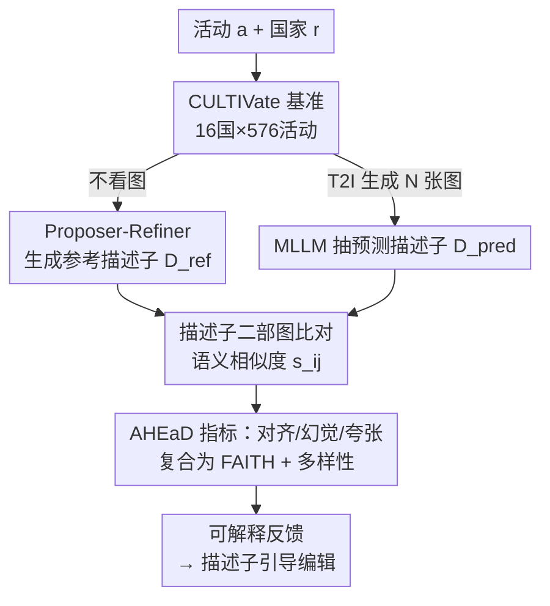

# Culture in Action: Evaluating Text-to-Image Models through Social Activities

**会议**: ICLR 2026  
**OpenReview**: [https://openreview.net/forum?id=opG4m2U0Oo](https://openreview.net/forum?id=opG4m2U0Oo)  
**项目页**: https://sinamalakouti.github.io/AHEaD/  
**代码**: 待确认  
**领域**: 生成模型评测 / 文本到图像 / 文化忠实度 / Benchmark  
**关键词**: T2I 评测、文化忠实度、社会活动、可解释指标、WEIRD 偏见

## 一句话总结
这篇论文指出现有文本到图像（T2I）评测只关注"食物/地标/服饰"这类静态物件、忽视了真正承载文化的社会活动，于是构建了 CULTIVate 基准（16 国 × 576 项社会活动 × 1.9 万张生成图）并提出 AHEaD 框架——用 LLM 生成的"文化描述子"把图像分解成可解释维度，从对齐/幻觉/夸张/多样性四个角度量化文化忠实度，其复合指标 FAITH 与人类判断的相关性比基线高 27%，并揭示出 T2I 模型对全球北方文化系统性地比全球南方更忠实。

## 研究背景与动机
**领域现状**：T2I 模型（SD、FLUX、DALL·E、GPT-Image 等）质量飞速提升，被寄望于自动生成带文化氛围的创意内容（广告、影视）。要评估"生成图像够不够文化忠实"，现有跨文化基准（Kannen 等、Jha 等、Basu 等）几乎都是**以物件为中心**的：考几个国家的地标、服饰、食物，看模型画得对不对。

**现有痛点**：作者认为文化的精髓并不在孤立的物件，而在**社会活动**——吃饭、问候、跳舞、婚丧嫁娶。活动是有上下文、可组合的，包含物体、互动、空间布局多重要素，比静态物件更能体现文化。例如"在伊朗家里吃饭"既可能围桌而坐、也可能席地围着传统餐布 sofreh，同一活动有多种合法的文化变体。物件中心的基准根本测不出这种组合性、上下文性的文化表达。

**核心矛盾**：评测方法本身也有问题。先前工作要么依赖**昂贵且不可扩展的人工评估**，要么用 **VLM 的图文对齐（ITA）分数**（如 CLIPScore）当人类判断的代理。但 VLM 自身就继承了同样的文化偏见、且有"词袋式"的组合理解缺陷。作者的分析更尖锐地发现：ITA 指标与"夸张"是**正相关**的——往图里塞越多刻板元素（给印尼的"大象蚂蚁人"猜拳游戏真的画一头大象），CLIPScore 反而越高，但文化忠实度却被破坏了。也就是说，现有自动指标奖励了错误行为。

**本文目标**：(1) 造一个真正测社会活动文化表达的基准；(2) 设计一个**可解释、可扩展、无需人工标注**、且能正确惩罚幻觉与夸张的自动指标。

**切入角度**：与其让 VLM 直接对整图打一个"忠实度"分（把文化偏见也打进去），不如把评测**拆解成描述子层面的比对**——先用 LLM（不看图）为每个"活动-国家"对生成一组应当出现的"参考描述子"，再用 MLLM 仅做通用场景理解、从生成图里抽出"预测描述子"，最后比两组描述子。MLLM 只负责"看图说有什么"这种它擅长且偏见较小的活，文化判断交给结构化比对。

**核心 idea**：用"外部文化描述子的集合比对"代替"VLM 直接评分"，把文化忠实度分解为对齐（Alignment）、幻觉（Hallucination）、夸张（Exaggeration）、多样性（Diversity）四个可解释维度，再组合成复合忠实度指标 FAITH。

## 方法详解

### 整体框架
AHEaD（Alignment, Hallucination, Exaggeration, Diversity）是一个**基于描述子**的诊断框架。对每个"活动 $a$ + 国家/地区 $r$"，整条流水线分三步：

1. **参考侧（不看图）**：用 Proposer–Refiner 流水线，让 LLM 为该活动生成一组"应当出现的"文化参考描述子集合 $D^{\text{ref}}_{r,a}$，覆盖背景、服饰、物体、动作互动、空间布局五个维度。
2. **预测侧（看图）**：用提示模板"A photorealistic photo of {activity} in {country}"让待测 T2I 模型生成 $N$ 张图，再用 MLLM（InternVL3 / Qwen2.5-VL）把每张图解析成预测描述子，聚合成 $D^{\text{pred}}_{r,a}$。
3. **比对算指标**：在 $D^{\text{pred}}$ 与 $D^{\text{ref}}$ 之间建一张完全二部图，边权是两个描述子的句向量语义相似度 $s_{i,j}=\text{sim}(\hat d_i, d_j)$，在这张图上算出对齐/幻觉/夸张/多样性各指标，并组合出忠实度 FAITH。同时输出"哪些文化要素对齐了、哪些缺失、哪些被夸张"这种描述子级别的可解释反馈，可进一步用于按描述子引导的图像编辑。

### 关键设计

**1. CULTIVate：以社会活动为中心的跨文化基准**

针对"现有基准只测静态物件、测不出活动里的文化"这个痛点，作者系统化地构建了一个活动中心的基准。文化知识难以凭空获取，他们用 GPT-4o 解析两个互补的知识库——CulturalAtlas（记录问候、宗教习俗、礼仪等文化实践）与 Wikipedia（提供游戏、庆典等活动清单），抽取每个国家不重叠的活动。最终覆盖 **16 个国家、576 项活动、9 个类别**（舞蹈、问候、游戏、用餐、庆典、宗教、音乐会、婚礼、葬礼），并把活动分为三型：多变体型（一国有多种传统舞蹈/游戏）、设定型（吃饭随家庭/餐厅、室内/室外变化）、单变体型（婚礼、葬礼一国一种）。用 6 个最新 T2I 模型生成 **1.9 万+ 张图**，再从 Google 搜集约 1.2 万张候选真实图、经 CLIPScore 过滤后保留约 3 千张作真实参考。16 国按联合国分类划为全球北方（GN：美西意德法）与全球南方（GS：伊朗、土耳其、中国、印度、印尼等 11 国），为后续的偏见分析铺好对照。

**2. Proposer–Refiner：无人工标注地造出高质量参考描述子**

参考描述子是整个框架的"标尺"，质量直接决定指标可信度，但人工标注既贵又不可扩展。作者借鉴自一致性提示（self-consistency）设计了两阶段方法：**Proposer** 用多个不同的 LLM 各自独立地、为每个维度生成至多 10 个互斥描述子——用多模型是为了提高覆盖、同时抵消单模型自带的文化偏见、并捕捉同一活动的多种合法变体；**Refiner**（用文化理解最强的 GPT-4o）再过滤掉重复和错误的候选，提升精度。人类评估验证了这套流水线：90% 描述子被标为正确、平均覆盖评分 4.5/5、378 名标注者中仅 26 人报告有缺失描述子。消融（Tab. 4）也显示两阶段比只用 Proposer 单阶段把 Spearman 相关性从 0.28–0.30 提到 0.33。关键在于：参考描述子是**脱离图像、独立生成**的，因而能作为不被生成图污染的评测基准。

**3. AHEaD 四维指标：把"文化忠实"拆成可惩罚幻觉与夸张的可解释量**

这是论文的核心贡献——在描述子二部图上定义四个互补指标。**Alignment（对齐）**衡量期望文化要素的覆盖率：对每个参考描述子 $d_j$ 找其最佳匹配的预测描述子，若最大相似度超过阈值 $\tau$ 就算命中，对齐分是命中的参考描述子比例：

$$\text{ALIGN}(x_{r,a}) = \frac{1}{|D^{\text{ref}}_{r,a}|}\sum_{d_j \in D^{\text{ref}}_{r,a}} \mathbb{1}\!\left[\max_i s_{i,j} > \tau\right]$$

其中 $\tau$ 在真实图上校准（InternVL3 取 0.52、Qwen2.5-VL 取 0.67），最后对五个文化维度取平均。**Hallucination（幻觉）**反过来抓"图里多出来、参考集里没有"的错误元素，即没有任何参考匹配的预测描述子比例：

$$\text{HAL}(x_{r,a}) = \frac{1}{|D^{\text{pred}}_{r,a}|}\sum_{\hat d_i \in D^{\text{pred}}_{r,a}} \mathbb{1}\!\left[\max_j s_{i,j} \le \tau\right]$$

**Exaggeration（夸张）**专门治"过度强调刻板元素"这个 ITA 指标反而奖励的毛病：先用 LLM 为地区 $r$ 提出一组刻板候选 $S_r$，用真实图上的平均 ITA 分 $\bar f_{gt}(d_k)$ 作基线，夸张分是生成图相对真实图基线的**正向超出量**的平均：

$$\text{EXAG}(x_{r,a}) = \frac{1}{N}\sum_{n=1}^{N}\max_{d_k \in S_r}\left[\max\!\left(0,\, f(I_n, d_k) - \bar f_{gt}(d_k)\right)\right]$$

也就是说，只有当生成图里某刻板元素的强度**超过真实图**时才算夸张并扣分，这把"画得比现实更刻板"精确地量化了出来。三者复合成忠实度（取算术平均）：

$$\text{FAITH}(x_{r,a}) = g\!\left(\text{ALIGN},\, 1-\text{HAL},\, 1-\text{EXAG}\right)$$

**4. 双重多样性度量：覆盖熵与边际增益**

忠实之外还要测"生成是否丰富"。**描述子多样性 DDIV** 用归一化熵衡量 $N$ 张图里参考描述子出现频率 $q(d)$ 的分布是否均匀：

$$\text{DDIV}(x_{r,a}) = \frac{-1}{\log|D^{\text{ref}}_{r,a}|}\sum_{d,\, q(d)>0} q(d)\log q(d)$$

**语义多样性 SDIV** 则定义为"多张图相比单张图带来的覆盖边际收益"，即 $N$ 张图的对齐分减去单张图对齐分的期望 $\text{SDIV}=\text{ALIGN}_N - \mathbb{E}[\text{ALIGN}_1]$——若多生成几张并不能覆盖更多文化要素，说明模型在原地打转、缺乏语义层面的多样性。

## 实验关键数据

### 主实验

评测 6 个 T2I 模型（SD-3.5、FLUX、Qwen-Image、DALL·E 3、GPT-Image-1、Gemini 2.5 Flash Image），核心发现是**所有模型对全球北方一致地更忠实**。

| 模型 | 地区 | ALIGN↑ | HAL↓ | FAITH↑ |
|------|------|--------|------|--------|
| Qwen-Image | GN | 0.36 | 0.51 | 0.60 |
| Qwen-Image | GS | 0.30 | 0.56 | 0.55 |
| GPT-Image-1 | GN | 0.36 | 0.49 | 0.61 |
| GPT-Image-1 | GS | 0.30 | 0.55 | 0.56 |
| Gemini 2.5 Flash | GN | 0.40 | 0.46 | 0.61 |
| Gemini 2.5 Flash | GS | 0.35 | 0.50 | 0.57 |

GN 相比 GS 的 Alignment 系统性高 4–8%，HAL/EXAG 更低、DDIV/SDIV 更高，说明模型对南方国家犯更多错、更夸张、更缺多样性。模型对"普世活动"（音乐会、吃饭）画得最好，对"强文化绑定活动"（庆典）最差。

第二张关键表验证**FAITH 比现有指标更贴近人类判断**（Spearman 相关性，对 GT-FAITH）：

| 指标 | 类型 | All |
|------|------|-----|
| CLIPScore | ITA | 0.04 |
| ImageReward | ITA | -0.08 |
| VQAScore | ITA | 0.14 |
| CuRe | 文化指标 | 0.10 |
| Qwen2.5-VL | MLLM-as-judge | 0.10 |
| **FAITH (Qwen2.5-VL)** | 本文 | **0.42 (+0.32)** |
| InternVL3 | MLLM-as-judge | 0.20 |
| **FAITH (InternVL3)** | 本文 | **0.47 (+0.27)** |
| 人类-人类 | 参考上限 | 0.58 |

ITA 指标相关性几乎全在 0.15 以下（甚至负相关），FAITH 在同 backbone 下相对 MLLM-as-judge 提升 0.27–0.32，且用弱得多的 backbone 就逼近 GPT-4o（0.48）。

### 消融实验

| 配置 | 关键指标 | 说明 |
|------|---------|------|
| FAITH (ALIGN+HAL+EXAG) | 0.47 | 完整复合指标（InternVL3, All） |
| ALIGN+HAL | 0.44 | 去掉 EXAG |
| ALIGN only | 0.41 | 仅对齐 |
| MLLM Baseline | 0.20 | 直接让 MLLM 打分 |
| Proposer-Refiner | 0.33 | 两阶段描述子生成（Spearman） |
| Proposer only | 0.28–0.30 | 仅单阶段 |

### 关键发现
- **对齐不够、必须叠加惩罚项**：单用 ALIGN 相关性 0.41，加 HAL 到 0.44，再加 EXAG 到 0.47（FAITH），证明只看"画对没有"不足以衡量忠实，必须同时惩罚幻觉和夸张。
- **ITA 指标与夸张正相关**是本文最反直觉的发现——越塞刻板元素 CLIPScore 越高，恰好与人类判断背道而驰，这从根上否定了用 CLIPScore 评文化的做法。
- **Proposer–Refiner 的两阶段过滤**把描述子质量从 0.28–0.30 提到 0.33，Refiner 去重去错是有效的。
- **阈值 $\tau$ 取 75 分位最好**（消融 Tab. 5 在 25/50/75 分位中测得）。

## 亮点与洞察
- **"拆成描述子再比对"绕开了 VLM 的文化偏见**：把 MLLM 限定在"看图说有什么"的通用场景理解上，文化判断交给结构化的描述子集合比对，巧妙地避免让有偏见的 VLM 直接当裁判。这个"评测责任分离"的思路可迁移到任何"评测器自身有偏见"的场景。
- **用真实图作夸张基线**：EXAG 不是绝对地数刻板元素，而是测"比现实更刻板多少"，这把"夸张"这个模糊概念变成了可计算的相对量，是很可复用的指标设计。
- **指标天然可解释**：因为是描述子级别的比对，框架能直接指出"哪个文化要素缺失/被夸张"，进而支持按描述子引导的图像编辑，评测与改进闭环。
- **揭示 GN/GS 系统性差距**：用一个统一指标量化出 T2I 模型 4–8% 的南北文化忠实度鸿沟，把"WEIRD 偏见"从定性吐槽变成了可测量的数字。

## 局限与展望
- **依赖 LLM/MLLM 的能力上限**：参考描述子由 LLM 生成、预测描述子由 MLLM 抽取，若这些模型对某个小众文化本身知识匮乏，标尺和读数都会失真——论文用人类评估验证了 90% 精度，但对覆盖最差的文化仍可能系统性低估。
- **真实参考图来自 Google 搜索 + CLIPScore 过滤**，本身可能携带网络数据的西方偏见，作为 EXAG 基线时存在循环偏差风险。
- **专有模型只生成 1 张图**（成本原因），导致 DALL·E 3 / GPT-Image-1 / Gemini 无法算 DDIV/SDIV，多样性结论只覆盖 3 个开源模型。
- **人类标注一致性中等**（Krippendorff's Alpha），反映文化评测固有的主观性，相关性上限（人类-人类 0.58）也不高，FAITH 0.47 已接近这个天花板。
- 16 国 576 活动虽不小，但相对全球文化多样性仍是采样，未覆盖的地区与活动类型还很多。

## 相关工作与启发
- **vs 物件中心基准（Kannen 2024 / Jha 2024 / Basu 2023）**：它们考地标、服饰、食物等静态物件（8–27 国、少数类别），本文转向社会活动——组合性、上下文性更强，评测挑战也从"物体识别"升级到"互动+空间布局是否正确"。
- **vs ITA 代理指标（CLIPScore / CuRe / VQAScore）**：先前用 VLM 图文对齐当人类判断代理，本文实证这些指标与人类相关性极低（<0.15）甚至与夸张正相关，并用描述子比对的 FAITH 取而代之。
- **vs MLLM-as-judge**：直接让 MLLM 对整图打忠实度分会把文化偏见带进来；本文只让 MLLM 做通用描述子抽取，同 backbone 下相关性提升 0.27–0.32。
- **vs 纯多样性指标（Rege 2025 等）**：作者明确区分多样性与忠实度——多样性高不等于文化对，本文聚焦忠实度并把多样性作为正交的补充维度。
- **启发**：当评测器（LLM/VLM）自身带偏见时，与其信任它的整体打分，不如把任务拆成它擅长且中立的子能力（感知/抽取），把价值判断交给结构化、可审计的外部知识比对——这套"评测责任分离 + 可解释描述子"范式对其他主观、文化敏感的生成评测都有借鉴意义。

## 评分
- 新颖性: ⭐⭐⭐⭐⭐ 首个面向社会活动的 T2I 文化忠实度基准 + 描述子级可解释指标，并揭示 ITA 与夸张正相关
- 实验充分度: ⭐⭐⭐⭐ 6 模型 × 16 国 × 1.9 万图 + 人类研究 + 多组消融，扎实；专有模型仅 1 图略弱
- 写作质量: ⭐⭐⭐⭐ 动机清晰、指标定义严谨，图表信息密度高
- 价值: ⭐⭐⭐⭐⭐ 给文化忠实度评测立了可扩展、可解释的新标尺，对 T2I 公平性研究有实际工具价值

<!-- RELATED:START -->

## 相关论文

- [\[ACL 2026\] Minos: A Multimodal Evaluation Model for Bidirectional Generation Between Image and Text](../../ACL2026/llm_evaluation/minos_a_multimodal_evaluation_model_for_bidirectional_generation_between_image_a.md)
- [\[ACL 2025\] SANSKRITI: A Comprehensive Benchmark for Evaluating Language Models' Knowledge of Indian Culture](../../ACL2025/llm_evaluation/sanskriti_a_comprehensive_benchmark_for_evaluating_language_models_knowledge_of_.md)
- [\[ACL 2025\] EditInspector: A Benchmark for Evaluation of Text-Guided Image Edits](../../ACL2025/llm_evaluation/editinspector_a_benchmark_for_evaluation_of_text-guided_image_edits.md)
- [\[ICLR 2026\] Evaluating Language Models' Evaluations of Games](evaluating_language_models_evaluations_of_games.md)
- [\[ICLR 2026\] Mapping Overlaps in Benchmarks through Perplexity in the Wild](mapping_overlaps_in_benchmarks_through_perplexity_in_the_wild.md)

<!-- RELATED:END -->
