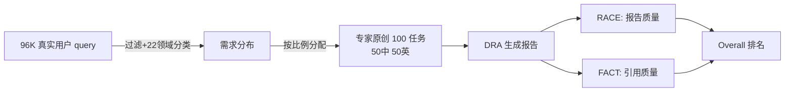

# DeepResearch Bench: A Comprehensive Benchmark for Deep Research Agents

**会议**: ICLR 2026  
**OpenReview**: [https://openreview.net/forum?id=hQ0K2Hhq7H](https://openreview.net/forum?id=hQ0K2Hhq7H)  
**代码**: [https://github.com/Ayanami0730/deep_research_bench](https://github.com/Ayanami0730/deep_research_bench)  
**领域**: LLM 评测 / Deep Research Agent / Benchmark  
**关键词**: Deep Research Agent、长文报告评测、引用可信度、LLM-as-a-Judge、自动化评测  

## 一句话总结
针对"深度研究智能体（DRA）"提出首个系统性基准 **DeepResearch Bench**——100 个由领域专家精心打磨、覆盖 22 个学科的 PhD 级研究任务，并配套两套全自动且高度对齐人类的评测框架：RACE 评报告质量、FACT 评信息检索与引用可信度。

## 研究背景与动机
- **领域现状**：以 OpenAI/Gemini Deep Research 为代表的深度研究智能体正成为最实用的一类 LLM agent——给定开放式研究任务，它们自动检索、分析、综合大量在线资料，几分钟内产出分析师级别的综合报告。
- **现有痛点**：缺少专门评测 DRA 的基准。DRA 的内部推理与检索过程不透明，唯一可观测的只有最终报告；而复杂研究任务往往无法建立确定性 ground truth。现有基准要么只测孤立能力（网页浏览、信息检索），要么测的是脱离实时检索的纯生成能力，均无法刻画 DRA 的多维综合能力。
- **核心矛盾**：长文研究报告"该怎么评"是开放难题——固定 checklist 或静态 rubric 无法适配多样任务与专业领域；让 LLM 直接打分又会一片高分、缺乏区分度。
- **本文目标**：建一个既贴近真实研究需求、又足够有挑战性的任务集，并设计与人类专家判断高度一致的自动评测方法，用于公平比较各家 DRA。
- **核心 idea**：**任务侧用真实用户 query 分布驱动选题、由专家原创任务**；**评测侧用"参考报告 + 任务自适应权重/标准"做相对评分（RACE）**，再用"逐句抓取-回源验证"量化引用质量（FACT）。

## 方法详解

### 整体框架
方法分三块：(a) 基于 96,147 条真实用户 query 统计出 22 个领域的研究需求分布，据此分配并由专家原创 100 个双语任务（50 中 50 英）；(b) **RACE** 评报告质量——先为每个任务动态生成维度权重与评分标准，再以高质量参考报告为锚做相对打分；(c) **FACT** 评检索能力——把报告拆成"陈述-URL"对，逐一回源验证是否被支持，算出引用准确率与有效引用数。

### 关键设计

**1. 真实需求驱动的任务构建：让基准"长得像"真实研究**  
基准的可信度首先取决于任务是否反映真实研究需求。作者收集 96,147 条来自带搜索 Chatbot 的真实用户 query，用 DeepSeek-V3 过滤出符合"需多轮检索+分析+成稿"定义的 44,019 条深度研究 query，再套用 WebOrganizer 的 22 领域 taxonomy 做分类，统计出各领域的真实需求占比。据此按比例压缩到 100 个任务，并保持中英双语平衡。关键的是这 100 个任务**不是从 44K query 里挑的，而是由 5 年以上经验的 PhD/资深从业者按各领域目标配额独立原创**，再经团队人工筛查质量、清晰度、复杂度——44K 样本只用来定分布，从而兼顾"贴近真实需求"与"足够挑战"。

**2. RACE：参考锚定 + 任务自适应标准的相对评分**  
直接让 Judge LLM 给长报告打分会一片高分、缺区分度，从零生成评分标准又容易跑偏。RACE 先固定四个正交顶层维度——全面性 COMP、深度 DEPTH、指令遵循 INST、可读性 READ；对每个任务 $t$，Judge LLM 先产出四维任务级权重 $W_d$，再在每个维度下生成一组可操作的细则 $\{c_{d,k}\}$ 及其归一权重（$\sum_k w_{d,k}=1$），且这套标准一旦生成就对该任务所有 DRA 固定，保证公平。打分采用参考锚定策略：选一篇高质量报告 $R_{ref}$ 作参考，Judge LLM 在每条细则上同时给目标报告与参考报告打分，最后维度分按 $W_d$ 汇总成 $S_{int}$，目标分取相对值：

$$S_{final}(R_{tgt}) = \frac{S_{int}(R_{tgt})}{S_{int}(R_{tgt}) + S_{int}(R_{ref})}$$

这样分数被映射到以参考报告为锚的相对坐标系，虽然绝对值偏低、头部模型彼此接近，但排名与比例差异与人类判断高度线性相关。

**3. FACT：逐句回源验证的引用可信度量化**  
报告好不好读之外，更要看"引用是否真撑得起论断"。FACT 让 Judge LLM 从报告里抽取离散陈述及其引用 URL，得到陈述-URL 对集合 $P_t$，再对同一 URL 描述同一事实的对去重，得到唯一对集合 $U_t$（数量 $N_{u,t}$）。随后用 Jina Reader API 抓取被引网页正文，由 Judge LLM 判定该网页是否足以支撑对应陈述，得到二元 support/not-support，记 support 数为 $N_{s,t}$。据此算两项指标——引用准确率（衡量引用精度）：

$$\text{C. Acc.} = \frac{1}{|T|}\sum_{t\in T}\frac{N_{s,t}}{N_{u,t}}$$

以及每任务平均有效引用数（衡量信息丰度）：

$$\text{E. Cit.} = \frac{\sum_{t\in T} N_{s,t}}{|T|}$$

两者刻画"引用准不准"与"引用多不多"，常呈此消彼长的权衡关系。

## 实验关键数据

### 主实验（部分代表性结果，RACE Overall + FACT）

| 模型 | RACE Overall | C. Acc. | E. Cit. |
|---|---|---|---|
| LangChain ODR (GPT-5) | **50.60** | 32.94 | 21.06 |
| Gemini-2.5-Pro Deep Research | 49.71 | 78.30 | **165.34** |
| OpenAI Deep Research | 46.45 | 75.01 | 39.79 |
| Claude Research | 45.00 | – | – |
| Kimi Researcher | 44.64 | – | – |
| Doubao Deep Research | 44.34 | 52.86 | 52.62 |
| Perplexity Deep Research | 40.46 | 82.63 | 31.20 |
| Tongyi DeepResearch（开源 RL） | 40.46 | – | – |
| Claude-3.7-Sonnet w/Search | 40.67 | **93.68** | 32.48 |
| DeepResearcher（开源 RL） | 10.77 | – | – |

> 评测配置：RACE 用 Gemini-2.5-pro 作 Judge，FACT 用 Gemini-2.5-flash（更经济）做抽取与回源判断；参考报告取自 2025 年 4 月的 Gemini-2.5-pro Deep Research 输出；全部在 100 任务全集上评测。

### 消融实验（RACE 各组件 vs 人类一致性，Table 2）

| 评测方法 | PAR | OPC | FAP | FAS | Overall |
|---|---|---|---|---|---|
| Vanilla Prompt（直接打分） | 58.89 | 98.89 | 40.30 | 43.75 | 60.46 |
| **RACE(Full)** | **71.33** | 99.54 | **60.24** | **59.12** | **72.56** |
| - No Criteria Weights | 70.67 | 99.62 | 59.83 | 56.27 | 71.60 |
| - No Dim Weights | 70.89 | 99.54 | 60.11 | 57.22 | 71.94 |
| - No Weights | 71.11 | 99.69 | 59.46 | 58.17 | 72.11 |
| - No Reference | 66.56 | 97.46 | 57.51 | 51.23 | – |

### 关键发现
- **开源框架能追平甚至反超闭源**：LangChain Open Deep Research 换上 GPT-5 后 RACE 总分 50.60，超过 Gemini-2.5-Pro Deep Research——说明先进 LLM + 开源框架可达 SOTA 闭源水平。
- **引用准确率与有效引用数存在权衡**：Gemini-2.5-Pro 平均 165 条有效引用遥遥领先（长上下文优势），但准确率不及 Perplexity，更远低于 Claude-3.7 w/Search 的 93.68。
- **传统"内置搜索 LLM"已打不过现代 DRA**：在同一评测下，单轮/少轮搜索的 LLM 普遍落后于多轮检索的 DRA。
- **RACE 高度对齐人类**：RACE(Full) 的成对一致率（PAR 71.33）甚至超过人类标注者之间的一致率；去掉参考锚定（-No Reference）掉得最狠，印证"参考相对评分"是区分度的关键。
- **开源 RL 系统两极分化**：Tongyi DeepResearch（40.46）已逼近 Perplexity Deep Research，而 DeepResearcher（10.77）因常无法产出完整结构化报告而垫底。

## 亮点与洞察
- **先有"评什么"再有"怎么评"**：用 9.6 万真实 query 反推任务分布，把基准锚在真实需求上，避免了"凭感觉出题"。
- **参考锚定 + 任务自适应标准**优雅地解决了 LLM 评长文"一片高分"的痼疾，且 PAR 超过人类内部一致性，可信度有据。
- **RACE/FACT 双框架互补**：一个看"报告写得好不好"，一个看"引用撑不撑得住"，把不透明的 DRA 拆成两个可量化维度。
- 作者明确指出 RACE/FACT 思路不局限于深度研究场景，可迁移到更广义的长文/检索增强生成评测。

## 局限与展望
- **任务规模仅 100**：受单次深度研究任务资源消耗大所限，规模与 xbench/Mind2Web 2 同量级，覆盖统计稳定性有上限；好在 query-based 标准生成机制为后续扩集留了口子。
- **FACT 依赖外部抓取**：Jina Reader 抓不到/抓串内容会影响指标（Doubao 即受此影响被低估）；部分系统因引用格式不规范（开源 RL 系统）或 UI 无法解析（Claude/Kimi）而缺 FACT 分。
- **Judge 依赖闭源大模型**：RACE/FACT 都依赖 Gemini 系列作 Judge，评测成本与可复现性受商业模型迭代影响。
- **相对分数易误读**：RACE 绝对分偏低且头部接近，需引导使用者看排名与比例差而非绝对值。

## 相关工作与启发
- **对比现有 agent 基准**：相较只测网页浏览/信息检索（如各类 web 任务）或纯生成（无实时检索）的基准，本文首次把"检索+分析+长文成稿"作为整体能力来评。
- **LLM-as-a-Judge 的工程化**：用动态权重+自适应细则+参考锚定，把 LLM-as-a-Judge 从"易高分、易跑偏"推进到"超人类一致性"，对所有需要评长文的任务都有借鉴价值。
- **引用可信度评测**：FACT 的"逐句抽取-去重-回源验证"范式可直接迁移到 RAG / 带引用问答系统的事实性评测。

## 评分
- 新颖性: ⭐⭐⭐⭐ 首个 DRA 专用基准，RACE 的参考锚定相对评分与 FACT 的回源验证均有实质创新。
- 实验充分度: ⭐⭐⭐⭐ 覆盖近 20 个商用/开源 DRA 与内置搜索 LLM，配 70+ 标注者的人类一致性与多项消融/鲁棒性实验。
- 写作质量: ⭐⭐⭐⭐ 动机-构建-评测-验证链条清晰，公式与表格规范，三张框架图直观。
- 价值: ⭐⭐⭐⭐ 填补 DRA 评测空白，已开源基准与评测协议，RACE/FACT 可迁移到更广的长文/RAG 评测，社区参考价值高。

<!-- RELATED:START -->

## 相关论文

- [\[ICLR 2026\] ResearchRubrics: A Benchmark of Prompts and Rubrics For Evaluating Deep Research Agents](researchrubrics_a_benchmark_of_prompts_and_rubrics_for_evaluating_deep_research_.md)
- [\[ICLR 2026\] DRBench: A Realistic Benchmark for Enterprise Deep Research](drbench_a_realistic_benchmark_for_enterprise_deep_research.md)
- [\[ICLR 2026\] LiveResearchBench: A Live Benchmark for User-Centric Deep Research in the Wild](liveresearchbench_a_live_benchmark_for_user-centric_deep_research_in_the_wild.md)
- [\[ICLR 2026\] Towards Personalized Deep Research: Benchmarks and Evaluations](towards_personalized_deep_research_benchmarks_and_evaluations.md)
- [\[ICLR 2026\] Characterizing Deep Research: A Benchmark and Formal Definition](characterizing_deep_research_a_benchmark_and_formal_definition.md)

<!-- RELATED:END -->
