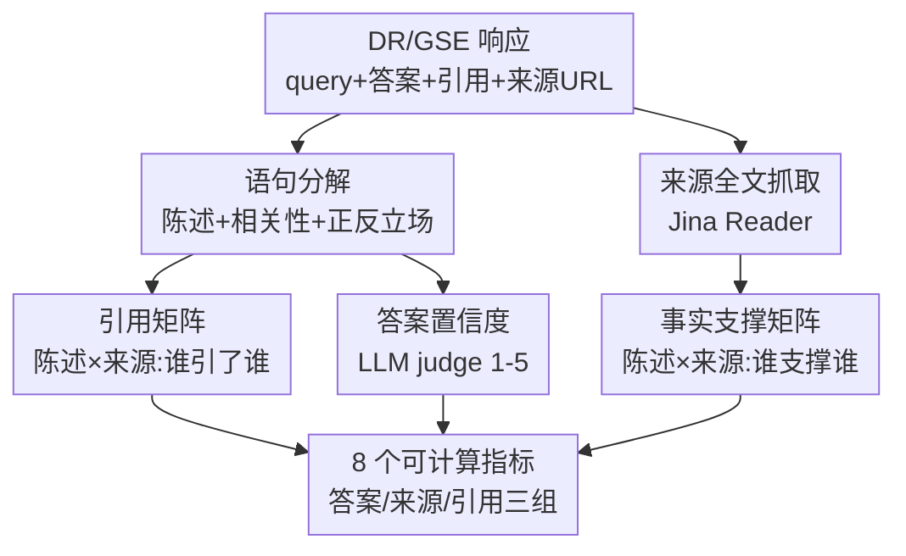

# DeepTRACE: Auditing Deep Research AI Systems for Tracking Reliability Across Citations and Evidence

**会议**: ICLR2026  
**OpenReview**: [https://openreview.net/forum?id=QkaeTea16Y](https://openreview.net/forum?id=QkaeTea16Y)  
**代码**: https://github.com/SalesforceAIResearch/answer-engine-eval  
**领域**: LLM 评测 / Agent 审计  
**关键词**: 深度研究 Agent、生成式搜索引擎、引用可靠性、事实支撑、社会技术评测

## 一句话总结
DeepTRACE 把社区在真实使用中归纳出的失败模式翻译成 8 个可计算指标，对生成式搜索引擎（GSE）和深度研究 Agent（DR）做端到端审计，发现这类系统普遍存在单边表达、过度自信、以及大量"自己列了来源却没有来源支撑"的陈述，引用准确率只有 40–80%。

## 研究背景与动机
**领域现状**：以 Perplexity、You.com、Bing Copilot、ChatGPT Deep Research、Gemini Deep Research 为代表的"生成式搜索引擎/深度研究 Agent"已经进入数亿人的日常信息检索。它们的卖点是：自动检索网页、多步推理、综合成带引用的长篇报告，让用户既能拿到结论又能一键点开来源去核实。

**现有痛点**：这套流水线在每个环节都可能崩。LLM 本身会幻觉、即使给了权威来源也分不清事实谬误；检索环节常常给出错误引用，把陈述归因到不相关甚至不存在的来源；模型把知识编码在预训练权重里，很难保证输出只依赖检索到的文档；再加上谄媚（sycophancy）倾向，系统会迎合用户在 query 里隐含的立场而非客观事实。

**核心矛盾**：现有的评测基准几乎都只盯着 RAG 的某个孤立组件（检索质量、摘要质量、单条 claim 的事实正确性），缺乏一个能审计"系统作为整体如何把来源、引用、不确定性串起来呈现给用户"的框架。而且这些基准大多是研究者自己拍脑袋定指标，是一种"技术中心/实证主义"视角，忽略了系统部署到真实用户手里产生的社会、认知后果。

**本文目标**：把前作（Narayanan Venkit et al., 2025）做的可用性研究里、由真实用户/领域专家归纳出的 16 类常见失败模式，转化成一套自动化、可规模化运行的评测基准，端到端地审计 DR/GSE 系统"生成了什么、怎么推理、怎么引用、怎么管理不确定性"。

**核心 idea**：以社会技术（sociotechnical）视角为锚，围绕用户研究浮现的三大维度——来源的相关性与多样性、引用的正确性与透明度、生成语言的事实性/平衡性/框架性——把定性洞察参数化成 8 个可计算指标，统一在一条"语句分解 + 两个矩阵"的处理流水线上。

## 方法详解

### 整体框架
DeepTRACE 的输入是任意一个 DR/GSE 系统对一条 query 的完整响应，输出是该响应在 8 个维度上的可计算分数。整条流水线先做一批"预处理"把原始响应拆成结构化中间产物，再在这些产物上定义 8 个指标。

预处理需要从响应里抽出四个内容元素：用户 query、生成的答案正文、嵌入的引用标记、以及每个引用指向的公开可访问 URL。由于各家系统的 API 并不暴露这些元素，作者写了自动化浏览器脚本去 4 个 GSE（GPT 4.5/5、You.com、Perplexity、BingChat）和多个 DR 配置上抓取。拿到这四件套之后，做五步处理：

1. **语句分解**：把答案正文切成若干"陈述（statement）"，并给每条陈述打两个属性——`Query Relevance`（二值，这条陈述是否真正回答了 query，开场白/结束语这类无信息陈述判为不相关）、`Pro vs. Con`（三值，仅对辩论类 query 计算，标这条陈述是支持/反对/中立于 query 隐含的立场）。
2. **答案置信度打分**：用 LLM judge 按 Likert 1–5 给整个答案打 `Answer Confidence`（1 = 强不自信，5 = 强自信），prompt 里给了不同自信程度的措辞示例。该分数与 2 名人工标注者在 100 条答案上的 Pearson 相关系数为 0.72。
3. **来源全文抓取**：用 Jina.ai Reader 把每个来源 URL 的正文抓下来；约 15% 的 URL 因付费墙或 404 抓取失败，这些来源在依赖全文的计算里被排除。
4. **引用矩阵（Citation Matrix）**：构造一个 `(陈述数 × 来源数)` 的二值矩阵，cell `(i,j)=1` 表示第 i 条陈述引用了第 j 个来源。
5. **事实支撑矩阵（Factual Support Matrix）**：同样 `(陈述数 × 来源数)`，cell `(i,j)=1` 表示第 j 个来源的内容在事实上支撑第 i 条陈述——由 LLM judge 逐对判定，与人工标注的 Pearson 相关系数为 0.62（中等一致）。

下面这张图把"响应 → 中间产物 → 8 指标"的转写关系画出来：

关键之处在于：8 个指标几乎全部是这两个矩阵（引用矩阵 $C$、事实支撑矩阵 $S$）和两个陈述属性（相关性、正反立场）的简单代数组合——这让一套定性的"用户不满"被压成了可批量计算、可复现的数值。

### 关键设计

**1. 把社区失败模式映射成 8 个可计算指标：审计"怎么用证据"而非"答案对不对"**

DeepTRACE 最核心的贡献不是某个模型，而是这套指标体系。它针对的痛点是：以往基准只查单条 claim 对不对（FActScore、CoRE 这类），却没人量化"系统列了一堆来源、却让用户产生一种被验证过的错觉"这种端到端的可靠性问题。8 个指标分三组：

- **答案文本组**：`One-Sided Answer`——仅对辩论 query，若答案没有同时包含 pro 和 con 陈述则记为单边（=1）；`Overconfident Answer`——若答案同时"单边"且置信度=5 则记为过度自信；`Relevant Statement` $=\frac{\text{相关陈述数}}{\text{总陈述数}}$，衡量答案的"切题度"。
- **来源组**：`Uncited Sources` $=\frac{\text{被引用来源数}}{\text{列出来源数}}$（引用矩阵里的空列就是没被引用的来源）；`Unsupported Statements` $=\frac{\text{无支撑陈述数}}{\text{相关陈述数}}$（事实支撑矩阵里整行全空的陈述就是没有任何来源支撑）；`Source Necessity`（见设计 2）。
- **引用组**：`Citation Accuracy` 和 `Citation Thoroughness`（见设计 3）。

作者特意没有实现用户研究里那些涉及"UI 层"的失败模式，因为它们没法从答案文本+引用+来源里直接算出来，需要人工或计算机视觉，超出范围。这种"诚实地只做能算的"恰恰是这套基准的可信之处。

**2. 用最小顶点覆盖定义"来源必要性"：区分"被引"和"真有用"**

`Source Necessity` 要回答的问题是：系统列的这堆来源里，到底有多少是"删了就会有相关陈述失去支撑"的真必要来源，多少只是凑数。直接数"被引用了几个"不行——一个来源可能被引但它支撑的陈述其它来源也能支撑（冗余）。作者把它建模成图问题：把事实支撑矩阵看成"陈述-来源"二部图，求来源侧的最小顶点覆盖（minimum vertex cover），用 Hopcroft-Karp 算法解，覆盖集里的来源就是"必要来源"。于是

$$\text{Source Necessity} = \frac{\text{必要来源数}}{\text{列出来源数}}.$$

这个设计的巧妙在于：它把"列了 200 个来源"这种行为的虚胖直接暴露出来——例图里 5 个来源只有 3 个必要，Source Necessity = 3/5。它衡量的不只是"有没有被引用"，而是"这个来源是否提供了别处替代不了的支撑"。

**3. 用两矩阵的逐元素重叠定义引用的"准"与"全"**

引用质量被拆成两个互补指标，都建立在引用矩阵 $C$ 与事实支撑矩阵 $S$ 的逐元素乘积 $C \odot S$（即"既被引用、又真的有支撑"的那些格子）之上：

$$\text{Citation Accuracy} = \frac{\sum (C \odot S)}{\sum C}, \qquad \text{Citation Thoroughness} = \frac{\sum (C \odot S)}{\sum S}.$$

`Citation Accuracy`（准确率）问的是：系统打出的引用里，有多少真的指向了能支撑该陈述的来源——分母是所有引用数，惩罚"明明有对的来源却引了个不相关的"这种误引。`Citation Thoroughness`（彻底度）问的是：所有"本可以打且打对"的引用机会里，系统实际打了多少——分母是所有真实存在的"陈述-来源"支撑关系，惩罚"明明这个来源能支撑这条陈述却没引"。两者一个管"别乱引"、一个管"别漏引"，合起来才完整刻画引用行为。例图里 $\sum(C\odot S)=4$、$\sum C=7$、$\sum S=10$，所以准确率 4/7、彻底度 4/10。

### 损失函数 / 训练策略
本文是审计/基准类工作，不涉及模型训练。评测语料 DeepTrace Corpus 含 303 条 query，分两类：辩论类 168 条（来自非党派平台 ProCon，天然多视角、有争议），专业类 135 条（由气象、医学、HCI 等领域专家贡献，偏研究型、需要多跳检索）。每条 query 跑过 9 个公开 GSE/DR 系统，多数指标在全部 2,727 个样本（303×9）上计算，少数（单边、过度自信）只在辩论 query 上算。所有结果是 2025 年 8 月 27 日通过各系统公开 UI 抓取的快照。

## 实验关键数据

### 主实验
评测对象分两类。生成式搜索引擎（GSE）的关键结果：

| 系统 | %单边 | %过度自信 | %相关陈述 | %无支撑陈述 | %引用准确率 |
|------|-------|-----------|-----------|-------------|-------------|
| You.com | 51.6 | 19.4 | 75.5 | 30.8 | 68.3 |
| BingChat | 48.7 | 29.5 | 79.3 | 23.1 | 65.8 |
| Perplexity | 83.4 | 81.6 | 82.0 | 31.6 | 49.0 |
| GPT-4.5 | 90.4 | 70.7 | 85.4 | 47.0 | 39.8 |

深度研究 Agent（DR）的关键结果：

| 系统 | 来源数 | %单边 | %无支撑陈述 | %来源必要性 | %引用准确率 | %引用彻底度 |
|------|--------|-------|-------------|-------------|-------------|-------------|
| GPT-5(DR) | 18.3 | 54.7 | 12.5 | 87.5 | 79.1 | 87.5 |
| YouChat(DR) | 57.2 | 63.1 | 74.6 | 63.2 | 72.3 | 83.5 |
| PPLX(DR) | 7.7 | 63.1 | 97.5 | 5.5 | 58.0 | 9.1 |
| Copilot(TD) | 3.6 | 94.8 | 90.2 | 31.2 | 62.1 | 13.2 |
| Gemini(DR) | 33.2 | 80.1 | 53.6 | 33.1 | 50.3 | 27.1 |

### 关键发现
- **GSE：简洁切题但不平衡**。相关陈述率普遍 75–85%、最切题，但单边率高达 50–80%（Perplexity 最差，83%+ 辩论 query 单边），且 Perplexity 在 90%+ 的答案里保持"强自信"，导致在争议话题上既单边又过度自信。
- **DR：更平衡、引用更全，但代价是冗长 + 大量无支撑**。DR 模式把过度自信普遍压到 <20%（这是 DR 流水线相对 GSE 的一个真实优势），但单边率依旧 54.7–94.8% 居高不下，说明 DR 没有消除谄媚式单边。无支撑陈述率从 Gemini 的 53.6% 到 PPLX 的 97.5% 不等——"列更多来源、写更长答案"并不等于更可靠。
- **GPT-5(DR) 是全场近乎理想的反例**：0% 未引用来源、仅 12.5% 无支撑陈述、87.5% 来源必要性、引用彻底度 87.5%，证明经过良好校准的系统能在多维度同时达标，可靠性是可实现的工程目标而非空想。
- **"列更多来源"反而坑用户**：BingChat 平均列 4 个来源却有 1/3+ 未被引用、只有约一半必要；YouChat(DR) 引用彻底度高（83.5%）却带来 66.3% 未引用来源——过度引用造成"搜索疲劳"，欠支撑的冗长文本则侵蚀信任。

## 亮点与洞察
- **把"用户的不爽"工程化成可批量算的数**：最大的"啊哈"在于，它没有发明新模型，而是把一套定性的社会技术失败模式，压缩成两个矩阵 + 几条三值/二值属性的代数组合，于是"系统看起来很有据其实没有据"这种主观感受变成了 `Unsupported Statements`、`Source Necessity` 这种可复现的指标。
- **最小顶点覆盖度量"来源必要性"是可迁移的 trick**：任何"列了一堆证据/检索结果，想知道有多少是冗余"的场景（RAG 评测、检索去重、多文档摘要）都能复用这个二部图 + 最小顶点覆盖的建模。
- **准确率 vs 彻底度的双指标拆分**很干净地把"别乱引"和"别漏引"分开，避免单一引用指标被钻空子（只引一条最稳的来源能刷高准确率却彻底度极低）。
- **诚实地划定边界**：明确不评"答案对不对"、不评 UI 层、对 LLM judge 给出与人工的相关系数并强调"描述性解读而非当 ground truth"——这种克制让基准更可信。

## 局限与展望
- **作者承认的局限**：只审计文本和引用，不评多模态/UI 层交互（而这些也强烈影响用户信任）；不判断答案在内容上对不对，只看格式、来源、引用；中间判断（事实支撑、置信度）依赖 LLM，可能引入偏差，仅用人工验证 + 报告相关系数来缓解。
- **快照脆弱性**：因为是直接打各家公开 UI（而非固定 API 端点），系统行为会随时间漂移，结论严格说只对 2025-08-27 这个快照成立；要做纵向对比需要重复抓取。
- **judge 一致性偏中等**：事实支撑判定与人工的 Pearson 仅 0.62，无支撑陈述率这类核心结论会受 judge 噪声影响，绝对值需谨慎解读。
- **可改进方向**：把答案完整性、连贯性、综合质量纳入；把 15% 抓取失败的付费墙/失效来源单独建模（它们对用户其实也不可达，这本身就是一种可靠性信号）；引入 UI 层的 CV/交互评测补全那 16 类失败模式里没覆盖的部分。

## 相关工作与启发
- **vs FActScore / CoRE**：它们聚焦单条 claim 的事实正确性，DeepTRACE 把焦点从"claim 对不对"挪到"系统如何使用检索、组织引用、表达置信度"，是端到端的呈现层审计而非孤立 claim 核查。
- **vs AutoSurvey**：AutoSurvey 评的是学术综述式的引用，DeepTRACE 针对开放网页、面向真实用户的端到端 GSE/DR 系统。
- **vs DeepResearch Bench / DRBench / BrowseComp-Plus**：这三者都从技术视角评 DR Agent 的任务完成度与分析质量，评测标准由研究者单方面定；DeepTRACE 的差异在于把评测维度建立在真实用户/领域专家的可用性研究之上，是社会技术视角而非纯技术中心。
- **vs RAGAS / ClashEval**：它们把语言模型当成孤立计算系统来评（faithfulness、context relevance 等），DeepTRACE 把它当成嵌入用户应用里的社会技术 Agent 来审计。

## 评分
- 新颖性: ⭐⭐⭐⭐ 不是新模型，但"把社区失败模式系统化成 8 个可计算指标 + 最小顶点覆盖量化来源必要性"的视角很新。
- 实验充分度: ⭐⭐⭐⭐ 覆盖 9 个真实公开系统、303 query、2,727 样本，并对 LLM judge 做了人工一致性验证。
- 写作质量: ⭐⭐⭐⭐ 指标定义清晰、公式与示例配套，少量拼写/排版瑕疵。
- 价值: ⭐⭐⭐⭐⭐ 给"深度研究 Agent 是否可信"提供了可复现、可扩展的审计工具与数据集，实践意义强。

<!-- RELATED:START -->

## 相关论文

- [\[ICLR 2026\] Characterizing Deep Research: A Benchmark and Formal Definition](characterizing_deep_research_a_benchmark_and_formal_definition.md)
- [\[ICLR 2026\] Towards Personalized Deep Research: Benchmarks and Evaluations](towards_personalized_deep_research_benchmarks_and_evaluations.md)
- [\[ICLR 2026\] DRBench: A Realistic Benchmark for Enterprise Deep Research](drbench_a_realistic_benchmark_for_enterprise_deep_research.md)
- [\[ICLR 2026\] DeepResearch Bench: A Comprehensive Benchmark for Deep Research Agents](deepresearch_bench_a_comprehensive_benchmark_for_deep_research_agents.md)
- [\[ICLR 2026\] AirQA: A Comprehensive QA Dataset for AI Research with Instance-Level Evaluation](airqa_a_comprehensive_qa_dataset_for_ai_research_with_instance-level_evaluation.md)

<!-- RELATED:END -->
