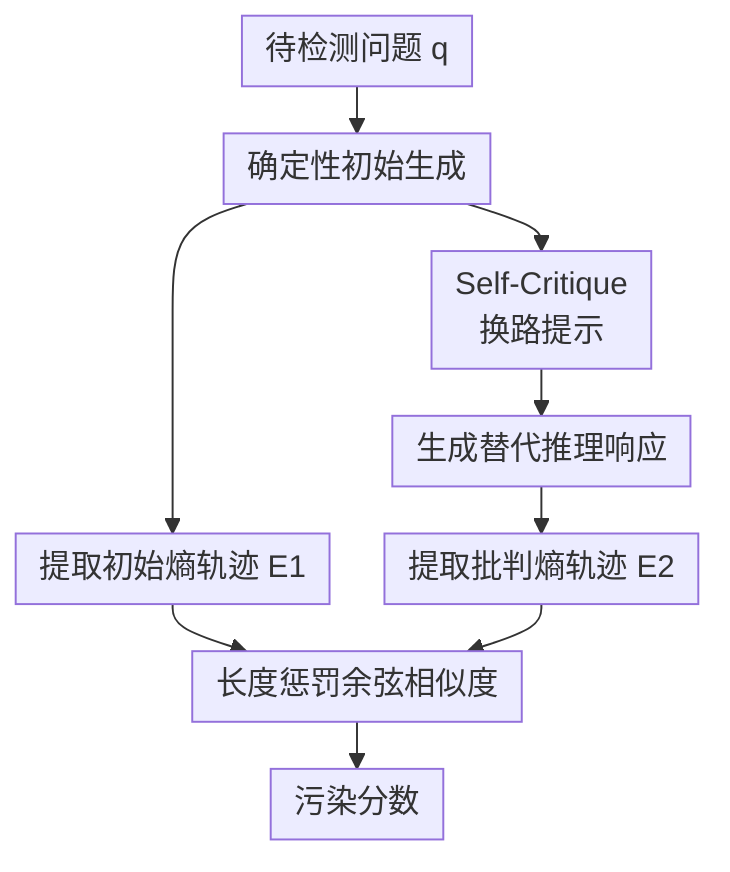

# Detecting Data Contamination from Reinforcement Learning Post-training for Large Language Models

**会议**: ICLR2026  
**OpenReview**: [https://openreview.net/forum?id=EjiJmiA6ea](https://openreview.net/forum?id=EjiJmiA6ea)  
**代码**: https://github.com/yongding-tao/RL-Data-Contamination  
**领域**: LLM评测 / 数据污染检测 / RL后训练  
**关键词**: 数据污染检测, 会员推断攻击, RL后训练, 熵坍缩, LLM评测可信性  

## 一句话总结
这篇论文首次系统研究 LLM 在 RL 后训练阶段的 benchmark 数据污染检测问题，提出 Self-Critique 用两次生成的 token 级熵轨迹相似度捕捉被污染样本上的策略路径依赖，并构建 RL-MIA benchmark 证明传统基于似然的检测器在这一阶段接近随机猜测，而该方法能稳定提高 AUC。

## 研究背景与动机
**领域现状**：LLM 的能力评测越来越依赖固定 benchmark，但这些 benchmark 一旦进入训练数据，模型分数就会混入记忆成分，难以再代表真实泛化能力。已有数据污染检测通常被视为 membership inference attack：给定模型和一条样本，判断它是否出现在训练集中。过去的方法主要围绕预训练和 SFT 展开，因为这两个阶段都以最大似然为核心，训练样本通常会在 token 概率、困惑度或低概率 token 分布上留下可检测痕迹。

**现有痛点**：RL 后训练，尤其是带可验证奖励的 RLVR，正在成为提升数学、逻辑和复杂推理能力的关键环节，但它的污染检测几乎没有专门方法。直接把 PPL、Min-K% Prob、Recall、CDD 等检测器搬过来会遇到目标错位：这些方法默认“见过的文本会更像训练文本”，而 RL 优化的是奖励，不是逐 token 模仿标准答案。一个训练样本可能没有更低困惑度，却会让模型更坚定地沿着某条高奖励推理路径走。

**核心矛盾**：RL 阶段的污染信号不再主要藏在样本文本的 likelihood 里，而藏在策略行为的收缩里。模型经过 RL 后会倾向于把搜索空间压窄，提高 pass@1，但这类策略坍缩也可能发生在未污染样本上。因此，仅观察一次生成中的低熵 token 并不可靠：干净样本和污染样本都可能出现稀疏熵分布，关键差别在于模型被要求换一种思路时，是否还能真正偏离原路径。

**本文目标**：作者要解决三个具体问题：第一，形式化 RL 后训练阶段的数据污染检测任务；第二，找到区别于 likelihood 的 RL 特有检测信号；第三，构造一个能隔离 RL 阶段污染的 benchmark，避免把预训练泄漏、SFT 记忆和 RL 污染混在一起评价。

**切入角度**：论文从 policy collapse 入手。RL 会把高奖励样本上的策略推向更窄的推理模式，如果某个 benchmark 样本在 RL 训练中被反复奖励，模型面对它时不只是“答得对”，还可能“很难换路答”。作者把这种路径依赖转化成主动探针：先让模型给出最确定的答案，再把这个答案放回 prompt，要求模型用不同推理路径重新回答，然后比较两条生成轨迹的熵序列是否仍高度相似。

**核心 idea**：用 self-critique 主动逼模型偏离初始推理路径，再用两次生成的 token 级熵轨迹相似度检测 RL 后训练造成的策略坍缩和样本记忆。

## 方法详解
### 整体框架
Self-Critique 的输入是一道待检测题目 $q$ 和一个经过 RL 后训练的 LLM $M$，输出是一个 contamination score，分数越高越可能说明该题在 RL 训练集中出现过。整个流程不是去估计题目文本本身的困惑度，而是把模型的“初始最确定解法”和“被要求换路后的解法”放到熵空间里比较：如果两次生成虽然被 prompt 要求走不同路径，但 token 级不确定性仍沿着相似形状变化，就说明模型可能被 RL 奖励压进了同一条高回报路径。

配套的 RL-MIA benchmark 用可控注入来模拟 RL 阶段污染：把一部分 benchmark 样本混入 RL 训练语料，训练后再要求检测器区分被注入样本和 held-out clean 样本。这样做的重点是隔离 RL 阶段的污染信号，而不是复用已经可能被预训练见过的公开 benchmark 分数。

### 关键设计
**1. Self-Critique 探针：把“能不能换路”变成污染信号**

传统检测器多数是被动看一次文本概率，本文则主动制造一个反事实压力：模型先用 greedy decoding 给出最自信的初始回答 $r_1$，随后 prompt 中附上这个回答，并明确要求模型提供一条不同的推理路径或替代解法。这个设置的精妙处在于，它不是简单让模型再采样一次，而是给了第二次生成一个明确参照物：如果模型真的对这道题保持灵活推理，第二次应该能在步骤、决策点和不确定性分布上偏离初始答案；如果它已经在 RL 中围绕某条高奖励轨迹发生坍缩，第二次就容易被初始路径“吸回去”。

论文的附录消融验证了这个参照物很关键。若跳过初始答案，只提示模型“用不常规方法回答”，检测性能会接近随机，因为此时两次路径没有共同锚点，所谓“不同”变成了噪声很大的 instruction following 行为。Self-Critique 固定了一个具体基线，再测从这条基线偏离的能力，因此更直接对应 RL 污染带来的路径依赖。

**2. 熵轨迹相似度：不用 likelihood，而看策略不确定性形状**

RLVR 的奖励目标不会直接提高训练样本答案的 token likelihood，所以 PPL 或 Min-K% 这类基于概率大小的检测信号会失效。本文改看 token 级熵：在第 $t$ 个解码位置，熵定义为 $H_t=-\sum_{v\in V}p_\theta(v\mid x_{<t})\log p_\theta(v\mid x_{<t})$，它描述模型在当前上下文下对下一个 token 的不确定性。一次回答可以转成熵序列 $E=\{H_t\}_{t=1}^T$，这个序列比单个平均熵更有信息，因为推理过程中的关键分叉点、确定性套话和答案收束都会体现在形状上。

检测分数使用带长度惩罚的余弦相似度。具体地，先把两条熵序列 $E_1,E_2$ padding 到相同长度，再计算余弦相似度，并乘上长度比例 $\min(|E_1|,|E_2|)/\max(|E_1|,|E_2|)$。这个设计避免两个问题：一是不同长度的推理轨迹不能直接逐位比较；二是如果第二次回答大幅变短或变长，长度本身也说明推理模式发生变化，不应让普通余弦相似度忽略掉。最终分数可写成 $Score(q)=cos(pad(E_1),pad(E_2))\times \min(|E_1|,|E_2|)/\max(|E_1|,|E_2|)$，分数越高表示两次生成越像，污染概率越高。

**3. RL-MIA benchmark：用可控注入隔离 RL 阶段污染**

如果直接在公开 benchmark 上评价污染检测，很容易混入预训练泄漏：模型可能早在预训练中见过 AIME、GSM8K 或其他题目，此时检测到的不是 RL 污染，而是历史数据暴露。RL-MIA 的做法是把污染过程显式控制住：选定 benchmark 中一部分样本注入 RL 训练数据，另一部分作为 clean 样本，然后训练模型并用检测器判断 membership。AIME24、AIME25 覆盖真实数学题，其中 AIME24 可能有预训练暴露，AIME25 更接近后切分；K&K 和 SAT 是合成逻辑任务，能提供更干净的 RL-only 信号。

这个 benchmark 的价值不只是给 Self-Critique 做实验，还给后续方法提供了一个问题定义清晰的测试床。论文还把 GSM8K 用于双阶段污染分析：先用 PPL 作为预训练污染 proxy，把预训练污染较低的样本筛出来，再看 Self-Critique 对 RL 污染的识别是否增强。结果显示当预训练信号降低时，Self-Critique 的 AUC 从 0.59 提升到 0.88，而随机同规模子集没有类似提升，这支持了“它抓到的是 RL 阶段路径依赖，而不是样本数量或普通难度差异”的解释。

**4. 实用化熵计算：Top-K 概率足够支撑检测**

完整计算 token 熵通常需要全词表概率，这在很多 API 或大模型部署中并不现实。本文做了 Top-K 熵近似消融：只拿前 $K$ 个 token 的概率来近似熵，测试 $K=3,5,10,20,50$。结果显示性能几乎不随 $K$ 变化，AIME25 的 AUC 约在 0.70 到 0.72 之间，K&K 约在 0.65 到 0.66 之间。原因是 next-token 分布常有长尾，大部分概率质量集中在少数 token 上，尾部对熵形状贡献有限。

这个设计让 Self-Critique 更接近实际可用：它需要两次生成，比 PPL 这类被动方法贵，但比需要几十次随机采样的 CDD 轻得多；而熵本身只要 top-k logprob 就能估计，额外开销主要来自第二次生成。

### 一个完整示例
假设要检测一道 AIME 数学题是否进入过某个模型的 RL 训练集。第一步，系统用原题 prompt 和 greedy decoding 让模型给出初始解法，例如它从代数变形开始，经过某个固定恒等式，最后得到答案。与此同时，检测器记录这段生成每个 token 的熵，形成 $E_1$。这条曲线可能在关键分叉处有几个小峰，在套用熟悉推导时快速降到低熵。

第二步，系统把初始答案附到 prompt 里，要求模型“请用不同推理路径或替代解法重新回答”。如果这道题是干净样本，模型可能改用几何解释、枚举法或另一组变量替换，第二次回答的长度、关键不确定点和熵峰位置都会变化，$E_2$ 与 $E_1$ 的相似度较低。若这道题曾在 RL 中被奖励过，模型即使被要求换路，也可能仍沿着相同中间结论和相似推导节奏走，$E_2$ 和 $E_1$ 在熵空间高度重合。此时带长度惩罚的余弦相似度变高，检测器把它排在更可能污染的位置。

### 损失函数 / 训练策略
Self-Critique 本身不是训练新模型，而是一个检测流程，因此没有额外的训练损失。实现上采用确定性生成，论文算法中要求两次生成都使用 greedy decoding 或 temperature = 0，以减少采样随机性对熵曲线的干扰。熵计算需要每步 token 概率或 top-k 概率；benchmark 中的 RL 模型主要用 VeRL 训练，Qwen2.5-7B-Instruct 与 DeepSeek-Math-7B-Instruct 的共享设置包括 actor learning rate $1.0\times10^{-6}$、train/val batch size $128/512$、prompt length 1024、每个 prompt 采样 8 条、entropy coefficient 0.001，Qwen 系列最大生成长度 4096，DeepSeek-Math 因上下文限制使用 3072。

## 实验关键数据

### 主实验
| 模型 | 方法 | AIME24 AUC | AIME25 AUC | K&K AUC | SAT AUC | 平均 AUC |
|------|------|------------|------------|---------|---------|----------|
| Qwen2.5-7B-Instruct | PPL | 0.51 | 0.56 | 0.47 | 0.50 | 0.51 |
| Qwen2.5-7B-Instruct | Recall | 0.61 | 0.65 | 0.47 | 0.62 | 0.59 |
| Qwen2.5-7B-Instruct | Entropy-Noise | 0.57 | 0.63 | 0.52 | 0.77 | 0.62 |
| Qwen2.5-7B-Instruct | Self-Critique | 0.72 | 0.72 | 0.66 | 0.67 | 0.70 |
| DeepSeek-Math-7B-Instruct | PPL | 0.53 | 0.41 | 0.54 | 0.64 | 0.53 |
| DeepSeek-Math-7B-Instruct | Recall | 0.46 | 0.56 | 0.54 | 0.62 | 0.54 |
| DeepSeek-Math-7B-Instruct | Entropy-Noise | 0.56 | 0.69 | 0.52 | 0.45 | 0.55 |
| DeepSeek-Math-7B-Instruct | Self-Critique | 0.67 | 0.61 | 0.63 | 0.67 | 0.64 |

主结果说明两件事。第一，似然型检测器在 RL 后训练污染上确实失灵，PPL、Min-K%、Min-K%++ 经常围绕 0.5 波动，甚至在某些任务低于随机猜测。第二，主动 probing 比被动属性更重要，而 Self-Critique 又比随机采样或前缀扰动更贴近 RL 机制：在 Qwen2.5-7B-Instruct 上平均 AUC 达到 0.70，比最强非本文 baseline 高约 19%；在 DeepSeek-Math-7B-Instruct 上平均 AUC 为 0.64，也有约 19% 提升。

### 消融实验
| 消融 / 分析 | 设置 | 关键指标 | 说明 |
|-------------|------|----------|------|
| RL 算法泛化 | Qwen2.5-3B-Instruct on K&K | PPO/GRPO/DAPO AUC 分别为 0.61/0.61/0.60 | Self-Critique 在三种 RL 算法下均为最佳，说明信号不是某个算法特例 |
| Top-K 熵近似 | Qwen2.5-7B-Instruct | AIME25 在 $K=3$ 到 $50$ 为 0.7022 到 0.7156；K&K 为 0.6460 到 0.6636 | 只用很小的 top-k 概率也能近似熵轨迹，降低部署门槛 |
| 去掉初始响应锚点 | “直接要求非常规解法” | AUC 接近随机，图中相对 Self-Critique 明显塌陷 | 没有初始答案作为参照时，第二条路径不可比较，探针失去 membership 含义 |
| 采样策略 | greedy+greedy vs temperature sampling | greedy+greedy 最优 | 确定性生成更能暴露 RL 后训练导致的尖锐策略分布 |
| meta-instruction 稳定性 | 5 个改写 prompt | AIME25 AUC 标准差 0.0251，K&K 标准差 0.0254 | 方法不依赖某句 prompt 的偶然措辞 |
| 双阶段污染 | GSM8K 低预训练污染子集 | Self-Critique AUC 从 0.59 升至 0.88 | 预训练污染信号弱化后，RL 阶段路径依赖更清晰 |

### 关键发现
- Self-Critique 的最大优势来自“有锚点的主动偏离”。Recall 也属于主动 probing，因此比纯 likelihood baseline 更强，但它仍主要看 log-likelihood；Self-Critique 用 self-critique prompt 加熵轨迹，才更贴近 RL 后训练的策略坍缩。
- 熵作为指标比编辑距离或概率大小更适合这个问题。CDD 依赖多次随机采样的输出一致性，成本高且噪声大；Entropy-Temp、Entropy-Noise 已经说明熵比原指标敏感，而 Self-Critique 进一步说明 probing 方式也要对齐 RL 机制。
- 结果不是只在一个模型或一个任务成立。论文覆盖 Qwen2.5-7B-Instruct、DeepSeek-Math-7B-Instruct、Qwen2.5-7B-Math、Llama-3.1-8B-Instruct，以及 PPO、GRPO、DAPO、DPO、TDPO、RTO 等训练或对齐设置，趋势整体一致。
- 方法仍然是检测 ranking，不是给出绝对真相。AUC 最高也在 0.6 到 0.7 多的区间，说明 RL 阶段污染检测仍很难，更适合用于 benchmark 审计和风险筛查，而不是单样本定罪。

## 亮点与洞察
- 把 RL 污染检测从“文本是否更像训练数据”改写成“策略是否被锁在某条高奖励路径上”，这个视角很关键。它解释了为什么传统 MIA 在 RLVR 时代会突然失效，也给后续检测器指明了 reward-aware 的方向。
- Self-Critique 的 probe 设计很简洁：只多生成一次，却显式测试模型偏离初始路径的能力。相比大量采样，它更像一次有语义约束的压力测试，既节省预算，也更容易解释检测分数。
- RL-MIA benchmark 是本文的另一个贡献点。没有可控注入实验时，很难判断方法检测到的是 RL 污染、预训练泄漏还是任务难度；RL-MIA 把污染来源控制住，让结论更可信。
- Top-K 熵近似的消融很实用。许多商业 API 只返回 top logprobs，如果方法依赖全词表概率就很难落地；本文显示 $K=3$ 或 $K=5$ 也基本可用，这为部署提供了现实接口。
- 双阶段污染分析给了一个有启发的评测思路：先估计并筛掉强预训练泄漏样本，再看 RL 污染检测效果。这种分层诊断可以迁移到其他 benchmark 审计场景。

## 局限与展望
- 实验主要集中在数学和逻辑推理任务。代码生成、开放式问答、多轮对话等任务存在更多等价解法，策略坍缩的表现可能不再是简单的熵轨迹相似，需要重新验证或设计任务特定 probe。
- 模型规模主要在 0.5B 到 8B 附近。超大闭源模型的 RL 后训练流程、采样控制和 logprob 暴露都更复杂，Self-Critique 的可迁移性仍需要在更接近真实部署的 API 场景中验证。
- 方法需要访问 token 概率或 top-k logprob。若模型接口只返回文本而不返回概率分布，就无法直接计算熵轨迹，可能需要用多个采样响应或外部 surrogate model 近似，但这会引入新误差。
- Self-Critique 依赖模型能遵循“换一种推理路径”的指令。对 instruction following 较弱的模型，第二次生成可能只是重复或胡乱变化，检测分数会混入指令服从能力，而不完全是污染信号。
- 当前分数更适合排序和群体审计，单样本阈值仍需谨慎。论文报告 AUC 和 Youden threshold 下 F1，但不同模型、任务、RL 算法之间阈值是否可迁移还没有充分解决。

## 相关工作与启发
- **vs PPL / Min-K% / Min-K%++**: 这些方法基于最大似然训练留下的概率异常，适合预训练或 SFT 污染检测；本文处理的是 reward-driven RL 后训练，训练目标不再直接压低样本困惑度，因此改用熵轨迹相似度。
- **vs Recall**: Recall 通过加入 non-member prefix 比较相对条件 log-likelihood，是一种主动 probing 思路；Self-Critique 继承“主动扰动暴露 membership”的思想，但把扰动换成有语义锚点的替代推理请求，把指标换成 entropy pattern。
- **vs CDD**: CDD 用多次随机采样的输出编辑距离衡量一致性，成本高且依赖采样噪声；Self-Critique 只需两次确定性生成，通过初始答案锚定比较对象，更适合检测 RL 造成的高奖励路径依赖。
- **对 LLM 评测的启发**: 未来 benchmark 发布不只要关注预训练泄漏，也要记录模型后训练阶段可能接触的数据。尤其是 RLVR 广泛使用公开题库时，benchmark 审计需要把“答题准确率是否被 RL 记忆污染”作为单独风险。
- **对 RL 后训练研究的启发**: 策略坍缩通常被当作训练稳定性或探索不足问题，本文说明它也会成为数据污染的可观测痕迹。反过来，污染检测也可能成为分析 RL 泛化与记忆边界的一种工具。

## 评分
- 新颖性: ⭐⭐⭐⭐⭐ 首次把 RL 后训练阶段的数据污染检测作为独立问题系统化，并提出与 RL 策略坍缩机制直接相连的检测信号。
- 实验充分度: ⭐⭐⭐⭐ 覆盖多个模型、任务、RL 算法、RLHF 设置和多项消融，但更大模型与更开放任务还需要补充。
- 写作质量: ⭐⭐⭐⭐ 论文问题定义清楚，动机到方法的逻辑顺，但部分实验表格较密，读者需要来回对照 appendix 才能完整理解设置。
- 价值: ⭐⭐⭐⭐⭐ 对 LLM benchmark 可信评测很有现实意义，尤其适合当前 RLVR 和推理模型快速迭代的背景。

<!-- RELATED:START -->

## 相关论文

- [\[ICLR 2026\] Detecting Data Contamination in LLMs via In-Context Learning](detecting_data_contamination_in_llms_via_in-context_learning.md)
- [\[ICLR 2026\] Mapping Post-Training Forgetting in Language Models at Scale](mapping_post-training_forgetting_in_language_models_at_scale.md)
- [\[ICLR 2026\] Rewarding Doubt: A Reinforcement Learning Approach to Calibrated Confidence Expression of Large Language Models](rewarding_doubt_a_reinforcement_learning_approach_to_calibrated_confidence_expre.md)
- [\[ACL 2026\] SPENCE: A Syntactic Probe for Detecting Contamination in NL2SQL Benchmarks](../../ACL2026/llm_evaluation/spence_a_syntactic_probe_for_detecting_contamination_in_nl2sql_benchmarks.md)
- [\[ICLR 2026\] AutoCodeBench: Large Language Models are Automatic Code Benchmark Generators](autocodebench_large_language_models_are_automatic_code_benchmark_generators.md)

<!-- RELATED:END -->
