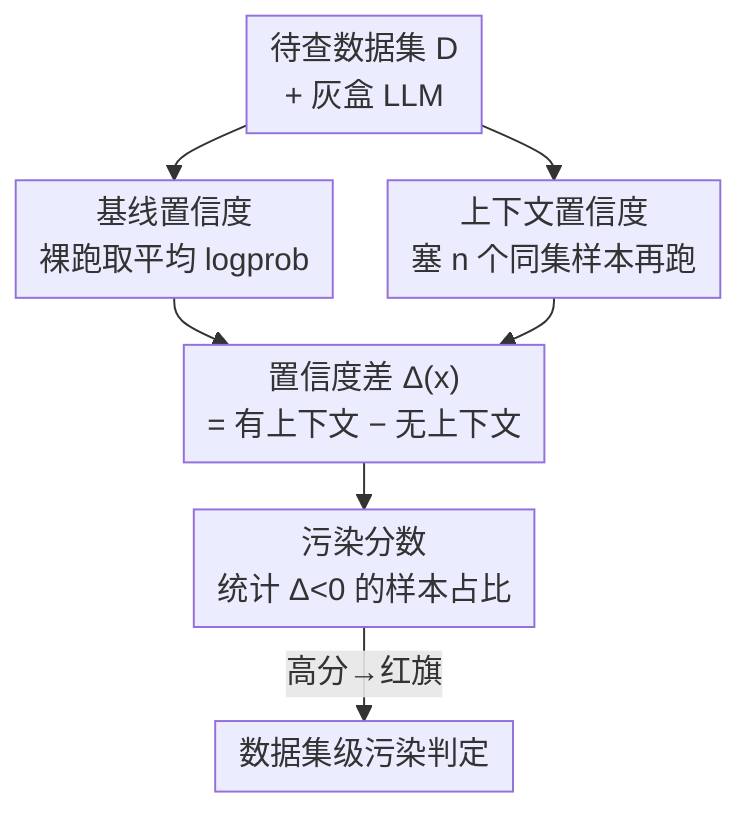

# Detecting Data Contamination in LLMs via In-Context Learning

**会议**: ICLR2026  
**OpenReview**: [https://openreview.net/forum?id=YlpaaYxx4t](https://openreview.net/forum?id=YlpaaYxx4t)  
**代码**: https://github.com/NVIDIA-NeMo/Evaluator （CoDeC demo notebook）  
**领域**: LLM 评测 / 数据污染检测  
**关键词**: 数据污染, 上下文学习, 成员推断, 基准泄漏, 模型审计

## 一句话总结
提出 CoDeC（Contamination Detection via Context），靠"给同数据集的样本当上下文后模型置信度是涨还是跌"这一信号判断 LLM 是否在某数据集上训练过——见过的会跌、没见过的会涨，只需灰盒访问 token 概率、两次前向，就能在数据集级别把见过/没见过几乎完美分开（AUC 99.9%）。

## 研究背景与动机
**领域现状**：判断一个 benchmark 有没有"泄漏"进 LLM 训练集，是评测可信度的根本问题。现有做法主要靠成员推断（MIA）的思路：基于 loss / perplexity 阈值（Carlini 等）、聚焦最有信息量的 token（Min-K%、Shi 等）、用外部参考模型做分数校准，或者直接做训练数据与测试集的字符串重叠检查。

**现有痛点**：这些方法要么需要访问训练数据（重叠检查），要么需要大量参数/阈值调优、且原始分数尺度是任意的难以解释，要么对大模型干脆失效——seen 和 unseen 的分数大面积重叠，分不开。更要命的是，它们只盯"严格的样本级成员关系"，对"在增强/相关分布上训练"导致的污染（比如用合成的同分布数据训练）束手无策。

**核心矛盾**：污染检测需要的是一个**自动化、可跨任意模型与数据集、无需训练语料先验、结果可解释**的判据；而 MIA 类方法的原始分数既不可比也不可读，且强依赖对训练数据的访问。

**本文目标**：在仅有 token 概率（灰盒）、不知道模型训练语料的前提下，给出一个数据集级别的、百分比形式可直接解读的污染分数，并且能覆盖"直接记忆"和"通过相关分布污染"两类情况。

**切入角度**：作者观察到一个反直觉现象——给模型喂同数据集的 in-context 样本时，**没见过的数据集**会因为多了信息而置信度上升（类似 few-shot 学习），但**见过（记住）的数据集**反而置信度下降，因为额外的上下文打乱了已经记住的 token 序列模式。

**核心 idea**：用"加上下文后置信度是否下降"当污染信号——统计数据集中有多大比例的样本"加同分布上下文后置信度反而降了"，这个比例就量化了污染程度。

## 方法详解

### 整体框架
CoDeC 解决的问题是：给定语言模型 $M$ 和一个待查数据集 $D=\{x_i\}_{i=1}^N$，量化 $D$（或其相似数据）是否进过 $M$ 的训练集、模型是否在靠记忆而非泛化作答。整体只做一件事——对每个样本，比较"裸跑"和"前面塞了几个同数据集样本"两种情况下模型对该样本的平均 log 概率，看置信度是涨是跌；跌的样本占比就是污染分数。全程不涉及任何生成，只读取给定序列的 logits 来估计置信度，因此极轻量：每个样本两次前向即可。

### 关键设计

**1. 上下文置信度位移作为污染信号：见过的跌、没见过的涨**

CoDeC 全部的判别力来自一个核心观察：LLM 对 in-context 样本的反应取决于它之前有没有见过这类数据。对**没见过**的数据集，加同分布样本相当于 few-shot，模型能更好泛化、置信度上升；对**见过（已记忆）**的数据集，这些样本既提供不了新信息，又会扰乱已记住的 token 序列模式（Razeghi 等观察到的记忆被打断现象），导致置信度反而下降。所以只要比较"有/无上下文"下的置信度位移方向，就能把两类数据分开。这个设计的妙处在于：它不需要知道训练语料、不需要参考模型、不需要阈值标定——位移的**符号**本身就是判据，比 MIA 那些尺度任意的原始分数天然更可读。

**2. CoDeC 四步 pipeline：从单样本 Δ 到数据集污染率**

把上面的直觉落成可计算流程，共四步。① 基线预测：对 $D$ 中每个 $x$，取模型在其连续 token 上的平均 log 似然 $\text{logprob}_{\text{baseline}}(x)$；② 上下文预测：从 $D\setminus\{x\}$ 采 $n$ 个样本 $x_1,\dots,x_n$ 拼在前面构成 $x_1|\dots|x_n|x$，再取模型对 $x$ 部分的预测 $\text{logprob}_{\text{in-context}}(x)$；③ 分数计算：算置信度差

$$\Delta(x)=\text{logprob}_{\text{in-context}}(x)-\text{logprob}_{\text{baseline}}(x)$$

④ 聚合：对所有 $x\in D$ 重复，数据集污染分数定义为"置信度下降的样本占比"

$$S_{\text{CoDeC}}(D)=\frac{1}{N}\sum_{i=1}^{N}\mathbb{1}[\Delta(x_i)<0]$$

其中 $\mathbb{1}$ 是指示函数。这样得到的分数天然是 0–100% 的百分比，可直接解读为"有多少比例的样本表现出记忆迹象"。实验里最简形式只用单个 in-context 样本（$n=1$）就有很强信号；加大 $n$ 能让 seen/unseen 分得更开，但计算代价上升。

**3. 模型无关 + 灰盒 + 抗增强：为什么这套判据站得住**

作者从四个层面解释 CoDeC 为何有效：①**数据集特定先验暴露污染**——训练过某数据集的模型会内化其风格/结构/词表/隐含假设，这些先验一旦被记住，再加 in-context 样本就提供不了增量信息；②**上下文打断记忆**——污染数据集里，记忆过的 in-context 样本会触发并干扰已记住的 token 序列，造成置信度下降；③**ICL 模拟微调动力学**——污染模型像接近饱和的微调模型，再"学"收益极小，而未污染模型适应更快，CoDeC 实际在测"这个数据集还剩多少可学空间"；④**干预暴露损失地形**——污染常伴过拟合，过拟合模型处在狭窄局部极小值、易被新上下文扰动，未见数据则对应更平坦稳定的损失面。正因为信号来自"记忆 vs 泛化"这一本质区别而非表层字符重叠，CoDeC 能抓住通过**增强/相关分布**引入的污染：实验显示即使只在 MMLU 的部分样本或经合成改写/加噪的文本上微调，原始 MMLU 上的 CoDeC 分数照样飙高——简单数据增强骗不过它。代价是它只要求灰盒访问 token 概率、每样本两次前向，工程上极易接入现有评测流程。

## 实验关键数据

### 主实验
在一批**公开权重且公开训练数据**的模型上验证（可拿到 ground truth）：Pythia / GPT-Neo / RWKV-4（训练于 Pile）、OLMo（Dolma）、Nemotron-v2 / Nemotron-H（Nemotron-CC），覆盖 Transformer、RNN、mamba-transformer 混合架构。测试床为每个模型构造"训练集子集（seen）+ 训练截止后发布的新数据（unseen，含近期 benchmark/新闻/网页）"。指标是数据集级别 AUC（分开 seen vs unseen）。

| 模型 | CoDeC（本文） | Vanilla loss | Min-K% | Zlib |
|------|-------------|--------------|--------|------|
| Pythia 410M | 100.0% | 75.0% | 76.2% | 92.3% |
| Pythia 12B | 100.0% | 76.9% | 82.3% | 92.3% |
| GPT-Neo 20B | 100.0% | 76.9% | 83.5% | 92.7% |
| RWKV-4 14B | 99.6% | 77.3% | 81.5% | 92.7% |
| OLMo 7B | 100.0% | 65.6% | 72.7% | 78.1% |
| Nemotron-H 56B | 100.0% | 82.2% | 86.7% | 92.0% |
| **累计（all）** | **99.9%** | 75.7% | 78.5% | 89.6% |

CoDeC 在几乎所有模型上把 seen/unseen 干净分开（AUC≈100%），而三个 baseline 的 seen/unseen 分数大面积重叠，无法可靠分类。

### 消融实验

| 配置 | 关键发现 | 说明 |
|------|---------|------|
| 上下文大小 $n$ | $n=1$ 已有强信号，加大 $n$ 分离更清晰但更贵 | 实用上单样本即够 |
| 目标数据集大小 | 100 例即给出低方差稳定估计；1000 例方差 <1% | 统计判据，每样本视作伯努利试验 |
| 训练过程（OLMo 7B checkpoints） | 1k→10k 步（约 2% 训练量）污染分数急升后稳定 | 早期就能检出，利于防 benchmark 泄漏 |
| 微调污染（Pythia/GPT-Neo/OLMo/Qwen3） | 微调后所有数据集 CoDeC 分数 >90% | 含未公开训练数据的 Qwen3 也适用 |
| 污染迁移（MMLU↔相关数据集） | 在 MMLU 微调后，相关 QA 数据集分数略升，无关数据集（古登堡书籍）无迁移 | 即使裁到 25% 内容/经增强仍检出，骗不过 |

### 关键发现
- **早期可检性**：污染分数在训练极早期（约 2% 训练量）就锁定，使 CoDeC 适合在训练中实时排查 benchmark 泄漏。
- **抗增强**：合成改写、加噪、空白改动等增强都无法把 CoDeC 分数压下去——它抓的是分布级记忆而非字符重叠。
- **分数解读需横比**：高度多样的 unseen 数据集分数可能到 60%，单看绝对值会误判；作者建议绝对阈值（>80% 视为红旗）结合多模型横向对比。
- **容量越大越泛化**：最大模型普遍 CoDeC 分数很低，支持"容量增加更倾向泛化而非记忆"的观点。

## 亮点与洞察
- **把"记忆 vs 泛化"翻译成一次可观测的置信度位移**：不读训练数据、不训参考模型，只看加上下文后 logprob 涨跌的符号，信号干净到 AUC 99.9%——这是最让人"啊哈"的地方。
- **分数天生可解读**：输出是 0–100% 的样本占比，免去 MIA 那套任意尺度 + 阈值标定，评测人员能直接当红旗用。
- **覆盖"相关分布污染"**：传统 MIA 只查严格成员关系，CoDeC 连"在合成同分布数据上训练"都能抓，更贴合现实里靠 benchmark 同款格式刷分的污染。
- **可迁移思路**：用 ICL 当"微调动力学探针"——加上下文≈一小步微调，置信度对学习率/上下文的敏感度反映样本是否处在狭窄过拟合极小值。这个"ICL 模拟微调"的视角可迁移到过拟合诊断、记忆度量等任务。

## 局限与展望
- 作者承认：对抗性数据集（重度去重、或不相关来源的混合）可能干扰分数；原则上也可能设计训练策略绕过 CoDeC 分数上升（但若同时保住学习能力、不内化数据集先验，那本身就是进步）。
- 未训练模型或无关数据混合有时分数接近/超过 50%，理想情况下应稳定压到 50% 以下才更好解读。
- 当前是**数据集级**判据，未做严格的**样本级**成员推断；细粒度分析是未来方向。
- 自己看：分数是统计量、需多模型横比才稳，单模型单数据集的绝对分数容易被高多样性数据集误导；缺少理论保证（作者亦列为 future work）。

## 相关工作与启发
- **vs Vanilla Loss / Min-K% / Zlib（MIA 类）**：它们基于 loss/perplexity 阈值或最有信息量 token 打分，分数尺度任意、需标定，seen/unseen 重叠严重；CoDeC 用置信度位移方向、百分比可读、AUC 大幅领先，且不需训练数据访问。
- **vs 重叠检查（Gao/Biderman 等）**：重叠检查需要访问训练语料且只能查字符级重合；CoDeC 灰盒、抓分布级记忆，能检出经增强/合成引入的污染。
- **vs 扰动法（Mattern/Mitchell 等 DetectGPT 系）**：同样靠"扰动后行为变化"判记忆，但它们扰动样本本身；CoDeC 改的是上下文、用 ICL 当探针，关联到微调动力学与损失地形。

## 评分
- 新颖性: ⭐⭐⭐⭐⭐ "加上下文后置信度涨跌方向"这一信号简单到反直觉，却把污染检测做到近乎完美分离。
- 实验充分度: ⭐⭐⭐⭐⭐ 覆盖多架构、训练过程、微调污染、污染迁移、消融与 40+ 模型实证，链条完整。
- 写作质量: ⭐⭐⭐⭐ 直觉解释清晰、图表到位；部分机制解释依赖附录。
- 价值: ⭐⭐⭐⭐⭐ 灰盒、模型/数据无关、易接入评测流程，对 benchmark 可信度是高实用价值的工具。

<!-- RELATED:START -->

## 相关论文

- [\[ICLR 2026\] In-Context Learning for Pure Exploration](in-context_learning_for_pure_exploration.md)
- [\[ICLR 2026\] In-Context Learning of Temporal Point Processes with Foundation Inference Models](in-context_learning_of_temporal_point_processes_with_foundation_inference_models.md)
- [\[ACL 2026\] SPENCE: A Syntactic Probe for Detecting Contamination in NL2SQL Benchmarks](../../ACL2026/llm_evaluation/spence_a_syntactic_probe_for_detecting_contamination_in_nl2sql_benchmarks.md)
- [\[ICLR 2026\] Preference Leakage: A Contamination Problem in LLM-as-a-judge](preference_leakage_a_contamination_problem_in_llm-as-a-judge.md)
- [\[ICML 2025\] Sample Efficient Demonstration Selection for In-Context Learning](../../ICML2025/llm_evaluation/sample_efficient_demonstration_selection_for_in-context_learning.md)

<!-- RELATED:END -->
