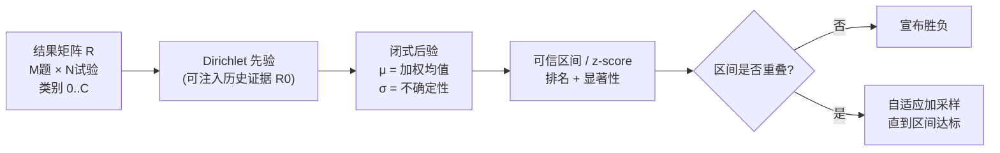

# Don't Pass@k: A Bayesian Framework for Large Language Model Evaluation

**会议**: ICLR 2026  
**OpenReview**: [https://openreview.net/forum?id=PTXi3Ef4sT](https://openreview.net/forum?id=PTXi3Ef4sT)  
**代码**: [https://github.com/mohsenhariri/scorio](https://github.com/mohsenhariri/scorio)  
**领域**: LLM 评估 / 基准方法学  
**关键词**: Pass@k, 贝叶斯评估, Dirichlet 先验, 可信区间, 排名稳定性, 计算高效评估  

## 一句话总结
本文把"评估 LLM"本身当成一个统计推断问题，用 Dirichlet 先验下的贝叶斯后验估计（Bayes@N）替代 Pass@k 和 avg@N，用闭式后验均值 + 可信区间在更少的采样下给出稳定排名，并提供"区间不重叠才宣布胜负"的透明决策规则。

## 研究背景与动机

**领域现状**：Pass@k 是当前报告 LLM 推理能力（尤其数学推理、代码生成）最常用的指标，它估计"k 次尝试中至少答对一次"的概率。avg@N（N 次试验的平均正确率，等价于 Pass@1）是另一常用做法。

**现有痛点**：在小而贵的基准上（如 AIME 这类只有几十道题的数学竞赛集），这些指标暴露三个结构性缺陷——

- **排名不稳**：当试验数 N 有限、k 接近 N 时，Pass@k 方差极大，少量正确性波动就会颠倒模型排名，对解码策略和随机种子高度敏感。
- **不确定性难量化**：Pass@k 没有方差的闭式表达，只能靠 bootstrapping 这类计算密集的近似来估区间。
- **缺决策规则 & 不支持分级**：avg@N 虽更稳但极度耗算力，且对"两个模型差距到底是真信号还是噪声"没有原则性的判定，也无法自然处理 rubric 分级（部分正确、格式错误、拒答等）。

**核心矛盾**：评估恰恰是 LLM 流水线里最薄弱的一环——评估结果直接决定哪个模型被采用、宣布了什么进展、资源往哪分配；但社区仍在用方便却脆弱的成功率指标，在算力受限场景下给出不可靠甚至误导性的结论。

**本文目标**：提供一个统一、计算高效、把不确定性显式化的评估协议，既能在更少采样下给出稳定排名，又能统一处理二元和分级评估。

**核心 idea**：**把每道题的结果建模为"类别型"而非纯二元，配 Dirichlet 先验，从而对任意加权 rubric 得到后验均值与可信区间的闭式解**；并证明在均匀先验的二元特例下，贝叶斯后验均值与平均正确率"序等价"（rank-equivalent），解释了 avg@N 经验上为何稳健，同时免费补上了原则性的不确定性。

## 方法详解

### 整体框架
对在 $M$ 道题上评估的 LLM，由于采样的随机性，每题独立跑 $N$ 次，构成 $M\times N$ 的结果矩阵 $R$，元素 $R_{\alpha i}\in\{0,\dots,C\}$ 表示第 $\alpha$ 题第 $i$ 次试验的评分（$C+1$ 个类别，二元时 $C=1$）。框架把每题的真实类别概率向量 $\boldsymbol\pi_\alpha$ 当成未知量，用 Dirichlet 先验对它做贝叶斯推断，输出一个目标性能指标 $\bar\pi$ 的后验均值 $\mu$ 和不确定性 $\sigma$，再用 $\sigma$ 驱动"排名 + 显著性判定 + 自适应采样"的完整协议。

### 关键设计

**1. 类别型结果 + 加权 rubric：把"对/错"推广成可定制的性能指标。** 不再只记 0/1，而是允许每题落入"正确、部分正确、格式错误、拒答、rubric 分级"等 $C+1$ 个类别。给定权重向量 $w=(w_0,\dots,w_C)$，目标指标定义为对全体题目类别概率的加权平均 $\bar\pi=\frac{1}{M}\sum_{\alpha=1}^{M}\sum_{k=0}^{C} w_k\,\pi_{\alpha k}$。取 $w_k=k$ 时它退化为平均类别标签，二元下就是平均正确率；但一般的 $w$ 让同一套框架能表达step-by-step 推理评分、部分给分、judge 分级等多种指标，不需要临时拼凑的聚合方式。

**2. 闭式贝叶斯估计器 + 不确定性：免 bootstrapping 的 µ 与 σ。** 在 Dirichlet 先验下，性能指标 $\bar\pi$ 的后验均值 $\mu(R)$ 是最小化二次损失 $L(\bar\pi_{\text{est}})=\mathbb E_{R,\pi}(\bar\pi_{\text{est}}(R)-\bar\pi)^2$ 的贝叶斯最优估计，方差 $\sigma^2(R)$ 量化其不确定性，二者都有 Algorithm 1 中的闭式表达式（记类别计数 $\nu_{\alpha k}$，$\mu=w_0+\frac{1}{MT}\sum_\alpha\sum_j \nu_{\alpha j}(w_j-w_0)$，$T=1+C+D+N$）。这意味着无需 bootstrapping 即可一次性算出点估计和区间，开销可忽略；可选的先验数据 $R_0$（$M\times D$ 矩阵）还能注入历史证据，比如复用相近任务或量化版本上稳定的 rubric 分布来加速收敛。

**3. 可信区间驱动的显著性决策：区间不重叠才宣布赢家。** 当题数 $M$ 较大时后验近似高斯 $P(\bar\pi|R)\sim\mathcal N(\mu,\sigma^2)$，两个模型性能差 $\Delta\bar\pi$ 也服从正态，均值 $\tilde\mu=\mu-\mu'$、标准差 $\tilde\sigma=\sqrt{\sigma^2+\sigma'^2}$。于是排名正确的置信度可由绝对 z-score $z=|\mu-\mu'|/\sqrt{\sigma^2+\sigma'^2}$ 算出，$\rho=\frac12(1+\mathrm{erf}(z/\sqrt2))$（$z=1.645$ 对应 $\rho=0.95$）。配套的实用协议是：报告后验均值 + 可信区间，**区间重叠就不宣布胜负**，并按需自适应加采样直到区间窄到预设阈值——天然支持在线/序贯评估。值得注意的是这套区间不依赖中心极限定理，在 LLM 常见的小样本下比 CLT 近似更稳（不会越出 $[0,1]$ 或坍缩到零）。

**4. 与平均排名的序等价：解释 avg@N 为何稳健。** 论文证明（Appendix B）均匀先验下的 $\mu$ 与朴素加权平均正确率之间只差一个正仿射变换，因此 **Bayes@N 的排名与 avg@N 完全相同**，且这种序等价在任意有限 $N$ 都成立（不只是 $N\to\infty$）。这既从理论上解释了 avg@N 经验上的稳健性，又免费给它配上了原则性的不确定性度量。论文进而用 Bayes@$N_{\max}$（实验中 $N_{\max}=80$）作为"金标准"参考排名，用 Kendall's $\tau_b$（处理并列）衡量小 $N$ 排名与金标准的吻合度。

## 实验关键数据

### 主实验：真实数学基准上的收敛速度
在 AIME'24、AIME'25、HMMT'25、BrUMO'25 四个数学推理集上，11 个 LLM，最多 $N=80$ 次试验，以 Bayes@80 / avg@80 为金标准，比较各方法排名与金标准的平均 Kendall's $\tau$（$10^4$ 次 bootstrap）。

| 方法 | 收敛行为（vs 金标准排名） |
|------|--------------------------|
| **Bayes@N / avg@N** | 四个数据集上曲线完全重合；$N=10$ 即达 $\tau>0.90$，$N\approx80$ 时 $\tau\approx1$（AIME'25 收敛到 ≈0.95） |
| Pass@2 / 4 / 8 | 小 $N$ 偏差与方差更大；AIME'24/'25 上常**无法收敛** |
| Pass^k / G-Pass@k / mG-Pass@k | 在 HMMT/BrUMO 上收敛更慢 |

收敛趋势（convergence@n，达到与 $N_{\max}=80$ 一致排名所需的试验数均值）：HMMT/BrUMO 上 Pass 系列需 ≈69.5 / ≈48.5 次，而 Bayes@N 仅需 ≈44.2 / ≈27.1 次——**Bayes@N 用更少采样就锁定稳定排名**。

### 消融 / 模拟：已知真值的"偏置硬币"实验
用 11 组已知成功率 $\bar\pi$（含一个 0.3642 的故意并列）的偏置硬币模拟 LLM，$M=30$ 题、最多 80 试验：

| 方法 | 与真排名的 Kendall's $\tau$ 收敛 |
|------|-------------------------------|
| **Bayes@N** | 起点 $\tau$ 高，最快达到 $\tau=1$ |
| Pass@k 及变体 | 小 $N$ 方差/偏差大，收敛慢 |

行/列两种 bootstrap 方案结果几乎一致，说明收敛对 $R$ 中答案排序不敏感。

### 关键发现
- **CI 揭示"分不出来"的并列**：Bayes@80 不带 CI 时排名与金标准基本一致（仅 LLM9/LLM10 互换、漏掉一个真并列）；带 95% CI 后多组模型变得不可区分——例如 $\bar\pi=0.608$ vs $0.6213$ 两个模型在 $N=80$ 下仍无法 95% 置信区分，要可靠区分需把 $N$ 增大约 3 倍。这量化地说明了"相近模型的排名本就难以可靠确定"。
- 非均匀先验（用 base/旧版/量化版等相关模型的信息）有望进一步加速收敛（附录给出初步合成演示）。

## 亮点与洞察
- **把评估重构为统计推断**：不是再发明一个 ad-hoc 指标，而是给出"后验均值 + 可信区间"的统一语言，二元与分级评估都是它的特例。
- **序等价定理很漂亮**：证明 Bayes@N 与 avg@N 排名完全等价，既"安抚"了实践者（avg@N 没错），又顺手补上了它缺的不确定性，并且不靠 CLT，在小样本下区间仍良态。
- **可操作的决策规则**："区间重叠就别宣布赢家" + 自适应加采样，直接对症 leaderboard 上对微小差距过度解读、频繁洗牌的乱象。
- **计算高效**：闭式 $\mu,\sigma$ 让在线监控区间宽度、按需分配额外试验成为可能，对算力受限的真实评估极友好。

## 局限与展望
- **高斯近似的前提**：显著性判定依赖 $M$ 大时后验近似高斯，题数很少的基准上该近似的可靠性需谨慎。
- **先验设计仍待打磨**：非均匀先验加速收敛只给了初步合成演示，如何在真实场景安全地复用历史证据（避免引入偏见）尚需系统研究。
- **验证范围偏窄**：实验集中在数学推理（AIME/HMMT/BrUMO），代码生成、开放式生成、judge 评分等更复杂 rubric 下的表现有待验证。
- **题目独立性假设**：bootstrap 与闭式推导假设题目/试验间独立，对存在相关性的基准可能需要修正。

## 相关工作与启发
- **替代/改进 Pass@k 的努力**：G-Pass@k、mG-Pass@k、Pass^k 等变体试图缓解 Pass@k 的不稳定，本文用统一的贝叶斯视角把它们一并纳入比较，并在收敛速度上胜出。
- **小样本贝叶斯区间**：呼应了"均匀先验（二元下 Beta(1,1)）在几百以内样本上比 CLT 近似给出更良校准可信区间"的观察。
- **启发**：对任何"在小而贵基准上排名模型"的场景（不止 LLM），都提示应当报告区间而非点估计，并用"区间不重叠"作为宣布差异的门槛；rubric 分级 + Dirichlet 的组合也为 judge 类评估提供了干净的聚合范式。

## 评分
- **新颖性**: ⭐⭐⭐⭐ — 把 LLM 评估重构为贝叶斯推断、给出 Dirichlet 闭式解与 avg@N 序等价定理，视角清晰且有理论支撑，虽然底层统计工具本身成熟。
- **实验充分度**: ⭐⭐⭐ — 已知真值的模拟 + 四个真实数学基准、对比多种 Pass@k 变体，论证扎实；但局限在数学推理领域，rubric 分级能力未在真实分级数据上充分检验。
- **写作质量**: ⭐⭐⭐⭐ — 痛点—方法—证明—验证逻辑顺畅，四个痛点编号清晰，公式与算法表达完整。
- **价值**: ⭐⭐⭐⭐ — 直击社区评估方法学的真实痛点，提供即插即用、可审计、计算高效的协议（含开源 scorio），有较强的实践推广潜力。

<!-- RELATED:START -->

## 相关论文

- [\[ICLR 2026\] Cost-of-Pass: An Economic Framework for Evaluating Language Models](cost-of-pass_an_economic_framework_for_evaluating_language_models.md)
- [\[NeurIPS 2025\] Bayesian Evaluation of Large Language Model Behavior](../../NeurIPS2025/llm_evaluation/bayesian_evaluation_of_large_language_model_behavior.md)
- [\[ICLR 2026\] SparseEval: Efficient Evaluation of Large Language Models by Sparse Optimization](sparseeval_efficient_evaluation_of_large_language_models_by_sparse_optimization.md)
- [\[ICLR 2026\] Multi-turn Evaluation of Anthropomorphic Behaviours in Large Language Models](multi-turn_evaluation_of_anthropomorphic_behaviours_in_large_language_models.md)
- [\[ICLR 2026\] Pitfalls in Evaluating Language Model Forecasters](pitfalls_in_evaluating_language_model_forecasters.md)

<!-- RELATED:END -->
