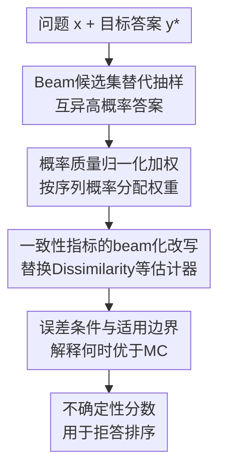

# Don't Throw Away Your Beams: Improving Consistency-based Uncertainties in LLMs via Beam Search

**会议**: ICLR2026  
**OpenReview**: [https://openreview.net/forum?id=igcQRiVlgu](https://openreview.net/forum?id=igcQRiVlgu)  
**代码**: https://github.com/IINemo/lm-polygraph/tree/beam-uncertainty  
**领域**: LLM评估 / 不确定性估计  
**关键词**: LLM不确定性估计, 一致性评估, Beam Search, 短答案问答, Prediction-Rejection  

## 一句话总结
这篇论文指出短答案问答里的多项式采样会大量重复高概率答案、导致一致性式不确定性估计方差很大，并用概率加权的 beam search 候选替代采样候选，在六个 QA 数据集和六个模型上稳定提升 PRR、ROC-AUC 与 PR-AUC。

## 研究背景与动机
**领域现状**：LLM 不确定性估计想回答一个很实际的问题：模型给出某个答案 $y^*$ 后，我们能否判断这个答案靠不靠谱。现有方法大致分为三类：看 token likelihood 的信息式方法，让模型自己报置信度的反思式方法，以及生成多个候选答案再看它们是否一致的采样式方法。其中一致性式方法很有吸引力，因为它不只看某个 token 的概率，而是直接比较不同生成答案在语义上是否支持当前答案。

**现有痛点**：一致性式方法通常用 multinomial sampling 生成 $M$ 个候选答案，再计算这些候选与目标答案 $y^*$ 的相似度或语义聚类关系。但短答案 QA 的输出分布往往很尖：问题的答案可能只有一个姓名、数字或短短几个词。此时采样很容易反复抽到同一个高概率答案，论文在 TriviaQA 上展示，当输出只有 2 到 4 个 token 时，重复样本比例可达约 30% 到 50%。这些重复样本既浪费生成预算，也让不确定性分数在不同运行之间波动很大。

**核心矛盾**：一致性式 UQ 需要的候选集最好同时满足三个条件：语义上有差异、概率上代表模型分布、运行之间稳定。但普通采样在尖峰分布里会被最高概率路径吸住，候选不够多样；如果强行提高采样温度，又可能引入低质量、低概率的离群答案。也就是说，候选生成方式本身成了不确定性估计的瓶颈。

**本文目标**：作者要解决的不是“如何让 beam search 生成更好答案”，而是“如何用 beam search 产生更适合作一致性估计的候选集”。具体来说，论文希望在相同候选预算 $M$ 下减少重复、降低估计方差、保留对模型概率分布的尊重，并把这个改动接入已有的一致性式和混合式 UQ 指标。

**切入角度**：beam search 在解码时本来就会维护若干条高概率候选路径。对于短答案 QA，这些 top-$M$ 路径通常覆盖了相当一部分概率质量，而且天然比独立采样更稳定。作者的关键观察是：既然 beam search 已经把模型认为最可能的几个答案列出来了，就不应该在解码后把这些 beam 丢掉，再额外采样一批重复答案来估计不确定性。

**核心 idea**：用概率加权的 beam search 候选替代 multinomial samples，重新估计候选答案与目标答案的一致性，从而让短答案 LLM 的置信度排序更稳定、更准确。

## 方法详解

### 整体框架
论文的整体流程很直接：给定问题 $x$ 和模型产生的目标答案 $y^*$，不再用随机采样生成辅助候选，而是运行宽度为 $M$ 的 beam search 得到一组互异的高概率候选 $B_M(x)=\{b^{(1)},\dots,b^{(M)}\}$。随后用每个 beam 的序列概率做归一化权重，再把这些加权候选喂给 Dissimilarity、Eccentricity、CoCoA、EigVecDissimilarity 等一致性式 UQ 指标，输出一个越大越不确定的分数。

这个框架的重点不是发明一个全新的置信度函数，而是替换置信度函数里的“候选集近似器”。原来的近似器是 $M$ 次独立采样，容易重复且运行不稳定；本文的近似器是 top-$M$ beam 加概率权重，更适合短答案场景里尖峰分布的形状。

### 关键设计
**1. Beam候选集替代抽样：用互异高概率答案修复短答案重复问题**

最基础的一致性式指标可以写成目标答案 $y^*$ 与模型所有可能输出之间的期望语义不相似度：$U_D(y^*|x)=\mathbb{E}_{y\sim p(\cdot|x)}[1-s(y,y^*)]$。旧做法用 Monte Carlo 估计这个期望，即采样 $M$ 个候选 $y^{(i)}$ 后取平均：$\hat U^{MC}_D=\frac{1}{M}\sum_i(1-s(y^{(i)},y^*))$。问题在于，短答案 QA 的高概率答案经常被重复抽中，实际有效候选数远小于 $M$。

本文把候选来源改成 beam search：用 beam width $M$ 得到 $B_M(x)=\{b^{(1)},\ldots,b^{(M)}\}$。这一步让候选集从“随机抽到什么算什么”变成“显式枚举模型分布顶部的几条路径”。对“谁唱了 Thriller”这类短答案问题，采样可能多次给出 Michael Jackson 或 Prince 的重复变体，而 beam search 更容易列出 Michael Jackson、Prince、Bruno Mars 等不同候选，从而让一致性分数真正反映答案空间里存在的竞争解释。

**2. 概率质量归一化加权：不把低概率beam当成同等证据**

如果直接把 beam 候选当作 $M$ 个等权样本，也会有偏差：beam search 的后几名可能是低概率甚至古怪的答案，等权平均会夸大这些尾部候选对不确定性的影响。为此，论文用每个 beam 的自回归序列概率做 restricted top-$M$ 归一化：$w_i=\frac{p(b^{(i)}|x)}{\sum_{j=1}^{M}p(b^{(j)}|x)}$。最终的 beam 版 Dissimilarity 是 $\hat U^b_D(y^*|x)=\sum_i w_i(1-s(b^{(i)},y^*))$。

这个权重有两层作用。第一，它保留了 beam search “互异候选”的优势，不会像采样那样把预算浪费在重复答案上。第二，它又把候选的重要性拉回模型概率分布，避免第十名 beam 和第一名 beam 被同等看待。附录的概率质量分析也支持这一点：beam 候选的概率随排名快速下降，前几个 beam 往往贡献了大部分质量，所以质量感知的加权比简单平均更贴近模型真实偏好。

**3. 一致性指标的beam化改写：把候选生成替换成可复用的估计层**

论文没有只停留在 Dissimilarity，而是把同一个 beam 加权思想接入多个已有指标。Eccentricity 原本会构造目标答案和采样候选之间的相似度矩阵 $W$，再用图 Laplacian 的低谱特征形成语义嵌入，最后比较 $y^*$ 的嵌入与候选均值的距离。本文把候选均值改成加权均值：$\hat U^b_{Ecc}=\|v^*_b-\sum_i w_i v^b_i\|_2^2$，使高概率 beam 对语义中心的贡献更大。

CoCoA 这类白盒混合方法则把模型概率式不确定性 $u(y^*|x)$ 与一致性信号相乘。本文保留 $u(y^*|x)$，只把一致性信号从 $\hat U^{MC}_D$ 换成 $\hat U^b_D$，得到 $\hat U^b_{CoCoA}=u(y^*|x)\cdot \hat U^b_D(y^*|x)$。EigVecDissimilarity 也类似：先用 Laplacian 嵌入捕捉候选间的联合语义结构，再对 $y^*$ 到每个 beam 嵌入的距离做概率加权平均。这样一来，beam search 不是某个单独指标的特殊技巧，而是可以复用到一系列一致性式 UQ 方法里的候选估计层。

**4. 误差条件与适用边界：用beam概率质量解释何时优于Monte Carlo**

作者还给出一个直观的理论条件，说明 beam 加权估计为什么会在尖峰分布里占优。设 beam 集合覆盖的总概率质量为 $m_B=\sum_i p(b^{(i)}|x)$，beam 内外的平均不相似度分别为 $\mu_B$ 和 $\bar\mu_B$，Monte Carlo 估计的方差为 $\sigma^2/M$。beam 估计的误差来自 top-$M$ 截断，即 $(1-m_B)^2(\mu_B-\bar\mu_B)^2$；当 $(1-m_B)|\mu_B-\bar\mu_B|<\sigma/\sqrt{M}$ 时，beam 加权估计的均方误差小于 Monte Carlo。

论文进一步给出一个分布无关的充分条件：$m_B>1-\frac{1}{2\sqrt{M}}$。在 $M=10$ 时阈值约为 $0.842$，也就是 top-10 beam 如果覆盖超过 84.2% 的概率质量，beam 估计有理论保证更优。这个条件不是必要条件；如果 beam 内外的不相似度差距 $|\mu_B-\bar\mu_B|$ 较小，beam 即使覆盖不到 84.2% 也可能更好。实验中 beam 在大量未必满足强充分条件的样本上仍然优于采样，说明实际 break-even 往往比最保守边界宽松。

### 一个完整示例
假设问题是“贝多芬哪一部交响曲被称为 The Pastoral？”，模型的贪心答案是 “6”。如果用 multinomial sampling 生成 10 个候选，可能会出现 “sixth”“6”“seventh”“sixteenth”等答案，其中正确语义和错误语义混在一起，而且同义答案会重复多次。Dissimilarity 只能按这些随机候选的平均相似度给出一个分数；换一次随机种子，候选组成可能又变了。

用 beam search 时，模型会给出按序列概率排列的候选，例如 “sixth”、 “6”、 “6th”、 “ninth”、 “seventh”等，并带有各自概率。若前几个候选大多与 “6” 语义一致，低排名里才出现 “ninth” 或 “seventh”，概率加权后的不确定性就不会被尾部错误答案过度放大。反过来，如果高概率 beam 本身就分裂成多个互相矛盾的答案，beam 加权一致性分数会明显升高，说明模型对当前答案的信心不足。

这个例子体现了本文方法的核心判断逻辑：不是候选越多越好，而是候选集要覆盖模型真正可能给出的竞争答案，并且每个候选的影响要和它在模型分布中的质量匹配。

### 损失函数 / 训练策略
本文没有训练新的模型，也没有引入需要反向传播优化的损失函数。所有方法都是推理时的不确定性估计器：给定已有 LLM、问题、目标答案和候选生成策略，计算一个标量不确定性分数。

主要超参与实现选择包括：候选数 $M$ 默认设为 10；beam 候选用自回归序列概率 $p(b^{(i)}|x)$ 归一化得到 $w_i$；语义相似度函数 $s(\cdot,\cdot)$ 在主实验中采用 MNLI 微调的 DeBERTa-large 的 entailment probability；Eccentricity 和 EigVecDissimilarity 的 Laplacian 特征选择使用阈值 $\alpha=0.9$；评估时主要用贪心解码得到的答案作为 $y^*$，附录还测试了把 top-1 beam 作为被评分答案的设置。

## 实验关键数据

### 主实验
主实验覆盖六个 QA 数据集：闭卷 TriviaQA、Web Questions，开卷 CoQA、HotpotQA，以及多选 CommonsenseQA、ARC-Challenge。模型包括 Gemma 3 4B、Llama 3.1 8B、Qwen 3 8B 的 base 和 instruct 版本。主指标是 Prediction-Rejection Ratio (PRR)，即看不确定性分数能否优先拒掉低质量答案；答案质量由 AlignScore 与金答案的对齐程度衡量。

| 方法 | Llama 3.1 8B base | Llama 3.1 8B instruct | Gemma 3 4B base | Gemma 3 4B instruct | Qwen 3 8B base | Qwen 3 8B instruct |
|------|-------------------|------------------------|-----------------|----------------------|----------------|---------------------|
| Dissimilarity | .505 | .379 | .630 | .206 | .477 | .327 |
| Dissimilarity + beamsearch | .543 | .417 | .650 | .252 | .478 | .355 |
| Eccentricity | .453 | .368 | .563 | .231 | .396 | .251 |
| Eccentricity + beamsearch | .505 | .397 | .603 | .285 | .410 | .345 |
| EigVecDissimilarity | .463 | .370 | .561 | .236 | .425 | .256 |
| EigVecDissimilarity + beamsearch | .510 | .414 | .598 | .301 | .450 | .376 |
| CocoaMSP | .505 | .404 | .587 | .314 | .461 | .334 |
| CocoaMSP + beamsearch | .521 | .426 | .615 | .345 | .473 | .347 |
| CocoaPPL | .523 | .397 | .628 | .312 | .461 | .327 |
| CocoaPPL + beamsearch | .536 | .412 | .649 | .339 | .461 | .337 |

这个表最重要的信息是“几乎每一行 beam 版都高于原版”。Dissimilarity + beamsearch 在三个 base 模型上拿到最好 PRR；CocoaMSP + beamsearch 在 Llama instruct 和 Gemma instruct 上表现最好；CocoaPPL + beamsearch 也经常排到第二。换句话说，改候选生成方式本身就能带来稳定收益，而不是只对某个单一指标有效。

论文还报告 ROC-AUC 和 PR-AUC。以 Gemma 3 4B base 为例，Dissimilarity 的平均 ROC-AUC 从 .836 提升到 .848，CocoaPPL 从 .835 提升到 .846；平均 PR-AUC 中，CocoaPPL 从 .789 提升到 .801，Dissimilarity 从 .789 提升到 .794。这说明 PRR 的结论不是单一指标偶然现象。

### 消融实验
| 消融设置 | 关键结果 | 说明 |
|----------|----------|------|
| 候选数 $M$ 从 1 到 15 | $M\ge 2$ 时 beam search 通常全程高于采样；TriviaQA 上约 $M=3$ 到 5 已接近饱和 | beam 更快用小预算覆盖有用候选；$M=1$ 时 beam 退化为 greedy，Dissimilarity 信息很少 |
| 输出长度分桶 | 2 到 4 token 的短答案上 beam 优势最明显；7 token 以上差距变小 | 与重复率曲线一致，短答案采样最容易抽到重复样本 |
| 采样策略对比 | 普通 beam 是稳健默认；hybrid multinomial-beam 在部分超参下能赢，但需要调 $B$ | 论文没有把复杂策略作为主方法，因为收益不稳定且调参成本高 |
| restricted-mass floor $\epsilon$ | $\epsilon=0$、$10^{-5}$、$10^{-3}$ 等都能给出强结果，但无统一最优值 | 加小概率地板可稳定低质量量 beam 的权重，最佳值依任务而变 |
| Semantic Entropy / Degree Matrix 的 beam 化 | Semantic Entropy 的 PR-AUC 从 .401 提到 .472，但仍弱于 Dissimilarity 系列 | 输入级不确定性与“当前答案是否正确”的排序目标不完全匹配 |
| top-1 beam 作为 $y^*$ | beam 加权家族多数情况下仍优于原方法 | 若部署时本来就用 beam 解码，本文估计器也能自然服务于 top beam 答案 |

### 关键发现
- beam search 的收益最集中在短答案 QA，因为这类任务的输出空间小而尖，multinomial sampling 的重复问题最严重。
- 概率加权是必要的：beam 候选互异但概率差距很大，等权处理会让低概率尾部答案被高估。
- 论文的改动对多个一致性指标都有效，说明瓶颈主要在候选集近似，而不是某个具体相似度函数。
- beam 并不总是神奇地提升所有 sampling-based 目标；例如 Degree Matrix 改善有限，Semantic Entropy 虽有提升但绝对表现仍弱于针对 $y^*$ 的方法。
- 理论条件给出了可解释边界：当 top-$M$ beam 覆盖足够概率质量，或者 beam 内外平均不相似度差距不大时，beam 估计更可能优于 Monte Carlo。

## 亮点与洞察
- 这篇论文最巧妙的地方在于它没有再设计一个复杂的新 UQ 分数，而是把注意力放到“已有分数到底用什么候选来近似”。很多一致性式 UQ 的失败并不是相似度函数不够聪明，而是候选集本身被重复采样污染了。
- “Don't throw away your beams” 这个标题很准确：如果系统已经用 beam search 或可以低成本拿到 beam，直接把 beam 丢掉再采样是不经济的。把解码阶段产生的候选复用到置信度估计里，是一个工程上很自然、实验上又有效的改动。
- 理论分析虽然保守，但提供了一个清晰诊断变量：beam set probability mass $m_B$。这提示后续系统可以动态决定候选策略，例如当 top beams 覆盖质量高时用 beam，当概率分布更平坦时混入采样。
- 论文把“不确定性”明确定位为对当前答案 $y^*$ 的预测性不确定性，而不是输入问题整体有多开放。这个区分解释了为什么 Dissimilarity / CoCoA 这类答案条件化方法强于 Semantic Entropy 等输入级指标。
- 对其他任务的迁移也很直接：任何需要“候选答案一致性”来估计置信度的场景，如检索增强问答、事实核验、医学短答、代码补全候选校验，都可以把随机候选替换成概率加权的 top-$M$ 解码候选。

## 局限与展望
- 论文主要评估白盒设置，因为需要访问候选序列概率 $p(b^{(i)}|x)$。如果只能调用黑盒 API，就需要用经验频率、logprob API 或额外校准模型来近似权重，效果未必等同。
- 实验集中在 short-form QA。长文本生成里的答案空间更开放，beam search 可能导致模式坍缩或长度偏置，是否仍能比采样更好，需要单独验证。
- 方法依赖语义相似度函数 $s$ 和质量指标 AlignScore。主实验用 NLI 模型估计候选答案是否语义一致，但在数学推理、代码、医学实体等任务中，通用 NLI 相似度可能不够可靠。
- beam search 自身也有解码偏差。它偏向高概率、较保守的候选，可能漏掉低概率但语义重要的替代答案；附录的 hybrid 结果说明混合 beam 与 sampling 可能有潜力，但需要更稳健的自适应策略。
- 论文没有充分讨论计算开销在不同部署管线里的差异。如果原系统用 greedy decoding，额外跑 beam search 仍然有成本；“几乎免费”主要成立于本来就能复用 beam 或需要生成候选进行 UQ 的场景。

## 相关工作与启发
- **vs Semantic Entropy**: Semantic Entropy 把多个生成聚成语义集合，衡量输入问题引起的整体语义不确定性；本文更关注给定答案 $y^*$ 是否可靠。实验显示，在 prediction-rejection 这种按当前答案正确性排序的任务上，答案条件化的一致性指标更合适。
- **vs Lin et al. 的 Eccentricity / EigValLaplacian**: Lin 等方法用相似度图和 Laplacian 捕捉候选间语义结构，但默认候选来自采样。本文保留这些图结构思想，只把候选生成与聚合权重改成 beam-aware，使同一类指标在短答案场景中更稳定。
- **vs CoCoA**: CoCoA 把模型概率不确定性和样本一致性结合起来，是强白盒基线。本文的贡献不是替代 CoCoA，而是把 CoCoA 里的样本一致性项改成 beam 加权版本，因此与原方法互补。
- **vs uncertainty-aware decoding**: 一些工作把不确定性用于改进生成过程，例如 MBR decoding、uncertainty-guided contrastive search。本文方向相反：它利用解码候选来改进不确定性估计，目标是更好地排序和拒绝已有答案，而不是直接生成更好文本。
- **启发**: 后续可以设计自适应候选混合器，先估计 top beams 的概率质量与语义分裂程度，再决定用纯 beam、beam+sampling 还是高温采样。这样可能把本文在尖峰短答案分布上的优势扩展到更开放的生成任务。

## 评分
- 新颖性: ⭐⭐⭐⭐☆ 思路朴素但击中关键瓶颈，把 beam search 作为一致性 UQ 的候选估计器有清晰价值。
- 实验充分度: ⭐⭐⭐⭐⭐ 六个数据集、六个模型、多个指标和大量附录消融，结论比较扎实。
- 写作质量: ⭐⭐⭐⭐☆ 主线清楚，理论条件和实验现象能互相支撑；个别附录表格较密，需要读者自己归纳。
- 价值: ⭐⭐⭐⭐⭐ 对短答案 QA 的置信度估计非常实用，尤其适合已有解码候选可复用的 LLM 评估与拒答系统。

<!-- RELATED:START -->

## 相关论文

- [\[ICLR 2026\] RedacBench: Can AI Erase Your Secrets?](redacbench_can_ai_erase_your_secrets.md)
- [\[ICLR 2026\] Complementing Self-Consistency with Cross-Model Disagreement for Uncertainty Quantification](complementing_self-consistency_with_cross-model_disagreement_for_uncertainty_qua.md)
- [\[ICLR 2026\] Don't Pass@k: A Bayesian Framework for Large Language Model Evaluation](dont_passk_a_bayesian_framework_for_large_language_model_evaluation.md)
- [\[ACL 2026\] HumanLLM: Benchmarking and Improving LLM Anthropomorphism via Human Cognitive Patterns](../../ACL2026/llm_evaluation/humanllm_benchmarking_and_improving_llm_anthropomorphism_via_human_cognitive_pat.md)
- [\[ICLR 2026\] FinSearchComp: Towards a Realistic, Expert-Level Evaluation of Financial Search and Reasoning](finsearchcomp_towards_a_realistic_expert-level_evaluation_of_financial_search_an.md)

<!-- RELATED:END -->
