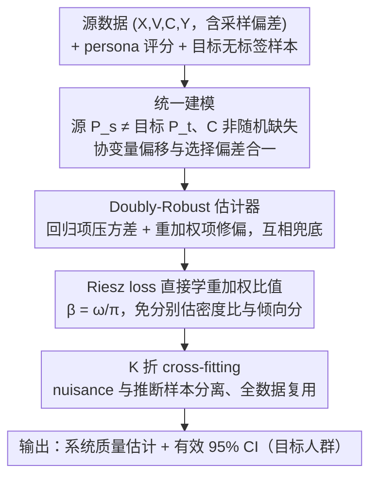

# Doubly-Robust LLM-as-a-Judge: Externally Valid Estimation with Imperfect Personas

**会议**: ICLR2026  
**arXiv**: [2509.22957](https://arxiv.org/abs/2509.22957)  
**代码**: [lguerdan/doubly-robust-llm-judge](https://github.com/lguerdan/doubly-robust-llm-judge)  
**领域**: LLM评测  
**关键词**: LLM-as-a-Judge, Doubly-Robust Estimation, External Validity, Persona Prompting, Evaluation Sampling Bias  

## 一句话总结
提出一种 doubly-robust 估计框架，将不完美的 LLM persona 评分与存在采样偏差的人工评分相结合，在协变量偏移和选择偏差同时存在时仍能产生统计有效的 GenAI 系统质量估计。

## 背景与动机
随着生成式 AI 系统的广泛部署，评估的**外部有效性**（external validity）成为核心问题——实验室评估结果能否泛化到真实部署场景？

现有评估流程面临两类**评估采样偏差**（evaluation sampling bias）：

1. **协变量偏移**（covariate shift）：评估时使用的标注者群体（如 MTurk 众包工人，偏年轻高学历）与部署目标人群（如医疗聊天机器人用户，偏年长女性）分布不同
2. **选择偏差**（selection bias）：标注者对敏感内容倾向于放弃评分（即评分完成与否依赖标注者/内容特征），违反了 MCAR（Missing Completely at Random）假设

现有统计框架如 PPI++、RePPI 假设源数据和目标数据 i.i.d. 采样且缺失完全随机，当这些假设被违反时会导致严重的覆盖率失效。本文旨在提出一种在采样偏差下仍能给出有效置信区间的估计方法。

## 核心问题
如何利用廉价但不完美的 LLM persona 评分和有偏但真实的人工评分，在协变量偏移和选择偏差同时存在的条件下，获得对目标分布上系统质量参数的统计有效估计？

## 方法详解

### 整体框架
方法要对付的局面是：手上只有两份都不靠谱的数据——廉价但带系统偏差的 LLM persona 评分、真实但在采样偏差下采到的人工评分——却要估出真实部署人群上的系统质量。论文把它形式化成一个 M-estimation 问题，并构造一个 doubly-robust 估计器把两份数据拼起来：先把协变量偏移和选择偏差统一写进同一个估计目标；再用一个回归项（在大量无标签目标样本上算预测均值、压低方差）加一个重加权项（在源样本上修正残差、同时纠正 persona 偏差与采样偏差）组成估计器；其中难学的重加权比值用 Riesz loss 一步直接学出来；最后整套放进 K 折 cross-fitting 来训练 nuisance 与做推断。关键性质是 double robustness——只要回归与重加权两个 nuisance 函数里有**一个**估得够好，置信区间就有效，从而在两类采样偏差并存时仍保住覆盖率。

### 关键设计

**1. 统一建模评估采样偏差：把协变量偏移和选择偏差写进同一个估计目标**

整套方法要成立，第一步得把"评估为什么会失真"说清楚。论文将每条评分记录建模为随机元组 $Z = (X, V, C, Y, \hat{Y})$：$X$ 是标注者特征（年龄、性别、地区），$V$ 是待评内容的嵌入，$C$ 是评分完成指示器（$C=1$ 才能观察到人工评分），$Y$ 是人工评分，$\hat{Y}$ 是 LLM persona 评分。源分布 $P_s$（实际招募到的标注者）与目标分布 $P_t$（真实部署人群）不一致，制造了协变量偏移；而 $C$ 又依赖标注者和内容特征（敏感内容更易被放弃），制造了选择偏差。两类偏差就此被统一收进"估计目标分布质量参数 $\theta_t$（如 $\mathbb{E}_t[Y]$）"这一个目标里。把它们放进同一框架是后面构造去偏估计器的前提，也让方法能自然推广到方差、分位数等更一般的统计量，而不只是均值。

**2. Doubly-Robust 估计器：让回归项和重加权项互相兜底**

有了统一目标，怎么估才稳？单用回归会在 persona 评分与人工评分相关性不高时收敛太慢，单用逆倾向加权（密度比 $\omega_0$ 乘完成概率倒数 $1/\pi_0$）又在高维文本空间方差爆炸——两条单边路线各有死穴。论文把两者拼成一个估计器，让它们互相兜底：

$$\hat{\theta} = \frac{1}{N_t}\sum_{i=1}^{N_t}\hat{\mu}(W_i^t, \hat{Y}_i^t) + \frac{1}{N_s}\sum_{j=1}^{N_s}\hat{\alpha}(W_j^s, C_j^s)\{Y_j^s - \hat{\mu}(W_j^s, \hat{Y}_j^s)\}$$

左项（回归项）在目标样本上用回归模型 $\hat{\mu}$ 算预测均值，借大量无标签数据压低方差；右项（重加权项）用重加权函数 $\hat{\alpha}$ 对源样本上的残差 $Y - \hat{\mu}$ 做加权修正，同时纠正 persona 评分偏差和采样偏差。这种"预测均值 + 加权残差"的结构带来 double robustness：只要满足

$$\|\hat{\alpha} - \alpha_0\|_{L^2} \cdot \|\hat{\mu} - \mu_0\|_{L^2} = o_\mathbb{P}(N_t^{-1/2})$$

即两个 nuisance 函数估计误差之**积**以参数速率衰减，估计就有效——这意味着 $\hat{\mu}$ 和 $\hat{\alpha}$ 各自只要达到非参数速率 $N_t^{-1/4}$，且其中一个估得够准就能兜住另一个估得差的，置信区间依然成立。这正是它比只依赖单边假设（i.i.d. 或 MCAR）的 PPI++/RePPI 更耐偏差的根源。

**3. Riesz loss 直接学比值：绕开高维空间里分别估密度比和倾向分的难题**

兜底归兜底，重加权项里的 $\hat{\alpha}$ 本身并不好学：它依赖比值 $\beta_0(w) = \omega_0(w)/\pi_0(w)$，传统做法是先分别学密度比 $\hat{\omega}$ 和完成概率 $\hat{\pi}$ 再相除，两次估计的误差在高维文本空间会被相除进一步放大、方差失控。论文改用 Riesz loss 一步直接学这个比值：

$$\beta_0 = \arg\min_\beta \{\mathbb{E}_s[C \cdot \beta(W^s)^2] - 2\mathbb{E}_t[\beta(W^t)]\}$$

这个目标的最优解恰好就是所需的 $\beta_0$，全程无需显式估计任何一个概率密度。为让它在文本上可算，内容特征先用 sentence transformer（MiniLM-L6-v2）嵌入，再用 UMAP 降到 15 维，使重加权函数即便在高维文本空间也能稳定估出。这也是实验里 DR (Riesz) 相比先分别估 $\hat\omega$、$\hat\pi$ 再相除的 DR (Classical)、在 PRISM/DICES 上方差明显更低的直接原因。

**4. K 折 cross-fitting：在同一份数据上既训 nuisance 又做推断时避免过拟合偏差**

最后还有一个隐患：去偏估计要求 nuisance 模型与被去偏的样本相互独立，否则模型在自己见过的样本上过拟合，会把额外偏差带进估计。论文用 $K$ 折交叉拟合化解：每一折的去偏估计都只用其余 $K-1$ 折训练出的 $\hat{\mu}$、$\hat{\alpha}$，再对当前折算贡献，最后对所有折求平均。这样既保证估计与 nuisance 模型的样本分离、维持上面的理论保证，又让全部数据都参与推断，最大化了本就稀缺的人工评分的利用效率。

## 实验关键数据

### Persona Simulation Framework (PSF)
提出三个递增真实性的实验设置：

| 数据集 | 类型 | 评分任务 | 规模 |
|--------|------|----------|------|
| Fully Synthetic | 完全合成 | — | nuisance 函数已知 |
| Semi-Synthetic PRISM | 真实对话 + LLM 评分 | helpfulness (1-100) | 1000对话 × 50评分 |
| Semi-Synthetic DICES | 真实对话 + 人工评分 | harmfulness (1-4) | 300对话 × 25评分 |

### 主要结果（40次试验平均）
在三个数据集上 DR (Riesz) 的表现：

- **Coverage**：Synthetic 1.00、PRISM 0.93、DICES 0.86，远超次优方法 RePPI（0.56/0.66/0.40）
- **Bias (MAE)**：Synthetic 0.03、PRISM 0.46、DICES 0.02，均为最低
- DR (Riesz) 在 persona 质量 $\rho \geq 0.65$ 时即可在 PRISM 和 DICES 上获得有效覆盖
- 使用真实 LLM（GPT-5, Claude Sonnet 3.5 等）的 persona 评分也能有效提升估计质量

### 关键发现
1. DR (Riesz) 在所有基线中偏差最低、覆盖率最高
2. Riesz loss 显著优于传统分别估计 $\hat{\omega}$、$\hat{\pi}$ 的方法，在高维文本空间尤为明显
3. 即使 persona 评分与人工评分相关性仅为中等（$\rho \approx 0.4$），也能改善估计

## 亮点
- **理论贡献扎实**：将 doubly-robust 估计推广到同时处理协变量偏移和选择偏差的 M-estimation 框架，不仅支持均值估计，还支持方差、分位数等丰富的统计量
- **Riesz loss 的巧妙应用**：回避了在高维空间中分别估计密度比和倾向分的困难，直接学习所需的重加权函数
- **实验设计科学**：PSF 框架系统地操控 persona 质量、协变量偏移和选择偏差三个维度，并开源供社区使用
- **实际意义明确**：解决了当前 AI 安全评估中标注者群体代表性不足的真实痛点

## 局限与展望
- 依赖**无概念漂移**假设（$P_s(Y|W) = P_t(Y|W)$），即相同特征的标注者对相同内容给出相同评分分布，现实中可能不成立
- 内容嵌入采用 MiniLM-L6-v2 + UMAP 降维到 15 维，信息损失对估计质量的影响需更多分析
- 实验中人工评分规模有限（DICES 仅 300 对话 × 25 评分），更大规模场景下的表现待验证
- Persona 评分的生成策略仍依赖手工设计的 prompt，不同 prompt 设计对 persona 质量的敏感性未充分探讨

## 与相关工作的对比

| 方法 | 处理协变量偏移 | 处理选择偏差 | 利用 Persona 评分 | 覆盖率保证 |
|------|:-:|:-:|:-:|:-:|
| PPI++ | ✗ | ✗ | ✓ | 仅 i.i.d. |
| RePPI | ✗ | ✗ | ✓ | 仅 MCAR |
| IPW | ✓ | ✓ | ✗ | 高方差 |
| **DR (Riesz)（本文）** | **✓** | **✓** | **✓** | **doubly-robust** |

相较于 PPI++/RePPI，本文放松了 MCAR 假设；相较于传统 IPW，通过 Riesz loss 大幅降低高维空间中的方差；相较于纯 persona 评估，提供了理论保证的偏差修正。

## 启发与关联
- Riesz loss 直接学习密度比的思路可推广到其他需要 importance weighting 的场景（如域自适应、off-policy 评估）
- PSF 框架的实验设计思路（系统操控偏差大小）值得在其他评估方法论研究中借鉴
- 对于 AI 安全评估实践，本文指出仅依赖众包标注者或仅依赖 LLM-as-Judge 都不够，两者的合理结合才是出路

## 评分
- 新颖性: ⭐⭐⭐⭐ — 将 doubly-robust 估计与 LLM persona 评分结合，形式化了评估采样偏差问题
- 实验充分度: ⭐⭐⭐⭐ — PSF 框架设计精巧，合成与半合成实验互补，但真实人工评分规模偏小
- 写作质量: ⭐⭐⭐⭐⭐ — 理论展开清晰，问题动机阐述充分，实验可视化直观
- 价值: ⭐⭐⭐⭐ — 为 GenAI 评估提供了理论严谨的偏差修正工具，有明确的实际应用前景

<!-- RELATED:START -->

## 相关论文

- [\[ICLR 2026\] Noisy but Valid: Robust Statistical Evaluation of LLMs with Imperfect Judges](noisy_but_valid_robust_statistical_evaluation_of_llms_with_imperfect_judges.md)
- [\[ICLR 2026\] Preference Leakage: A Contamination Problem in LLM-as-a-judge](preference_leakage_a_contamination_problem_in_llm-as-a-judge.md)
- [\[ICML 2026\] Reasoning Is Not Free: Robust Adaptive Cost-Efficient Routing for LLM-as-a-Judge](../../ICML2026/llm_evaluation/reasoning_is_not_free_robust_adaptive_cost-efficient_routing_for_llm-as-a-judge.md)
- [\[ACL 2025\] YESciEval: Robust LLM-as-a-Judge for Scientific Question Answering](../../ACL2025/llm_evaluation/yescieval_llm_judge_science.md)
- [\[ICLR 2026\] BiasScope: Towards Automated Detection of Bias in LLM-as-a-Judge Evaluation](biasscope_towards_automated_detection_of_bias_in_llm-as-a-judge_evaluation.md)

<!-- RELATED:END -->
