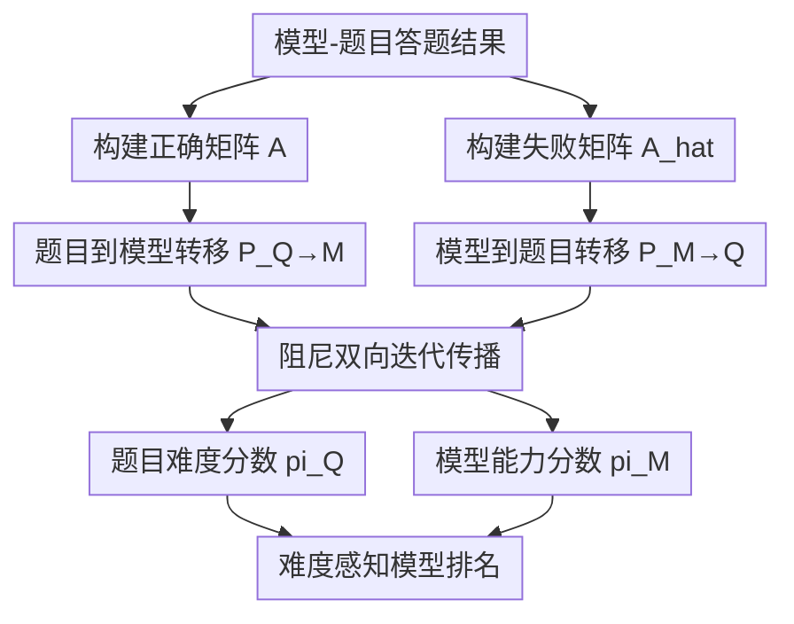

# EIP: Weighted Ranking of LLMs by Quantifying Question Difficulty

**会议**: ICLR 2026  
**OpenReview**: [https://openreview.net/forum?id=jnX5GJIoYt](https://openreview.net/forum?id=jnX5GJIoYt)  
**代码**: https://github.com/Leozz04/EIP  
**领域**: LLM 评测 / Benchmarking  
**关键词**: 题目难度建模, 双向传播, 模型能力排序, 人类一致性, 非参数评测  

## 一句话总结
这篇论文提出 EIP（Empirical Interaction Propagation），把“模型答对/答错题目”的二值交互建成双向图传播系统，联合估计题目难度和模型能力，从而实现比纯准确率更细粒度、且与人类难度判断高度一致（90%）的 LLM 排名。

## 研究背景与动机
**领域现状**：当前主流 LLM 榜单大多使用总体准确率或按子任务平均准确率来排序，默认每道题的信息量近似相同。这种做法在“题目难度分布变化”时很脆弱，因为模型在易题和难题上的能力结构可能完全不同。

**现有痛点**：当两模型总体准确率接近时，单一准确率无法区分“谁在难题上更强”。论文给出的例子很直观：某些模型总体正确率不占优，但在 hard 子集正确率明显更高，传统排名会把这部分能力直接抹平。

**核心矛盾**：评测系统要同时满足两件事：一是可解释地刻画“题有多难、模有多强”；二是在大规模数据上计算可承受。IRT 一类方法可以做难度-能力联合建模，但在实际 LLM 大规模评测中常面临参数拟合重、样本需求高和部署成本高的问题。

**本文目标**：作者希望构建一个不依赖复杂参数假设、能在大规模模型-题目交互矩阵上快速收敛、并且与人类难度判断对齐的评测框架。

**切入角度**：EIP 的关键观察是“难度”和“能力”天然是互相定义的：强模型都做不出来的题更难；能做出高难题的模型更强。于是作者把这个互相定义过程直接写成图上的双向传播迭代，而不是先固定一方再估另一方。

**核心 idea**：将模型与题目构造成有向二分图，通过“答对边”与“答错边”进行阻尼传播，最终用唯一稳态分布同时得到题目难度分数和模型能力分数。

## 方法详解

### 整体框架
EIP 先收集模型在题目上的正确/错误结果，形成二值矩阵 $A \in \{0,1\}^{Q\times M}$。其中 $A_{q,m}=1$ 表示模型 $m$ 做对题目 $q$。随后构造互补失败矩阵 $\hat{A}=(\mathbf{1}-A)^\top$，并在“题目节点”和“模型节点”之间建立双向传播：题目难度向做对它的模型传递，模型能力向难倒它的题目传递。

为避免二分图随机游走中的周期性问题，EIP 在每轮更新中加入阻尼项（类似 PageRank 的 teleport），确保整个过程是遍历且非周期的，从而收敛到唯一稳态分布。最终输出两组分数：$\pi_Q$（题目难度）与 $\pi_M$（模型能力）。

### 关键设计
**1. 二分图双边语义建模：把“做对”和“做错”分开编码**

很多评测只保留“正确率”，但 EIP 显式区分两种边：$q \rightarrow m$（做对）和 $m \rightarrow q$（做错）。这让传播过程更有语义：做对高难题会给模型更多能力增益，而被强模型做错会抬高题目难度。形式上，EIP 定义了相互依赖关系：

$$
\pi_m \propto \sum_{q \in Success(m)} \frac{\pi_q}{S(q)},\qquad
\pi_q \propto \sum_{m \in Fail(q)} \frac{\pi_m}{F(m)}
$$

其中 $S(q)$ 是做对题目 $q$ 的模型数，$F(m)$ 是模型 $m$ 做错题目数。这个归一化避免了“热门易题”或“普遍失误模型”对传播造成无控制放大。

**2. 行随机转移矩阵 + 阻尼迭代：保证稳定可解的全局排序**

论文将传播写成两个行随机矩阵：
$P_{Q\to M}=\mathrm{diag}(A\mathbf{1}_M)^{-1}A$，
$P_{M\to Q}=\mathrm{diag}(\hat{A}\mathbf{1}_Q)^{-1}\hat{A}$。
然后交替更新：

$$
\pi_Q^{(t+1)}=\alpha P_{M\to Q}^{\top}\pi_M^{(t)}+(1-\alpha)\frac{\mathbf{1}_Q}{Q}
$$

$$
\pi_M^{(t+1)}=\alpha P_{Q\to M}^{\top}\pi_Q^{(t+1)}+(1-\alpha)\frac{\mathbf{1}_M}{M}
$$

阻尼参数 $\alpha \in (0,1)$ 让系统避免纯二分图来回振荡，并在理论上满足唯一稳态存在。作者强调这是 EIP 能在大规模评测里既稳又快的关键。

**3. 预过滤极端题目：减少死节点并提升传播有效性**

如果某题被所有模型都做对或都做错，那么它对区分模型能力几乎没有信息，且会在传播中形成边界节点。EIP 在构图前过滤这类极端题，确保保留题满足 $0<\sum_j A_{ij}<M$。论文在 35,550 题、30 模型设置下报告极端题约占 2%，过滤后既不影响总体结论，又显著提升传播可用信号密度。

**4. 连续分数扩展：从二值判分推广到部分得分任务**

EIP 不只支持对错判分。对于开放式题目可用连续得分矩阵 $A^c \in [0,1]^{Q\times M}$，并用同样形式更新转移矩阵：
$P_{Q\to M}=\mathrm{diag}(S)^{-1}A^c$，
$P_{M\to Q}=\mathrm{diag}(F)^{-1}\hat{A}^c$。
这意味着 EIP 可平滑迁移到 free-form generation 等“部分正确”的评测场景，而不必重造一套新排名方法。

### 一个完整示例
假设有 3 个模型（A、B、C）和 4 道题（q1, q2, q3, q4）。
其中 q1、q2 比较容易，q3、q4 更难。答题结果如下：

| 题目 | A | B | C |
|------|---|---|---|
| q1（易） | 1 | 1 | 1 |
| q2（易） | 1 | 1 | 0 |
| q3（中） | 1 | 0 | 0 |
| q4（难） | 0 | 0 | 0 |

直觉上，A 应该最强，因为它能做出 q3；B 次之；C 最弱。纯准确率会得到 A=75%、B=50%、C=25%，看起来也能区分，但它无法回答“B 与 C 差异主要来自哪类题”。EIP 的传播会把 q3 的权重放大（因为它只被强者解出），从而进一步拉开 A 与 B/C 的能力分数；同时 q4 因无人解出会被预过滤或置于极端难度端点，不进入核心传播主体。

这个例子体现了 EIP 的核心价值：不是只统计“做对了几道”，而是统计“做对了什么难度结构的题”。

### 损失函数 / 训练策略
EIP 本质上不是神经网络训练框架，没有传统意义上的损失函数反向传播。它依赖迭代更新直到收敛，常用 $L_1$ 变化量作为停止准则：

$$
\delta_Q=\|\pi_Q^{(t+1)}-\pi_Q^{(t)}\|_1,\qquad
\delta_M=\|\pi_M^{(t+1)}-\pi_M^{(t)}\|_1
$$

当 $\delta_Q$ 与 $\delta_M$ 同时小于阈值 $\epsilon$ 时停止。论文实验显示在大规模设置下迭代次数基本恒定（约 9 轮），这也是其工程可部署性的关键。

## 实验关键数据

### 主实验
论文在 30 个模型、35,550 道题上验证 EIP，覆盖 BBH、GPQA、GSM8k、HellaSwag、MATH、MMLU-Pro 六个 benchmark。核心结论是：EIP 与准确率总体正相关，但会在相邻模型间产生有意义重排，尤其偏向奖励“在难题上更稳定”的模型。

| 指标维度 | EIP 结果 | 对比结论 |
|----------|----------|----------|
| 与人类难度判断一致性 | 90% 共识一致 | 明显优于 Simple Rank 与多种 IRT 变体 |
| 与准确率相关性 | Kendall's $\tau=0.8492$ | 与传统指标同向，但更细粒度 |
| 稳定性（移除模型） | 移除 15/30 模型时题目难度相关仍为 0.9382 | 排名对模型池变化鲁棒 |
| 计算效率 | 30 模型 × 35,550 题收敛约 0.00597s | 显著快于 1PL/2PL/Multi-IRT |

### 消融与分析实验
作者重点分析了模型池组成对难度估计质量的影响，结论是“异质模型混合”明显优于“同尺度模型池”。同时在可扩展性实验中，EIP 在不同 $Q\times M$ 规模上都保持近线性增长与固定迭代数。

| 配置 | 观察指标 | 结果与解读 |
|------|---------|-----------|
| 同尺度模型池（small/medium/large） | 与人工一致性 | 仅 38.6% 到 64.3%，偏低 |
| 混合尺度模型池（whole） | 与人工一致性 | 90.0%，说明互补偏差能提升难度估计 |
| 大规模合成矩阵 | 收敛轮次 | 基本固定为 9 轮 |
| $Q\times M$ 增大 | 单轮耗时 | 近线性上升，符合 $O(QM)$ |

### 关键发现
- EIP 不是否定准确率，而是在准确率框架上加一层“难度加权的结构信息”，因此能解释很多“准确率接近但能力不同”的排序现象。
- 开源模型池对难度分布估计非常有潜力：与全模型池难度排序相关性很高（文中给出 Spearman 0.96）。
- 模型族在不同参数规模下常保持相似的“难度响应形状”，提示我们评测时要关注能力结构，而不仅是绝对分数。

## 亮点与洞察
- 这篇工作的最大亮点是把“题目难度”从口头概念变成可计算、可验证、可规模化的对象。很多评测论文提出 difficulty-aware 口号，但真正能落地到统一公式并跑大规模实验的并不多。
- EIP 在工程上很克制：核心是矩阵构建 + 迭代传播，没有复杂参数拟合。对评测系统来说，这种“可复现 + 低维护”特性比追求更复杂模型更实用。
- 人类一致性 90% 很关键，它说明 EIP 的难度定义不是纯数学产物，而与人类直觉有较强耦合。对构建可信 leaderboard 尤其重要。
- 论文揭示了一个常被忽视的事实：评测结果高度依赖模型池构成。若只用单一规模模型给题目标难度，容易出现系统性偏差；混合模型池更像“集体判题”。

## 局限与展望
- EIP 仍依赖观测到的答题矩阵质量。如果数据采集流程中存在提示词泄漏、评测协议不统一或判分噪声，传播结果会继承这些偏差。
- 该方法目前更像“后验评测框架”，并不直接解释模型为何在某类难题上失败。也就是说它擅长排序，不直接给出机制归因。
- 论文虽给出连续分数扩展，但主实验仍以二值正确率为主。对于主观性较强的生成任务，连续评分可靠性与标注一致性会成为下一步瓶颈。
- 一个可行扩展方向是把题目元信息（知识点、推理链长度、领域标签）引入传播后分析，形成“难度分数 + 难度来源”的联合解释。

## 相关工作与启发
- **vs Simple Rank（按错题数排序）**：Simple Rank 只利用一阶统计量，不考虑“是谁错了这道题”。EIP 通过能力-难度互相定义，能区分“被弱模型错”和“被强模型错”的信息价值差异。
- **vs IRT（1PL/2PL/Multi-IRT）**：IRT 有明确统计学传统，但在超大规模 LLM 评测上往往面临拟合成本与稳定性挑战。EIP 选择非参数传播路线，牺牲部分参数可解释性，换来更强部署效率与鲁棒性。
- **vs 纯准确率 Leaderboard**：准确率适合做粗排序，EIP 适合做细排序与能力结构分析。两者并非替代关系，更合理的做法是联合报告。
- **对后续工作的启发**：未来可将 EIP 用作“题库构建器”，即优先挑选能最大区分模型的题目，形成更高信息密度的动态 benchmark。

## 评分
- 新颖性: ⭐⭐⭐⭐☆ （将难度-能力联合估计以非参数传播形式系统化，思路简洁且实用）
- 实验充分度: ⭐⭐⭐⭐⭐ （30 模型、35,550 题，并覆盖人类评测、鲁棒性、扩展性与仿真验证）
- 写作质量: ⭐⭐⭐⭐☆ （主线清晰，实验信息密集；部分符号与附录细节需要来回对照）
- 价值: ⭐⭐⭐⭐⭐ （对 LLM 排行榜与基准构建有直接方法价值，可低成本落地）

<!-- RELATED:START -->

## 相关论文

- [\[ACL 2026\] Question Difficulty Estimation for Large Language Models via Answer Plausibility Scoring](../../ACL2026/llm_evaluation/question_difficulty_estimation_for_large_language_models_via_answer_plausibility.md)
- [\[ICLR 2026\] Textual Bayes: Quantifying Prompt Uncertainty in LLM-based Systems](textual_bayes_quantifying_prompt_uncertainty_in_llm-based_systems.md)
- [\[ICLR 2026\] Harnessing Temporal Databases for Systematic Evaluation of Factual Time-Sensitive Question-Answering in LLMs](harnessing_temporal_databases_for_systematic_evaluation_of_factual_time-sensitiv.md)
- [\[ICLR 2026\] CogniLoad: A Synthetic Natural Language Reasoning Benchmark With Tunable Length, Intrinsic Difficulty, and Distractor Density](cogniload_a_synthetic_natural_language_reasoning_benchmark_with_tunable_length_i.md)
- [\[NeurIPS 2025\] EvaLearn: Quantifying the Learning Capability and Efficiency of LLMs via Sequential Problem Solving](../../NeurIPS2025/llm_evaluation/evalearn_quantifying_the_learning_capability_and_efficiency_of_llms_via_sequenti.md)

<!-- RELATED:END -->
