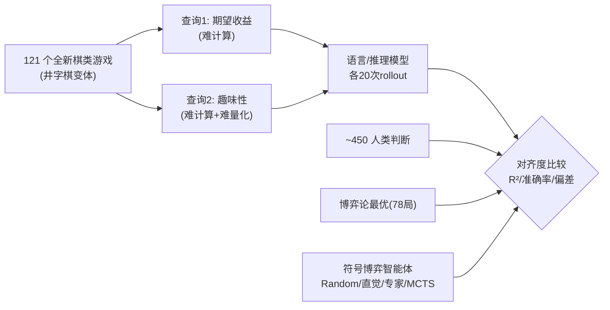

# Evaluating Language Models' Evaluations of Games

**会议**: ICLR 2026  
**OpenReview**: [https://openreview.net/forum?id=kefUcn22mk](https://openreview.net/forum?id=kefUcn22mk)  
**代码**: 待确认  
**领域**: LLM 评测 / 计算认知科学  
**关键词**: 元推理, 游戏评估, 人类对齐, 推理模型, 资源理性  

## 一句话总结
本文提出一个全新评测范式——不再考核 AI「会不会玩游戏」，而是考核它「会不会评判一个游戏值不值得玩」，用 121 个全新棋类游戏 + 450 多份人类判断，系统比较语言/推理模型在「估算收益(公平性)」和「评估趣味性」两类查询上与人类、博弈论最优解、符号化博弈智能体的对齐程度。

## 研究背景与动机
- **领域现状**: 从国际象棋、围棋到扑克、ARC-AGI、宝可梦，AI 推理能力长期通过「解决问题(玩游戏)」来衡量，社区不断发明新游戏来测试 AI 推理的灵活性。
- **现有痛点**: 推理不仅是「解题」，更包含「评判问题本身是否值得解」这一更高阶能力——人类会在动手前评估一个任务/目标是否值得投入有限的时间精力，而现有评测几乎完全忽略了 AI 的这种「问题评估(problem evaluation)」能力。
- **核心矛盾**: 评判一个游戏本质上比评判一个玩家更「模糊」——玩家有胜负/收益可作客观标尺，而「这个游戏好不好」往往没有客观答案；不同评估查询在「难以计算」和「难以量化」两个维度上差异巨大，需要不同的人类数据与对比基准。
- **本文目标**: 建立一套评估「AI 对游戏的评估」的形式化框架，并实证考察现代语言/推理模型能否产出与人类对齐(或与博弈论最优对齐)的游戏评估。
- **核心 idea**: **【从评估解到评估评估】** 把评测对象从「策略 π(选什么动作)」上移到「整局游戏的属性 ψ(收益、趣味性)」，并沿两个正交维度——**难以计算(hard to compute)** 与 **难以量化(hard to quantify)**——挑选评估查询，从而把「评测 AI 的评判力」这件事本身变得可度量。

## 方法详解

### 整体框架
作者先在形式上把游戏 $G$ 表示为状态 $S$、动作 $A$、规则 $T$、目标函数(状态→奖励 $R$)的四元组；传统问题求解评测的是策略 $\pi_G(a_t\mid s_t)$ 在最终收益 $R_T$ 上的好坏。本文把评测对象上移为对整局游戏某属性 $\psi(G)$ 的估计(如「是否公平」「是否有趣」),并允许把大查询拆成子查询 $\{\psi_1,\dots,\psi_f\}$ 再聚合。实证侧选两类查询:**期望收益(payoff/公平性)** 属「难计算」,**趣味性(funness)** 属「既难计算又难量化」;让一批语言/推理模型对 121 个全新井字棋变体各做 20 次 rollout 评估,再分别与 ~450 人的判断、78 局可算的博弈论最优(GTO)、以及一组显式模拟对弈的符号智能体对比。

### 关键设计

**1. 二维评估查询空间:用「难计算 × 难量化」筛出有价值的评估题。** 并非所有对游戏的评判都值得拿来测模型——判断一个游戏是合作还是竞争往往既不耗算力也无歧义,信息量低。作者据此提出两条正交维度:**难以计算**(如估算任意游戏的期望收益,需要对可能棋局状态做精确复杂的推演)与**难以量化**(如「有多好玩」,连用什么标准来打分都没有共识)。期望收益落在「难计算」区,趣味性落在两者兼具的右上角区。这一维度划分不仅指导选题,还预测了该收集什么样的人类数据——越难量化的查询,人类判断本身越发散,因此更需要拿分布(而非单点均值)来比对。

**2. 多层次对比基准:人类、博弈论最优、与四档符号博弈智能体。** 评估「AI 的评估」绕不开「拿谁当标尺」的问题。作者同时设两类参照:一端是**人类**(为「思想伙伴」式协作服务,追求人类对齐),另一端是**博弈论最优 GTO**(追求绝对理性,78/121 局可估)。中间再引入 Collins et al. (2025) 的一组显式模拟对弈智能体作梯度参照——从随机动作、近似新手的「直觉玩家(Intuitive Gamer)」、近似深度-5 树搜索的「专家(Expert)」,到基于 MCTS 的方法。如此既能判断模型在「理性轴」上走多远,也能看它在「人类轴」上贴多近,还能借和哪档符号智能体最像来反推模型内部是否在做显式模拟。

**3. 分布级相似度度量 + 推理 token 资源审计。** 主度量是模型平均判断与人类判断在 121 局上的 $R^2$,并用人类参与者判断的**劈半相关(split-half correlation)** 估出「可解释方差上限」($R^2=0.82$),作为模型能贴近人类的天花板;对 78 局还额外算对 GTO 的 $R^2$、准确率(预测落在 GTO 的 0.5 之内)和平均绝对偏差。除了「准不准」,作者还把**推理 token 数**当成一种「资源花费」来审计——同一查询在不同游戏、不同模型、不同查询类型(收益 vs 趣味)间花多少 token,用来诊断模型是否「资源理性」地按问题难度动态分配算力。

**4. 推理轨迹编码:窥探模型是否真在「模拟对弈」。** 对能拿到推理链的开源模型(如 DeepSeek-R1)和带 CoT 的模型,作者用 o3 自动给推理轨迹打标签,统计它们在评估趣味性时提到了哪些因子(平衡性、挑战性、时长、策略丰富度、新颖性,见表 2),以及在评估收益时有多大比例真的在「显式模拟走子」而非靠类比或直接套数学公式。这把「模型为什么给出这个评分」从黑箱里抠出来,揭示出显式模拟其实只占推理方式的一小部分。

## 实验关键数据

### 主实验表格(模型/人类相对博弈论最优 GTO,78 局)

| Reasoner | R² | Accuracy | Deviation |
|---|---|---|---|
| Human | 0.62 | 0.69 | 0.32 |
| Intuitive Gamer | 0.69 | 0.75 | 0.25 |
| Expert Gamer | 0.87 | 0.92 | 0.08 |
| MCTS | 0.89 | 0.91 | 0.06 |
| Random | 0.39 | 0.57 | 0.43 |
| GPT-4 (Direct) | 0.31 | 0.60 | 0.42 |
| DeepSeek v3 (CoT) | 0.40 | 0.63 | 0.38 |
| DeepSeek R1 | 0.43 | 0.64 | 0.40 |
| Gemini 2.5 Pro | 0.66 | 0.84 | 0.22 |
| o1 | 0.50 | 0.72 | 0.35 |
| o3 | 0.71 | 0.83 | 0.27 |
| GPT-5 | 0.82 | 0.88 | 0.15 |

> R² 越高越接近 GTO;非推理模型直接作答时离 GTO 最远,CoT 与推理能逐步逼近,GPT-5 最接近博弈论最优。

### 消融实验表格(评估趣味性时推理轨迹提及各因子的比例,表 2)

| Model | 平衡性 | 挑战性 | 时长 | 策略丰富度 | 新颖性 |
|---|---|---|---|---|---|
| LLaMA 3.1 70B (CoT) | 47.5% | 97.1% | 53.0% | 99.5% | 56.8% |
| GPT-4 (CoT) | 55.6% | 98.6% | 67.9% | 98.6% | 54.5% |
| DeepSeek v3 (CoT) | 71.7% | 95.7% | 70.9% | 98.1% | 65.4% |
| DeepSeek R1 | 85.7% | 99.7% | 90.8% | 99.3% | 62.3% |
| Gemini 2.5 Flash | 74.6% | 99.9% | 76.5% | 100.0% | 48.3% |
| Gemini 2.5 Pro | 86.2% | 100.0% | 77.5% | 100.0% | 73.8% |

> 各模型几乎都关注「挑战性」与「策略丰富度」,但在「平衡性」「时长」上分歧明显——这种因子选择与聚合方式的差异,正是趣味性评分发散的来源。

### 关键发现
- **推理 > 非推理**: 推理模型整体比非推理语言模型更贴近人类的游戏评估;非推理模型直接作答时,跨家族(GPT-4/DeepSeek-v3)的收益评估高度雷同却都远离人类,说明它们只是从训练数据里学到了相似的「公平」归纳偏置,不足以复现人类判断。
- **非单调对齐**: 在 OpenAI 家族出现「先升后降」——GPT-4→o1→o3 对人类和对 GTO 的拟合同步变好,但 o3→GPT-5 时,**对 GTO 继续逼近,对人类反而下降**;越接近博弈论最优,越偏离「半理性」的人类。
- **趣味性更「锯齿」**: 评估趣味性的跨模型表现更不稳定(更先进的模型未必更像人),印证了「难量化」查询的本质困难。
- **资源使用混乱**: 推理 token 用量在不同模型/游戏/查询间高度不可预测——更「新颖」(离井字棋更远)的游戏并未消耗更多 token,token 量也与「离 GTO/人类多远」无明显关系;且尽管趣味性更模糊,模型反而用更少 token 去评估它。

## 亮点与洞察
- **评测范式的升维**: 把「评测 AI」从「解题能力」上移到「选题/评判能力」,呼应了认知科学里的元推理与资源理性传统,给「AGI 评测」开了一个被长期忽视的新维度。
- **「越理性越不像人」的清晰证据**: 非单调关系把「对齐人类」与「逼近最优」这两个常被混为一谈的目标明确解耦——它们在足够强的模型上会互相拉扯,对「该让模型对齐谁」提出真问题。
- **分布而非均值**: 强调用人类判断的整个分布(含双峰)作标尺,并以劈半相关给出可解释方差上限,方法论上更诚实。
- **资源理性的呼吁**: 推理 token 的混乱用量直接指向「让模型按问题难度动态分配算力的元推理」这一可落地的未来方向。

## 局限与展望
- **游戏域狭窄**: 仅限 121 个二人竞争、网格上的井字棋变体,虽策略丰富但远非真实世界决策问题的全貌,结论能否外推到更复杂/非对称/多人游戏存疑。
- **闭源模型不可窥**: 多数 SOTA 闭源模型不暴露推理轨迹,「模型是否在显式模拟对弈」只能在 DeepSeek-R1 等开源模型上间接验证。
- **趣味性无客观真值**: funness 故意让人和模型自定义,导致缺乏客观标尺,只能靠人类分布对比,结论解释空间较大。
- **展望**: 设计能按评估查询和问题难度动态调配算力的「资源理性的问题评估智能体」;扩展到更广的游戏与现实任务;深入刻画不同评估策略如何塑造判断分布。

## 相关工作与启发
- **认知科学的元推理 / 资源理性**: 直接接续 Griffiths、Lieder 等关于「先决定解哪个问题」的资源理性分析传统(问题表征、分解、策略选择、是否继续/放弃任务)。
- **语言模型推理评测**: 既有工作几乎都聚焦「解题」(数学/符号、代码、心理学、多模态、规划机器人、语言现象、玩游戏),本文反其道把焦点放在「评判」,补上一块空白。
- **启发**: 「评判力」可作为一类独立、可形式化的能力被系统评测;「对齐人类 vs 逼近最优」的张力提示协作型 AI(思想伙伴)的设计需在两者间显式取舍;推理 token 审计为「自适应算力分配」提供了可观测抓手。

## 评分
- 新颖性: ⭐⭐⭐⭐⭐ 把评测对象从「解题」升维到「评判问题是否值得解」,是一个被长期忽视且形式化清晰的新范式。
- 实验充分度: ⭐⭐⭐⭐ 121 游戏 × 450+ 人类 × 多家族模型 × 双查询 × 多基准(人类/GTO/符号智能体)+ 推理轨迹与 token 审计,覆盖面扎实;扣分在游戏域较窄、闭源模型轨迹不可见。
- 写作质量: ⭐⭐⭐⭐ 框架(难计算×难量化)清晰,图表与论证连贯;部分形式化与附录依赖较重。
- 价值: ⭐⭐⭐⭐⭐ 提出可复用的「评估 AI 评估」方法论,并给出「越理性越不像人」「资源使用不理性」等对评测与对齐都有指导意义的发现。

<!-- RELATED:START -->

## 相关论文

- [\[ICLR 2026\] RefineBench: Evaluating Refinement Capability of Language Models via Checklists](refinebench_evaluating_refinement_capability_of_language_models_via_checklists.md)
- [\[ICLR 2026\] Towards Personalized Deep Research: Benchmarks and Evaluations](towards_personalized_deep_research_benchmarks_and_evaluations.md)
- [\[ICLR 2026\] LMGame-Bench: How Good are LLMs at Playing Games?](lmgame-bench_how_good_are_llms_at_playing_games.md)
- [\[ICLR 2026\] CMPhysBench: A Benchmark for Evaluating Large Language Models in Condensed Matter Physics](cmphysbench_a_benchmark_for_evaluating_large_language_models_in_condensed_matter.md)
- [\[NeurIPS 2025\] Can Large Language Models Master Complex Card Games?](../../NeurIPS2025/llm_evaluation/can_large_language_models_master_complex_card_games.md)

<!-- RELATED:END -->
