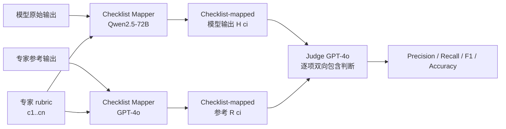

# ExpertLongBench: Benchmarking Language Models on Expert-Level Long-Form Generation Tasks with Structured Checklists

**会议**: ICLR 2026  
**OpenReview**: [https://openreview.net/forum?id=nJvgBolRcR](https://openreview.net/forum?id=nJvgBolRcR)  
**代码/Leaderboard**: [https://huggingface.co/spaces/launch/ExpertLongBench](https://huggingface.co/spaces/launch/ExpertLongBench)  
**领域**: LLM 评测 / Benchmark / 长文本生成  
**关键词**: expert-level evaluation, long-form generation, checklist-based evaluation, rubric, LLM-as-a-judge  

## 一句话总结
提出 EXPERTLONGBENCH（9 个领域 11 个专家级长文本生成任务）与 CLEAR 评测框架——用专家设计的 rubric 把模型输出和参考答案都拆成可逐项核对的 checklist，发现即便最强的 Gemini-2.5-Pro 平均 F1 也仅 33.4，专家级长文本生成对当前 LLM 仍是巨大鸿沟。

## 研究背景与动机
- **领域现状**：现有专家级 benchmark（MMLU、GPQA）为了好评测，把任务收窄成选择题或短答案；ExpertQA 虽然涉及专家领域却仍是答案约 100 词的 QA，而非端到端的真实专家工作流。
- **现有痛点**：真实专家任务（写法律案情摘要、起草临床病历、生成 ESG 报告）往往需要读超长输入（可达 20 万 token）、产出超长输出（可超 5000 token），且必须严格遵守领域规范，但现有评测既缺合适的长文本任务，也缺针对每个任务的细粒度评测方法。
- **核心矛盾**：长文本开放式生成的评测要么用"有用性""相关性"这类主观高层标准（LLM-as-a-judge 不稳），要么用原子事实分解（fact granularity 缺任务特异性导致评测不一致）；更关键的是专家任务普遍**缺参考答案**，导致评测无依据、无法估计 recall。
- **本文目标**：建立一个贴近真实专家工作流、需要长输入长输出、且自带专家参考答案与可核对 rubric 的 benchmark，并配一套可复现、低成本、与专家判断对齐的评测框架。
- **核心 idea**：**用"专家设计的 rubric → 可逐项核对的 checklist"做 grounded 评测**——把模型输出和人工参考都按 rubric 项抽取成结构化 checklist，再逐项做双向语义包含比较，得到 precision/recall/F1，而非让 judge 凭整体印象打分。

## 方法详解

### 整体框架
工作由两块拼成：(1) **EXPERTLONGBENCH** 数据集——9 个领域 11 个任务、1050 个样本，每个样本含任务输入、专家撰写参考、以及由领域专家设计/验证的 checklist-mapped 参考；(2) **CLEAR** 评测框架——给定模型输出，先用 checklist mapper 按 rubric 抽出 checklist 项，再用 judge 把模型 checklist 和参考 checklist 逐项双向比对，最后聚合成样本级 / 任务级分数。

### 关键设计

**1. 专家级长文本任务集：用真实工作流而非考题定义"专家能力"**。EXPERTLONGBENCH 覆盖法律（多文档案情摘要 T1、事实陈述生成 T2）、材料（合成解释 T3）、教育（教学对齐评估 T4、反馈生成 T5）、医疗（临床病历 T6、诊断推理 T9）、化学（分子描述 T7）、生物（蛋白质描述 T8）、金融（ESG 报告 T10）、网络安全（风险描述 T11）共 9 领域 11 任务。任务入选要满足三条：能写出明确 rubric、求解与评测都需要领域专业知识、且根植于真实专家流程。规模上最长输入超 20 万 token（T2 平均 18.7 万）、最长参考超 5000 token（T2 平均 5155），远超既有数据集——例如一个复杂法律案件，资深律师要读几十到上百份卷宗、花 10 小时以上才能完成摘要。其中 6 个任务为新采集数据，5 个改编自既有数据，并设有公开/私有双子集以抵御数据污染。

**2. 专家设计的 rubric 与 checklist-mapped 参考：把"什么算对"显式化**。每个任务由领域专家协同设计一套适用于该任务所有样本的 checklist 式 rubric（如 T1 法律摘要要求准确指出诉因、相关法条/宪法依据、寻求的救济），rubric 设计本身极耗时（T1 的 rubric 花了专家 10 小时以上）。有了 rubric，对每个样本用 GPT-4o 以"角色扮演"提示从人工参考里尽可能完整地抽取每个 checklist 项 $c_i$ 对应的内容，没有则返回 "N/A"，构成 checklist-mapped 参考 $\{R(c_i)\}_{i=1}^n$。这套抽取经人工与 LLM 双重验证，在 T1、T6 上 faithfulness 和 coverage 均超 90%，保证了"参考侧"checklist 的高质量。

**3. CLEAR 评测：双向语义包含的逐项核对**。给定模型输出，同样按 §3 流程抽取 checklist 项 $\{H(c_i)\}$，但为节省成本改用开源的 Qwen2.5-72B 当 mapper（在 T1/T6/T7/T8 上 mapper 平均 F1 达 90.1，验证其够准）。评测时用 GPT-4o 当 judge，对每个 checklist 项做**双向二值判断**：① 参考 $R(c_i)$ 的语义是否被模型 $H(c_i)$ 包含，② $H(c_i)$ 是否被 $R(c_i)$ 包含。据此定义 checklist precision（模型项被参考包含的比例）、recall（参考项被模型包含的比例）、accuracy（双向互含的比例）：

$$\text{Precision}=\frac{\#\{c_i: R(c_i)\subseteq H(c_i)\}}{n},\quad \text{Recall}=\frac{\#\{c_i: H(c_i)\subseteq R(c_i)\}}{n},\quad F_1=\frac{2PR}{P+R}$$

样本级指标按 checklist 项平均，任务级再按样本平均。这种"先映射成结构化项、再逐项 grounded 比较"的设计，把开放式长文本评测变成有参考依据、能估 recall 的客观核对。

**4. 评测组件的成本-可复现性论证**。论文系统验证了"为什么这套配置可信且便宜"：mapper 上 Qwen2.5-72B 优于 Llama-3.3-70B / Mistral-Large；judge 上 GPT-4o 与 Gemini-2.0-Flash 标注的 Cohen's Kappa 在 0.81–0.89（近乎完美一致），且 Qwen2.5-72B 与 GPT-4o 打分的 Pearson 相关达 0.88——意味着整条 pipeline 可由开源模型驱动以降本增效；与领域专家比对，GPT-4o 的 rubric 判断在 T7/T8 上与专家一致率达 91.3%–92%。

## 实验关键数据

### 主实验（15 个 LLM 在 EXPERTLONGBENCH 上的平均 F1，0–100）

| 模型 | T1 | T2 | T5 | T6 | Avg |
|---|---|---|---|---|---|
| Gemini-2.5-Pro | 25.4 | 10.0 | 47.9 | 44.0 | **33.4** |
| GPT-5 | 27.2 | 10.3 | 56.5 | 54.7 | 31.0 |
| o3 | 25.3 | 8.1 | 43.5 | 52.5 | 29.3 |
| Qwen3-32B | 17.7 | 3.6 | 33.0 | 47.6 | 28.1 |
| GPT-4o | 13.2 | 6.2 | 29.9 | 25.3 | 26.5 |
| Claude-3.7-Sonnet | 11.5 | 0.9 | 35.0 | 26.1 | 23.2 |
| Claude-3.5-Haiku | 2.8 | 1.1 | 9.7 | 10.9 | 19.3（最低） |

- 最强模型 Gemini-2.5-Pro 平均 F1 仅 **33.4**；T2（法律事实陈述生成）最难，所有模型 F1 均 < 11。

### 关键分析（消融/诊断）

| 现象 | 结论 |
|---|---|
| 模型规模 scaling | 同家族大模型平均更好，但**非所有任务一致**（如 T10 上 Mistral-Nemo 反超 Mistral-Large）|
| Test-time scaling（o3/Qwen3/Gemini-2.5-Pro 推理模型）| **不能实质提升**领域专家级推理，与专家差距依旧大 |
| 闭源 vs 开源 | 闭源**不总是更优**，Claude 在专家工作流上偏弱 |
| Checklist 覆盖率 vs F1 | **负相关**：高覆盖伴随低正确率——内容"看似合规"实则错误 |
| RAG agent（T1/T2）| 反而**不如**全文直读，说明全局上下文对专家任务至关重要 |

### 关键发现
- 模型能生成匹配 **67%+** 所需 aspect 的内容，却远谈不上正确——存在"看似专家对齐实则误导"的风险。
- CLEAR 可全程由开源模型驱动：Qwen2.5-72B 与 GPT-4o 评分相关达 0.88，judge 间一致 Kappa 0.81–0.89。

## 亮点与洞察
- **把"评测对齐专家"落到可操作的 checklist**：rubric→双向包含逐项核对，既 grounded（有参考）又能估 recall，避开了 LLM-as-a-judge 的主观漂移。
- **揭示"覆盖率高≠质量高"的危险信号**：模型擅长堆出"看起来齐全"的内容，却大量出错，对真实专家场景部署是重要警示。
- **可复现 + 低成本**：证明整条评测流水线能用开源模型跑出与 GPT-4o 高度一致的结果，降低社区复现门槛。
- **公开/私有双子集 + 持续维护承诺**：兼顾透明与抗污染，benchmark 有较长生命周期。

## 局限与展望
- **依赖 LLM 做 mapper 和 judge**：checklist 抽取与判断本身仍由 LLM 完成，虽验证一致性高，但在 rubric 项更多、语义更微妙的任务上误差可能放大。
- **rubric 撰写极其昂贵**：高质量 rubric 需专家数小时到十余小时，难以快速扩展；论文也指出"自动生成高质量 checklist"仍是开放问题。
- **二值包含判断粒度有限**：把每项简化为 0/1 互含，可能损失部分细微正确性/部分覆盖的信息。
- **覆盖领域仍有限**：9 领域 11 任务虽多样，但远未覆盖全部专业场景，私有子集也限制了完全开放复现。

## 相关工作与启发
- 对比 MMLU/GPQA（选择题）、ExpertQA（短答案 QA）、DOLOMITES/ResearchQA（仅方法写作或研究问答），本文补上了"端到端专家工作流 + 长输入长输出 + 参考 grounded"的空白。
- 评测方法上承接 fact decomposition（FActScore 类）与 checklist 评测（WildBench、BiGGenBench、TICK、CheckEval、RocketEval、LLM-Rubric、HealthBench），但用专家 rubric + 参考 grounding 解决了它们"不够领域特异"或"无参考依据"的问题。
- 启发：长文本生成评测应优先"结构化、可核对、有参考"，而非整体打分；"高覆盖低正确"现象提示后续工作应关注事实正确性与领域知识 grounding，而不仅是内容完整度。

## 评分
- **新颖性**: ⭐⭐⭐⭐ 把专家 rubric 转成可逐项 grounded 核对的 checklist 评测，并系统覆盖 9 领域真实长文本工作流，思路与数据都有明显增量。
- **实验充分度**: ⭐⭐⭐⭐⭐ 15 个前沿模型 × 11 任务全面评测，外加 mapper/judge 选择、scaling、test-time scaling、RAG、覆盖率-质量相关性、人机一致性等多维诊断，论证扎实。
- **写作质量**: ⭐⭐⭐⭐ 动机—构造—评测—发现脉络清晰，图 1 pipeline 与表 1/表 2 信息密度高。
- **价值**: ⭐⭐⭐⭐⭐ 提供了一个高难度、抗污染、可复现的专家级长文本 benchmark 与配套评测，对推动 LLM 走向真实专业应用有长期参考价值。

<!-- RELATED:START -->

## 相关论文

- [\[ICLR 2026\] LFQA-E: Carefully Benchmarking Long-form QA Evaluation](lfqa-e_carefully_benchmarking_long-form_qa_evaluation.md)
- [\[ICLR 2026\] FinSearchComp: Towards a Realistic, Expert-Level Evaluation of Financial Search and Reasoning](finsearchcomp_towards_a_realistic_expert-level_evaluation_of_financial_search_an.md)
- [\[ICLR 2026\] RefineBench: Evaluating Refinement Capability of Language Models via Checklists](refinebench_evaluating_refinement_capability_of_language_models_via_checklists.md)
- [\[ACL 2026\] Illusions of the Gold Standard: A Large-scale Analysis of Human Evaluation Protocols for Long-form Text Generation](../../ACL2026/llm_evaluation/illusions_of_the_gold_standard_a_large-scale_analysis_of_human_evaluation_protoc.md)
- [\[ACL 2025\] Atomic Calibration of LLMs in Long-Form Generations](../../ACL2025/llm_evaluation/atomic_calibration_of_llms_in_long-form_generations.md)

<!-- RELATED:END -->
