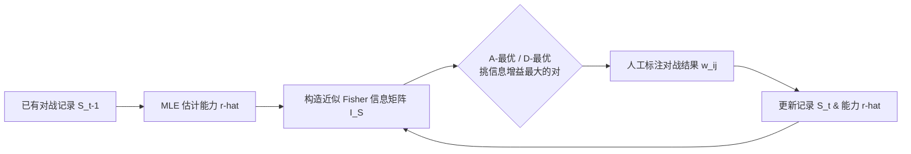

# Fewer Battles, More Gain: An Information-Efficient Framework for Arena-based LLM Evaluation

**会议**: ICLR 2026  
**OpenReview**: [https://openreview.net/forum?id=XUVqFRp9oi](https://openreview.net/forum?id=XUVqFRp9oi)  
**代码**: [https://github.com/Liuz-rui/Adaptive-Arena](https://github.com/Liuz-rui/Adaptive-Arena)  
**领域**: LLM 评测 / Arena 评测  
**关键词**: Arena 评测, ELO 评分, Fisher 信息, 主动采样, A/D-最优实验设计, 标注效率  

## 一句话总结
把 Arena 里"该让哪两个模型对战"建模成一个最优实验设计问题——用 Fisher 信息矩阵的 A-最优/D-最优准则主动挑选信息增益最大的对战，让同样数量的人工标注换来更可靠的排名，从而"少打架、多收益"。

## 研究背景与动机
- **领域现状**：Arena 评测（如 Chatbot Arena）通过模型两两对战 + 人工标注偏好，再用 ELO/Bradley-Terry 估出排名，因为贴近真实人类偏好已成为评测 LLM 的主流方法之一，平台上常驻 190+ 个模型。
- **现有痛点**：现有 Arena 系统几乎全靠**穷举或随机**地选对战对，产生大量冗余对局——Chatbot Arena 要靠上万次对战才能得到可靠排名。模型迭代越来越快、新模型不断涌入，这种"无脑配对"既烧人力标注又拖慢评测周期，可扩展性差。
- **核心矛盾**：传统"减少评测样本"的高效评测方法（TinyBenchmarks、MetaBench 等）都是为**静态 QA**设计的——挑信息密集的题目即可；但 Arena 是**动态成对对战**、排名靠**迭代式人工判断**，没有固定标准答案，这些静态方法的假设全部失效，无法直接搬过来。而所有 Arena 侧的工作（ELO 变体、UDA 等）又只盯着提升排名精度，**集体忽略了标注效率**这件事。
- **本文目标**：在不牺牲排名可靠性的前提下，用尽量少的对战标注达到与"跑满全量对战"相同的评测质量。
- **核心 idea**：**用统计不确定性来指导配对**。作者注意到稀疏条件下 ELO 能力估计具有渐近正态性，其方差由 Fisher 信息矩阵的逆刻画，于是把"选对战对"转化为经典最优实验设计问题——**每一步都选能让 Fisher 信息增长最快（方差下降最多）的那一对模型**。

## 方法详解

### 整体框架
方法（Adaptive Arena）在标准 ELO/Bradley-Terry 评测之上加了一个**主动配对选择器**：先用 MLE 从已有对战记录估出当前能力 $\hat{r}_{t-1}$，据此构造近似 Fisher 信息矩阵，再用 A-最优或 D-最优准则在所有候选模型对中挑出"信息增益最大"的一对去标注，标完更新能力、循环往复。整个流程是一个"估计能力 → 算信息 → 挑对战 → 拿标注 → 再估计"的闭环。

### 关键设计

**1. 把效率问题落到 Fisher 信息上：稀疏 Arena 的渐近正态性。** 作者先用 Bradley-Terry 模型给出胜率 $P_{ij}=\frac{1}{1+e^{-C(r_i-r_j)}}$，并用 MLE 最小化负对数似然 $L_S(r)=-\sum_{(i,j,w_{ij})\in S}[w_{ij}\ln P_{ij}+w_{ji}\ln P_{ji}]$ 来估能力。关键洞察在于：把 Arena 看作 Erdős–Rényi 随机图 $G(N,q_N)$，只要边概率满足 $q_N=\omega(\frac{\log N}{N})$，ELO 估计就**唯一**且**渐近正态**：$\sqrt{|S|}(\hat r_n-r^*_n)\xrightarrow{d}\mathcal N(0,I_S(r^*)^{-1})$。这意味着估计方差由 Fisher 信息矩阵的逆决定，于是"提升效率"就等价于"**尽快缩小 $I_S(r^*)^{-1}$**"——一个清晰可优化的统计目标。其中信息矩阵由 Hessian 给出：$I_S(r)=C^2\sum_{(i,j)\in S}P_{ij}P_{ji}(e_i-e_j)(e_i-e_j)^\top$，每次对战相当于往这个矩阵里加一块秩-1 的信息。

**2. A-最优配对：直接压估计方差。** 由于真实能力 $r^*$ 未知，作者用当前估计 $\hat r_{t-1}$ 近似它来算信息矩阵。A-最优准则选的那一对，是能让"逆信息矩阵的迹"（即所有模型估计方差之和）最小的一对：

$$(i_t,j_t)=\arg\min_{1\le i<j\le N}\mathrm{tr}\Big[\big(I_{S_{t-1}}(\hat r_{t-1})+I_{\{(i,j)\}}(\hat r_{t-1})\big)^{-1}\Big].$$

它追求的是**各模型可靠性的均衡**——让方差最大的那些模型优先被"喂"信息。前提是信息矩阵可逆，作者用 Theorem 1 证明只要 $q_N=\omega(\frac{\log N}{N})$，矩阵几乎必然正定（既可逆、行列式又为正），这恰好是 Lemma 1 的最小条件，不需要像 Ada-Pair 那样要求每对都至少打过一次（$q_N=1$）。

**3. D-最优配对：用行列式绕开求逆，更稳更省。** A-最优每步都要算矩阵求逆，复杂度高（$O(N^{\beta+3})$）。D-最优转而**最大化信息矩阵的行列式**，从几何上等价于最小化置信椭球的体积、降低整体不确定性：

$$(i_t,j_t)=\arg\max_{1\le i<j\le N}\big|I_{S_{t-1}}(\hat r_{t-1})+I_{\{(i,j)\}}(\hat r_{t-1})\big|.$$

它省掉了求逆、复杂度降到 $O(N^{\beta+2})$，是论文主推的方法。为防止行列式随样本数指数爆炸，作者由 Theorem 2 给出数值化处理：用归一化几何信息密度 $D(S_t)=|I_{S_t}(r)|^{1/(N-1)}$（其 $(N-1)$ 次方根随样本线性增长）来计算，避免数值溢出。

**4. 工程化：增量更新 + Top-K 并发。** 方法时间复杂度虽高于随机/最近配对，但其核心理念是"**用算力换人工**"——只要能在用户每次请求的限定时间内给出对战对即可。为此做两点优化：(1) 信息矩阵**增量更新**，直接在上一步矩阵上加当前对战的信息块，而非重算；(2) 应对系统并发，每轮请求一次性返回**信息增益最高的 Top-K 对**（实验取 $K=10$）。作者论证：哪怕只把效率提升 50%，在 Arena 持续运转下就相当于用一半标注量达到原来的效果，长期收益巨大。

## 实验关键数据

### 主实验表格
在 Chatbot、PPE 两个真实数据集（含各自的 Simulation 版）+ ELO/m-ELO 两种打分器上，用 Pairwise 一致性指标（与全量 ELO 结果的排序一致率）衡量。结果（五次实验、四个步长平均）：

| 选择策略 | Chatbot | PPE | Real 均 | Simu 均 | Total |
|---|---|---|---|---|---|
| Random（基线） | 0.8797 | 0.8021 | 0.8316 | 0.8439 | 0.8409 |
| Nearest | 0.8825 | 0.7995 | 0.8398 | 0.8407 | 0.8410 |
| Ada-Pair（官方策略） | 0.8835 | 0.8040 | 0.8423 | 0.8496 | 0.8437 |
| A-optim | 0.8880 | 0.8033 | 0.8418 | 0.8506 | 0.8456 |
| **D-optim** | **0.8941** | **0.8122** | **0.8466** | **0.8577** | **0.8531** |

D-optim 在所有场景全面领先，且是**唯一显著超过 Random 基线**的方法。

### 消融实验表格
时间改进版（每轮选 Top-10）对比，验证增量更新 + Top-K 不掉点反涨点：

| 策略（Improved） | Total Pairwise |
|---|---|
| Nearest | 0.8459 |
| Ada-Pair | 0.8421 |
| A-optim | 0.8434 |
| **D-optim** | **0.8581** |

D-optim 的改进版相比原版还**额外涨了约 0.5%**，说明高 D-Info 的对战对确实被优先选中，反向印证了 D-Info 设计的有效性。

### 关键发现
- **信息增益最快**：在 A-Info、D-Info 随样本数的增长曲线中，本文方法斜率最陡（信息积累最快），而 Ada-Pair 的信息增益与 Random 几乎无异。
- **采样分布有讲究**：D-optim 倾向多选**真实能力相近**的对（对角线附近更密）同时保持多样覆盖；Nearest 过度集中在相似模型上、Ada-Pair 则过于均匀。
- **A-最优的"锚点"副作用**：因 ELO 固定了最后一个模型的能力，A-最优会把它当"锚点"反复采样，虽推高 A-Info 但可能引入偏差、影响 Arena 可持续性；D-optim 几乎不受此约束，更适合 Arena。
- **Nearest 在 LLM Arena 水土不服**：Arena 本质是模型各答一题、平局概率高于传统竞技，导致"配相近能力"的策略失效。

## 亮点与洞察
- **视角转换很漂亮**：把工程味十足的"配对调度"问题，干净地翻译成统计学里成熟的**最优实验设计（A/D-optimality）**框架，理论根基扎实（唯一性、渐近正态、正定性、信息增长上界都给了定理）。
- **D-最优是务实之选**：用行列式取代求逆，既降复杂度又稳数值，还规避了 A-最优的锚点偏差——理论与工程权衡得当。
- **即插即用**：作为独立的"配对选择器"可无缝挂到现有 Arena 平台（ELO/m-ELO 皆可），不改打分逻辑，落地门槛低。
- **"算力换人工"的成本观**：明确承认自身计算复杂度更高，但论证在 Arena 长期运转下用算力省下昂贵的人工标注是划算的，定位清晰。

## 局限与展望
- **绝对提升幅度有限**：Total Pairwise 从 Random 的 0.8409 提到 D-optim 的 0.8531，约 1.2 个百分点，"显著"更多体现在统计意义上，单步增益不算大。
- **复杂度随模型数走高**：$O(N^{\beta+2})$ 在数百模型时尚可，面对 Arena 持续膨胀的模型规模，可扩展性仍需进一步验证（附录有更大规模实验但正文着墨少）。
- **依赖估计能力近似真值**：用 $\hat r_{t-1}$ 近似 $r^*$ 来算信息，冷启动早期估计不准时配对质量可能受影响。
- **Ground Truth 是"全量 ELO"**：评测以全量 ELO 结果为真值，本质衡量的是"用子集逼近全集"的能力，而非与人类真实偏好的绝对一致性。
- **A-最优的偏差未根治**：作者提出"轮流固定每个模型再平均"的改进思路但因复杂度未实现，留作未来工作。

## 相关工作与启发
- **Arena 评测**：从 Chatbot Arena、Bradley-Terry/ELO 到 UDA 等偏差缓解方法，前人都在提升排名精度，本文是第一个把"标注效率"作为一等问题提出的。
- **高效评测**：TinyBenchmarks、MetaBench、多轮 prompt 选择等都在"减少评测样本"，但局限于静态 QA；本文指出动态成对对战 + 迭代人判使这些方法失效，并补上了 Arena 侧的空白。
- **启发**：任何"主动收集昂贵标注"的场景（主动学习、偏好数据采集、RLHF 配对采样）都可借鉴这套"以 Fisher 信息/最优实验设计指导采样"的思路——先把估计量的方差结构写清楚，再让采样去最快地压方差。

## 评分
- **新颖性**: ⭐⭐⭐⭐ 首次把标注效率作为 Arena 评测的核心问题，并用 A/D-最优实验设计给出有理论保证的解法，视角转换干净有新意。
- **实验充分度**: ⭐⭐⭐⭐ 覆盖两个真实数据集 + 仿真、两种打分器、多种基线策略，且有信息增益曲线、采样热图、时间成本等多角度分析；但绝对提升幅度有限、超大规模验证主要放在附录。
- **写作质量**: ⭐⭐⭐⭐ 标题点题、动机递进清晰、定理与方法衔接自然，公式与直觉示例（三模型 toy example）搭配得当。
- **价值**: ⭐⭐⭐⭐ 即插即用、能直接挂到现有 Arena 平台省人工标注，对 LLM 评测基础设施有实际工程价值。

<!-- RELATED:START -->

## 相关论文

- [\[ICLR 2026\] LLM-as-a-Prophet: Understanding Predictive Intelligence with Prophet Arena](llm-as-a-prophet_understanding_predictive_intelligence_with_prophet_arena.md)
- [\[ICLR 2026\] DISCO: Diversifying Sample Condensation for Efficient Model Evaluation](disco_diversifying_sample_condensation_for_efficient_model_evaluation.md)
- [\[ICLR 2026\] Computer Agent Arena: Toward Human-Centric Evaluation and Analysis of Computer-Use Agents](computer_agent_arena_toward_human-centric_evaluation_and_analysis_of_computer-us.md)
- [\[ICLR 2026\] SparseEval: Efficient Evaluation of Large Language Models by Sparse Optimization](sparseeval_efficient_evaluation_of_large_language_models_by_sparse_optimization.md)
- [\[ICLR 2026\] Do LLM Agents Know How to Ground, Recover, and Assess? Evaluating Epistemic Competence in Information-Seeking Agents](do_llm_agents_know_how_to_ground_recover_and_assess_evaluating_epistemic_compete.md)

<!-- RELATED:END -->
