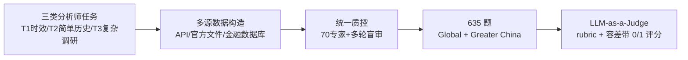

# FinSearchComp: Towards a Realistic, Expert-Level Evaluation of Financial Search and Reasoning

**会议**: ICLR 2026  
**OpenReview**: [https://openreview.net/forum?id=8AJbbbe2ni](https://openreview.net/forum?id=8AJbbbe2ni)  
**代码**: GitHub / HuggingFace 开源（论文中提供）  
**领域**: LLM 评测 / 金融搜索智能体 Benchmark  
**关键词**: 金融搜索, 智能体评测, 时效性数据, 端到端 Agent, LLM-as-a-Judge  

## 一句话总结
FinSearchComp 是首个全开源、端到端的开放域金融搜索与推理智能体 benchmark，由 70 名金融专家标注 635 道横跨全球与大中华市场的三类分析师任务，评测 21 个模型后发现最强的 Grok 4（web）也仍落后人类专家 6.1 个百分点。

## 研究背景与动机
**领域现状**：搜索已成为 LLM 智能体的核心基础设施，而金融是检验搜索与知识推理能力的理想试验场——分析师每天要在时效性强、专业性高的数据上做多步检索、核验与综合。

**现有痛点**：现有金融 QA benchmark（FinQA、ConvFinQA、FinanceQA、BizFinBench 等）几乎都**预先收集好上下文**，绕过了开放域搜索与工具调用，因此无法衡量智能体真实的检索能力，也偏离分析师的真实工作流。少数提供端到端评测的（如 Finance Agent Benchmark）又局限于自建系统、且只用历史数据——模型可以靠**死记硬背**而非实时检索蒙混过关。

**核心矛盾**：构造"真实、复杂、可靠"的金融搜索任务一方面需要深厚的金融专业知识，另一方面**时效性数据极难评测**（答案随时变化、API 有延迟、不同源有舍入差异），二者使得开放金融搜索数据集长期缺位。

**本文目标**：构建首个全开源、端到端、覆盖时效性数据的开放域金融搜索 benchmark，真实复现分析师工作流并提供可复现的评测框架。

**核心 idea**：**任务设计对齐真实分析师工作流** + **重度专家标注 + 多阶段质控** + **rubric 引导的 LLM-as-a-Judge 容差评测**，三者结合让 benchmark 既贴近现实又可靠可复现。

## 方法详解

### 整体框架
FinSearchComp 围绕"三类任务 → 多源数据构造 → 统一质控 → 容差评测"展开。三类任务从易到难分别对应分析师的实时数据获取、定点历史查询、跨期复杂调研；每类任务用不同的数据构造管线但共享同一套质控流程；最终用 rubric 引导的 LLM 裁判在容差带内打 0/1 分。

### 关键设计

**1. 三层任务族：把分析师工作流拆成递增难度的检索-推理梯度**。FinSearchComp 定义三类任务，对应分析师的核心日常。**T1 时效性数据获取**（如 IBM 最新收盘价）检索深度为 1、时间跨度 1 天，考验在严格时间约束下快速检索与核验的能力，难点在新鲜度、日历对齐、股票代码别名与冲突消解。**T2 简单历史查询**（如星巴克 2020-09-27 总资产 $29374.5M）是定点事实查询，难点在财报口径（FY/TTM/季报）、数据重述与单位/币种一致性。**T3 复杂历史调研**（如 2010-2025 间标普 500 单月最大涨幅 = 2020-04，+12.68%）需要 >1 次多跳检索、跨越 184 个月、做单位归一化与公司行为调整。三者构成从 T1 到 T3 单调递增的难度梯度，实验也证实所有模型性能随之单调下降。

**2. 重度专家标注 + 多阶段质控，把"可靠性"做实**。整套数据由 50 人标注组 + 20 人资深仲裁组共 70 名金融专家完成，全部持有高级金融学位且来自 Citadel、摩根大通、中信证券等机构，累计约 240 专家工时。质控有四道防线：可靠数据源选择（官方文件、政府网站、专业数据库）配合多源交叉验证；**消歧策略**主动回避口径不一致的指标（如前复权股价）、显式声明定义标准（静态 PE vs PE TTM）、对易被回溯修订的指标设置数值区间答案；以及**盲审验证**——出题专家写完后由 1-2 名其他专家在不看答案的情况下独立作答，资深专家仲裁分歧，必要时修改或否决。

**3. rubric 引导的 LLM-as-a-Judge 容差评测，攻克时效性数据难评的痛点**。由于答案动态变化且存在合理的小幅波动（修订、舍入），作者采用 LLM 裁判而非单一标准答案。评分用 0-1 误差度量，裁判函数 $J(A, R)$ 在候选答案 $A$ 满足预定义 rubric $R$ 时返回 1 否则 0，最终得分 $S(A, R) = J(A, R)$。针对 T1 的三大时效难题（响应与评测的时间差、API 数据延迟、API 无法查询某一秒的价格），统一在**收盘后**启动评测，并按资产类别（股票、外汇）设置差异化容差带。在约 400 实例/数据集的人工核验上，LLM 裁判与人类标签达成约 95% 一致（T1≈91.5%、T2≈96%、T3≈97-99.8%），印证评测协议的可靠性。

## 实验关键数据

### 主实验表格（T1 时效性任务平均分，节选 Top 模型）

| 模型 | Global Subset | Greater China Subset |
|------|---------------|----------------------|
| Human Performance | 100.0 | 100.0 |
| Grok 4 (web) | 87.3 | 84.7 |
| GPT-5-T (web) | 76.9 | 81.1 |
| DouBao (web) | 59.0 | **88.3** |
| YuanBao-R1 (web) | 56.0 | 82.0 |
| HunYuan-T1 (web) | 53.0 | 84.7 |

整体（Overall）层面：Global 子集 Grok 4（web）以 68.9% 居首，领先亚军 GPT-5-Thinking（web）5.0pp，但仍落后人类专家 6.1pp；Greater China 子集 DouBao（web）领跑，所有模型均落后人类 34pp 以上。

### 消融实验表格（搜索 / 金融插件的增益）

| 配置 | T1 | T2 | T3 |
|------|----|----|----|
| 无搜索 → 有搜索平均增益 | +40.8 | +29.0 | +8.1 |
| DeepSeek-R1：web → YuanBao 金融插件（T1） | +31.9 | — | — |

无搜索时所有模型 T1 得分为 0（无法获取实时数据），T2/T3 靠预训练参数化记忆能拿到非零但很低的分（事实常过时/错位）。

### 关键发现
- **Finding 1**：任务难度从 T1 到 T3 单调递增，所有模型性能随之单调下降，验证 T3 的多跳检索+时序推理+实体消解确实更难。
- **Finding 2**：Grok 4 与 GPT-5-Thinking 在 Global 子集逼近专家水平，且优势随难度增大（T3 峰值），说明其强在多步推理、时序对齐与实体消歧，而非单纯检索。
- **国别效应显著**：模型与工具的"国籍"明显影响表现——中国模型在 Greater China 子集大幅领先，反映训练语料覆盖与检索基础设施的差异。
- **金融插件 > 通用搜索**：直连实时/历史金融数据的专业插件在 T1 上带来 31.9pp 提升。

## 亮点与洞察
- **首个全开源端到端金融搜索 benchmark**，填补了"既测开放域搜索又测知识推理"的空白，且任务直接对齐真实分析师工作流而非人造谜题。
- **专家深度参与**是最大壁垒：70 名一线金融专家、约 240 专家工时、盲审仲裁，这种标注密度让 benchmark 难以被低成本复制或刷分。
- **失败模式分析极具诊断价值**：论文归纳出浅层搜索、陈旧/错时戳证据、跨单位/币种聚合错误、报告日历错位等反复出现的失败模式（如把开盘价误当收盘价、把"市值"这种简单查询过度复杂化为多步），为后续改进给出明确靶点。

## 局限与展望
- **评测窗口固定**（2025-08-01 至 08-20），T1 答案随市场变化，benchmark 的可复现性依赖快照而非实时，长期使用需重新采集时效性答案。
- **依赖 LLM 裁判**：虽有 95% 人工一致性兜底，裁判模型自身的偏差与 rubric 设计仍可能在边界情形引入误差。
- **覆盖范围**：目前聚焦 Global（西方）与 Greater China 两个子集、10 个主题，其他新兴市场、衍生品、另类数据等尚未覆盖。
- 论文主要诊断了失败模式但未提出解决方案，如何让智能体学会"调用专业插件、对齐时间线、消解冲突证据"是留给社区的开放问题。

## 相关工作与启发
- **与通用浏览 benchmark 的区别**：BrowseComp 等只测多步导航找短可验证事实，回避长文综合、歧义消解与领域知识；FinSearchComp 强调多源证据整合与时效性，更贴近知识密集型决策。
- **与金融 QA 的区别**：FinQA/ConvFinQA/MultiFinBen/BizFinBench 等都预置上下文、绕过搜索；FinSearchComp 是端到端开放域，要求真实工具调用。
- **启发**：该工作展示了"领域专家深度参与 + 时效性容差评测"的范式，可迁移到新闻监测、政策追踪、临床试验、气候科学等同样需要时效检索与多源核验的知识工作领域。

## 评分
- **新颖性**: ⭐⭐⭐⭐ 首个全开源端到端、含时效性数据的开放域金融搜索 benchmark，填补真实空白；任务设计与评测协议有明显创新。
- **实验充分度**: ⭐⭐⭐⭐ 评测 21 个模型（web 产品 + API）、含人类基线、搜索/插件消融、跨任务与跨市场分析，并做了 LLM 裁判的人工一致性验证。
- **写作质量**: ⭐⭐⭐⭐ 动机清晰、任务/质控/评测三层结构分明，失败模式分析具体可操作。
- **价值**: ⭐⭐⭐⭐ 全开源数据 + 评测框架，对金融智能体研究有直接落地价值，专家标注壁垒高、难以刷分。

<!-- RELATED:START -->

## 相关论文

- [\[ICLR 2026\] ExpertLongBench: Benchmarking Language Models on Expert-Level Long-Form Generation Tasks with Structured Checklists](expertlongbench_benchmarking_language_models_on_expert-level_long-form_generatio.md)
- [\[ICLR 2026\] DRBench: A Realistic Benchmark for Enterprise Deep Research](drbench_a_realistic_benchmark_for_enterprise_deep_research.md)
- [\[ACL 2026\] K-MetBench: A Multi-Dimensional Benchmark for Fine-Grained Evaluation of Expert Reasoning, Locality, and Multimodality in Meteorology](../../ACL2026/llm_evaluation/k-metbench_a_multi-dimensional_benchmark_for_fine-grained_evaluation_of_expert_r.md)
- [\[ACL 2026\] Aggregate vs. Personalized Judges in Business Idea Evaluation: Evidence from Expert Disagreement](../../ACL2026/llm_evaluation/aggregate_vs_personalized_judges_in_business_idea_evaluation_evidence_from_exper.md)
- [\[ICLR 2026\] PRISM-Physics: Causal DAG-Based Process Evaluation for Physics Reasoning](prism-physics_causal_dag-based_process_evaluation_for_physics_reasoning.md)

<!-- RELATED:END -->
