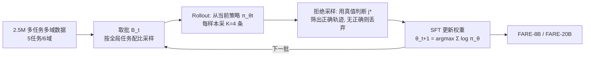

# Foundational Automatic Evaluators: Scaling Multi-Task Generative Evaluator Training for Reasoning-Centric Domains

**会议**: ICLR 2026  
**OpenReview**: [https://openreview.net/forum?id=89Ei7PVpNl](https://openreview.net/forum?id=89Ei7PVpNl)  
**代码**: 待确认  
**领域**: LLM 评估 / 生成式评估器 / 奖励模型  
**关键词**: 自动评估器, LLM-as-Judge, 生成式奖励模型, 多任务训练, 拒绝采样 SFT, 推理验证  

## 一句话总结
本文反其道而行——不追逐 RL 等新方法，而是把"数据规模化"做到极致：精心策划 250 万条覆盖 5 类评估任务、多个推理域的训练样本，用简单稳定的迭代拒绝采样 SFT 训出 FARE 系列评估器（8B 与 20B），其中 8B 挑战更大的 RL 专用评估器，20B 超越 70B+ 开源评估器，并在重排序、RL 验证、领域续训等真实下游场景中显著见效。

## 研究背景与动机
**领域现状**：LLM 已渗透到模型开发全流程的评估环节——既当 benchmark 的裁判，又当偏好优化的生成式奖励模型，还在推理时充当验证器/批评器。不同场景需要不同评估能力：对齐要 pairwise 比较，监控输出要 step-level 找细微错误，RL 训练要在数学之外的"不可验证域"提供奖励信号。同时需要评估的域也在爆炸式扩张（数学→通用推理→agent 的工具调用）。

**现有痛点**：开源自动评估社区没能同时满足"多任务 + 多域"这两个需求，反而扎堆训练**任务专用、数据规模偏小**的评估器。近期工作大多把精力放在方法学创新上（如把 RLVR 套到评估器训练），但 RLVR 计算昂贵、训练管线脆弱，导致这些评估器通常只在单一任务的少量数据上训练。

**核心矛盾**：评估器既要"灵活"（按设定切换评估能力）又要"通用"（跨域不掉点），但主流路线（RL/在线训练）天然难以规模化；而老式的 teacher-model 蒸馏 SFT 又会引入**分布漂移**（教师模型与策略模型分布不一致，且教师选择极大影响下游表现）。

**本文目标**：证明"简单的数据规模化"而非"花哨的方法学"才是训练基础评估器的正道——做出既全面又高性能、且兼顾**效率**（低延迟，适配重排序/RL rollout 验证）的评估器。

**核心 idea**：**[数据驱动]** 把训练数据从近期工作的 2 万~6 万条扩大到 **250 万条**，覆盖 5 类任务、6 大域；**[半在线训练]** 用迭代拒绝采样 SFT（RS-SFT）取代 teacher 蒸馏与 RL——从策略模型自身采样正确评估轨迹来微调，既避开教师分布漂移，又保持轻量稳定的权重更新，从而稳定地扩到百万级数据。

## 方法详解

### 整体框架
FARE 把自动评估器形式化为映射 $\pi_\theta: \mathcal{X} \to \mathcal{Y}$，输入 $x=(p,q,R)$（评估协议 $p$、原问题 $q$、待评响应集 $R$），输出 $y=(c,j)$（自然语言批评 $c$ 与最终判断 $j$）。整条流水线分两段：先做**大规模多任务数据策划**（真实数据 + 合成数据，250 万条），再用**迭代拒绝采样 SFT** 在该数据上把一个后训练 LLM（Qwen3-8B-Base / gpt-oss-20B）逐批滚动训练成评估器。

### 关键设计

**1. 多任务多域数据策划：用"已有 + 合成"补齐评估能力版图。** FARE 把评估拆成 5 类任务——pairwise 比较、step-level 错误定位、reference-based 验证、reference-free 验证、single-rating 打分，覆盖数学/代码/工具调用/对话/通用推理/安全 6 大域。数据来自两路：**已有数据**（1.4M）取自经验证有效的评估器/偏好数据集，并把 RLHF、DPO 偏好对直接转成 pairwise 样本，对有客观答案的域（如数学）把正确/错误响应转成验证样本，每个源数据集手工编写评估 rubric。作者发现已有数据有三处短板（验证任务占比低、pairwise 偏对话轻推理、缺新型挑战性数据），于是补**合成数据**（43.2%）：一是**程序化错误注入**（如在正确函数调用里注入类型错误、多余参数、语法错误，造工具调用的 pairwise/验证样本）；二是**生成后评级（generate-then-grade）**——对带可验证真值 $a$ 的问题 $q$，用 12 个来自 6 个模型家族的生成器各采至多 20 条响应，按正确性分组后构造验证与 pairwise 样本，从而注入多样响应分布与前沿推理难题。最终配比约为 pairwise 33%、step-level 24%、ref-based 验证 18.4%、ref-free 验证 13.1%、single-rating 11.4%。

**2. 迭代拒绝采样 SFT（RS-SFT）：从两种范式各取所长的半在线训练。** 评估器训练数据通常只有真值判断 $j^\star$ 而没有真值批评 $c^\star$，所以过去要么靠 teacher 蒸馏（引入分布漂移）、要么靠 RL（贵且脆）。FARE 改用半在线 RS-SFT：把 $N$ 个样本切成固定大小 $N_{\text{rollout}}$ 的互斥 rollout 批 $B_t$，从已有后训练 LLM 初始化 $\pi_{\theta_0}$，对 $t=0,\dots,T-1$ 反复执行——**rollout**：对 $x_{i,t}$ 从当前策略 $\pi_{\theta_t}$ 采 $K=4$ 条响应（温度 0.9）；**拒绝采样**：用真值 $j^\star_{i,t}$ 判每条对错，有正确响应的输入随机保留一条得 $D_t$，无正确响应的丢弃；**策略更新**：

$$\theta_{t+1}=\arg\max_\theta \sum_{(x,y)\in D_t}\log \pi_\theta(y\mid x)$$

由于评估的答案空间是**封闭离散词表**（pairwise 的 A/B、验证的 yes/no），正确性可直接用真值判定，**无需外部奖励模型**来排序采样——这正是它与 STaR/RAFT 的关键差异（STaR 每轮重初始化且只贪心采一条，RAFT 依赖外部奖励模型）。每个 $B_t$ 按全局任务配比抽未见样本（如全局 33% pairwise，则批内 33% 也是 pairwise），保证任务混合一致。这一"从策略自身采正确轨迹 + 轻量 SFT 更新"的设计，让训练既避开教师分布漂移，又能稳定扩到百万级。

**3. 直接判断数据 + 连续课程：在规模化基础上抠效率与难任务。** 为隔离判断信号并支持低延迟推理，作者把 $D_t$ 中**固定比例**样本转成**直接判断数据**——丢掉生成的批评 $c$、改写协议 $p$ 让模型直接输出判断 $j$，使 FARE 可被提示"省略批评"以加速推理。此外引入**逐批连续课程**：对每个 $(x,y)\in D_t$ 算其 $K=4$ 次 rollout 的通过率，按通过率降序排——4/4 全对的样本先更新、1/4 才对的最后更新。该课程对 pairwise 域影响可忽略，但对 step-level 评估收益明显。基座上，FARE-8B 从 Qwen3-8B-Base 起训（发现 Qwen3-8B 后训版"过训"，故用 Qwen2.5-32B-Instruct 的 SFT 数据冷启动得 Qwen3-8B-ColdStart），FARE-20B 从 gpt-oss-20B（20B 总参、3.6B 激活）起训。

## 实验关键数据

### 主实验表格
覆盖 pairwise、step-level、ref-based 验证三类核心基准（节选）：

| 模型 | JudgeBench | RJB | RM-Bench | When2Call | ProcessBench(Overall) | VerifyBench-Hard |
|---|---|---|---|---|---|---|
| RM-R1-14B | 46.86 | 43.70 | 79.6 | 19.89 | – | – |
| CompassJudger-14B | 50.29 | 37.69 | 77.7 | 44.56 | – | – |
| **FARE-8B** | **55.71** | **51.05** | 79.2 | **80.33** | 63.5 | 78.40 |
| EvalPlanner-70B | 56.60 | – | 82.1 | – | – | – |
| J1-70B | 60.00 | – | 82.7 | – | – | – |
| gpt-oss-120B | 70.29 | 58.26 | 92.0 | 70.00 | 83.5 | 88.30 |
| **FARE-20B** | **64.29** | **57.05** | **90.5** | 76.67 | **84.4** | 85.10 |
| GPT-5 | 84.86 | 79.57 | 93.8 | 75.78 | 84.6 | 90.50 |

- FARE-8B 是最强小评估器：JudgeBench 上比 J1-8B、RM-R1-14B 分别高 13.71、6.57 个绝对点。
- FARE-20B 用 3.5× 更少总参、近 20× 更少激活参数，超越 70B 级 dense 评估器；ProcessBench 上几乎追平 GPT-5（84.4 vs 84.6），且在最难的 OlympiadBench/OmniMATH 上优势最大。

### 消融实验表格

| 消融维度 | 发现 |
|---|---|
| 直接判断数据比例 | 含适量直接判断数据可隔离判断信号，并支持"省批评"加速推理 |
| 连续课程 | 对 pairwise 影响可忽略，对 step-level 评估提升明显 |
| 推理时扩展(SC@32) | 自一致投票带来额外增益，FARE-8B/20B 与基线的性能差随之拉大 |

### 关键发现
- **下游重排序**：作为推理时 reranker，FARE-20B 在 MATH 上达到近 oracle 重排序性能。
- **RL 验证器**：作为通用域 RL 训练的验证器，FARE 比字符串匹配验证器把下游 RL 模型性能提升最高 **14.1%**。
- **领域续训**：从 FARE 初始化续训得 FARE-Code，在测试用例质量评估上比 gpt-oss-20B 高 **65%**。

## 亮点与洞察
- **"数据 > 方法"的有力反例**：在评估器训练这个被 RL 占据话语权的方向上，作者用一套朴素的迭代 RS-SFT + 大规模数据，证明规模化数据 + 稳定训练能打过专用 RL 评估器，且训练管线简单得多。
- **巧用评估任务的可验证性**：评估答案空间是封闭离散的，所以拒绝采样可直接拿真值判对错，省掉了 RAFT 式外部奖励模型，把"半在线"做得既廉价又稳定。
- **效率被当成一等公民**：刻意选无/极短 CoT 的基座、避免让评估器生成参考答案（否则把"评估"退化成更难的"生成"，且参考错误时性能崩塌）、提供直接判断模式——都为真实部署的低延迟服务。
- **下游可迁移**：不只刷静态 benchmark，还在重排序、RL 验证、领域续训三类真实场景验证，且 FARE 是个好的续训初始化点。

## 局限与展望
- **仍是 SFT 范式**：作者主动避开 RL，规模化数据虽强，但在某些需要细粒度偏好塑形的不可验证域，纯 RS-SFT 是否仍是上界尚待探究。
- **依赖真值判断**：拒绝采样的"免奖励模型"优势建立在评估任务有封闭离散真值之上；对真正主观/开放式评估（无客观 $j^\star$）该配方不直接适用。
- **数据策划成本**：250 万条多任务多域数据 + 12 个生成器的 generate-then-grade 工程量巨大，复现门槛高。
- **与前沿闭源仍有差距**：FARE-20B 虽追平 GPT-5 于 ProcessBench，但在 JudgeBench 等 pairwise 推理基准上距 GPT-5 仍有明显差距。

## 相关工作与启发
- **基础评估器谱系**：承接 Vu et al.、Wang et al.、Cao et al. 等"大规模多协议 offline 训练"路线，思想源自 T0/T5/FLAN 式多任务学习——数据规模化带来跨任务泛化。
- **Self-Taught Evaluator (STE) / EvalPlanner**：与本文最近，但 STE 用 STaR 式策略重初始化、in-the-loop 仅对少量 seed 问题采样，难扩到 step-level 等其他任务；FARE 用统一的多任务批 + 不重初始化的滚动 SFT 破此限制。
- **STaR / RAFT / RS-SFT**：方法骨架借鉴自这些拒绝采样/自训练算法，关键创新是利用评估的可验证性去掉奖励模型。
- **启发**：当一个子任务的"答案空间天然可验证"时，半在线拒绝采样 SFT 可能是比 RL 更稳、更易扩的首选；把"评估"与"生成"解耦、坚持让评估器只判不写参考，是保持评估器鲁棒与高效的实用原则。

## 评分
- 新颖性: ⭐⭐⭐⭐ — 方法本身朴素（RS-SFT 非首创），但"数据规模化 > 方法学"的立场、利用可验证性免奖励模型、以及把多任务做进统一滚动训练，组合上有清晰新意。
- 实验充分度: ⭐⭐⭐⭐⭐ — 7 个核心基准 + 3 类下游场景，含多尺寸基线、PRM 对比、推理时扩展与课程/直判消融，证据链完整。
- 写作质量: ⭐⭐⭐⭐ — 形式化清晰、动机与 desiderata 阐述到位，图表信息密度高。
- 价值: ⭐⭐⭐⭐⭐ — 开源 SOTA 评估器，20B 超 70B+，且在 RL 验证下游带来 14.1% 实打实增益，对训练/评估生态有直接工具价值。

<!-- RELATED:START -->

## 相关论文

- [\[ICLR 2026\] MLE-Smith: Scaling MLE Tasks with Automated Multi-agent Pipeline](mle-smith_scaling_mle_tasks_with_automated_multi-agent_pipeline.md)
- [\[ICLR 2026\] AutoMetrics: Approximate Human Judgments with Automatically Generated Evaluators](autometrics_approximate_human_judgments_with_automatically_generated_evaluators.md)
- [\[ACL 2025\] MARS: Benchmarking the Metaphysical Reasoning Abilities of Language Models with a Multi-task Evaluation Dataset](../../ACL2025/llm_evaluation/mars_benchmarking_the_metaphysical_reasoning_abilities_of_language_models_with_a.md)
- [\[ICLR 2026\] LiveResearchBench: A Live Benchmark for User-Centric Deep Research in the Wild](liveresearchbench_a_live_benchmark_for_user-centric_deep_research_in_the_wild.md)
- [\[ICLR 2026\] CatalystBench: A Comprehensive Multi-Task Benchmark for Advancing Language Models in Catalysis Science](catalystbench_a_comprehensive_multi-task_benchmark_for_advancing_language_models.md)

<!-- RELATED:END -->
