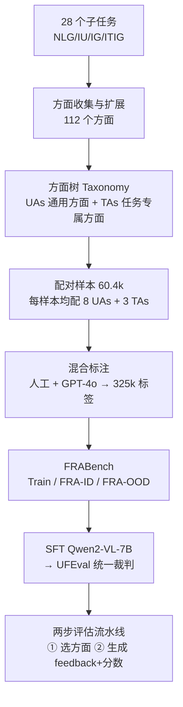

# FRABench and UFEval: Unified Fine-grained Evaluation with Task and Aspect Generalization

**会议**: ICLR 2026  
**OpenReview**: [https://openreview.net/forum?id=7WdY3Cojy9](https://openreview.net/forum?id=7WdY3Cojy9)  
**代码**: 待确认  
**领域**: MLLM 评估 / Fine-grained Evaluation / 多模态裁判模型  
**关键词**: MLLM-as-a-Judge, 细粒度评估, 方面泛化, 任务泛化, 评估基准, DPO 偏好对齐  

## 一句话总结
作者提出一棵覆盖 112 个评估方面的层级化"方面树"，据此构建了横跨文本生成、图像理解、图像生成、图文交错生成四类任务的 60.4k 配对、325k 标签的细粒度评估数据集 FRABench，并训练出第一个具备"任务+方面"双重泛化能力的统一裁判模型 UFEval——核心论点是评估方面之间天然互联、多任务联合学习能产生协同增益。

## 研究背景与动机
**领域现状**："MLLM-as-a-Judge"（用大模型当裁判去给开放式输出打分）已成为评估多模态模型自由生成质量的主流范式，从粗粒度的整体打分（如 ImageReward、Auto-J）逐步走向细粒度的多方面评估（如 Themis、LLaVA-Critic、VisionReward）。

**现有痛点**：现有裁判模型有两个硬约束。其一是**方面受限**——它们只学了特定的评估方面（如文本只看流畅度、图像只看质量），换一个没见过的方面就抓瞎；其二是**任务/模态受限**——一个模型通常只服务单一任务和单一模态（要么只评 NLG、要么只评图像生成），覆盖面极窄。对照表 1 里，此前最广的 Auto-J 也只支持 NLG 单任务，VisionReward 只覆盖图像生成的 37 个方面。

**核心矛盾**：要做一个"什么任务、什么方面都能评"的统一裁判，必须有大规模、多模态、方面级标注的训练资源——但这种数据当时根本不存在，现有数据集几乎都只标"整体质量"而非细粒度方面。资源缺口卡死了统一评估器的训练。

**本文目标**：先补上数据缺口（造 FRABench），再用它训出一个跨四任务、跨方面都能泛化的统一细粒度裁判（UFEval）。

**核心 idea**：**[评估方面天生互联，可迁移泛化]** 作者主张评估方面之间存在内在关联——比如 engagement、naturalness、creativity 语义相近，学会一个就能迁移到没见过的方面；**[多任务联合学习有协同增益]** 同时学多个视觉任务/方面会相互促进，例如学图像描述里的物体对齐，能帮到多图场景下的角色一致性评估。这两条假设是整篇论文的立论根基。

## 方法详解

### 整体框架
方法分两大块：先用文献调研+跨任务迁移凑齐 112 个方面并组织成一棵"方面树"（taxonomy），再基于这棵树为每条样本挑选相关方面、用"人工+GPT-4o"混合标注造出 FRABench 数据集，最后在这套数据上 SFT 出 Qwen2-VL-7B 底座的统一裁判 UFEval。评估时走"先选方面、再打分"两步流水线。

### 关键设计

**1. 层级化"方面树"：把 112 个零散方面拆成通用 vs 任务专属两棵子树。** 作者先从四类任务下的 28 个子任务里收集已有评估方面（覆盖文本/图文输入 × 文本/图像/图文输出的全部六种组合），对图文交错生成（ITIG）这种方面稀缺的任务，用跨任务迁移补齐——比如故事生成（NLG）和视觉故事补全（ITIG）都涉及叙事，于是把 engagingness 这类方面适配过去。组织成树时以"overall"为根，向下分成两棵子树：**通用方面（UAs）** 与任务无关、只衡量输出本身质量、通常依模态而定（文本看 fluency、图像看 fidelity）；**任务专属方面（TAs）** 与任务强绑定、衡量任务完成度（故事生成的 engagingness、数学推理的 accuracy）。对没有现成层级结构的方面，作者用**双向匹配策略**插入：若剩余方面名出现在已有节点定义里就递归下沉做子节点，反之若根节点名出现在该方面定义里则该方面更宽泛、上提为父节点；都匹配不上的则单独立为新根，避免硬塞造成误分类。这棵树是后续选方面、保证覆盖度的脚手架。

**2. 配对式细粒度数据集构建：每条样本挂多个方面，混合标注控成本控偏置。** FRABench 放弃逐点打分、采用配对比较（pointwise 更易受上下文偏置、且配对更适合奖励模型训练）。具体先从 28 子任务采集问题生成配对响应——29.3k 来自公开数据集、30.1k 用不同 MLLM 自行生成——再按方面树给每条配对样本平均挂上 **8 个 UAs + 3 个 TAs**。标签来自两路：一路直接复用 ImageRewardDB 的三方面人工标注（再用 GPT-4o 补 feedback），另一路对绝大多数缺人工标注的方面用 GPT-4o 标。这里有两个工程细节很关键：评估 UAs 时**只给响应、不给原 query**，因为发现 GPT 评通用质量时常把"回答是否正确"混进去污染判断；以及为缓解位置偏置，把多数类里超额样本的一半响应位置对调后重标，让"响应1优于响应2"和反向的样本数量平衡。最终产出 **325k** 条细粒度标签。

**3. 任务/方面双轴的 OOD 划分：专门设计基准来验证"两种泛化"。** 为了能真正检验泛化能力，作者把 FRABench 切成训练集、域内测试 FRA-ID 和域外测试 FRA-OOD。划分不是随机切，而是按"见过/没见过"双轴精心设计：训练与 FRA-ID 用 18 个随机选的子任务，覆盖 22 个 UAs + 35 个 TAs；**FRA-OOD 则是 10 个完全没见过的子任务，里面同时包含 28 个见过的 UAs（用来测任务泛化）和 27 个没见过的 TAs（用来测方面泛化）**。这样测任务泛化时固定用见过的方面、只换没见过的任务，测方面泛化时反之，干净地分离了两个变量。此外还额外人工标注出 FRA-ID-H / FRA-OOD-H（各 6.9k/6.0k）作为"与人类判断一致性"的金标准测试集。

**4. SFT 统一裁判 + 两步评估流水线。** UFEval 以 Qwen2-VL-7B-Instruct 为底座、在训练集上做 SFT。推理时走两步：先根据任务属性和输出模态从 TAs 树和 UAs 树里选出合适的方面（比如问题问"橙色狗旁边的猫图"、而图里没有相邻的猫，就触发 Context Inconsistency 这类幻觉方面；又因输出是文本，从 UAs 的文本分支选方面），再针对选出的方面生成 feedback 和分数。这种"先选方面再评"的设计让一个模型能灵活适配任意任务+方面组合，也是它能做方面泛化的载体。

## 实验关键数据

### 主实验表格（域外泛化，平均准确率，节选 FRA-OOD-H 人工集）

| 方法 | 任务泛化 NLG/IU/IG/ITIG | 方面泛化 NLG/IU/IG/ITIG |
|------|------|------|
| GPT-4o | 84.0 / 82.1 / 72.3 / 93.1 | 83.2 / 82.1 / 74.2 / 93.1 |
| Claude-3.5 | 83.0 / 76.5 / 63.1 / 91.0 | 82.6 / 76.5 / 65.1 / 91.0 |
| Qwen2VL-72B | 78.3 / 75.3 / 48.6 / 83.7 | 77.3 / 75.3 / 53.8 / 83.7 |
| Qwen2VL-7B(底座) | 50.9 / 65.9 / 40.9 / 44.3 | — |
| **UFEval(ours, 7B)** | **79.0 / 80.9 / 62.1 / 90.6** | **78.3 / 80.9 / 66.1 / 90.6** |

仅 7B 的 UFEval 在多数任务上逼近甚至持平 GPT-4o/Claude-3.5，远超同尺寸 Qwen2VL-7B 底座，验证了双重泛化能力。

### 消融实验表格（多任务联合学习的协同增益 / DPO 下游应用）

| 实验 | 配置 | 结果 |
|------|------|------|
| 多任务协同（IU 评估） | 仅学 IU vs 联合学 IU+IG | 联合训练总体准确率更高 |
| IU 模型 DPO（LLaVA-Next-7B, MMHal↑） | 基线 2.05 / LLaVA-Critic 2.24 / **UFEval 2.41** | UFEval 生成的偏好数据对齐效果最好 |
| IG 模型 DPO（SDXL, HPSv2↑） | 基线 28.1 / Pick-a-Pic 28.7 / **UFEval 29.9** | 优于人工数据集 Pick-a-Pic |

### 关键发现
- **方面可泛化**：在没见过的 TAs 上 UFEval 仍保持高准确率，印证"方面互联→可迁移"的核心假设。
- **多任务协同**：联合学 IU+IG 比只学 IU 评得更准，多个视觉任务/方面联合学习确有相互增益。
- **下游可用**：UFEval 自动构造的偏好对数据用于 DPO，在图像理解（MMHal、LLaVABench）和图像生成（HPSv2、ImageReward）上都超过 LLaVA-Critic / Pick-a-Pic，证明它不只是个打分器，还是高质量偏好数据生产工具。

## 亮点与洞察
- **把"评估方面"当一等公民来建模**：用一棵 UAs/TAs 双子树的层级树系统性组织 112 个方面，并明确区分"输出质量"与"任务完成度"，这个 taxonomy 本身就是有价值的资产。
- **OOD 划分设计很讲究**：刻意让任务泛化和方面泛化两个变量可分离地测，避免了"换了任务又换了方面、说不清是哪种泛化在起作用"的混淆。
- **小细节见功力**：评 UAs 时刻意不给 query（防 GPT 把正确性混进质量判断）、位置对调平衡（防位置偏置），都是从实操踩坑里抠出来的标注质量控制。
- **一鱼两吃**：裁判模型直接反哺生成模型对齐（DPO），把"评估器"和"奖励数据生成器"打通。

## 局限与展望
- **标签主要靠 GPT-4o**：325k 标签里绝大部分是 GPT-4o 标的，人工标注仅覆盖三个方面来自 ImageRewardDB，裁判的上限某种程度被 GPT-4o 的判断质量和偏好框定。
- **底座只到 7B**：UFEval 基于 Qwen2-VL-7B，在偏难的 IG 任务上（62.1）与 GPT-4o（72.3）仍有明显差距，统一性是以单任务峰值性能为代价换来的。
- **方面树构建含人工组织**：方面的收集、扩展、插入虽有双向匹配规则，但仍掺入人工判断，taxonomy 的客观性与可复现性有讨论空间。
- **配对范式**：采用配对比较虽规避了逐点打分的偏置，但实际部署常需要绝对分数，配对到绝对分的转换未充分展开。

## 相关工作与启发
- **粗粒度单任务评估**：PandaLM、Auto-J、ImageReward 给整体打分，缺乏诊断具体缺陷的粒度、易引入方面偏置。
- **细粒度单任务评估**：Themis（NLG）、LLaVA-Critic（IU）、VisionReward（IG）走向多方面，但跨任务/跨方面扩展性差；X-Eval 探索了方面泛化但只在 NLG、且未开源。
- **启发**：本文最值得借鉴的是"先把评估维度建成结构化 taxonomy、再据此组织训练数据"的思路——它把"评估能不能泛化"从玄学变成了可设计、可测量的工程问题；UFEval→DPO 的闭环也提示，统一裁判可以是数据飞轮的核心引擎。

## 评分
- **新颖性**: ⭐⭐⭐⭐ 首个"任务+方面"双重泛化的统一多模态裁判，方面树 taxonomy + 双轴 OOD 划分的组合思路新颖，立论（方面互联可迁移）清晰且被实验支撑。
- **实验充分度**: ⭐⭐⭐⭐ 覆盖四任务的 OOD 泛化、多个公开 benchmark 的 as-a-Judge、多任务协同消融、IU/IG 双向 DPO 下游应用，链条完整；唯 IG 任务绝对性能仍偏弱。
- **写作质量**: ⭐⭐⭐⭐ 立论—数据—模型—验证逻辑顺畅，对照表 1 定位清楚，标注细节交代到位。
- **价值**: ⭐⭐⭐⭐ FRABench（60.4k/325k）与方面树是可复用的社区资源，统一裁判 + 偏好数据生成的范式对多模态对齐有直接实用价值。

<!-- RELATED:START -->

## 相关论文

- [\[ICLR 2026\] Reliable Fine-Grained Evaluation of Natural Language Math Proofs](reliable_fine-grained_evaluation_of_natural_language_math_proofs.md)
- [\[ACL 2026\] IF-Critic: Towards a Fine-Grained LLM Critic for Instruction-Following Evaluation](../../ACL2026/llm_evaluation/if-critic_towards_a_fine-grained_llm_critic_for_instruction-following_evaluation.md)
- [\[ACL 2026\] LoCar: Localization-Aware Evaluation of In-Vehicle Assistants through Fine-Grained Sociolinguistic Control](../../ACL2026/llm_evaluation/locar_localization-aware_evaluation_of_in-vehicle_assistants_through_fine-graine.md)
- [\[ACL 2026\] Rethinking Meeting Effectiveness: A Benchmark and Framework for Temporal Fine-grained Automatic Meeting Effectiveness Evaluation](../../ACL2026/llm_evaluation/rethinking_meeting_effectiveness_a_benchmark_and_framework_for_temporal_fine-gra.md)
- [\[ACL 2026\] K-MetBench: A Multi-Dimensional Benchmark for Fine-Grained Evaluation of Expert Reasoning, Locality, and Multimodality in Meteorology](../../ACL2026/llm_evaluation/k-metbench_a_multi-dimensional_benchmark_for_fine-grained_evaluation_of_expert_r.md)

<!-- RELATED:END -->
