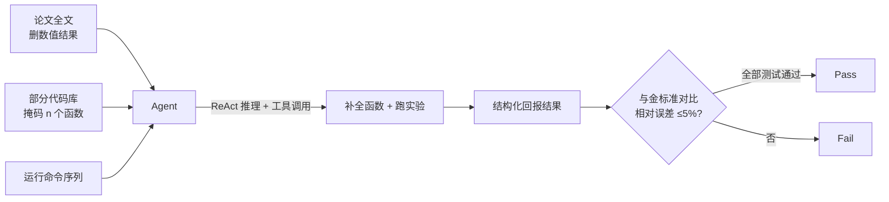

# From Reproduction to Replication: Evaluating Research Agents with Progressive Code Masking

**会议**: ICLR 2026  
**OpenReview**: [https://openreview.net/forum?id=qBcHWGBnIb](https://openreview.net/forum?id=qBcHWGBnIb)  
**代码**: [https://github.com/j1mk1m/AutoExperiment](https://github.com/j1mk1m/AutoExperiment)  
**领域**: LLM 评测 / 科研 Agent Benchmark / 代码生成  
**关键词**: 研究 Agent、实验复现、渐进式代码掩码、Pass@k、可交互 Agent、测试时计算

## 一句话总结
提出 AUTOEXPERIMENT 基准：给 Agent 一篇论文 + 一份被「渐进式掩码」掉若干关键函数的代码库 + 运行命令，让它补全缺失代码、跑实验并报告结果，通过调节掩码函数数量 $n$ 在「复现(reproduction)」与「从零复刻(replication)」之间连续插值，量化研究 Agent 的真实能力边界。

## 研究背景与动机
- **领域现状**：自主代码生成的进展点燃了「AI Agent 加速科学发现」的期待——让 Agent 自己跑实验、验证想法。已有大量代码生成基准（HumanEval、MBPP、SWE-Bench 等），近期也出现了科研向基准，但它们要么只评「复现」（给完整代码、只要跑通），要么只评「复刻」（只给论文文字、从零写代码）。
- **现有痛点**：这些基准的难度是**固定**的——要么太简单（代码全给），要么太难（什么都不给），无法刻画两端之间的连续光谱。现实里研究者拿到的往往是「部分可用的代码 + 论文描述」，需要在已有脚手架上补全核心逻辑。
- **核心矛盾**：缺少一个能**连续调节难度**、又能保证「论文描述↔代码实现」强对应的高质量测试床，导致我们无法回答「Agent 到底能在多大程度上自主实现科研实验」。
- **本文目标**：构造一个难度可控的基准，量化 Agent 从「复现」到「复刻」全过程的性能衰减，并借此考察可交互性、测试时计算、自然语言上下文等因素的作用。
- **核心 idea**：**渐进式代码掩码（Progressive Code Masking）**——从已被同行复刻验证过的论文代码库中，逐步掩码掉 $n$ 个核心函数（替换为 `NotImplementedError`），用 $n$ 作为难度「旋钮」，把复现与复刻统一进一个连续谱系。

## 方法详解

### 整体框架
AUTOEXPERIMENT 的每个任务包含三份输入：完整论文（含实验描述但**删除所有数值结果**以防作弊）、被掩码掉 $n$ 个关键函数的代码库、以及运行实验的命令序列。Agent 需在 Docker 沙箱中补全缺失函数、执行命令、并以结构化格式回报实验数值；评测时把 Agent 报告的结果与「金标准原始代码」跑出的结果逐项比对，相对误差 $\le 5\%$ 才算该测试用例通过，一个样本需全部测试用例通过才判为 Pass。

### 关键设计
**1. 渐进式掩码作为难度旋钮：用 $n$ 把复现与复刻连成一条线。** 作者从 ML Reproducibility Challenge(MLRC) 里精选 4 篇「既可复现又可复刻」的同行验证论文，掩码掉 85 个承载核心实验逻辑的函数（平均每个 26.3 行、含 15.9 次函数/库调用），每个函数被掩码即产生运行错误以保证其「不可或缺」。当同时掩码 $n$ 个函数时，每种组合就是一个样本：$n=1$ 有 85 个样本，$n=5$ 时组合数暴涨到 $275{,}990$（对单篇 23 个函数的论文贡献 $\binom{23}{n}$ 个样本）。为控制运行时间，每个 $n$ 固定抽样最多 100 个样本评测。随 $n$ 增大，样本虽数量固定但抽自越来越多样的组合，难度从「补一个函数」平滑过渡到「重写整个代码库」。

**2. 可交互 Agent 架构 vs 固定 agentless 流水线。** Agent 由五个组件定义：初始 prompt、工具定义（导航仓库、增删改文件、执行脚本，类似 Huang et al. 2024）、逐步提示策略（主实验用 **ReAct**：每步输出自然语言思考+动作）、历史管理（主实验用 Full history，保留全部交互历史）、骨干 LLM。关键对照是「动态交互」与「固定 agentless 三步流水线（检索→代码填充→跑实验取结果）」：后者用 embedding（text-embedding-3-small）做文本+代码的 top-k 余弦相似检索再让 LLM 一次性补全。每个样本限 50 步动作、30 分钟、$1 美元算力预算，全程在预配好 conda 环境的 Docker 内运行以保证安全与可复现。

**3. 防数据污染设计。** 由于新模型可能在训练时见过这些公开仓库，作者用两重证据论证污染风险低：一是即便在最简单的 $n=1$ 设定下，最强 Agent 通过率也 $<40\%$，若被污染不该这么低；二是用 Shi et al. 2024 的污染检测，对 Qwen2.5-1.5B、Qwen2.5-Coder-32B、openhands-lm-32b 测得污染分仅 35%/51%/57%，远低于判定阈值 85%。此外基准设计本身支持「按文档化流程持续生成新版本数据集」来抵御未来污染。

**4. 多维度评测指标：Pass@1、Pass@k、Pass^k 与 Verifier。** 除单次成功率 Pass@1 外，引入 Pass@k（生成 $k$ 个解、取最好）来衡量「搜索+完美验证器」的上限潜力，Pass^k（$k$ 个解**全部**正确）来衡量稳定性，以及「模型自验证器(Verifier)」来考察当前模型作为重排器能回收多少 Pass@k 增益。这套指标直接服务于「验证器/搜索是否值得投入」这一研究问题。

## 实验关键数据

### 主实验：渐进式掩码下的性能衰减（Pass@1, %）

| Backbone | $n{=}1$ | $n{=}2$ | 趋势 |
|---|---|---|---|
| Claude-3.7-Sonnet | 36.5 | 9.6 | 急剧下滑 |
| GPT-4o | 35.3 | 8.5 | 急剧下滑 |
| Claude-3.5-Sonnet | 31.8 | 9.6 | 急剧下滑 |
| GPT-4o-mini | 27.1 | 2.1 | 几近失败 |

从 $n=1$ 到 $n=2$，性能平均**暴跌 70–90%**；到 $n=5$ 时大多数模型通过率已可忽略——印证「越靠近从零复刻越难」。

### 关键对照实验

| 维度 | 设定 A | 设定 B | 结论 |
|---|---|---|---|
| 交互方式 (GPT-4o) | Fixed 8.3 | Dynamic 35.3 | 动态交互 **>4.0x** 提升 |
| 交互方式 (o3-mini) | Fixed 27.8 | Dynamic 33.3 | 动态交互仍占优 |
| Pass@k (GPT-4o) | Pass@1 35.3 | Pass@5 48.2 | 缺口 **+12.9pt** |
| Pass@k (Claude-3.5) | Pass@1 31.8 | Pass@5 42.2 | 缺口 **+10.4pt** |
| 自然语言上下文 ($n{=}1$) | No-ctx 34.1 | Full-ctx 35.3 | 几乎无差 |
| 自然语言上下文 ($n{=}4$) | No-ctx 全失败 | Full-ctx 显著更好 | 论文文本随 $n$ 增大愈发关键 |

### 关键发现
- **可交互性是核心**：动态 Agent 远超固定 agentless 流水线，部分原因是**调试能力**——69.4% 的首次尝试会崩溃，但 29.1% 的运行能恢复到可运行状态、18.6% 最终得到正确代码；纯推理模型在固定范式下无法享受这种多步调试增益（o1 崩溃率 75.0%、o3-mini 66.7%）。
- **扩 step 比扩 reasoning token 更有效**：固定设定下扩推理 token 仅把 o1/o3-mini 从 11.1%/8.3% 抬到峰值 22.2%/27.8% 便见顶；而动态设定下扩交互步数可饱和到约 38.9%。
- **Pass@k 缺口大**：>10pt 的 Pass@1→Pass@5 缺口意味着「更好的验证器/RL 优化策略」单凭重排就有巨大提升空间；模型自验证只能回收一部分，距 oracle 仍远。
- **自然语言依赖随难度上升**：$n=1$ 时信息常可从其余代码风格反推，论文文本几乎无用；但 $n$ 越大、可参照的代码越少，论文描述越关键。

## 亮点与洞察
- **「难度旋钮」是真正优雅的设计**：用一个整数 $n$ 把复现与复刻这两类此前割裂的基准统一进连续谱，既能定位每个模型的「断崖点」，又能解耦考察各因素随难度的变化趋势。
- **以「已被同行复刻」的 MLRC 论文为种子**，从根上保证了「论文描述↔代码实现」的强对应与可验证性，牺牲数量换质量，这是基准可信度的基石。
- **把「调试」量化为成功的关键路径**（崩溃率/恢复率/最终正确率三个数），为「为什么可交互 Agent 更强」给出了机制性解释，而非泛泛归因。
- **Pass@k 缺口直接转化为研究议程**：明确指向「验证器重排 / 搜索 / RL」三条可立即落地的改进方向。

## 局限与展望
- **规模偏小**：仅 4 篇论文、85 个函数，领域覆盖窄；虽然作者论证了「质量优先」，但跨学科泛化性存疑，能否扩展到更多领域的论文仍待验证。
- **被测模型已偏旧**：主实验以 GPT-4o/Claude-3.5/3.7、o1/o3-mini 为主，未涵盖更新一代强推理 Agent，绝对数值会随模型迭代过时。
- **5% 相对误差阈值偏经验**：部分实验为缩短运行时间做了「curtailed」处理（如减训练步数），虽称与原测试高精度对齐，但可能影响判定边界。
- **展望**：作者已给出可持续生成新版数据集的流程以抵御污染；后续最自然的延伸是基于 Pass@k 缺口去做验证器/搜索/RL，把离线潜力变成在线增益。

## 相关工作与启发
- **代码生成基准**：HumanEval、MBPP、APPS、SWE-Bench 评测一般/仓库级代码能力，但不涉及「实现科研实验」这一独特挑战。
- **科研复现/复刻基准**：Bogin et al.(2024) 评「复现」（只跑不写），Starace et al.(2025)、Hua et al.(2025) 评「复刻」（只给论文从零写）——AUTOEXPERIMENT 用 $n$ 把这两端连续化，是其核心差异点。
- **Agent 架构与 agentless**：借鉴 ReAct(Yao et al. 2023) 与 Agentless(Xia et al. 2024) 在 SWE-Bench 上的成功，本文给出「动态交互显著优于固定流水线」的反向证据，提示科研实验任务比补丁修复更依赖在线调试。
- **测试时计算**：复用 Muennighoff et al.(2025) 的推理 token 控制法，发现在本任务上扩 step 远比扩 token 划算，对「如何分配测试时计算」有启发。

## 评分
- **新颖性**: ⭐⭐⭐⭐ 「渐进式掩码 + $n$ 作难度旋钮」把复现/复刻连续化，是一个简洁而原创的基准设计视角。
- **实验充分度**: ⭐⭐⭐⭐ 覆盖多模型、可交互性、测试时计算、Pass@k、自然语言依赖、数据污染等多维消融，机制分析扎实；扣分在论文/函数规模偏小。
- **写作质量**: ⭐⭐⭐⭐ 动机清晰、图表与发现对应明确，三大 key finding 提纲挈领。
- **价值**: ⭐⭐⭐⭐ 为「AI 自动化科研」提供了一个难度可控、抗污染的可信测试床，Pass@k 缺口直接指明改进路径，对评测与 Agent 研究都有实用价值。

<!-- RELATED:START -->

## 相关论文

- [\[ICLR 2026\] ResearchRubrics: A Benchmark of Prompts and Rubrics For Evaluating Deep Research Agents](researchrubrics_a_benchmark_of_prompts_and_rubrics_for_evaluating_deep_research_.md)
- [\[ICLR 2026\] DeepResearch Bench: A Comprehensive Benchmark for Deep Research Agents](deepresearch_bench_a_comprehensive_benchmark_for_deep_research_agents.md)
- [\[ICLR 2026\] AstaBench: Rigorous Benchmarking of AI Agents with a Scientific Research Suite](astabench_benchmarking_ai_agents.md)
- [\[ICLR 2026\] Do LLM Agents Know How to Ground, Recover, and Assess? Evaluating Epistemic Competence in Information-Seeking Agents](do_llm_agents_know_how_to_ground_recover_and_assess_evaluating_epistemic_compete.md)
- [\[ICLR 2026\] HackWorld: Evaluating Computer-Use Agents on Exploiting Web Application Vulnerabilities](hackworld_evaluating_computer-use_agents_on_exploiting_web_application_vulnerabi.md)

<!-- RELATED:END -->
