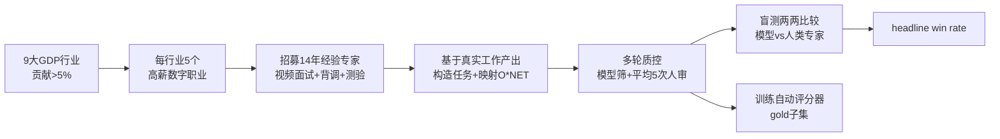

# GDPval: Evaluating AI Model Performance on Real-World Economically Valuable Tasks

**会议**: ICLR 2026  
**OpenReview**: [https://openreview.net/forum?id=hcuEdq6eKD](https://openreview.net/forum?id=hcuEdq6eKD)  
**代码/数据**: [Hugging Face dataset: GDPval](https://huggingface.co/datasets/openai/gdpval) ；自动评分服务 evals.openai.com  
**领域**: LLM 评估 / 真实世界经济价值任务基准  
**关键词**: 经济价值任务, 知识工作, 人类专家对比, win rate, O*NET, 多模态 deliverable, 自动评分器  

## 一句话总结
GDPval 是 OpenAI 提出的一个面向"真实经济价值数字知识工作"的基准：覆盖美国 GDP 贡献最大的 9 个行业、44 个职业、1320 个由 14 年经验专业人士构造的真实任务，用"模型 vs 人类专家盲测胜率"为核心指标，发现前沿模型的交付质量正逐年线性逼近行业专家。

## 研究背景与动机
- **领域现状**：衡量 AI 经济影响的主流做法依赖采用率、使用模式、归因 GDP 增长等宏观指标。而历史上电力、飞机、计算机等技术从发明到全经济渗透往往需要数年甚至数十年，受制于监管、文化与流程的滞后。
- **现有痛点**：这些宏观指标都是**滞后指标**——等到经济数据显现影响时，模型能力早已变化。而现有 AI benchmark 又走向另一极端：要么是学术考试式的纯推理难题（HLE、MMLU、GPQA），要么聚焦单一领域（如 SWE 软件工程），既不贴近真实工作产出，也无法代表广泛职业。
- **核心矛盾**：要在 AI 大规模落地**之前**就评估它的经济相关性，必须直接测量模型能力，但"真实经济价值工作"既难以构造（需要专业领域知识与真实交付物）又难以自动评分（涉及结构、风格、美观、相关性等主观维度）。
- **本文目标**：构建一个**贴近真实、覆盖广、长时程、有经济价值标价、且不会很快饱和**的基准，直接度量前沿模型在真实知识工作上的交付能力。
- **核心 idea**：**自上而下从 GDP 出发选职业**——先选 GDP 贡献 >5% 的 9 大行业，再选每行业薪酬最高且"以数字为主"的 5 个职业，由资深从业者基于真实工作产出构造任务；**放弃自动评分作主指标，改用"模型交付物 vs 人类专家交付物"的盲测两两比较胜率（win rate）**，使指标永不饱和、可随更强基线持续演进。

## 方法详解

### 整体框架
GDPval 不是一个模型方法，而是一条"职业优先级排序 → 专家招募 → 任务构造 → 多轮质控 → 人类/自动盲测评分"的数据集构造与评估流水线。最终产物是 1320 个全集任务（每职业 ≥30 个）与 220 个开源 gold 子集任务（每职业 5 个），每个任务由一份请求（含最多 38 个参考文件）和一份专家交付物组成，并以两两盲测胜率为核心评估指标。

### 关键设计
**1. 自上而下的职业代表性采样：让基准"代表经济"而非"代表数据集"** GDPval 的代表性来自一套严格的经济学采样而非随便挑任务。先用 2024 Q2 各行业增加值占 GDP 比例筛出贡献 >5% 的 9 个行业（合计覆盖约 \$3T 年薪酬），再在每个行业内选对总薪酬贡献最大且"以数字工作为主"的 5 个职业。"是否数字职业"用任务级方法判定：从 O*NET 取该职业全部任务，让 GPT-4o 逐条判为数字/非数字，并按 O*NET 的"相关性/重要性/频率"打分加权，若加权后 ≥60% 任务为数字则该职业入选。这套度量还与 Acemoglu & Autor 的任务内容框架对齐（数字任务随非常规认知内容上升、随常规与体力内容下降），从经济学上验证了代表性。

**2. 真实专家驱动的任务构造与经济价值标价** 任务不是凭空设计，而是由资深从业者基于自己真实做过的工作产出来构造，再映射回 O*NET 职业任务以保证覆盖面。专家门槛极高：≥4 年经验（实际平均 14 年）、有晋升/管理履历，还需通过视频面试、背景调查、培训与测验。每个任务都被标注难度、代表性、完成时长与整体质量；其**美元价值**由专家自报完成时长 × 该职业 OEWS 中位时薪估算得到。任务天然长时程——平均需专家约 7 小时，高端可达数周——并要求处理 CAD、图片、视频、音频、幻灯片、表格等多模态格式，gold 子集每任务最多 17 个参考文件、全集最多 38 个。

**3. 以"盲测胜率"为不饱和主指标 + 多轮质控保真** 由于自动评分这类复杂主观交付物极难，GDPval 把**人类专家两两盲测比较**定为主指标：将模型与人类专家的交付物去标识后交给同职业专家排序，"哪份更好地完成了请求"。指标为 win rate（含平局），既能容纳结构、风格、美观、相关性等主观因素，又**没有上限**——可不断把人类基线替换成更强模型继续评测，规避了传统准确率快速饱和的问题。每个任务还经过模型自动筛查 + 平均 5 次（最少 3 次）人类专家评审的迭代修订以确保真实度与质量。形式化地，对模型 $m$，其胜率为
$$\text{WinRate}(m)=\frac{1}{|T|}\sum_{t\in T}\mathbb{E}_{g}\big[\mathbb{1}[\text{deliverable}_m(t)\succeq_g \text{deliverable}_{human}(t)]\big]$$
其中 $g$ 为专家评分者、$\succeq_g$ 表示"不劣于"（赢或平）。

**4. 实验性自动评分器：便宜快但仍是辅助** 为降低评分成本（人工每对比较平均耗时 >1 小时），作者为 gold 子集训练了一个自动评分模型，输入请求、参考文件、两份交付物与一份 rubric，输出哪份更优。它与人类专家评分达成 **66% 一致率**，仅比人类评分者之间的互评一致率 71% 低 5%。但作者明确指出其局限（模型倾向偏好自己的输出），因此仍**推荐人类比较为主**，自动评分器仅作公开的研究便利工具。它的真正价值在于：把"自动评分这类主观交付物有多难"本身也变成一个可量化的研究问题，gold 子集的多模态主观任务恰好是检验自动评分器能力的天然测试床。

## 实验关键数据

### 主实验（gold 子集，模型 vs 人类专家盲测胜率）
评测模型：GPT-4o、o4-mini、o3、GPT-5、Claude Opus 4.1、Gemini 2.5 Pro、Grok 4。每个 prompt 采样 3 次、每样本 3 位评分者（共 9 次比较/prompt/模型 × 220 任务）。

| 现象 | 结果 |
|------|------|
| 最佳模型 | **Claude Opus 4.1**，赢或平人类专家的交付物占 **47.6%**（近一半任务追平/超越专家） |
| Claude 强项 | 美观（文档排版、幻灯片布局），在 .pdf/.xlsx/.ppt 等多模态文件类型上更优 |
| GPT-5 强项 | 指令遵循（交付格式、章节齐全），纯文本任务上更优 |
| 时间趋势 | OpenAI 前沿模型在 GDPval 上的表现**随时间近似线性提升** |

### 关键子实验

| 实验 | 关键数据 |
|------|----------|
| 推理力度 ↑ | o3 提升至多 **4.3pp**，GPT-5 提升 **6.1pp**（low→high reasoning effort） |
| Prompt + scaffolding | 给 GPT-5 加"检查正确性/渲染文件查布局/避免非标准 unicode/控制冗余"的通用提示 + GET 请求 + best-of-4（GPT-5 judge），人类胜率再 **+5pp** |
| 多模态自检 | Prompt 让 agent 用多模态检查交付物的比例 **15%→97%**；完全消除 PDF 黑方块伪影（原先 >50% PDF 受影响）；PPT 严重格式错误从 **86%→64%** |
| 速度/成本 | "试 N 次不满意再自己做"设定下，模型 + 专家监督相比无辅助专家可同时**省时省钱** |
| 失败归因 | 专家偏好人类交付物的主因是模型**未完全遵循指令**；Grok/Gemini 常承诺却不交付、忽略参考数据、用错格式；Claude/GPT-5 指令遵循更好但仍偶有幻觉/算错 |

### 关键发现
- 前沿模型在真实经济价值任务上已**逼近行业专家**，且提升轨迹随时间线性外推。
- 模型间出现明显**能力分化**：Claude 系在多模态/美观文件上占优，GPT-5 在纯文本/指令遵循上占优，说明"单一总分"难以刻画真实工作能力，需按任务类型分别看。
- 大量失败是"显而易见的格式错误"，通过 prompt/scaffolding 即可廉价修复——暗示训练或脚手架让 agent 更细致、更充分用其多模态能力是明确的提升路径。
- 自动评分器一致率（66%）接近人类互评（71%），但仍不足以替代人评。
- 速度成本实验表明，真正可落地的形态可能是"模型 + 专家监督"的人机协作，而非全自动替代。

## 亮点与洞察
- **把"经济"装进 benchmark**：用 GDP/薪酬/O*NET 自上而下采样，使基准的职业分布真实映射美国经济结构，而非数据集偏好，这是与既有 benchmark 最本质的区别。
- **不饱和的胜率指标**：以"对人类专家的相对胜率"为核心，天然规避准确率饱和，可把基线持续替换为更强模型，使 benchmark 具备多年生命力。
- **长时程 + 多模态 + 主观性**：平均 7 小时、最多 38 个参考文件、CAD/音视频/幻灯片等格式，逼近真实知识工作的复杂度，也成为评测自动评分器的天然测试床。
- **可操作的提升信号**：失败模式分析直接给出"很多输还是因为格式/指令细节"，并验证 prompt+scaffolding 的廉价收益，对工程落地极有指导性。
- **人机协作的现实图景**：速度成本实验不鼓吹"全自动替代"，而是给出"模型先做、专家审改"的可量化省时省钱路径，更贴近真实生产部署。

## 局限与展望
- **仅覆盖自包含的数字知识工作**：体力/物理任务、需要大量隐性知识、涉及 PII、依赖专有软件或人际沟通的任务均被排除，覆盖面仍是"数字白领"的子集。
- **只取每行业前 5 高薪职业、9 大行业**：受数据预算限制，并非全经济覆盖，作者计划后续扩展行业与职业。
- **自动评分器尚不可靠**：模型倾向偏好自身输出，gold 子集也未对全部任务提供自动评分结果，人评成本（每对 >1 小时）仍是规模化瓶颈。
- **盲测可能不完全盲**：风格差异（OpenAI 爱用破折号、Claude 常用第一人称、Grok 自称 Grok）可能让专家推断出模型来源。
- **基线本身在移动**：当前以人类专家为基线，但模型逼近后需要替换更强基线，如何保证不同代际基线之间的可比性是后续要解决的问题。
- **展望**：未来版本将增加广度、真实性、交互性与上下文细节，并可能用更强模型替换人类基线持续演进。

## 相关工作与启发
- **vs 推理难题 benchmark**（HLE / MMLU / GPQA）：那些聚焦推理难度与可自动判分，GDPval 聚焦真实工作产出与主观交付质量，互补而非替代。
- **vs 单领域 benchmark**（如 SWE 软件工程）：GDPval 强调跨 44 职业的代表性广度。
- **vs 任务内容经济学框架**（Acemoglu & Autor 2011；Eloundou et al. 2023 的 GPT 暴露度研究）：GDPval 借用其任务级数字化判定与非常规认知内容相关性，把经济学度量与 AI 能力度量打通。
- **vs 宏观经济指标**（采用率、归因 GDP）：GDPval 是直接、可归因、领先于落地的能力度量，弥补宏观指标的滞后性。
- **vs 生产使用分析**（Claude/ChatGPT 使用画像）：GDPval 在其上做了补充，覆盖模型采用尚在萌芽的职业领域，避免只评测已被大量使用的场景。
- **启发**：①"自上而下从外部真值（GDP/O*NET）采样"是构造代表性 benchmark 的范式，可迁移到教育、医疗等领域；②当任务复杂到无法自动判分时，"相对人类基线的盲测胜率"是值得借鉴的不饱和评估范式；③失败模式聚类 + 廉价 prompt 修复的闭环，对 agent 工程极具示范意义。
- **更广的影响**：GDPval 把"AI 的经济影响"从事后宏观统计提前为事前能力度量，为政策制定、劳动力转型与企业部署决策提供了一个可复现、可逐年追踪的基础设施级标尺；其"开源 gold 子集 + 公开自动评分服务"的形态也降低了后续研究的复现门槛。
- **方法论可复用性**：整条"经济学采样 → 专家构造 → 多轮质控 → 盲测胜率"的流水线本身就是一份可被其他高价值领域（法律、金融、医疗）照搬的 benchmark 构造蓝图。

## 评分
- 新颖性: ⭐⭐⭐⭐ — "从 GDP 自上而下采样真实经济价值任务 + 不饱和盲测胜率"的基准范式有明显原创性，弥补了既有评测在真实性与经济相关性上的空白。
- 实验充分度: ⭐⭐⭐⭐⭐ — 7 个前沿模型、220 gold 任务 × 9 次比较、推理力度/scaffolding/速度成本/失败归因等多维消融，工程与分析都非常扎实。
- 写作质量: ⭐⭐⭐⭐ — 动机—构造—评测—发现脉络清晰，图表与附录详尽；细节繁多但组织得当。
- 价值: ⭐⭐⭐⭐⭐ — 开源 220 任务 + 公开自动评分服务，为"AI 经济影响"提供了可复现、可演进的能力度量基础设施，行业与政策意义重大。

<!-- RELATED:START -->

## 相关论文

- [\[ICLR 2026\] CyberGym: Evaluating AI Agents' Real-World Cybersecurity Capabilities at Scale](cybergym_evaluating_ai_agents_real-world_cybersecurity_capabilities_at_scale.md)
- [\[ACL 2026\] Beyond Itinerary Planning: A Real-World Benchmark for Multi-Turn and Tool-Using Travel Tasks](../../ACL2026/llm_evaluation/beyond_itinerary_planning-a_real-world_benchmark_for_multi-turn_and_tool-using_t.md)
- [\[ICLR 2026\] Pitfalls in Evaluating Language Model Forecasters](pitfalls_in_evaluating_language_model_forecasters.md)
- [\[ICLR 2026\] PACEbench: A Framework for Evaluating Practical AI Cyber-Exploitation Capabilities](pacebench_a_framework_for_evaluating_practical_ai_cyber-exploitation_capabilitie.md)
- [\[ICLR 2026\] MLE-Smith: Scaling MLE Tasks with Automated Multi-agent Pipeline](mle-smith_scaling_mle_tasks_with_automated_multi-agent_pipeline.md)

<!-- RELATED:END -->
